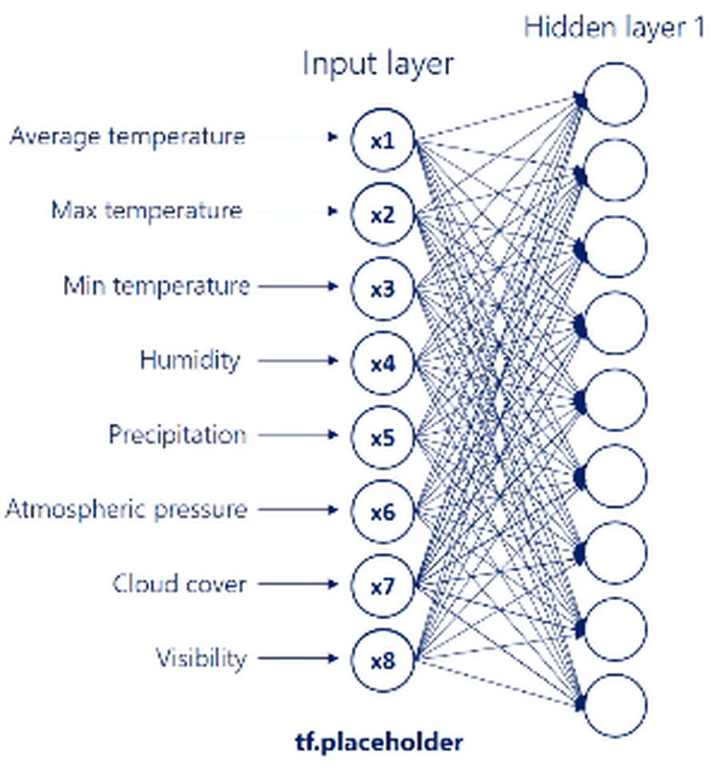
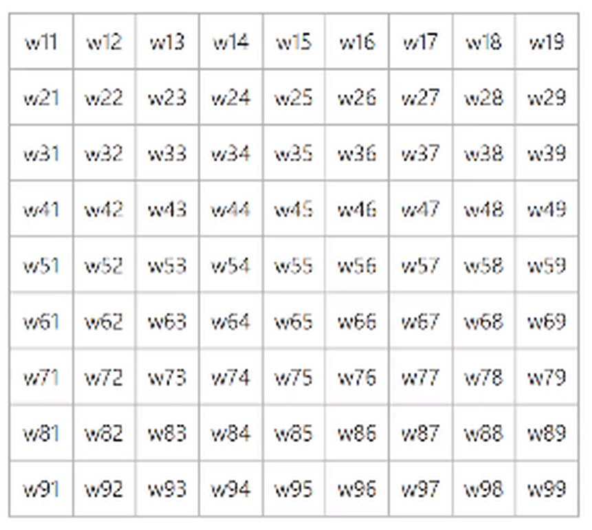

# Arquitectura de una red

## La intuición: un circuito que se ajusta solo

Un auto con sensores, "viene algo por la izquierda", "estoy cerca de la pared", conectados por cables a dos actuadores, el acelerador y el freno. Entre medio hay nodos que reparten la electricidad. **Eso es, literalmente, una red neuronal.**

Cada nodo tiene una compuerta que decide si conduce mucha, poca o ninguna señal hacia el siguiente. Ese "cuánto deja pasar" es todo el secreto.

**Entrenar es ajustar qué caminos conducen.** Al principio los parámetros son azarosos y el auto choca. Se prueba, se mide el error, se retocan las compuertas y se vuelve a probar. Después de muchísimas repeticiones ciertos caminos quedan reforzados. No hay nadie programando reglas: hay un procedimiento incremental que ajusta números.

## La capa: el bloque que se repite

Una capa es **una combinación lineal seguida de una no linealidad**. Ese par es la unidad con la que se construye cualquier red: no hay una pieza más grande que aprender, solo esta repetida.

Una capa toma un vector y devuelve otro vector. Encadenarlas es simplemente pasarle a la siguiente lo que produjo la anterior.

La neurona es la parte lineal de ese par: recibe varias entradas, las multiplica por sus pesos, las suma y agrega un sesgo. El **sesgo `b`** es un desplazamiento que le permite activarse antes o después; mueve el umbral sin cambiar la pendiente.

## Las dos dimensiones

Toda arquitectura se describe con dos números:

- **Ancho.** La cantidad de unidades dentro de una capa. El ancho de la red es el de su capa más grande.
- **Profundidad.** La cantidad de capas ocultas. **No cuentan ni la entrada ni la salida**, solo lo que hay en el medio. Es la causa habitual de confusión al leer papers, que no son consistentes con esta convención.

Las capas intermedias se llaman **ocultas** porque no se observan directamente: no son ni el dato que entra ni la respuesta que sale. Lo que representa cada unidad nadie se lo indicó; la red descubre por su cuenta qué combinaciones de la entrada le sirven para reducir el error. En una red de visión las primeras capas detectan bordes, las siguientes texturas, las últimas objetos.

## Parámetros contra hiperparámetros

| Aspecto | Hiperparámetros | Parámetros |
|---|---|---|
| ¿Quién los fija? | Los define el que diseña, a mano, antes de entrenar | Los aprende la red durante el entrenamiento |
| Ejemplos | Ancho, profundidad, tasa de aprendizaje η, tamaño de lote | Pesos `w` de cada conexión y sesgos `b` de cada unidad |
| ¿Cuándo cambian? | Solo si se vuelve a lanzar el entrenamiento | En cada iteración, con cada lote de datos |
| ¿Cuántos hay? | Unos pocos: decenas como mucho | Millones, o miles de millones en modelos grandes |
| ¿Cómo se eligen? | Búsqueda, experiencia previa y validación | Descenso por gradiente sobre el error |

**Ajustar hiperparámetros es un ciclo externo; entrenar es el ciclo interno** que corre dentro de cada configuración. La confusión típica es creer que la tasa de aprendizaje se aprende: no, se elige.

## El recorrido completo, con números

Un caso concreto para verificar a mano: predecir el clima con **ocho variables de entrada** (temperatura media, máxima, mínima, humedad, precipitación, presión, nubosidad y visibilidad) y una primera capa oculta de **nueve unidades**.

- 8 entradas × 9 unidades ocultas = **72 conexiones**. Cada una tiene su propio peso, que es lo que la red aprende.
- Más un sesgo por unidad oculta, nueve números más: **81 parámetros solo en la primera capa**.

Los 72 pesos no viven sueltos: se ordenan en una **matriz de 8 filas por 9 columnas**. Cada fila es una variable de entrada, cada columna una unidad oculta, y cada celda el peso de esa conexión concreta.

Pensar en matrices no es un capricho de notación: **es lo que permite calcular la capa entera con una sola operación y aprovechar la GPU**. Las nueve unidades se calculan en paralelo, no una después de la otra; todas ven las mismas ocho variables y lo que las diferencia es su columna de pesos.

El cálculo de la capa es un producto matricial: vector fila de 8 × matriz 8×9 = vector de 9, que es la capa oculta **antes de aplicar la activación**.

### Resumen de dimensiones

| Etapa | Dimensión | Qué representa |
|---|---|---|
| Entrada `x` | 1 × 8 | Las ocho variables de una observación |
| Pesos `W⁽¹⁾` | 8 × 9 | Todas las conexiones entre la entrada y la primera capa oculta |
| Capa oculta `h⁽¹⁾` | 1 × 9 | El resultado del producto, ya pasado por la activación |
| Pesos `W⁽ⁿ⁾` | 100 × 4 | Las conexiones entre la última capa oculta y la salida |
| Salida `y` | 1 × 4 | Los cuatro valores que la red predice |

**Regla práctica:** el número de columnas de la izquierda tiene que coincidir con el de filas de la derecha. Si no coincide, la arquitectura está mal planteada.

Las dos últimas filas suponen que entre la primera capa oculta y la salida hay otras capas, y que la última tiene 100 unidades. El mazo de origen no lo dice en esa tabla y es un salto que conviene tapar al explicarlo.

### Notación

El subíndice no es decorativo: **el primer número identifica la unidad de entrada; el segundo, la unidad oculta a la que llega.** Así, `w₃₆` es el peso que va de la tercera entrada a la sexta unidad oculta.

Para leer cualquier diagrama de red alcanzan tres convenciones: los círculos son unidades, las flechas son transformaciones con pesos asociados, y cada columna es una capa.

## Qué significa "deep"

Deep Learning es el reconocimiento de que se pueden poner otras cosas en el circuito además de compuertas: por ejemplo un cálculo matemático en el medio, que suma y multiplica antes de dejar pasar la señal. La técnica de fondo, ajustar parámetros de forma incremental, es la misma.

**"Deep" no se refiere a la profundidad conceptual, sino a la cantidad de capas apiladas.**

## References

- [`../../talks/intro-redes-neuronales/research/corpus/Intro-Redes-Neuronales-105min.pptx.md`](../../talks/intro-redes-neuronales/research/corpus/Intro-Redes-Neuronales-105min.pptx.md) — capítulos 1 a 4 del mazo, más las diapositivas 40 a 48 del anexo.
- La metáfora del circuito de sensores está atribuida en el mazo original a Mark Riedl, *A Very Gentle Introduction to Large Language Models without the Hype*.
- Ver [`activaciones-y-capa-de-salida`](../activaciones-y-capa-de-salida/index.md) para la otra mitad de la capa, la no linealidad, y [`backpropagation`](../backpropagation/index.md) para cómo se corrigen estos pesos.
- **Advertencia:** los conteos de parámetros del ejemplo del clima son correctos y verificables (8×9=72, 72+9=81, 100×4=400), pero el ejemplo es didáctico, no un modelo real medido.
