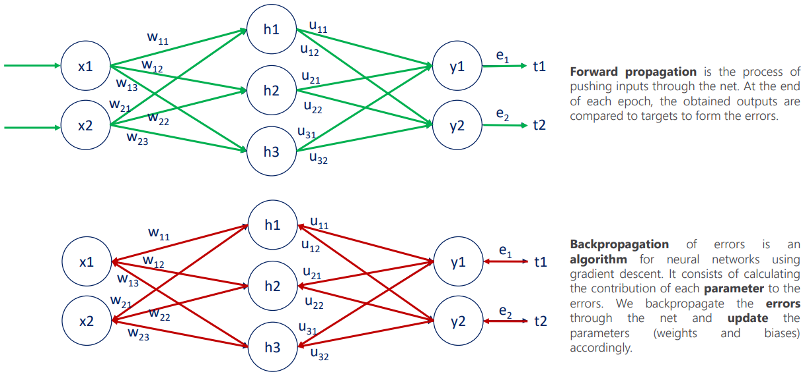
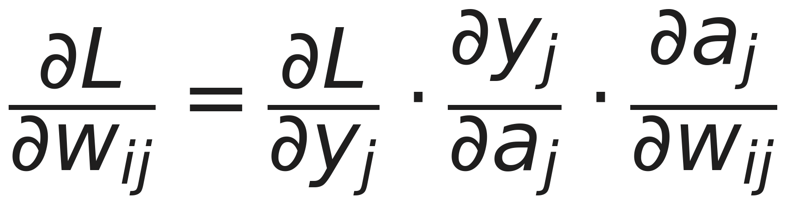
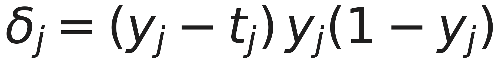

# Backpropagation

El entrenamiento de una red es un ciclo de dos movimientos. **Hacia adelante**, la red calcula su predicción. **Hacia atrás**, propaga el error y ajusta cada peso según cuánto contribuyó a equivocarse.

- **Propagación hacia adelante.** Empujar la entrada a través de la red. Al final de cada época se comparan las salidas obtenidas con los objetivos y se forma el error.
- **Propagación hacia atrás.** Propagar ese error hacia atrás por la red y actualizar los parámetros, pesos y sesgos, en consecuencia.

Una *época* es una pasada completa por todos los datos de entrenamiento.

## El error: la función de coste

Hace falta un único número que resuma qué tan mal lo hizo la red. La pérdida L2 suma las diferencias al cuadrado entre lo que predijo y lo que debería haber predicho.

Tres decisiones de diseño de esa fórmula, cada una con su motivo:

- **Al cuadrado.** Los errores por exceso y por defecto no se cancelan entre sí, y los grandes pesan más que los chicos.
- **El factor ½.** No cambia dónde está el mínimo: está puesto para que la derivada quede limpia, porque el 2 del exponente baja al derivar y se cancela.
- **Diferenciable.** Es lo que permite calcular el gradiente y saber en qué dirección mover cada peso.

`y` es lo que la red predijo y `t` el objetivo, el valor verdadero del dato de entrenamiento. La suma recorre todas las unidades de salida.

## La regla de la cadena

La pregunta que hay que responder es: **¿cuánto cambia el error si movemos un peso en particular?** El peso no toca el error directamente. Lo hace a través de la suma ponderada, y esta a través de la activación. La regla de la cadena encadena esos tres efectos.

1. **Cuánto cambia el error si cambia la salida.** Sale directo de la función de coste: la diferencia entre predicción y objetivo.
2. **Cuánto cambia la salida si cambia la suma.** Es la derivada de la activación evaluada en ese punto.
3. **Cuánto cambia la suma si cambia el peso.** Es simplemente la entrada que multiplicaba a ese peso.

El tercer factor es el que más sorprende por lo simple: derivar la suma ponderada respecto de uno de sus pesos deja la entrada que lo multiplicaba, nada más.

## El delta

Los dos primeros factores se agrupan en un solo término, **`δ`**, que representa la sensibilidad del error respecto de la suma ponderada de esa unidad.

Delta no es un concepto nuevo, es una abreviatura. Y la ganancia es concreta: **con `δ` calculado, el gradiente de cualquier peso que llega a esa unidad es una multiplicación**, no hay que rehacer la cadena. Esa economía es la que hace viable entrenar millones de parámetros.

## Propagar el delta hacia atrás

Acá está el corazón del algoritmo, y arranca con una pregunta incómoda: **¿contra qué se compara una unidad oculta?** Contra nada. No tiene un objetivo propio, nadie le dice cuál era su valor correcto.

Su culpa se calcula **sumando los deltas de todas las unidades de la capa siguiente a las que alimenta, ponderados por los pesos que las conectan**.

- **Capa de salida.** `δ` se calcula directo: hay un objetivo contra el cual comparar.
- **Capas ocultas.** `δ` se hereda de la capa siguiente, ponderado por los pesos de conexión.
- **Recursión.** El mismo cálculo se repite hacia atrás, hasta llegar a la primera capa.

El error se reparte hacia atrás capa por capa: cada unidad recibe la parte de culpa que le corresponde según cuánto influyó en las que venían después. De ahí el nombre propagación hacia atrás.

## El paso de actualización

Con el gradiente calculado, corregir el peso es **restarle una fracción de él**. La tasa de aprendizaje `η` controla el tamaño del paso, y es uno de los hiperparámetros más sensibles del entrenamiento.

- **η muy chico.** El entrenamiento avanza, pero tan despacio que puede volverse impracticable.
- **η muy grande.** Los pasos se pasan del mínimo y el error oscila o directamente diverge.
- **El signo menos.** El gradiente apunta hacia donde el error crece; nos movemos justo en la dirección opuesta.

La imagen que funciona en clase es la pelota bajando por un valle, con `η` como el tamaño del paso: pasos chicos tardan una eternidad, pasos grandes saltan de una ladera a la otra sin bajar nunca.

## Por qué la derivada de la activación importa tanto

La derivada de la activación es el factor 2 de la regla de la cadena, así que **viaja hacia atrás en cada paso**. Una derivada que se aplana frena el aprendizaje: es el problema del gradiente que se desvanece.

La derivada de la sigmoide tiene una forma notablemente cómoda, se escribe en términos de la propia sigmoide, así que no hay que recalcular nada. Por eso fue la activación por defecto durante años: su derivada sale casi gratis. Su problema aparece en los extremos, donde se aplana y el gradiente se desvanece, y es la razón por la que ReLU la reemplazó en capas ocultas.

## Glosario de símbolos

| Símbolo | Nombre | Qué representa |
|---|---|---|
| `x` | Entrada | El valor que llega a la unidad desde la capa anterior |
| `w` | Peso | El número que se aprende, asociado a cada conexión |
| `a` | Suma ponderada | La combinación lineal `xw + b`, antes de la activación |
| `y` | Salida | El resultado de aplicar la activación a la suma ponderada |
| `t` | Objetivo | El valor verdadero que viene con el dato de entrenamiento |
| `L` | Pérdida | El número único que mide cuánto se equivocó la red |
| `δ` | Delta | La sensibilidad del error respecto de la suma ponderada de esa unidad |
| `η` | Tasa de aprendizaje | El tamaño del paso con el que se corrige cada peso |

## References

- [`../../talks/intro-redes-neuronales/research/corpus/Intro-Redes-Neuronales-105min.pptx.md`](../../talks/intro-redes-neuronales/research/corpus/Intro-Redes-Neuronales-105min.pptx.md) — capítulo 6 del mazo (diapositivas 31 a 36) y las dos del anexo sobre la derivada de la sigmoide y el glosario (50 y 51).
- Ver [`arquitectura-de-una-red`](../arquitectura-de-una-red/index.md) para de dónde salen los pesos que este algoritmo corrige, y [`overfitting-y-regularizacion`](../overfitting-y-regularizacion/index.md) para qué se le hace al objetivo cuando el modelo memoriza.
- **Advertencia de procedencia:** el material viene de un mazo de clase, no de un paper. Las fórmulas son estándar y verificables en cualquier texto de deep learning, pero no hay una fuente primaria citada salvo la metáfora de apertura del capítulo 1, atribuida a Mark Riedl.
