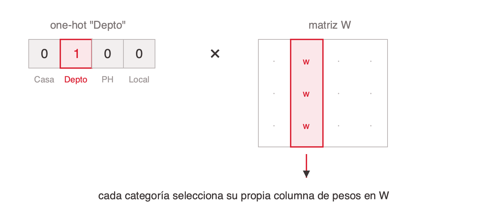

# Codificación de variables para redes neuronales

Una red no ve un cliente, una imagen ni un contrato: ve un **tensor**, un arreglo de números de N dimensiones, todos del mismo tipo y con forma fija. Todo el trabajo de representación consiste en decidir cómo se arma ese tensor, y ninguna capa posterior recupera información que se perdió en ese paso.

## La pregunta que decide todo

Frente a cualquier variable, una sola pregunta ordena la decisión: **¿qué significa la resta entre dos valores?**

- Da una cantidad interpretable (85 m² menos 60 m² son 25 m² reales) → un float normalizado, una neurona.
- Da un orden pero no una magnitud confiable (satisfacción 4 menos 2) → ordinal; conviene evaluar también one-hot.
- No significa nada (barrio 14 menos barrio 7) → one-hot o embedding según la cardinalidad.
- No se puede ni plantear → probablemente no sea una feature útil.

El fundamento: poner un número real en el tensor **afirma dos cosas** sobre esa posición. Que las diferencias son comparables, y que la magnitud escala el efecto, porque el aporte a `z = W·x + b` es el peso por el valor. Con una superficie la promesa se cumple; con un identificador de barrio es falsa.

## La tabla de decisiones

| Variable | Ejemplo | Codificación | Neuronas |
|---|---|---|---|
| Booleana | Tiene cochera | 0 o 1, tal cual | 1 |
| Numérica con magnitud | Superficie 85 m² | z-score `(x − μ) / σ` | 1 |
| Numérica con cola larga | Ingreso mensual | `log(1+x)` y después z-score | 1 |
| Ordinal | Plan Free a Enterprise | Float 0, 0.5, 1 más one-hot, concatenados | 1 + k |
| Nominal, cardinalidad baja | Tipo de vivienda | One-hot | k |
| Nominal, cardinalidad alta | Barrio (500 valores) | Embedding de dimensión d | d |
| Código con forma de número | Código postal | Embedding. Nunca como número | d |
| Identificador único | DNI, CUIT | Se descarta | 0 |
| Cíclica | Hora del día, mes | `sin(2πt/T)` y `cos(2πt/T)` | 2 |
| Fecha | Fecha de alta | Cíclica más continua | 2 + 1 |
| Texto libre | Reseña | Sentence transformer (TF-IDF como baseline) | d |
| Con faltantes | Frente del lote | Imputar más flag binario | 1 + 1 |

Sumar la última columna da la cantidad de neuronas de entrada. **Esa cuenta no se elige: sale de la tabla.**

## One-hot contra embedding

- **One-hot** (cardinalidad baja): una neurona por valor, todas en 0 salvo una en 1. Todas las categorías quedan equidistantes, que es la verdad del dato. No se aprende, es interpretable y necesita pocos datos.
- **Embedding** (cardinalidad alta): una tabla de `k × d` floats entrenable. La red aprende la distancia entre categorías desde los datos. Con 500 barrios, un embedding de dimensión 24 usa 24 neuronas donde one-hot usaría 500.
- **Regla práctica de cardinalidad:** hasta 15 valores, one-hot; de 15 a 50, cualquiera; 50 o más, embedding.

Un embedding es matemáticamente equivalente a un one-hot seguido de una capa lineal sin sesgo. Conceptualmente, la tabla de embeddings **es** la primera capa de la red. Es la misma idea que usa un LLM: cada token es un índice que busca su fila en una tabla de unas 50.000 por 4096.

Dos ventajas no obvias del embedding: comparte estadística entre categorías parecidas, así una categoría rara hereda de sus vecinas, y la representación resultante sirve para clustering o búsqueda por similitud.

## Normalización

**Normalizar** es reexpresar una variable en una escala comparable con las demás antes de que entre a la red. Cambia la unidad en la que se lee el número, no la información que trae. Aplica a las numéricas con magnitud real.

No es opcional por una razón concreta: el gradiente respecto a un peso es proporcional al valor de la entrada (`∂J/∂wⱼ = δ · xⱼ`), pero el learning rate es uno solo para toda la red. Con una variable en ~200 y otra en 0 o 1, los gradientes están a escala 200 a 1 y el entrenamiento zigzaguea. El efecto secundario importante: con sigmoide o tanh, una entrada grande satura la neurona y deja de aprender.

- **z-score por defecto:** `(x − μ) / σ`.
- **log antes del z-score con colas largas:** ingresos, transacciones, días desde la última compra.
- **Booleanos y one-hot no se tocan:** ya están en 0 y 1.
- **Escala pareja no es importancia pareja.** La importancia la aprenden los pesos; normalizar solo pone la variable en condiciones de ser evaluada.

Árboles y gradient boosting no necesitan normalización: es una particularidad de los métodos basados en gradiente.

## Los errores que no dan error

Todos entran silenciosos. El modelo entrena, converge, muestra métricas lindas y falla en producción.

- **Código como número.** Un identificador de categoría cargado como entero. La red lee orden y magnitud donde no hay ninguno.
- **Identificador único como feature.** Una columna cuyo valor no se repite entre ejemplos. No hay nada que generalizar; aprender de ella es memorizar. Es overfitting en estado puro.
- **Variable cíclica aplastada.** Una magnitud que vuelve a empezar, codificada como número plano. Las 23:00 y las 00:00 están a una hora y como números planos a 23.
- **Faltante rellenado con 0.** Cuando 0 es un valor válido, confunde ausencia con valor. La receta es imputar más un flag binario, que muchas veces predice más que la variable misma.

## Qué familia de arquitectura pide el dato

La pregunta que ordena el zoológico: **¿qué transformaciones puedo aplicarle al input sin cambiar la respuesta correcta?** Esa invariancia elige la familia.

| Estructura | Qué es | Invariancia | Arquitectura |
|---|---|---|---|
| Tabular | Filas y columnas, sin vecindad entre ellas | El orden de las columnas | Fully connected |
| Grilla 1D (señal) | Muestras a intervalos regulares sobre un eje continuo | Desplazar en el tiempo | Conv 1D, RNN, Transformer |
| Grilla 2D (imagen) | Píxeles con vecindad en dos ejes | Desplazar en el espacio | Conv 2D |
| Secuencia | Símbolos discretos de un vocabulario, en orden, largo variable | Nada, el orden es todo | Transformer |
| Conjunto | Elementos sin orden y en cantidad variable | El orden de los elementos | Deep Sets, attention |
| Grafo | Nodos y aristas, sin numeración canónica | Renumerar los nodos | GNN |

Señal y secuencia se confunden seguido y son distintas: la señal está muestreada a intervalos regulares y es invariante al desplazamiento; la secuencia no tiene ni intervalo fijo ni esa invariancia. El ADN es el ejemplo tramposo, parece señal y es secuencia.

## References

- [`../../talks/modelado-redes-neuronales/research/corpus/chat.md.md`](../../talks/modelado-redes-neuronales/research/corpus/chat.md.md) — guía de referencia sobre modelado de inputs y outputs. Secciones 2 (el input), 3 (codificación de variables), 4 (one-hot vs embedding), 5 (escalas y normalización), 7 (el caso de los 500 barrios) y 11 (los errores que más cuestan).
- Ver también el tema [`particion-del-dataset`](../particion-del-dataset/index.md) para el artefacto de producción: μ, σ, el diccionario de categorías y los valores de imputación viajan con el modelo y se calculan solo sobre el conjunto de entrenamiento.
