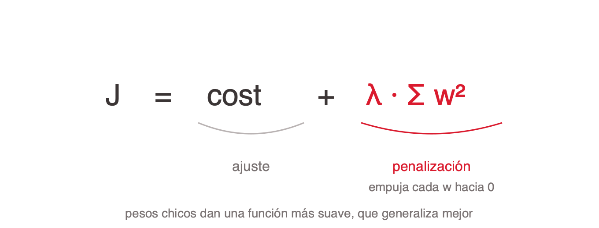

# Overfitting y regularización

Diagnosticar y tratar, en ese orden.

## El diagnóstico en dos números

**Overfitting** es que el modelo aprenda una función demasiado específica: anda bien en los datos con los que entrenó y no generaliza a datos nuevos. Deja de aprender y pasa a memorizar.

El síntoma es medible y no hace falta nada más que dos números, el error de train y el de validación:

| Train | Validación | Diagnóstico | Qué hacer |
|---|---|---|---|
| Bajo | Alto | Overfitting | Regularizar, más datos |
| Alto | Alto | Underfitting | Más capacidad, entrenar más |
| Bajo | Bajo | Anda bien | Nada |

El orden importa: **primero se diagnostica, después se trata.** Regularizar un modelo que hace underfitting empeora las dos métricas.

Durante el entrenamiento, la loss de train sigue bajando mientras la de validación en algún momento **empieza a subir**. Ese punto de quiebre es el overfitting hecho gráfico, y es también el punto donde conviene cortar (early stopping).

El caso extremo y didáctico: un identificador único usado como feature. El modelo memoriza el dataset de train, da accuracy perfecto y se derrumba con datos nuevos.

## Sesgo contra varianza

- **Mucha capacidad da alta varianza:** el modelo pasa exactamente por cada punto de train, incluido el ruido, y cambia mucho con datos nuevos. Es la curva de validación que sube.
- **Poca capacidad da alto sesgo:** no captura el patrón ni en train.
- **Regularizar es un intercambio explícito:** se acepta un poco más de sesgo, o sea peor ajuste en train, para bajar la varianza y mejorar fuera de train.
- **El objetivo nunca fue el error de train.** Un modelo que ajusta perfecto lo que ya vio y falla en lo nuevo no sirve para nada.

La metáfora que funciona en clase: estudiar memorizando las respuestas de los ejercicios viejos (varianza alta, mal con ejercicios nuevos) contra entender el método (algo de sesgo, generaliza).

Todas las técnicas que siguen son formas distintas de bajar varianza.

## L2, el estándar

Al objetivo que se minimiza se le suma un término que penaliza los pesos grandes: `J = cost + λ Σ w²`.

- **Pesos chicos, función suave.** Un peso grande hace que la salida sea muy sensible a esa entrada. Con pesos chicos la función aprendida es más suave, y una función suave no puede pasar exactamente por cada punto de entrenamiento, que es justo lo que hace el overfitting.
- **Weight decay, el otro nombre.** El gradiente del término `λ Σ w²` empuja cada peso un poco hacia cero en cada paso.
- **λ es el hiperparámetro,** típicamente entre 1e-5 y 1e-2. En PyTorch: `Adam(params, weight_decay=1e-4)`.
- **El sesgo queda afuera.** El bias no controla la sensibilidad a la entrada, así que no se penaliza. En inferencia L2 no hace nada: ya quedó incorporado en los pesos.

## L1 contra L2

- **L2 penaliza `w²`:** reduce todos los pesos sin llevarlos a cero. Pesos parejos y chicos. Es el estándar en redes.
- **L1 penaliza `|w|`:** lleva los pesos chicos exactamente a cero. Da una solución rala que selecciona features. Se usa más en modelos lineales (Lasso) que en redes.
- **Elastic net** combina las dos. Rara vez hace falta en una red.

## Dropout

Durante el entrenamiento, dropout apaga al azar una fracción de las neuronas en cada paso hacia adelante.

- **Apagado al azar.** Cada neurona se apaga con probabilidad p, típico 0.2 a 0.5 en capas ocultas. La red no puede depender de ninguna neurona en particular, así que reparte la representación en vez de armar detectores frágiles.
- **Un ensamble implícito** de muchas subredes que comparten pesos.
- **En inferencia se desactiva.** Todas las neuronas quedan activas. En PyTorch, `nn.Dropout(0.2)`.
- **El bug clásico:** olvidar `model.eval()` deja dropout activo en inferencia, y el modelo devuelve predicciones distintas en cada llamada. Le pasa también a BatchNorm.

## El resto del arsenal, y cuál usar

- **Early stopping:** cortar cuando la validación deja de mejorar. Gratis, sin hiperparámetro que calibrar, funciona con cualquier arquitectura. Es el que más rinde por unidad de esfuerzo.
- **Más datos:** ataca la causa, no el síntoma. Caro, pero es el mejor remedio.
- **Data augmentation:** generar variantes del dato (recortes, giros, ruido). Muy efectivo en visión. Va **solo** en el conjunto de entrenamiento.
- **Reducir capacidad:** menos capas o neuronas. Simple y directo.
- **Cross-validation:** con datasets chicos, donde una sola partición de validación es demasiado ruidosa.

Orden práctico: early stopping siempre, L2 de base, dropout en redes profundas, más datos cuando se pueda, y reducir capacidad cuando el modelo es claramente desproporcionado para el problema.

## References

- [`../../talks/modelado-redes-neuronales/research/corpus/chat.md.md`](../../talks/modelado-redes-neuronales/research/corpus/chat.md.md) — sección 10, regularización: qué problema resuelve.
- [`../../talks/modelado-redes-neuronales/research/corpus/train-test-split-roboflow.web.md`](../../talks/modelado-redes-neuronales/research/corpus/train-test-split-roboflow.web.md) — sección 2, la definición operativa de overfitting y las curvas de loss que se separan; sección 12, cross-validation y su costo.
- Ver [`particion-del-dataset`](../particion-del-dataset/index.md): la brecha train-validación solo se puede mirar si la partición está bien hecha, y [`codificacion-de-variables`](../codificacion-de-variables/index.md) para el identificador único como caso extremo de memorización.
