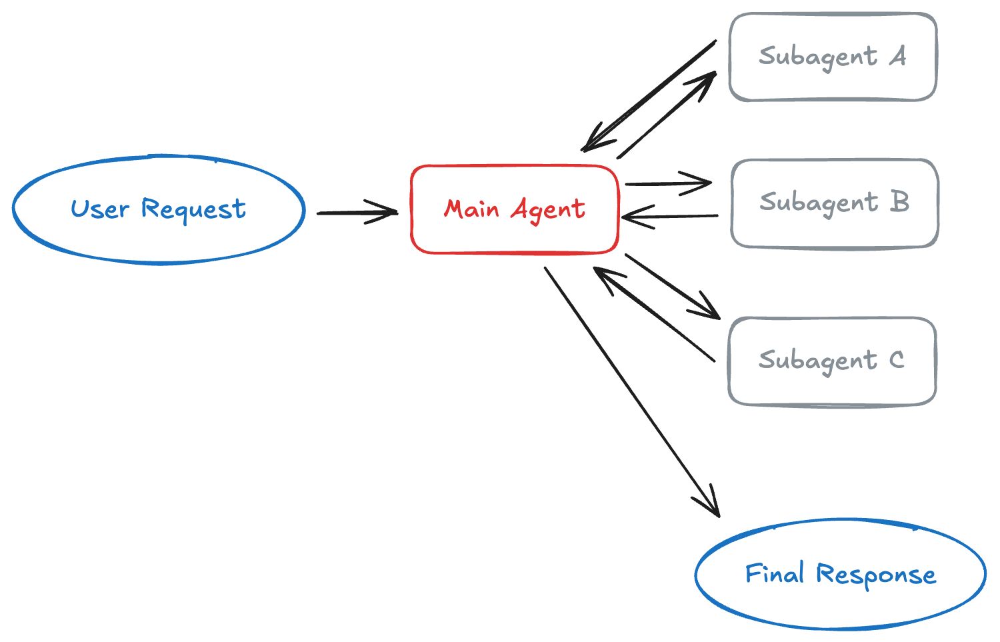
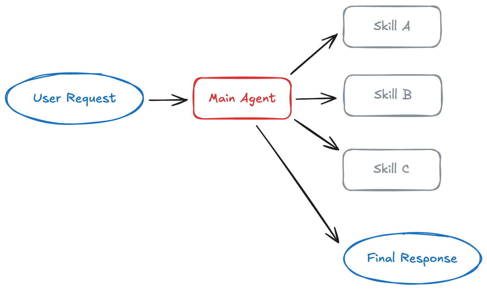
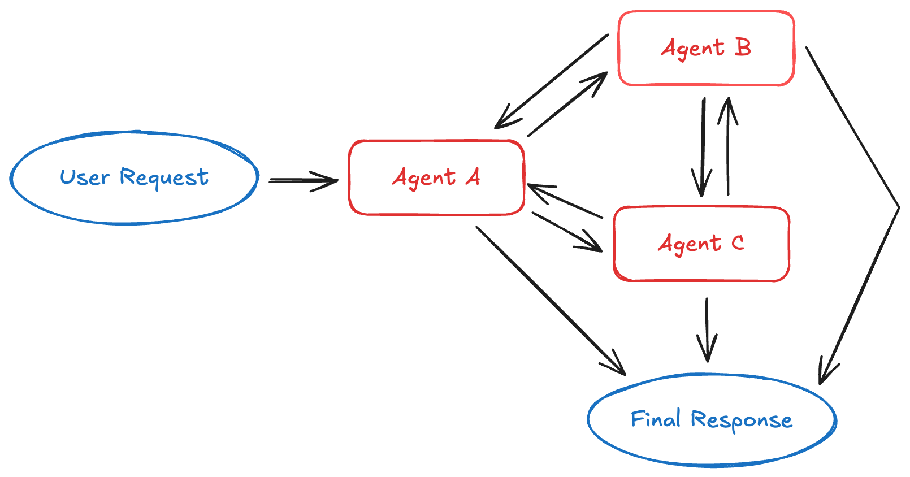
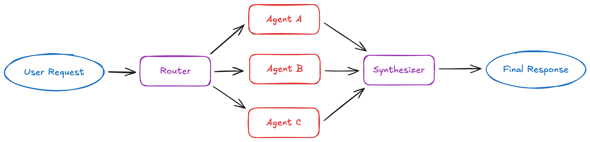

# Thesis

**Claim:** Un agente basado en LLM es un loop en el que el modelo elige su próxima acción según lo que observó. Los tipos de agente cambian cuándo se planifica y cuántas veces se vuelve a razonar, y las arquitecturas multiagente cambian cómo se reparte el contexto entre varios loops.

**Why it matters:** Cada una de esas decisiones se paga en llamadas al LLM, tokens, latencia y confiabilidad. Según Anthropic, un sistema multiagente gasta cerca de 15 veces los tokens de un chat, y LangChain recomienda agregar tools antes que agentes. Quien sabe qué resuelve cada forma puede elegir la más simple que alcanza para su problema.

**Presenter feedback:**

---

# Agenda

**Narrative arc:** La clase abre con una pregunta que la sala contesta mal con frecuencia: si un LLM es un agente. La sección 1 la responde con la definición formal en dos niveles, la clásica de Russell & Norvig (sensores, actuadores, ambiente, racionalidad) y la del agente LLM tal como la escribe el paper de ReAct (observación, acción, contexto, política), y termina en cuándo conviene construir un agente y cuándo alcanza un workflow. La sección 2 toma la pieza que convierte a un LLM en algo que actúa, la tool, como concepto general: qué es, cómo se ve en código, cómo falla y cómo se diseña. La sección 3 fija el loop común y recorre ReAct, el tipo base, con una trayectoria del paper y el grafo en LangGraph. La sección 4 sigue de a uno con Plan-and-Execute, Reflexion, ReWOO y orquestador con workers, cada uno con su diagrama y un ejemplo, y junta los cinco en una tabla. Después de la pausa, el último tipo abre la sección 5, que define contexto y subagente y presenta los cuatro patrones multiagente de LangChain con lo que cuesta cada uno. La sección 6 da el criterio para repartir: supervisor o red adaptativa, el precio en tokens de paralelizar y el debate entre Cognition y Anthropic, que se resuelve con una pregunta sobre el trabajo a repartir, si lee o si escribe. El cierre deja un árbol de decisión para elegir la arquitectura más simple que alcanza.

**Sections (in delivery order):**

- 1. Qué es un agente
- 2. Los agentes tienen tools
- 3. ReAct
- 4. Otros cuatro tipos de agente
- 5. Patrones multiagente
- 6. Cuándo repartir

**Presenter feedback:**

---

# 1. Qué es un agente

**Goal of this section:** Llegar a una definición formal de agente en dos niveles. Primero la clásica de Russell & Norvig, con sensores, actuadores, ambiente y racionalidad. Después la del agente basado en LLM, con la notación del paper de ReAct. Al salir, la sala distingue un agente de un LLM suelto y de un workflow, y sabe cuándo conviene construir uno.

**Presenter feedback:**

---

## 1. ¿Un LLM es un agente?

<!-- template: quiz -->

### Content

¿Un LLM que recibe una pregunta y devuelve una respuesta es un agente?

- A. Sí, cualquier LLM es un agente.
- B. Sí, siempre que el modelo sea lo bastante grande.
- C. Por sí solo, no.
- D. No, porque un agente tiene que ser un robot.

**Respuesta:** C. En el uso diario se llama "agente" a cualquier LLM o sistema basado en LLM. Un LLM no es un agente por sí solo, y existen muchos agentes que no usan modelos de lenguaje.

### Sources

- `corpus/AIG4B-Clase-6-Agent.pptx.md` — slide 3, "Agentes – Una palabra mal utilizada": "Un LLM no es un agente por sí solo. Además, existen muchos tipos de agentes que no involucran en absoluto modelos de lenguaje."

### Speaker notes

Abrir con la votación a mano alzada antes de revelar. La pregunta funciona porque la mayoría de la sala llega con el uso popular de la palabra, y la clase entera se apoya en desarmarlo.

A es el uso popular, y es justo lo que la lámina corrige. B confunde tamaño con forma de trabajo: el modelo más grande sigue recibiendo texto y devolviendo texto. D es el extremo opuesto, y la lámina 1.5 lo desarma con una aspiradora autónoma y con un agente LLM en la misma tabla.

La respuesta deja una pregunta abierta a propósito: si un LLM solo no es un agente, ¿qué le falta? La sección contesta en dos pasos. Primero la definición clásica, que no habla de LLMs. Después la formalización del paper de ReAct, donde el LLM pasa a elegir acciones en un loop.

Tiempo: unos 3 minutos con la votación.

### Presenter feedback

---

## 2. La definición de Russell & Norvig

### Content

> "An agent is anything that can be viewed as perceiving its environment through sensors and acting upon that environment through actuators..."
> — Russell & Norvig, *Artificial Intelligence: A Modern Approach*

```ascii
+------------------------------------------+
|                 AMBIENTE                 |
+------------------------------------------+
       |                           ^
       | percepciones              | acciones
       v                           |
+--------------+           +--------------+
|   Sensores   |           |  Actuadores  |
+--------------+           +--------------+
       |                           ^
       v                           |
+------------------------------------------+
|      AGENTE: decide qué acción tomar     |
|      a partir de lo que percibió         |
+------------------------------------------+
```
<!-- ascii-note:
intent: el loop agente-ambiente de la definicion clasica; es el lazo cerrado que todas las demas laminas de la seccion refinan.
emphasize: la caja AGENTE como unico punto de decision (acento rojo); el lazo cerrado percepciones -> decision -> acciones -> ambiente.
labels: AMBIENTE, Sensores, Actuadores, AGENTE, percepciones, acciones.
-->

### Sources

- `corpus/AIG4B-Clase-6-Agent.pptx.md` — slide 4, cita verbatim de Russell & Norvig; slide 3, versión en español ("cualquier entidad que percibe su entorno mediante sensores y actúa sobre él mediante actuadores").

### Speaker notes

Leer la cita completa. Es la definición canónica de toda la teoría de agentes en IA clásica, y la clase vuelve a ella al final de la sección para ver qué le agrega un LLM.

En español, para quien la quiera anotar: un agente es cualquier entidad que percibe su entorno mediante sensores y actúa sobre él mediante actuadores. Es una traducción del deck del curso, no una cita de una edición en español.

Señalar en el diagrama que la única caja que decide es la del agente. Sensores y actuadores son interfaces. El ambiente es todo lo que no es el agente.

### Presenter feedback

---

## 3. Lo que la definición no menciona

### Content

La definición es amplia a propósito.

- **Sin ML ni LLMs** No nombra machine learning, deep learning, LLMs, tools ni RAG. Son implementaciones posibles de un agente.
- **Sin software** Tampoco exige un programa. Un sistema mecánico o electrónico también encaja.
- **Sistemas biológicos** Células, insectos, animales y personas son agentes bajo esta definición.

### Sources

- `corpus/AIG4B-Clase-6-Agent.pptx.md` — slide 5, "Comentarios sobre la definición": Sin ML ni LLMs, Sin programas, Sistemas biológicos.

### Speaker notes

Esta lámina cierra la pregunta del quiz desde el otro lado: la palabra "agente" es anterior a los LLMs y mucho más amplia que ellos.

La consecuencia práctica para ingeniería: cuando alguien dice "agente" en una reunión de diseño, conviene preguntar qué percibe, qué puede hacer y en qué ambiente. Las dos láminas siguientes dan esas preguntas en forma de plantilla.

### Presenter feedback

---

## 4. Racionalidad: actuar bien según una medida

### Content

Un agente racional elige la acción que maximiza su medida de performance, dada la evidencia de sus percepciones y lo que ya sabe.

- **Medida de performance** El criterio que define el éxito del agente. Sin ella no hay racionalidad posible.
- **Conocimiento previo** Lo que el agente sabe del ambiente antes de empezar a actuar.
- **Acciones disponibles** El conjunto de acciones que el agente puede ejecutar en su entorno.
- **Secuencia de percepciones** El historial de todo lo que el agente observó hasta el momento.

### Sources

- `corpus/AIG4B-Clase-6-Agent.pptx.md` — slide 6, cita de Russell & Norvig sobre agente racional; slide 7, "Racionalidad" y sus cuatro factores.

### Speaker notes

**Original:** "A rational agent is one that does the right thing... This notion of desirability is captured by a performance measure that evaluates any given sequence of environment states." — Russell & Norvig.

La racionalidad agrega optimización a la definición: percibir y actuar no alcanza, hay que hacerlo bien según un criterio definido.

Guardar el cuarto factor para la lámina 1.6. La secuencia de percepciones es lo que el paper de ReAct va a llamar contexto, y en un agente LLM es el texto que el modelo tiene a la vista.

La medida de performance reaparece en la sección 4 con Reflexion, que solo funciona cuando hay un criterio claro de éxito.

### Presenter feedback

---

## 5. La misma plantilla, dos agentes

### Content

| Campo | Aspiradora autónoma | Agente basado en LLM |
|---|---|---|
| Agente | Aspiradora autónoma (robot o modelo abstracto) | LLM con razonamiento, memoria y acceso a herramientas externas |
| Sensores | Detector de suciedad, posición actual en la grilla | Texto del usuario, contexto previo, resultados de herramientas |
| Actuadores | Motor de movimiento (izq/der/adelante/atrás), motor de succión | Generar texto, razonar, ejecutar comandos, llamar APIs, producir planes |
| Ambiente | Grilla n×m, parcialmente observable, determinístico | Digital, simbólico, parcialmente observable, dinámico |
| Performance | +10 limpiar celda sucia · −1 moverse · −5 aspirar celda limpia · −10 chocar | Calidad, relevancia y precisión de las respuestas; satisfacción del usuario |

### Sources

- `corpus/AIG4B-Clase-6-Agent.pptx.md` — slide 8 (Vacuum Cleaner, valores de performance verbatim) y slide 18 (formulación del agente basado en LLM); slide 12, dimensión "un solo agente o multiagente" (solo en notas).

### Speaker notes

La tabla responde el quiz del arranque. El LLM se vuelve agente cuando tiene sensores (lo que entra a su contexto, incluidos los resultados de herramientas) y actuadores (llamar APIs, ejecutar comandos). Sin herramientas, el único actuador que le queda es generar texto.

Leer la columna de la aspiradora fila por fila y pedirle a la sala que complete la del LLM antes de revelarla. Funciona bien porque la plantilla obliga a pensar en ambiente y performance, que son las filas que se suelen olvidar al diseñar un agente.

Notar la fila Ambiente del agente LLM: parcialmente observable y dinámico. Por eso el agente tiene que observar después de cada acción. Una base de datos cambia mientras el agente piensa, y una búsqueda devuelve solo una parte del mundo.

El deck del curso clasifica los ambientes en siete dimensiones (slide 12). Una importa para esta clase: si en el ambiente actúa un solo agente o varios. Las secciones 5 y 6 tratan el caso en que varios agentes LLM se reparten una misma tarea.

Las acciones de la aspiradora en el deck original: Aspirar, MoverIzquierda, MoverDerecha, Esperar.

### Presenter feedback

---

## 6. El agente LLM, formalizado

### Content

El paper de ReAct (Yao et al., 2022) escribe el loop del agente con cuatro piezas.

- **Observación** `o_t ∈ O`, lo que el agente recibe del ambiente en el paso t.
- **Acción** `a_t ∈ A`, lo que el agente hace sobre el ambiente.
- **Contexto** `c_t = (o_1, a_1, …, o_{t−1}, a_{t−1}, o_t)`, todo lo observado y hecho hasta ese paso.
- **Política** `π(a_t | c_t)`, la regla que elige la acción a partir del contexto. En ReAct, un LLM genera las acciones y cumple ese papel.

```ascii
     +----------------------------------+
     |  contexto  c_t                   |
     |  (o_1, a_1, ..., a_t-1, o_t)     |
     +----------------------------------+
                      |
                      v
            +-------------------+
            |  política (LLM)   |
            |   π(a_t | c_t)    |
            +-------------------+
                      |
                      v   a_t ∈ A
            +-------------------+
            |     AMBIENTE      |
            +-------------------+
                      |
                      v   o_t+1 ∈ O
     se suma al contexto c_t+1 y el loop sigue
```
<!-- ascii-note:
intent: el mismo lazo de la lamina 1.2, ahora con la notacion del paper de ReAct; el contexto crece en cada vuelta.
emphasize: la caja de la politica (LLM) en rojo; la flecha final que devuelve la observacion al contexto.
labels: contexto c_t, politica pi(a_t | c_t), AMBIENTE, a_t en A, o_t+1 en O.
-->

### Sources

- `corpus/yao-2022-react.pdf.md` — Sección 2, verbatim: "At time step t, an agent receives an observation o_t ∈ O from the environment and takes an action a_t ∈ A following some policy π(a_t | c_t), where c_t = (o_1, a_1, ···, o_{t−1}, a_{t−1}, o_t) is the context to the agent." El LLM congelado (PaLM-540B) genera acciones y pensamientos por few-shot prompting.

### Speaker notes

Es la misma figura de la lámina 1.2 escrita con símbolos. Los sensores son la observación, los actuadores son la acción, y la decisión es una política que mira el contexto.

El contexto es la secuencia de percepciones de Russell & Norvig con un nombre nuevo. En un agente LLM es concreto: es el texto que el modelo tiene a la vista en cada llamada. Por eso crece en cada vuelta, y por eso se termina llenando. La sección 5 vuelve sobre esto.

El paper dice que aprender esta política es difícil cuando el paso de c_t a a_t pide razonamiento complejo. La lámina siguiente es su respuesta.

Fecha del paper: primera versión de arXiv en octubre de 2022, publicado en ICLR 2023.

### Presenter feedback

---

## 7. Pensar también es una acción

### Content

ReAct amplía el espacio de acciones con el lenguaje: `Â = A ∪ L`.

- **Acción en A** Toca el ambiente, por ejemplo `search[entity]`, y vuelve una observación.
- **Pensamiento en L** No toca el ambiente ni produce observación. Agrega razonamiento al contexto: `c_{t+1} = (c_t, â_t)`.
- **Para qué sirve pensar** Descomponer la tarea, extraer lo importante de una observación, seguir el progreso, manejar excepciones y ajustar el plan.

```ascii
                 π(â_t | c_t)
                       |
          +------------+-------------+
          |                          |
          v                          v
   â_t ∈ A  (acción)        â_t ∈ L  (pensamiento)
          |                          |
          v                          |
   +-------------+                   |
   |  AMBIENTE   |                   |
   +-------------+                   |
          |                          |
          v                          v
   hay observación            no hay observación
   c_t+1 suma a_t y o_t+1     c_t+1 = (c_t, â_t)
```
<!-- ascii-note:
intent: la bifurcacion que define ReAct; una rama toca el ambiente y la otra solo escribe en el contexto.
emphasize: la rama del pensamiento (L) en rojo, que no pasa por el ambiente.
labels: pi, accion en A, pensamiento en L, AMBIENTE, c_t+1.
-->

### Sources

- `corpus/yao-2022-react.pdf.md` — Sección 2, verbatim: "we augment the agent's action space to  = A ∪ L … a thought or a reasoning trace, does not affect the external environment, thus leading to no observation feedback … update the context c_{t+1} = (c_t, â_t)"; tipos de pensamientos útiles; Sección 3.1, acciones `search[entity]`, `lookup[string]`, `finish[answer]`.

### Speaker notes

La idea entera de ReAct entra en esta lámina. El modelo puede elegir entre hacer algo en el mundo o escribir un razonamiento, y el razonamiento queda en el contexto para la próxima decisión. El paper lo resume en dos direcciones: razonar para actuar y actuar para razonar.

Una aclaración de vocabulario que conviene decir en voz alta: el paper nunca usa la palabra "tool". Habla de acciones, de espacio de acciones y de una API simple de Wikipedia con tres acciones (search, lookup, finish). Lo que hoy llamamos tools son las acciones de A. La sección 2 toma ese nombre.

La sección 3 vuelve a ReAct como primer tipo de agente, con la trayectoria completa. Acá alcanza con la forma.

### Presenter feedback

---

## 8. Workflow o agente

### Content

Anthropic llama *agentic systems* a los dos y los separa por quién decide el camino.

| | Workflow | Agente |
|---|---|---|
| Quién decide el camino | El código, de antemano | El LLM, en cada paso |
| Definición | LLMs y tools orquestados por caminos de código predefinidos | LLMs que dirigen su propio proceso y el uso de tools |
| Conviene para | Tareas bien definidas que piden previsibilidad | Tareas que piden flexibilidad y decisiones del modelo |
| Patrones | Prompt chaining, routing, paralelización, orchestrator-workers, evaluator-optimizer | Un LLM que usa tools según el feedback del ambiente, en un loop |

`Anthropic, 2024 (revisado)`

### Sources

- `corpus/anthropic-building-effective-agents.web.md` — definiciones verbatim de workflows ("systems where LLMs and tools are orchestrated through predefined code paths") y agents ("systems where LLMs dynamically direct their own processes and tool usage"); los cinco patrones de workflow; "typically just LLMs using tools based on environmental feedback in a loop". Captura de una versión revisada del post del 19 dic 2024.
- `corpus/AIG4B-Clase-6-Agent.pptx.md` — slide 33, espectro workflows deterministas / dirigidos por LLM / agentes autónomos.

### Speaker notes

**Original:** "Agents … are typically just LLMs using tools based on environmental feedback in a loop." — [Anthropic, Building effective agents](https://www.anthropic.com/engineering/building-effective-agents).

La pregunta que separa las dos columnas es una sola: ¿quién decide el próximo paso, el código o el modelo? En un workflow el LLM está embebido en pasos fijos. En un agente, el LLM elige qué tool usar, en qué orden y cuándo tiene suficiente para responder.

El deck del curso lo dibujaba como un espectro con tres puntos: workflows deterministas (prompt chaining, paralelización), workflows dirigidos por LLM (routing, orchestrator-worker, evaluator-optimizer) y agentes autónomos. Un sistema real mezcla: puede tener un routing determinista entre agentes que por dentro son autónomos.

Marcar que orchestrator-workers aparece acá como workflow. Vuelve en la sección 4 como quinto tipo de agente y es la base de las secciones 5 y 6. La diferencia con la paralelización, según Anthropic, es que las subtareas no están predefinidas: el orquestador las decide para cada pedido.

La captura es una versión revisada del post de diciembre de 2024; por eso la cita dice "2024 (revisado)".

### Presenter feedback

---

## 9. Agente = LLM + planificación + tools

### Content

Lilian Weng (2023) describe al LLM como el cerebro del agente. Dos de los componentes que le suma organizan esta clase.

- **Planificación** Descomponer la tarea en subobjetivos, y reflexionar sobre acciones pasadas para corregirlas.
- **Uso de tools** Llamar APIs externas para obtener lo que no está en los pesos del modelo: información actual, ejecución de código, fuentes propietarias.

El tercer componente de Weng, la memoria, queda fuera de esta clase.

`Lilian Weng, jun-2023`

### Sources

- `corpus/lilianweng-llm-powered-agents.web.md` — "LLM functions as the agent's brain", tres componentes Planning / Memory / Tool use y sus definiciones; ReAct y Reflexion clasificados bajo Planning → Self-Reflection.
- `corpus/anthropic-building-effective-agents.web.md` — el "augmented LLM" (retrieval, tools, memory) como bloque básico.

### Speaker notes

Es la descomposición más citada y conviene tenerla como mapa del resto de la clase. La sección 2 es la caja de tools. Las secciones 3 y 4 son la caja de planificación: Weng ubica ahí a ReAct y a Reflexion.

Anthropic dice algo parecido con otro nombre: su bloque básico es el "augmented LLM", un LLM con retrieval, tools y memoria.

Si alguien pregunta por la memoria, queda fuera de esta clase. Para lo que sigue alcanza con saber que el contexto se pierde entre corridas.

El post es de junio de 2023. Sus ejemplos (AutoGPT, BabyAGI) son la primera ola de agentes; el marco de tres componentes sigue vigente.

### Presenter feedback

---

## 10. Cuándo vale la pena un agente

### Content

Anthropic recomienda la solución más simple posible, y eso puede significar no construir un agente.

- **Varias tools en orden variable** La solución usa varias herramientas, en órdenes distintos según el caso.
- **Resultados que hay que interpretar** El paso siguiente depende de leer lo que devolvió el anterior.
- **Reglas fijas insuficientes** El espacio de posibilidades es demasiado grande o dinámico para cubrirlo con reglas.
- **Éxito verificable** Hay un criterio claro de éxito y feedback en cada paso, como los tests en un agente de código.

### Sources

- `corpus/AIG4B-Clase-6-Agent.pptx.md` — slide 15, "¿Cuándo vale la pena usar agentes?": múltiples herramientas en orden variable, interpretación dinámica de resultados, solución determinística insuficiente.
- `corpus/anthropic-building-effective-agents.web.md` — "finding the simplest solution possible, and only increasing complexity when needed. This might mean not building agentic systems at all"; tareas con "clear success criteria, enable feedback loops"; "Agentic systems often trade latency and cost for better task performance"; coding agents verificables por tests.

### Speaker notes

**Original:** "finding the simplest solution possible, and only increasing complexity when needed. This might mean not building agentic systems at all." — [Anthropic](https://www.anthropic.com/engineering/building-effective-agents).

El costo de un agente es latencia y plata a cambio de desempeño. Anthropic agrega un tercer riesgo: la autonomía permite que los errores se acumulen, así que recomienda probar en sandbox y poner condiciones de parada, como un máximo de iteraciones.

Para muchas aplicaciones, según el mismo post, alcanza con optimizar una sola llamada al LLM con retrieval y ejemplos en el prompt.

El cuarto criterio prepara Reflexion en la sección 4: un agente que se autocorrige necesita algo que le diga si salió bien.

Cierre de la sección 1. Tiempo acumulado esperado: unos 21 minutos.

### Presenter feedback

---

# 2. Los agentes tienen tools

**Goal of this section:** Fijar qué es una tool como concepto, independiente del protocolo que la transporte: una función descripta en el contexto que el LLM pide y el programa ejecuta. Al salir, la sala puede escribir una tool, sabe cómo falla un agente que las usa y qué principios hacen buena a una tool. MCP queda fuera de la sección; la clase de RAG y MCP ya lo cubrió.

**Presenter feedback:**

---

## 1. Qué es una tool

### Content

Una tool es una función que el agente puede pedir. Su nombre, su descripción y sus parámetros están en el contexto; el LLM decide cuándo llamarla y el programa la ejecuta.

```ascii
  contexto: instrucciones + descripción de cada tool
                        |
                        v
                +---------------+
                |      LLM      |
                +---------------+
                  |           ^
  1. pide la tool |           | 3. el resultado
  con nombre y    |           |    vuelve al
  argumentos      v           |    contexto
                +---------------+
                |   programa    |
                |   (ejecuta)   |
                +---------------+
                        |
                        v
          2. API, base de datos, búsqueda
```
<!-- ascii-note:
intent: separar quien decide (el LLM) de quien ejecuta (el programa); el LLM solo emite el pedido.
emphasize: la caja programa (ejecuta) en rojo, porque es la que la sala suele olvidar; las tres flechas numeradas.
labels: contexto, LLM, programa (ejecuta), pasos 1-3.
-->

### Sources

- `corpus/AIG4B-Clase-6-Agent.pptx.md` — slide 22: tools "descriptas en el contexto. El agente decide cuándo y cómo invocarlas".
- `corpus/langchain-planning-agents.web.md` — loop genérico: el LLM propone la acción (texto para el usuario o para una función), "your code" la ejecuta, el LLM observa el resultado.
- `corpus/medium-react-langgraph-agent.web.md` — el docstring de la función decorada con `@tool` es la descripción que recibe el modelo.

### Speaker notes

La aclaración que más ordena la sección: el LLM no ejecuta nada. Genera un pedido estructurado (nombre de la tool y argumentos), y es el programa que lo rodea el que llama a la API, corre la consulta o lee el archivo. El resultado vuelve como texto al contexto, y ahí el LLM decide de nuevo.

Por eso la descripción importa tanto: es lo único que el modelo sabe de la tool. Una tool mal descripta es una tool que el modelo usa mal o no usa.

La conexión con la sección 1: la tool es el actuador del agente LLM, y su resultado es la observación.

Si alguien pregunta por MCP: es una forma estándar de exponer tools y se vio en la clase de RAG y MCP. Lo que sigue vale para cualquier tool, venga o no de un servidor MCP.

### Presenter feedback

---

## 2. Un contrato con un sistema no determinístico

### Content

> "tools are a new kind of software which reflects a contract between deterministic systems and non-deterministic agents"
> — Anthropic, *Writing effective tools for agents*, sep-2025

Ante la pregunta "¿Llevo paraguas hoy?", un agente puede llamar a la tool del clima, contestar con lo que sabe o pedir una aclaración. También puede alucinar o usar mal la tool.

### Sources

- `corpus/anthropic-writing-tools-for-agents.web.md` — cita verbatim del contrato; ejemplo del paraguas; deterministic vs. non-deterministic systems. Publicado el 11 sep 2025.

### Speaker notes

Una función tradicional es un contrato entre dos sistemas determinísticos: misma entrada, misma salida, y quien la llama sabe cuándo llamarla. Con un agente, el que llama es no determinístico. Puede llamarla cuando no corresponde, no llamarla cuando sí, o pasarle argumentos que un programador nunca pasaría.

La conclusión de Anthropic es de diseño: una tool se escribe pensando en un agente que la llama, con otros criterios que una API para desarrolladores. Y agrega una observación que a la sala le va a resultar útil: las tools más cómodas para un agente suelen ser también las más fáciles de entender para una persona.

### Presenter feedback

---

## 3. Una tool en código

### Content

El docstring es la descripción que lee el modelo; `bind_tools` le pasa al modelo el esquema de cada tool.

```python
from langchain.tools import tool

@tool
def calculator(expression: str) -> str:
    """Evaluates a math expression."""
    try:
        return str(eval(expression))
    except Exception as e:
        return f"Error: {e}"

@tool
def search_wikipedia(query: str) -> str:
    """Simulates a Wikipedia lookup."""
    import wikipedia
    return wikipedia.summary(query, sentences=2)

tools = [calculator, search_wikipedia]
model = ChatOpenAI(model="gpt-4o-mini").bind_tools(tools)
```

### Sources

- `corpus/medium-react-langgraph-agent.web.md` — Step 2 y Step 3 del walkthrough, verbatim (una copia de cada bloque duplicado). El registro marca dos defectos: `calculator` ejecuta `eval()` sobre un string generado por el modelo, y el docstring de `search_wikipedia` dice "Simulates" aunque llama a la biblioteca real.

### Speaker notes

Leer el código como lo lee el modelo: lo único que ve de cada tool es el nombre, los parámetros con sus tipos y el docstring. El cuerpo de la función no le llega nunca.

Dos defectos del ejemplo que sirven para enseñar. Primero, `calculator` corre `eval()` sobre un texto que escribió el modelo: eso ejecuta código arbitrario. Sirve para una demo y es inaceptable en producción. Segundo, el docstring de `search_wikipedia` dice que simula una búsqueda y la función llama a la biblioteca real de Wikipedia. Para el modelo, la descripción es la verdad; una descripción que miente produce un agente que se equivoca.

El ejemplo es de un tutorial en Medium (julio de 2025) sobre LangGraph. La lámina 3.4 muestra el grafo que convierte estas tools en un agente ReAct.

### Presenter feedback

---

## 4. Cómo falla un agente con tools

### Content

Anthropic identifica cuatro fallas típicas al evaluar agentes con tools.

- **Tool equivocada** El agente llama a una tool que no corresponde a la tarea.
- **Parámetros equivocados** Elige bien la tool y la llama con argumentos incorrectos.
- **Pocas llamadas** Responde antes de juntar la información que hacía falta.
- **Resultado mal leído** Procesa de forma incorrecta lo que la tool devolvió.

### Sources

- `corpus/anthropic-writing-tools-for-agents.web.md` — modos de falla: "call the wrong tools, call the right tools with the wrong parameters, call too few tools, process responses incorrectly"; métricas más allá de la accuracy.

### Speaker notes

Además de si la tarea salió bien, Anthropic recomienda medir el tiempo por llamada y por tarea, la cantidad de llamadas, el consumo de tokens y los errores de las tools. Esas métricas dicen cuál de las cuatro fallas está pasando.

Un caso del artículo que ilustra la segunda falla: el agente agregaba "2025" a cada consulta de una tool de búsqueda web y sesgaba los resultados. Lo arreglaron mejorando la descripción de la tool, sin tocar el modelo.

Otra recomendación concreta: las tareas de evaluación tienen que ser realistas y tener un resultado verificable. "Agendá una reunión con Jane la semana que viene" es una tarea débil; "agendá la reunión, adjuntá las notas y reservá una sala" obliga a encadenar tools.

### Presenter feedback

---

## 5. Principios para diseñar tools

### Content

- **Pocas y consolidadas** Más tools no garantizan mejores resultados; una tool que resuelve la tarea entera evita encadenar varias. Ejemplo: `schedule_event` en lugar de `list_users`, `list_events` y `create_event`.
- **Nombres con espacio de nombres** Un prefijo por servicio o por recurso separa tools parecidas. Ejemplo: `asana_search` y `jira_search`.
- **Contexto con significado** Traducir identificadores a nombres reduce las alucinaciones. Ejemplo: devolver `name` en lugar de `uuid`.
- **Respuestas que cuidan tokens** Cada respuesta trae solo lo que el agente necesita. Ejemplo: `search_contacts` en lugar de `list_contacts`; en Slack, la respuesta concisa ocupó 72 tokens y la detallada, 206.
- **Descripciones para alguien nuevo** Cada descripción se escribe como para alguien que recién llega al equipo. Entra al contexto y orienta cuándo y cómo usar la tool.

`Anthropic, sep-2025`

### Sources

- `corpus/anthropic-writing-tools-for-agents.web.md` — principios (choose the right tools, namespacing, meaningful context, token efficiency, prompt-engineer descriptions); ejemplos de consolidación; `search_contacts` vs `list_contacts`; respuesta Slack 72 vs 206 tokens (≈ 0,35 = 72 / 206, verificado por el librarian); "More tools don't always lead to better outcomes".

### Speaker notes

El hilo común: el contexto de un agente es limitado y la memoria de la computadora es barata. Una tool que devuelve todo (`list_contacts`) llena el contexto con cosas que el agente no necesita; una que busca (`search_contacts`) devuelve lo justo.

Consolidar también resuelve un problema de decisión. Con tres tools separadas, el agente tiene que acertar el orden; con una que agenda, el orden queda en el código.

El dato de Slack, por si piden el detalle: la versión concisa omite `thread_ts`, `channel_id` y `user_id`, y ocupa cerca de un tercio de los tokens. Anthropic propone exponer un parámetro `response_format` para que el agente elija entre concisa y detallada.

Sobre las descripciones: según el mismo post, pequeños ajustes en la descripción de una tool producen mejoras grandes en las evaluaciones.

### Presenter feedback

---

## 6. La interfaz agente-computadora

### Content

Anthropic propone invertir en la interfaz agente-computadora (ACI) tanto esfuerzo como en la interfaz humano-computadora (HCI).

- **Más tiempo en las tools que en el prompt** Para su agente de SWE-bench, Anthropic dedicó más tiempo a optimizar las tools que el prompt general.
- **Poka-yoke** Cambiar los argumentos para que equivocarse sea más difícil. Exigir rutas absolutas eliminó los errores del modelo con rutas relativas.

`Anthropic, 2024 (revisado)`

### Sources

- `corpus/anthropic-building-effective-agents.web.md` — ACI vs HCI; "spent more time optimizing our tools than the overall prompt"; Appendix 2: errores con rutas relativas, tool cambiada para exigir rutas absolutas, "the model used this method flawlessly"; poka-yoke.

### Speaker notes

El término viene de la manufactura japonesa: diseñar la pieza para que no se pueda montar mal. Aplicado a tools, es elegir parámetros que hagan difícil el error en vez de explicarle al modelo cómo no cometerlo.

El caso de las rutas: el modelo se equivocaba con rutas relativas después de moverse fuera del directorio raíz. Anthropic no agregó instrucciones; cambió la tool para que solo acepte rutas absolutas, y según el post el modelo la usó sin errores.

Un detalle de formato del mismo apéndice, útil para esta sala: escribir un diff exige saber cuántas líneas cambian antes de escribirlo, y escribir código dentro de JSON exige escapar comillas. Los dos formatos le cuestan más al modelo que el mismo código en markdown.

Cierre de la sección 2. Tiempo acumulado esperado: unos 33 minutos.

### Presenter feedback

---

# 3. ReAct

**Goal of this section:** Fijar el loop común a todos los tipos de agente y recorrer el primero, ReAct, con su diagrama, una trayectoria del paper, el grafo en LangGraph y lo que mostraron sus resultados. ReAct es la base contra la que se comparan los otros cuatro tipos.

**Presenter feedback:**

---

## 1. El loop común

### Content

Todo agente basado en LLM repite tres pasos.

1. **Proponer** El LLM genera texto para el usuario o una llamada a una función.
2. **Ejecutar** El programa invoca el software: una consulta a una base, una llamada a una API.
3. **Observar** El resultado vuelve al LLM, que llama a otra función o responde.

Los cinco tipos que siguen responden distinto a dos preguntas: cuándo se planifica y cuántas veces vuelve a razonar el LLM.

### Sources

- `corpus/langchain-planning-agents.web.md` — loop genérico de un agente LLM: "Propose action", "Execute action", "Observe".

### Speaker notes

Es el loop de la lámina 2.1 visto desde arriba. Todo lo que sigue en esta sección y en la siguiente son variaciones sobre él.

Las dos preguntas sirven de eje para la tabla final. ReAct no planifica de antemano y razona en cada paso. Plan-and-Execute planifica al inicio y vuelve a razonar al replanificar. Reflexion agrega una vuelta más larga, entre intentos completos. ReWOO planifica todo y no vuelve a razonar hasta el final. El orquestador con workers reparte el loop entre varios agentes.

Pedirle a la sala que retenga las dos preguntas; al final la tabla se lee con ellas.

### Presenter feedback

---

## 2. ReAct: pensar, actuar, observar

### Content

ReAct intercala pensamientos y acciones, un paso por vez, hasta tener lo necesario para responder.

```ascii
    Pregunta
       |
       v
  +-----------+      +-----------+      +--------------+
  |  Thought  | ---> |  Action   | ---> | Observation  |
  |  razonar  |      | usar tool |      |  resultado   |
  +-----------+      +-----------+      +--------------+
       ^                                        |
       |                                        |
       +----------------------------------------+
       |
       v   cuando alcanza
  Respuesta final
```
<!-- ascii-note:
intent: el lazo de ReAct, un paso por vez; es la forma base contra la que se comparan los otros cuatro tipos de la seccion.
emphasize: el lazo cerrado Thought -> Action -> Observation; Thought en rojo porque es lo que ReAct agrega.
labels: Pregunta, Thought (razonar), Action (usar tool), Observation (resultado), Respuesta final.
consistency: los cinco diagramas de tipos de agente comparten lienzo, tipografia y tratamiento de cajas; cambia solo la forma.
-->

### Sources

- `corpus/yao-2022-react.pdf.md` — trayectorias de múltiples pasos thought-action-observation ("dense thought") para tareas de razonamiento.
- `corpus/AIG4B-Clase-6-Agent.pptx.md` — slide 20: "ReAct es la arquitectura más simple y fundamental para agentes basados en LLMs"; ciclo Thought → Action → Observation hasta la respuesta final.
- `corpus/langchain-planning-agents.web.md` — ReAct como "a great prototypical design" que elige una acción por paso.

### Speaker notes

Es la idea de la lámina 1.7 puesta en movimiento: el pensamiento es la acción que no toca el ambiente, y la acción es la que sí.

Un matiz del paper: en tareas de razonamiento cada paso lleva su pensamiento ("dense thought"); en tareas de decisión con muchas acciones, los pensamientos aparecen solo donde hacen falta y el modelo decide cuándo.

La tabla del final resume cuándo conviene: tareas exploratorias, donde el siguiente paso depende del resultado anterior.

### Presenter feedback

---

## 3. Una trayectoria ReAct

### Content

Pregunta de HotpotQA, un conjunto de preguntas multi-salto sobre Wikipedia: además del Apple Remote, ¿qué otro dispositivo controla el programa para el que se diseñó el Apple Remote?

```text
Thought 1: I need to search Apple Remote and find the program it was
           originally designed to interact with.
Act 1:     Search[Apple Remote]
Obs 1:     The Apple Remote is a remote control introduced in October 2005
           by Apple … originally designed to control the Front Row media
           center program …
Thought 2: … I need to search Front Row next and find what other device
           can control it.
Act 2:     Search[Front Row]
Obs 2:     Could not find [Front Row]. Similar: ['Front Row Seat to Earth',
           'Front Row Motorsports', 'Front Row (software)', …]
Thought 3: Front Row is not found. I need to search Front Row (software).
Act 3:     Search[Front Row (software)]
Obs 3:     Front Row is a discontinued media center software …
Thought 4: Front Row (software) is controlled by an Apple Remote or the
           keyboard function keys. So the answer is keyboard function keys.
Act 4:     Finish[keyboard function keys]
```

### Sources

- `corpus/yao-2022-react.pdf.md` — Figure 1 (1d), texto decodificado verbatim; HotpotQA descripto como "multi-hop QA over ≥2 Wikipedia passages"; Thought 2 recortado con "…" respecto del original. Comparación con (1a) Standard, (1b) CoT y (1c) Act-only en la misma figura.

### Speaker notes

Leer la trayectoria en voz alta y marcar qué hace cada pensamiento. El primero descompone la pregunta. El segundo extrae lo importante de la observación. El tercero maneja una excepción: la búsqueda falló y el agente reformula. El cuarto sintetiza la respuesta.

La misma pregunta en la misma figura del paper, con los otros métodos: el modelo sin razonamiento ni acciones responde "iPod" (mal). Con chain-of-thought solo, alucina que Apple Remote controla Apple TV y responde "iPhone, iPad, iPod Touch" (mal). Con acciones sin pensamientos, busca lo mismo que ReAct y termina respondiendo "yes" (mal). Solo ReAct llega a "keyboard function keys".

Ese último caso es el más instructivo: las búsquedas eran correctas y el agente igual falló, porque sin pensamientos no pudo razonar sobre lo que había observado.

### Presenter feedback

---

## 4. ReAct en LangGraph

### Content

Dos nodos y una arista condicional: si el último mensaje del LLM no pide tools, el grafo termina; si pide, las ejecuta y vuelve al LLM.

```python
def is_done(state: AgentState):
    messages = state['messages']
    last_message = messages[-1]
    if not last_message.tool_calls:
        return "end"
    return "continue"

builder = StateGraph(AgentState)
builder.add_node("agent", agent_node)
tool_node = ToolNode(tools=tools)
builder.add_node("tools", tool_node)
builder.set_entry_point("agent")
builder.add_conditional_edges(
    "agent",
    is_done,
    {"end": END, "continue": "tools"}
)
builder.add_edge("tools", "agent")
agent = builder.compile()
```

### Sources

- `corpus/medium-react-langgraph-agent.web.md` — Step 5, "Graph with Loops", verbatim salvo dos cambios: se quitó la anotación `-> bool` de `is_done` (el registro marca que devuelve strings) y el docstring. El registro marca que faltan imports (`TypedDict`, `ToolNode`, etc.) y que el código completo está en el repositorio del autor.

### Speaker notes

El `agent_node` llama al modelo con las tools de la lámina 2.3 ya enlazadas. El `ToolNode` es un nodo prearmado de LangGraph que ejecuta las llamadas a tools del último mensaje.

El loop de ReAct es la arista `tools → agent`: después de ejecutar, siempre se vuelve al LLM. La condición de salida la decide el modelo, cuando responde sin pedir tools.

Dos cambios respecto del artículo, por honestidad: el original anota `is_done` como `-> bool` y devuelve strings, y no importa varias de las clases que usa. Si alguien lo copia tal cual, no corre.

Falta algo que Anthropic recomienda para cualquier agente: una condición de parada además de la del modelo, como un máximo de iteraciones. Es un buen ejercicio para la práctica.

### Presenter feedback

---

## 5. Qué mostró el paper, y dónde falla

<!-- template: stat -->

### Content

Resultados del paper (2022–23, PaLM-540B con pocos ejemplos en el prompt).

- **0% contra 56%** de los fallos se deben a alucinación: ReAct contra chain-of-thought, en HotpotQA.
- **47%** de los fallos de ReAct son errores de razonamiento, incluido un loop que repite pensamientos y acciones.
- **71% contra 45%** de éxito en ALFWorld, tareas domésticas en un entorno de texto: ReAct contra el mismo agente sin pensamientos, mejor de 6 corridas.

### Sources

- `corpus/yao-2022-react.pdf.md` — ALFWorld descripto como "text-based household game"; Table 2 (HotpotQA, modos de falla: hallucination 0% ReAct vs 56% CoT; reasoning error 47% ReAct; search result error 23%); Table 3 (ALFWorld, ReAct best of 6 = 71, Act best of 6 = 45). Modelo: PaLM-540B por few-shot prompting.

### Speaker notes

Fechar los números en voz alta: son de 2022–23, con PaLM-540B, un modelo que no es público. Sirven para entender el mecanismo, no como benchmark actual.

La primera cifra es la que justifica las tools: cuando el agente busca, deja de inventar hechos. La segunda es el costo: ReAct falla más por razonamiento, y su falla característica es un loop que repite el mismo pensamiento y la misma acción. Otro 23% de sus fallos viene de búsquedas que no devolvieron nada útil.

Un dato que la sala puede preguntar: en HotpotQA, chain-of-thought solo saca un poco más que ReAct (29,4 contra 27,4 de exact match). La mejor combinación del paper usa las dos: ReAct cuando hace falta buscar y chain-of-thought con votación cuando el modelo ya sabe.

La crítica de LangChain lleva al tipo siguiente: ReAct hace una llamada al LLM por cada tool y planifica un subproblema por vez, sin pensar la tarea entera.

Cierre de la sección 3. Tiempo acumulado esperado: unos 44 minutos.

### Presenter feedback

---

# 4. Otros cuatro tipos de agente

**Goal of this section:** Recorrer de a uno, en orden, los otros cuatro tipos de agente que más se comparan: Plan-and-Execute, Reflexion, ReWOO y multiagente con orquestador y workers. Cada tipo tiene su lámina de definición con diagrama y después una de ejemplo. La sección cierra con la tabla que compara los cinco, y el último tipo abre la sección 5.

**Presenter feedback:**

---

## 1. Plan-and-Execute: planificar primero

### Content

Un planner escribe el plan completo al inicio. Un executor resuelve cada paso con sus tools, y un re-planner decide si termina o planifica de nuevo.

```ascii
  Pedido
    |
    v
 +----------+   lista de pasos   +--------------------+
 | Planner  | -----------------> | Executor           |
 |  (LLM)   |   1. ...           | un paso a la vez,  |
 +----------+   2. ...           | con sus tools      |
      ^         3. ...           +--------------------+
      |                                    |
      |                                    v resultados
      |                          +--------------------+
      +------ replanificar ----- | Re-planner (LLM)   |
                                 | ¿terminó?          |
                                 +--------------------+
                                           |
                                           v  sí
                                 Respuesta al usuario
```
<!-- ascii-note:
intent: separar el planner de la ejecucion; el LLM grande planifica al inicio y al replanificar, no despues de cada accion.
emphasize: la caja Planner en rojo; la flecha de replanificar que cierra el lazo largo.
labels: Pedido, Planner (LLM), lista de pasos, Executor, Re-planner (LLM), Respuesta al usuario.
consistency: mismo lienzo y tratamiento de cajas que el diagrama de ReAct (3.2).
-->

### Sources

- `corpus/langchain-planning-agents.web.md` — arquitectura Plan-and-Execute: planner, executor(s), re-planning prompt; basada en Plan-and-Solve (Wang et al.) y BabyAGI. Post de LangChain, 13 feb 2024.

### Speaker notes

La diferencia con ReAct está en el momento del razonamiento. ReAct piensa antes de cada acción; Plan-and-Execute piensa todo al inicio, ejecuta, y vuelve a pensar solo al replanificar.

En el diagrama de LangChain, cada executor es un agente de una sola tarea que hace su propio loop con tools. O sea que adentro de Plan-and-Execute hay pequeños ReAct, cada uno con un paso del plan.

La idea viene de dos fuentes que el post cita: el paper Plan-and-Solve de Wang et al. y el proyecto BabyAGI de Yohei Nakajima.

### Presenter feedback

---

## 2. Un plan para la misma pregunta

### Content

La pregunta de la lámina 3.3, resuelta con Plan-and-Execute. La cátedra armó este plan para comparar los dos tipos.

```text
Planner:     1. Buscar Apple Remote y anotar el programa para el que se diseñó.
             2. Buscar ese programa y anotar qué otros dispositivos lo controlan.

Executor 1:  Search[Apple Remote]
             -> Front Row media center program
Executor 2:  Search[Front Row]  -> no encontrado
             Search[Front Row (software)]
             -> controlled by an Apple Remote or the keyboard function keys

Re-planner:  ¿terminó? Sí. Respuesta: keyboard function keys
```

### Sources

- Construcción ilustrativa de la cátedra: no proviene de ninguna fuente ni de una corrida real de un sistema Plan-and-Execute.
- `corpus/yao-2022-react.pdf.md` — Figure 1 (1d): la pregunta, las búsquedas y los resultados, tomados de la trayectoria ReAct de la lámina 3.3. El resultado del executor 1 sale de Obs 1; el del executor 2 sale de Thought 4, porque el Obs 3 de la figura está recortado en la fuente.
- `corpus/langchain-planning-agents.web.md` — los roles planner, executor y re-planner, y el executor como agente de una sola tarea con su propio loop.

### Speaker notes

Aclarar de entrada que este plan lo armó la cátedra. El corpus no tiene una traza publicada de Plan-and-Execute, y usar la misma pregunta que en ReAct permite comparar las dos formas sobre el mismo caso.

Señalar dónde quedó el razonamiento. El planner piensa una vez, al principio, y escribe dos pasos. La búsqueda fallida de Front Row la resuelve el executor del paso 2 adentro de su propio loop, sin volver al planner. El re-planner mira los resultados una vez y decide que alcanza.

En la trayectoria ReAct de la lámina 3.3, el mismo LLM escribió un pensamiento antes de cada una de las cuatro acciones. Acá el LLM que planifica interviene dos veces: al armar el plan y al decidir que terminó. Es el ahorro que LangChain promete en la lámina siguiente.

### Presenter feedback

---

## 3. Qué gana y qué cuesta planificar

<!-- template: pros-cons -->

### Content

### Ventajas, según LangChain

- **Más rápido** El LLM grande no se consulta después de cada acción.
- **Más barato** Los pasos pueden ir a modelos más chicos; el grande solo planifica, replanifica y responde.
- **Mejor resultado** El planner tiene que pensar todos los pasos antes de empezar.

### Límites

- **Ejecución en serie** Las tools se siguen llamando de a una.
- **Un LLM por paso** Cada paso pasa por un executor, y no hay variables que conecten el resultado de un paso con el siguiente.

### Sources

- `corpus/langchain-planning-agents.web.md` — "Faster", "Cheaper", "Better" como mejoras sobre ReAct; limitaciones del Plan-and-Execute básico (serial tool calling, an LLM per task, no variable assignment). El registro marca que las tres ventajas se afirman en el post sin benchmark.

### Speaker notes

Decir con qué peso llegan las ventajas: el post de LangChain las afirma y no las mide. Son razonables por construcción (menos llamadas al modelo grande), pero no hay un número detrás.

El segundo límite prepara ReWOO, que agrega lo que falta: variables que conectan los pasos, para que el plan se ejecute sin volver al LLM.

Cuándo conviene, según la tabla del final: tareas largas y predecibles, donde se pueden ahorrar llamadas al LLM.

### Presenter feedback

---

## 4. Reflexion: intentar, evaluar, reflexionar

### Content

Reflexion ejecuta, evalúa el resultado y, si falló, escribe una crítica en lenguaje natural que guarda como memoria para el intento siguiente. No toca los pesos del modelo.

```ascii
                +----------------------------+
  intento k --> | Actor (LLM, tipo ReAct)    | <------+
                +----------------------------+        |
                              |                       |
                              v trayectoria           |
                +----------------------------+        |
                | Evaluator: ¿pasó?          |        |
                | (tests, heurística o LLM)  |        |
                +----------------------------+        |
                   |                     |            |
                sí v                  no v            |
            Respuesta      +-----------------------+  |
                           | Self-Reflection (LLM) |  |
                           | escribe la crítica    |  |
                           +-----------------------+  |
                                       |              |
                                       v              |
                           +-----------------------+  |
                           | memoria: 1 a 3        |--+
                           | reflexiones previas   | intento k+1
                           +-----------------------+
```
<!-- ascii-note:
intent: el lazo largo de Reflexion, entre intentos completos; tres roles LLM distintos (Actor, Evaluator, Self-Reflection) y una memoria de reflexiones.
emphasize: la caja Self-Reflection en rojo; la flecha de la memoria que vuelve al Actor para el intento siguiente.
labels: Actor, Evaluator, Self-Reflection, memoria, intento k / k+1, Respuesta.
consistency: mismo lienzo y tratamiento de cajas que 3.2 y 4.1.
-->

### Sources

- `corpus/shinn-2023-reflexion.pdf.md` — Sección 3, verbatim: Actor (CoT o ReAct), Evaluator, Self-Reflection; memoria de corto plazo (trayectoria) y largo plazo (reflexiones, acotada a Ω, "usually set to 1-3"); refuerzo "not by updating weights, but instead through linguistic feedback". Algorithm 1: el diagrama sigue la condición que describe la prosa (repetir mientras no pase y queden intentos); el registro marca que el pseudocódigo dice "or" donde corresponde "and".

### Speaker notes

Reflexion es el primer tipo con más de un rol de LLM. El Actor produce la trayectoria, y en los experimentos de decisión y de preguntas es un agente ReAct. El Evaluator decide si salió bien. El Self-Reflection convierte ese veredicto en una crítica escrita. Son tres llamadas al LLM con tres trabajos distintos, y ese reparto anticipa el último tipo de la sección.

Los autores lo llaman refuerzo verbal: en lugar de actualizar pesos como en reinforcement learning, el agente guarda en su contexto una frase que le dice qué cambiar. El paper lo describe como un gradiente semántico.

Un detalle para quien lea el paper: el pseudocódigo del Algorithm 1 dice "while not pass or t < max trials", que como está escrito nunca terminaría bien. La prosa aclara que el loop sigue hasta que el Evaluator aprueba, con un máximo de intentos.

### Presenter feedback

---

## 5. Una reflexión, en código

### Content

Tarea de programación: decidir si dos strings de paréntesis se pueden concatenar en un orden balanceado.

```text
(b) Trayectoria:  def match_parens(lst):
                      if s1.count('(') + s2.count('(') ==
                         s1.count(')') + s2.count(')'): [...]
                      return 'No'
(c) Evaluación:   Self-generated unit tests fail: assert match_parens(...)
(d) Reflexión:    [...] wrong because it only checks if the total count
                  of open and close parentheses is equal [...] order of
                  the parentheses [...]
(e) Nuevo intento: [...]
                      return 'Yes' if check(S1) or check(S2) else 'No'
```

### Sources

- `corpus/shinn-2023-reflexion.pdf.md` — Figure 1, fila "2. Programming", texto decodificado verbatim (los "[...]" son del original). La condición del `if` se partió en dos líneas por ancho.

### Speaker notes

El ejemplo muestra las cuatro piezas con un caso que la sala reconoce. El Actor escribe una solución que solo cuenta paréntesis. El Evaluator son tests unitarios que el mismo agente generó, y fallan. La reflexión nombra el error en lenguaje natural: contar no alcanza, importa el orden. El intento siguiente arranca con esa frase en el contexto.

Que los tests los genere el agente es parte del método. Por eso el paper puede reportar pass@1: la solución se entrega una sola vez y nunca vio los tests ocultos del benchmark.

La misma figura del paper tiene dos ejemplos más, uno de decisión en ALFWorld (el agente creyó que la sartén estaba en una hornalla equivocada) y uno de preguntas (supuso que dos escritores compartían varias profesiones). Se pueden mencionar si hay tiempo.

### Presenter feedback

---

## 6. Qué mostró Reflexion

<!-- template: stat -->

### Content

Resultados del paper (2023). HumanEval mide si el modelo escribe una función correcta a partir de su descripción; pass@1 es el acierto con la primera solución entregada.

- **91,0 contra 80,1** pass@1 en HumanEval Python: Reflexion contra GPT-4, el mejor resultado publicado en ese momento.
- **130 de 134** tareas de ALFWorld resueltas con ReAct + Reflexion, en 12 intentos.
- **0,52 contra 0,60** pass@1 en Rust al quitar los tests autogenerados: sin tests que evalúen el intento, la reflexión queda por debajo del modelo base.

### Sources

- `corpus/shinn-2023-reflexion.pdf.md` — pass@1 definido como "accuracy of a single submitted solution"; HumanEval: "measure function body generation accuracy given natural language descriptions"; Table 1 (HumanEval PY: SOTA GPT-4 80,1, Reflexion 91,0); Sección 4.1 (130/134 tareas de ALFWorld, 12 intentos); Table 3 (HumanEval Rust, 50 problemas más difíciles, GPT-4: base 0,60; sin generación de tests 0,52; sin self-reflection 0,60; Reflexion completo 0,68); Table 4 (starchat-beta 0,26 → 0,26).

### Speaker notes

Fechar las cifras: son de 2023 y el "estado del arte" de la primera es el de ese momento. No son benchmarks actuales.

La tercera cifra es la que justifica la fila de la tabla final ("cuando hay un criterio claro de éxito"). En la ablación de Rust, Reflexion completo llega a 0,68. Sin tests autogenerados cae a 0,52, por debajo del modelo base (0,60). Sin la reflexión, se queda en 0,60. Las dos piezas hacen falta, y la que más pesa es tener algo que diga si salió bien.

Un límite que el paper reporta: con un modelo chico (starchat-beta), Reflexion no mejora nada, 0,26 antes y 0,26 después. La autocorrección aparece en modelos más capaces. Y en WebShop, una tarea que pide explorar mucho, Reflexion no logró mejorar y los autores cortaron después de 4 intentos.

### Presenter feedback

---

## 7. ReWOO: planificar con variables

### Content

ReWOO (Reasoning WithOut Observations) escribe el plan completo con variables y ejecuta todas las tools sin volver a razonar entre medio.

```ascii
  Pedido
    |
    v
 +----------------------------------------------+
 | Planner (LLM): escribe todo el plan          |
 |   Plan: ...   E1 = Search[...]               |
 |   Plan: ...   E2 = LLM[... #E1]              |
 |   Plan: ...   E3 = Search[... #E2]           |
 +----------------------------------------------+
    |
    v
 +----------------------------------------------+
 | Worker: ejecuta E1, E2, E3 en orden y        |
 | reemplaza cada #E por su resultado           |
 +----------------------------------------------+
    |
    v
 +----------------------------------------------+
 | Solver (LLM): plan + evidencias -> respuesta |
 +----------------------------------------------+
```
<!-- ascii-note:
intent: tuberia sin lazo; el LLM razona al principio (Planner) y al final (Solver), y el Worker ejecuta sin consultarlo.
emphasize: las variables #E1 y #E2 dentro del plan, que conectan un paso con el siguiente; la ausencia de flecha de vuelta al Planner.
labels: Pedido, Planner (LLM), Worker, Solver (LLM), E1-E3.
consistency: mismo lienzo y tratamiento de cajas que 3.2, 4.1 y 4.4; aca la forma es una tuberia porque no hay lazo.
-->

### Sources

- `corpus/langchain-planning-agents.web.md` — ReWOO (Xu et al., arXiv 2305.18323): planner con líneas "Plan" y "E#" que referencian resultados previos (`#E2`), worker que completa las variables, solver que integra; "the task list executes without re-planning"; límite: ejecución secuencial.

### Speaker notes

La diferencia con Plan-and-Execute es la variable. En Plan-and-Execute cada paso pasa por un executor con su propio LLM; en ReWOO el plan ya dice de dónde sale cada dato (`#E1`), así que el worker solo reemplaza y ejecuta. El LLM razona dos veces: al planificar y al resolver.

El costo de esa eficiencia: si una búsqueda devuelve algo inesperado, nadie replanifica. Por eso el nombre, razonar sin observaciones.

Mención: LLMCompiler (Kim et al.) lleva la idea un paso más allá. El planner emite un grafo de tareas con dependencias (un DAG) y un scheduler ejecuta cada tarea apenas sus dependencias están listas, en paralelo. LangChain dice que el paper reporta una aceleración de 3,6x; no está verificado en el corpus, así que conviene decirlo como cifra del paper y no como medición propia.

### Presenter feedback

---

## 8. Un plan ReWOO

### Content

Pedido: "What are the stats for the quarterbacks of the super bowl contenders this year".

```text
Plan: I need to know the teams playing in the superbowl this year
E1: Search[Who is competing in the superbowl?]
Plan: I need to know the quarterbacks for each team
E2: LLM[Quarterback for the first team of #E1]
Plan: I need to know the quarterbacks for each team
E3: LLM[Quarter back for the second team of #E1]
Plan: I need to look up stats for the first quarterback
E4: Search[Stats for #E2]
Plan: I need to look up stats for the second quarterback
E5: Search[Stats for #E3]
```

### Sources

- `corpus/langchain-planning-agents.web.md` — plan ReWOO verbatim del post (incluido el typo "Quarter back" en E3).

### Speaker notes

Señalar dos cosas en el plan. Primero, `#E1`, `#E2` y `#E3` son las variables: E4 no sabe todavía quién es el quarterback, pero el plan ya dice que lo va a sacar de E2. Segundo, algunos pasos llaman a un LLM como si fuera una tool (`LLM[...]`). El worker lo trata como cualquier otra herramienta.

El plan entero sale de una sola llamada al planner. Después vienen cinco ejecuciones y una llamada final al solver. Con ReAct, la misma tarea habría pasado por el LLM antes de cada una de las cinco acciones.

Cuándo conviene, según la tabla: cuando el objetivo es bajar costo y latencia, y el plan se puede escribir completo de antemano.

### Presenter feedback

---

## 9. Multiagente: orquestador y workers

### Content

Un orquestador descompone la tarea en tiempo de ejecución, delega cada subtarea en un worker y sintetiza los resultados. Anthropic lo cuenta entre los workflows. Es un sistema multiagente cuando cada worker es a su vez un agente con su propio loop de tools.

```ascii
                    Pedido
                       |
                       v
            +----------------------+
            |  Orquestador (LLM)   |
            |  decide subtareas    |
            +----------------------+
               |         |        |
               v         v        v
         +--------+ +--------+ +--------+
         |Worker 1| |Worker 2| |Worker 3|
         +--------+ +--------+ +--------+
               |         |        |
               v         v        v
            +----------------------+
            |  Orquestador:        |
            |  sintetiza           |
            +----------------------+
                       |
                       v
                   Respuesta
```
<!-- ascii-note:
intent: fan-out / fan-in; las subtareas no estan predefinidas, las decide el orquestador para cada pedido.
emphasize: el orquestador en rojo arriba y abajo (es el mismo agente); los workers en paralelo.
labels: Pedido, Orquestador (LLM), Worker 1-3, sintetiza, Respuesta.
consistency: mismo lienzo y tratamiento de cajas que los otros cuatro tipos (3.2, 4.1, 4.4 y 4.7).
-->

### Sources

- `corpus/anthropic-building-effective-agents.web.md` — orchestrator-workers: "a central LLM dynamically breaks down tasks, delegates them to worker LLMs, and synthesizes their results"; las subtareas no están predefinidas, las determina el orquestador según el pedido.
- `corpus/anthropic-multi-agent-research-system.web.md` — "A multi-agent system consists of multiple agents (LLMs autonomously using tools in a loop) working together"; patrón orchestrator-worker del sistema de Research.
- `corpus/AIG4B-Clase-6-Agent.pptx.md` — slide 33: orchestrator-worker como workflow dirigido por LLM, en el medio del espectro entre workflows deterministas y agentes autónomos (solo en notas).

### Speaker notes

La diferencia con Reflexion: ahí los tres roles se turnaban sobre una misma tarea. Acá el orquestador reparte la tarea en pedazos y cada worker es un agente con su propio loop.

La diferencia con la paralelización de la lámina 1.8, según Anthropic: en la paralelización las subtareas están escritas en el código; en orchestrator-workers el orquestador las inventa para cada pedido. Anthropic clasifica a los dos como workflows.

El deck del curso (slide 33) ubica a orchestrator-worker en el medio de un espectro, entre los workflows deterministas y los agentes autónomos. Esta clase lo cuenta como tipo de agente con esa lectura: cuando cada worker tiene su propio loop, el sistema entero es un conjunto de agentes, que es la definición de multiagente del post de Research de Anthropic.

La sección 5 desarrolla qué es un subagente, qué patrones hay y cuánto cuesta.

### Presenter feedback

---

## 10. Dónde aparece el orquestador con workers

### Content

- **Código en muchos archivos** Un agente de código que tiene que cambiar varios archivos reparte los cambios según el pedido.
- **Búsqueda en muchas fuentes** Una tarea de investigación junta y analiza información de fuentes distintas.
- **Claude Research** Un agente principal planifica la investigación y crea subagentes que buscan en paralelo.

`Anthropic, 2024 (revisado) · jun-2025`

### Sources

- `corpus/anthropic-building-effective-agents.web.md` — ejemplos de orchestrator-workers: productos de código que cambian múltiples archivos; tareas de búsqueda que juntan información de múltiples fuentes.
- `corpus/anthropic-multi-agent-research-system.web.md` — la función Research de Claude: lead agent que planifica y crea subagentes paralelos.

### Speaker notes

Los dos primeros ejemplos son de Anthropic en el post de workflows. El tercero es su propio producto. La sección 6 vuelve a él con sus cifras: el 90,2% y el 15x de tokens.

Dejar planteada la pregunta que la sección 6 contesta: si los workers no se ven entre sí, ¿qué pasa cuando dos cambian el mismo archivo? Para buscar no importa; para escribir código sí.

### Presenter feedback

---

## 11. Los cinco tipos, comparados

### Content

| Tipo | Cómo funciona | Cuándo conviene |
|---|---|---|
| ReAct | Loop pensar → actuar → observar, un paso a la vez | Tareas exploratorias, donde el siguiente paso depende del resultado anterior |
| Plan-and-Execute | Planifica todo al inicio, luego ejecuta los pasos | Tareas largas y predecibles; menos llamadas al LLM |
| Reflexion | Ejecuta, se autoevalúa y reintenta con esa crítica como memoria | Cuando hay un criterio claro de éxito (tests, validaciones) |
| ReWOO | Planifica con variables y ejecuta las tools sin volver a razonar entre medio | Optimizar costo/latencia |
| Multi-agente (orquestador + workers) | Un orquestador decide las subtareas en ejecución, las delega en workers con contexto propio y sintetiza | Tareas amplias y paralelizables cuya información no entra en un solo contexto |

### Sources

- Tabla provista por el presentador (memory.md, Step 4, nota de alcance del 2026-10-04), filas 1 a 4 verbatim.
- `corpus/anthropic-building-effective-agents.web.md` · `corpus/anthropic-multi-agent-research-system.web.md` — fila 5, escrita por el editor: orchestrator-workers; "valuable tasks that involve heavy parallelization, information that exceeds single context windows, and interfacing with numerous complex tools".
- `corpus/langchain-planning-agents.web.md` · `corpus/yao-2022-react.pdf.md` · `corpus/shinn-2023-reflexion.pdf.md` — respaldo de las filas 1 a 4.

### Speaker notes

Leer la tabla con las dos preguntas de la lámina 3.1. Cuándo se planifica: ReAct nunca de antemano; Plan-and-Execute y ReWOO al inicio; Reflexion entre intentos; el orquestador al repartir. Cuántas veces vuelve a razonar el LLM: ReAct en cada paso; Plan-and-Execute al replanificar; ReWOO solo al final; Reflexion después de cada intento fallido.

Los tipos se combinan. El executor de Plan-and-Execute es un pequeño ReAct, el Actor de Reflexion es ReAct, y cada worker de un orquestador puede ser cualquiera de los anteriores.

La última fila abre la sección 5. Cierre de la sección 4. Tiempo acumulado esperado: unos 65 minutos.

**Pausa de 10 minutos acá.** Es el corte natural entre los tipos de agente y las arquitecturas multiagente. Retomar a los 75 minutos con la lámina 5.1.

### Presenter feedback

---

# 5. Patrones multiagente

**Goal of this section:** Definir contexto, subagente y orquestación, y presentar los cuatro patrones multiagente de LangChain (subagents, skills, handoffs, router) con lo que cuesta cada uno. Al salir, la sala sabe qué patrón corresponde a qué requisito.

**Presenter feedback:**

---

## 1. Primero, un solo agente

### Content

LangChain recomienda empezar con un solo agente y buenas tools. Dos restricciones empujan a repartir cuando las capacidades crecen.

- **Manejo del contexto** El conocimiento especializado de cada capacidad no entra cómodo en un solo prompt, y hay que mostrarlo de forma selectiva.
- **Desarrollo distribuido** Equipos distintos mantienen capacidades distintas, y un único prompt monolítico se vuelve inmanejable entre equipos.

"Add tools before adding agents."

### Sources

- `corpus/langchain-multi-agent-architectures.web.md` — "Many agentic tasks are best handled by a single agent with well-designed tools. You should start here"; las dos restricciones (Context management, Distributed development); cierre: "Start with a single agent and good prompt engineering. Add tools before adding agents. Graduate to multi-agent patterns only when you hit clear limits." Post de Sydney Runkle, 14 ene 2026.

### Speaker notes

**Original:** "Start with a single agent and good prompt engineering. Add tools before adding agents. Graduate to multi-agent patterns only when you hit clear limits." — [LangChain, ene-2026](https://www.langchain.com/blog/choosing-the-right-multi-agent-architecture).

Empezar la sección así es deliberado: todo lo que sigue es para cuando un agente no alcanza. LangChain lo escribe en cursiva, el multiagente *puede* ser la opción correcta.

Las dos restricciones son distintas en naturaleza. La primera es técnica (el contexto es finito). La segunda es organizacional (equipos distintos), y es la que más se parece a una decisión de arquitectura de software clásica: separar módulos por equipo dueño.

### Presenter feedback

---

## 2. ¿Qué es el contexto de un modelo?

<!-- template: quiz -->

### Content

¿Qué es el contexto de un modelo?

- A. Lo que el modelo aprendió cuando lo entrenaron.
- B. Todo lo que el modelo tiene a la vista en una sola corrida: instrucciones, archivos, lo que devolvieron las tools y la conversación hasta ahí.
- C. Una base de datos donde el agente guarda lo que quiere recordar.
- D. El historial de la cuenta del usuario.

**Respuesta:** B. Es finito, se llena y se paga por token. No persiste entre corridas: lo que tiene que durar se escribe afuera.

### Sources

- `corpus/orquestacion-de-agentes-clase.md.md` — quiz 1.5, "Qué es el contexto de un modelo": definición y consecuencias (finito, se paga por token, no es memoria).
- `corpus/anthropic-multi-agent-research-system.web.md` — la ventana de contexto del lead se trunca pasados los 200.000 tokens, y por eso el plan se guarda en una memoria externa.

### Speaker notes

Es la definición que sostiene toda la sección, y la sala ya la tiene a medias desde la lámina 1.6: el contexto es el c_t del paper de ReAct.

A confunde entrenamiento con contexto: lo aprendido está congelado en los pesos, lo que está a la vista cambia en cada corrida. C describe algo que existe, pero es otra cosa: escribir afuera es lo que se hace porque el contexto no alcanza. D es una respuesta de producto.

Las dos consecuencias para lo que sigue: el contexto se paga por token, así que repartir trabajo cuesta plata; y es finito, así que un agente con muchas tools y mucho conocimiento lo llena rápido. En el sistema de Research de Anthropic, la ventana del agente principal se trunca después de los 200.000 tokens, y por eso el plan se escribe en una memoria externa antes de crear subagentes.

### Presenter feedback

---

## 3. Qué es un subagente

### Content

Un subagente es un agente que otro agente crea para una parte del trabajo, con su propia ventana de contexto.

- **Ventana propia** Ve solo lo que le pasa el agente que lo creó, y no ve lo que hace su hermano.
- **Uno por subtarea** Es el worker del orquestador de la lámina 4.9.
- **Hallazgos destilados** Devuelve un resultado comprimido, sin su historial completo.

```ascii
 +--------------------------------------------+
 |  Agente principal       [ventana propia]   |
 +--------------------------------------------+
    | encargo   ^                | encargo  ^
    v           | hallazgo       v          | hallazgo
 +----------------+         +----------------+
 |  Subagente A   |         |  Subagente B   |
 | [ventana       |  no se  | [ventana       |
 |  propia]       |   ven   |  propia]       |
 +----------------+         +----------------+
```
<!-- ascii-note:
intent: cada subagente tiene su propia ventana de contexto; recibe un encargo y devuelve un hallazgo, y entre hermanos no hay canal.
emphasize: el hueco entre Subagente A y Subagente B ("no se ven"), en rojo; las ventanas propias.
labels: Agente principal, Subagente A, Subagente B, encargo, hallazgo, ventana propia.
-->

### Sources

- `corpus/orquestacion-de-agentes-clase.md.md` — lámina 2.1 "Qué es un subagente" y quiz 1.4: definición, ventana de contexto propia, fan-out / fan-in, "hallazgos destilados, no su historial completo"; "una herramienta se ejecuta y devuelve, un subagente decide".
- `corpus/anthropic-multi-agent-research-system.web.md` — "The essence of search is compression": los subagentes trabajan en paralelo con sus propias ventanas y condensan lo importante para el agente principal.

### Speaker notes

**Original:** "The essence of search is compression" — [Anthropic, jun-2025](https://www.anthropic.com/engineering/multi-agent-research-system). Cada subagente lee mucho y devuelve poco.

La pregunta donde la sala se confunde es si comparten el contexto. Tres cosas, en este orden. Uno: cada subagente tiene su propia ventana, siempre. Dos: qué entra en esa ventana lo decide quien lo crea, desde un encargo de dos líneas hasta todo lo que el padre sabía. Tres: un subagente no ve lo que hace su hermano mientras trabaja. La lámina 6.4 muestra que ni pasarle todo alcanza.

La diferencia con una tool: una tool se ejecuta y devuelve; un subagente decide qué hacer con su encargo.

### Presenter feedback

---

## 4. Qué es orquestar

### Content

Orquestar es decidir quién hace qué, en qué orden, con qué información y bajo qué límite de gasto.

- **Costo en tokens** Los patrones difieren en cuántas vueltas de razonamiento y capas de coordinación pagan.
- **Latencia** Un control centralizado agrega demora, crítica en voz y tiempo real.
- **Velocidad de desarrollo o control** Configurar es más rápido; programar la coordinación da más control.
- **Escala y mantenimiento** Costo operativo y comportamiento bajo carga.

`Kore.ai, oct-2025 (act. jul-2026)`

### Sources

- `corpus/orquestacion-de-agentes-clase.md.md` — lámina 1.7 "Qué es orquestar", definición.
- `corpus/koreai-orchestration-patterns.web.md` — el patrón de orquestación "defines how agents interact, share context, and collaborate"; las cuatro dimensiones que mueve la elección; "the challenge shifts from building AI agents to coordinating them effectively".

### Speaker notes

**Original:** "the challenge shifts from building AI agents to coordinating them effectively" — [Kore.ai](https://www.kore.ai/blog/choosing-the-right-orchestration-pattern-for-multi-agent-systems).

Las cuatro dimensiones son el criterio con el que se leen todos los patrones que siguen. Cada patrón gana en alguna y paga en otra.

Kore.ai dice que el uso de tokens entre patrones varía "a veces más de 200%", sin datos ni método. No llevarlo a lámina; las cifras de costo de esta sección salen de LangChain y de Anthropic.

Kore.ai vende una plataforma que implementa estos patrones. La definición sirve; el resto conviene leerlo como material de proveedor.

### Presenter feedback

---

## 5. Cuatro patrones

### Content

LangChain agrupa la mayoría de las aplicaciones multiagente en cuatro patrones, que difieren en cómo coordinan las tareas, cómo manejan el estado y cómo desbloquean pasos en secuencia.

- **Subagents** Un agente principal llama a subagentes especializados como si fueran tools.
- **Skills** Un solo agente carga prompts y conocimiento especializado cuando los necesita.
- **Handoffs** El agente activo cambia según el estado de la conversación.
- **Router** Un paso de ruteo clasifica el pedido, lo despacha a agentes en paralelo y sintetiza.

`LangChain, ene-2026`

### Sources

- `corpus/langchain-multi-agent-architectures.web.md` — "Four architectural patterns form the foundation of most multi-agent applications: subagents, skills, handoffs, and routers. Each takes a different approach to task coordination, state management, and sequential unlocking."

### Speaker notes

Presentar los cuatro de un vistazo antes de verlos uno por uno. Para cada uno conviene preguntar tres cosas: quién decide a qué agente va el trabajo, dónde vive el estado y cuántas llamadas al modelo cuesta.

El deck del curso usaba otro vocabulario (supervisor, supervisor con tool-calling, network, jerárquico). El subagents de LangChain es el supervisor con tool-calling: los especialistas se exponen como tools del supervisor. La lámina 6.1 vuelve sobre supervisor y red.

### Presenter feedback

---

## 6. Subagents: orquestación centralizada

### Content



- **Estado** El principal mantiene la conversación; los subagentes no recuerdan interacciones previas. El aislamiento de contexto es fuerte.
- **Costo** Una llamada extra al modelo por interacción, porque los resultados vuelven por el agente principal.

### Sources

- `corpus/langchain-multi-agent-architectures.web.md` — sección "Subagents: Centralized orchestration", How it works, Key tradeoff; imagen `69cbaa03649e3ebd9d135314_image--9--1.png` (stub pendiente de Phase 2; contenido verificado a la vista por el editor: User Request → Main Agent ↔ Subagent A/B/C → Final Response).

### Speaker notes

Es el orquestador con workers de la lámina 4.9 en la versión de LangChain, y el que Anthropic usa en su sistema de Research. El agente principal puede llamar a varios subagentes en paralelo.

Señalar en el diagrama las flechas de ida y vuelta entre el agente principal y cada subagente. Todo pasa por el centro: es control centralizado, y es también la llamada extra que el patrón paga.

Mejor para, según LangChain: aplicaciones con varios dominios distintos donde los subagentes no necesitan hablar con el usuario. Ejemplo: un asistente personal que coordina calendario, email y CRM.

### Presenter feedback

---

## 7. Skills: divulgación progresiva

### Content



- **Cómo funciona** Al arrancar, el agente conoce solo el nombre y la descripción de cada skill. Cuando una se vuelve relevante, carga su contenido completo, y los archivos adicionales son un tercer nivel de detalle.
- **Estado** Un solo agente, que interactúa con el usuario todo el tiempo.
- **Costo** El contexto se acumula en la conversación a medida que se cargan skills.

### Sources

- `corpus/langchain-multi-agent-architectures.web.md` — sección "Skills: Progressive disclosure": "perhaps controversially, we consider skills to be a quasi-multi-agent architecture"; directorios con instrucciones, scripts y recursos; tres niveles de detalle; Key tradeoff (token bloat); imagen `69cbaa0feea3104c341d0d4f_image--10.png` (stub pendiente de Phase 2; verificada a la vista por el editor: Main Agent → Skill A/B/C, flechas de ida solamente).

### Speaker notes

Es el patrón polémico de los cuatro, y LangChain lo dice: técnicamente hay un solo agente, que adopta personalidades especializadas. Lo cuentan como cuasi multiagente porque da beneficios parecidos (desarrollo distribuido, control fino del contexto) sin manejar varias instancias de agente.

Comparar el diagrama con el anterior: acá las flechas van solo de ida. El agente carga la skill y sigue él; no hay un subagente que devuelva un resultado.

La sala ya trabajó con skills en clases anteriores. Es el mismo mecanismo: el nombre y la descripción siempre están en el contexto, el contenido entra cuando hace falta.

Mejor para: un agente con muchas especializaciones posibles, como agentes de código o asistentes creativos.

### Presenter feedback

---

## 8. Handoffs: transiciones por estado

### Content



- **Cómo funciona** Cada agente puede transferir el control a otro con una llamada a una tool de handoff, que actualiza el estado y decide qué agente se activa.
- **Estado** El estado sobrevive entre turnos de la conversación y habilita flujos en secuencia.
- **Costo** Es el patrón más stateful de los cuatro, y pide manejar ese estado con cuidado.

### Sources

- `corpus/langchain-multi-agent-architectures.web.md` — sección "Handoffs: State-driven transitions", How it works, Best for, Key tradeoff; imagen `69cbaa10eea3104c341d0d5e_image--11.png` (stub pendiente de Phase 2; verificada a la vista por el editor: Agent A ↔ B ↔ C, los tres con salida a Final Response).

### Speaker notes

La diferencia con los dos anteriores: no hay un agente principal fijo. El que atiende cambia, y cualquiera de los tres puede responder al usuario.

Un handoff puede ser cambiar de agente o cambiar el system prompt y las tools del agente actual. Para el modelo es lo mismo: una tool más que, en vez de traer datos, mueve el control.

Mejor para: flujos de soporte que juntan información por etapas, o cualquier caso donde una capacidad se habilita recién cuando se cumplió una condición previa.

### Presenter feedback

---

## 9. Router: despacho en paralelo y síntesis

### Content



- **Cómo funciona** El router descompone el pedido, invoca a cero o más agentes especializados en paralelo y sintetiza los resultados.
- **Estado** Típicamente sin estado: cada pedido se maneja por separado.
- **Costo** Si la conversación necesita historial, el ruteo se repite en cada turno. Se mitiga envolviendo el router como tool de un agente conversacional.

### Sources

- `corpus/langchain-multi-agent-architectures.web.md` — sección "Router: Parallel dispatch and synthesis", How it works, Best for, Key tradeoff; imagen `69cbaa10eea3104c341d0d5b_image--12.png` (stub pendiente de Phase 2; verificada a la vista por el editor: User Request → Router → Agent A/B/C → Synthesizer → Final Response).

### Speaker notes

Es el único de los cuatro que tiene forma de tubería: entra, se reparte, se junta, sale. Por eso es predecible y sin estado.

La diferencia con subagents: el router decide una vez al inicio y no vuelve a razonar sobre los resultados intermedios; el agente principal de subagents puede llamar a un subagente, leer lo que devolvió y decidir a quién llamar después.

Mejor para: verticales separadas que hay que consultar en paralelo, como una base de conocimiento empresarial o un soporte que cubre varias áreas.

### Presenter feedback

---

## 10. Qué patrón para qué requisito

### Content

| Requisito | Patrón | Ejemplo |
|---|---|---|
| Varios dominios distintos y ejecución en paralelo | Subagents | Asistente personal que coordina calendario, email y CRM |
| Un solo agente con muchas especializaciones posibles, composición liviana | Skills | Agentes de código, asistentes creativos |
| Flujo secuencial con transiciones de estado; el agente conversa con el usuario todo el tiempo | Handoffs | Soporte al cliente que junta información por etapas |
| Verticales distintas; consultar varias fuentes en paralelo y sintetizar | Router | Base de conocimiento empresarial, soporte multi-vertical |

`LangChain, ene-2026`

### Sources

- `corpus/langchain-multi-agent-architectures.web.md` — Table 1 "Matching requirements to patterns" (recuperada de `original.html`); ejemplos por patrón de las secciones "Best for".

### Speaker notes

Es la lámina que la sala se lleva para decidir. Leerla al revés también sirve: si el flujo es secuencial y el usuario conversa todo el tiempo, subagents es mala idea, porque los subagentes no hablan con el usuario.

El artículo tiene una segunda tabla con estrellas por requisito (desarrollo distribuido, paralelización, multi-hop, interacción directa con el usuario). La más útil para discutir: subagents tiene la puntuación mínima en interacción directa con el usuario, y handoffs no soporta ni desarrollo distribuido ni paralelización.

Esta tabla cumple el papel de lámina de ejemplos para los cuatro patrones: los diagramas ya se vieron, y acá aparece dónde se usa cada uno.

### Presenter feedback

---

## 11. Cuánto cuesta cada patrón

### Content

Tres escenarios de LangChain: un pedido único ("buy coffee"), el mismo pedido repetido en un segundo turno, y una consulta sobre tres dominios ("Compare Python, JavaScript, and Rust for web development").

| Patrón | Pedido único: llamadas | Pedido repetido: llamadas totales | Tres dominios: llamadas | Tres dominios: tokens |
|---|---|---|---|---|
| Subagents | 4 | 8 | 5 | ~9K |
| Skills | 3 | 5 | 3 | ~15K |
| Handoffs | 3 | 5 | 7+ | ~14K+ |
| Router | 3 | 6 | 5 | ~9K |

Subagents paga una llamada extra por turno y, con varios dominios, usa un 40% menos de tokens que skills.

### Sources

- `corpus/langchain-multi-agent-architectures.web.md` — Table 3 (escenario 1, llamadas al modelo), Table 4 (escenario 2, llamadas totales en dos turnos), Table 5 (escenario 3, llamadas y tokens; ~2000 tokens de documentación por agente de lenguaje). Derivaciones: 40% = 1 − 9K / 15K (subagents contra skills, Table 5); ahorro de skills y handoffs en el pedido repetido = (8 − 5) / 8 = 37,5%, que la tabla redondea a 40%; router = (8 − 6) / 8 = 25%. El texto del artículo dice "40-50%" y "67% fewer tokens"; sus propias tablas no lo sostienen (marcado [verified] por el librarian).

### Speaker notes

Leer por columna. En un pedido único gana cualquiera menos subagents, que paga la vuelta por el agente principal. En un pedido repetido ganan los patrones con estado, skills y handoffs: no tienen que volver a cargar nada, y bajan de 8 a 5 llamadas, un 37,5% menos (LangChain lo redondea a 40%). En la consulta de tres dominios ganan los que paralelizan, subagents y router: cada agente trabaja solo con su documentación, unos 9K tokens en total contra los 15K de skills, que acumula las tres en una conversación.

Dos correcciones al artículo, por si alguien lo lee: el texto dice que los patrones con estado ahorran "40-50%" de llamadas, y su tabla da 40% como máximo. También dice que subagents procesa "67% menos tokens" que skills; con sus números es 40% menos (o skills usa cerca de 67% más). La dirección del argumento se mantiene.

Son escenarios ilustrativos de LangChain, no benchmarks medidos. Sirven para razonar la forma del costo.

Cierre de la sección 5. Tiempo acumulado esperado: unos 96 minutos.

### Presenter feedback

---

# 6. Cuándo repartir

**Goal of this section:** Dar el criterio para decidir si conviene repartir el trabajo entre varios agentes. La sección compara supervisor y red adaptativa, pone precio en tokens al paralelismo y resuelve el debate entre Cognition y Anthropic con una pregunta sobre el trabajo: si lee o si escribe. Cierra con un caso que aplica esa regla.

**Presenter feedback:**

---

## 1. Supervisor o red adaptativa

### Content

```ascii
       SUPERVISOR                  RED ADAPTATIVA

         Usuario                       Usuario
            |                             |
            v                             v
    +---------------+              +-------------+
    |  Orquestador  |              |  Agente A   |
    +---------------+              +-------------+
      |     |     |                  |         |
      v     v     v                  v         v
    +---+ +---+ +---+          +---------+   +---------+
    | A | | B | | C |          | Agente  |<->| Agente  |
    +---+ +---+ +---+          |    B    |   |    C    |
                               +---------+   +---------+
   todo pasa por el centro     cada agente ejecuta,
                               delega o enriquece
```
<!-- ascii-note:
intent: dos topologias lado a lado; una con un nodo central que coordina, otra donde la coordinacion se replica en cada agente.
emphasize: el Orquestador en rojo a la izquierda; las aristas directas entre agentes a la derecha.
labels: SUPERVISOR, RED ADAPTATIVA, Usuario, Orquestador, Agente A/B/C.
-->

`Kore.ai, oct-2025 (act. jul-2026)`

### Sources

- `corpus/koreai-orchestration-patterns.web.md` — Supervisor (centralized command and control) y Adaptive agent network (decentralized collaboration): definiciones, Use / Avoid de cada uno; tercer patrón Custom (orquestación programada).
- `corpus/AIG4B-Clase-6-Agent.pptx.md` — slide 32: Supervisor ("Patrón más común y predecible"), Network ("Más flexible pero menos predecible"), Hierarchical.

### Speaker notes

Es la misma pregunta de los patrones de LangChain vista desde la topología. El supervisor se parece a subagents y router: un nodo decide. La red adaptativa se parece a handoffs: el control se pasa de agente en agente. Esa correspondencia es una lectura de la cátedra, no algo que digan las fuentes.

La forma de decirlo para esta sala: el supervisor paga latencia y tokens en cada salto por el centro, y a cambio da un solo lugar donde mirar qué pasó. La red ahorra esos saltos y nadie tiene la foto completa.

Cuándo conviene cada uno, según Kore.ai. El supervisor centraliza el control: descompone, delega, valida y sintetiza. Conviene en workflows multidominio que piden supervisión y trazabilidad. Kore.ai lo desaconseja en tiempo real, con alta escala o con un presupuesto de tokens ajustado. En la red adaptativa cada agente ejecuta, delega o enriquece y pasa. Sirve para tiempo real, voz y conversaciones con continuidad, y Kore.ai la desaconseja cuando la trazabilidad y el debugging son prioridad o cuando no está claro qué agente es dueño de la tarea.

El deck del curso agregaba un tercer caso, el jerárquico: un supervisor de supervisores, para sistemas muy grandes. Kore.ai agrega un tercer patrón, Custom, con la orquestación escrita en código, para entornos regulados.

Regla de Kore.ai que ordena la elección: "choose the simplest pattern that effectively meets your business requirements".

### Presenter feedback

---

## 2. El precio de paralelizar

<!-- template: stat -->

### Content

- **~4×** los tokens de un chat, para un agente.
- **~15×** los tokens de un chat, para un sistema multiagente.
- **80%** de la varianza de desempeño en BrowseComp se explica solo por el uso de tokens. BrowseComp mide si un agente que navega la web encuentra información difícil de hallar.

Anthropic concluye que el multiagente pide tareas cuyo valor alcance para pagar la mejora de desempeño.

`Anthropic, jun-2025`

### Sources

- `corpus/anthropic-multi-agent-research-system.web.md` — BrowseComp "tests the ability of browsing agents to locate hard-to-find information"; "agents typically use about 4× more tokens than chat interactions, and multi-agent systems use about 15× more tokens than chats"; en BrowseComp, tres factores explican el 95% de la varianza y el uso de tokens solo explica el 80%; "multi-agent systems require tasks where the value of the task is high enough to pay for the increased performance". Cifras internas de Anthropic, sin metodología publicada.

### Speaker notes

**Original:** "multi-agent systems require tasks where the value of the task is high enough to pay for the increased performance." — [Anthropic, jun-2025](https://www.anthropic.com/engineering/multi-agent-research-system).

La tercera cifra trae una lectura incómoda que Anthropic escribe en su propio post: los sistemas multiagente funcionan sobre todo porque gastan suficientes tokens para resolver el problema. Los tres factores que explican el 95% son uso de tokens, cantidad de llamadas a tools y elección de modelo.

Ejercicio para la sala: tomar el costo de una tarea como chat, multiplicarlo por 15 y preguntarse si la tarea lo vale. El precio por millón de tokens del proveedor hay que traerlo actualizado el día de la clase; el corpus no tiene una lista de precios.

Son cifras de Anthropic sobre su propio sistema. Se citan como lo que reporta, no como evidencia independiente.

### Presenter feedback

---

## 3. El debate: ¿construir multiagentes?

### Content

| | Cognition | Anthropic |
|---|---|---|
| Publicación | 12 jun 2025 | 13 jun 2025 |
| Posición | "Don't Build Multi-Agents": un solo hilo con contexto continuo | A favor del multiagente, para investigación |
| Argumento | Las acciones llevan decisiones implícitas; si los agentes no comparten la traza completa, sus decisiones chocan | Cada subagente comprime en su propia ventana; repartir permite gastar los tokens que el problema pide |
| Evidencia | Principios y un ejemplo, sin números | Eval interna: "outperformed single-agent Claude Opus 4 by 90.2%" |
| Dominio | Agentes de código (Devin) | Claude Research |

### Sources

- `corpus/cognition-dont-build-multi-agents.web.md` — Walden Yan, Cognition, fecha "06.12.25" = 12 jun 2025; dos principios ("Share context, and share full agent traces, not just individual messages"; "Actions carry implicit decisions, and conflicting decisions carry bad results"); single-threaded linear agent; ensayo de opinión sin evidencia cuantitativa.
- `corpus/anthropic-multi-agent-research-system.web.md` — publicado 13 jun 2025; "outperformed single-agent Claude Opus 4 by 90.2% on our internal research eval" (el registro marca que no dice si es mejora relativa o puntos porcentuales; se cita tal como está escrito); "The essence of search is compression"; "Multi-agent systems work mainly because they help spend enough tokens to solve the problem".
- `corpus/orquestacion-de-agentes-clase.md.md` — Cut material, lámina "La misma figura, dos veredictos" (par Cognition / Anthropic con fechas y tipo de evidencia).

### Speaker notes

Dos equipos serios publicaron con un día de diferencia conclusiones opuestas sobre la misma arquitectura. No hay respuesta de uno al otro.

Leer los principios de Cognition en su versión original: "Share context, and share full agent traces, not just individual messages" y "Actions carry implicit decisions, and conflicting decisions carry bad results". Su alternativa es un agente de un solo hilo; para tareas muy largas, agrega un LLM que comprime el historial, y admite que es difícil hacerlo bien.

Sobre el 90,2% de Anthropic: el post no aclara si es una mejora relativa o en puntos porcentuales, ni el tamaño de la eval. Se cita tal como está escrito, entre comillas, y no como "90% más preciso". La configuración era Claude Opus 4 como agente principal y Claude Sonnet 4 como subagentes; son modelos de mediados de 2025.

Las dos son empresas que venden el producto que describen. Aun así el desacuerdo es real, y las dos láminas siguientes muestran que se resuelve con una variable concreta. LangChain, siete meses después, toma una posición intermedia: empezar con un agente y repartir solo cuando aparece un límite claro.

Cognition también describe los subagentes de Claude Code "a junio de 2025" (no trabajan en paralelo, responden preguntas puntuales); es una descripción fechada y puede no valer hoy.

### Presenter feedback

---

## 4. Compartir el contexto no alcanza

### Content

Aun con todo el contexto del agente principal, cada subagente sigue sin ver el trabajo de su hermano. Los dos toman decisiones que el otro no conoce, y el choque aparece al combinar.

```ascii
                       Tarea
                         |
                         v
          +------------------------------+
          |  Agente: divide la tarea     |   [G]
          +------------------------------+
                |                  |
                v                  v
       +--------------+    +--------------+
       | Subagente 1  |    | Subagente 2  |
       +--------------+    +--------------+
          [G] [B1]            [G] [B2]
                |                  |
                v                  v
          +------------------------------+
          |  Agente: combina             |   [G] [B1] [B2] [P]
          +------------------------------+
                         |
                         v
                     Resultado

  [G] contexto del agente      [B1] [B2] trabajo de cada subtarea
  [P] trabajo de combinación
```
<!-- ascii-note:
intent: cada subagente hereda el contexto del agente principal pero no ve el de su hermano; la pila de fichas junto a cada caja es lo que ese agente puede ver.
emphasize: que Subagente 1 tiene [G][B1] y NO [B2], y Subagente 2 tiene [G][B2] y NO [B1] (acento rojo en las fichas ausentes); la pila completa aparece recien en la caja que combina.
labels: leyenda [G] [B1] [B2] [P] al pie.
-->

`Cognition, jun-2025`

### Sources

- `corpus/cognition-dont-build-multi-agents.web.md` — ejemplo Flappy Bird; con contexto compartido, el pájaro y el fondo salen en "completely different visual styles" porque los subagentes no ven el trabajo del otro; principios 1 y 2.
- `corpus/orquestacion-de-agentes-clase.md.md` — lámina 2.3 "Compartir el contexto no alcanza", diagrama de pilas de fichas (fuente ASCII reutilizada y traducida).

### Speaker notes

El ejemplo de Cognition, contado en voz alta: la tarea es clonar Flappy Bird. Un subagente hace el fondo con los caños verdes, el otro hace el pájaro. Sin contexto compartido, el primero entiende mal y hace un fondo estilo Super Mario Bros, y el segundo hace un pájaro que no se mueve como el de Flappy Bird. Con todo el contexto compartido, igual salen en estilos visuales distintos, porque ninguno vio lo que decidía el otro.

Leer las pilas de fichas: el subagente 1 tiene el contexto del agente y su propio trabajo, nada del hermano; el subagente 2, al revés. La pila completa aparece recién en la caja que combina, que es donde se descubre el problema.

La regla de Cognition en una línea: toda acción lleva adentro una decisión que nadie enunció, y dos decisiones en paralelo que se contradicen dan un mal resultado.

### Presenter feedback

---

## 5. ¿El trabajo lee o escribe?

### Content

- **El trabajo lee** Investigación, búsqueda, lectura de fuentes. Dos subagentes que leen cosas distintas no se pisan y devuelven un hallazgo. Repartir paga.
- **El trabajo escribe sobre algo compartido** Código, un mismo documento, una misma base. Cada acción cambia el terreno del otro: un solo hilo, o límites explícitos entre quienes escriben.

> "most coding tasks involve fewer truly parallelizable tasks than research, and LLM agents are not yet great at coordinating and delegating to other agents in real time"
> — Anthropic, jun-2025

### Sources

- `corpus/anthropic-multi-agent-research-system.web.md` — límite del dominio, verbatim; buen encaje: "valuable tasks that involve heavy parallelization, information that exceeds single context windows, and interfacing with numerous complex tools"; mal encaje: dominios donde todos los agentes necesitan el mismo contexto o con muchas dependencias entre agentes; reglas de esfuerzo (1 agente con 3 a 10 llamadas a tools; 2 a 4 subagentes con 10 a 15 llamadas cada uno; más de 10 subagentes para investigación compleja).
- `corpus/cognition-dont-build-multi-agents.web.md` — el dominio de Cognition es código, donde las acciones cambian estado compartido.
- `corpus/orquestacion-de-agentes-clase.md.md` — lámina 2.4 "Cuándo repartir, y cuándo no".

### Speaker notes

Esta lámina resuelve el debate. Cognition y Anthropic no discuten la forma de la arquitectura; discuten si los hermanos necesitan verse. En investigación de solo lectura no hace falta, y el sistema de Anthropic está armado así. En código que modifica un mismo repositorio sí hace falta, y ese es el dominio de Cognition.

La pregunta que la sala se lleva para sus propios casos: el trabajo que quiero repartir, ¿lee o escribe?

Si preguntan por el caso intermedio, repartir escritura sobre archivos distintos: funciona mientras los límites estén escritos de antemano y nadie los cruce. Anthropic sugiere además que cada subagente escriba su salida en un archivo y devuelva solo una referencia liviana.

Para dimensionar, las reglas de esfuerzo que Anthropic le enseña a su orquestador: una búsqueda simple es un agente con 3 a 10 llamadas a tools; una comparación directa, 2 a 4 subagentes con 10 a 15 llamadas cada uno; una investigación compleja, más de 10 subagentes. Un error temprano de su sistema fue crear 50 subagentes para preguntas simples.

### Presenter feedback

---

## 6. Un caso: cómo se descompone

### Content

Pedido: "Pagá el crédito del auto con la plata de mi caja de ahorro".

```ascii
              +-----------------------------+
              |  Orquestador: descompone    |
              +-----------------------------+
                  |                     |
                  v    en paralelo      v
        +-----------------+   +---------------------+
        |   Loan Agent    |   | Transaction Manager |
        |  cotiza saldo   |   |  verifica fondos    |
        |     (lee)       |   |       (lee)         |
        +-----------------+   +---------------------+
                  |                     |
                  v                     v
              +-----------------------------+
              |  Orquestador: valida        | --- no cierra ---> replanifica
              +-----------------------------+
                             |
                             v  cierra
              +-----------------------------+
              |  Payment Processor          |
              |  transfiere (escribe)       |
              +-----------------------------+
```
<!-- ascii-note:
intent: el caso aplica la regla de la lamina anterior; dos lecturas en paralelo, validacion, y la unica escritura sola y al final.
emphasize: la caja Payment Processor en rojo (la unica que escribe); la bifurcacion en paralelo de las dos lecturas.
labels: Orquestador (descompone / valida), Loan Agent, Transaction Manager, Payment Processor, lee / escribe, replanifica.
-->

`Kore.ai, oct-2025 (act. jul-2026)`

### Sources

- `corpus/koreai-orchestration-patterns.web.md` — ejemplo Supervisor "loan payoff in banking", pasos 1 a 8: descomposición en cuatro acciones, tres agentes, datos mínimos por agente, Loan Agent y Transaction Manager en paralelo, validación, replanificación, registro para auditoría.
- `corpus/orquestacion-de-agentes-clase.md.md` — lámina 2.9 "Un caso: cómo se descompone" y su lectura (dos lecturas en paralelo, la escritura sola y al final).

### Speaker notes

**Original:** "Pay off my car loan using my savings account." — [Kore.ai](https://www.kore.ai/blog/choosing-the-right-orchestration-pattern-for-multi-agent-systems).

El caso junta todo lo de la sección. Es un supervisor. Reparte dos lecturas en paralelo (cotizar y verificar), que no se pisan. Deja la única escritura, la transferencia, sola y al final, después de validar. Es la regla de la lámina anterior aplicada.

Los pasos, para narrarlos sobre el diagrama:

1. El orquestador descompone el pedido en cuatro acciones: cotizar el saldo del crédito, verificar los fondos, ejecutar la transferencia y generar la confirmación.
2. Asigna tres especialistas. El Loan Agent cotiza saldo, interés y penalidades. El Transaction Manager verifica saldo, límites diarios y umbrales de fraude. El Payment Processor ejecuta la transferencia.
3. Loan Agent y Transaction Manager trabajan a la vez, cada uno solo con los datos que necesita.
4. El orquestador controla que el saldo alcance y que la cotización siga vigente. Recién entonces el Payment Processor transfiere. Si algo no cierra, el orquestador replanifica.

El reparto de datos también es una decisión de diseño: el Loan Agent ve datos del préstamo enmascarados, el Transaction Manager ve saldo y umbrales sin datos del préstamo, y el Payment Processor ve identificadores seudonimizados. Cada agente recibe solo su parte. El razonamiento y la transacción quedan registrados para auditoría.

Es material de un proveedor: no hay implementación ni cliente citado. Sirve como ejercicio de descomposición.

Cierre de la sección 6. Tiempo acumulado esperado: unos 108 minutos. Quedan unos 5 minutos para las conclusiones y 7 de margen para preguntas.

### Presenter feedback

---

# Conclusions

## 1. Lo que queda de la clase

### Content

1. **Agente** Percibe su ambiente y actúa sobre él. Un LLM se vuelve agente cuando elige acciones en un loop según lo que observa.
2. **Tools** Funciones descriptas en el contexto que el LLM pide y el programa ejecuta. Se diseñan para quien las llama, que no es determinístico.
3. **Tipos de agente** Cambian cuándo se planifica y cuántas veces vuelve a razonar el LLM: ReAct paso a paso, Plan-and-Execute y ReWOO con plan previo, Reflexion con crítica entre intentos.
4. **Multiagente** Reparte el contexto entre varios loops. Conviene cuando la información no entra en uno y el trabajo lee más de lo que escribe.
5. **Empezar simple** Un agente con buenas tools antes que varios agentes.

### Sources

- `corpus/AIG4B-Clase-6-Agent.pptx.md` · `corpus/yao-2022-react.pdf.md` — definición y formalización (sección 1).
- `corpus/anthropic-writing-tools-for-agents.web.md` — tools (sección 2).
- `corpus/langchain-planning-agents.web.md` · `corpus/shinn-2023-reflexion.pdf.md` — tipos (secciones 3 y 4).
- `corpus/anthropic-multi-agent-research-system.web.md` · `corpus/cognition-dont-build-multi-agents.web.md` · `corpus/langchain-multi-agent-architectures.web.md` — multiagente y "Add tools before adding agents" (secciones 5 y 6).

### Speaker notes

Una idea por sección, más la regla que las ordena. Leerlas en voz alta y pedirle a la sala que diga, para cada una, en qué lámina apareció.

La quinta es la que conviene repetir: las tres fuentes más serias de la clase (Anthropic, LangChain y, desde la otra vereda, Cognition) coinciden en empezar por lo más simple que alcanza.

### Presenter feedback

---

## 2. Cómo elegir la arquitectura

### Content

```ascii
 ¿Alcanza una llamada al LLM, con RAG o ejemplos?
   |-- sí --> una llamada; sin agente
   no
   v
 ¿Los pasos se conocen de antemano?
   |-- sí --> workflow: pasos fijos en código
   no
   v
 Un agente con buenas tools
 (ReAct; planificar o reflexionar si la tarea lo pide)
   |
   v
 ¿La información no entra en un contexto, hay equipos
 dueños de dominios distintos, o el trabajo se reparte
 en lecturas paralelas que valen ~15x tokens?
   |-- no --> quedarse con un agente
   sí
   v
 Multiagente: subagents, skills, handoffs o router
```
<!-- ascii-note:
intent: arbol de decision que resume la clase; cada pregunta descarta la opcion mas compleja si la simple alcanza.
emphasize: la hoja "Multiagente" en rojo, al final del camino mas largo; las salidas laterales "si" / "no" que cortan antes.
labels: las cuatro preguntas y sus salidas.
-->

### Sources

- `corpus/anthropic-building-effective-agents.web.md` — "optimizing single LLM calls with retrieval and in-context examples is usually enough"; workflows para tareas bien definidas; agentes cuando hace falta flexibilidad.
- `corpus/langchain-multi-agent-architectures.web.md` — las dos restricciones (contexto y desarrollo distribuido); "Add tools before adding agents".
- `corpus/anthropic-multi-agent-research-system.web.md` — ~15× tokens para multiagente; buen encaje en tareas con mucha paralelización e información que excede una ventana de contexto.

### Speaker notes

Recorrer el árbol con un caso que proponga la sala. Lo habitual es que la mayoría de los casos se detenga en la segunda o tercera pregunta.

La tercera pregunta junta las dos restricciones de LangChain con el criterio de Anthropic. Si ninguna se cumple, repartir solo agrega llamadas y tokens.

Si se llega a la última hoja, volver a la tabla de la lámina 5.10 para elegir el patrón, y a la 6.5 para decidir si el trabajo se puede repartir sin que los agentes se pisen.

### Presenter feedback

---

## 3. Para leer después

### Content

- **ReAct** [Yao et al., 2022, *ReAct: Synergizing Reasoning and Acting in Language Models*](https://arxiv.org/abs/2210.03629)
- **Reflexion** [Shinn et al., 2023, *Reflexion: Language Agents with Verbal Reinforcement Learning*](https://arxiv.org/abs/2303.11366)
- **Agentes y workflows** [Anthropic, *Building effective agents*](https://www.anthropic.com/engineering/building-effective-agents)
- **Tools** [Anthropic, *Writing effective tools for agents*](https://www.anthropic.com/engineering/writing-tools-for-agents)
- **Agentes con planificación** [LangChain, *Plan-and-Execute Agents*](https://www.langchain.com/blog/planning-agents)
- **Patrones multiagente** [LangChain, *Choosing the Right Multi-Agent Architecture*](https://www.langchain.com/blog/choosing-the-right-multi-agent-architecture)
- **El debate** [Anthropic, *How we built our multi-agent research system*](https://www.anthropic.com/engineering/multi-agent-research-system) y [Cognition, *Don't Build Multi-Agents*](https://cognition.com/blog/dont-build-multi-agents)
- **Panorama** [Lilian Weng, *LLM Powered Autonomous Agents*](https://lilianweng.github.io/posts/2023-06-23-agent/)

### Sources

- URLs de los registros: `corpus/yao-2022-react.pdf.md` (arXiv 2210.03629), `corpus/shinn-2023-reflexion.pdf.md` (arXiv 2303.11366), `corpus/anthropic-building-effective-agents.web.md`, `corpus/anthropic-writing-tools-for-agents.web.md`, `corpus/langchain-planning-agents.web.md`, `corpus/langchain-multi-agent-architectures.web.md`, `corpus/anthropic-multi-agent-research-system.web.md`, `corpus/cognition-dont-build-multi-agents.web.md`, `corpus/lilianweng-llm-powered-agents.web.md`.

### Speaker notes

Si hay que elegir una sola lectura, la de LangChain sobre patrones multiagente: es corta y tiene las tablas de costo. Si hay que elegir un paper, ReAct: la sección 2 entra en una página y es la base de todo lo demás.

Para la definición clásica, el libro de Russell & Norvig, *Artificial Intelligence: A Modern Approach* (4.ª edición, Pearson, 2020).

Dejar tiempo para preguntas.

### Presenter feedback

---

# Open questions

- Slide 4.11: la fila "Multi-agente (orquestador + workers)" llegó sin descripción en la tabla del presentador. El editor completó "Cómo funciona" y "Cuándo conviene" desde `corpus/anthropic-building-effective-agents.web.md` y `corpus/anthropic-multi-agent-research-system.web.md`. Confirmar o reescribir.
- Slide 4.2: el ejemplo de Plan-and-Execute es una construcción de la cátedra sobre la pregunta de HotpotQA de 3.3; el corpus no tiene una traza publicada de este tipo. Está marcado así en la lámina, en Sources y en notas. Confirmar que el presentador lo quiere o proponer otro caso.
- Slide 4.9: Anthropic clasifica orchestrator-workers como workflow. La lámina agrega que es multiagente cuando cada worker es un agente con su propio loop (`corpus/anthropic-multi-agent-research-system.web.md`), y las notas lo cuentan como tipo de agente con la lectura del espectro del deck del curso (slide 33), atribuida a la cátedra.
- Slides 5.6, 5.7, 5.8 y 5.9 citan imágenes de `corpus/langchain-multi-agent-architectures.web.md` que siguen como stub `<!-- pending: process_images -->`. El editor verificó su contenido a la vista; re-verificar después de librarian Phase 2 si se corre.
- Slides 5.6–5.9: los cuatro patrones usan las imágenes de LangChain (estilo dibujado a mano), y el resto de la sección 5 usa diagramas ASCII que se renderizan en Polish. L1 pide consistencia visual dentro de una sección. Opciones: dejar las imágenes de LangChain (son el material del artículo que el presentador pidió cubrir) o redibujar los cuatro patrones en ASCII con la gramática de la sección.
- Slide 5.11: corrección numérica. El texto del artículo de LangChain dice "40-50%" de llamadas ahorradas y "67% fewer tokens"; sus propias tablas dan 37,5% (8 → 5, redondeado a 40%) y 40% menos (~9K contra ~15K). La lámina usa los valores de las tablas y las notas explican la diferencia.
- Slide 6.3: "outperformed single-agent Claude Opus 4 by 90.2%" (`corpus/anthropic-multi-agent-research-system.web.md`) no aclara si es mejora relativa o en puntos porcentuales. Se cita verbatim, en inglés y entre comillas.
- Slide 4.7: la aceleración de "3.6x" de LLMCompiler que menciona `corpus/langchain-planning-agents.web.md` no está verificada contra el paper. Quedó solo en notas, atribuida al paper.
- Slides 3.5 y 4.6: las cifras de ReAct (PaLM-540B, 2022–23) y Reflexion (GPT-4 como estado del arte de 2023) están fechadas en lámina y en notas. Confirmar que el presentador quiere mostrar cifras de modelos históricos.
- Slide 6.1: la correspondencia supervisor ≈ subagents/router y red adaptativa ≈ handoffs es lectura del editor (el registro de Kore.ai lo marca así); va solo en notas y dicha como lectura de la cátedra.
- Slide 6.3: los nombres de modelo (Claude Opus 4, Claude Sonnet 4) son de junio de 2025 y la descripción de los subagentes de Claude Code que hace Cognition está fechada "a junio de 2025". Van en notas como datos fechados.
- Slide 6.3: el debate Cognition vs Anthropic fue cortado del deck previo a pedido del presentador ("Ni lo mencionemos"); en esta clase se incluye por indicación del orquestador. El presentador puede cortarlo en Review (6.3 y 6.4 se sostienen juntas; 6.5 funciona sola).
- Duración: 52 diapositivas para 120 minutos. Las notas llevan tiempos acumulados: sección 1 a los 21 min, 2 a los 33, 3 a los 44, 4 a los 65, pausa de 10 min (65–75), 5 a los 96, 6 a los 108, conclusiones a los 113, y unos 7 min de margen para preguntas. Si hace falta recortar, las candidatas son 2.6 (ACI) y 5.4 (qué es orquestar); 4.8 y 4.10 también, aunque son las láminas de ejemplo que pide L1.
- Slide 2.1: la sección no repite el circuito de tool calling que la clase de entrenamiento de LLMs pudo haber mostrado (SFT que enseña a emitir llamadas a tools). Si el presentador quiere el puente explícito, no hay registro en este corpus que lo respalde.

**Composer, revisión scope=full del 2026-10-04: [minor] diferidos a Step 5** (locators ya traducidos a la numeración nueva):

- [minor] Slides 3.1 y 4.11 (notas): 3.1 dice que los cinco tipos difieren en cuándo se planifica y cuántas veces vuelve a razonar el LLM, pero la tesis ubica al orquestador en el otro eje (cómo se reparte el contexto), y las notas de 4.11 no dicen cuántas veces re-razona. Sugerencia: que 3.1 diga que los cuatro primeros difieren en esas dos preguntas y el quinto reparte el contexto.
- [minor] Slide 3.1 vs 2.1 (L6): el loop proponer → ejecutar → observar repite los tres pasos numerados de 2.1, y las notas de 3.1 lo admiten. Sugerencia: reducir 3.1 a las dos preguntas guía más una referencia a 2.1.
- [minor] Slides 5.4 vs 5.5: las notas de 5.4 presentan las cuatro dimensiones de Kore.ai como el criterio para leer todos los patrones, pero 5.5–5.9 los leen con las tres preguntas de LangChain (quién decide, dónde está el estado, cuántas llamadas). Sugerencia: elegir un solo lente o sacar esa frase de las notas de 5.4.
- [minor] Slide 5.11 (densidad): párrafo de entrada, tabla de 4×5 y una línea de conclusión rodean la tabla. Sugerencia: pasar la descripción de los escenarios a los encabezados de columna o a las notas.
- [minor] Títulos de más de 40 caracteres: 1.4 (42), 2.2 (44) y 4.4 (41). Sugerencia: quedarse con la cláusula de la derecha. El cuarto caso que marcó el Composer, 1.9, quedó en 36 caracteres al sacar "memoria" del título.
- [minor] Notas de más de ~120 palabras en 1.8, 3.5, 5.11, 6.3 y 6.5 (entre 170 y 250 palabras, sobre todo apartes del tipo "si preguntan"). Sugerencia: recortar los apartes o partir la lámina si son dos ideas.
- [minor] Conclusions.3: el mazo termina en una lista de lecturas, y la imagen de cierre es el árbol de conclusions.2. Sugerencia: intercambiarlas o pasar la lista a las notas o a un handout.
- [minor] Timing: sin pausa ni margen en una clase de 2 h. Atendido al aplicar el major de secciones: pausa de 10 min marcada en las notas de 4.11 y unos 7 min de margen al final.

# Cut material

- **pptx slides 9–11 (Robot móvil, AlphaGo, AlphaGo → AlphaZero)** — ejemplos de formulación PEAS. La lámina 1.5 usa la aspiradora y el agente LLM, que alcanzan para mostrar la plantilla; los otros tres repetían la misma forma.
- **pptx slide 13 (Dificultad de ambientes: crucigrama / ajedrez / taxi)** — estaba en las notas de la lámina "Tipos de ambiente", que se cortó (ver abajo).
- **pptx slide 14 (¿Por qué todas estas definiciones?: análisis riguroso, reutilización de frameworks, decisión informada)** — el tercer punto queda cubierto por 1.10; los otros dos no sostienen la tesis de esta clase.
- **pptx slide 19 (Valor de un LLM en un agente: observar lenguaje natural, usar herramientas con lenguaje, reflexionar sobre outputs, instruir sistemas complejos)** — se superpone con 1.5 (actuadores y sensores del agente LLM) y con Reflexion en 4.4.
- **pptx slide 22 (Componentes: Memoria y Contexto, Tools, Información contextual RAG)** — reemplazado por la descomposición de Weng en 1.9; la línea de tools se usa en 2.1.
- **pptx slides 29–30 (Limitaciones de un solo agente; ejemplo clínico NSCLC)** — la cifra de selección de tools (~92% con 5 tools → ~58% con 20+) no tiene fuente (registro: [open question]); el ejemplo es del curso de biomedicina. Las dos restricciones de LangChain (5.1) cubren la motivación.
- **pptx slides 24–26 (producción, MCP) y 35–39 (memoria)** — fuera de alcance por indicación del presentador.
- **LangChain, Table 2 (estrellas por requisito) y Table 6 (resumen de desempeño)** — tercera y cuarta tabla del artículo; mencionadas en notas de 5.10. Con Table 1 y las tablas de escenarios alcanza para decidir.
- **Kore.ai, tabla de decisión Supervisor / Red adaptativa / Custom (figura `implementation-recomendation.webp`)** — sus valores salen de una imagen que en este corpus está sin transcribir; la transcripción existe en `corpus/orquestacion-de-agentes-clase.md.md` (lámina 2.8). Las notas de 6.1 usan el texto de Kore.ai (Use / Avoid).
- **Deck previo de orquestación: tres niveles de gestión de agentes, cambio de modelo mental, la Task como unidad de gobierno, audit trail, seis decisiones para armar una compañía** — conceptos ligados a Paperclip y a la gobernanza; fuera del alcance que pidió el presentador para esta clase.
- **Anthropic multi-agent research: ocho principios de prompting, evaluación con LLM-as-judge, rainbow deployments, Citation agent** — material de producción; no sostiene la tesis.
- **LLMCompiler como tipo propio** — queda como mención en las notas de 4.7.
- **Weng: Tree of Thoughts, LLM+P, Chain of Hindsight, Algorithm Distillation, Generative Agents, HuggingGPT, MRKL** — panorama de 2023 más amplio que la clase.
- **Cognition: agente lineal con LLM compresor de historial (y su figura de desborde de contexto)** — mencionado en notas de 6.3.
- **Lámina 1.6 "Tipos de ambiente" (cortada entera, major del Composer)** — de las siete dimensiones solo una sostiene la tesis; esa dimensión (un agente o varios) pasó a las notas de 1.5. Contenido cortado, verbatim:
  - Lead: "La forma del ambiente decide cuán difícil es el agente que hace falta."
  - Observabilidad: completamente observable o parcialmente observable. Cantidad de agentes: un solo agente o multiagente. Determinismo: determinístico o estocástico. Episódico o secuencial: acciones independientes, o acciones con consecuencias a largo plazo. Estático o dinámico: el ambiente cambia, o no, mientras el agente delibera. Discreto o continuo: estados y acciones finitos, o infinitos. Conocido o desconocido: el agente conoce, o no, las reglas del ambiente.
  - Notas: escala del deck original (crucigrama fácil; ajedrez medio; taxi autónomo difícil: parcialmente observable, estocástico, dinámico, continuo, multiagente). Sources: `corpus/AIG4B-Clase-6-Agent.pptx.md` slides 12 y 13. La frase sobre el ambiente del agente LLM pasó a las notas de 1.5.
- **Lámina 1.9, bullet "Memoria"** — "De corto plazo, lo que está en el contexto. De largo plazo, un almacén externo con recuperación rápida." Fuera de alcance por indicación del presentador; la lámina deja una sola línea que dice que la memoria queda fuera de esta clase. También salió "memoria" del título ("Agente = LLM + planificación + memoria + tools") y de las notas la frase "Basta con la distinción de corto y largo plazo: el contexto es memoria de corto plazo y se pierde entre corridas; lo que tiene que durar se escribe afuera."
- **Lámina 5.3, bullet "Fan-out y fan-in"** — "El agente principal reparte subtareas y después junta los resultados." Repetía la definición de 4.9 (L6); quedó un puntero a 4.9.
- **Lámina 5.6, bullet "Cómo funciona"** — "El agente principal decide a qué subagentes invocar, con qué entrada, y cómo combinar los resultados. Puede invocar varios en paralelo." Repetía 4.9 (L6); la lámina queda con lo propio del patrón (estado, costo) y el paralelismo pasó a las notas.
- **Lámina 6.3, celda Posición de Anthropic** — "Orchestrator-worker con subagentes en paralelo". Repetía 4.9 y 4.10; ahora dice "A favor del multiagente, para investigación". La celda Dominio pasó de "Investigación (Claude Research)" a "Claude Research".
- **Lámina 6.1, tabla Supervisor / Red adaptativa (Control, Conviene, Evitar)** — la lámina tenía diagrama y tabla; la tabla pasó completa a las notas de 6.1 (no se perdió contenido).
- **Lámina 6.6, cuatro pasos numerados** — reemplazados en la lámina por un diagrama ASCII; el texto de los pasos pasó a las notas de 6.6.
