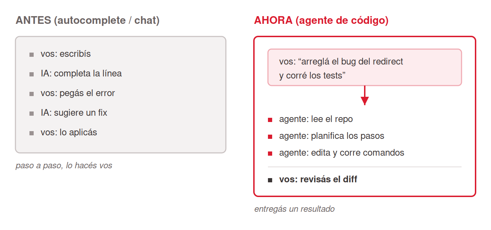
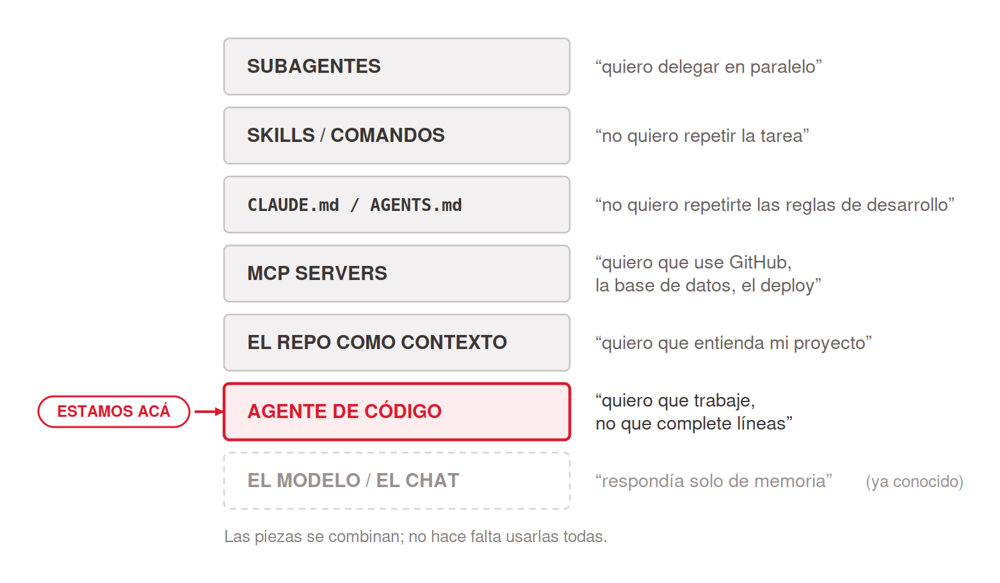
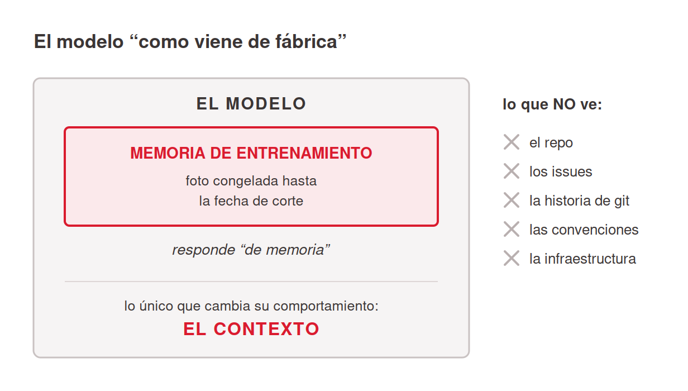
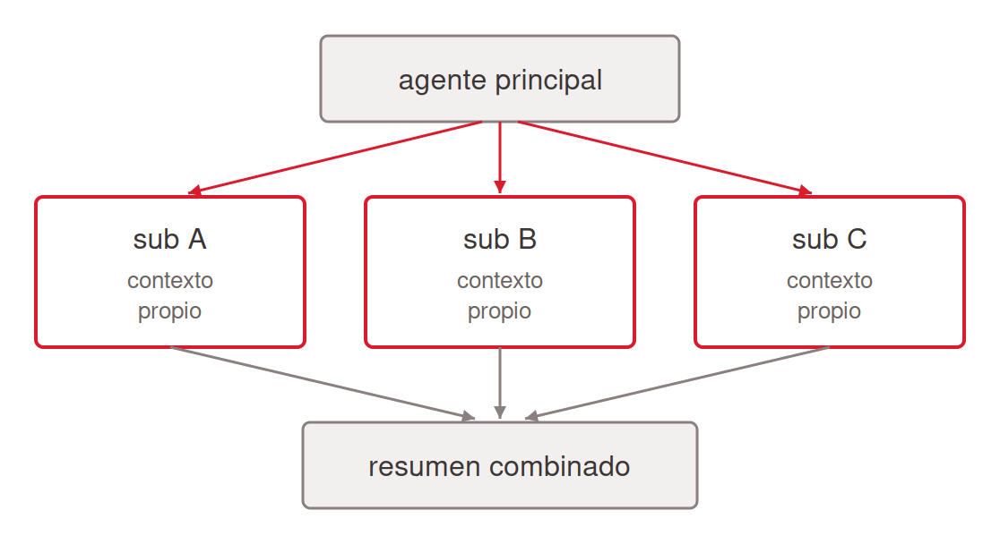
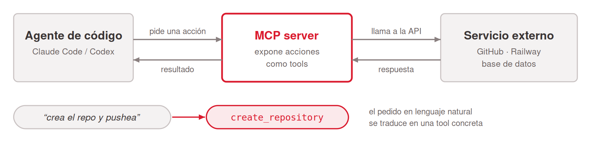
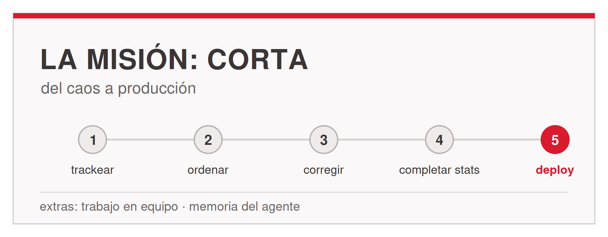

# Thesis

**Claim:** Los agentes de código (Claude Code, Codex) cambian el rol del programador: en vez de escribir cada línea, se delega una tarea completa de desarrollo y se guía el proceso. Las piezas son generales y valen para cualquier proyecto: el repo como contexto, CLAUDE.md como contrato, Skills y subagentes como piezas reutilizables, y MCP como el estándar por el que el agente toca todo el ecosistema de desarrollo (versionado, bases de datos, browsers, observabilidad, infraestructura). Al final, la misión Corta es la práctica de la semana.

**Why it matters:** Saber operar un agente de código ya es parte del oficio: quien domina la forma de delegar (dar contexto, fijar reglas, revisar diffs) multiplica su capacidad de trabajo, y quien no, compite contra eso. La audiencia sabe programar, así que la clase va rápido por los conceptos y profundo en los mecanismos: qué contexto ve el agente, cómo decide usar una herramienta MCP, dónde se equivoca. Los conceptos exceden por mucho el caso de la misión; la misión es solo el primer terreno donde aplicarlos.

---

# Agenda

**Narrative arc:** La clase abre con el problema que la audiencia ya vive: el trabajo de desarrollo está lleno de tareas que no son escribir código nuevo (entender un repo heredado, ordenar, documentar, migrar, deployar) y hasta ahora la IA solo ayudaba a tipear. La primera sección presenta la categoría nueva: agentes de código que ejecutan tareas enteras, el catálogo (Claude Code y Codex, misma familia que el chat que ya usan), el cambio de rol al delegar, el mapa de piezas que se apilan y el arranque concreto: pararse en una carpeta y abrir el agente (1). De ahí, la pregunta técnica que ordena todo: ¿qué ve el agente? El modelo responde de memoria de entrenamiento y lo único que cambia su comportamiento es el contexto; para un agente de código, el contexto es el repo: el árbol de archivos, el código, el README, las configs. De ahí el rol de Markdown: todas las piezas del ecosistema son archivos `.md` con frontmatter, y la regla práctica es guardar la memoria, las especificaciones y el conocimiento del proyecto en ese formato dentro del repo, donde cada sesión futura los encuentra. Sobre esa base se enseña el hábito de trabajo: iterar con el agente sobre el código en vueltas chicas (2). Si el repo es el contexto, el contrato es CLAUDE.md / AGENTS.md: la memoria del repo, donde se fijan una vez las reglas que el agente respeta en cada sesión; se muestra un ejemplo completo (3). Después, dos piezas de reuso en versión breve, porque la audiencia las va a descubrir sola: Skills y comandos, la tarea explicada una vez que se dispara con / o por su descripción (4), y subagentes, asistentes con contexto propio que corren en paralelo y devuelven un resumen (5). La última sección de teoría es la central y la nueva: MCP, el estándar por el que un agente descubre y usa herramientas externas; cómo funciona el protocolo, por qué conviene hacerle leer la spec de un server antes de usarlo, y el ecosistema que ya existe para desarrollo: servers para versionado, bases de datos, browsers, observabilidad, gestión de proyectos, diseño e infraestructura, con directorios donde encontrarlos (6). Las conclusiones cierran la teoría con el cambio de rol y los cuidados del oficio: secretos fuera del código y del contexto, revisar los diffs antes de commitear, y la regla de que el agente se equivoca con confianza (Conclusions). Recién entonces aparece la misión, como práctica de todo lo anterior: Corta, el acortador de URLs heredado sin git ni documentación, sus herramientas concretas (los MCPs de GitHub y Railway) y el arco de milestones que lo lleva del caos a producción; la clase termina en esa consigna, con Q&A sobre la placa (7).

**Sections (in delivery order):**

- 1. Agentes de código
- 2. El repo como contexto
- 3. El contrato de trabajo
- 4. Skills y comandos
- 5. Subagentes
- 6. MCP servers
- Conclusions (cierra la teoría, va antes de la misión)
- 7. La misión: Corta (última: después de la misión termina la clase)

---

# 1. Agentes de código

**Goal of this section:** Ubicar la categoría: qué son Claude Code y Codex, el cambio de rol al delegar tareas enteras de desarrollo, el mapa de piezas que la clase recorre (modelo, agente, contexto, herramientas) y el arranque concreto en una carpeta. Cinco láminas.

---

## 1. El problema: el trabajo que no es escribir código

### Content

- El trabajo de desarrollo está lleno de tareas que no son escribir código nuevo: **entender un repo heredado**, ordenar, documentar, corregir bugs ajenos, migrar, deployar.
- Hasta ahora la IA ayudaba a **tipear**: autocomplete, snippets, un chat al costado donde se pega un error.
- Ninguna de esas herramientas **resuelve la tarea entera**: leer el proyecto, decidir, tocar archivos, verificar.

<!-- generate-image: right | un escritorio de desarrollador desbordado: un repo heredado sin documentacion, issues abiertos, una terminal con errores, el reloj corriendo -->

### Sources

- (slide organizativa de la clase: encuadre del problema a partir de la realidad de trabajo de la audiencia; sin claims de producto.)
- Adaptación del encuadre de apertura de `talks/claude-desktop-chat/draft.md` (slide 1.1, el problema de las horas manuales), trasladado al mundo del desarrollo.

### Speaker notes

Abrir con el dolor antes que con la herramienta: preguntar a mano alzada quién heredó alguna vez un proyecto sin documentación, o quién pasó una tarde entera entendiendo código ajeno antes de poder tocar una línea. La problemática tiene dos caras: tareas enteras que consumen horas (entender, ordenar, migrar, deployar) y herramientas de IA que hasta ahora solo aceleraban el tipeo. El autocomplete y el chat con código pegado ayudan, pero el trabajo pesado (leer el proyecto completo, decidir, ejecutar, verificar) seguía siendo manual. Esta clase existe porque apareció una categoría que sí toma la tarea entera. Tiempo objetivo: ~3 min.

---

## 2. Agentes de código: Claude Code y Codex

### Content

- **Agente de código** = un programa que recibe una tarea en lenguaje natural, **planifica, edita archivos, corre comandos y verifica**, en un loop, hasta entregar.
- **Claude Code** (Anthropic): CLI agéntico en la terminal; también con extensiones de IDE y app de escritorio.
- **Codex** (OpenAI): el equivalente del otro lab; CLI y modo cloud.
- Misma familia que el chat que ya usan: **mismos modelos por debajo, otra superficie**.
- En esta materia pueden usar **la herramienta que prefieran**; la clase se demuestra con Claude Code.

### Sources

- Claude Code docs, Overview: https://code.claude.com/docs/en/overview; Claude Code como herramienta agéntica de línea de comandos que trabaja en el codebase del usuario (pendiente de re-verificación antes de la clase).
- OpenAI, Codex: https://developers.openai.com/codex; el agente de código de OpenAI, CLI y cloud (pendiente de re-verificación antes de la clase).
- `missions/clase2/mission.md`, sección "Las herramientas": herramienta libre, recomendadas Claude Code o Codex.
- Adaptación de `talks/claude-desktop-chat/draft.md` (slide 1.4, las cuatro herramientas de Claude): la relación entre superficies sobre los mismos modelos.

### Speaker notes

El catálogo, corto porque la audiencia ya conoce los nombres. Dar la definición operativa: un agente de código recibe la tarea, arma un plan, edita los archivos del proyecto, corre comandos (tests, builds, git) y mira el resultado para decidir el paso siguiente. El loop de planificar, ejecutar y verificar lo separa del autocomplete y del chat.

Nombrar los dos: Claude Code de Anthropic y Codex de OpenAI. Son equivalentes en concepto; la clase se demuestra con Claude Code pero nada de lo conceptual depende de la herramienta, y la misión acepta cualquiera. El puente con lo que ya saben: son los mismos modelos que el chat que usan a diario, cambiada la superficie. Un chat responde texto en una ventana; un agente deja commits, archivos y deploys.

No demorarse acá: la mecánica del cambio de rol es la lámina siguiente. Tiempo objetivo: ~3 min.

---

## 3. Delegar una tarea completa

### Content

- Cambia el **rol**. Autocompletar y chatear vs delegar:

| | Autocomplete / chat | Delegar a un agente |
|---|---|---|
| La unidad de trabajo | Una línea, un snippet | Una tarea completa |
| Los pasos | Los hace la persona | El agente planifica y ejecuta |
| La salida | Texto para copiar y pegar | Diffs, commits, archivos, deploys |
| El rol humano | Escribir y pegar | Revisar el plan y los diffs, corregir el rumbo |


<!-- ascii-source:
ANTES (autocomplete / chat)         AHORA (agente de codigo)
+---------------------+             +--------------------------+
| vos: escribis       |             | vos: "arregla el bug de  |
| IA: completa linea  |             |       redirect y testea" |
| vos: pegas error    |             |          |               |
| IA: sugiere fix     |             |          v               |
| vos: lo aplicas     |             | agente: lee el repo      |
+---------------------+             | agente: planifica        |
 paso a paso, lo haces vos          | agente: edita y corre    |
                                    | vos: revisas el diff     |
                                    +--------------------------+
                                     entregas un resultado
-->
<!-- ascii-note:
intent: contrastar el modo "autocomplete / chat" (la persona hace cada paso y la IA sugiere texto) contra el modo "agente de codigo" (se delega una tarea completa, el agente lee el repo, planifica, edita y corre comandos, y la persona revisa el diff).
emphasize: el cambio de paradigma de izquierda (ANTES) a derecha (AHORA); que en AHORA el agente hace el trabajo sobre el repo real y la persona revisa y guia.
labels: ANTES (autocomplete / chat) vs AHORA (agente de codigo); pie izquierdo "paso a paso, lo haces vos", pie derecho "entregas un resultado".
-->

### Sources

- Adaptación de `talks/claude-cowork/draft.md` (slide 1.2, "De chatear a delegar"): misma tabla y mismo diagrama, cambiado el mundo del ejemplo de oficina a desarrollo.
- Anthropic Engineering, Building agents with the Claude Agent SDK: https://www.anthropic.com/engineering/building-agents-with-the-claude-agent-sdk; el loop de planificar, ejecutar y verificar como definición de agente frente a un chat.

### Speaker notes

La misma tabla que en la versión de oficina, con los ejemplos en su mundo. Recorrer las cuatro filas: la unidad de trabajo ahora es la tarea completa ("migrá la persistencia a Postgres" en lugar de "completame este callback"); los pasos intermedios los planifica y ejecuta el agente; la salida son diffs y commits; y el rol humano se corre a revisar. Subrayar ese último punto con esta audiencia: delegar exige revisar. El diff se lee entero antes de aceptar, igual que en un code review a un colega junior brillante pero con exceso de confianza. Anticipar la misión en una frase: Corta es exactamente esto, una tarea grande delegada en vueltas chicas. Tiempo objetivo: ~4 min.

---

## 4. El mapa: piezas que se apilan

### Content

**Idea clave:** cada pieza resuelve un problema conocido y se apila sobre la anterior.


<!-- ascii-source:
   +----------------------+  "quiero delegar en paralelo"
   | SUBAGENTES           |
   +----------------------+
   +----------------------+  "no quiero repetir la tarea"
   | SKILLS / COMANDOS    |
   +----------------------+
   +----------------------+  "no quiero repetirte las reglas de desarrollo"
   | CLAUDE.md / AGENTS.md|
   +----------------------+
   +----------------------+  "quiero que use GitHub,
   | MCP SERVERS          |   la base de datos, el deploy"
   +----------------------+
   +----------------------+  "quiero que entienda mi proyecto"
   | EL REPO COMO CONTEXTO|
   +----------------------+
   +----------------------+  "quiero que trabaje, no que        <== ACA
   | AGENTE DE CODIGO     |   complete lineas"
   +----------------------+
   +----------------------+  "respondia solo de memoria"        (conocido)
   | EL MODELO / EL CHAT  |
   +----------------------+
-->
<!-- ascii-note:
intent: presentar el arco de la clase como piezas que se apilan: el modelo/chat (base, ya conocido) -> el agente de codigo -> el repo como contexto -> MCP servers -> CLAUDE.md/AGENTS.md -> Skills/comandos -> subagentes. El bloque del agente lleva el marcador "estamos aca"; la base lleva "(conocido)".
emphasize: el marcador "<== ACA" en el bloque del agente; el par pieza-problema en cada nivel; que no es una escalera estricta sino piezas que se combinan.
labels: bloques apilados (base a cima): El modelo / el chat, Agente de codigo, El repo como contexto, MCP servers, CLAUDE.md / AGENTS.md, Skills / comandos, Subagentes, cada uno con su frase-problema a la derecha.
-->

### Sources

- Adaptación de `talks/claude-cowork/draft.md` (slide 1.3, el mapa de bloques): misma idea de pila, re-armada con las piezas del mundo Claude Code (el repo en lugar de la carpeta, CLAUDE.md en lugar de Instrucciones, MCP como sección propia).

### Speaker notes

El roadmap de la clase en una lámina. Leer la línea de idea clave en voz alta apenas aparece y recorrer los bloques de abajo hacia arriba, cada uno con su frase-problema. La base es conocida: el modelo que responde de memoria, el chat que ya usan. Estamos en el bloque del agente, la pieza nueva de hoy. Los cinco de arriba son las secciones que vienen, en orden: el repo como contexto (sección 2), MCP para las herramientas externas (sección 6, la central), CLAUDE.md para no repetir las reglas (sección 3), Skills para no repetir la tarea (sección 4) y subagentes para delegar en paralelo (sección 5). Aclarar que el orden de la pila no es el orden de la clase: MCP se enseña al final de la teoría porque es la pieza que la misión usa más fuerte. Cuidado con la metáfora: las piezas se combinan, no hace falta usarlas todas. Al final, la pila entera es lo que van a armar en Corta. Tiempo objetivo: ~3 min.

---

## 5. Dónde se empieza: pararse en una carpeta

### Content

- Se instala el CLI y se abre **parado en la carpeta del proyecto**: `cd mi-proyecto/ && claude` (o `codex`).
- El directorio de trabajo **define el alcance**: el agente ve ese árbol de archivos, no el resto del disco.
- La primera interacción es una pregunta de reconocimiento: *"¿qué hay en este proyecto y en qué estado está?"*
- El agente pide **aprobación** para acciones sensibles (editar, correr comandos); se puede ajustar cuánto pregunta.

### Sources

- Claude Code docs, Quickstart: https://code.claude.com/docs/en/quickstart; instalación y arranque en el directorio del proyecto (pendiente de re-verificación antes de la clase).
- Adaptación de `talks/claude-cowork/draft.md` (slide 1.4, dónde se empieza en Cowork): el mismo beat de arranque y de control de aprobaciones, en la superficie CLI.

### Speaker notes

La lámina práctica de la sección, y el eco directo del arranque de la misión. Con conexión, hacerlo en vivo: abrir una terminal, pararse en una carpeta de proyecto cualquiera, abrir el agente y tirarle la pregunta de reconocimiento. Ver al agente listar el árbol, leer el README y devolver un resumen del estado vale más que cualquier bullet.

Dos ideas para fijar. Una, el directorio de trabajo es el alcance: el agente ve lo que hay de ahí para abajo, y eso es a la vez el mecanismo de contexto (sección 2) y el límite de seguridad. Dos, el modelo de aprobación: por defecto el agente pide permiso antes de editar o correr comandos, y eso se puede relajar a medida que hay confianza. No entrar en el detalle de los modos de permiso, que cambian seguido; el beat es que el control existe y se gradúa.

La pregunta de reconocimiento es el hábito a instalar: ante cualquier proyecto nuevo, propio o ajeno, la primera interacción con el agente es pedirle el mapa. Tiempo objetivo: ~3 min.

---

# 2. El repo como contexto

**Goal of this section:** La pregunta técnica que ordena la clase: qué ve el agente. El modelo responde de memoria de entrenamiento y lo único que cambia su comportamiento es el contexto; para un agente de código el contexto es el repo. Qué lee al pararse en una carpeta, el rol de Markdown como formato del ecosistema, la regla de guardar memoria, especificaciones y conocimiento en `.md` dentro del repo, y el hábito de iterar en vueltas chicas sobre el código. Cinco láminas.

---

## 1. El modelo responde de memoria

### Content

- De fábrica, el modelo responde de su **memoria de entrenamiento**: una foto congelada hasta la fecha de corte. No conoce el proyecto.
- **In-context learning**: el modelo adapta su comportamiento con lo que ve en el prompt, sin reentrenarse. El contexto es **la única palanca**.
- Para un agente de código, la consecuencia es directa: **la calidad del resultado depende del contexto que le llega**, y ese contexto es el repo.


<!-- ascii-source:
        EL MODELO "COMO VIENE DE FABRICA"
                                             lo que NO ve:
   +---------------------------------+       x  el repo
   |            EL MODELO            |       x  los issues
   |  +---------------------------+  |       x  la historia de git
   |  |  MEMORIA DE ENTRENAMIENTO |  |       x  las convenciones
   |  |  (foto congelada hasta la |  |       x  la infraestructura
   |  |   fecha de corte)         |  |
   |  +---------------------------+  |
   |     responde "de memoria"       |
   |                                 |
   |  lo unico que cambia su         |
   |  comportamiento: EL CONTEXTO    |
   +---------------------------------+
-->
<!-- ascii-note:
intent: mostrar que el modelo sin contexto responde solo desde su memoria de entrenamiento (foto congelada hasta la fecha de corte), no conoce nada del proyecto del usuario, y que lo unico que modifica su comportamiento en el momento es el contexto (in-context learning).
emphasize: la caja interna "MEMORIA DE ENTRENAMIENTO (foto congelada)"; la linea "lo unico que cambia su comportamiento: EL CONTEXTO"; la lista de lo que NO ve (repo, issues, historia de git, convenciones, infraestructura) fuera de la caja.
labels: caja exterior = EL MODELO; caja interior = memoria de entrenamiento / fecha de corte; columna derecha = lo que no ve.
-->

### Sources

- Adaptación de `talks/claude-desktop-chat/draft.md` (slide 2.1, el chat responde de memoria): mismo concepto y mismo diagrama, con la columna de "lo que no ve" cambiada al mundo del proyecto.
- Definición de in-context learning aportada por el presentador (2026-07-31, deck del MiM): la capacidad de un modelo de adaptar su comportamiento solo a partir de lo que ve en el prompt, sin que se le actualicen los pesos.

### Speaker notes

Para esta audiencia la lámina es repaso conceptual, así que va rápida y con el remate puesto en la ingeniería. El modelo tiene los pesos congelados y una fecha de corte; conoce el framework porque leyó millones de repos, pero no conoce este repo, ni estas convenciones, ni esta infraestructura. Lo único que cambia su comportamiento en el momento es lo que entra en el contexto (in-context learning). De ahí la consecuencia: operar bien un agente es administrar qué contexto le llega. El agente de código automatiza justamente eso: en lugar de que la persona copie y pegue archivos en un chat, el agente lee el repo solo. Cómo lo hace es la lámina siguiente. Tiempo objetivo: ~4 min.

---

## 2. Qué lee el agente al pararse en el repo

### Content

- El agente **no carga el repo entero** en el contexto: lo explora con herramientas, como lo haría una persona.
- Primero **el mapa**: árbol de archivos, README, configs (`package.json`, lockfiles), y la memoria del repo (CLAUDE.md / AGENTS.md, sección 3).
- Después, **búsqueda dirigida** según la tarea: grep, lectura de archivos puntuales, historia de git, RAG.
- Consecuencia práctica: **un repo ordenado y con buenos nombres es un repo que el agente entiende mejor.** Lo mismo que le sirve a un humano nuevo en el equipo.

### Sources

- Claude Code docs, How Claude Code works: https://code.claude.com/docs/en/overview; el agente explora el codebase con herramientas de lectura y búsqueda en lugar de cargarlo entero (pendiente de re-verificación y de URL exacta antes de la clase).
- Adaptación de `talks/claude-cowork/draft.md` (slides 2.1 y 3.3): el agente trabaja la carpeta con herramientas de archivo y cambia de estrategia según el volumen; misma mecánica contada para el repo.

### Speaker notes

La respuesta mecánica a "¿qué ve?". Desarmar el malentendido más común primero: el agente no mete el repo entero en la ventana de contexto. Explora con herramientas: lista el árbol, lee el README y las configs para armarse el mapa, y después busca dirigido por la tarea, con grep y lecturas puntuales, igual que un desarrollador que acaba de clonar. La historia de git también es contexto: un `git log` le cuenta qué se tocó último y por qué.

La consecuencia práctica es la que conviene dejar clavada: el orden del repo es contexto. Nombres de archivo que dicen qué hay adentro, un README que explica cómo correr el proyecto, estructura predecible: todo eso mejora directamente lo que el agente puede hacer. El anti-ejemplo: el repo con un `server_OLD.js`, un `index_v2_FINAL.js` y una carpeta "Nueva carpeta". Ordenar el repo es ingeniería de contexto, en cualquier proyecto en el que el agente vaya a trabajar. Tiempo objetivo: ~3 min.

---

## 3. Markdown, el formato del ecosistema

### Content

- Todas las piezas de las secciones que siguen son **archivos Markdown**: el contrato (`CLAUDE.md`), las Skills (`SKILL.md`), los subagentes.
- Por qué: **texto plano** que el modelo lee nativo, con marcas de estructura simples y un **frontmatter YAML** que declara qué es el archivo y cuándo usarlo.
- Entra en diffs, commits y PRs **como el código**: el mismo flujo de revisión vale para el conocimiento.

### Sources

- Adaptación de `talks/claude-cowork/draft.md` (slide 2.2, qué es un .md): el mismo argumento de formato, sin la explicación de sintaxis (esta audiencia conoce Markdown); acá el foco es que el ecosistema agéntico entero está hecho de ese formato.
- Claude Code docs, Memory y Skills: https://code.claude.com/docs/en/memory y https://code.claude.com/docs/en/skills; CLAUDE.md y SKILL.md como archivos Markdown con frontmatter (pendiente de re-verificación antes de la clase).

### Speaker notes

Lámina corta y de diseño, sin sintaxis: la audiencia sabe qué es Markdown, así que el punto no es enseñarlo sino mostrar el patrón. Todas las piezas que la clase va a recorrer (el contrato de la sección 3, las Skills de la 4, los subagentes de la 5) son archivos Markdown con la misma anatomía: frontmatter YAML arriba declarando qué es la pieza y cuándo se usa, prosa abajo con las instrucciones. El modelo lee ese formato nativo, sin parsers ni capas de por medio.

La consecuencia de ingeniería es la que vale decir despacio: si las piezas son texto plano en el repo, entran al flujo que el equipo ya tiene. Un cambio al contrato es un diff que se revisa en un PR, una Skill nueva es un commit, y la historia de git cuenta cómo evolucionó el conocimiento igual que cuenta cómo evolucionó el código. La lámina siguiente extiende el mismo criterio a todo el conocimiento del proyecto. Tiempo objetivo: ~2 min.

---

## 4. El conocimiento del proyecto, en .md

### Content

**La regla:** lo que el agente deba saber se guarda en **`.md` dentro del repo**: memoria, especificaciones y conocimiento en general.

- **Memoria**: decisiones tomadas, estado de un trabajo largo, preferencias del equipo.
- **Especificaciones**: la spec de una feature escrita antes de implementarla; el agente la usa como guía y como criterio de terminado.
- **Conocimiento**: notas de arquitectura, hallazgos de una investigación, documentación de procesos.
- El agente lo lee como contexto en cualquier sesión futura: **el conocimiento sobrevive a la conversación.** En una wiki externa o un formato opaco, el agente no lo ve.

### Sources

- Adaptación de `talks/claude-cowork/draft.md` (slides 2.1 y 2.3): el argumento de que el material de trabajo es conocimiento e instrucciones y necesita un formato que la máquina lea; acá trasladado del escritorio de oficina al repo.
- MindStudio (blog), el "LLM wiki" de Andrej Karpathy: https://www.mindstudio.ai/blog/andrej-karpathy-llm-wiki-knowledge-base-claude-code; el conocimiento propio en archivos `.md` estructurados que el modelo consulta directo, sin base vectorial de por medio (fuente heredada del deck del MiM, verificada 2026-07-31 para aquel deck).

### Speaker notes

La lámina que baja la regla a la práctica del equipo. El razonamiento viene armado de las láminas anteriores: el contexto es la única palanca (2.1), el agente lee el repo (2.2) y el formato nativo es Markdown (2.3); entonces el conocimiento que el agente necesita se escribe en `.md` y se commitea. Recorrer los tres tipos con un ejemplo hablado cada uno: la memoria (qué se decidió y por qué, el estado de una migración a medio hacer), las especificaciones (escribir la spec en `.md` antes de implementar, y que el agente implemente contra ella), y el conocimiento general (notas de arquitectura, hallazgos, procesos del equipo).

El contraste que fija la regla: ese mismo material en una wiki externa, un Google Doc o un `.docx` queda fuera del alcance del agente; en el repo, cada sesión futura lo encuentra sola. Para quien quiera una referencia externa, el "LLM wiki" de Karpathy es la misma idea llevada al conocimiento personal: archivos `.md` estructurados que el modelo consulta directo. Atribuirla como propuesta de Karpathy recogida por el equipo de MindStudio.

Enganchar con lo que sigue: la lámina de iterar (2.5) muestra el hábito de trabajo sobre el código, y la sección 3 es el caso más importante de esta regla, el contrato del repo. El extra de memoria de la misión pide exactamente esto en versión automatizada. Tiempo objetivo: ~3 min.

---

## 5. Iterar con el agente sobre el código

### Content

**Idea clave:** con un agente nada sale bien a la primera, y no hace falta. El trabajo son **vueltas chicas**: pedir, revisar el diff, corregir el rumbo, volver a pedir.

- **Cada vuelta es un pedido chico y verificable**: *"arreglá el redirect"*, *"agregá el test que lo cubre"*, *"renombrá y actualizá los imports"*.
- **El diff es la unidad de revisión.** Se lee antes de aceptar, siempre. Commits chicos y frecuentes hacen cada vuelta reversible.
- Pedidos gigantes ("hacé todo el proyecto") producen diffs imposibles de revisar. **Partir la tarea en pedidos revisables.**

### Sources

- Adaptación de `talks/claude-cowork/draft.md` (slide 2.3, iterar en .md): el mismo beat de iteración, trasladado del archivo .md al diff y al commit como unidad de vuelta.

### Speaker notes

El hábito de trabajo que se llevan, y el equivalente exacto de "iterar en .md" de la clase de oficina: acá la mesa de trabajo es el repo y la moneda de la iteración es el diff. Decir sin vergüenza que nada sale bien a la primera, y que eso no es un defecto de la herramienta sino el modo de uso: se pide, se lee lo que salió, se corrige el rumbo, se vuelve a pedir. Cada vuelta sale barata. Aceptar un diff sin leerlo es lo que después cuesta caro.

Los tres ejemplos de pedido conviene decirlos en voz alta porque marcan el tamaño correcto de la vuelta: chico y verificable. El anti-patrón es el pedido gigante, que devuelve un diff de 40 archivos que nadie va a leer; la habilidad nueva del oficio es partir la tarea en pedidos revisables. Enganchar con git: commits chicos y frecuentes convierten cada vuelta en un checkpoint reversible, y la historia del repo queda contando cómo se llegó, cambio por cambio. Tiempo objetivo: ~3 min.

---

# 3. El contrato de trabajo

**Goal of this section:** CLAUDE.md / AGENTS.md como la memoria y las reglas del repo: el equivalente de las Instrucciones de un Project, versionado junto al código. Qué conviene fijar ahí y qué no, y un ejemplo completo. Dos láminas.

---

## 1. CLAUDE.md / AGENTS.md: la memoria del repo

### Content

- Un archivo en la raíz del repo que el agente **lee al arrancar cada sesión**: contexto e instrucciones permanentes del proyecto.
- **CLAUDE.md** (Claude Code) y **AGENTS.md** (Codex y otros): mismo concepto, el contrato de trabajo del repo.
- Qué va ahí: cómo correr y testear el proyecto, convenciones del equipo, arquitectura en dos líneas, **reglas no negociables**.
- Qué no va: nada que el código ya diga por sí solo, ni detalle que se desactualiza en una semana.
- Se versiona con git: **el contrato es del equipo entero** y le llega a cada sesión del agente.

### Sources

- Claude Code docs, Memory (CLAUDE.md): https://code.claude.com/docs/en/memory; el archivo de memoria del proyecto que se carga al inicio de cada sesión (pendiente de re-verificación antes de la clase).
- AGENTS.md (estándar abierto): https://agents.md; el equivalente multi-herramienta (pendiente de re-verificación antes de la clase).
- Adaptación de `talks/claude-cowork/draft.md` (slide 3.4, Instrucciones: el contrato de trabajo): mismo concepto, con la diferencia clave de que acá el contrato es un archivo versionado y no un campo de la GUI.

### Speaker notes

La traducción directa de las Instrucciones de un Project al mundo del código, con una mejora que a esta audiencia le va a gustar: el contrato es un archivo en el repo, así que se versiona, se revisa en PRs y le llega igual a cada integrante y a cada sesión del agente. En lugar de re-explicar el proyecto cada vez, se escribe una vez.

El criterio de contenido es el que separa un CLAUDE.md útil de uno que molesta. Va lo que el agente no puede deducir del código: cómo se corre y testea el proyecto, las convenciones que el equipo eligió, las reglas duras (qué no tocar, qué no commitear). No va lo que el código ya dice ni el detalle fino que se desactualiza. Corto y estable le gana a largo y exhaustivo, porque el archivo entra en el contexto de cada sesión.

Mencionar la dualidad de nombres sin dramatizarla: CLAUDE.md para Claude Code, AGENTS.md como estándar que Codex y otros leen; el concepto es el mismo y en la misión pueden usar el que corresponda a su herramienta. El ejemplo completo es la lámina siguiente. Tiempo objetivo: ~3 min.

---

## 2. Un ejemplo de CLAUDE.md

### Content

<!-- ascii-render: documentation-only -->
```markdown
# CLAUDE.md, API de turnos del hospital

Servicio Node/Express + Postgres. Frontend aparte (repo turnos-web).

## Correr y testear
- `npm install && npm run dev` (puerto: variable PORT, no hardcodear)
- Tests: `npm test`. Ningun cambio se commitea con tests rotos.

## Convenciones
- TypeScript estricto. Codigo en ingles, comentarios en español.
- Commits chicos, mensaje en imperativo: "Corrige solapamiento de turnos".
- Migraciones de schema solo via migrations/, nunca SQL a mano.

## Reglas no negociables
- NUNCA commitear secretos: credenciales van en variables de entorno.
- No tocar la carpeta legacy/ sin avisar: la mantiene otro equipo.
- Todo diff se revisa antes de commitear.
```

**Nadie escribe esto a mano desde cero.** El agente lo genera de dos fuentes: **leyendo el repo** y **de las instrucciones explícitas del usuario** a medida que avanza la conversación.

- Conviene **decirle lo más posible desde el principio**, y pedirle que **vaya recolectando en el CLAUDE.md** las preferencias e instrucciones que aparezcan.
- El trabajo humano: revisar que las reglas duras estén.

### Sources

- Adaptación de `talks/claude-cowork/draft.md` (slide 3.5, un ejemplo de Instrucciones): misma estructura (rol, cómo trabajar, reglas de oro), con el caso cambiado a un servicio genérico de equipo.
- Claude Code docs, Memory: https://code.claude.com/docs/en/memory; el comando `/init` genera un CLAUDE.md inicial leyendo el proyecto (pendiente de re-verificación antes de la clase).

### Speaker notes

Recorrer el ejemplo por zonas, sin leerlo palabra por palabra: qué es el proyecto en dos líneas, cómo se corre y testea, las convenciones del equipo y las reglas no negociables. Detenerse en las reglas duras, que son el equivalente de la regla de oro de la clase de oficina: la de secretos y la de revisar diffs son exactamente los cuidados que cierran la clase, y fijarlas en el contrato es lo que hace que el agente las respete en cada sesión sin que nadie las repita.

El remate baja la barrera: nadie escribe esto a mano desde cero, y el archivo tiene dos fuentes. La primera es el repo: se le pide al agente que lo genere leyéndolo (Claude Code trae `/init` para eso). La segunda es la conversación: las instrucciones y preferencias que el usuario va expresando mientras trabaja. De ahí las dos prácticas que conviene decir explícitas. Una, decirle al agente lo más posible desde el principio, porque cada regla dicha temprano evita vueltas después. Dos, pedirle a Claude o Codex que vaya recolectando en el CLAUDE.md las preferencias e instrucciones que aparezcan en la conversación, así el contrato crece con el trabajo en lugar de quedarse en la versión del día uno. El trabajo humano es revisar que las reglas que importan estén y que no haya relleno. Un buen CLAUDE.md es la diferencia entre repetirle las reglas al agente en cada sesión y que las respete solo, en cualquier proyecto del equipo. Tiempo objetivo: ~3 min.

---

# 4. Skills y comandos

**Goal of this section:** La pieza de reuso de tareas, en versión breve porque la audiencia la va a descubrir sola: qué es una Skill (una tarea explicada una vez, en un archivo), cómo se dispara (explícita con /, o automática por su descripción) y una de ejemplo. Dos láminas.

---

## 1. Qué es una Skill

### Content

*"Todo lo que le explicás al agente más de una vez es una Skill que deberías escribir una vez."*

- **Un instructivo en un archivo**: una carpeta con un `SKILL.md` (metadata YAML + pasos en prosa). No es código, aunque puede incluirlo.
- **Se enseña una vez**: después la tarea sale siempre igual, mismos pasos, mismo formato de salida.
- **Un trabajo por Skill**: si al describirla aparece un "y además", son dos.
- Ejemplo: una Skill `reporte-de-cambios` que lee los commits nuevos del repo y arma el reporte con el formato del equipo.

### Sources

- Claude Code docs, Skills: https://code.claude.com/docs/en/skills; las Skills como carpetas con SKILL.md, frontmatter con name y description (pendiente de re-verificación antes de la clase).
- Adaptación de `talks/claude-cowork/draft.md` (slide 4.1, qué es una Skill): misma definición y misma frase de apertura, con el ejemplo cambiado al mundo del repo.

### Speaker notes

Versión breve a propósito: esta audiencia va a descubrir las Skills sola en cuanto use la herramienta una semana, así que la clase deja el concepto y un ejemplo, no el tour completo. Abrir con la frase, que es todo el argumento: lo que se explica dos veces se escribe una.

La anatomía en una pasada: una Skill es una carpeta con un `SKILL.md`, que arriba lleva metadata (nombre y descripción) y abajo los pasos en prosa, con lo que haga falta al lado (scripts, templates). El criterio de recorte es "un trabajo por Skill". Otros ejemplos para tirar en voz alta, del oficio: preparar un release, armar el PR con la descripción con formato del equipo, revisar una migración de schema. Cualquier tarea que se explicó dos veces califica. Cómo se dispara es la lámina siguiente. Tiempo objetivo: ~3 min.

---

## 2. Cómo se dispara una Skill

### Content

- **Explícita:** se tipea `/` y se elige como comando: `/reporte-de-cambios`.
- **Automática:** se pide la tarea en lenguaje natural (*"armame el reporte de esta semana"*) y el agente la carga porque el pedido coincide con su **descripción**.
- La **description** es el disparador. Con una descripción vaga, la Skill nunca se activa sola.
- El mismo principio vuelve en los subagentes (sección 5): **la descripción decide cuándo se usa la pieza.**

### Sources

- Claude Code docs, Skills y slash commands: https://code.claude.com/docs/en/skills; invocación explícita como comando y activación por descripción (pendiente de re-verificación y de URL exacta antes de la clase).
- Adaptación de `talks/claude-cowork/draft.md` (slide 4.2, cómo se usa una Skill): los dos caminos de invocación, sin el diagrama, en versión comprimida.

### Speaker notes

Los dos caminos, en dos minutos. El explícito es el obvio: tipear `/` lista lo disponible y la Skill corre como comando; es el modo para estar seguro de qué corre. El automático es el que sorprende y el que deja la lección de diseño: el agente compara el pedido contra las descripciones de las Skills habilitadas y carga la que coincide. La descripción funciona como disparador; escribirla bien (qué hace la Skill y con qué palabras la pide la gente) decide si la pieza se activa sola.

Adelantar en una frase que el principio se repite: los subagentes de la sección siguiente se disparan igual, por descripción. Es la segunda vez que aparece la idea y conviene marcarla como patrón del ecosistema, no como detalle de las Skills. Si hay demo en vivo, tipear `/` y mostrar la lista alcanza. Tiempo objetivo: ~2 min.

---

# 5. Subagentes

**Goal of this section:** La pieza de paralelismo, en versión breve: qué es un subagente (asistente aislado con contexto propio que devuelve un resumen), cuándo conviene, y de qué está hecho uno propio (un archivo .md con frontmatter). Dos láminas.

---

## 1. Subagentes: varios trabajando a la vez

### Content

- **Subagente** = asistente aislado, con **ventana de contexto propia**; devuelve un **resumen**, no la transcripción.
- Para qué: sub-tareas pesadas o paralelas que generarían ruido en el contexto principal. Ejemplo: **auditar 6 módulos de un repo heredado**, un subagente por módulo, en paralelo.
- El agente principal reparte, espera y **consolida los resúmenes**.
- **Pedir el trabajo en partes separables** habilita el paralelo.


<!-- ascii-source:
                +------------------+
                | agente principal |
                +------------------+
                  /      |       \
                 v       v        v
          +--------+ +--------+ +--------+
          | sub A  | | sub B  | | sub C  |
          |contexto| |contexto| |contexto|
          |propio  | |propio  | |propio  |
          +--------+ +--------+ +--------+
                 \       |       /
                  v      v      v
                +------------------+
                | resumen combinado|
                +------------------+
-->
<!-- ascii-note:
intent: mostrar el patron fan-out/fan-in: el agente principal reparte una tarea entre varios subagentes que corren en paralelo con contexto propio, y junta los resultados en un resumen combinado.
emphasize: el paralelismo (tres subagentes a la vez) y que cada uno tiene contexto aislado; el resumen combinado al final.
labels: agente principal -> sub A / sub B / sub C (contexto propio) -> resumen combinado.
-->

### Sources

- Claude Code docs, Subagents: https://code.claude.com/docs/en/sub-agents; contexto propio, devuelve un resumen (verificado para el deck del MiM el 2026-07-31; re-verificar antes de la clase).
- Adaptación de `talks/claude-cowork/draft.md` (slide 5.1): mismo diagrama fan-out/fan-in, con el ejemplo cambiado de propuestas de proveedores a módulos de un repo.

### Speaker notes

Versión breve, dos ideas. Uno, el aislamiento: un subagente corre con su propia ventana de contexto, hace su trabajo sucio (leer mucho, probar cosas) y vuelve con un resumen; el contexto principal no se ensucia con la transcripción. Dos, el paralelismo: si la tarea se parte en pedazos independientes, varios subagentes corren a la vez. El ejemplo del repo heredado es el bueno para esta clase: auditar seis módulos, uno por subagente, y el principal arma el informe consolidado.

Lo accionable es cómo se pide: "auditá estos 6 módulos por separado" habilita el paralelo; "auditá el repo" no necesariamente. En Claude Code además se pueden definir subagentes propios con instrucciones fijas, que es la lámina siguiente, en un minuto. Tiempo objetivo: ~3 min.

---

## 2. Un subagente propio, por dentro

### Content

Un subagente propio es **un archivo `.md`**: frontmatter corto y las instrucciones en prosa.

<!-- ascii-render: documentation-only -->
```markdown
---
name: revisor-de-seguridad
description: Revisa un diff buscando secretos, credenciales y datos
  sensibles. Usar antes de cada commit importante.
tools: Read, Grep, Glob
---

Sos un revisor de seguridad. Para cada hallazgo: nombra el archivo
y la linea, explica el riesgo y propone la correccion.
```

- La **description** vuelve a ser el disparador: decide cuándo el agente principal le delega.
- En Claude Code van en **`.claude/agents/`** dentro del repo: se versionan con git, como el CLAUDE.md.
- **Nadie lo escribe a mano**: se le pide al agente que lo genere y se revisa la descripción.

### Sources

- Claude Code docs, Create custom subagents: https://code.claude.com/docs/en/sub-agents; subagentes como archivos Markdown con frontmatter YAML, name y description obligatorios, rutas `.claude/agents/` (proyecto) y `~/.claude/agents/` (usuario) (verificado para el deck del MiM el 2026-07-31; re-verificar antes de la clase).
- Adaptación de `talks/claude-cowork/draft.md` (slides 5.2 y 5.3): misma anatomía; acá sin el desvío por plugins porque en Claude Code los subagentes viven directo en el repo.

### Speaker notes

Un minuto y medio, tres señalamientos sobre el ejemplo. Uno, el frontmatter: nombre, descripción y herramientas permitidas; la descripción es de nuevo el disparador, tercera aparición del mismo patrón y conviene decirlo como tal. Dos, el cuerpo es prosa: las instrucciones del asistente, como se las explicarías a una persona. Tres, la ubicación: `.claude/agents/` adentro del repo, así que se versiona y el equipo entero lo hereda, igual que el CLAUDE.md; el contrato, las Skills y los subagentes son todos archivos del repo, y esa uniformidad es la gracia del diseño.

El ejemplo (revisor de seguridad que busca secretos en diffs) está elegido para sembrar los cuidados del cierre. Cerrar bajando la barrera: se le pide al agente que lo escriba y se revisa la descripción. Tiempo objetivo: ~2 min.

---

# 6. MCP servers

**Goal of this section:** La sección central y nueva: MCP como el estándar por el que un agente descubre y usa herramientas externas. Qué es el protocolo, cómo el agente decide usar una herramienta, la práctica de leer la spec de un server antes de usarlo, el ecosistema de servers que ya existe para desarrollo (versionado, bases de datos, browsers, observabilidad, gestión, diseño, infraestructura) y dónde encontrarlos. Cuatro láminas.

---

## 1. Qué es MCP

### Content

- El agente edita archivos y corre comandos, pero el trabajo real toca **sistemas externos**: GitHub, la base de datos, la plataforma de deploy.
- **MCP (Model Context Protocol)**: el estándar abierto que conecta agentes con esos sistemas. Un **MCP server** expone las acciones de un servicio como **herramientas** que el agente puede llamar.
- El mismo protocolo para todo: GitHub, Railway, bases de datos, browsers. **Se configura una vez por server y queda disponible.**


<!-- ascii-source:
+-----------+   pide accion   +-------------+   API del      +--------------+
| AGENTE DE | --------------&gt; | MCP SERVER  |   servicio     | GitHub /     |
| CODIGO    |                 | (expone     | -------------&gt; | Railway /    |
|           | <-------------- | tools)      | <------------- | base de datos|
+-----------+   resultado     +-------------+                +--------------+

        "crea el repo y pushea"     tool: create_repository
-->
<!-- ascii-note:
intent: mostrar el flujo de una llamada MCP: el agente de codigo pide una accion, el MCP server la expone como herramienta y traduce el pedido en llamadas a la API del servicio real (GitHub, Railway, una base de datos), y el resultado vuelve al agente.
emphasize: el MCP server como puente en el medio; la linea inferior que muestra la traduccion de un pedido en lenguaje natural ("crea el repo y pushea") a una tool concreta (create_repository).
labels: Agente de codigo -> MCP server (expone tools) -> servicio (GitHub / Railway / base de datos); flecha de ida "pide accion", flecha de vuelta "resultado".
-->

### Sources

- Model Context Protocol (sitio oficial del estándar): https://modelcontextprotocol.io; qué es MCP y cómo las plataformas exponen herramientas.
- Claude Code docs, MCP: https://code.claude.com/docs/en/mcp; cómo se conectan MCP servers a Claude Code (pendiente de re-verificación antes de la clase).
- Adaptación de `talks/claude-desktop-chat/draft.md` (slide 4.6, "todo pasa por MCP"): mismo diagrama de puente, con el chat reemplazado por el agente y el ERP por servicios del mundo del desarrollo.

### Speaker notes

Acá empieza la sección más importante de la clase, y conviene anunciarlo. Hasta ahora el agente trabajaba puertas adentro del repo; MCP le da manos fuera de él. La definición con el diagrama: un MCP server es un programa que expone las acciones de un servicio como herramientas tipadas, y el agente las llama como parte de su loop. El pedido en lenguaje natural de la línea de abajo se traduce en una tool concreta: eso es todo el protocolo, visto desde el usuario.

Para esta audiencia vale el paralelo técnico: es una capa de API pensada para modelos, con descubrimiento incluido, el mismo rol que un SDK cumple para un programador. Y el eco con la clase del MiM para quien la conozca: los Connectors del chat son exactamente esto, MCP con otra ropa; acá se usa el protocolo directo. La configuración es una vez por server y queda para todas las sesiones. Cómo decide el agente cuál herramienta usar es la lámina siguiente. Tiempo objetivo: ~4 min.

---

## 2. Cómo el agente descubre y usa una herramienta

### Content

- Al conectar un server, el agente recibe el **catálogo de tools**: nombre, descripción y parámetros de cada una.
- Ante una tarea, el agente **elige por descripción**: el mismo mecanismo que las Skills y los subagentes.
- El catálogo dice **qué** hace cada tool. **Cuándo y cómo conviene usarla** lo dice la spec del server.
- **La práctica: hacerle leer la spec antes de usar.** *"Leé la documentación de este MCP y explicame qué herramientas expone y para qué las vas a usar acá."*

### Sources

- Model Context Protocol, especificación (tools y descubrimiento): https://modelcontextprotocol.io; el listado de herramientas con nombre, descripción y schema de parámetros como parte del protocolo.

### Speaker notes

Primera mitad, el mecanismo: al conectar un server el agente recibe el catálogo de tools, cada una con nombre, descripción y parámetros, y cuando la tarea lo pide elige por descripción. Marcar la tercera aparición del patrón: Skills, subagentes y tools se disparan todos por descripción; a esta altura la audiencia lo tiene que poder completar sola.

Segunda mitad, el límite y la práctica. El catálogo dice qué hace cada tool, no cuándo conviene usarla en un flujo concreto: no dice que conviene crear el repo antes del primer push, ni que la base de datos se provisiona antes de configurar la variable de entorno. Por eso la práctica profesional es hacerle leer la spec y la documentación del server antes de usarlo, y pedirle que explique qué va a usar y para qué. Es barato y detecta malentendidos antes de que toquen infraestructura real; vale para cualquier server que conecten, hoy y en el trabajo. Tiempo objetivo: ~3 min.

---

## 3. El ecosistema MCP para desarrollo

### Content

Casi todo el toolchain de un equipo de desarrollo ya expone un MCP server:

| Qué toca | Servers (ejemplos) |
|---|---|
| Versionado y code review | GitHub, GitLab |
| Bases de datos | Postgres, MySQL, MongoDB, Supabase |
| Browsers y testing E2E | Playwright, Chrome DevTools |
| Observabilidad y errores | Sentry, Grafana |
| Gestión de proyectos | Jira, Linear, Slack |
| Diseño | Figma |
| Documentación de librerías | Context7 |
| Infraestructura y deploy | Railway, AWS, Cloudflare |

- El patrón es siempre el mismo: **el server expone tools, el agente las descubre y las usa.** Aprendido una vez, vale para todos.
- Con esto, el agente **opera el ciclo completo de desarrollo**, mucho más que el repo.

### Sources

- Repositorio de referencia de MCP servers: https://github.com/modelcontextprotocol/servers; lista servers oficiales y de la comunidad para las categorías de la tabla (los ejemplos concretos por fila quedan pendientes de re-verificación antes de la clase; el ecosistema cambia rápido).
- Model Context Protocol: https://modelcontextprotocol.io; el estándar común a todos.

### Speaker notes

La lámina que muestra el tamaño real del asunto, y la razón de que MCP sea la sección central: el toolchain entero del oficio ya está expuesto al agente. Recorrer la tabla por filas, rápido, con una frase de uso por categoría: la base de datos para inspeccionar el schema y correr queries mientras debuggea; Playwright o Chrome DevTools para que el agente pruebe la app como un usuario y vea la consola; Sentry para arrancar del stack trace real de producción; Jira o Linear para leer el ticket y dejar el estado actualizado; Figma para implementar desde el diseño real; Context7 para docs de librerías actualizadas (la memoria de entrenamiento tiene fecha de corte, lámina 2.1); Railway o AWS para la infraestructura.

El punto conceptual, dicho despacio: el patrón es uno solo. Server que expone tools, agente que las descubre por descripción, spec que se lee antes de usar. Aprendido con uno, vale para todos. La tabla va a quedar vieja en meses; el patrón queda. Aclarar que los ejemplos son eso, ejemplos: hay cientos, y la lámina siguiente dice dónde buscarlos. En la misión van a usar dos de estos (GitHub y Railway), pero eso se cuenta en la sección 7. Tiempo objetivo: ~4 min.

---

## 4. Dónde buscar servidores MCP publicados

### Content

| Fuente | Qué encontrás |
|---|---|
| github.com/modelcontextprotocol/servers | Repo de referencia mantenido por la comunidad y Anthropic |
| PulseMCP (pulsemcp.com) | Directorio curado, marca cuáles son oficiales del proveedor |
| Smithery (smithery.ai) | Marketplace de servidores MCP, instalación asistida |
| Glama (glama.ai/mcp/servers) | Directorio con ranking y metadata de cada servidor |
| mcp.so | Listado comunitario amplio |

**Criterio antes de conectar uno:** mirar **quién lo publica**. Un MCP server corre con las credenciales del usuario.

### Sources

- Lista aportada por el presentador (2026-07-31, deck del MiM, slide 4.8 de `talks/claude-desktop-chat/draft.md`); las cinco fuentes son directorios de terceros, pendientes de re-verificación antes de presentar.
- Model Context Protocol: https://modelcontextprotocol.io; el estándar bajo el que publican todos estos servidores.

### Speaker notes

Lámina de referencia, para que se la lleven anotada más que para leerla en voz alta. La idea de fondo: MCP es un estándar abierto y ya hay un ecosistema de servers publicados para casi cualquier servicio. En voz alta alcanza con el criterio de curación de cada directorio. El repo de modelcontextprotocol es la referencia; PulseMCP marca cuáles son oficiales del proveedor, que es el dato más útil para decidir; Smithery agrega instalación asistida; Glama, ranking y metadata; mcp.so es el más amplio y el menos filtrado.

El cierre es la advertencia, dicha en serio y con el argumento técnico: un MCP server corre con las credenciales que se le dan, así que conectar uno es darle las llaves de ese servicio a código de un tercero. Antes de autorizar, mirar quién lo publica. El tema reaparece en los cuidados del cierre. Tiempo objetivo: ~2 min.

---

# Conclusions

## 1. Lo que se llevan: cambió el rol

### Content

- **El rol cambió**: se delega una tarea completa y se revisa el proceso, en vueltas chicas y con el diff como unidad.
- Las piezas: el repo como contexto, CLAUDE.md como contrato, Skills y subagentes para reusar, MCP para las herramientas externas.
- Todo es **archivos versionados en el repo**: el contrato, las Skills, los subagentes. El equipo los hereda con un clone.
- **Para esta semana:** la misión Corta. Todo lo de hoy se usa ahí.

### Sources

- Sin material nuevo: cierre de las secciones 1 a 6; cada afirmación conserva la fuente de su slide de origen.
- Adaptación de `talks/claude-cowork/draft.md` (Conclusions 1): misma estructura de cierre, con la consigna semanal reemplazada por la misión.

### Speaker notes

Primera lámina del cierre. Subir un escalón y dejar de hablar de piezas para hablar de qué significan juntas: el oficio cambió de escribir cada línea a delegar y revisar, y las piezas de la clase existen para sostener eso. Nadie necesita las cinco para empezar: con pararse en el repo y escribir un buen CLAUDE.md ya se trabaja distinto.

El punto propio de esta versión, que la de oficina no tiene: todas las piezas son archivos en el repo. El contrato, las Skills, los subagentes se versionan, se revisan en PRs y le llegan al equipo entero con un clone. Para una audiencia de ingeniería ese es el argumento de diseño más elegante del ecosistema y vale decirlo explícito.

La consigna es concreta, la misión, y llega en dos láminas. Antes, los cuidados. Tiempo objetivo: ~2 min.

---

## 2. Antes de cerrar: cuidados

### Content

- **El agente se equivoca con confianza.** Código que compila y está mal, tests que pasan por casualidad, explicaciones seguras y falsas. **Todo diff se lee antes de aceptar.**
- **Secretos fuera del código y fuera del contexto**: credenciales en variables de entorno, nunca en el repo ni en un `.txt`. Lo que el agente lee puede terminar en un commit.
- **Contenido externo es contexto no confiable** (prompt injection): un README ajeno, una página o un issue pueden traer instrucciones que el agente lea como si vinieran del usuario.
- **Capas de guardarraíles**: alcance de la carpeta, reglas en CLAUDE.md, aprobación de acciones, revisión humana del diff.

### Sources

- Adaptación de `talks/claude-cowork/draft.md` (Conclusions 2, cuidados) y de `talks/claude-desktop-chat/draft.md` (prompt injection en 5.1 y en el cierre): los mismos cuidados, trasladados al mundo del código.
- Anthropic Support, Use Claude in Chrome safely: https://support.claude.com/en/articles/12902428-use-claude-in-chrome-safely; prompt injection documentado como riesgo abierto por el proveedor (fuente del concepto; el traslado al contexto de agentes de código es encuadre de los presentadores).
- `missions/clase2/mission.md`, nota de secretos del milestone 5: dónde deben vivir las credenciales ("en el código no. Ni en un .txt").

### Speaker notes

Cierre responsable, y acá la audiencia tiene que estar escuchando. El primero es el que más cuesta internalizar porque el agente es bueno: se equivoca con confianza, y que el código compile no garantiza que esté bien. La disciplina es la del code review, sin excepciones por apuro.

El segundo tiene doble filo con un agente: los secretos no solo no van en el código, tampoco van en el contexto descuidado, porque lo que el agente lee puede terminar en un commit o en un log. El clásico del mundo real: la credencial "temporal" en un `.txt` o en un archivo de notas que un push distraído convierte en incidente.

El tercero es el mismo prompt injection de la clase de chat, en versión código: el agente lee READMEs, issues, páginas de docs, y ese contenido es contexto no confiable que puede traer instrucciones ocultas. La postura práctica son las capas: alcance acotado, reglas duras en el contrato, aprobación de acciones sensibles y el humano leyendo el diff. Con esto cierra la teoría; lo que sigue es la misión. Tiempo objetivo: ~3 min.

---

# 7. La misión: Corta

**Goal of this section:** Presentar la misión con la que cierra la clase: la historia (un acortador de URLs heredado, sin git ni documentación), el arco de milestones del caos a producción, los dos extras (trabajo en equipo y la Skill `/collect-memory`) y la entrega. La clase termina en la placa, con Q&A. Dos láminas.

---

## 1. La historia de Corta

### Content

- Se suman al equipo de una empresa. El dev anterior **se fue hace un mes sin dejar documentación**, y era el dueño de **Corta**, el acortador de URLs interno.
- Lo que entregó: **una carpeta copiada de su computadora**. Sin git, sin README, con duplicados, versiones viejas, notas sueltas, y una app que "más o menos anda".
- `server_OLD.js` · `index_v2_FINAL.js` · `links_backup_marzo.json` · `notas.txt` · `Nueva carpeta` ...
- El trabajo: **llevar Corta a producción**, con historia completa en GitHub desde el estado en que la recibieron.
- Las herramientas: su agente + dos MCP servers. **GitHub MCP** (github.com/github/github-mcp-server) para versionado y repo remoto; **Railway MCP** (docs.railway.com/ai/mcp-server) para infraestructura, deploy y **provisionar la base de datos**. Requisitos: cuenta de GitHub y cuenta gratuita de Railway.
- Paso 0 obligatorio: **pararse en `corta/`, configurar los dos MCPs, y hacerle leer las specs al agente** (criterio: que pueda explicar qué herramientas expone cada uno y para qué las va a usar).

### Sources

- `missions/clase2/mission.md`, "La historia", "Las herramientas", "Requisitos" y "Antes de todo".
- GitHub MCP server (repo oficial): https://github.com/github/github-mcp-server. Railway MCP server (docs oficiales): https://docs.railway.com/ai/mcp-server.
- Listado real de la carpeta `missions/clase2/corta/` (verificado 2026-08-12): `server_OLD.js`, `index_v2_FINAL.js`, `links_backup_marzo.json`, `notas.txt`, `Nueva carpeta`, entre otros.

### Speaker notes

Contarla como una historia: heredaron un proyecto real de un dev que se fue, y la carpeta es todo lo que hay. Leer en voz alta algunos nombres de archivo, que son el chiste y el diagnóstico a la vez: un `server_OLD.js`, un `index_v2_FINAL.js`, una carpeta llamada "Nueva carpeta". Esta vez tienen un agente para atacar ese desorden.

La app funciona en local con `npm start` y tiene errores conocidos por los usuarios; encontrarlos es parte del trabajo y la mejor pista es usar la app. No spoilear los bugs desde el escenario.

Acá se presentan las dos herramientas concretas, aterrizando la tabla del ecosistema de la sección 6: de todos los servers posibles, esta misión usa GitHub MCP (versionado, repo remoto, colaboradores) y Railway MCP (servicios, deploy, y la palabra a subrayar: provisionar la base de datos, sin tocar la consola web). Rematar con el paso 0, que es la práctica de la lámina 6.2 aplicada: antes de tocar un archivo, el agente parado en la carpeta, los dos MCPs configurados, y las specs leídas; el criterio es que el agente pueda explicar qué herramientas expone cada server y para qué las va a usar. Recién ahí empieza la misión. Recordatorio logístico: cuentas de GitHub y Railway por grupo, mejor creadas antes de sentarse a trabajar. Tiempo objetivo: ~5 min.

---

## 2. La misión: del caos a producción

### Content


<!-- ascii-source:
   ______________________________________________
  |                                              |
  |   LA MISION: CORTA                           |
  |   del caos a produccion                      |
  |                                              |
  |   1 trackear  2 ordenar  3 corregir          |
  |   4 completar stats      5 deploy            |
  |   extras: equipo · memoria del agente        |
  |______________________________________________|
-->
<!-- ascii-note:
intent: placa de mision, gemela en diseño de las placas de Faro del MiM. Cartel, no diagrama de flujo: nombra la mision (Corta, del caos a produccion), los cinco milestones y los dos extras.
emphasize: "LA MISION: CORTA" arriba y "del caos a produccion" como bajada, en el tipo mas grande de la placa; los milestones como una linea de recorrido, no como lista a leer.
labels: arriba = LA MISION: CORTA (del caos a produccion); centro = los cinco milestones numerados; abajo = extras: trabajo en equipo y memoria del agente.
-->

- **1 Trackear:** repo en GitHub vía MCP; el desorden inicial se pushea **tal cual**, primer commit.
- **2 Ordenar** · **3 Corregir los errores** (usen la app: ahí están las pistas) · **4 Completar stats** (endpoint + `stats.html`).
- **5 Producción:** deploy en Railway vía MCP. La pregunta que va a aparecer sola: **¿dónde viven los datos?** La prueba de fuego: sobreviven a un redeploy.
- **Extra de equipo:** todos colaboradores en el repo + una **tarea programada** por integrante que actualiza desde el remote y reporta los cambios.
- **Extra de memoria:** una Skill **`/collect-memory`** que actualiza la memoria y las instrucciones del agente (`CLAUDE.md` / `AGENTS.md`) con los avances de la conversación y las preferencias expresadas por el equipo.
- **Entrega:** la URL pública + el link al repo con la historia completa.

### Sources

- `missions/clase2/mission.md`, milestones 1 a 5, extras (trabajo en equipo y la memoria del agente) y entrega.
- Adaptación de las placas de misión del MiM (`talks/claude-cowork/draft.md` 6.1 y `talks/claude-desktop-chat/draft.md` 7.1): mismo formato de placa de cierre.
- Adaptación de `talks/claude-desktop-chat/draft.md` (sección 6, Schedule): el concepto de tarea programada que sostiene el extra de equipo.

### Speaker notes

La última lámina de la clase; queda proyectada durante el Q&A. Recorrer el arco una vez, sin leer los criterios de éxito completos, que están en `mission.md`. Milestone 1 con su matiz: pushear "tal cual" es una decisión con trampa, porque no todo lo que hay en la carpeta merece viajar a un repo remoto, y lo que decidan lo tienen que poder defender (guiño a los cuidados: la credencial del `.txt`). Milestones 2 a 4 en una pasada: ordenar hasta que un clone se entienda en dos minutos, encontrar y corregir los errores usando la app, y completar la página de stats que quedó maquetada sin datos. Milestone 5 con su pregunta: dónde viven los datos en producción; la respuesta del dev anterior no sobrevive a un deploy, y Railway resuelve la base desde el mismo MCP. La prueba de fuego se dice completa: cualquiera de la clase, desde su celular, acorta una URL y el link funciona, y los datos sobreviven a un redeploy.

El extra de equipo conecta con Schedule para quien viene del MiM y es concepto nuevo para el resto: cada integrante deja una tarea programada en su máquina que actualiza el repo y genera el reporte de cambios; la Skill `reporte-de-cambios` de la sección 4 es media solución. El extra de memoria cierra el círculo de las secciones 3 y 4: una Skill `/collect-memory` que, al invocarla al final de cada sesión, revisa la conversación y actualiza el contrato del repo con los avances y las preferencias que el equipo fue expresando; la sesión siguiente arranca con todo eso ya sabido, y el diff de `CLAUDE.md` en git muestra cómo el contrato creció. Es el ejercicio más conceptual de la misión: una Skill que escribe la memoria. Cerrar con la entrega (URL pública + repo con historia completa) y abrir el Q&A sobre la placa. Sin fechas ni deadlines desde el escenario; eso va por los canales de la materia. Tiempo objetivo: ~5 min.

---

# Open questions

- **Fecha de la clase sin confirmar**: el frontmatter dice `Agosto 2026 (a confirmar)`.
- **URLs de documentación pendientes de verificación**: las páginas de Claude Code (`code.claude.com/docs/en/*`: overview, quickstart, memory, skills, mcp, sub-agents), Codex (`developers.openai.com/codex`), AGENTS.md (`agents.md`) y los cinco directorios MCP de la lámina 6.4 están citadas desde los decks del MiM o de memoria; re-verificar antes de la clase.
- **Presupuesto de tiempo**: la suma de los tiempos objetivo da ~74 min sobre 24 láminas, contra un bloque de 90; el margen (~16 min) queda para demos en vivo (1.5, 4.2, arranque de la misión) y Q&A. Revisar tras la primera pasada del presentador.
- **Ejemplos de la tabla del ecosistema MCP (6.3)**: los servers concretos por categoría (Sentry, Figma, Context7, Playwright, etc.) están citados de memoria del ecosistema; re-verificar existencia y estado oficial/comunitario de cada uno antes de la clase.
- **Mecanismo de activación automática de Skills por descripción**: heredado del deck del MiM, donde quedó anotado como consistente con el comportamiento observado pero sin fuente oficial de producto; misma reserva acá (lámina 4.2).
- **Tarea programada del extra de equipo**: la misión no fija el mecanismo (cron, Schedule de Claude, GitHub Actions queda fuera del espíritu "en su propia máquina"). Decidir si la clase sugiere uno o lo deja abierto a propósito.
