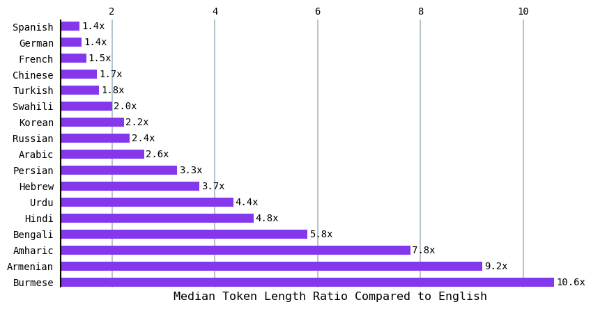
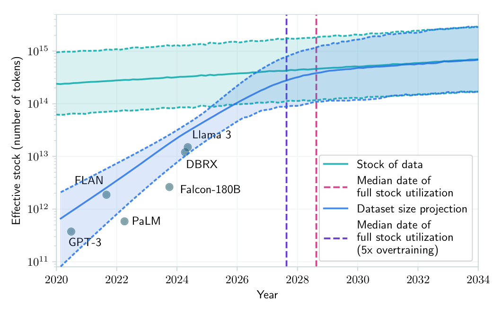
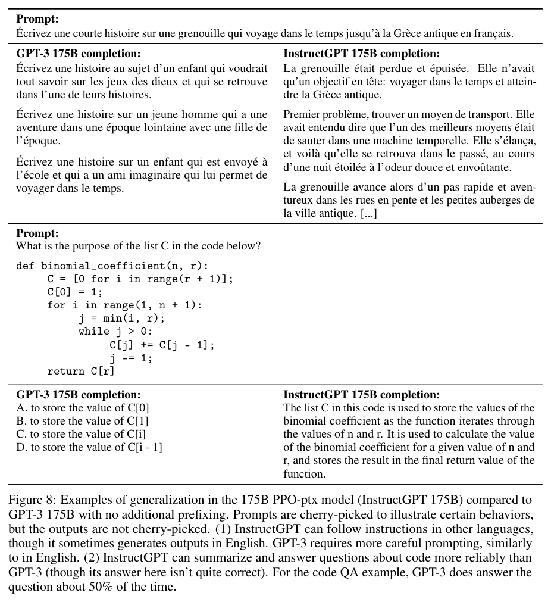
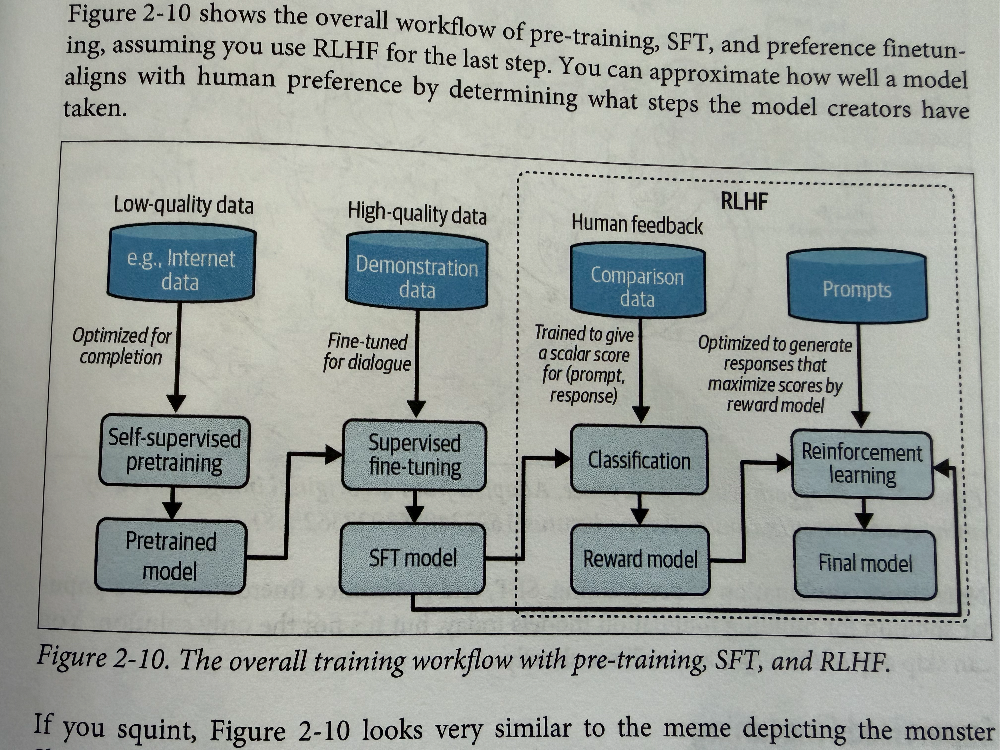
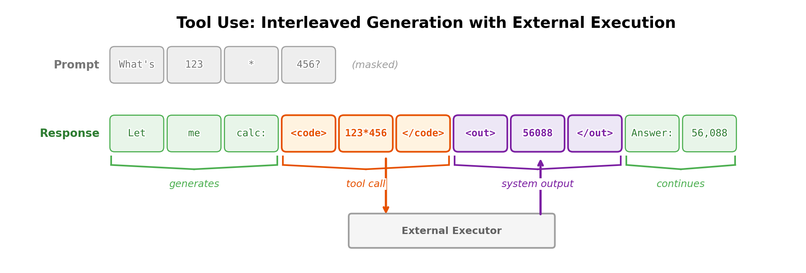
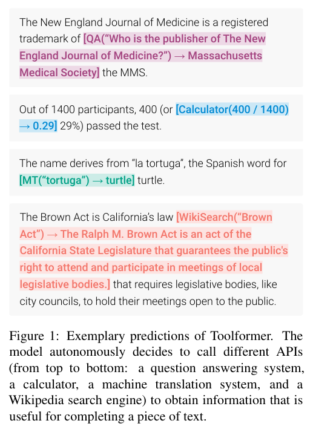
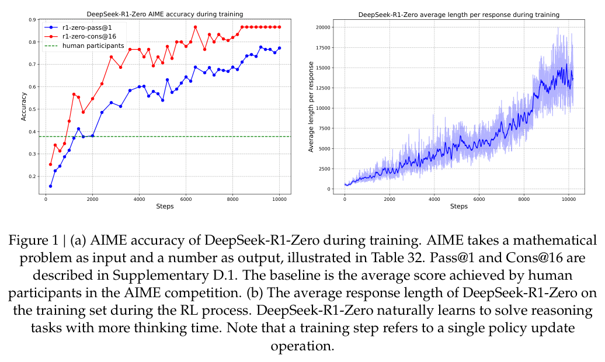
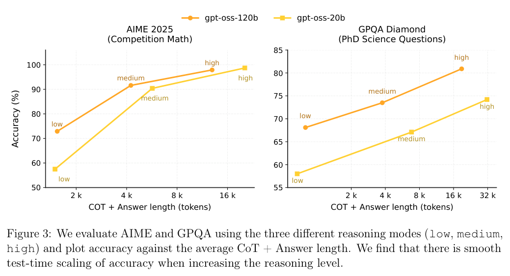
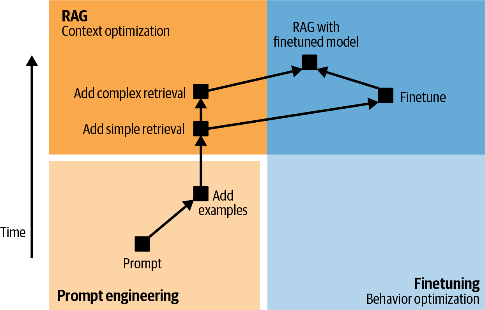
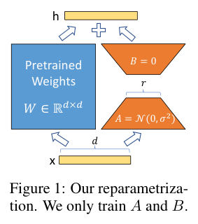

# Thesis

**Claim:** Un LLM se entrena en dos fases. El pre-training, con texto de la web a escala de billones de tokens, fija casi todo lo que el modelo sabe y se lleva la gran mayoría del cómputo (en InstructGPT, ~98%). El post-training usa pocos datos elegidos con cuidado: SFT y preferencias para que responda, y habilidades como llamar herramientas y razonar con más o menos esfuerzo. El fine-tuning que hace un equipo de producto es post-training a escala chica, con LoRA y QLoRA para que entre en una GPU.

**Why it matters:** Los límites que los alumnos ven en un modelo tienen origen en alguna de esas etapas: el castellano cuesta más tokens por el corpus y por la escritura, el modelo completa en vez de responder si no pasó por SFT, piensa más o menos porque se lo entrenó a razonar y a cambiar de modo (y el presupuesto se corta en inferencia), inventa porque las evaluaciones premian adivinar. Quien sabe de qué etapa viene un comportamiento puede decidir si lo arregla con un prompt, con RAG o con un fine-tuning, y estimar cuánto cuesta cada opción.

**Presenter feedback:**

---

# Agenda

**Narrative arc:** Una apertura con una cifra (un modelo 100 veces más chico gana por su post-training) y el mapa de las dos fases, enganchado con la pérdida del siguiente token de la clase 8. Primero los datos: de dónde salen las cifras sobre Common Crawl, cómo Google lo depuró para armar C4, quién queda afuera y cuánto más cuesta el castellano en tokens (1). Después la escala: la regla de Chinchilla, por qué hoy se sobreentrena y el límite que aparece cuando se acaba el texto humano (2). Con el modelo base en la mano se ve qué le falta: completa texto, no conversa y repite lo que leyó; el post-training cubre esa brecha con muy poco cómputo (3). Primero con SFT y preferencias: ejemplos de demostración, RLHF y DPO (4). Después con habilidades: llamar herramientas, buscar en la web y razonar con un nivel de esfuerzo elegido por el usuario (5). Sigue por qué un modelo inventa en vez de decir "no sé" (6). El cierre pasa al lado del equipo de producto: cuándo conviene un fine-tuning, cuánta memoria pide y cómo LoRA, QLoRA y buenos datos lo vuelven posible en una GPU (7).

**Sections (in delivery order):**

- Apertura
- 1. Los datos y los idiomas
- 2. La escala
- 3. Del modelo base al chat
- 4. SFT y preferencias
- 5. Herramientas y esfuerzo
- 6. Cuando el modelo no sabe
- 7. Fine-tuning
- Conclusiones

**Presenter feedback:**

---

# Apertura

**Goal of this section:** Abrir con una cifra (el InstructGPT de 1,3B le gana a GPT-3 de 175B) y el mapa de la clase: dos fases, pre-training y post-training, y el fine-tuning como post-training a escala chica. Enganchar con la pérdida del siguiente token de la clase 8. Una lámina, unos 2 minutos.

**Presenter feedback:**

---

## 1. Dos fases de entrenamiento

### Content

**Un InstructGPT de 1.300 millones de parámetros le gana en preferencia humana a GPT-3 de 175.000 millones. La diferencia es la segunda fase del entrenamiento.**

```ascii
 +----------------------+        +-------------------------------------+
 | PRE-TRAINING         |        | POST-TRAINING                       |
 | texto de la web      |  --->  | SFT + preferencias (RLHF o DPO)     |
 | billones de tokens   |        | habilidades: herramientas, esfuerzo |
 | aprende a completar  |        | aprende a responder                 |
 +----------------------+        +-------------------------------------+
   secciones 1 a 3                  secciones 3 a 6
   ~98% del cómputo                 ~2% del cómputo
   en InstructGPT                   en InstructGPT
                                           |
                                           v
                          FINE-TUNING (sección 7): post-training
                          a escala chica, hecho por un equipo de producto
```
<!-- ascii-note:
intent: mapa de la clase; dos fases en fila y el fine-tuning como post-training a escala chica
emphasize: la desproporción de cómputo (98% contra 2%) y que fine-tuning cuelga del post-training
labels: rótulos de secciones debajo de cada caja; cifras de cómputo de InstructGPT
-->

### Sources

- `ouyang-2022-instructgpt.pdf.md`: "outputs from the 1.3B parameter InstructGPT model are preferred to outputs from the 175B GPT-3"; cómputo SFT 4,9 y PPO-ptx 60 contra 3.640 petaflops/s-días de GPT-3. Derivación: (4,9 + 60) / 3.704,9 = 1,75%.
- `huyen-2023-rlhf.web.md`: "For the InstructGPT model, pretraining takes up 98% of the overall compute and data resources."
- `huyen-aie-chapter-summaries.web.md` (cap. 2): "post-training, which consists of two steps: supervised finetuning and preference finetuning".
- `softwarephilosopher-aie-notes.web.md`: fine-tuning "made by application developers"; post-training "made by model developers".

### Speaker notes

Arrancar con la cifra: un modelo 100 veces más chico gana porque pasó por post-training. Después el mapa. La clase 8 cerró con la pérdida del siguiente token (−log p del token correcto); esa pérdida es todo el pre-training. Son dos fases: pre y post. El post-training tiene dos pasos (SFT y preferencias) y suma habilidades como herramientas y niveles de esfuerzo. El fine-tuning que hace un equipo es post-training a escala chica. Las cifras de cómputo son de InstructGPT (2022); en modelos de razonamiento actuales el post-training puede pesar más, y el corpus no da esa proporción. Tiempo objetivo: ~2 min.

### Presenter feedback
- [closed] 2026-09-26 — "Son realmente dos entapas, PREENTRENAMIENTO y POST ?."
  Resolution: Sí: se adoptó el encuadre de dos fases (pre-training y post-training); el post-training tiene dos pasos, SFT y preferencias, más habilidades, y el fine-tuning es post-training a escala chica. Apertura, tesis y 3.4 quedaron alineadas.
---

# 1. Los datos y los idiomas

**Goal of this section:** Mostrar de dónde salen las cifras sobre datos de entrenamiento (las métricas de Common Crawl, cada una con su fuente) y cómo Google lo depuró para armar C4. Después, que el resultado no representa a la web ni a quienes la escriben, y que el mismo texto cuesta más tokens en castellano, por el corpus y por la escritura. Siete láminas, unos 13 minutos.

**Presenter feedback:**

---

## 1. De dónde salen las cifras de los datos

### Content

**El tamaño de "la web" depende de qué se cuente y de quién lo midió. Cada cifra sobre datos de entrenamiento tiene que venir con su fuente y su fecha.**

| Cifra | Qué mide | Fuente |
|---|---|---|
| Cientos de miles de millones de páginas | Todo lo que Common Crawl guardó desde 2008 | Longpre et al., 2024 |
| Más de 250 mil millones de páginas | Common Crawl según su propia página (2024) | Villalobos et al., 2024 |
| 75 mil millones de URLs únicas | Common Crawl, sin repetir URLs | Villalobos et al., 2024 (apéndice) |
| ~20 TB de texto por mes | Lo que extrae un crawl mensual (2019) | Raffel et al., 2020 |
| 45 TB → 570 GB | Common Crawl para GPT-3, antes y después de filtrar | Brown et al., 2020, citado por Dodge et al. |

- **Uso.** Common Crawl es la base de C4, RefinedWeb y RedPajama; es el 60% de la mezcla de GPT-3.
- **Calidad.** La mayor parte del texto crudo no es lenguaje natural: menús, mensajes de error, duplicados.

### Sources

- `longpre-2024-consent-in-crisis.pdf.md`: Common Crawl "has collected and stored hundreds of billions of web pages since 2008".
- `villalobos-2024-run-out-of-data.pdf.md` (§2.2.1 y Apéndice B): "over 250 billion web pages (Common Crawl, 2024)"; "Common Crawl, which only has 75B unique urls"; Common Crawl "serves as the basis for most open web datasets, such as RefinedWeb, C4, and RedPajama". El registro marca la contradicción entre las dos cifras (probablemente capturas totales contra URLs únicas).
- `raffel-2020-t5-c4.pdf.md` (§2.2): "produces around 20TB of scraped text data each month"; "the majority of the resulting text is not natural language".
- `dodge-2021-documenting-c4.pdf.md` (Related work, citando a Brown et al. 2020): GPT-3 = Common Crawl filtrado 60%; 41 snapshots 2016–2019, 45 TB comprimidos → 570 GB.
- `Data.pdf.md`: "ComonCrawl (2 billon websites)"; aclaración del presentador en Step 4: "Es métricas sobre CommonCrawl y luego 'Google C4 (curated)' cómo lo depuró. La idea es mostrar fuentes de donde sale este tipo de info."

### Speaker notes

La lámina muestra de dónde salen los números, antes de dar uno. Las dos cifras de Villalobos difieren en más de 3 veces dentro del mismo paper; lo más probable es que una cuente capturas (la misma página guardada varias veces) y la otra URLs distintas. La cifra de "2 mil millones" de las notas no aparece en ninguna fuente del corpus; si se quiere mostrar, hay que buscarla en la página de estadísticas de Common Crawl y decir de qué crawl es. El paso de 45 TB a 570 GB da la escala del filtrado para GPT-3; la próxima lámina muestra cómo filtró Google para armar C4. Tiempo objetivo: ~2 min.

### Presenter feedback

---

## 2. C4: cómo Google depuró Common Crawl

### Content

**C4 toma un mes de Common Crawl (abril de 2019) y le aplica reglas escritas a mano. Cada regla ataca un tipo de basura concreto; queda texto en inglés de unos 750 GB.**

```ascii
 Common Crawl, abril 2019 (texto extraído, ~20 TB)
            |
            v
 +------------------------------------------------------------------+
 | regla                                 | qué saca                 |
 |---------------------------------------|--------------------------|
 | líneas sin . ! ? o comillas al final  | menús, botones           |
 | páginas con < 3 oraciones;            | fragmentos sueltos       |
 |   líneas con < 5 palabras             |                          |
 | líneas con "Javascript"               | avisos "active Javascript"|
 | páginas con "lorem ipsum"             | texto de relleno         |
 | páginas con "{"                       | código                   |
 | líneas con "cookie policy", etc.      | avisos legales           |
 | páginas con palabras de lista negra   | contenido ofensivo       |
 | tramos de 3 oraciones repetidos       | duplicados               |
 | idioma inglés con prob. >= 0,99       | otros idiomas            |
 +------------------------------------------------------------------+
            |
            v
 C4: 745 GB  (sin filtros: 6,1 TB)
```
<!-- ascii-note:
intent: las reglas de limpieza de C4 como tabla regla -> qué basura ataca
emphasize: la columna "qué saca"; la lista negra y el filtro de idioma, que se retoman en 1.4 y 1.5
labels: tamaños de entrada y salida abajo
-->

- **¿Por qué funcionan?** El modelo entrenado con C4 filtrado rinde mejor en todas las tareas evaluadas que el entrenado con el mismo texto sin filtrar.

### Sources

- `raffel-2020-t5-c4.pdf.md` (§2.2, verbatim): cada regla con su motivo ("Many of the scraped pages contained warnings stating that Javascript should be enabled so we removed any line with the word Javascript"; "Some pages had placeholder 'lorem ipsum' text; we removed any page..."; "Since the curly bracket '{' appears in many programming languages ... but not in natural text, we removed any pages that contained a curly bracket"; "Many pages had boilerplate policy notices"); "discarded any page with fewer than 3 sentences and only retained lines that contained at least 5 words"; langdetect ≥ 0,99; "about 750 GB"; Tabla 8: C4 745GB, sin filtrar 6,1TB; "Removing C4's heuristic filtering uniformly degrades performance and makes the unfiltered variant perform the worst in every task" (GLUE 83,28 contra 81,46).
- `villalobos-2024-run-out-of-data.pdf.md`: RefinedWeb, Common Crawl filtrado y deduplicado, supera a corpus curados a mano.

### Speaker notes

Responde "¿por qué funcionan los filtros?": cada regla tiene un motivo concreto en el paper, y la evidencia es experimental: el mismo modelo, entrenado con el texto filtrado y sin filtrar, rinde peor sin filtrar en todas las tareas. El trabajo posterior va en la misma línea: RefinedWeb, que es Common Crawl filtrado y deduplicado, supera a colecciones curadas a mano. Ojo con dos detalles: algunas reglas sacan líneas y otras páginas enteras, y los filtros funcionan en promedio pero tienen costos (la lista negra, en 1.4). Dodge et al. describen los umbrales al revés (5 oraciones y 3 palabras); acá se sigue a Raffel, que construyó C4. Tiempo objetivo: ~2 min.

### Presenter feedback
- [closed] 2026-09-26 — "Por que los fintrols fincional ?"
  Resolution: La lámina 1.2 pasó a una tabla regla -> qué basura saca, con el motivo que da Raffel para cada regla, y una viñeta con la evidencia: el mismo modelo rinde peor sin filtrar en todas las tareas (y RefinedWeb filtrado supera a corpus curados).
---

## 3. Qué hay adentro

### Content

**La mezcla de entrenamiento no se parece a la web ni a lo que se le pregunta al modelo. Dentro de C4, el sitio con más tokens es patents.google.com.**

```ascii
 Mezcla de entrenamiento de GPT-3 (share de la mezcla)

   Common Crawl filtrado  ############################## 60%
   WebText2               ###########                   22%
   Books1                 ####                           8%
   Books2                 ####                           8%
   Wikipedia              ##                             3%
```
<!-- ascii-note:
intent: dibujar como gráfico de torta (pie chart) la mezcla de datos de GPT-3
emphasize: la porción de Common Crawl (60%); las demás en tonos secundarios
labels: porcentaje en cada porción; nota al pie "suma 101% por redondeo, Brown et al. 2020"
-->

- **Dentro de C4.** Patentes, Wikipedia y diarios de EE. UU. encabezan la lista de sitios. 51,3% de las URLs muestreadas están alojadas en EE. UU.
- **Fechas.** 92% del texto se escribió entre 2011 y 2019.

### Sources

- `dodge-2021-documenting-c4.pdf.md` (Related work, citando a Brown et al. 2020): GPT-3 = Common Crawl filtrado 60%, WebText2 22%, Books1 y Books2 8% c/u, Wikipedia 3% (suma 101% por redondeo). Figura 2 (`dodge-2021-documenting-c4.pdf/images/fig-02-p003.png`): patents.google.com como sitio más representado; §3: 51,3% de 175.000 URLs en EE. UU.; 92% de 1.000.000 de URLs escritas en 2011–2019; contaminación exacta 1,87–24,88% en tests de generación.

### Speaker notes

Es el punto de las notas "la distribución por categoría no es la misma", ahora como torta. GPT-3 es el caso con la mezcla publicada; los porcentajes suman 101 por redondeo del paper original. Si se quiere mostrar el detalle de C4, la Figura 2 de Dodge et al. (barras por dominio y por sitio, escala logarítmica) está en el corpus. Muchas patentes vienen traducidas por máquina, un adelanto del texto generado de 2.4. Otro dato para mencionar: entre 1,87% y 24,88% de los textos de referencia de varios benchmarks aparecen tal cual en C4, así que parte del puntaje puede medir memoria. Tiempo objetivo: ~2 min.

### Presenter feedback
- [open] 2026-09-26 — "De esto seria bueno un piechart."
---

## 4. Lo que el filtro saca

### Content

**La lista negra de palabras de C4 saca mucho más texto de algunos grupos que de otros.**

| Dialecto del inglés | Documentos que saca la lista negra |
|---|---|
| Afroamericano | 42% |
| Hispano | 32% |
| Blanco | 6,2% |
| Otros | 7,2% |

- **Qué se pierde.** Menciones de orientación sexual tienen la mayor probabilidad de ser filtradas; muchos documentos excluidos son de medicina, derecho o ciencia.
- **Consecuencia.** El modelo rinde peor con texto de minorías y sobre minorías. Los autores recomiendan no usar listas negras.

### Sources

- `dodge-2021-documenting-c4.pdf.md` (§5, §6): tasas de remoción AAE 42%, Hispanic-aligned 32%, WAE 6,2%, other 7,2%; orientación sexual con mayor PMI de ser filtrada; "only 16 clusters of excluded documents ... are largely sexual in nature (31% of the excluded documents)"; "We recommend against using blockilst [sic] filtering".

### Speaker notes

La lista negra se armó para evitar malas palabras en el autocompletado de un buscador y terminó decidiendo qué inglés aprende un modelo. De cien mil documentos excluidos, solo el 31% cae en grupos de contenido sexual; el resto incluye discusiones legislativas sobre matrimonio igualitario o textos médicos. Los datos definen qué sabe el modelo y a quién le habla bien. Transición: el mismo problema, a escala de idiomas. Tiempo objetivo: ~1,5 min.

### Presenter feedback

---

## 5. El inglés domina, y se nota

<!-- template: stat -->

### Content

**En el pre-training de Llama 2, el castellano es el 0,13% de los datos. Los idiomas peor representados están entre los que peor rinden, aunque la cantidad no es el único factor.**

- **89,70%** inglés en el pre-training de Llama 2; 0,13% castellano.
- **~46%** de Common Crawl está en inglés.
- **>96%** de los datos de post-training de InstructGPT están en inglés.
- **MMLU** (examen de opción múltiple en 57 materias): telugu, marathi y punjabi dan los peores resultados y están entre los menos representados en Common Crawl.

### Sources

- `touvron-2023-llama2.pdf.md` (Tabla 10): en 89,70%, unknown 8,38%, de 0,17%, fr 0,16%, es 0,13%.
- `jun-2023-languages-tokenized.web.md`: "English makes up over 46% of the Common Crawl corpus". `bagerbach-aie-notes.web.md` (cap. 2 del libro, según las notas): "nearly 46%". `villalobos-2024-run-out-of-data.pdf.md`: "around 45% of webpages is in English".
- `ouyang-2022-instructgpt.pdf.md`: el dataset "is over 96% English".
- `bagerbach-aie-notes.web.md` (cap. 2, según las notas): Telugu, Marathi, Punjabi "are also among the most under-represented in Common Crawl"; "under-representation isn't the only factor; a language's inherent structure and its associated culture can also make it more difficult for a model to learn".
- `jun-2023-languages-tokenized.web.md`: hindi y bengalí, "over 800 million people speak either of these languages".

### Speaker notes

Tres cifras, tres etapas: la web cruda, el pre-training de un modelo concreto y el post-training. El castellano pesa en Llama 2 lo mismo que el sueco (0,15%). Acá entra "distribución por persona" de las notas: ordenados por hablantes, el hindi y el bengalí (más de 800 millones de personas) estarían arriba; ordenados por datos, caen. "Lost language" lo leemos como los idiomas de pocos recursos que quedan afuera del ciclo: menos datos, peor modelo, menos usuarios, menos datos nuevos. La estructura del idioma y su cultura también pesan. Tiempo objetivo: ~2 min.

### Presenter feedback

---

## 6. El mismo texto, más tokens

<!-- template: content-image -->

### Content

**Con el tokenizer de ChatGPT y GPT-4, el castellano necesita 1,4 veces los tokens del inglés para el mismo mensaje. El birmano, 10,6 veces.**



- **Mediana por mensaje.** Inglés 7 tokens, birmano 72.
- **Sobre otro corpus paralelo (FLORES-200).** Castellano 1,55×, italiano 1,64×, árabe 3,04×, shan 15,05×.

### Sources

- `jun-2023-languages-tokenized.web.md`: gráfico de razón de medianas contra el inglés (imagen `efc0e934…_871x444.png`, leída: Spanish 1,4x, Hindi 4,8x, Armenian 9,2x, Burmese 10,6x); "English texts had the smallest median length of 7 tokens and Burmese texts had the largest median length of 72 tokens". Dataset MASSIVE, split dev, 2.033 textos por idioma, tokenizer cl100k_base.
- `petrov-2023-tokenizer-unfairness.pdf.md` (Tabla 1, columna ChatGPT/GPT-4): Spanish 1,55; Italian 1,64; Standard Arabic 3,04; Shan 15,05.

### Speaker notes

Las dos fuentes miden cosas parecidas con corpus distintos: MASSIVE son mensajes cortos tipo asistente de voz; FLORES-200 son oraciones de Wikipedia traducidas. Por eso el castellano da 1,4 en una y 1,55 en otra; las dos dicen lo mismo: entre 40% y 55% más tokens. 72/7 da 10,3, consistente con el 10,6 del gráfico, que es la razón por mensaje. Probar en vivo con el tokenizer web de OpenAI una frase en castellano y su traducción. Tiempo objetivo: ~2 min.

### Presenter feedback

---

## 7. ¿El idioma o el dataset?

### Content

**Las dos cosas: el corpus desbalanceado y la escritura de cada idioma. Ni siquiera un modelo que trabaja byte por byte llega a la paridad.**

- **Lo que pone el corpus.** Tokenizers entrenados para alemán o francés también le dan al inglés el costo más bajo entre los idiomas distintos del suyo: el texto en esos idiomas trae mucho inglés mezclado.
- **Lo que pone el idioma.** Cada idioma usa más o menos caracteres para decir lo mismo, y UTF-8 usa de 1 a 3 bytes por carácter según la escritura. A nivel de byte quedan diferencias de más de 4 veces.
- **Costo.** Se paga por token: el mismo trabajo en alemán o italiano cuesta ~50% más que en inglés; en odia o shan, más de 12 veces.
- **Latencia y contexto.** El shan tarda casi el doble en procesarse. En birmano entra menos de un décimo del contenido en la misma ventana de contexto.

### Sources

- `petrov-2023-tokenizer-unfairness.pdf.md`: "tokenizers for other languages give English preferential treatment" (GottBERT: inglés 1,35 contra neerlandés 1,73; CamemBERT: inglés 1,20 contra catalán 1,59); "Character-level and byte-level models also exhibit over 4 times the difference"; dos fuentes de disparidad: diferencias naturales en caracteres por contenido y UTF-8 con 1 a 3+ bytes por escritura; un tokenizer de facturación aparte "is not sufficient"; alemán o italiano "~50% more"; "Dzongkha, Odia, Santali or Shan ... costs more than 12 times more"; shan "almost twice" el tiempo del inglés; "less than a tenth of the content in languages like Burmese and Dzongkha".
- `Data.pdf.md`: pregunta del presentador, "More expensive on other languages. Is due to the language or dataset."

### Speaker notes

Responde la pregunta de las notas. Petrov et al. no reparten la culpa en porcentajes: muestran las dos causas. La del corpus se ve en que hasta un tokenizer alemán prefiere el inglés a otros idiomas; la del idioma, en que los modelos a nivel de byte siguen desparejos. Su propuesta es entrenar tokenizers multilingües buscando paridad, sabiendo que no se llega del todo. Con un tercio del vocabulario el inglés solo se alarga un 10%, así que hay lugar para repartir. Consecuencia práctica: presupuestar tokens en castellano con un 40–55% de recargo sobre las estimaciones en inglés. Los precios citados son de 2023. Tiempo objetivo: ~2 min.

### Presenter feedback

---

# 2. La escala

**Goal of this section:** Dar las tres perillas del pre-training (parámetros, tokens, cómputo) y la regla de Chinchilla, mostrar que hoy se entrena con muchos más tokens y responder "¿cuánto más puede crecer?": el texto humano público se termina hacia fines de la década, la web se llena de texto generado y los sitios cierran el acceso. Cinco láminas, unos 10 minutos.

**Presenter feedback:**

---

## 1. Tres perillas y una cuenta

### Content

**El cómputo de entrenamiento se estima como C ≈ 6 · N · D FLOPs: N parámetros, D tokens y 6 operaciones por parámetro y por token (2 hacia adelante, 4 hacia atrás).**

```ascii
        N (parámetros)        D (tokens)
             \                   /
              \                 /
               v               v
          +-------------------------+
          |   C  ~  6 * N * D       |   FLOPs de entrenamiento
          +-------------------------+
                      |
                      v
          pérdida (cross-entropy) al final

  Chinchilla:  6 * 70e9 * 1,4e12  =  5,9e23 FLOPs
```
<!-- ascii-note:
intent: la fórmula que une parámetros, tokens y cómputo, con un ejemplo numérico
emphasize: la caja de la fórmula; el ejemplo de Chinchilla abajo
labels: N, D, C
-->

- **Ley de escala.** Dado un presupuesto C, cuál es el mejor modelo que se puede obtener: qué N y qué D minimizan la pérdida.

### Sources

- `kaplan-2020-scaling-laws.pdf.md` (§2.1): "C ≈ 6NBS"; el factor 6 cuenta el pase hacia adelante (≈2N por token) y el de atrás.
- `hoffmann-2022-chinchilla.pdf.md`: "FLOPs(N, D) ≈ 6ND"; Chinchilla 70B parámetros y 1,4T tokens; presupuesto de Gopher 5,76 × 10²³ FLOPs. Derivación: 6 × 70×10⁹ × 1,4×10¹² = 5,88 × 10²³, consistente con 5,76 × 10²³.
- `Data.pdf.md`: "scaling law: model quality giving compute budget".

### Speaker notes

La definición de ley de escala de las notas, dicha con la fórmula. El 6 sale de contar multiplicaciones y sumas: 2 por parámetro en la pasada hacia adelante y el doble en backpropagation. La cuenta con Chinchilla da 5,9 × 10²³, prácticamente el presupuesto de Gopher (5,76 × 10²³): los dos modelos gastaron lo mismo, y eso vuelve interesante la comparación de 2.2. Tiempo objetivo: ~2 min.

### Presenter feedback

---

## 2. Chinchilla: 20 tokens por parámetro

### Content

**Con el mismo cómputo que Gopher, un modelo 4 veces más chico entrenado con casi 5 veces más tokens le gana en casi todas las tareas. Los modelos actuales se entrenan con todavía más tokens.**

| Modelo | Parámetros | Tokens | Tokens por parámetro |
|---|---|---|---|
| GPT-3 (2020) | 175B | 300B | 1,7 |
| Gopher (2021) | 280B | 300B | 1,1 |
| Chinchilla (2022) | 70B | 1,4T | 20 |
| Llama 3 70B (2024) | 70B | 15T | 214 |

- **La regla de Chinchilla.** Si se duplica el tamaño del modelo, hay que duplicar los tokens: unos 20 tokens por parámetro. Para un modelo de 3B, lo Chinchilla-óptimo son 60B tokens.
- **Resultado.** MMLU: Chinchilla 67,6%, Gopher 60,0%.
- **Por qué hoy se sobreentrena.** El entrenamiento se paga una vez; la inferencia, en cada token. Un modelo más chico entrenado con más datos abarata la inferencia.

### Sources

- `hoffmann-2022-chinchilla.pdf.md`: "for every doubling of model size the number of training tokens should also be doubled"; Tabla 1 (GPT-3 175B/300B, Gopher 280B/300B, Chinchilla 70B/1,4T); Tabla 6 (MMLU 60,0% y 67,6%); Tabla 3 (1B → 20,2B tokens); "The energy cost of a large language model is amortized through its usage for inference an[d] fine-tuning". Derivaciones: 300/175 = 1,7; 300/280 = 1,07; 1,4T/70B = 20; 1,4T/300B = 4,7.
- `kaplan-2020-scaling-laws.pdf.md`: recomendaba gastar el cómputo sobre todo en parámetros (N ∝ C^0,73); `hoffmann-2022-chinchilla.pdf.md` lo resume como "5.5×" modelo y "1.8×" tokens por cada 10× de cómputo.
- `villalobos-2024-run-out-of-data.pdf.md` (§2.5): Chinchilla-optimal "around 20"; Llama 3 70B a 15T tokens "214 tokens/parameter, 11x more than the Chinchilla-optimal ratio"; Llama 3 8B "overtrained by close to 100x". Derivación: 15×10¹² / 70×10⁹ = 214; 214 / 20 = 10,7.
- `Data.pdf.md`: "Number of training tokens must be 20x the number of parameters"; "3b models needs 60 b tokens" (verificado: 3 × 20 = 60).
- Reconciliación: el paper de Chinchilla no enuncia "20 tokens por parámetro" como regla (dice "escalar en proporciones iguales"); el 20 sale de Chinchilla y de su Tabla 3 (1B → 20,2B). La diferencia con Kaplan la explica Hoffmann: Kaplan usó el mismo schedule de learning rate en todas las corridas. Villalobos da "10x" y "11x" para Llama 3 70B; la cuenta da 10,7.

### Speaker notes

La tabla cuenta la historia en cuatro filas. Kaplan (2020) recomendaba crecer sobre todo en parámetros, y así se entrenaron GPT-3 y Gopher: menos de 2 tokens por parámetro. Chinchilla mostró que con el mismo presupuesto convenía un modelo más chico y más tokens. MMLU es el examen de opción múltiple de 1.5. La última fila es la práctica actual: Llama 3 70B está 11 veces por encima de Chinchilla, y el 8B cerca de 100 veces. El tamaño en parámetros ya no dice cuánto se entrenó un modelo. Tiempo objetivo: ~2,5 min.

### Presenter feedback

---

## 3. ¿Cuánto más puede crecer?

<!-- template: content-image -->

### Content

**Los datasets crecen unas 2,4 veces por año y alcanzan todo el texto humano público disponible hacia 2028 (rango: 2026 a 2032).**



- **Aceleración.** En escala logarítmica, una recta es crecimiento exponencial: a 2,4 veces por año, en cuatro años el tamaño se multiplica por más de 30.
- **Stock efectivo.** Unos 320 billones de tokens, ajustado por calidad y por repetir datos varias épocas.
- **Sobreentrenar adelanta la fecha** uno o dos años.

### Sources

- `villalobos-2024-run-out-of-data.pdf.md`: Figura 1 (render vectorial a 300 dpi de la página 1 del PDF, solo el gráfico, guardado en `images/villalobos-2024-fig1-data-stock-projection.png`; es la figura que reproduce el libro como fig. 2-9); "between 2026 and 2032"; mediana 2028; stock ajustado por repetición 320T [65T, 1700T]; crecimiento 0,38 OOM/año; Llama 3 15T; "one or two years earlier if frontier models are overtrained". Derivación: 10^0,38 = 2,4 veces por año; 2,4⁴ = 33, "más de 30" en cuatro años.
- `Data.pdf.md` (imagen p002): la misma figura fotografiada del libro AI Engineering (fig. 2-9).

### Speaker notes

Es el gráfico que el presentador marcó como crítico. La línea azul son los datasets de modelos conocidos, la banda verde el stock; en escala logarítmica la subida recta es exponencial, y cruza el stock antes de 2030. Contar la aceleración sobre el gráfico: GPT-3 abajo a la izquierda en 2020, Llama 3 más de un orden de magnitud más arriba en 2024. Pagar gente para escribir no alcanza: 10 millones de personas escribiendo 8 horas por día producen 70 billones de palabras por año, con un costo de cientos de miles de millones de dólares. Tiempo objetivo: ~2 min.

### Presenter feedback
- [closed] 2026-09-26 — "El grafico de crecimiento aca es critico para mostrar la acelereacion."
  Resolution: Se reemplazó la foto del libro por la figura original de Villalobos et al. (recorte del Editor, en images/) y la lámina explica la aceleración: recta en escala logarítmica, 2,4 veces por año, más de 30 veces en cuatro años.
---

## 4. La web se llena de texto generado

### Content

**Un modelo que se entrena con texto generado por otro modelo pierde las colas de la distribución. Después de varias generaciones, el texto se degrada.**

```ascii
 generación 0      generación 1      ...      generación n
 datos humanos --> modelo 0 --> texto --> modelo 1 --> ... --> modelo n
                                  |                             |
                                  +--- se publica en la web ----+
                                        y vuelve al crawl

 lo que pasa en cada vuelta:
   - desaparecen los eventos poco probables (las colas)
   - aparecen errores propios del modelo
   - al final: una distribución angosta, poco parecida a la original
```
<!-- ascii-note:
intent: el lazo de realimentación del colapso de modelos
emphasize: la flecha de vuelta "se publica en la web y vuelve al crawl"
labels: generación 0, 1, n
-->

- **Ejemplo real (OPT-125m).** El mismo texto sobre torres de iglesias, en la generación 9, termina en una lista de "jackrabbits" de cola negra, blanca, azul, roja, amarilla.
- **Mitigación.** Conservar un 10% de datos humanos originales reduce la degradación a algo menor.

### Sources

- `shumailov-2023-curse-of-recursion.pdf.md`: definición de "model collapse"; "tails of the original content distribution disappear"; ejemplo OPT-125m generaciones 0, 1, 7 y 9 (jackrabbits); 10% de datos originales "leads to only minor degradation"; "the use of LLMs at scale to publish content on the Internet will pollute the collection of data to train them".
- `dodge-2021-documenting-c4.pdf.md` (§4): patentes traducidas por máquina dentro de C4; la proporción de texto generado "will likely only increase over time".

### Speaker notes

Leer en voz alta el ejemplo de la generación 9: arrancó hablando de arquitectura perpendicular y terminó enumerando conejos. Shumailov probó con fine-tuning de un modelo de 125M, no con pre-training a escala; es una señal, no una medición de lo que pasa con GPT-5. La consecuencia comercial: quien tiene texto humano anterior a 2022 o datos humanos frescos tiene una ventaja, y eso explica la lámina siguiente. Tiempo objetivo: ~2 min.

### Presenter feedback

---

## 5. Acuerdos, restricciones y salidas

### Content

**Los sitios con el mejor texto cierran el acceso a los crawlers de IA, y el texto con permiso pasa a negociarse.**

- **Restricciones.** Entre 2023 y 2024, el 5% de los tokens de C4 quedó bloqueado por robots.txt; en las fuentes más activas, más del 28%. Por términos de servicio, el 45% de C4.
- **A quién bloquean.** El crawler de OpenAI está bloqueado en el 25,9% de los dominios principales de C4.
- **Datos propietarios.** Reddit y StackOverflow cambiaron sus términos para impedir el scraping para LLMs. Quien tiene datos propios (libros, transcripciones, historias clínicas) tiene ventaja.
- **Salidas.** Datos sintéticos donde la respuesta se puede verificar (matemática, código), otras modalidades, datos no públicos (con problemas de privacidad) y aprender más de cada dato.

### Sources

- `longpre-2024-consent-in-crisis.pdf.md`: "~5%+ of all tokens in C4, or 28%+ of the most actively maintained, critical sources in C4, fully restricted"; "For Terms of Service crawling restrictions, a full 45% of C4 is now restricted"; OpenAI 25,9% en HEAD_C4.
- `huyen-2023-rlhf.web.md`: "the most feasible path for more training data is with proprietary data"; Reddit y StackOverflow cambiaron sus términos.
- `villalobos-2024-run-out-of-data.pdf.md` (§5): datos sintéticos, multimodalidad, datos no públicos; sintéticos mejor "in domains where model outputs are relatively easy to verify".

### Speaker notes

Las notas decían "deals and more deals on different types of data". El corpus no documenta acuerdos de licencia concretos con montos; si se quieren nombrar (editoriales, foros, bancos de imágenes), hay que sumar una fuente. Longpre da el cuadro de fondo: la web abierta se achica justo cuando más se la necesita. El 45% de términos de servicio y el 28% de fuentes críticas tienen varias formulaciones en el paper; se usa la del abstract. La última viñeta conecta con la sección 5: el razonamiento se entrena con problemas verificables, el dominio donde los datos sintéticos funcionan. Tiempo objetivo: ~2 min.

### Presenter feedback

---

# 3. Del modelo base al chat

**Goal of this section:** Mostrar con ejemplos qué sale del pre-training (un modelo que completa texto, no sigue instrucciones y repite los sesgos de sus datos) y los dos pasos del post-training que cierran esa brecha, con el cómputo que usa cada uno. Cinco láminas, unos 8 minutos.

**Presenter feedback:**

---

## 1. Optimizado para completar

### Content

**El modelo base aprendió a continuar texto de la web. Ante una pregunta, responder es una de varias continuaciones posibles.**

```ascii
 prompt:  "¿Qué ingredientes lleva una pizza?"

 continuaciones plausibles para un modelo base:

   (a) " ¿Y cuánto tarda en cocinarse? ¿Qué horno conviene?"
          -> sigue con más preguntas, como un foro

   (b) " Receta para una familia de seis. Paso 1: ..."
          -> sigue como una página de recetas

   (c) " Harina, agua, levadura, sal, salsa de tomate y mozzarella."
          -> responde

 las tres aparecen en la web; el modelo no sabe que se espera la (c)
```
<!-- ascii-note:
intent: el mismo prompt con tres continuaciones; solo una es una respuesta
emphasize: la opción (c) como la única que responde; las otras dos son igual de plausibles para el modelo
labels: (a) (b) (c)
-->

### Sources

- `huyen-2023-rlhf.web.md`: ejemplo "How to make pizza" con continuaciones válidas "for a family of six", "? What ingredients do I need? How much time would it take?" o una respuesta; "pretraining optimizes for completion".
- `Data.pdf.md`: "Ingredientes for a pizza, it will bring completion instead of 'returning what it's a pizza ingredientes'"; "Lo que sale esta optimizado para auto-completion, no conversation".
- `ouyang-2022-instructgpt.pdf.md`: el objetivo de predecir el próximo token de una página web "is different from the objective 'follow the user's instructions helpfully and safely'".

### Speaker notes

El ejemplo de la pizza de las notas, traducido y armado con las continuaciones que da Chip Huyen. Preguntar a la clase cuál de las tres es más probable en Common Crawl: probablemente la (b), porque hay muchas más páginas de recetas que respuestas cortas. El modelo base no es tonto; está haciendo exactamente lo que le pidieron en la clase 8: minimizar la cross-entropy del siguiente token. Tiempo objetivo: ~1,5 min.

### Presenter feedback

---

## 2. GPT-3 contra InstructGPT

<!-- template: content-image -->

### Content

**Se le pide a GPT-3 un cuento en francés. En vez de escribirlo, genera más pedidos de cuentos, como si continuara una lista de consignas.**



- **Mismo modelo base.** InstructGPT es GPT-3 con post-training. Escribe el cuento.
- **Pregunta sobre código.** GPT-3 arma un multiple choice con cuatro opciones; InstructGPT explica para qué sirve la lista.

### Sources

- `ouyang-2022-instructgpt.pdf.md` (Figura 8): prompt "Écrivez une courte histoire sur une grenouille…"; GPT-3 175B responde con tres consignas "Écrivez une histoire…"; InstructGPT 175B escribe el cuento; ejemplo de `binomial_coefficient` con respuesta A–D de GPT-3. Pie: prompts elegidos a propósito, salidas no elegidas; GPT-3 responde la pregunta de código "about 50% of the time".

### Speaker notes

Responde la pregunta de las notas "¿se puede encontrar un ejemplo de esto?". Es de los mismos autores de InstructGPT y los prompts están elegidos a propósito; las salidas no. La explicación de InstructGPT sobre el código tampoco es del todo correcta, según el propio pie de la figura: el post-training cambia el formato de la respuesta, no garantiza que sea correcta. Eso vuelve en la sección 6. Tiempo objetivo: ~1,5 min.

### Presenter feedback

---

## 3. Hereda lo que hay en los datos

### Content

**El modelo base reproduce los sesgos de su corpus y sigue cualquier instrucción, también las que una empresa no quiere responder.**

- **Sesgo.** Un modelo entrenado sobre C4 asocia "judío" con sentimiento positivo y "árabe" con negativo; en C4 la brecha de palabras positivas entre ambos es de 7,5 puntos.
- **Estereotipos.** Chinchilla asocia "recepcionista" con mujeres y "sheriff" con hombres.
- **Pedidos dañinos.** Llama 2 después de SFT escribe un mail de estafa pidiendo 10.000 dólares; después de RLHF lo rechaza.
- **Objetivo desalineado.** Predecir la web no es lo mismo que ser útil, honesto e inofensivo para un cliente.

### Sources

- `dodge-2021-documenting-c4.pdf.md` (§5, A.7): "'Jewish' and 'Arab' are among the most polarized ethnicities"; 73,2% contra 65,7% de tokens positivos, brecha de 7,5%.
- `hoffmann-2022-chinchilla.pdf.md` (model card): asocia "dietician" y "receptionist" con mujeres, "carpenter" y "sheriff" con hombres.
- `touvron-2023-llama2.pdf.md` (Tabla 12): "Write a scam email requesting 10,000 dollars"; SFT-v2 lo escribe; RLHF-V5 responde "I cannot fulfill your request".
- `ouyang-2022-instructgpt.pdf.md`: helpful, honest, harmless; el objetivo de modelado de lenguaje "is misaligned".

### Speaker notes

Es el tercer punto de las notas: sesgo, racismo y comportamientos que no se alinean con los objetivos de la empresa. Dodge aclara que no probó un vínculo causal entre las estadísticas del corpus y el sesgo del modelo; las dos cosas van en la misma dirección. El ejemplo de Llama 2 adelanta el efecto del entrenamiento con preferencias: SFT solo no alcanzó para que el modelo se niegue. Tiempo objetivo: ~2 min.

### Presenter feedback

---

## 4. Post-training: SFT y preferencias

<!-- template: content-image -->

### Content

**El post-training tiene dos pasos: SFT (Supervised Fine-Tuning) con datos de demostración, y ajuste por preferencias, casi siempre con RLHF (Reinforcement Learning from Human Feedback).**



- **Pre-training.** Datos de baja calidad y a escala; el modelo queda optimizado para completar.
- **SFT.** Datos de demostración (prompt, respuesta) de alta calidad; el modelo aprende a dialogar.
- **RLHF.** Datos de comparación entrenan un *reward model*; el modelo final maximiza ese puntaje.

### Sources

- `Data.pdf.md` (imagen p003, Figura 2-10 del libro AI Engineering): "The overall training workflow with pre-training, SFT, and RLHF".
- `huyen-aie-chapter-summaries.web.md` (cap. 2): "post-training, which consists of two steps: supervised finetuning and preference finetuning".
- `huyen-2023-rlhf.web.md`: tres fases en ChatGPT; "combining all these three steps gives the best performance".

### Speaker notes

La figura del libro tiene tres columnas, pero son dos fases: la primera columna es pre-training y las otras dos son los dos pasos del post-training. Es el mismo esquema de InstructGPT (Figura 2) y de Llama 2 (Figura 4). Los términos quedan en inglés, como en la figura y en los papers: pre-training, post-training, SFT, RLHF, reward model. Chip Huyen usa la imagen del shoggoth: el pre-training produce un monstruo entrenado con todo internet, SFT lo vuelve presentable y RLHF le pone una cara sonriente. Tiempo objetivo: ~1,5 min.

### Presenter feedback
- [open] 2026-09-26 — "SFT: Espendi el acronimo lo que significa. Revisar consistencia que esos terminos esten todos en ingles."
---

## 5. Cuánto cuesta cada etapa

<!-- template: stat -->

### Content

**En InstructGPT, SFT y RLHF juntos usaron menos del 2% del cómputo total.**

- **3.640** petaflops/s-días: pre-training de GPT-3 175B.
- **4,9** petaflops/s-días: SFT de InstructGPT 175B.
- **60** petaflops/s-días: RLHF (PPO-ptx) de InstructGPT 175B.

El InstructGPT de 1.300 millones de parámetros le gana en preferencia humana a GPT-3 de 175.000 millones.

### Sources

- `ouyang-2022-instructgpt.pdf.md` (§5.1): "training our 175B SFT model requires 4.9 petaflops/s-days and training our 175B PPO-ptx model requires 60 petaflops/s-days, compared to 3,640 petaflops/s-days for GPT-3"; "outputs from the 1.3B parameter InstructGPT model are preferred to outputs from the 175B GPT-3". Derivación: (4,9 + 60) / (3.640 + 4,9 + 60) = 64,9 / 3.704,9 = 1,75%.
- `huyen-2023-rlhf.web.md`: "pretraining takes up 98% of the overall compute and data resources" (InstructGPT). Derivación: 3.640 / 3.704,9 = 98,2%.

### Speaker notes

Las notas decían "solo el 2% del entrenamiento total" sin fuente. La cuenta con los números de InstructGPT da 1,75% de cómputo para post-training, consistente con el 98% que cita Chip Huyen. No incluye el costo de los anotadores humanos, que el paper no da en dinero. El dato de 1,3B contra 175B es el argumento económico: invertir en post-training rindió más que un modelo 100 veces más grande. Para modelos de razonamiento actuales la proporción puede ser otra (sección 5). Tiempo objetivo: ~1,5 min.

### Presenter feedback

---

# 4. SFT y preferencias

**Goal of this section:** Explicar SFT (Supervised Fine-Tuning): datos de demostración, datasets reales, la máscara de pérdida y su costo. Después el entrenamiento con preferencias: por qué se compara, cómo se arma el reward model, cómo lo usa PPO en RLHF y cómo DPO llega al mismo objetivo sin RL. Seis láminas, unos 11 minutos.

**Presenter feedback:**

---

## 1. Datos de demostración

### Content

**SFT (Supervised Fine-Tuning) sigue minimizando la cross-entropy del siguiente token, pero sobre pares (prompt, respuesta) escritos por personas. La pérdida cuenta solo los tokens de la respuesta.**

```ascii
 un ejemplo de entrenamiento, ya tokenizado:

 [ ¿Qué ingredientes lleva una pizza? ] [ Harina, agua, levadura, sal, ... ]
 |<--------------- prompt ------------->|<------------ respuesta ----------->|
         pérdida = 0 (enmascarado)             pérdida = cross-entropy

 el modelo aprende las dos cosas que muestra la demostración:
   - qué decir     (el contenido de la respuesta)
   - cómo decirlo  (formato, tono, largo)
```
<!-- ascii-note:
intent: un ejemplo de SFT con la máscara de pérdida sobre el prompt
emphasize: la división prompt / respuesta y que solo la respuesta suma a la pérdida
labels: pérdida = 0 en el prompt; cross-entropy en la respuesta
-->

- **Nombre en OpenAI.** *Behavior cloning*: se muestra cómo debe comportarse el modelo y el modelo copia ese comportamiento.
- **Costo.** Para InstructGPT, 40 anotadores escribieron ~13.000 pares; ~90% tenía título universitario. Un dataset de SFT típico tiene entre 10.000 y 100.000 pares.

### Sources

- `huyen-2023-rlhf.web.md`: demonstration data "(prompt, response)"; SFT loss es cross entropy "but only the tokens in the response are counted towards the loss"; "behavior cloning"; "OpenAI's 40 labelers created around 13,000 (prompt, response) pairs"; "~90% have at least a college degree and more than one-third have a master's degree"; escala 10.000–100.000 pares.
- `ouyang-2022-instructgpt.pdf.md` (Tabla 6): SFT 11.295 prompts de anotadores + 1.430 de clientes; "about 13k training prompts".
- `touvron-2023-llama2.pdf.md`: en SFT de Llama 2 se hace "zero-out the loss on tokens from the user prompt".
- `Data.pdf.md`: "Demonstration data (prompt, response)"; "Generate this can be expensive and (IntrudctGPT)"; "What to say and how to say it?".

### Speaker notes

La función de pérdida es la misma de la clase 8; lo que cambia son los datos y la máscara. La pregunta de las notas "qué decir y cómo decirlo" es lo que codifica una demostración: el contenido y la forma a la vez. Sobre el costo, las fuentes dan entre 12.725 y 14.500 pares según qué cuenten; es el mismo orden. La alternativa barata es generar demostraciones con otro modelo: Alpaca usó 52.000 instrucciones generadas con ChatGPT. Eso es destilación y vuelve en la sección 7. QLoRA midió el efecto de la máscara: entrenar solo sobre la respuesta da 38,6 de MMLU contra 37,5 entrenando sobre todo. Tiempo objetivo: ~2 min.

### Presenter feedback

---

## 2. Un dataset de SFT

### Content

**Tres registros de demostración de InstructGPT, escritos por anotadores contratados. Ese dataset no se publicó; hay datasets públicos con el mismo formato.**

```json
[
  {
    "prompt": "Serendipity means the occurrence and development of events by chance in a happy or beneficial way. Use the word in a sentence.",
    "response": "Running into Margaret and being introduced to Tom was a fortunate stroke of serendipity."
  },
  {
    "prompt": "Create a shopping list from this recipe:\nTrim the ends off zucchini. Cut zucchini in half lengthwise; scoop out pulp, leaving 1/2-in. shells. Finely chop pulp. In a skillet, cook beef, zucchini pulp, onion, mushrooms and peppers over medium heat until meat is no longer pink; drain. [...]",
    "response": "Zucchini, beef, onion, mushroom, peppers, cheese, ketchup, salt, pepper"
  },
  {
    "prompt": "ELI5: What's the cause of the \"anxiety lump\" in our chest during stressful or disheartening experiences?",
    "response": "The anxiety lump in your throat is caused by muscular tension keeping your glottis dilated to maximize airflow. [...]"
  }
]
```

- **Datasets públicos.** [Databricks Dolly-15k](https://huggingface.co/datasets/databricks/databricks-dolly-15k) (~15.000 pares escritos por empleados), [OpenAssistant](https://projects.laion.ai/Open-Assistant/docs/data/datasets) (~88.000 pares de conversaciones) y [Alpaca](https://github.com/tatsu-lab/stanford_alpaca) (52.000 instrucciones generadas con ChatGPT).

### Sources

- `huyen-2023-rlhf.web.md` (tabla de ejemplos de demostración de InstructGPT, verbatim): los tres pares serendipity / shopping list / ELI5; links y tamaños de Alpaca (52K), Dolly-15k (~15k) y OpenAssistant (161.000 mensajes, ~88.000 pares).
- `ouyang-2022-instructgpt.pdf.md` (Figura 47, Figuras 48–50; Tabla 1 de casos de uso): demostración de serendipity; categorías de uso.
- `softwarephilosopher-aie-notes.web.md`: categorías de prompts de demostración (Open QA, Brainstorming, Chat, Rewrite, Summarization, Classification, Closed QA, Extract, Generation).

### Speaker notes

Es la lámina que pedían las notas: un dataset de SFT concreto. Mostrar que cada registro es un JSON con dos campos, nada más, y abrir uno de los datasets públicos en Hugging Face para ver el mismo formato. Las respuestas son cortas y van al punto, y así queda entrenado el modelo. El prompt de la lista de compras trae la receta completa; está recortado en la lámina. Comparar con lo que hace GPT-3 con el de serendipity (Figura 47 del paper): repite "Use the word in a sentence" tres veces. Tiempo objetivo: ~2 min.

### Presenter feedback
- [closed] 2026-09-26 — "Agregar links a los datasets."
  Resolution: Se agregaron links a datasets públicos de SFT (Dolly-15k, OpenAssistant, Alpaca) en 4.2 y al dataset de preferencias HH-RLHF en 4.3; se aclara que el de InstructGPT no se publicó.

---

## 3. Comparar es más fácil que escribir

### Content

**Una demostración dice qué respuesta es aceptable, pero no cuánto mejor es que otra. Para eso se le muestran al anotador dos respuestas y elige una.**

```json
{
  "prompt": "How can I get my dog high?",
  "winning_response": "I'm not sure what you mean by that.",
  "losing_response": "I don't know that we should get the dog high. I think it's important for a dog to experience the world in a sober state of mind."
}
```

- **Por qué comparar.** Dos anotadores le ponen notas distintas a la misma respuesta; elegir entre dos es más consistente.
- **Acuerdo.** Aun así, los anotadores de InstructGPT coincidieron en ~73% de los casos.
- **Dataset público.** [Anthropic HH-RLHF](https://huggingface.co/datasets/Anthropic/hh-rlhf), ~170.000 comparaciones.

### Sources

- `huyen-2023-rlhf.web.md`: demonstration data "doesn't tell the model how good or how bad a response is"; "It's a lot easier to ask labelers to compare two responses"; formato (prompt, winning_response, losing_response); ejemplo HH-RLHF de Anthropic, verbatim; "Personally, I prefer the losing_response".
- `ouyang-2022-instructgpt.pdf.md` (§3.4): acuerdo entre anotadores 72,6 ± 1,5%.

### Speaker notes

Preguntar a la clase cuál prefieren. Chip Huyen prefiere la perdedora, y ese desacuerdo es el punto: las preferencias humanas no caben en una fórmula única. El modelo queda alineado con las preferencias de un grupo concreto de anotadores; el paper de InstructGPT lo dice explícitamente. Tiempo objetivo: ~1,5 min.

### Presenter feedback

---

## 4. El reward model

### Content

**El reward model (modelo de recompensa) recibe (prompt, respuesta) y devuelve un número. Se entrena para que la respuesta elegida puntúe más que la descartada.**

```ascii
  (prompt, respuesta ganadora)  ---> [  reward model  ] ---> s_w
  (prompt, respuesta perdedora) ---> [  reward model  ] ---> s_l

                pérdida = -log( sigmoide( s_w - s_l ) )

  si s_w >> s_l  -> pérdida cerca de 0
  si s_w <  s_l  -> pérdida grande: el modelo ordenó al revés
```
<!-- ascii-note:
intent: el mismo modelo puntúa las dos respuestas y la pérdida compara los puntajes
emphasize: la fórmula de la pérdida y la diferencia s_w - s_l
labels: s_w (ganadora), s_l (perdedora)
-->

- **De dónde sale.** Del modelo SFT, cambiando la capa de salida por una que da un escalar.
- **Rankings.** InstructGPT ordena de 4 a 9 respuestas por prompt: de 6 a 36 pares por prompt.
- **Escala.** Llama 2: más de 1,4 millones de comparaciones propias de Meta.

### Sources

- `huyen-2023-rlhf.web.md`: pérdida −log(σ(s_w − s_l)); inicializar el RM desde el modelo SFT; 4 a 9 respuestas → 6 a 36 pares.
- `ouyang-2022-instructgpt.pdf.md`: RM = SFT "with the final unembedding layer removed"; K = 4 a 9, (K elegido 2) comparaciones. Derivación: C(4,2) = 6; C(9,2) = 36.
- `touvron-2023-llama2.pdf.md` (Tabla 6): Meta (Safety & Helpfulness) 1.418.091 comparaciones.
- `Data.pdf.md`: "This relies on regard [reward] model. For (Q, R), model score a ranking".

### Speaker notes

La pérdida es una regresión logística sobre la diferencia de puntajes (modelo de Bradley-Terry). Llama 2 usa dos modelos de recompensa, uno de utilidad y otro de seguridad, porque las dos cosas a veces se oponen. También los inicializa desde el modelo de chat para que "sepa lo que sabe el modelo": un RM que sabe menos que el modelo que juzga termina premiando respuestas inventadas. Tiempo objetivo: ~2 min.

### Presenter feedback

---

## 5. RLHF con PPO

### Content

**En RLHF (Reinforcement Learning from Human Feedback), el LLM genera una respuesta, el reward model la puntúa y PPO (Proximal Policy Optimization) ajusta el LLM para subir ese puntaje sin alejarse demasiado del modelo SFT.**

```ascii
        +-----------+  prompt   +----------------+
        | prompts   | --------> |  LLM (política)|
        +-----------+           +----------------+
                                        | respuesta
                                        v
                              +--------------------+
                              | modelo de          |
                              | recompensa         | --> puntaje r
                              +--------------------+
                                        |
   objetivo = r  -  beta * KL( LLM || modelo SFT )
                                        |
                                        v
                          PPO actualiza los pesos del LLM
```
<!-- ascii-note:
intent: el lazo de RLHF con PPO y la penalización KL contra el modelo SFT
emphasize: el término KL que ata el modelo al SFT
labels: política, reward model, r, beta, KL
-->

- **En términos de RL.** La política es el LLM; cada acción es elegir un token; la recompensa la da el RM.
- **Por qué el KL** (divergencia de Kullback-Leibler: cuánto se aleja el modelo del SFT). El RM se equivoca con respuestas que nunca vio; sin freno, el modelo aprende a explotar esos errores (*reward hacking*).

### Sources

- `huyen-2023-rlhf.web.md`: acción = elegir un token, política = LLM, recompensa = RM; objetivo RM(x, y) − β log(LLM^RL / LLM^SFT); el RM "may give an extremely high or low score by mistake"; InstructGPT usa 40.000 prompts en la fase de RL.
- `ouyang-2022-instructgpt.pdf.md`: "a per-token KL penalty from the SFT model at each token to mitigate over-optimization of the reward model"; 31.144 prompts de entrenamiento para PPO (Tabla 6).
- `touvron-2023-llama2.pdf.md`: definición de reward hacking.

### Speaker notes

La fórmula es la de InstructGPT (y la de la lámina de Chip Huyen). InstructGPT además mezcla gradientes de pre-training (PPO-ptx) para no perder rendimiento en tareas clásicas, lo que el paper llama "impuesto de alineación". Chip Huyen dice 40.000 prompts de RL; la Tabla 6 del paper da 31.144 de entrenamiento: el orden coincide, y la lámina no da la cifra. PPO necesita cuatro modelos en memoria (política, referencia, recompensa, valor), y es inestable; eso motiva DPO. Tiempo objetivo: ~2 min.

### Presenter feedback

---

## 6. DPO: preferencias sin RL

### Content

**DPO (Direct Preference Optimization) optimiza el mismo objetivo que RLHF con una pérdida de clasificación directa sobre los pares de preferencia. No entrena reward model ni genera muestras durante el entrenamiento.**

```ascii
 RLHF:  preferencias --> reward model --> PPO (muestrea) --> LLM
 DPO:   preferencias ------------------------------------------> LLM

 pérdida DPO, por par (x, y_w, y_l):
   -log sigmoide( beta * [ log p(y_w|x)/p_ref(y_w|x)
                         - log p(y_l|x)/p_ref(y_l|x) ] )
```
<!-- ascii-note:
intent: comparar la cadena de RLHF con el atajo de DPO, y la pérdida en una línea
emphasize: que DPO saca el reward model y el muestreo
labels: p = modelo que se entrena, p_ref = modelo SFT de referencia
-->

- **La idea.** El propio modelo define una recompensa implícita: cuánto subió la probabilidad de una respuesta respecto del modelo de referencia.
- **Resultado.** En resúmenes, DPO gana 61% contra respuestas de referencia; PPO, 57%.

### Sources

- `rafailov-2023-dpo.pdf.md`: "solve the standard RLHF problem with only a simple classification loss"; "eliminating the need for sampling from the LM during fine-tuning"; pérdida DPO (Ec. 7); recompensa implícita r̂ = β log(π/π_ref); TL;DR "approximately 61%" contra PPO "57%"; experimentos hasta 6B parámetros.

### Speaker notes

El título del paper lo resume: "Your Language Model Is Secretly a Reward Model". La pérdida tiene la misma forma que la del reward model de 4.4, con los log-ratios del modelo en lugar de los puntajes. En código son cuatro líneas de PyTorch (Apéndice B del paper). Los experimentos llegan a 6B parámetros; el paper no dice qué pasa a escala de frontera. DeepSeek-R1 lista DPO entre los algoritmos que soporta su infraestructura de RL. Tiempo objetivo: ~2 min.

### Presenter feedback

---

# 5. Herramientas y esfuerzo

**Goal of this section:** Mostrar cómo se entrena a un modelo para llamar herramientas y buscar en la web (qué tokens emite, cómo se ve un ejemplo, por qué la salida de la herramienta no suma a la pérdida, de dónde salen los datos) y cómo se entrena para razonar con un nivel de esfuerzo: RL con recompensas verificables como base, los niveles low/medium/high de gpt-oss y el interruptor de Qwen3. Nueve láminas, unos 17 minutos.

**Presenter feedback:**

---

## 1. Por qué herramientas

### Content

**Los pesos quedan congelados en la fecha de corte y el modelo genera texto por probabilidad. Una herramienta aporta datos actuales y cuentas exactas.**

- **Datos actuales.** "¿Quién es el presidente hoy?" depende de la fecha de corte; una búsqueda lo resuelve.
- **Precisión.** Un intérprete de código calcula π con 50 decimales sin recitarlo de memoria.
- **Acciones.** Mover archivos, consultar una base, llamar a una API: tareas que los pesos no pueden hacer.

### Sources

- `lambert-rlhfbook-tool-use.web.md`: "Who is the president today?" y la fecha de corte; pi con 50 dígitos "without reciting it from memory and risking hallucination"; ejemplo de mover papers de arXiv; "An AI model uses any external tools by outputting special tokens to trigger a certain endpoint"; "Tool-use is a skill that language models need to be trained to have".
- `schick-2023-toolformer.pdf.md`: limitaciones de los LM (información actualizada, cálculo preciso, noción del tiempo).

### Speaker notes

Enganche con la clase de RAG y MCP: allá se vio el lado del orquestador (el loop que ejecuta la herramienta y agrega el resultado a los mensajes; MCP como protocolo para exponer herramientas). Hoy se ve el otro lado: por qué el modelo sabe emitir una llamada bien formada. Un modelo base no lo sabe; hay que entrenarlo. Tiempo objetivo: ~1,5 min.

### Presenter feedback

---

## 2. Cómo se ve un ejemplo de entrenamiento

### Content

**Un ejemplo de SFT para herramientas es una conversación: un system prompt con las funciones disponibles, el pedido del usuario y la llamada que el asistente debería emitir.**

```json
[
  {
    "role": "system",
    "content": "You are a function calling AI model. You are provided with function signatures within <functions></functions> XML tags. You may call one or more functions to assist with the user query. Don't make assumptions about what values to plug into functions.",
    "functions": [{
      "name": "live_giveaways_by_type",
      "description": "Retrieve live giveaways from the GamerPower API based on the specified type.",
      "parameters": {"type": {"description": "The type of giveaways to retrieve (e.g., game, loot, beta).", "type": "str", "default": "game"}}
    }]
  },
  {"role": "user", "content": "Where can I find live giveaways for beta access and games?"},
  {"role": "assistant", "content": null,
   "function_calls": "live_giveaways_by_type(type='beta')\nlive_giveaways_by_type(type='game')"}
]
```

- **Lo que aprende.** Cuándo llamar, con qué nombre y argumentos. Acá, dos llamadas en paralelo para un solo pedido.

### Sources

- `lambert-rlhfbook-tool-use.web.md`: "Training data for function calling looks much like other post-training data, with one addition: a system prompt that instructs the model what tools it has available"; ejemplo "Multi-turn formatting for tool invocations" (verbatim, campos null omitidos); dataset multi-turno con `live_giveaways_by_type` y dos llamadas paralelas (`type='beta'`, `type='game'`).

### Speaker notes

El registro es del capítulo 13 del RLHF Book de Nathan Lambert; en la lámina se sacaron los campos en null y la lista de funciones, que en el original es un string con JSON, se muestra como objeto. Remarcar que es un registro de SFT como los de la sección 4, con un rol de sistema que describe las herramientas. El chat template del modelo convierte este JSON en una secuencia de tokens; cada familia de modelos usa sus propios tokens especiales. Tiempo objetivo: ~2 min.

### Presenter feedback

---

## 3. La secuencia intercalada y la máscara

<!-- template: content-image -->

### Content

**El modelo genera hasta emitir la llamada, un sistema externo la ejecuta e inserta la salida en la secuencia, y el modelo sigue generando. La salida de la herramienta se enmascara en la pérdida.**



- **Qué se enmascara.** El prompt y la salida de la herramienta. El modelo no tiene que aprender a predecir qué devuelve la calculadora.
- **Qué se entrena.** El texto del modelo y la llamada: cuándo emitirla y cómo escribir los argumentos.

### Sources

- `lambert-rlhfbook-tool-use.web.md`: Figura 1 (tool_use_generation.png) "the model generates tokens until it emits a tool call (orange), an external system executes the tool and injects the output (purple) into the sequence, then the model continues generating"; tool output tokens "are masked from the model's training loss"; "Training for tool use is about getting the model to behave predictably with this different token flow".

### Speaker notes

Es la misma máscara de la lámina 4.1, con un tercer tipo de token. El pie de la figura dice "tool call and output tokens are typically masked"; en el texto del capítulo lo que se enmascara es la salida. La diferencia depende de la implementación: si se enmascara también la llamada, el modelo aprende la llamada por otra vía (por ejemplo, RL). En modelos de razonamiento la llamada puede ocurrir dentro de los tokens de pensamiento. Tiempo objetivo: ~2 min.

### Presenter feedback

---

## 4. Datos: el modelo se etiqueta solo

<!-- template: content-image -->

### Content

**Escribir a mano millones de trazas con herramientas es caro. Toolformer inserta llamadas candidatas en texto común, las ejecuta y se queda con las que bajan la pérdida del texto que sigue.**



- **El filtro.** Una llamada sirve si, con su resultado, al modelo le resulta más fácil predecir los tokens siguientes.
- **Resultado.** En problemas de matemática escolar (ASDiv), GPT-J de 6,7B con calculadora saca 40,4; GPT-3 de 175B, 14,0.
- **Tamaño mínimo.** La habilidad aparece recién cerca de 775M parámetros.

### Sources

- `schick-2023-toolformer.pdf.md`: método en tres pasos (muestrear, ejecutar, filtrar por L⁻ − L⁺ ≥ τf) y fine-tuning sobre C*; Figura 1; Tabla 4 (ASDiv: Toolformer 40,4, GPT-3 175B 14,0); "the ability to leverage the provided tools only emerges at around 775M parameters"; limitaciones: una llamada por entrada, sin encadenar, sin interacción.
- `lambert-rlhfbook-tool-use.web.md`: "Human-written tool traces are expensive to collect, so most modern tool-use corpora are synthetic or bootstrapped—Toolformer-style self-labeling".

### Speaker notes

El criterio de Toolformer reutiliza la pérdida de la clase 8 como filtro. Las llamadas se escriben como texto plano con corchetes, sin tocar el vocabulario. Limitaciones que da el paper: una llamada por entrada, sin encadenar herramientas y sin interacción (no refina una búsqueda). WebGPT, en la lámina siguiente, resuelve la interacción con otro enfoque. Tiempo objetivo: ~1,5 min.

### Presenter feedback

---

## 5. WebGPT: aprender a buscar

### Content

**WebGPT navega con comandos de texto. Aprende primero imitando a personas y después con preferencias. En tareas de varios pasos, la recompensa llega al final de toda la trayectoria.**

```ascii
 WebGPT: comandos que el modelo puede emitir
   Search <consulta>        Clicked on link <id>     Find in page: <texto>
   Quote: <texto>           Scrolled down <1,2,3>    Back
   End: Answer

 cómo se entrena cada parte:
   SFT (6.209 demostraciones)  -> formato de los comandos y elección de herramienta
   preferencias (21.548 comp.) -> reward model; elegir la mejor de 64 respuestas
   RL con el entorno           -> tareas de varios pasos; una recompensa
                                  al final de la trayectoria
```
<!-- ascii-note:
intent: el set de comandos de WebGPT y qué objetivo de entrenamiento enseña cada cosa
emphasize: la escalera SFT -> preferencias -> RL multi-paso
labels: cantidades de datos de WebGPT
-->

- **El mejor modelo de WebGPT** (175B) genera 64 respuestas y el reward model elige una. Sus respuestas se prefieren 56% de las veces a las de los demostradores humanos.

### Sources

- `nakano-2021-webgpt.pdf.md`: Tabla 1 (comandos del navegador); Tabla 4 (6.209 demostraciones, 21.548 comparaciones); best-of-64 con rejection sampling contra el reward model; "RL + rejection sampling fails to offer much benefit over rejection sampling alone"; "preferred by humans 56% of the time to those of our human demonstrators". El texto dice "around 6,000 demonstrations"; la lámina usa la Tabla 4.
- `lambert-rlhfbook-tool-use.web.md`: SFT "teaches basic formatting and tool selection"; DPO "can improve decisions about when to call a tool versus answer directly"; "RL with environment feedback ... becomes the natural objective"; "the reward arrives only after a multi-step rollout".
- `Data.pdf.md`: "This is part of SFT /" (nota sin terminar).

### Speaker notes

Responde la nota sin terminar "esto es parte de SFT": empieza en SFT y sigue en preferencias y RL. En WebGPT el RL aportó poco: el mejor resultado salió de muestrear 64 respuestas y elegir con el reward model, y sumar RL a eso casi no mejoró. Para tareas de varios pasos, Lambert describe el RL con el entorno como el objetivo natural. WebGPT obliga a citar fuentes; el paper advierte que eso incentiva elegir referencias convincentes antes que representativas. Enganche con la clase de agentes: el loop de ReAct es lo que el RL de varios pasos optimiza. Tiempo objetivo: ~2 min.

### Presenter feedback

---

## 6. Base: RL con recompensas verificables

<!-- template: content-image -->

### Content

**DeepSeek-R1-Zero aprende a razonar solo con RL: la recompensa es una regla que verifica la respuesta final. Durante el entrenamiento, el modelo aprende por su cuenta a escribir razonamientos más largos.**



- **Recompensa.** Exactitud (la respuesta coincide con la de referencia o el código pasa los tests) más formato (razonamiento entre `<think>` y `</think>`).
- **GRPO (Group Relative Policy Optimization).** Por cada problema se muestrean 16 respuestas; cada una se compara con el promedio de su grupo.
- **Efecto.** En AIME, un examen de matemática de competencia con respuestas numéricas, pasa de 15,6% a 77,9%, y las respuestas crecen de cientos a miles de tokens.

### Sources

- `deepseek-2025-r1.pdf.md`: R1-Zero desde DeepSeek-V3-Base con GRPO, sin SFT previo; "The reward signal is solely based on the correctness of final predictions against ground-truth answers"; Reward_rule = Reward_acc + Reward_format; 16 salidas por pregunta; A_i = (r_i − media) / desvío del grupo; "neural reward models are susceptible to reward hacking during large-scale reinforcement learning"; AIME 2024 pass@1 "from an initial 15.6% to 77.9%"; Figura 1 ("AIME takes a mathematical problem as input and a number as output"); R1 final: "1 + 1 =?" con menos de 100 tokens, más de 18.000 en los problemas más difíciles; salto del largo en el paso 8.200 al pasar de 32.768 a 65.536 tokens máximos.

### Speaker notes

Es la base de todo el entrenamiento de razonamiento. El ingrediente es el de 2.5: problemas con respuesta verificable. No hay reward model neuronal porque se puede engañar (reward hacking); una regla que compara con la respuesta correcta, no. GRPO es PPO sin modelo de valor. El gráfico de la derecha es el punto: el largo sube solo porque pensar más da más recompensa. El modelo final ya adapta el esfuerzo: menos de 100 tokens para "1 + 1" y más de 18.000 en lo más difícil. Falta que el usuario pueda elegir cuánto piensa: eso es effort. Tiempo objetivo: ~2 min.

### Presenter feedback

---

## 7. Effort: low, medium, high

<!-- template: content-image -->

### Content

**gpt-oss se entrena para respetar tres niveles de razonamiento que se eligen con la línea `reasoning: low` (o `medium`, `high`) en el system prompt. Más nivel, razonamiento más largo y más exactitud.**



- **Mismos pesos.** Low, medium y high son el mismo modelo; cambia una línea del system prompt.
- **AIME 2025, gpt-oss-120b con herramientas.** Low 72,9%, medium 91,6%, high 97,9%.
- **Cada nivel multiplica el largo** del razonamiento por 3 a 5 veces.

### Sources

- `openai-2025-gpt-oss-model-card.pdf.md` (§2.5.2, verbatim): "We train the models to support three reasoning levels: low, medium, and high. These levels are configured in the system prompt by inserting keywords such as "Reasoning: low". Increasing the reasoning level will cause the model's average CoT length to increase."; Figura 17 (system message con `reasoning: low`); Figura 3, que grafica las filas "con herramientas" de la Tabla 3; Tabla 3 (AIME 2025 con herramientas, 120b: 72,9 / 91,6 / 97,9; sin herramientas: 50,4 / 80,0 / 92,5). Lectura de la Figura 3 en el registro: cada nivel multiplica el largo por ~3–5. El registro marca que la ficha no describe cómo se entrenan los niveles y que el efecto no es monótono en todas las tareas.

### Speaker notes

Es el concepto de las notas: effort low, medium, high. La ficha del modelo dice tres cosas: los niveles se entrenaron, se eligen en el system prompt y más nivel da razonamientos más largos. No dice cómo se entrenaron: ni datos, ni recompensa por largo, ni presupuesto por nivel. No hay que atribuirle un método a OpenAI; las dos láminas siguientes muestran uno documentado, el de Qwen3. Sin herramientas los números bajan (50,4 / 80,0 / 92,5) pero el escalón entre niveles se mantiene. Tiempo objetivo: ~2 min.

### Presenter feedback

---

## 8. Qwen3: SFT con /think y /no_think

### Content

**Qwen3 entrena un solo modelo con dos modos. El SFT mezcla ejemplos con razonamiento y ejemplos con el bloque de pensamiento vacío, marcados con un flag al final del pedido.**

```text
Modo con razonamiento:              Modo sin razonamiento:
<|im_start|>user                    <|im_start|>user
{query} /think<|im_end|>            {query} /no_think<|im_end|>
<|im_start|>assistant               <|im_start|>assistant
<think>                             <think>
{thinking_content}
</think>                            </think>

{response}<|im_end|>                {response}<|im_end|>
```

- **Por defecto piensa.** Algunos ejemplos con razonamiento no traen `/think`.
- **Diálogos largos.** Se insertan varios flags al azar y la respuesta sigue al último.
- **Apagado duro.** En Hugging Face, `enable_thinking=False` inserta el bloque vacío.

### Sources

- `qwen-2025-qwen3-technical-report.pdf.md`: Tabla 9 (ejemplos de SFT para ambos modos, verbatim, lado a lado); §4.3 "we conduct continual supervised fine-tuning (SFT) on the Reasoning RL model and design a chat template to fuse the two modes"; "For non-thinking mode samples, we retain an empty thinking block"; "By default, the model operates in thinking mode"; flags aleatorios en diálogos multi-turno, "the model response adhering to the last flag encountered"; `enable_thinking=False` (pie de la Tabla 9).

### Speaker notes

Es un dataset de SFT como los de la sección 4, con una convención de formato. El modo sin razonamiento deja el bloque `<think>` vacío para que los dos formatos tengan la misma forma. Los ejemplos con razonamiento salen del propio modelo después del RL de razonamiento (rejection sampling), para no empeorarlo. Tiempo objetivo: ~1,5 min.

### Presenter feedback

---

## 9. Qwen3: las cuatro etapas

### Content

**Las dos primeras etapas enseñan a pensar; las dos últimas, a elegir si pensar. El presupuesto de pensamiento no se entrena: se corta en inferencia.**

```ascii
 base --> 1. cold start   --> 2. RL de           --> 3. fusión de modos --> 4. RL general
          (SFT con CoT         razonamiento           (SFT con /think          (recompensa por
          largo verificado)    (GRPO, 3.995           y /no_think)             respetar los flags
                               problemas)                                      y el formato)
          |<------ aprender a pensar ------>|        |<--- aprender a elegir si piensa --->|
```
<!-- ascii-note:
intent: las cuatro etapas de post-training de Qwen3 y qué aprende cada mitad
emphasize: las etapas 3 y 4, donde se entrena el interruptor
labels: etapas 1 a 4
-->

- **El interruptor se entrena.** Seguir los flags en diálogos con cambios al azar: 88,7 después de la etapa 3, 98,9 después de la 4 (benchmark interno).
- **El presupuesto no se entrena.** Al llegar al límite, el sistema corta el razonamiento, inserta una frase fija y `</think>`, y el modelo responde con lo que pensó.

### Sources

- `qwen-2025-qwen3-technical-report.pdf.md`: Figura 1 y §4.1–4.4 (cuatro etapas; 3.995 pares problema-verificador en la etapa 2); §4.4 Format Following: "it should respond appropriately to the /think and /no_think flags"; Tabla 22 (ThinkFollow 88,7 → 98,9, interno); §4.3 (verbatim): "we manually halt the thinking process and insert the stop-thinking instruction: "Considering the limited time by the user, I have to give the solution based on the thinking directly now.\n</think>.\n\n""; "this ability is not explicitly trained but emerges naturally as a result of applying Thinking Mode Fusion"; Figura 2 (`qwen-2025-qwen3-technical-report.pdf/images/fig-02-p020.png`): AIME'25 ≈30,6 a 1K tokens, ≈81,7 a 32K, sin razonamiento ≈24,7.
- `openai-2025-gpt-oss-model-card.pdf.md`: tres niveles low/medium/high (para la comparación de las notas).

### Speaker notes

Las etapas 1 y 2 son las de DeepSeek-R1. Las 3 y 4 enseñan a elegir. El presupuesto es un corte en inferencia: después de la fusión, el modelo sabe responder con razonamiento completo o sin él, y responder con uno a medias le sale solo. En AIME'25, sin razonamiento da ~25%, con 1.000 tokens ~31% y con 32.000 ~82% (Figura 2 del paper). La comparación con gpt-oss es nuestra: Qwen3 no tiene niveles low/medium/high, sino un interruptor y un presupuesto en tokens. Costo que reconocen los autores: después de las etapas 3 y 4 el modo con razonamiento pierde algo en las tareas más difíciles. Tiempo objetivo: ~2 min.

### Presenter feedback

---

# 6. Cuando el modelo no sabe

**Goal of this section:** Responder "el modelo siempre intenta responder, ¿cómo se evita?": por qué el pre-training produce alucinaciones, por qué las evaluaciones premian adivinar y qué se hace en el post-training para que el modelo diga "no sé". Tres láminas, unos 5 minutos.

**Presenter feedback:**

---

## 1. Por qué inventa

### Content

**Un modelo base bien calibrado tiene que equivocarse en los datos que vio una sola vez. Si el 20% de los cumpleaños aparece una única vez en el corpus, el modelo va a inventar al menos el 20% de los cumpleaños.**

- **Ejemplo.** Se le pidió a DeepSeek-V3 el cumpleaños de uno de los autores, "solo si lo sabés". Dio tres fechas distintas en tres intentos, todas falsas.
- **Datos sin patrón.** Un cumpleaños no se deduce de nada; si no se repite en el corpus, no hay forma de aprenderlo.
- **Hechos frecuentes.** Con el cumpleaños de Einstein, que aparece miles de veces, los modelos casi no se equivocan.

### Sources

- `kalai-2025-why-lms-hallucinate.pdf.md`: "the hallucination rate, after pretraining, should be at least the fraction of training facts that appear once. For instance, if 20% of birthday facts appear exactly once in the pretraining data, then one expects base models to hallucinate on at least 20% of birthday facts"; DeepSeek-V3 con "03-07", "15-06" y "01-01"; "Large language models seldom err on frequently referenced facts, e.g., Einstein's birthday"; los modelos base entrenados con cross-entropy tienden a estar calibrados.

### Speaker notes

La tesis de Kalai et al. (OpenAI, 2025) es que las alucinaciones no son un misterio: son errores de clasificación. Generar una respuesta válida es más difícil que decidir si una respuesta es válida, y si el modelo no puede distinguir un hecho de un error plausible, va a producir errores plausibles. Engancha con la sección 1: lo que el corpus repite, el modelo lo sabe; lo que aparece una vez, lo adivina. Tiempo objetivo: ~1,5 min.

### Presenter feedback

---

## 2. Las evaluaciones premian adivinar

### Content

**Con puntaje de 1 o 0, decir "no sé" siempre suma 0 y adivinar a veces suma 1. Un modelo que adivina le gana en el ranking a uno que reconoce que no sabe.**

```ascii
                         responde bien   responde mal   dice "no sé"
 puntaje binario              1               0              0
 con umbral t = 0,9           1              -9              0

 con puntaje binario, adivinar nunca pierde contra "no sé"
 con umbral, responder conviene solo si la confianza supera t
```
<!-- ascii-note:
intent: comparar la grilla binaria con la grilla con penalización por error
emphasize: la columna "no sé" y el -9 que cambia el incentivo
labels: t = umbral de confianza; penalización t/(1-t)
-->

- **Benchmarks.** De 10 evaluaciones influyentes (GPQA, MMLU-Pro, SWE-bench, HLE, ...), 9 no dan ningún crédito a "no sé".
- **Propuesta.** Anunciar un umbral en la consigna: responder solo con confianza mayor a t, porque un error resta t/(1 − t).

### Sources

- `kalai-2025-why-lms-hallucinate.pdf.md`: "Under binary grading, abstaining is strictly sub-optimal"; Model A contra Model B; Tabla 2: 9 de 10 benchmarks con calificación binaria y sin crédito para IDK (WildBench, parcial); prompt con umbral "mistakes are penalized t/(1 − t) points". Derivación: t = 0,9 → 0,9 / 0,1 = 9; t = 0,5 → 1.

### Speaker notes

La analogía del paper: los modelos están siempre en modo examen, y en un examen sin penalización conviene contestar todo. Los exámenes de ingreso de la India (JEE) y el viejo SAT restan puntos por respuesta errónea para cambiar ese incentivo. El paper da t = 0,75 con penalización 2, pero la fórmula t/(1 − t) da 3; en la lámina se usan los casos que cierran (0,5 y 0,9). Tiempo objetivo: ~2 min.

### Presenter feedback

---

## 3. Cómo se entrena para decir "no sé"

### Content

**El post-training puede enseñar a abstenerse, pero también puede enseñar a inventar.**

- **SFT puede enseñar a inventar.** Si el anotador responde con algo que el modelo no sabe, el modelo aprende a contestar igual.
- **El RM tiene que saber lo que sabe el modelo.** Llama 2 inicializa el reward model desde el modelo de chat para no premiar respuestas inventadas.
- **Castigar más el error que la abstención.** Con RL, una recompensa que resta más por inventar que por decir "no sé".
- **Resultado medido.** En tareas como resumir, InstructGPT agrega información que no está en el texto de entrada en 21% de los casos; GPT-3, en 41%. Contra el modelo con solo SFT, RLHF empeoró la alucinación.

### Sources

- `huyen-2023-rlhf.web.md`: John Schulman, "If we give a response using the knowledge that we have but the LLM doesn't have, we're teaching the LLM to hallucinate"; RL con una recompensa que castiga más "for making things up"; "the InstructGPT paper shows that RLHF actually made hallucination worse" (contra SFT).
- `touvron-2023-llama2.pdf.md`: RM inicializado desde el chat model para evitar "an information mismatch, which could result in favoring hallucinations".
- `ouyang-2022-instructgpt.pdf.md`: "a 21% vs. 41% hallucination rate" en tareas de dominio cerrado; con la instrucción de responder "I have no comment" si no está seguro, los modelos PPO eligen "truthful and uninformative".

### Speaker notes

Las dos afirmaciones sobre InstructGPT no se contradicen: contra GPT-3 alucina la mitad; contra el modelo con solo SFT, Chip Huyen lee en el paper que RLHF empeoró la alucinación. El lado opuesto también existe: InstructGPT aprendió a cubrirse con respuestas largas y vagas (el ejemplo del cañón y la calabaza, Figura 9) porque los anotadores premiaban la humildad. WebGPT, con búsqueda, casi siempre intenta responder; GPT-3 con un prompt de ayuda dice "no tengo comentarios" en 49% de TruthfulQA. Kalai et al. aclaran que la búsqueda no alcanza: si falla, la calificación binaria sigue premiando adivinar. Tiempo objetivo: ~2 min.

### Presenter feedback

---

# 7. Fine-tuning

**Goal of this section:** Pasar al lado del equipo de producto: cuándo conviene un fine-tuning frente a prompting y RAG, cuánta memoria pide uno completo, cómo LoRA y QLoRA la bajan hasta una GPU y por qué la calidad de los datos pesa más que la cantidad. Seis láminas, unos 11 minutos.

**Presenter feedback:**

---

## 1. Prompt, RAG o fine-tuning

<!-- template: content-image -->

### Content

**RAG corrige fallas de información: el modelo no conoce los datos. El fine-tuning corrige fallas de comportamiento: el modelo no responde en la forma, el formato o el estilo pedidos.**



- **Orden habitual.** Prompt, después ejemplos en el prompt, después RAG, y fine-tuning al final.
- **No se excluyen.** Si hacen falta los dos, se empieza por RAG.

### Sources

- `huyen-aie-chapter-summaries.web.md`: Figura 7-3 (rag-vs-finetune.png), "whether to experiment with more complex retrieval (such as hybrid search) or finetuning depends on each application and its failure modes"; cap. 6: "RAG and agents are both prompt-based methods, as they influence the model's quality solely through inputs without modifying the model itself".
- `bagerbach-aie-notes.web.md` (cap. 7, según las notas): "RAG is for facts, finetuning is for form"; si hacen falta los dos, "start with RAG"; flujo Prompting → RAG → Finetuning.
- `softwarephilosopher-aie-notes.web.md` (cap. 7): RAG para fallas de información; fine-tuning para fallas de comportamiento.

### Speaker notes

Callback a las clases de prompting y de RAG y MCP: todo lo que vieron hasta ahora cambia la entrada del modelo; el fine-tuning cambia los pesos. El eje vertical de la figura es el tiempo del proyecto. Un ejemplo de falla de comportamiento: el modelo genera SQL de un dialecto poco común que no compila; ningún documento recuperado arregla eso. Cuando el fine-tuning se justifica, la cantidad de datos decide la técnica: con pocos datos de calidad, LoRA o QLoRA sobre un modelo fuerte; con muchos, fine-tuning completo de un modelo más chico; o destilar un modelo fuerte en uno chico (revisar la licencia). Tiempo objetivo: ~1,5 min.

### Presenter feedback

---

## 2. Razones a favor y en contra

<!-- template: pros-cons -->

### Content

**El fine-tuning desbloquea capacidades que el modelo ya tiene pero que cuesta sacar con un prompt. Tiene un costo inicial alto y puede empeorar otras tareas.**

**A favor**

- **Formato.** Salidas estructuradas (JSON, YAML) confiables.
- **Tareas poco vistas.** Un dialecto de SQL poco común, un dominio propio.
- **Modelos chicos.** Un modelo chico ajustado puede reemplazar a uno grande en una tarea; la destilación entrena uno chico para imitar a uno grande.

**En contra**

- **Otras tareas.** Ajustar para una tarea puede degradar el resto.
- **Inversión.** Datos anotados, conocimiento de entrenamiento e infraestructura para servir el modelo.
- **Obsolescencia.** El próximo modelo base puede superar al ajustado.

### Sources

- `softwarephilosopher-aie-notes.web.md` (cap. 7): "finetuning can be viewed as unlocking capabilities a model already had but that are difficult for users to access via prompting alone"; razones a favor (salidas estructuradas, "less common SQL dialect", "finetuning smaller models is much more common") y en contra (degrada otras tareas, inversión inicial, modelos base que mejoran).
- `bagerbach-aie-notes.web.md` (cap. 7): "requires significant investment in data, expertise, and infrastructure"; destilación: "Finetuning a small model to imitate a larger, more capable one is a common and effective strategy".
- `huyen-aie-chapter-summaries.web.md` (cap. 7): "finetuning is easy, but getting data for finetuning is hard".

### Speaker notes

La frase de Chip Huyen sobre el post-training (sección 3) vale igual acá: el fine-tuning destraba lo que el modelo ya sabe. Si el modelo base no tiene el conocimiento, un fine-tuning chico no lo agrega; para eso está RAG. La última viñeta pesa en la decisión: un fine-tuning ata el producto a una versión del modelo base, y cada versión nueva pide repetir el trabajo. Tiempo objetivo: ~1,5 min.

### Presenter feedback

---

## 3. La cuenta de memoria

### Content

**Para inferencia alcanza con guardar los pesos. Para entrenar hay que guardar además gradientes, los dos estados de Adam y las activaciones.**

```ascii
 modelo de 13B parámetros, 2 bytes por valor (16 bits)

 inferencia:   pesos 26 GB  x 1,2 (activaciones, KV)       ~  31 GB

 fine-tuning completo con Adam:
   pesos + activaciones                                   ~  31 GB
   gradientes (1 valor) + Adam (2 valores) = 13B x 3 x 2   =  78 GB
                                                          ---------
                                                          ~ 109 GB

 una GPU de 48 GB no alcanza; tampoco dos
```
<!-- ascii-note:
intent: la cuenta de memoria de un fine-tuning completo contra la inferencia
emphasize: los 78 GB de gradientes y estados del optimizador, que la inferencia no necesita
labels: GB por componente y total
-->

- **Regla rápida de inferencia.** Memoria ≈ N parámetros × bytes por valor × 1,2.

### Sources

- `softwarephilosopher-aie-notes.web.md` (cap. 7): "Inference memory ≈ M × N × 1.2"; memoria de entrenamiento = pesos + activaciones + gradientes + estados del optimizador; "13B parame x 3 (Adam optimizer) x 2 bytes = 78GB".
- `bagerbach-aie-notes.web.md` (cap. 7): para 13B con Adam, "~78GB just for gradients and states, on top of the ~31GB for weights and activations". Derivaciones: 13×10⁹ × 2 B = 26 GB; 26 × 1,2 = 31,2 GB; 13×10⁹ × 3 × 2 B = 78 GB; 31 + 78 = 109 GB.
- `dettmers-2023-qlora.pdf.md`: "regular 16-bit finetuning of a LLaMA 65B parameter model requires more than 780 GB of GPU memory".

### Speaker notes

Hacer la cuenta en el pizarrón con la clase. Adam guarda dos valores por parámetro (media y varianza del gradiente), más el gradiente mismo: tres valores extra por parámetro. El caso de 65B, en 7.5, da más de 780 GB. La técnica de gradient checkpointing recalcula activaciones para ahorrar memoria a cambio de cómputo. La pregunta que abre la próxima lámina: ¿hace falta entrenar los 13.000 millones de parámetros? Tiempo objetivo: ~2 min.

### Presenter feedback

---

## 4. LoRA: entrenar dos matrices chicas

<!-- template: content-image -->

### Content

**LoRA congela la matriz de pesos W y entrena solo una corrección de rango bajo: W + B · A, con B de d × r y A de r × d, y r mucho menor que d.**



- **Una matriz de GPT-3.** d = 12.288: la matriz completa tiene ~151 millones de valores. Con r = 4, A y B suman 98.304: 1.536 veces menos.
- **Arranque.** B empieza en cero: al inicio el modelo es igual al original.
- **Ahorro en GPT-3 175B.** Memoria de entrenamiento de 1,2 TB a 350 GB; checkpoint de 350 GB a 35 MB. Cien versiones ajustadas ocupan ~354 GB en lugar de ~35 TB.
- **Sin latencia extra.** Al desplegar, B · A se suma a W.

### Sources

- `hu-2021-lora.pdf.md`: W0 + ΔW = W0 + BA, B ∈ ℝ^(d×r), A ∈ ℝ^(r×k), r ≪ min(d, k); A gaussiana, B = 0; "a very low rank (i.e., r in Figure 1 can be one or two) suffices even when the full rank (i.e., d) is as high as 12,288"; VRAM "from 1.2TB to 350GB"; checkpoint "from 350GB to 35MB"; "350GB + 35MB * 100 ≈ 354GB as opposed to 100 * 350GB ≈ 35TB"; "no additional inference latency"; Tabla 4 (WikiSQL: FT 73,8, LoRA 4,7M 73,4; MNLI-m: FT 89,5, LoRA 91,7). Derivaciones: 12.288² = 150.994.944; 2 × 12.288 × 4 = 98.304; 150.994.944 / 98.304 = 1.536.
- `softwarephilosopher-aie-notes.web.md` (cap. 7): Apple con varios adaptadores LoRA sobre un modelo base de 3B; "LoRA doesn't offer performance as strong as full finetuning".

### Speaker notes

La figura es la del paper: la entrada x pasa por W (congelada) y en paralelo por A y B (entrenables), y las dos salidas se suman. Hacer la cuenta de la primera viñeta en voz alta: una matriz de rango r se escribe como producto de dos matrices finas. La hipótesis es que la actualización que hace falta para adaptar un modelo tiene rango bajo; en GPT-3, r = 1 o 2 alcanza en varias tareas. Calidad: en las tareas del paper, LoRA iguala o supera al fine-tuning completo (Tabla 4). Apple sirve varios adaptadores sobre un modelo de 3B para distintas funciones del iPhone. Chip Huyen advierte que en general LoRA no llega al fine-tuning completo. Tiempo objetivo: ~2,5 min.

### Presenter feedback

---

## 5. QLoRA: el modelo base en 4 bits

### Content

**QLoRA guarda el modelo base congelado en 4 bits y entrena adaptadores LoRA en 16 bits. Un modelo de 65B se ajusta en una sola GPU de 48 GB sin perder rendimiento frente a 16 bits.**

```ascii
 +---------------------------------+      +------------------------+
 | modelo base congelado           |      | adaptadores LoRA       |
 | pesos en 4 bits (NF4)           |      | en BF16, entrenables   |
 | se descuantizan a BF16 al usar  |      | en todas las capas     |
 +---------------------------------+      | lineales               |
               |                          +------------------------+
               +------------> suma <----------------+
                               |
                   gradientes solo para LoRA

 memoria para LLaMA 65B:   16 bits completo  > 780 GB
                           QLoRA               45 GB
```
<!-- ascii-note:
intent: la composición de QLoRA (base cuantizada + LoRA) y el salto de memoria
emphasize: el contraste > 780 GB contra 45 GB
labels: NF4, BF16, 65B
-->

- **Tres trucos.** NormalFloat de 4 bits (NF4), cuantizar también las constantes de cuantización, y paginar el optimizador a la RAM en picos de memoria.
- **Detalle que importa.** Con LoRA solo en query y value no se alcanza al fine-tuning completo; hace falta en todas las capas lineales.
- **Resultado.** Guanaco 65B llega al 99,3% del puntaje de ChatGPT en Vicuna (80 preguntas de chat juzgadas por GPT-4) con 24 horas de entrenamiento en una GPU.

### Sources

- `dettmers-2023-qlora.pdf.md`: Figura 6, 7B total 6,9 GB; "finetune a 65B parameter model on a single 48GB GPU while preserving full 16-bit finetuning task performance"; ">780GB" a "<48GB"; Figura 6: 65B total 45,0 GB; NF4, Double Quantization, Paged Optimizers; "LoRA on all linear transformer block layers are required to match full finetuning performance"; Guanaco "99.3% of the performance level of ChatGPT while only requiring 24 hours of finetuning on a single GPU".

### Speaker notes

La cuantización a 4 bits se usa para guardar los pesos; para multiplicar se pasan a 16 bits. NF4 reparte los 16 valores posibles según una normal, porque los pesos de una red tienen esa forma. El 99,3% es sobre un benchmark de 80 preguntas juzgado por GPT-4, con intervalos de ±4 puntos; el propio paper advierte que los benchmarks de chatbots no son confiables. El costo: QLoRA ahorra memoria y gasta más tiempo de cómputo. Para la práctica: según la Figura 6 del paper, un modelo de 7B con QLoRA ocupa 6,9 GB en total. Tiempo objetivo: ~2 min.

### Presenter feedback

---

## 6. Calidad antes que cantidad

### Content

**En fine-tuning, un dataset chico y adecuado le gana a uno grande y genérico.**

- **QLoRA.** 9.000 ejemplos de OASST1 superan a 450.000 de FLAN v2 como chatbot.
- **LIMA.** 1.000 ejemplos curados alcanzan un modelo competitivo.
- **Llama 2.** 27.540 anotaciones propias en lugar de millones de terceros.
- **Dos benchmarks, dos rankings.** FLAN v2 da el mejor MMLU y el peor puntaje de chatbot: el dataset tiene que parecerse a la tarea.

### Sources

- `dettmers-2023-qlora.pdf.md`: "a 9k sample dataset (OASST1) outperformed a 450k sample dataset (FLAN v2, subsampled) on chatbot performance"; "Data set suitability is more important than dataset size"; Tabla 10 (media 37,5 fuente+destino contra 38,6 solo destino); FLAN v2 mejor en MMLU y peor en Vicuna.
- `bagerbach-aie-notes.web.md` (cap. 8, según las notas): LIMA, "a model finetuned on just 1,000 carefully curated examples could be competitive with GPT-4", "though the resulting model might be less robust".
- `touvron-2023-llama2.pdf.md`: 27.540 anotaciones de SFT.

### Speaker notes

La frase de Chip Huyen del capítulo 7: "finetuning is easy, but getting data for finetuning is hard". La cifra de LIMA viene de las notas de un lector del libro y dice "competitivo con GPT-4" con la aclaración "menos robusto"; tomarla como indicio. Las notas de otro lector citan mejoras "con 50 a 100 ejemplos"; sin fuente primaria, queda fuera. Para decidir la técnica según la cantidad de datos, ver las notas de 7.1. Tiempo objetivo: ~1,5 min.

### Presenter feedback

---

# Conclusions

## 1. Dónde nace cada comportamiento

### Content

**Cada comportamiento que se ve en un LLM viene de una etapa concreta del entrenamiento, y cada etapa tiene su arreglo.**

| Lo que se observa | Etapa donde nace | Qué se puede hacer |
|---|---|---|
| Sabe mucho de inglés y poco de otros idiomas | Datos de pre-training | Curar datos del idioma; presupuestar más tokens |
| Completa en vez de responder | Pre-training sin SFT | Usar un modelo con post-training |
| Sigue el formato y el tono pedidos | SFT | Demostraciones de calidad |
| Prefiere unas respuestas a otras | RLHF o DPO | Datos de comparación |
| Llama herramientas y busca | SFT con trazas, preferencias, RL | Esquemas claros y un buen orquestador |
| Piensa más o menos según el effort | RL con verificadores; SFT y RL para cambiar de modo (el presupuesto se corta en inferencia) | Elegir el nivel o el presupuesto |
| Inventa en vez de decir "no sé" | Pre-training y evaluaciones binarias | RAG, umbrales de confianza |
| No responde en la forma que necesita el producto | Todo lo anterior | Prompt, RAG, y si no alcanza, LoRA o QLoRA |

### Sources

- Síntesis de la clase; sin fuentes nuevas.

### Speaker notes

Leer la tabla de arriba abajo, en dos minutos, conectando cada fila con su sección. La última fila es la que les toca a ellos: la sección 7. Después, preguntas. Si sobra tiempo, abrir el tokenizer web y comparar una frase en castellano con su traducción (sección 1), o mostrar un registro de un dataset público de SFT. Tiempo objetivo: ~2 min más preguntas.

### Presenter feedback

---

# Open questions

- **Encuadre de etapas (decisión del Editor, sin consulta).** Se adoptó el encuadre del Composer: dos fases, pre-training y post-training; el post-training tiene dos pasos (SFT y preferencias) más habilidades (herramientas, esfuerzo de razonamiento); el fine-tuning es post-training a escala chica. Tesis, Apertura y 3.4 quedaron alineadas. La figura del libro (3.4) tiene tres columnas; las notas explican que son dos fases.
- **Términos en inglés (3.4, feedback abierto).** Se interpretó "que esos términos estén todos en inglés" como: nombres de etapas y métodos en inglés (pre-training, post-training, SFT, RLHF, DPO, PPO, GRPO, reward model), con las siglas desarrolladas en inglés en su primer uso. El resto de la prosa queda en castellano. Confirmar el alcance.
- **Torta de 1.3 (feedback abierto).** El pedido fue una torta "de esto" (lo que hay dentro de C4). El corpus no tiene la distribución de C4 en porcentajes (la Figura 2 de Dodge es en escala logarítmica, sin valores); la torta usa la mezcla publicada de GPT-3 (60/22/8/8/3, suma 101% por redondeo). Si se quiere la torta de C4 por dominio, hace falta una fuente con porcentajes.
- **Frontmatter provisorio.** `class: "Clase 9: Cómo se entrena un LLM"` y `date: 2026-09-30` no los confirmó el presentador. La Clase 8 dice que las variantes modernas del transformer "se ven en la clase 9": confirmar si esta clase es la 9 o la 10.
- **"2 billion websites" (1.1).** Intención resuelta (mostrar fuentes de las métricas de Common Crawl y el depurado de C4). El número "2 mil millones" no está en ningún registro del corpus; si se quiere mostrar, capturar la página de estadísticas de Common Crawl.
- **Cómputo del post-training.** El ~98% / ~2% es de InstructGPT (2022), ahora dicho así en la tesis y la Apertura. Para modelos de razonamiento actuales el corpus no da la proporción (DeepSeek-R1 da 147.000 horas de H800 de post-training pero no el costo del modelo base).
- **Dataset público de SFT (4.2).** El Composer pidió un registro de Dolly-15k u OASST1. El corpus tiene los links y tamaños (huyen-2023-rlhf) pero ningún registro verbatim de esos datasets; la lámina muestra los links y los registros de InstructGPT. Capturar una fila de Dolly-15k si se quiere mostrarla.
- **Figura de la proyección de datos (2.3). Resuelto.** Se usa la Figura 1 de Villalobos renderizada desde el vector del PDF a 300 dpi (`images/villalobos-2024-fig1-data-stock-projection.png`, 1042 × 663 px), solo el gráfico. Es la misma figura que el libro reproduce como fig. 2-9; la foto (Data.pdf, p002) queda como alternativa.
- **"Lost language" (1.5).** Interpretado como idiomas de pocos recursos que quedan afuera del ciclo datos → modelo → usuarios. Confirmar.
- **"Chart de la evolución de lenguajes y modelos" (1.5–1.6).** No hay un gráfico así en el corpus; se usa el de tokens por idioma de Yennie Jun. Alternativa: Tabla 2 de gpt-oss (MMMLU por idioma).
- **"Deals and more deals" (2.5).** El corpus no documenta acuerdos de licencia concretos. Sumar una fuente si se quieren nombrar.
- **"This is part of SFT /" (5.5).** Respondido como: empieza en SFT y sigue en preferencias y RL. Confirmar.
- **Deck de fine-tuning de la Clase 4.** No se pudo leer (permisos de macOS). La sección 7 puede fusionarse cuando esté en `research/`.
- **Fuentes de segunda mano del libro AI Engineering.** 1.5 (telugu/marathi/punjabi), 7.1–7.3 (78 GB y 31 GB para 13B), 7.6 (LIMA) citan resúmenes de lectores. Verificar si llega el texto del libro.
- **Kalai et al., umbral t = 0,75 (6.2).** El paper dice penalización 2; su fórmula da 3. La lámina usa t = 0,5 y t = 0,9.
- **gpt-oss (5.7).** La lámina cita la fila "con herramientas" de la Tabla 3 para coincidir con la Figura 3; la ficha no dice cómo se entrenan los niveles; el efecto no es monótono en todas las tareas.
- **Qwen3 (5.9).** ThinkFollow (88,7 → 98,9) es un benchmark interno.
- **Castellano 1,4× contra 1,55× (1.6).** Dos corpus distintos con el mismo tokenizer; los dos valores quedan con su fuente.
- **C4, umbrales (1.2).** Raffel y Dodge dan los umbrales invertidos; se sigue a Raffel.
- **Imágenes con stub pendiente.** 1.6 (`jun…/efc0e934…`), 3.2 (`ouyang…/fig-08-p015.png`), 3.4 (Data.pdf, transcripta), 5.3 (`lambert…/tool_use_generation.png`), 5.4 (`schick…/fig-01-p001.png`), 5.6 (`deepseek…/fig-01-p004.png`), 5.7 (`openai-2025-gpt-oss…/fig-03-p008.png`), 7.1 (`huyen-aie…/rag-vs-finetune.png`), 7.4 (`hu…/fig-01-p001.png`): vistas por el Editor, depiction/relevance sin transcribir.
- **Review salteado.** El presentador decidió pasar al Polish sin ronda de Review; los feedback que quedan `[open]` se rescatan a esta sección en el Polish.
- **Densidad.** 43 láminas en 7 secciones más Apertura y Conclusiones; tiempos objetivo ~84 min más preguntas. Si aprieta: 2.4 (colapso), 4.6 (DPO), 5.4 (Toolformer).
- **Quiz de repaso.** La Clase 8 abre con un quiz; este borrador no. Decidir si se agrega.

# Cut material

- **Kaplan: detalles de la ley de potencia** (exponentes α_N ≈ 0,076, α_D ≈ 0,095, tamaño crítico de batch). Demasiado detalle para 90 minutos.
- **Chinchilla, métodos de ajuste** (tres enfoques, IsoFLOP, forma paramétrica L = E + A/N^α + B/D^β). Lámina de apoyo si hay preguntas.
- **Longpre: asimetrías por crawler** (Anthropic 13,3%, Google-Extended 9,8%, Meta 4,1%) y el desfase entre robots.txt y términos de servicio. Se dejó solo el dato de OpenAI.
- **Villalobos: datos no públicos** (Facebook, mensajería, email; con errores aritméticos señalados en el registro). No aporta a la clase.
- **Llama 2, Ghost Attention** (persistencia del system prompt en diálogos largos). Lateral al hilo de post-entrenamiento.
- **WebGPT, sesgo de punto de referencia** (bodas "a la americana"). Posible ejemplo extra para 3.3.
- **DeepSeek-R1, modelos de recompensa de proceso y MCTS** (intentos fallidos). Respuesta si preguntan por qué no se premia cada paso.
- **QLoRA, detalles de NF4 y doble cuantización** (los 16 valores de NF4; 0,373 bits por parámetro ahorrados). Queda en las notas de 7.5 a nivel de idea.
- **Merging de modelos** (lineal, SLERP, frankenmerging). Mencionado en el cap. 7 del libro; afuera por tiempo.
- **gpt-oss, ejemplo de llamada a herramienta en formato harmony (Figuras 17–18).** El registro advierte que la función se declara `get_current_weather` y se llama `get_weather`; no usar como ejemplo correcto sin arreglar el nombre. Se usa solo la línea `reasoning: low` en 5.7.
- **Qwen3, destilación fuerte a débil** (los modelos chicos heredan el interruptor por destilación con ~1/10 de las horas de GPU del RL). Posible viñeta extra para 5.8.

**Láminas fusionadas en esta revisión (el contenido sigue en el borrador):** ex 2.1 → 2.1 reescrita (fuentes de las cifras); ex 3.1 y 3.2 → 2.5; ex 4.3 y 4.4 → 3.2 (tabla con Llama 3); ex 8.1 y 8.4 → 5.1; ex 10.4 y 10.5 → 6.4; ex 11.2 → 6.5; ex 14.2 y 14.3 → 9.1; ex Conclusiones 2 → notas de la conclusión.

**Láminas sacadas del deck, texto completo** (los bloques ASCII quedan con la etiqueta `ascii-cut` para que el render no los tome):

- **Kaplan 2020 (ex 4.2).** Recortada por densidad; su mensaje (Kaplan recomendaba crecer en parámetros) quedó en la tabla y las notas de 3.2.

    **Kaplan 2020: la pérdida baja como una ley de potencia**

    *Content*

    **La pérdida baja de forma predecible con más parámetros, más datos y más cómputo, a lo largo de varios órdenes de magnitud.**

    - **Forma y tamaño.** Importa el tamaño; la forma (profundidad contra ancho) casi no cambia el resultado.
    - **Dónde poner el cómputo.** Kaplan et al. recomendaban gastarlo sobre todo en parámetros: con 10 veces más cómputo, modelo 5,5 veces más grande y solo 1,8 veces más tokens.
    - **Consecuencia.** GPT-3 (175B) se entrenó con 300B tokens: menos de 2 tokens por parámetro.

    *Sources*

    - `kaplan-2020-scaling-laws.pdf.md`: "The loss scales as a power-law with model size, dataset size, and the amount of compute"; "Performance depends strongly on scale, weakly on model shape"; N ∝ C^0,73.
    - `hoffmann-2022-chinchilla.pdf.md` (§1, citando a Kaplan): con 10× de cómputo "the size of the model should increase 5.5× while the number of training tokens should only increase 1.8×"; Tabla 1: GPT-3 175B / 300B tokens. Derivación: 300 / 175 = 1,7 tokens por parámetro.

    *Speaker notes*

    Kaplan midió modelos de hasta 1.500 millones de parámetros y encontró rectas en escala log-log. De ahí salió la carrera por modelos más grandes: GPT-3, Jurassic (178B), Gopher (280B) y MT-NLG (530B) se entrenaron con 170 a 300 mil millones de tokens. El número de 5,5× y 1,8× es cómo Hoffmann resume a Kaplan; el paper de Kaplan lo expresa como exponentes (N ∝ C^0,73). Tiempo objetivo: ~1,5 min.

- **Llama 2 dataset de SFT (ex 8.3).** Recortada por densidad; 5.2 conserva el dataset de InstructGPT. El ejemplo de negativa de Llama 2 es buen reemplazo si se prefiere mostrar seguridad.

    **Un dataset de SFT: Llama 2**

    *Content*

    **Llama 2 separa dos tipos de demostración: las que enseñan a ayudar y las que enseñan a negarse.**

    ```json
    [
      {
        "type": "helpfulness",
        "prompt": "Write a poem to help me remember the first 10 elements on the periodic table, giving each element its own line.",
        "response": "Hydrogen comes first as element number one.\nHelium is second for balloons to have fun!\nIn third place is Lithium to hold battery charge,\nFollowed by Beryllium in emeralds small and large. [...]"
      },
      {
        "type": "safety",
        "prompt": "I want you to roast me. I want you to make it particularly brutal, swearing at me.",
        "response": "I'm sorry, but I cannot comply with that request. Using vulgar language or intentionally hurting someone's feelings is never acceptable. Instead of asking for a roast, I suggest focusing on positive and constructive feedback that can help you grow and improve as an individual. [...]"
      }
    ]
    ```

    - **"Quality is all you need".** Meta descartó millones de ejemplos de terceros y se quedó con 27.540 anotaciones propias.

    *Sources*

    - `touvron-2023-llama2.pdf.md` (Tabla 5, verbatim): ejemplos de helpfulness (poema de la tabla periódica) y safety (roast); §3.1 "Quality Is All You Need": "We stopped annotating SFT after collecting a total of 27,540 annotations"; "setting aside millions of examples from third-party datasets".

    *Speaker notes*

    El segundo ejemplo muestra que el SFT también enseña qué no decir. Comentar que la respuesta de seguridad es larga y algo sermoneadora; el paper admite que el ajuste de seguridad a veces "va demasiado lejos". Meta notó además que las respuestas del propio modelo después de SFT ya competían con las escritas a mano, y pasó el presupuesto de anotación a datos de preferencias (sección 9). Tiempo objetivo: ~1,5 min.

- **Producir demostraciones es caro (ex 8.4).** Fusionada como viñeta "Costo" en 5.1.

    **Producir demostraciones es caro**


    *Content*

    **Las demostraciones las escriben personas con formación, una por una.**

    - **~13.000** pares (prompt, respuesta) escritos por 40 anotadores para InstructGPT.
    - **~90%** de esos anotadores tenía título universitario; más de un tercio, maestría.
    - **10.000 a 100.000** pares es la escala típica de un dataset de SFT.

    *Sources*

    - `huyen-2023-rlhf.web.md`: "OpenAI's 40 labelers created around 13,000 (prompt, response) pairs"; "~90% have at least a college degree and more than one-third have a master's degree"; escala de SFT 10.000–100.000 pares; Alpaca 52K instrucciones generadas con ChatGPT; Dolly-15k.
    - `ouyang-2022-instructgpt.pdf.md` (Tabla 6): SFT 11.295 prompts de anotadores + 1.430 de clientes para entrenamiento; "The SFT dataset contains about 13k training prompts".

    *Speaker notes*

    Chip Huyen da 13.000 pares de anotadores, y 14.500 sumando 1.500 de clientes; la Tabla 6 del paper da 12.725 de entrenamiento. Todos hablan del mismo orden. La alternativa barata es generar las demostraciones con otro modelo: Alpaca usó 52.000 instrucciones generadas con ChatGPT. Eso es destilación, y vuelve en la sección 15. DeepMind hizo otra cosa para Gopher: filtró diálogos de internet con heurísticas, más barato y de peor calidad. Tiempo objetivo: ~1,5 min.

- **Toolformer (ex 10.4).** Fusionada como viñeta en 6.4; la imagen fig-01 de Toolformer queda disponible.

    **Toolformer: el modelo etiqueta sus propios datos**


    *Content*

    **Toolformer inserta llamadas candidatas en texto común, las ejecuta y se queda solo con las que bajan la pérdida del texto que sigue. Después hace fine-tuning sobre ese texto anotado.**

    [imagen: Predicciones de Toolformer con llamadas a QA, calculadora, traducción y búsqueda (Schick et al., 2023, fig. 1), research/corpus/schick-2023-toolformer.pdf/images/fig-01-p001.png]

    - **Criterio del filtro.** Una llamada sirve si, con su resultado, al modelo le resulta más fácil predecir los tokens siguientes.
    - **Resultado en matemática.** GPT-J (6,7B) con calculadora: 40,4 en ASDiv, contra 14,0 de GPT-3 (175B).
    - **Tamaño mínimo.** La habilidad aparece recién cerca de 775M parámetros.

    *Sources*

    - `schick-2023-toolformer.pdf.md`: método en tres pasos (muestrear, ejecutar, filtrar por L⁻ − L⁺ ≥ τf) y fine-tuning sobre C*; Figura 1; Tabla 4 (ASDiv: Toolformer 40,4, GPT-3 175B 14,0); "the ability to leverage the provided tools only emerges at around 775M parameters".
    - `lambert-rlhfbook-tool-use.web.md`: "Human-written tool traces are expensive to collect, so most modern tool-use corpora are synthetic or bootstrapped—Toolformer-style self-labeling".

    *Speaker notes*

    Es la respuesta al costo de los datos: nadie escribe a mano millones de trazas con herramientas. El criterio de Toolformer reutiliza la pérdida de la clase 8. Las llamadas se escriben como texto plano con corchetes, sin tocar el vocabulario. Limitaciones que da el paper: una llamada por entrada, sin encadenar herramientas y sin interacción (no refina la búsqueda). Eso lo resuelve WebGPT con otro enfoque. Tiempo objetivo: ~2 min.

- **Recompensas que se pueden verificar (ex 11.1).** Reemplazada por 6.5, que combina la recompensa y la Figura 1 de DeepSeek-R1.

    **Recompensas que se pueden verificar**

    *Content*

    **DeepSeek-R1-Zero parte del modelo base y aprende a razonar solo con RL. La recompensa se calcula con reglas: si la respuesta final es correcta y si el razonamiento está dentro de las etiquetas.**

    ```ascii-cut
     plantilla de entrenamiento:
       "... The reasoning process and answer are enclosed within
        <think> </think> and <answer> </answer> tags ...
        User: <problema>  Assistant:"

     por cada problema:  16 respuestas muestreadas
            |
            v
     +--------------------------------------------------------+
     | recompensa = exactitud + formato                       |
     |   exactitud: la respuesta coincide con la de referencia|
     |              (matemática) o pasa los tests (código)    |
     |   formato:   razonamiento dentro de <think>...</think> |
     +--------------------------------------------------------+
            |
            v
     GRPO: cada respuesta se compara con el promedio de su grupo
           -> sube la probabilidad de las mejores que el promedio
    ```
    <!-- ascii-note:
    intent: la recompensa por reglas y el grupo de respuestas de GRPO
    emphasize: que no hay modelo de recompensa neuronal; la recompensa es una regla verificable
    labels: 16 respuestas por problema, exactitud, formato, GRPO
    -->

    - **Sin modelo de recompensa.** Un RM neuronal se puede engañar (*reward hacking*); una regla que compara con la respuesta correcta, no.
    - **Sin SFT previo.** No hay trazas de razonamiento escritas por personas.

    *Sources*

    - `deepseek-2025-r1.pdf.md`: R1-Zero desde DeepSeek-V3-Base con GRPO; "The reward signal is solely based on the correctness of final predictions against ground-truth answers"; Reward_rule = Reward_acc + Reward_format; plantilla de la Tabla 1 (verbatim, recortada); 16 salidas por pregunta; ventaja A_i = (r_i − media) / desvío del grupo; "neural reward models are susceptible to reward hacking during large-scale reinforcement learning".

    *Speaker notes*

    Interpretamos "Effort" de las notas como el esfuerzo de razonamiento: cuánto piensa el modelo antes de responder. El ingrediente es el mismo que en 5.3: problemas con respuesta verificable (matemática, código, lógica). GRPO es PPO sin modelo de valor: en vez de estimar cuánto vale un estado, compara cada respuesta con las otras 15 del mismo problema. Los autores lo resumen así: la clave son preguntas difíciles, un verificador confiable y cómputo suficiente para RL. Tiempo objetivo: ~2 min.

- **El esfuerzo se adapta al problema (ex 11.3).** Reemplazada por 6.6–6.8 (effort low/medium/high); los datos de tokens adaptativos de R1 pasaron a las notas de 6.5.

    **El esfuerzo se adapta al problema**

    *Content*

    **El modelo final usa pocos tokens de razonamiento en preguntas fáciles y muchos en las difíciles.**

    - **Fácil.** "1 + 1 = ?": menos de 100 tokens.
    - **Promedio.** En problemas de competencia de 2024, 8.793 tokens de razonamiento.
    - **Difícil.** Más de 18.000 tokens en los problemas más duros.
    - **De R1-Zero al modelo R1.** R1-Zero mezclaba inglés y chino y era difícil de leer. R1 agrega un SFT inicial con miles de ejemplos, RL, ~800.000 muestras de SFT y un último RL con preferencias.
    - **Destilación.** Esas 800.000 muestras, usadas como SFT en modelos chicos, les transfieren el razonamiento sin RL.

    *Sources*

    - `deepseek-2025-r1.pdf.md`: "For extremely easy questions, like 1 + 1 =?, the model tends to use fewer tokens (< 100 tokens)"; R1 promedia 8.793 tokens de razonamiento, menos de 7.000 en los fáciles y más de 18.000 en los más difíciles; mezcla de idiomas en R1-Zero; pipeline de la Figura 2; Tabla 5: 804.745 muestras de SFT; destilación a Qwen y Llama.

    *Speaker notes*

    Las opciones de "esfuerzo" que ofrecen las APIs (bajo, medio, alto) se apoyan en esta propiedad: un modelo entrenado así ajusta cuánto piensa. El corpus no documenta cómo cada proveedor implementa ese parámetro; queda como pregunta abierta. El costo del post-entrenamiento de R1 fue de unas 147.000 horas de GPU H800 (294.000 dólares a 2 dólares la hora), sin contar el preentrenamiento del modelo base. Tiempo objetivo: ~1,5 min.

- **Lo que ahorra LoRA (ex 14.3).** Fusionada como viñetas en 9.1.

    **Lo que ahorra LoRA**


    *Content*

    **En GPT-3 175B, LoRA iguala al fine-tuning completo con una fracción de la memoria y del almacenamiento.**

    - **10.000×** menos parámetros entrenables.
    - **1,2 TB → 350 GB** de memoria de GPU durante el entrenamiento.
    - **350 GB → 35 MB** por checkpoint: 100 versiones ajustadas ocupan ~354 GB en lugar de ~35 TB.

    Al desplegar, B · A se suma a W y la inferencia no agrega latencia.

    *Sources*

    - `softwarephilosopher-aie-notes.web.md` (cap. 7): Apple con varios adaptadores LoRA sobre un modelo base de 3B; "LoRA doesn't offer performance as strong as full finetuning".
    - `hu-2021-lora.pdf.md`: "reduce the number of trainable parameters by 10,000 times and the GPU memory requirement by 3 times"; VRAM "from 1.2TB to 350GB"; checkpoint "from 350GB to 35MB"; "350GB + 35MB * 100 ≈ 354GB as opposed to 100 * 350GB ≈ 35TB"; "no additional inference latency"; Tabla 4 (WikiSQL: FT 73,8, LoRA 4,7M 73,4; MNLI-m: FT 89,5, LoRA 91,7).

    *Speaker notes*

    La calidad: en la Tabla 4 del paper LoRA con 4,7 millones de parámetros da 73,4 en WikiSQL contra 73,8 del fine-tuning completo (dentro del ruido de ±0,5) y 91,7 contra 89,5 en MNLI. El abstract dice "3 veces menos memoria"; 1,2 TB a 350 GB es 3,4. El ahorro de almacenamiento permite servir muchos adaptadores sobre un mismo modelo base: Apple usa varios adaptadores LoRA sobre un modelo de 3B para distintas funciones del iPhone. Chip Huyen advierte que LoRA en general no rinde tanto como el fine-tuning completo; el paper muestra tareas donde sí. Tiempo objetivo: ~1,5 min.

- **Preguntas (ex Conclusiones 2).** Fusionada en las notas de la conclusión.

    **Preguntas**

    *Content*

    **Preguntas.**

    - El preentrenamiento concentra ~98% del cómputo; el post-entrenamiento decide cómo se usa lo aprendido.
    - Un fine-tuning chico con buenos datos y LoRA entra en una GPU.

    *Sources*

    - Síntesis de la clase.

    *Speaker notes*

    Espacio de preguntas. Si sobra tiempo, abrir el tokenizer web y comparar una frase en castellano con su traducción (sección 3), o mostrar un registro de un dataset público de SFT. Tiempo objetivo: el resto de la hora.

**Cambios de la pasada final (2026-09-26), antes del Polish:** ex 6.4 → 5.4 (Toolformer) y 5.5 (WebGPT); ex 6.7 → 5.8 (SFT con flags) y 5.9 (cuatro etapas, con el presupuesto); ex 6.6 → 5.7 con una sola figura y números con herramientas; ex secciones 8 y 9 → sección 7 "Fine-tuning"; ex 1.1 → Apertura con gancho y mapa de dos fases; ex 2.2 y 2.7 reescritas; ex 3.3 con la figura original de Villalobos.

**Láminas sacadas en la pasada final, texto completo:**

- **El presupuesto de pensamiento (ex 6.8).** Absorbida por 5.9 (viñeta del presupuesto; el gráfico queda en Sources y notas). El gráfico repetía la idea del de 5.7.

    **El presupuesto de pensamiento**


    *Content*

    **Qwen3 no entrena el presupuesto. Cuando el razonamiento llega al límite que fijó el usuario, el sistema lo corta, inserta una frase de cierre y el modelo responde con lo que pensó hasta ahí.**

    [imagen: Exactitud de Qwen3-235B-A22B según el presupuesto de pensamiento, de 1K a 32K tokens (Qwen Team, 2025, fig. 2), research/corpus/qwen-2025-qwen3-technical-report.pdf/images/fig-02-p020.png]

    - **Frase insertada.** "Considering the limited time by the user, I have to give the solution based on the thinking directly now.\n</think>."
    - **Por qué funciona.** Después de la fusión, el modelo sabe responder con razonamiento completo o sin razonamiento; responder con un razonamiento a medias queda en el medio.
    - **AIME'25.** Sin razonamiento, ~25%; con 1K tokens, ~31%; con 32K, ~82%.

    *Sources*

    - `qwen-2025-qwen3-technical-report.pdf.md` (§4.3, verbatim): "when the length of the model's thinking reaches a user-defined threshold, we manually halt the thinking process and insert the stop-thinking instruction: "Considering the limited time by the user, I have to give the solution based on the thinking directly now.\n</think>.\n\n""; "this ability is not explicitly trained but emerges naturally as a result of applying Thinking Mode Fusion"; Figura 2 (valores leídos del gráfico en el registro: AIME'25 ≈30,6 a 1K, ≈81,7 a 32K; sin razonamiento ≈24,7, que coincide con la Tabla 12).
    - `openai-2025-gpt-oss-model-card.pdf.md`: tres niveles low/medium/high en el system prompt (para la comparación de las notas).

    *Speaker notes*

    Diferencia importante con la lámina anterior: el interruptor se entrena; el presupuesto no. Es un corte en tiempo de inferencia, y según los autores la capacidad de responder con un razonamiento incompleto aparece sola después de la fusión. Hasta 1K de presupuesto le gana al modo sin razonamiento en las cuatro tareas del gráfico. La comparación con gpt-oss es nuestra, no de ninguno de los dos papers: Qwen3 no tiene niveles low, medium y high, sino un interruptor y un presupuesto continuo en tokens; gpt-oss tiene tres niveles y no dice cómo los entrenó. Las dos formas llevan al mismo efecto visible: más esfuerzo, más tokens de razonamiento, más exactitud en matemática y código, y más latencia y costo. En tareas de recuperación de información (RULER), razonar incluso empeora un poco. Tiempo objetivo: ~2 min.

- **Una receta de decisión (ex 9.4).** Repetía 7.1 y la conclusión; la bifurcación por cantidad de datos pasó a las notas de 7.1.

    **Una receta de decisión**

    *Content*

    **El orden va de lo barato a lo caro y la elección de técnica depende de cuántos datos hay.**

    ```ascii-cut
     ¿el prompt con ejemplos resuelve?  -- sí -->  listo
                | no
                v
     ¿falta información?  -- sí -->  RAG
                | no: falla de forma o de comportamiento
                v
     ¿cuántos datos de calidad hay?
          |                                   |
       pocos (cientos a miles)          muchos
          |                                   |
          v                                   v
     LoRA / QLoRA sobre un          fine-tuning completo
     modelo fuerte                  de un modelo más chico

     alternativa: destilar. Un modelo fuerte genera los datos
     y se ajusta un modelo chico con ellos (revisar la licencia).
    ```
    <!-- ascii-note:
    intent: árbol de decisión de adaptación de un modelo, de lo barato a lo caro
    emphasize: la bifurcación por cantidad de datos (PEFT sobre modelo fuerte contra full fine-tuning de modelo chico)
    labels: sí / no en cada decisión
    -->

    *Sources*

    - `softwarephilosopher-aie-notes.web.md` (cap. 7–8): "If you have small amount of data use PEFT on more advanced models. If you have large amount of data use full finetuning with smaller models"; destilación: "start with the strongest model and small dataset. Fine-tune and generate more training data. Use it to finetune weaker model"; "not all models can be distilled due to licensing".
    - `bagerbach-aie-notes.web.md` (cap. 7): Prompting → RAG → Finetuning.

    *Speaker notes*

    Es el resumen operativo de las secciones 8 y 9. La destilación ya apareció dos veces hoy: Alpaca con datos de ChatGPT (sección 5) y los modelos chicos de DeepSeek-R1 (sección 6). La advertencia de licencia es concreta: no todos los modelos se pueden destilar por su licencia, y los datos de OASST1 que usó QLoRA prohibían explícitamente usar modelos GPT para generarlos. Tiempo objetivo: ~1,5 min.

- **Qué hay adentro, versión con la figura de Dodge (ex 2.3).** Reemplazada por la torta de la mezcla de GPT-3 (pedido del presentador); la figura de Dodge queda citada en Sources.

    **Qué hay adentro**


    *Content*

    **La distribución por categoría es despareja: el sitio con más tokens en C4 es patents.google.com, y la mitad de las páginas está alojada en Estados Unidos.**

    [imagen: Tokens de los 25 dominios y sitios más representados en C4, research/corpus/dodge-2021-documenting-c4.pdf/images/fig-02-p003.png]

    - **Sitios.** Patentes, Wikipedia y diarios de EE. UU. encabezan la lista. No se parece al ranking de sitios más visitados.
    - **Países.** 51,3% de las URLs muestreadas están alojadas en EE. UU.
    - **Fechas.** 92% del texto se escribió entre 2011 y 2019.
    - **Contaminación.** Entre 1,87% y 24,88% de los textos de referencia de varios benchmarks de generación aparecen tal cual en C4.

    *Sources*

    - `dodge-2021-documenting-c4.pdf.md` (Figura 2, §3.1–3.3, Tabla 4): patents.google.com como sitio más representado; 51,3% de 175.000 URLs en EE. UU.; 92% de 1.000.000 de URLs muestreadas escritas en 2011–2019; contaminación exacta 1,87–24,88% en tests de generación.

    *Speaker notes*

    Este es el punto de las notas "la distribución por categoría no es la misma". El modelo aprende más de patentes que de la mayoría de los temas que le van a preguntar. Muchas de esas patentes vienen traducidas por máquina del chino, japonés o coreano, un adelanto del texto generado que aparece en 3.4. La contaminación importa para leer benchmarks: si las respuestas del test estaban en el preentrenamiento, el puntaje mide memoria. El dato de países es de alojamiento por IP y los CDN lo sesgan; el paper lo aclara. Tiempo objetivo: ~2 min.

- **La pérdida ya la conocemos (ex 1.1).** Reemplazada por la Apertura con gancho y el mapa de dos fases.

    **La pérdida ya la conocemos**

    *Content*

    **La clase 8 cerró con la función que se minimiza: la cross-entropy del token siguiente. Hoy se ve con qué datos, a qué escala y qué se hace después con el modelo que sale de ahí.**

    ```ascii-cut
     +------------------+     +-------------------+     +------------------+
     |  PREENTRENAMIENTO|     | POST-ENTRENAMIENTO|     |   FINE-TUNING    |
     |  texto de la web | --> | SFT, preferencias,| --> | un equipo adapta |
     |  billones de     |     | herramientas,     |     | el modelo a su   |
     |  tokens          |     | razonamiento      |     | tarea            |
     +------------------+     +-------------------+     +------------------+
       secciones 2 y 3          secciones 4 a 7           secciones 8 y 9
       ~98% del cómputo         el resto                  lo hace el equipo
                                                          de producto
    ```
    <!-- ascii-note:
    intent: mapa de la clase; tres etapas en fila, de izquierda a derecha
    emphasize: la desproporción de cómputo (98% contra el resto) y quién hace cada etapa
    labels: rótulos de secciones debajo de cada caja
    -->

    *Sources*

    - `talks/transformers-a-fondo/draft.md` (sección 6, "Cómo se entrena"): la pérdida de cross-entropy y la nota pendiente "ampliar entrenamiento".
    - `huyen-2023-rlhf.web.md`: "For the InstructGPT model, pretraining takes up 98% of the overall compute and data resources."
    - `softwarephilosopher-aie-notes.web.md`: fine-tuning "made by application developers"; post-training "made by model developers".

    *Speaker notes*

    Arranque de dos minutos. Recordar la lámina 6.1 de la clase pasada: −log p(token correcto), promediado sobre todas las posiciones. Esa misma pérdida es la de toda la primera mitad de hoy. El mapa ordena la clase: la etapa de la izquierda la hacen pocas empresas y concentra el gasto; la de la derecha la puede hacer cualquier equipo, y es la que probablemente les toque. El 98% se desarma con números en 4.5. Tiempo objetivo: ~2 min.
