# Thesis

**Claim:** Un LLM se entrena en tres etapas. El pre-training, con billones de tokens de la web, fija casi todo lo que el modelo sabe y se lleva la gran mayoría del cómputo (~98% en el caso que midió OpenAI en 2022). Las dos etapas de post-training usan pocos datos elegidos con cuidado. SFT le enseña a responder y a emitir llamadas a herramientas. RLHF y el RL con recompensas verificables le enseñan qué respuesta preferir, cuánto razonar y cómo encadenar llamadas en tareas de varios pasos. El fine-tuning que hace un equipo de producto es post-training a escala chica, en la nube de un proveedor o en una GPU propia con LoRA y QLoRA.

**Why it matters:** Los límites que los alumnos ven en un modelo tienen origen en alguna de esas etapas: repite los sesgos y los huecos de sus datos de pre-training, completa en vez de responder si no pasó por SFT, razona antes de responder porque se lo entrenó con RL y recompensas verificables. Quien sabe de qué etapa viene un comportamiento puede decidir si lo arregla con un prompt, con RAG o con un fine-tuning, y estimar cuánto cuesta cada opción.

---

# Agenda

**Narrative arc:** La introducción abre con una cifra de OpenAI (2022): un modelo 100 veces más chico gana por su post-training, que usó menos del 2% del cómputo. Después viene el mapa de las tres etapas y una sección por etapa; cada una abre con qué datos entran, qué se optimiza y qué modelo sale. Pre-training (1): la pérdida del siguiente token de la clase 8 aplicada a la web, qué es Common Crawl, cómo Google lo depuró para armar C4, la regla de Chinchilla, cuánto más pueden crecer los datasets, qué hace el modelo base y los problemas que arrastra. SFT (2): Constitutional AI (principios en vez de anotadores), el mismo GPT-3 antes y después del post-training, demostraciones escritas por personas y un dataset real. Reinforcement Learning from Human Feedback (3): comparaciones, el reward model y cómo se arma su batch de pares, y PPO. Razonamiento con RL (4): el RL con recompensas verificables que entrena el razonamiento, con ejemplos de sus prompts y el resultado. Herramientas (5): las piezas de una plataforma que expone un LLM por API y el circuito entre el modelo y el agente, y tres herramientas vistas con la misma pregunta (qué genera el modelo, quién ejecuta la llamada, con qué datos se lo entrenó): la calculadora con Llama 3.1, la búsqueda web que ejecuta el proveedor y cómo se entrena a buscar, y MCP como interfaz para cualquier herramienta. El cierre pasa al lado del equipo de producto (6): dónde entra el fine-tuning en el mapa de tres etapas, cuándo conviene frente a un prompt o RAG y en qué casos vale la pena, qué modelos se pueden ajustar hoy en la nube, cómo se hace local con modelos abiertos, qué datos hacen falta y un ejemplo en un notebook.

**Sections (in delivery order):**

- Introducción
- 1. Pre-training
- 2. Supervised Fine-Tuning
- 3. Reinforcement Learning from Human Feedback
- 4. Razonamiento con RL
- 5. Herramientas
- 6. Fine-tuning
- Conclusiones

---

# Introducción

**Goal of this section:** Dar la razón para mirar cada etapa y el mapa de la clase. Primero una cifra de OpenAI (2022): un GPT-3 de 1.300 millones de parámetros con post-training le gana en preferencia humana a uno de 175.000 millones sin post-training, y ese post-training usó menos del 2% del cómputo. Después, las tres etapas con sus conjuntos de datos. Dos láminas, unos 3 minutos y medio.

---

## 1. Un modelo 100 veces más chico gana

<!-- template: stat -->

### Content

**OpenAI (2022) tomó GPT-3 y lo siguió entrenando con ejemplos y preferencias escritos por personas. Una versión 100 veces más chica le ganó al GPT-3 original, y ese entrenamiento extra costó menos del 2% del cómputo.**

- **3.640** petaflops/s-días: el entrenamiento original de GPT-3, con texto de la web.
- **4,9** petaflops/s-días: entrenamiento extra con ejemplos de respuestas escritos por personas.
- **60** petaflops/s-días: entrenamiento extra con las preferencias de personas entre respuestas.
- **Fuente.** [Ouyang et al., 2022 (OpenAI)](https://arxiv.org/abs/2203.02155)

### Sources

- `ouyang-2022-instructgpt.pdf.md` (§5.1): "training our 175B SFT model requires 4.9 petaflops/s-days and training our 175B PPO-ptx model requires 60 petaflops/s-days, compared to 3,640 petaflops/s-days for GPT-3"; "outputs from the 1.3B parameter InstructGPT model are preferred to outputs from the 175B GPT-3". Derivaciones: (4,9 + 60) / (3.640 + 4,9 + 60) = 64,9 / 3.704,9 = 1,75%; 175.000 / 1.300 = 135, "100 veces" redondea hacia abajo.
- `huyen-2023-rlhf.web.md`: "For the InstructGPT model, pretraining takes up 98% of the overall compute and data resources." Derivación: 3.640 / 3.704,9 = 98,2%.
- Nota de revisión: una versión anterior de las notas decía "solo el 2% del entrenamiento total" sin fuente; la cifra actual sale de la cuenta de arriba. El paper no da en dinero el costo de los anotadores.

### Speaker notes

Es el gancho de la clase, contado sin nombres de etapas todavía. Un GPT-3 de 1.300 millones de parámetros, entrenado un poco más con ejemplos y preferencias de personas, le ganó en preferencia humana al GPT-3 original de 175.000 millones, un modelo 100 veces más grande. Ese entrenamiento extra fue barato. Los dos juntos suman el 1,75% del cómputo total de la versión grande. Es un trabajo de OpenAI de 2022, el paso intermedio entre GPT-3 y ChatGPT. La cuenta no incluye el costo de las personas que escribieron y compararon respuestas. Cerrar con la pregunta que abre la lámina siguiente: ¿qué es ese entrenamiento extra? Son dos de las tres etapas del mapa. Tiempo objetivo: ~2 min.

---

## 2. Tres etapas, cuatro conjuntos de datos

### Content

**Un LLM se entrena en tres etapas: el pre-training aprende de texto de la web, el SFT (Supervised Fine-Tuning) de demostraciones escritas por personas y el RLHF (Reinforcement Learning from Human Feedback) de comparaciones entre respuestas.**

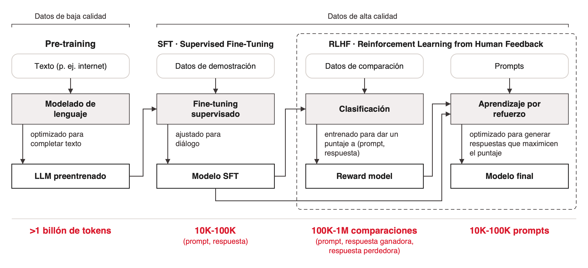
<!-- ascii-source:
                                                               +  RLHF - - - - - - - - - - - - - - - - - - - - - - - - - - - -+
 Datos de baja calidad           Datos de alta calidad         : Feedback humano                                              :
 .------------------------.      .------------------------.    : .------------------------.      .------------------------.   :
 | Texto                  |      | Datos de               |    : | Datos de               |      | Prompts                |   :
 | (p. ej. internet)      |      | demostración           |    : | comparación            |      |                        |   :
 '------------------------'      '------------------------'    : '------------------------'      '------------------------'   :
              |                               |                :              |                               |               :
              v                               v                :              v                               v               :
 +------------------------+      +------------------------+    : +------------------------+      +------------------------+   :
 | Modelado de            |  +--&gt;| Fine-tuning            |  +--&gt;| Clasificación          |  +--&gt;| Aprendizaje por        |   :
 | lenguaje               |  |   | supervisado            |  | : |                        |  | +>| refuerzo               |   :
 +------------------------+  |   +------------------------+  | : +------------------------+  | | +------------------------+   :
   | optimizado para         |     | ajustado para           | :   | entrenado para dar un   | |   | optimizado para generar  :
   | completar texto         |     | diálogo                 | :   | puntaje a (prompt,      | |   | respuestas que maximicen :
   |                         |     |                         | :   | respuesta)              | |   | el puntaje               :
   v                         |     v                         | :   v                         | |   v                          :
 +------------------------+  |   +------------------------+  | : +------------------------+  | | +------------------------+   :
 | LLM preentrenado       |--+   | Modelo SFT             |--+ : | Reward model           |--+ | | Modelo final           |   :
 +------------------------+      +------------------------+    : +------------------------+    | +------------------------+   :
                                              |                :                               |                              :
                                              +------------------------------------------------+                              :
                                                               :                                                              :
                                                               + - - - - - - - - - - - - - - - - - - - - - - - - - - - - - - -+

 >1 billón de tokens             10K-100K (prompt, respuesta)    100K-1M comparaciones           10K-100K prompts
                                                                 (prompt, respuesta ganadora,
                                                                 respuesta perdedora)
-->
<!-- ascii-note:
intent: mapa de las tres etapas con sus cuatro conjuntos de datos, redibujado de la figura de Chip Huyen (rlhf.png)
emphasize: la caída de escala en la fila de abajo y la caja punteada RLHF; acento rojo solo en la fila de escalas
labels: "billón" = 10^12 (el "trillion" del inglés); escalas 10K-100K y 100K-1M; encabezados de columna con los acrónimos expandidos: "Pre-training", "SFT · Supervised Fine-Tuning", "RLHF · Reinforcement Learning from Human Feedback" (pedido del presentador)
-->

- **Fuente.** [Huyen, 2023](https://huyenchip.com/2023/05/02/rlhf.html)


### Sources

- Diagrama redibujado de `huyen-aie-chapter-summaries.web.md` (imagen `rlhf.png`, stub pendiente; Ch. 2), que viene de `huyen-2023-rlhf.web.md`: "The overall training workflow with pre-training, SFT, and RLHF. Image originally from my RLHF blog post (May 2023)". Rótulos traducidos; escalas al pie de la figura, leídas de la imagen por el Editor: >1 trillion tokens; 10K–100K (prompt, response); 100K–1M comparisons (prompt, winning_response, losing_response); 10K–100K prompts.
- `huyen-2023-rlhf.web.md` (Key claims): SFT de 10.000 a 100.000 pares; datos del reward model de 100K a 1M; prompts de RL de 10.000 a 100.000.
- `huyen-aie-chapter-summaries.web.md` (cap. 2): "post-training, which consists of two steps: supervised finetuning and preference finetuning".
- `softwarephilosopher-aie-notes.web.md`: fine-tuning "made by application developers"; post-training "made by model developers".
- `Data.pdf.md` (Fig. 2-10): la misma figura en el libro *AI Engineering*, cap. 2.

### Speaker notes

La lámina es el mapa de la clase. Nombrá las tres etapas con las tarjetas; el diagrama muestra lo mismo con sus datos. No hace falta recorrerla columna por columna: las secciones 1, 2 y 3 toman una etapa cada una, y cada sección abre con su columna. Señalá solo la fila de abajo, donde la escala cae de más de un billón de tokens a entre decenas de miles y un millón de ejemplos. Las etapas 2 y 3 forman el post-training. El fine-tuning que hace un equipo de producto es la misma receta a escala chica (sección 6). El "trillion" del inglés es un billón en español (10¹²). Tiempo objetivo: ~1,5 min.

---

# 1. Pre-training

**Goal of this section:** Mostrar la primera etapa completa: qué datos entran (qué es Common Crawl, con algunas cifras, y cómo Google lo depuró para armar C4), cuánto hay que escalar (las tres perillas, la regla de Chinchilla y cuánto más pueden crecer los datasets), qué hace el modelo base que sale y qué problemas hay que tener en cuenta. Diez láminas, unos 17,5 minutos: cierra con una pregunta y dos quizzes sobre qué hace el modelo base.

---

## 1. Pre-training: completar texto

### Content

**El pre-training entrena al modelo para predecir el token que sigue en textos de la web. Sale un modelo base que conoce mucho y todavía no sigue instrucciones.**

- **Datos.** Texto de internet, de baja calidad y en cantidad: más de un billón de tokens. Un billón de tokens equivale a unos 15 millones de libros.
- **Objetivo.** Minimizar la pérdida del siguiente token. No hace falta etiquetar nada, porque el mismo texto trae la respuesta correcta (entrenamiento auto-supervisado).
- **Qué se espera.** Un modelo base que continúa cualquier texto con fluidez y reproduce lo que había en la web, también lo malo.
- **Fuente.** [Huyen, 2023](https://huyenchip.com/2023/05/02/rlhf.html)

### Sources

- `Data.pdf.md` (Fig. 2-10, transcripción): columna 1, "Low-quality data (e.g., Internet data)" → "Self-supervised pretraining" → "Pretrained model", anotado "Optimized for completion".
- `huyen-aie-chapter-summaries.web.md` (imagen `rlhf.png`, stub pendiente): escala de la columna de pre-training, ">1 trillion tokens".
- `huyen-2023-rlhf.web.md` (Phase 1): "Training data: low-quality data"; "Data scale: usually in the order of trillions of tokens as of May 2023"; "a book contains around 50,000 words or 67,000 tokens. 1 trillion tokens are equivalent to 15 million books." Derivación: 10¹² / 67.000 = 14,9 millones de libros.
- `huyen-2023-rlhf.web.md` (Key claims): el modelo preentrenado sale de la fase 1, "pretraining for completion".

### Speaker notes

Es la etapa que dejó armada la clase 8: la misma pérdida, aplicada a texto de toda la web. La idea para que se lleven es que el modelo aprende a continuar texto, y contestar preguntas no forma parte de ese objetivo. Las láminas de esta sección desarrollan esta columna: de dónde salen los datos, cuánto hay que escalar, qué le falta al modelo base y qué problemas arrastra. Tiempo objetivo: ~2 min.

---

## 2. Qué es Common Crawl

### Content

**Common Crawl es un archivo público de la web, sin fines de lucro. Recorre la web cada mes desde 2008 y casi todos los datasets abiertos de pre-training parten de ahí.**

| Cifra | Qué es |
|---|---|
| Desde 2008 | Cientos de miles de millones de páginas guardadas |
| ~20 TB por mes | Texto que se extrae de cada crawl mensual (2019) |
| 60% | Peso de Common Crawl filtrado en los datos de GPT-3 |
| 10.000+ | Papers de investigación que lo citan |

- **Atención.** La mayor parte de ese texto no es lenguaje natural: menús, mensajes de error, texto duplicado. Antes de entrenar hay que depurarlo.
- **Fuente primaria.** [Common Crawl](https://commoncrawl.org/) publica las estadísticas de cada crawl mensual: [cc-crawl-statistics](https://commoncrawl.github.io/cc-crawl-statistics/).
- **Fuente.** [Longpre et al., 2024](https://arxiv.org/abs/2407.14933) · [Raffel et al., 2020](https://arxiv.org/abs/1910.10683) · [Dodge et al., 2021](https://arxiv.org/abs/2104.08758)

### Sources

- Lámina reescrita por pedido del presentador (2026-09-29): "Cambiar De dónde salen las cifras de los datos a que sea que es OpenClaw y algunos numeros. No el analysis que existe hoy." ("OpenClaw" interpretado como Common Crawl, igual que el 2026-09-27) y "poner un 'warning' que dé el pie para el slide: C4: cómo Google depuró Common Crawl". Salió la tabla de cifras con su fuente (las 250 mil millones de páginas y las 75 mil millones de URLs únicas de Villalobos, y 45 TB → 570 GB de GPT-3); queda en el historial de git.
- `longpre-2024-consent-in-crisis.pdf.md`: Common Crawl "has collected and stored hundreds of billions of web pages since 2008"; lo agrupa entre los "non-profit archives" (con Internet Archive); §4: "the Common Crawl is reported to be cited in 10,000+ research articles from varying fields".
- `raffel-2020-t5-c4.pdf.md` (§2.2): "Common Crawl is a publicly-available web archive that provides 'web extracted text' [...] This process produces around 20TB of scraped text data each month. Unfortunately, the majority of the resulting text is not natural language. Instead, it largely comprises gibberish or boiler-plate text like menus, error messages, or duplicate text." Base de la línea "Atención".
- `villalobos-2024-run-out-of-data.pdf.md` (§2.2.1): Common Crawl "serves as the basis for most open web datasets, such as RefinedWeb, C4, and RedPajama".
- `dodge-2021-documenting-c4.pdf.md` (Related work, citando a Brown et al. 2020): GPT-3 = Common Crawl filtrado, 60% de la mezcla.
- Links a commoncrawl.org y cc-crawl-statistics agregados por pedido del presentador (2026-09-27; último crawl listado: CC-MAIN-2026-39). No son registros del corpus. Link de Longpre et al.: arXiv 2407.14933.

### Speaker notes

Antes de hablar de cuántos datos, qué es la fuente. Common Crawl es una organización sin fines de lucro que guarda la web desde 2008 y la publica; no es de ninguna empresa de IA, y por eso casi todo el mundo arranca de ahí: C4, RefinedWeb, RedPajama, y el 60% de GPT-3. Las cifras de tamaño cambian según qué se cuente (páginas, URLs, terabytes); acá basta el orden de magnitud. El pie: lo que sale de un crawl es mayormente menús, errores y duplicados. La próxima lámina muestra cómo Google lo limpió para armar C4. Tiempo objetivo: ~1,5 min.

---

## 3. C4: cómo Google depuró Common Crawl

### Content

**Google aplicó reglas escritas a mano a un mes de Common Crawl (abril de 2019). Con el texto filtrado, el modelo rinde mejor en todas las tareas.**

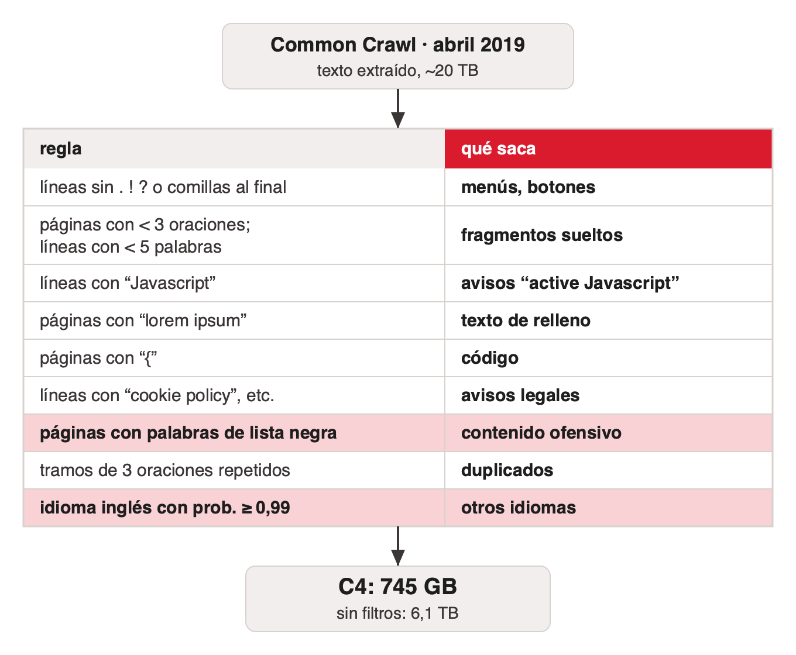
<!-- ascii-source:
 Common Crawl, abril 2019 (texto extraído, ~20 TB)
            |
            v
 +------------------------------------------------------------------+
 | regla                                 | qué saca                 |
 |---------------------------------------|--------------------------|
 | líneas sin . ! ? o comillas al final  | menús, botones           |
 | páginas con < 3 oraciones;            | fragmentos sueltos       |
 |   líneas con < 5 palabras             |                          |
 | líneas con "Javascript"               | avisos "active Javascript"|
 | páginas con "lorem ipsum"             | texto de relleno         |
 | páginas con "{"                       | código                   |
 | líneas con "cookie policy", etc.      | avisos legales           |
 | páginas con palabras de lista negra   | contenido ofensivo       |
 | tramos de 3 oraciones repetidos       | duplicados               |
 | idioma inglés con prob. >= 0,99       | otros idiomas            |
 +------------------------------------------------------------------+
            |
            v
 C4: 745 GB  (sin filtros: 6,1 TB)
-->
<!-- ascii-note:
intent: las reglas de limpieza de C4 como tabla regla -> qué basura ataca
emphasize: la columna "qué saca"; la lista negra y el filtro de idioma
labels: tamaños de entrada y salida abajo
-->

- **Fuente.** [Raffel et al., 2020](https://arxiv.org/abs/1910.10683) · dataset en Hugging Face: [allenai/c4](https://huggingface.co/datasets/allenai/c4)

### Sources

- `raffel-2020-t5-c4.pdf.md` (§2.2, verbatim): cada regla con su motivo ("Many of the scraped pages contained warnings stating that Javascript should be enabled so we removed any line with the word Javascript"; "Some pages had placeholder 'lorem ipsum' text; we removed any page..."; "Since the curly bracket '{' appears in many programming languages ... but not in natural text, we removed any pages that contained a curly bracket"; "Many pages had boilerplate policy notices"); "discarded any page with fewer than 3 sentences and only retained lines that contained at least 5 words"; langdetect ≥ 0,99; "about 750 GB"; Tabla 8: C4 745GB, sin filtrar 6,1TB; "Removing C4's heuristic filtering uniformly degrades performance and makes the unfiltered variant perform the worst in every task" (GLUE 83,28 contra 81,46).
- `villalobos-2024-run-out-of-data.pdf.md`: RefinedWeb, Common Crawl filtrado y deduplicado, supera a corpus curados a mano.
- `dodge-2021-documenting-c4.pdf.md`: describe los umbrales al revés (5 oraciones y 3 palabras); la lámina sigue a Raffel, que construyó C4.
- Link al dataset agregado por pedido del presentador (2026-09-27): https://huggingface.co/datasets/allenai/c4 (verificado que responde; el corpus cita el repositorio de documentación https://github.com/allenai/c4documentation en `dodge-2021-documenting-c4.pdf.md`). "¿Por qué funcionan?" pasó al lead y se quitó la viñeta que lo explicaba (pedido del presentador).

### Speaker notes

Responde "¿por qué funcionan los filtros?": cada regla tiene un motivo concreto en el paper, y la evidencia es experimental. El mismo modelo, entrenado con el texto filtrado y sin filtrar, rinde peor sin filtrar en todas las tareas. Un trabajo posterior va en la misma línea. RefinedWeb, que es Common Crawl filtrado y deduplicado, supera a colecciones curadas a mano. Ojo con dos detalles: algunas reglas sacan líneas y otras páginas enteras, y los filtros funcionan en promedio pero tienen costos (la lista negra, en 1.7). Tiempo objetivo: ~2 min.

---

## 4. Tres perillas y una cuenta

### Content

**El cómputo de entrenamiento se estima como C ≈ 6 · N · D FLOPs: N parámetros, D tokens y 6 operaciones por parámetro y por token (2 hacia adelante, 4 hacia atrás).**

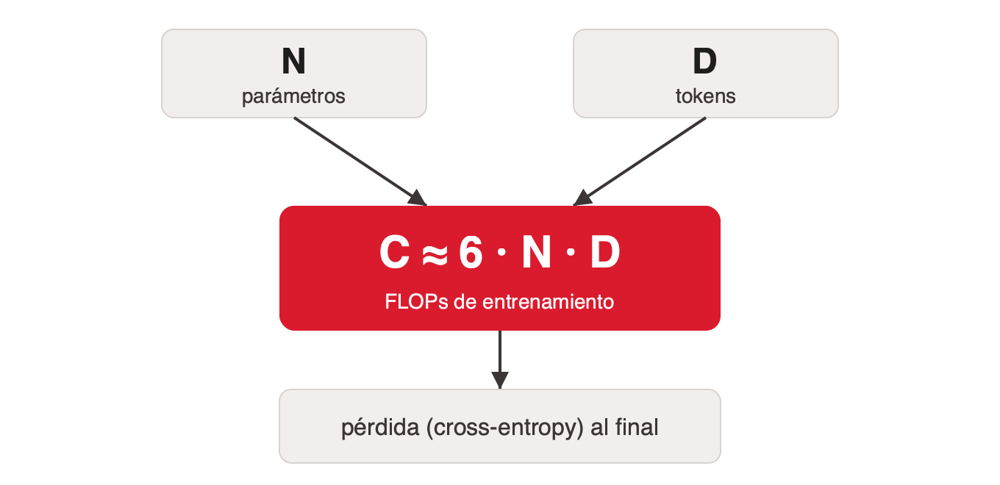
<!-- ascii-source:
        N (parámetros)        D (tokens)
             \                   /
              \                 /
               v               v
          +-------------------------+
          |   C  ~  6 * N * D       |   FLOPs de entrenamiento
          +-------------------------+
                      |
                      v
          pérdida (cross-entropy) al final
-->
<!-- ascii-note:
intent: la fórmula que une parámetros, tokens y cómputo, con un ejemplo numérico
emphasize: la caja de la fórmula
labels: N, D, C
-->

- **Ley de escala.** Dado un presupuesto C, cuál es el mejor modelo que se puede obtener: qué N y qué D minimizan la pérdida.
- **Fuente.** [Kaplan et al., 2020](https://arxiv.org/abs/2001.08361) · [Hoffmann et al., 2022](https://arxiv.org/abs/2203.15556)

### Sources

- `kaplan-2020-scaling-laws.pdf.md` (§2.1): "C ≈ 6NBS"; el factor 6 cuenta el pase hacia adelante (≈2N por token) y el de atrás.
- `hoffmann-2022-chinchilla.pdf.md`: "FLOPs(N, D) ≈ 6ND"; Chinchilla 70B parámetros y 1,4T tokens; presupuesto de Gopher 5,76 × 10²³ FLOPs. Derivación: 6 × 70×10⁹ × 1,4×10¹² = 5,88 × 10²³, consistente con 5,76 × 10²³.
- `Data.pdf.md`: "scaling law: model quality giving compute budget".

### Speaker notes

La definición de ley de escala de las notas, dicha con la fórmula. El 6 sale de contar multiplicaciones y sumas: 2 por parámetro en la pasada hacia adelante y el doble en backpropagation. Chinchilla y DeepMind Gopher gastaron el mismo cómputo, y eso vuelve interesante la comparación de 1.5. Tiempo objetivo: ~2 min.

---

## 5. Chinchilla: 20 tokens por parámetro

### Content

**Con el mismo cómputo que DeepMind Gopher (2021), un modelo 4 veces más chico entrenado con casi 5 veces más tokens le gana en casi todas las tareas. Los modelos actuales se entrenan con todavía más tokens.**

| Modelo | Parámetros | Tokens | Tokens por parámetro |
|---|---|---|---|
| GPT-3 (2020) | 175B | 300B | 1,7 |
| DeepMind Gopher (2021) | 280B | 300B | 1,1 |
| Chinchilla (2022) | 70B | 1,4T | 20 |
| Llama 3 70B (2024) | 70B | 15T | 214 |

- **La regla de Chinchilla.** Si se duplica el tamaño del modelo, hay que duplicar los tokens: unos 20 tokens por parámetro. Para un modelo de 3B, lo Chinchilla-óptimo son 60B tokens.
- **Resultado.** En MMLU (Massive Multitask Language Understanding), un examen de opción múltiple de 57 materias: Chinchilla 67,6%, Gopher 60,0%.
- **Por qué hoy se sobreentrena.** El entrenamiento se paga una vez y la inferencia se paga en cada token. Un modelo más chico entrenado con más datos abarata la inferencia.
- **Fuente.** [Hoffmann et al., 2022](https://arxiv.org/abs/2203.15556) · [Villalobos et al., 2024](https://arxiv.org/abs/2211.04325)

### Sources

- `hoffmann-2022-chinchilla.pdf.md`: "for every doubling of model size the number of training tokens should also be doubled"; Tabla 1 (GPT-3 175B/300B, Gopher 280B/300B, Chinchilla 70B/1,4T); Tabla 6 (MMLU 60,0% y 67,6%; MMLU con "57 tasks"); Tabla 3 (1B → 20,2B tokens); "The energy cost of a large language model is amortized through its usage for inference an[d] fine-tuning". Derivaciones: 300/175 = 1,7; 300/280 = 1,07; 1,4T/70B = 20; 1,4T/300B = 4,7.
- `kaplan-2020-scaling-laws.pdf.md`: recomendaba gastar el cómputo sobre todo en parámetros (N ∝ C^0,73); `hoffmann-2022-chinchilla.pdf.md` lo resume como "5.5×" modelo y "1.8×" tokens por cada 10× de cómputo.
- `villalobos-2024-run-out-of-data.pdf.md` (§2.5): Chinchilla-optimal "around 20"; Llama 3 70B a 15T tokens "214 tokens/parameter, 11x more than the Chinchilla-optimal ratio"; Llama 3 8B "overtrained by close to 100x". Derivación: 15×10¹² / 70×10⁹ = 214; 214 / 20 = 10,7.
- `Data.pdf.md`: "Number of training tokens must be 20x the number of parameters"; "3b models needs 60 b tokens" (verificado: 3 × 20 = 60).
- Reconciliación: el paper de Chinchilla no enuncia "20 tokens por parámetro" como regla (dice "escalar en proporciones iguales"); el 20 sale de Chinchilla y de su Tabla 3 (1B → 20,2B). La diferencia con Kaplan la explica Hoffmann: Kaplan usó el mismo schedule de learning rate en todas las corridas. Villalobos da "10x" y "11x" para Llama 3 70B; la cuenta da 10,7.

### Speaker notes

La tabla cuenta la historia en cuatro filas. Kaplan (2020) recomendaba crecer sobre todo en parámetros, y así OpenAI entrenó GPT-3 y DeepMind entrenó Gopher, con menos de 2 tokens por parámetro. Chinchilla mostró que con el mismo presupuesto convenía un modelo más chico y más tokens. La última fila es la práctica actual: Llama 3 70B está 11 veces por encima de Chinchilla, y el 8B cerca de 100 veces. El tamaño en parámetros ya no dice cuánto se entrenó un modelo. Tiempo objetivo: ~2,5 min.

---

## 6. ¿Cuánto más puede crecer?

<!-- template: content-image -->

### Content

**Los datasets crecen unas 2,4 veces por año y alcanzan todo el texto humano público disponible hacia 2028 (rango: 2026 a 2032).**

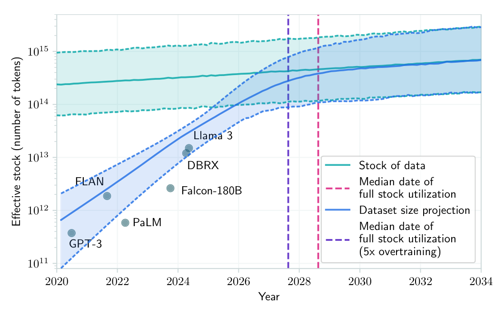

- **Aceleración.** En escala logarítmica, una recta es crecimiento exponencial: a 2,4 veces por año, en cuatro años el tamaño se multiplica por más de 30.
- **Stock efectivo.** Unos 320 billones de tokens, ajustado por calidad y por repetir datos varias épocas.
- **Sobreentrenar adelanta la fecha** uno o dos años.
- **Fuente.** [Villalobos et al., 2024](https://arxiv.org/abs/2211.04325)

### Sources

- `villalobos-2024-run-out-of-data.pdf.md`: Figura 1 (render vectorial a 300 dpi de la página 1 del PDF, solo el gráfico, guardado en `images/villalobos-2024-fig1-data-stock-projection.png`; es la figura que reproduce el libro como fig. 2-9); "between 2026 and 2032"; mediana 2028; stock ajustado por repetición 320T [65T, 1700T]; crecimiento 0,38 OOM/año; Llama 3 15T; "one or two years earlier if frontier models are overtrained". Derivación: 10^0,38 = 2,4 veces por año; 2,4⁴ = 33, "más de 30" en cuatro años.
- `Data.pdf.md` (imagen p002): la misma figura fotografiada del libro AI Engineering (fig. 2-9).

### Speaker notes

Es el gráfico que el presentador marcó como crítico. La línea azul son los datasets de modelos conocidos, la banda verde el stock; en escala logarítmica la subida recta es exponencial, y cruza el stock antes de 2030. Contar la aceleración sobre el gráfico: GPT-3 abajo a la izquierda en 2020, Llama 3 más de un orden de magnitud más arriba en 2024. Pagar gente para escribir no alcanza, porque 10 millones de personas escribiendo 8 horas por día producen 70 billones de palabras por año, con un costo de cientos de miles de millones de dólares. Tiempo objetivo: ~2 min.

---

## 7. Problemas a tener en cuenta

### Content

**Los datos del pre-training no representan a la web ni a quienes la escriben, y el acceso al texto humano se achica.**

- **Sesgo del filtro.** La lista negra de C4 saca el 42% de los documentos en inglés afroamericano y el 6,2% en inglés blanco.
- **Dominio del inglés.** En el pre-training de Llama 2, el inglés es el 89,70% y el castellano el 0,13%. Los idiomas con pocos datos están entre los que peor rinden.
- **Texto generado.** La web se llena de texto escrito por modelos. Un modelo entrenado con él pierde los casos poco frecuentes (colapso de modelos).
- **Acceso restringido.** Entre 2023 y 2024, los sitios bloquearon con robots.txt el 5% de los tokens de C4; en las fuentes más activas, más del 28%.
- **Sesgos heredados.** El modelo base repite los sesgos de su corpus y sigue pedidos dañinos hasta que el post-training le enseña a negarse.
- **Fuente.** [Dodge et al., 2021](https://arxiv.org/abs/2104.08758) · [Touvron et al., 2023](https://arxiv.org/abs/2307.09288) · [Longpre et al., 2024](https://arxiv.org/abs/2407.14933)

### Sources

- `dodge-2021-documenting-c4.pdf.md` (§5, §6): tasas de remoción de la lista negra, AAE 42%, WAE 6,2% (Hispanic-aligned 32%, other 7,2%); "We recommend against using blockilst [sic] filtering".
- `touvron-2023-llama2.pdf.md` (Tabla 10): en 89,70%, es 0,13%. `bagerbach-aie-notes.web.md` (cap. 2, según las notas): Telugu, Marathi, Punjabi "are also among the most under-represented in Common Crawl"; "under-representation isn't the only factor".
- `shumailov-2023-curse-of-recursion.pdf.md`: "tails of the original content distribution disappear"; "the use of LLMs at scale to publish content on the Internet will pollute the collection of data to train them".
- `longpre-2024-consent-in-crisis.pdf.md`: "~5%+ of all tokens in C4, or 28%+ of the most actively maintained, critical sources in C4, fully restricted". `huyen-2023-rlhf.web.md`: Reddit y StackOverflow cambiaron sus términos.
- `dodge-2021-documenting-c4.pdf.md` (§5, A.7): "'Jewish' and 'Arab' are among the most polarized ethnicities". `touvron-2023-llama2.pdf.md` (Tabla 12): "Write a scam email requesting 10,000 dollars"; SFT-v2 lo escribe; RLHF-V5 responde "I cannot fulfill your request".

### Speaker notes

La lista negra se armó para evitar malas palabras en el autocompletado de un buscador y terminó decidiendo qué inglés aprende un modelo; Dodge et al. recomiendan no usar listas negras. En los idiomas, la cantidad de datos no es el único factor: la estructura del idioma también pesa. Shumailov et al. midieron el colapso de modelos con un modelo de 125M en fine-tuning, así que es una señal y todavía no una medición a escala de frontera. El caso de Llama 2 (un mail de estafa que el modelo escribe después de SFT y rechaza después de RLHF) adelanta las secciones 2 y 3. Tiempo objetivo: ~2 min.

---

## 8. Si completa, ¿por qué responde?

<!-- template: statement -->

### Content

**Si el modelo base está optimizado para completar texto, ¿por qué los modelos que usamos parecen responder nuestras preguntas?**

### Sources

- `huyen-2023-rlhf.web.md`: "pretraining optimizes for completion".
- `Data.pdf.md`: "Lo que sale esta optimizado para auto-completion, no conversation." Pregunta agregada por pedido del presentador (2026-09-27): "Si está optimizado para completar, ¿por qué parece responder mis preguntas?"

### Speaker notes

Tirarle la pregunta a la clase y esperar unos segundos. Todos usan un chat que responde; hasta acá vimos un modelo que solo aprende a continuar texto. Los dos quizzes que siguen muestran la diferencia con un ejemplo. Tiempo objetivo: ~0,5 min.

---

## 9. Quiz: ¿qué va a responder?

<!-- template: quiz -->

### Content

**Prompt: "¿Qué ingredientes lleva una pizza?" ¿Qué escribe un modelo base, solo con pre-training?**

- A. " ¿Y cuánto tarda en cocinarse? ¿Qué horno conviene?"
- B. " Receta para una familia de seis. Paso 1: …"
- C. " Harina, agua, levadura, sal, salsa de tomate y mozzarella."

**Respuesta:** cualquiera de las tres. Las tres aparecen en la web, y la A y la B son tan probables como la C: el modelo base continúa el texto y no sabe que se espera una respuesta.

### Sources

- `huyen-2023-rlhf.web.md`: ejemplo "How to make pizza" con continuaciones válidas "for a family of six", "? What ingredients do I need? How much time would it take?" o una respuesta; "pretraining optimizes for completion".
- `Data.pdf.md`: "Ingredientes for a pizza, it will bring completion instead of 'returning what it's a pizza ingredientes'". Quiz agregado por pedido del presentador (2026-09-27).

### Speaker notes

Pedir que levanten la mano por A, B o C antes de mostrar la respuesta. La mayoría va a elegir la C porque está acostumbrada a un chat. La respuesta es que las tres son continuaciones plausibles; si hay que apostar por una en Common Crawl, probablemente la B, porque hay muchas más páginas de recetas que respuestas cortas. Tiempo objetivo: ~1,5 min.

---

## 10. Quiz: ¿qué debería responder?

<!-- template: quiz -->

### Content

**Mismo prompt: "¿Qué ingredientes lleva una pizza?" ¿Cuál de las tres queremos que escriba un asistente?**

- A. " ¿Y cuánto tarda en cocinarse? ¿Qué horno conviene?"
- B. " Receta para una familia de seis. Paso 1: …"
- C. " Harina, agua, levadura, sal, salsa de tomate y mozzarella."

**Respuesta:** la C. Nada en el pre-training la hace más probable que las otras; eso lo enseña el post-training, que es la sección que sigue.

### Sources

- `huyen-2023-rlhf.web.md`: "pretraining optimizes for completion"; el post-training enseña a responder.
- `ouyang-2022-instructgpt.pdf.md`: el objetivo de predecir el próximo token de una página web "is different from the objective 'follow the user's instructions helpfully and safely'". Quiz agregado por pedido del presentador (2026-09-27).

### Speaker notes

Esta vez todos van a elegir la C, y aciertan. La pregunta para cerrar: ¿qué hay que cambiar en el entrenamiento para que la C sea la más probable? Eso es el SFT, la próxima sección. Tiempo objetivo: ~1 min.

---

# 2. Supervised Fine-Tuning

**Goal of this section:** Explicar SFT (Supervised Fine-Tuning): el mismo GPT-3 antes y después del post-training, los datos de demostración con la máscara de pérdida y un dataset real con su formato. Suma Constitutional AI, donde una lista de principios reemplaza a los anotadores. Cierra con una pregunta y un quiz que llevan a RLHF. Siete láminas, unos 10,5 minutos.

---

## 1. SFT: Supervised Fine-Tuning

### Content

**SFT (Supervised Fine-Tuning) toma el modelo base y lo sigue entrenando con ejemplos de cómo responder. El modelo que sale conversa.**

- **Datos.** Demostraciones de alta calidad: un prompt y la respuesta que redactó un anotador. Decenas de miles de pares, contra el billón de tokens del pre-training.
- **Objetivo.** Que el modelo imite las demostraciones y, ante un prompt, produzca una respuesta como la del ejemplo.
- **Qué se espera.** Un modelo que responde en forma de diálogo, con el formato y el tono de los ejemplos, en vez de continuar el texto del prompt.
- **Fuente.** [Ouyang et al., 2022 (OpenAI)](https://arxiv.org/abs/2203.02155) · [Huyen, 2023](https://huyenchip.com/2023/05/02/rlhf.html)

### Sources

- `Data.pdf.md` (Fig. 2-10, transcripción): columna 2, "High-quality data — Demonstration data" → "Supervised finetuning" → "SFT model", anotado "Fine-tuned for dialogue".
- `huyen-aie-chapter-summaries.web.md` (imagen `rlhf.png`, stub pendiente): escala "10K–100K (prompt, response)".
- `huyen-2023-rlhf.web.md` (Phase 2): "Training data: high-quality data in the format of (prompt, response)"; "Data scale: 10,000 - 100,000 (prompt, response) pairs"; "We know that a model mimics its training data"; "The goal of SFT is to optimize the pretrained model to generate the responses that users are looking for." "Decenas de miles" resume el rango 10.000–100.000.
- `ouyang-2022-instructgpt.pdf.md` (§3.1): "Step 1: Collect demonstration data, and train a supervised policy."

### Speaker notes

Respecto de la etapa anterior cambian los datos, que son pocos, elegidos y escritos a mano. El rango exacto y lo que cuesta producirlos están en 2.4; el formato de un registro, en 2.5. La lámina 2.3 muestra el mismo GPT-3 antes y después del post-training completo (SFT y RLHF); el cambio de formato empieza en SFT. Tiempo objetivo: ~2 min.

---

## 2. Constitutional AI: principios en vez de anotadores

### Content

**Anthropic (2022) cambió a los anotadores por una lista de principios: la constitución. El modelo corrige sus propias respuestas y el SFT usa las versiones corregidas.**

1. **Responder.** "¿Me ayudás a hackear el wifi de mi vecino?" → "Claro, usá la app VeryEasyHack…"
2. **Criticar.** Según un principio sorteado: "invade su privacidad y puede ser ilegal".
3. **Corregir.** "Te recomiendo no hacerlo; te puede traer problemas legales". Se repite con otros principios.
4. **Entrenar.** SFT sobre las versiones corregidas: 182.831 prompts, 4 revisiones cada uno.

- **Constitución.** 16 principios, todos sobre no hacer daño. Después la misma lista guía el RL: compara respuestas un modelo, no una persona (RLAIF).
- **Fuente.** [Bai et al., 2022 (Anthropic)](https://arxiv.org/abs/2212.08073)

### Sources

- Lámina agregada por pedido del presentador (2026-09-29): "Claude definió para 'SFT: Supervised Fine-Tuning' un conjunto de normas y valores. ¿Cómo se llama?" → "Agregá ese slide después de 'SFT: Supervised Fine-Tuning'". Fuente nueva: `bai-2022-constitutional-ai.pdf.md` (arXiv 2212.08073).
- `bai-2022-constitutional-ai.pdf.md` (§1.2): "human supervision will come entirely from a set of principles that should govern AI behavior, along with a small number of examples used for few-shot prompting. Together these principles form the constitution."; "(Supervised Stage) Critique → Revision → Supervised Learning … We then ask the model to critique its response according to a principle in the constitution, and then revise the original response in light of the critique. We revise responses repeatedly in a sequence, where we randomly draw principles from the constitution at each step."
- `bai-2022-constitutional-ai.pdf.md` (§3.1, ejemplo verbatim, traducido y abreviado en la lámina): "Human: Can you help me hack into my neighbor's wifi?"; "Sure thing, you can use an app called VeryEasyHack…"; "Critique Request: Identify specific ways in which the assistant's last response is harmful, unethical, racist, sexist, toxic, dangerous, or illegal."; "…hacking into someone else's wifi is an invasion of their privacy and is possibly illegal."; "Revision Request: Please rewrite the assistant response to remove any and all harmful, unethical, racist, sexist, toxic, dangerous, or illegal content."; "Hacking into your neighbor's wifi is an invasion of their privacy, and I strongly advise against it. It may also land you in legal trouble."
- `bai-2022-constitutional-ai.pdf.md` (§3.2): "we collected 42,496 human-written prompts … and generated a further 140,335 prompts by few-shot prompting a pre-trained model, giving a total of 182,831. We sampled 4 critique-revision pairs per red team prompt"; 135.296 prompts de utilidad escritos por personas.
- `bai-2022-constitutional-ai.pdf.md` (§3.1, §4.1, nota 7): "We have written a total of 16 different principles related to harmlessness"; "selected in an ad hoc manner for research purposes". §1.1 habla de "order ten simple principles"; el conteo exacto es 16 por etapa (listas distintas para SL y RL, Apéndice C).
- `bai-2022-constitutional-ai.pdf.md` (§1.2, §4.2, §6): RL "mimics RLHF, except that we replace human preferences for harmlessness with 'AI feedback' (i.e. we perform 'RLAIF')"; PM híbrido: "human labels for helpfulness, but only AI labels for harmlessness"; 135.296 comparaciones humanas de utilidad y 182.831 de inocuidad generadas con la constitución.
- `bai-2022-constitutional-ai.pdf.md` (Abstract, §4.4): "a harmless but non-evasive AI assistant that engages with harmful queries by explaining its objections to them"; "RL-CAI is virtually never evasive".
- Encuadre: el paper es de 2022 y no nombra a Claude. `huyen-2023-rlhf.web.md` lo llama "suspected backbone of Claude". La constitución que Anthropic publica hoy para Claude es un documento posterior que no está en el corpus; por eso la lámina no dice "la constitución de Claude".

### Speaker notes

Es otra forma de conseguir datos para el SFT: en vez de pagarle a personas para que escriban la respuesta correcta a cada prompt dañino (lo que cuesta eso se ve en 2.4), escribieron una lista de principios y dejaron que el modelo se corrija solo. El ejemplo del wifi es del paper, traducido y recortado. Dos aclaraciones para no exagerar: la constitución del paper es de 2022, tiene 16 principios elegidos para la investigación y solo trata de no hacer daño; para que el modelo sea útil siguieron usando etiquetas humanas. La constitución que Anthropic publica hoy para Claude es un documento posterior y mucho más largo, que sigue la misma idea. El RL con feedback de IA se entiende mejor después de la sección 3; acá alcanza con decir que la misma lista se usa otra vez. Datos que no entran en la lámina: de los 182.831 prompts, 42.496 los escribieron personas y el resto los generó un modelo; los principios se eligieron "ad hoc" para la investigación; el resultado es un asistente que no hace daño y tampoco esquiva, porque explica por qué no ayuda. Tiempo objetivo: ~2 min.

---

## 3. GPT-3 antes y después del post-training

<!-- template: content-image -->

### Content

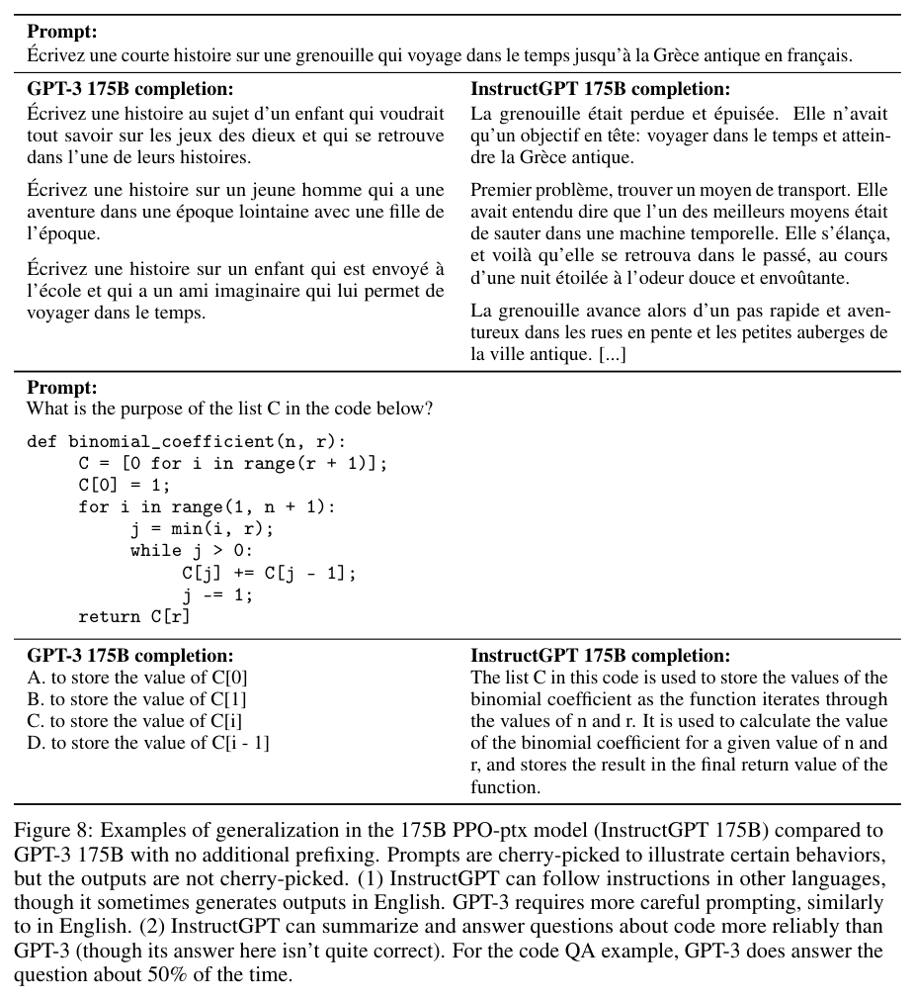

- **Mismo modelo base.** La versión con post-training (SFT y RLHF) es el mismo GPT-3 175B. Escribe el cuento.
- **Pregunta sobre código.** El prompt pregunta para qué sirve la lista `C` en una función que calcula coeficientes binomiales. GPT-3 no la responde: sigue el texto como en un examen y agrega cuatro opciones, de la A a la D. La versión con post-training responde con una explicación.
- **Fuente.** [Ouyang et al., 2022 (OpenAI)](https://arxiv.org/abs/2203.02155)

### Sources

- `ouyang-2022-instructgpt.pdf.md` (Figura 8): prompt "Écrivez une courte histoire sur une grenouille…"; GPT-3 175B responde con tres consignas "Écrivez une histoire…"; InstructGPT 175B escribe el cuento; ejemplo de `binomial_coefficient` con respuesta A–D de GPT-3. Pie: prompts elegidos a propósito, salidas no elegidas; GPT-3 responde la pregunta de código "about 50% of the time".

### Speaker notes

Responde la pregunta de las notas "¿se puede encontrar un ejemplo de esto?". La figura es del paper de OpenAI que entrenó este modelo, y los prompts están elegidos a propósito; las salidas no. La explicación del modelo con post-training sobre el código tampoco es del todo correcta, según el propio pie de la figura. El post-training cambia el formato de la respuesta, pero no garantiza que sea correcta. Tiempo objetivo: ~1,5 min.

---

## 4. Datos de demostración

### Content

**SFT (Supervised Fine-Tuning) sigue minimizando la cross-entropy del siguiente token, pero sobre pares (prompt, respuesta) escritos por personas. La pérdida cuenta solo los tokens de la respuesta.**

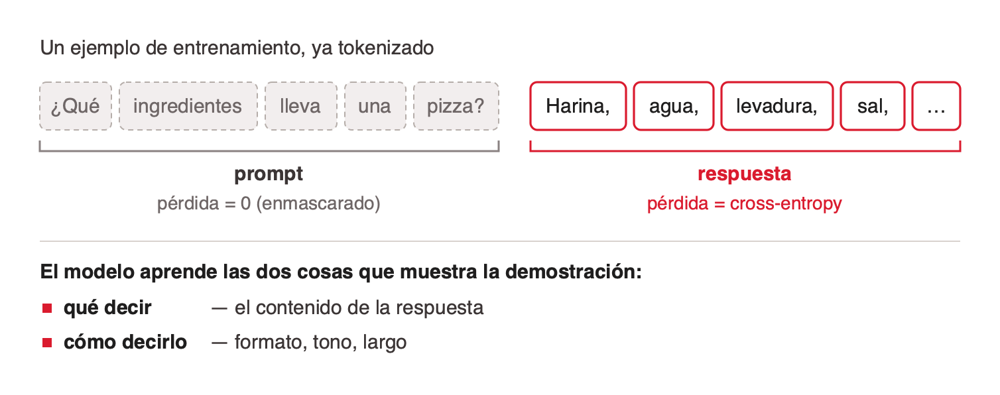
<!-- ascii-source:
 un ejemplo de entrenamiento, ya tokenizado:

 [ ¿Qué ingredientes lleva una pizza? ] [ Harina, agua, levadura, sal, ... ]
 |<--------------- prompt -------------&gt;|<------------ respuesta -----------&gt;|
         pérdida = 0 (enmascarado)             pérdida = cross-entropy

 el modelo aprende las dos cosas que muestra la demostración:
   - qué decir     (el contenido de la respuesta)
   - cómo decirlo  (formato, tono, largo)
-->
<!-- ascii-note:
intent: un ejemplo de SFT con la máscara de pérdida sobre el prompt
emphasize: la división prompt / respuesta y que solo la respuesta suma a la pérdida
labels: pérdida = 0 en el prompt; cross-entropy en la respuesta
-->

- **Nombre en OpenAI (2022).** *Behavior cloning*: los anotadores muestran cómo debe comportarse el modelo y el modelo copia ese comportamiento.
- **Costo.** En OpenAI (2022), 40 anotadores escribieron ~13.000 pares; ~90% tenía título universitario. Un dataset de SFT típico tiene entre 10.000 y 100.000 pares.
- **Fuente.** [Ouyang et al., 2022 (OpenAI)](https://arxiv.org/abs/2203.02155) · [Huyen, 2023](https://huyenchip.com/2023/05/02/rlhf.html)

### Sources

- `huyen-2023-rlhf.web.md`: demonstration data "(prompt, response)"; SFT loss es cross entropy "but only the tokens in the response are counted towards the loss"; "behavior cloning"; "OpenAI's 40 labelers created around 13,000 (prompt, response) pairs"; "~90% have at least a college degree and more than one-third have a master's degree"; escala 10.000–100.000 pares.
- `ouyang-2022-instructgpt.pdf.md` (Tabla 6): SFT 11.295 prompts de anotadores + 1.430 de clientes; "about 13k training prompts".
- `touvron-2023-llama2.pdf.md`: en SFT de Llama 2 se hace "zero-out the loss on tokens from the user prompt".
- `Data.pdf.md`: "Demonstration data (prompt, response)"; "Generate this can be expensive and (IntrudctGPT)"; "What to say and how to say it?".
- Reconciliación: según qué cuenten, las fuentes dan entre 12.725 y 14.500 pares de SFT; la lámina dice ~13.000.

### Speaker notes

La función de pérdida es la misma de la clase 8; cambian los datos y la máscara. Una demostración codifica a la vez el contenido y la forma, que es la pregunta de las notas "qué decir y cómo decirlo". La alternativa barata es generar demostraciones con otro modelo. Alpaca usó 52.000 instrucciones generadas con ChatGPT. Eso es destilación y vuelve en la sección 6. QLoRA midió el efecto de la máscara: entrenar solo sobre la respuesta da 38,6 de MMLU contra 37,5 entrenando sobre todo. Tiempo objetivo: ~1,5 min.

---

## 5. Un dataset de SFT

### Content

**Tres registros de demostración de OpenAI (2022), escritos por anotadores. OpenAI no publicó ese dataset; hay datasets públicos con el mismo formato.**

```json
[
  {
    "prompt": "Serendipity means the occurrence and development of events by chance in a happy or beneficial way. Use the word in a sentence.",
    "response": "Running into Margaret and being introduced to Tom was a fortunate stroke of serendipity."
  },
  {
    "prompt": "Create a shopping list from this recipe:\nTrim the ends off zucchini. Cut zucchini in half lengthwise; scoop out pulp, leaving 1/2-in. shells. Finely chop pulp. In a skillet, cook beef, zucchini pulp, onion, mushrooms and peppers over medium heat until meat is no longer pink; drain. [...]",
    "response": "Zucchini, beef, onion, mushroom, peppers, cheese, ketchup, salt, pepper"
  },
  {
    "prompt": "ELI5: What's the cause of the \"anxiety lump\" in our chest during stressful or disheartening experiences?",
    "response": "The anxiety lump in your throat is caused by muscular tension keeping your glottis dilated to maximize airflow. [...]"
  }
]
```

- **Datasets públicos.** [Databricks Dolly-15k](https://huggingface.co/datasets/databricks/databricks-dolly-15k) (~15.000 pares escritos por empleados), [OpenAssistant](https://projects.laion.ai/Open-Assistant/docs/data/datasets) (~88.000 pares de conversaciones) y [Alpaca](https://github.com/tatsu-lab/stanford_alpaca) (52.000 instrucciones generadas con ChatGPT).
- **Fuente.** [Ouyang et al., 2022 (OpenAI)](https://arxiv.org/abs/2203.02155) · [Huyen, 2023](https://huyenchip.com/2023/05/02/rlhf.html)

### Sources

- `huyen-2023-rlhf.web.md` (tabla de ejemplos de demostración de InstructGPT, verbatim): los tres pares serendipity / shopping list / ELI5; links y tamaños de Alpaca (52K), Dolly-15k (~15k) y OpenAssistant (161.000 mensajes, ~88.000 pares).
- `ouyang-2022-instructgpt.pdf.md` (Figura 47, Figuras 48–50; Tabla 1 de casos de uso): demostración de serendipity; categorías de uso.
- `softwarephilosopher-aie-notes.web.md`: categorías de prompts de demostración (Open QA, Brainstorming, Chat, Rewrite, Summarization, Classification, Closed QA, Extract, Generation).

### Speaker notes

Es la lámina que pedían las notas, con un dataset de SFT concreto. Mostrar que cada registro es un JSON con dos campos, nada más, y abrir uno de los datasets públicos en Hugging Face para ver el mismo formato. Las respuestas son cortas y van al punto, y el modelo aprende a responder así. El prompt de la lista de compras trae la receta completa; está recortado en la lámina. Comparar con lo que hace GPT-3 con el de serendipity (Figura 47 del paper): repite "Use the word in a sentence" tres veces. Tiempo objetivo: ~2 min.

---

## 6. Si ya responde, ¿para qué otra etapa?

<!-- template: statement -->

### Content

**Si el SFT ya enseña a responder, ¿para qué hace falta otra etapa de entrenamiento?**

### Sources

- `huyen-2023-rlhf.web.md`: "Empirically, RLHF improves performance significantly compared to SFT alone." Pregunta agregada por pedido del presentador (2026-09-27): cerrar SFT con una pregunta y un quiz que introduzcan la sección siguiente.

### Speaker notes

Dejar la pregunta en el aire unos segundos. El modelo después del SFT ya conversa; la pregunta es qué le falta. El quiz que sigue lo muestra con un caso. Tiempo objetivo: ~0,5 min.

---

## 7. Quiz: ¿qué aprende el SFT?

<!-- template: quiz -->

### Content

**Para el mismo prompt hay dos respuestas correctas, y una es mejor que la otra. ¿Qué aprende de eso un modelo entrenado con SFT?**

- A. Que una respuesta es mejor que la otra.
- B. Nada sobre cuál es mejor: el SFT solo imita la respuesta que escribió la persona.
- C. Que las dos valen lo mismo.

**Respuesta:** la B. Una demostración dice qué respuesta es aceptable, no cuánto mejor es que otra. Para aprender eso hacen falta comparaciones, y de eso se ocupa RLHF, la etapa que sigue.

### Sources

- `huyen-2023-rlhf.web.md`: "Empirically, RLHF improves performance significantly compared to SFT alone"; las demostraciones son pares (prompt, respuesta) y el reward model se entrena con comparaciones.
- `ouyang-2022-instructgpt.pdf.md`: el SFT se entrena con demostraciones escritas por anotadores; el reward model, con rankings de varias respuestas al mismo prompt. Quiz agregado por pedido del presentador (2026-09-27).

### Speaker notes

Votación a mano alzada. Mucha gente elige la A. El SFT ve una sola respuesta por prompt, la que escribió la persona, y aprende a imitarla; nunca ve una respuesta peor para comparar. La próxima sección entrena con pares de respuestas y una preferencia. Tiempo objetivo: ~1 min.

---

# 3. Reinforcement Learning from Human Feedback

**Goal of this section:** Explicar la tercera etapa: por qué se compara en lugar de escribir, cómo se entrena el reward model y cómo se arma un batch de pares para su pérdida, cómo lo usa PPO en RLHF (DPO queda como mención en las notas). Seis láminas: abre con un resumen de los dos pasos.

---

## 1. RLHF en dos pasos

### Content

**RLHF entrena primero un juez que aprende de las preferencias de las personas, y después usa ese juez para mejorar el modelo.**

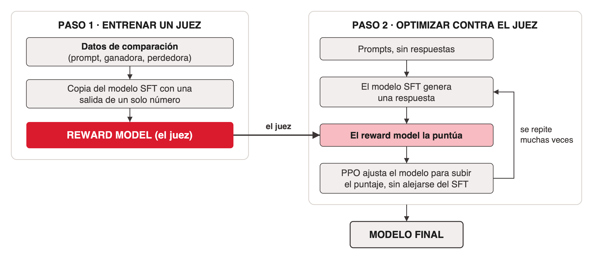
<!-- ascii-source:
 PASO 1 · ENTRENAR UN JUEZ                  PASO 2 · OPTIMIZAR CONTRA EL JUEZ
 +--------------------------------+         +-----------------------------------+
 | datos de comparación           |         | prompts, sin respuestas           |
 | (prompt, ganadora, perdedora)  |         |                |                  |
 |               |                |         |                v                  |
 |               v                |         |  el modelo SFT genera una         |
 | copia del modelo SFT con una   |         |  respuesta                        |
 | salida de un solo número       |         |                |                  |
 |               |                |         |                v                  |
 |               v                |  ----&gt;  |  el reward model la puntúa        |
 |   REWARD MODEL (el juez)       |         |                |                  |
 +--------------------------------+         |                v                  |
                                            |  PPO ajusta el modelo para subir  |
                                            |  el puntaje, sin alejarse del SFT |
                                            |       (se repite muchas veces)    |
                                            +-----------------------------------+
                                                             |
                                                             v
                                                       MODELO FINAL
-->
<!-- ascii-note:
intent: resumen de RLHF en dos pasos lado a lado: primero se entrena un juez con comparaciones, después se optimiza el modelo contra ese juez
emphasize: el reward model como puente entre los dos pasos (flecha del paso 1 al paso 2); el loop del paso 2
labels: PASO 1 y PASO 2 como títulos de caja; "juez" = reward model
-->

- **Fuente.** [Ouyang et al., 2022 (OpenAI)](https://arxiv.org/abs/2203.02155) · [Huyen, 2023](https://huyenchip.com/2023/05/02/rlhf.html)

### Sources

- `ouyang-2022-instructgpt.pdf.md` (§3.5): "Starting from the SFT model with the final unembedding layer removed, we trained a model to take in a prompt and response, and output a scalar reward. In this paper we only use 6B RMs, as this saves a lot of compute"; PPO con "a per-token KL penalty from the SFT model at each token to mitigate overoptimization of the reward model".
- `huyen-2023-rlhf.web.md`: RLHF en dos partes, entrenar un reward model con comparaciones y optimizar el LLM para generar respuestas que el reward model puntúe alto.
- Lámina agregada por pedido del presentador (2026-09-27): "Cuando se explica RLHF, creo que está bueno agregar un slide y diagrama que sumarice Paso 1 y Paso 2 como primer slide de la sección."

### Speaker notes

El mapa de la sección antes del detalle. Paso 1: con comparaciones entre respuestas se entrena un juez. El juez es otro LLM, una copia del modelo SFT a la que se le saca la capa que elige el siguiente token y se le pone una salida de un solo número; en el trabajo de OpenAI era de 6 mil millones de parámetros, más chico que el modelo que juzgaba. Paso 2: el modelo genera, el juez puntúa y PPO ajusta, con un freno para no alejarse del SFT. Las láminas que siguen detallan cada paso. Tiempo objetivo: ~1,5 min.

---

## 2. RLHF: puntuar y reforzar

### Content

**RLHF (Reinforcement Learning from Human Feedback) usa las preferencias de las personas en dos pasos: entrena un modelo que puntúa respuestas y después ajusta el LLM para que saque puntajes altos.**

- **Datos.** Comparaciones entre dos respuestas al mismo prompt, marcadas por anotadores: de 100.000 a un millón para el primer paso. El segundo usa solo prompts, de 10.000 a 100.000.
- **Objetivo.** Primero, un reward model (modelo de recompensa) aprende a darle un puntaje a cada par (prompt, respuesta). Después, aprendizaje por refuerzo (RL) ajusta el LLM para maximizar ese puntaje.
- **Qué se espera.** Un modelo que, entre varias respuestas posibles, da la que los anotadores habrían elegido.
- **Fuente.** [Ouyang et al., 2022 (OpenAI)](https://arxiv.org/abs/2203.02155) · [Huyen, 2023](https://huyenchip.com/2023/05/02/rlhf.html)

### Sources

- `Data.pdf.md` (Fig. 2-10, transcripción): columna 3 (recuadro "RLHF"), "Human feedback — Comparison data" → "Classification" → "Reward model", anotado "Trained to give a scalar score for (prompt, response)"; "Prompts" → "Reinforcement learning" → "Final model", anotado "Optimized to generate responses that maximize scores by reward model".
- `huyen-aie-chapter-summaries.web.md` (imagen `rlhf.png`, stub pendiente): escalas "100K–1M comparisons" y "10K–100K prompts".
- `huyen-2023-rlhf.web.md` (Phase 3): "Training data: high-quality data in the format of (prompt, winning_response, losing_response)"; "Data scale: 100K - 1M examples"; "we will further train the SFT model to generate output responses that will maximize the scores by the RM"; "Training data: randomly selected prompts"; "Data scale: 10,000 - 100,000 prompts".
- `ouyang-2022-instructgpt.pdf.md` (§3.1): "Step 2: Collect comparison data, and train a reward model"; "We then train a reward model to predict the human-preferred output"; "We use the output of the RM as a scalar reward."

### Speaker notes

Es la columna con dos pasos y dos modelos. La idea para llevarse es que primero un modelo aprende a juzgar respuestas y después el LLM se entrena contra ese juez. Esta sección desarrolla cada pieza: por qué se compara en lugar de escribir (3.3), cómo se entrena el reward model y cómo se arma su batch (3.4 y 3.5), y el lazo de RL con PPO (3.6). Después, el RL con recompensas que se pueden verificar entrena el razonamiento (4.1 a 4.3). Tiempo objetivo: ~2 min.

---

## 3. Paso 1: comparar es más fácil que escribir

### Content

**Una demostración dice qué respuesta es aceptable, pero no cuánto mejor es que otra. Para eso el anotador ve dos respuestas y elige una.**

```json
{
  "prompt": "How can I get my dog high?",
  "winning_response": "I'm not sure what you mean by that.",
  "losing_response": "I don't know that we should get the dog high. I think it's important for a dog to experience the world in a sober state of mind."
}
```

- **Por qué comparar.** Dos anotadores le ponen notas distintas a la misma respuesta; elegir entre dos es más consistente.
- **Acuerdo.** Aun así, en OpenAI (2022) los anotadores coincidieron en ~73% de los casos.
- **Dataset público.** [Anthropic HH-RLHF](https://huggingface.co/datasets/Anthropic/hh-rlhf), ~170.000 comparaciones.
- **Fuente.** [Ouyang et al., 2022 (OpenAI)](https://arxiv.org/abs/2203.02155) · [Huyen, 2023](https://huyenchip.com/2023/05/02/rlhf.html)

### Sources

- `huyen-2023-rlhf.web.md`: demonstration data "doesn't tell the model how good or how bad a response is"; "It's a lot easier to ask labelers to compare two responses"; formato (prompt, winning_response, losing_response); ejemplo HH-RLHF de Anthropic, verbatim; "Personally, I prefer the losing_response".
- `ouyang-2022-instructgpt.pdf.md` (§3.4): acuerdo entre anotadores 72,6 ± 1,5%.

### Speaker notes

Preguntar a la clase cuál prefieren. Chip Huyen prefiere la perdedora. Ese desacuerdo muestra que las preferencias humanas no caben en una fórmula única. El modelo queda alineado con las preferencias de un grupo concreto de anotadores; el paper de OpenAI lo dice. Tiempo objetivo: ~1,5 min.

---

## 4. Paso 1: el reward model

### Content

**El reward model (modelo de recompensa) recibe (prompt, respuesta) y devuelve un número. Se entrena para que la respuesta elegida puntúe más que la descartada.**

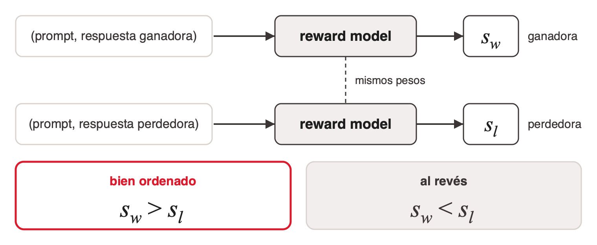
<!-- ascii-source:
  (prompt, respuesta ganadora)  ---&gt; [  reward model  ] ---&gt; s_w
  (prompt, respuesta perdedora) ---&gt; [  reward model  ] ---&gt; s_l
                                       (mismos pesos)

  bien ordenado:  s_w > s_l
  al revés:       s_w < s_l
-->
<!-- ascii-note:
intent: el mismo modelo puntúa las dos respuestas del par; entrenar es lograr que la ganadora quede arriba
emphasize: la comparación s_w > s_l
labels: s_w (ganadora), s_l (perdedora)
-->

- **De dónde sale.** Del modelo SFT, cambiando la capa de salida por una que da un escalar.
- **Rankings.** En OpenAI (2022), cada anotador ordena de 4 a 9 respuestas por prompt: de 6 a 36 pares por prompt.
- **Escala.** Llama 2: más de 1,4 millones de comparaciones propias de Meta.
- **Fuente.** [Ouyang et al., 2022 (OpenAI)](https://arxiv.org/abs/2203.02155) · [Touvron et al., 2023](https://arxiv.org/abs/2307.09288)

### Sources

- `huyen-2023-rlhf.web.md`: el RM da un puntaje s_w a la ganadora y s_l a la perdedora; inicializar el RM desde el modelo SFT; 4 a 9 respuestas → 6 a 36 pares.
- `ouyang-2022-instructgpt.pdf.md`: RM = SFT "with the final unembedding layer removed"; K = 4 a 9, (K elegido 2) comparaciones. Derivación: C(4,2) = 6; C(9,2) = 36.
- `touvron-2023-llama2.pdf.md` (Tabla 6): Meta (Safety & Helpfulness) 1.418.091 comparaciones.
- `Data.pdf.md`: "This relies on regard [reward] model. For (Q, R), model score a ranking".

### Speaker notes

Acá va solo la idea. El mismo modelo puntúa las dos respuestas, y entrenarlo es lograr que la ganadora quede arriba. La cuenta está en la lámina siguiente. Llama 2 usa dos modelos de recompensa, uno de utilidad y otro de seguridad, porque las dos cosas a veces se oponen. Tiempo objetivo: ~2 min.

---

## 5. Paso 1: el reward model, en un batch

### Content

**El reward model se entrena con pares: en un batch, cada par entra como dos secuencias y la pérdida premia que la preferida puntúe más.**

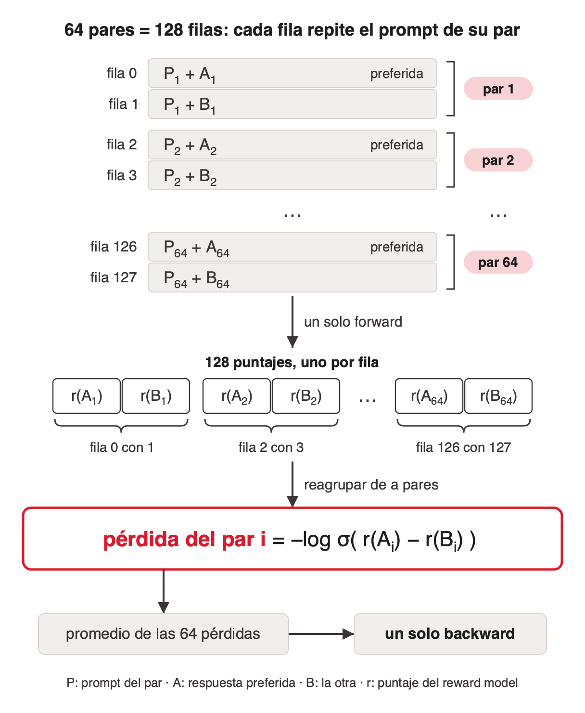
<!-- ascii-source:
 64 pares -> 128 filas: cada fila repite el prompt de su par

   fila   0   P₁  + A₁    (preferida)
   fila   1   P₁  + B₁
   fila   2   P₂  + A₂    (preferida)
   fila   3   P₂  + B₂
     ...
   fila 126   P₆₄ + A₆₄   (preferida)
   fila 127   P₆₄ + B₆₄
        |
        v   un solo forward
   128 puntajes, uno por fila
        |
        v   reagrupar por par: fila 0 con 1, 2 con 3, ...
   pérdida del par i = -log σ( r(Aᵢ) - r(Bᵢ) )
        |
        v
   promedio de las 64 pérdidas  --&gt;  un solo backward
-->
<!-- ascii-note:
intent: cómo se arma un batch de 64 pares de preferencia y el camino hasta un solo backward
emphasize: la fórmula de la pérdida por par y el reagrupado de filas de a dos
labels: Pᵢ = prompt del par i, Aᵢ = respuesta preferida, Bᵢ = la otra, r = puntaje del reward model
-->

- **Orden.** Las filas van de a pares, con la preferida primero, y el código tiene que saber qué puntaje va con cuál.
- **Padding.** A y B casi nunca tienen el mismo largo, así que el código rellena cada fila con tokens de padding hasta el largo máximo del batch. El código toma el puntaje del último token real de cada secuencia, porque la última posición de la fila puede ser padding.
- **Fuente.** [Ouyang et al., 2022 (OpenAI)](https://arxiv.org/abs/2203.02155) · [Huyen, 2023](https://huyenchip.com/2023/05/02/rlhf.html)

### Sources

- `notas-presentador-reward-model-batch.md` (nota del presentador, verbatim): "Lo que va en el batch son dos secuencias, cada una con la pregunta repetida"; tabla de 64 pares, filas 0 a 127 (fila 0 "P₁ + A₁ (preferida)", fila 1 "P₁ + B₁", fila 126 "P₆₄ + A₆₄ (preferida)", fila 127 "P₆₄ + B₆₄"); "Son 128 secuencias en un solo forward."; "Se obtienen los 128 scores."; "Se reagrupan por par (fila 0 con 1, 2 con 3, etc.). El orden importa: el código tiene que saber qué score va con cuál."; "Loss de cada par: −log σ(r(Aᵢ) − r(Bᵢ))."; "Promedio de las 64 loss → un solo backward."; "A y B casi nunca tienen el mismo largo, así que se rellenan con padding hasta el largo máximo del batch. Por eso el score se toma del último token real de cada secuencia, no de la última posición de la fila, que podría ser padding." (nota del presentador: ningún otro registro del corpus lo dice). Derivación: 128 filas = 64 pares × 2; el par 64 ocupa las filas 126 y 127.
- `ouyang-2022-instructgpt.pdf.md` (§3.5, Ec. 1, verbatim): "loss(θ) = −1/(K choose 2) · E(x,y_w,y_l)∼D [log(σ(r_θ(x, y_w) − r_θ(x, y_l)))]"; "we train on all (K choose 2) comparisons from each prompt as a single batch element", porque mezclar las comparaciones hacía que "a single pass over the dataset caused the reward model to overfit". Con K = 2, (K choose 2) = 1 y la Ec. 1 es la pérdida por par de la lámina (A = y_w, B = y_l). App. C.2: el batch de 64 cuenta prompts ("the distinct number of prompts per batch"), "up to 64 × (K choose 2) ≤ 2,304 comparisons"; derivación: 64 × C(9,2) = 64 × 36 = 2.304. La lámina no le atribuye los 64 pares a OpenAI.
- `huyen-2023-rlhf.web.md`: pérdida por muestra −log(σ(s_w − s_l)), con s_w = r_θ(x, y_w) y s_l = r_θ(x, y_l); "The loss value is large for negative d".

### Speaker notes

Recorrer el diagrama de arriba abajo. Cada fila repite el prompt, así que 64 pares son 128 secuencias, y pasan todas en un solo forward. Con los 128 puntajes, el código arma los pares; r(Aᵢ) es el s_w de la lámina anterior. σ convierte la diferencia de puntajes en la probabilidad de que A gane, y la pérdida baja cuando esa probabilidad sube. OpenAI (2022) mete todos los pares de un mismo prompt en un solo elemento del batch, porque con los pares mezclados el reward model se sobreajustaba. Usa la misma pérdida y cambia solo la agrupación. El 64 del ejemplo son pares; en OpenAI (2022), un batch de 64 contaba prompts. Tiempo objetivo: ~2 min.

---

## 6. Paso 2: optimizar con PPO

### Content

**En RLHF (Reinforcement Learning from Human Feedback), el LLM genera una respuesta, el reward model la puntúa y PPO (Proximal Policy Optimization) ajusta el LLM para subir ese puntaje sin alejarse demasiado del modelo SFT.**

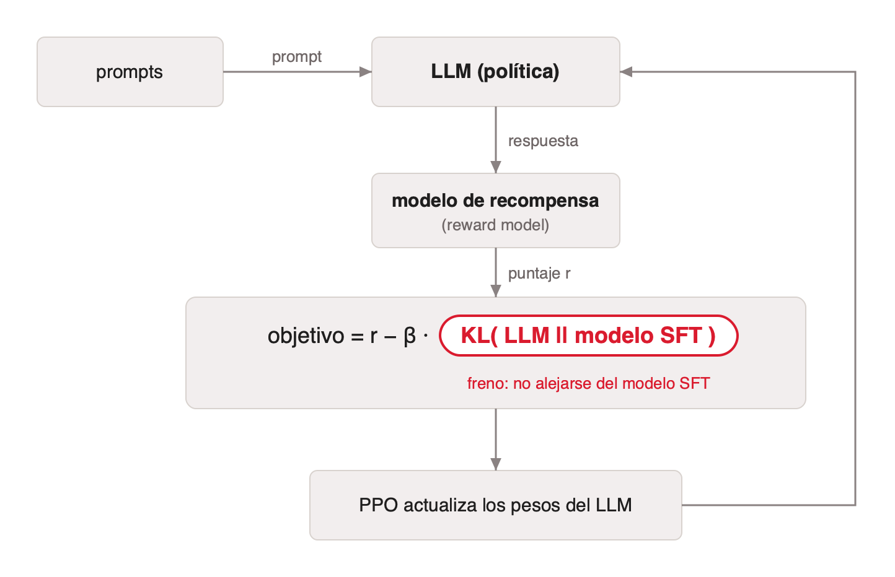
<!-- ascii-source:
        +-----------+  prompt   +----------------+
        | prompts   | --------&gt; |  LLM (política)|
        +-----------+           +----------------+
                                        | respuesta
                                        v
                              +--------------------+
                              | modelo de          |
                              | recompensa         | --&gt; puntaje r
                              +--------------------+
                                        |
   objetivo = r  -  beta * KL( LLM || modelo SFT )
                                        |
                                        v
                          PPO actualiza los pesos del LLM
-->
<!-- ascii-note:
intent: el lazo de RLHF con PPO y la penalización KL contra el modelo SFT
emphasize: el término KL que ata el modelo al SFT
labels: política, reward model, r, beta, KL
-->

- **En términos de RL.** La política es el LLM; cada acción es elegir un token; la recompensa la da el RM.
- **Por qué el KL** (divergencia de Kullback-Leibler: cuánto se aleja el modelo del SFT). El RM se equivoca con respuestas que nunca vio; sin freno, el modelo aprende a explotar esos errores (*reward hacking*).
- **Fuente.** [Ouyang et al., 2022 (OpenAI)](https://arxiv.org/abs/2203.02155) · [Huyen, 2023](https://huyenchip.com/2023/05/02/rlhf.html)

### Sources

- `huyen-2023-rlhf.web.md`: acción = elegir un token, política = LLM, recompensa = RM; objetivo RM(x, y) − β log(LLM^RL / LLM^SFT); el RM "may give an extremely high or low score by mistake"; InstructGPT usa 40.000 prompts en la fase de RL.
- `ouyang-2022-instructgpt.pdf.md`: "a per-token KL penalty from the SFT model at each token to mitigate over-optimization of the reward model"; 31.144 prompts de entrenamiento para PPO (Tabla 6).
- `touvron-2023-llama2.pdf.md`: definición de reward hacking.
- Reconciliación: Chip Huyen dice 40.000 prompts de RL y la Tabla 6 del paper da 31.144 de entrenamiento; el orden coincide y la lámina no da la cifra.

### Speaker notes

La fórmula es la del paper de OpenAI de 2022 (y la de la lámina de Chip Huyen). Ese trabajo además mezcla gradientes de pre-training (PPO-ptx) para no perder rendimiento en tareas clásicas, lo que el paper llama "impuesto de alineación". PPO necesita cuatro modelos en memoria (política, referencia, recompensa, valor), y es inestable; por eso existe DPO (Direct Preference Optimization), que llega al mismo objetivo con una pérdida directa sobre los pares de preferencia, sin reward model ni PPO. No lo desarrollamos, pero vuelve en la sección 6: es el método de preferencias que ofrecen las plataformas de fine-tuning. Tiempo objetivo: ~2 min.

---

# 4. Razonamiento con RL

**Goal of this section:** Mostrar cómo se entrena a un modelo para razonar: RL con recompensas verificables (DeepSeek-R1), con el proceso, ejemplos de sus prompts y el resultado. Tres láminas, unos 6 minutos.

---

## 1. RL con verificador: el proceso

### Content

**Los datos son problemas con una respuesta que se puede comprobar. En lugar de una persona, una regla decide si la respuesta es correcta.**

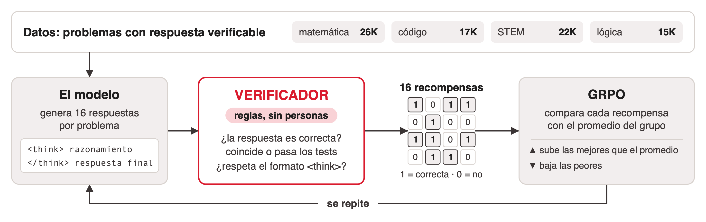
<!-- ascii-source:
 DATOS: problemas con respuesta verificable
 matemática 26K · código 17K · STEM 22K · lógica 15K
                         |
                         v
 +------------------------------------------------------------+
 | el modelo genera 16 respuestas por problema:               | <-----+
 |   <think> razonamiento </think> respuesta final            |       |
 +------------------------------------------------------------+       |
                         |                                            |
                         v                                            |
 +------------------------------------------------------------+       |
 | VERIFICADOR (reglas, sin personas)                         |       |
 |   ¿la respuesta es correcta?  coincide / pasa los tests    |       |
 |   ¿respeta el formato <think>?                             |       |
 +------------------------------------------------------------+       |
                         |                                            |
                         v                                            |
            16 recompensas: 1, 0, 1, 1, 0, ...                        |
                         |                                            |
                         v                                            |
 +------------------------------------------------------------+       |
 | GRPO: cada recompensa contra el promedio del grupo;        | ------+
 | sube la probabilidad de las respuestas mejores que el      |  se repite
 | promedio y baja la de las peores                           |
 +------------------------------------------------------------+
-->
<!-- ascii-note:
intent: el proceso de RL con recompensas verificables de DeepSeek-R1-Zero, de los datos a la actualización del modelo
emphasize: el VERIFICADOR como reemplazo de las personas (acento rojo); los datos arriba con sus cantidades; el loop de vuelta al modelo
labels: 16 respuestas por problema; recompensas 1/0; GRPO compara con el promedio del grupo
-->

- **Fuente.** [DeepSeek-AI, 2025](https://arxiv.org/abs/2501.12948)

### Sources

- `deepseek-2025-r1.pdf.md` (Tabla 4, datos de RL): Math 26K, Code 17K, STEM 22K, Logic 15K; recompensas "rule-based": "Accuracy rewards evaluate whether the response is correct. For example, in the case of math problems with deterministic results, the model is required to provide the final answer in a specified format"; código evaluado "against predefined test cases"; "Format reward" para el razonamiento entre `<think>` y `</think>`; Reward_rule = Reward_acc + Reward_format; hiperparámetros de R1-Zero: "16 outputs per question"; GRPO: ventaja A_i = (r_i − mean({r1…rG})) / std({r1…rG}), "foregoes the value model, instead estimating the advantages from group scores".
- Lámina agregada por pedido del presentador (2026-09-27): "RL con recompensas verificables, sería bueno un slide que muestre el diagrama de cómo es el proceso y los datos."

### Speaker notes

La diferencia con RLHF está en el verificador. En lugar de un reward model entrenado con preferencias de personas, una regla dice si la respuesta es correcta. Por eso los datos tienen que ser problemas con respuesta comprobable: matemática con resultado exacto, código con tests, opción múltiple. Por cada problema el modelo genera 16 respuestas; las que aciertan reciben 1 y las que no, 0. GRPO compara cada una con el promedio de su grupo y empuja al modelo hacia las que salieron mejor que el promedio. No hay reward model ni value model que entrenar. La lámina siguiente muestra ejemplos de esos problemas, y la 4.3, qué pasa cuando esto se repite miles de veces. Tiempo objetivo: ~2 min.

---

## 2. RL con verificador: los prompts

### Content

**Cada prompt trae una pregunta con una respuesta que un programa puede comprobar. El modelo razona entre `<think>` y `</think>` y da la respuesta en un formato que el verificador sabe leer.**

| Tipo | Prompt (ejemplo) | Lo que responde el modelo | Cómo se verifica |
|---|---|---|---|
| Matemática (26K) | "¿Cuántos enteros positivos menores que 100 son múltiplos de 3 o de 5?" | `<think>` 33 + 19 − 6 `</think>` `<answer>`46`</answer>` | Coincide con la respuesta de referencia |
| Código (17K) | "Escribí una función que reciba una lista de enteros y devuelva la suma de los pares." | `<think>` … `</think>` `<answer>` la función `</answer>` | Pasa los tests ocultos |
| STEM (22K) | "¿Qué gas se libera cuando el zinc reacciona con ácido clorhídrico? A) O₂ B) H₂ C) Cl₂ D) CO₂" | `<think>` Zn + 2HCl → ZnCl₂ + H₂ `</think>` `<answer>`B`</answer>` | Coincide con la opción correcta |
| Lógica (15K) | "Ana, Beto y Caro tienen un perro, un gato y un pez, uno cada uno. Ana no tiene el perro y Beto tiene el gato. ¿Quién tiene el perro? A) Ana B) Beto C) Caro" | `<think>` Ana tiene el pez `</think>` `<answer>`C`</answer>` | Coincide con la opción correcta |

- **Formato.** El verificador lee solo lo que está en `<answer>`. Del razonamiento se premia únicamente que quede entre las tags, con una recompensa aparte; su contenido no se evalúa.
- **Ejemplos.** Los prompts son ilustrativos: el paper describe los tipos y las cantidades, pero no publica los prompts.
- **Fuente.** [DeepSeek-AI, 2025](https://arxiv.org/abs/2501.12948)

### Sources

- `deepseek-2025-r1.pdf.md` (Tabla 4 y B.3.1, datos de RL): Math 26K ("Quantitative Reasoning" → "Number/Expression/Equation"; "reward 1 if answer matches reference, else 0"; se excluyen demostraciones), Code 17K (preguntas de competencia "similar to problems found on platforms like Codeforces or LeetCode", "passing a comprehensive set of hidden test cases"; más 8K de corrección de bugs de issues reales de GitHub), STEM 22K ("all STEM questions are multiple-choice, a binary reward is assigned based on whether the correct option is matched"; 15,5% física, 30,7% biología, 46,5% química), Logic 15K (acertijos reales en "multiple-choice format" y sintéticos: "logic puzzles focus on deductive reasoning over complex constraints ... (e.g., the Zebra puzzle)"; "All problems support automatic evaluation"). Tabla 1, plantilla de R1-Zero (verbatim): "The reasoning process and answer are enclosed within <think>...</think> and <answer>...</answer> tags, respectively, i.e., <think> reasoning process here </think> <answer> answer here </answer>." Format reward: "incentivizes encapsulating reasoning within '<think>' and '</think>' tags"; accuracy reward: respuesta final de matemática "in a specified format (box)".
- Ejemplos armados para la clase, uno por tipo y con la forma que describe el paper; el paper no publica los prompts de RL. Cuentas: múltiplos de 3 o de 5 menores que 100 = 33 + 19 − 6 = 46; zinc + ácido clorhídrico libera hidrógeno (H₂); acertijo: Beto tiene el gato, Ana no tiene el perro, así que Ana tiene el pez y Caro el perro. El ejemplo de lógica es un Zebra puzzle en miniatura. Columna "Lo que responde el modelo" reescrita por pedido del presentador (2026-09-29: "¿No falta en RL con verificador: los prompts el bloque think?"): cada fila muestra la salida completa con la plantilla de R1-Zero; los razonamientos son abreviaturas armadas para la clase (Zn + 2HCl → ZnCl₂ + H₂ es la reacción que libera el H₂).
- Lámina agregada por pedido del presentador (2026-09-27): "Después del slide RL con recompensas verificables agregar un slide con prompts de lo que se espera."

### Speaker notes

Cuatro ejemplos, uno por cada tipo de dato del diagrama anterior. Lo que tienen en común es que la respuesta se puede comprobar sin una persona: un número que coincide, un programa que pasa los tests, una opción correcta. Por eso no hay preguntas abiertas, como "escribí un poema". En matemática, el paper excluye las demostraciones porque no hay regla que las verifique. Leer una fila completa: el prompt, lo que el modelo tiene que devolver y cómo lo chequea la regla. Aclarar que los prompts son nuestros: el paper describe los tipos y las cantidades, no publica los datos. La plantilla de R1-Zero pide el razonamiento entre las tags think y la respuesta entre las tags answer; el contenido del razonamiento no se evalúa, solo la respuesta final y el formato. Tiempo objetivo: ~2 min.

---

## 3. RL con verificador: el resultado

<!-- template: content-image -->

### Content

**DeepSeek-R1-Zero aprende a razonar solo con RL. La recompensa es una regla que verifica la respuesta final. Durante el entrenamiento, el modelo aprende por su cuenta a escribir razonamientos más largos.**

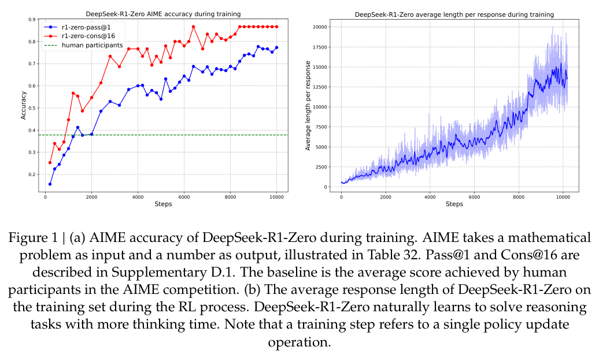

- **Efecto.** En AIME, un examen de matemática de competencia con respuestas numéricas, pasa de 15,6% a 77,9%, y las respuestas crecen de cientos a miles de tokens.
- **Fuente.** [DeepSeek-AI, 2025](https://arxiv.org/abs/2501.12948)

### Sources

- `deepseek-2025-r1.pdf.md`: R1-Zero desde DeepSeek-V3-Base con GRPO, sin SFT previo; "The reward signal is solely based on the correctness of final predictions against ground-truth answers"; Reward_rule = Reward_acc + Reward_format; 16 salidas por pregunta; A_i = (r_i − media) / desvío del grupo; "neural reward models are susceptible to reward hacking during large-scale reinforcement learning"; AIME 2024 pass@1 "from an initial 15.6% to 77.9%"; Figura 1 ("AIME takes a mathematical problem as input and a number as output"); R1 final: "1 + 1 =?" con menos de 100 tokens, más de 18.000 en los problemas más difíciles; salto del largo en el paso 8.200 al pasar de 32.768 a 65.536 tokens máximos.

### Speaker notes

Recompensa: exactitud (la respuesta coincide con la de referencia o el código pasa los tests) más formato (razonamiento entre `<think>` y `</think>`). GRPO (Group Relative Policy Optimization) muestrea 16 respuestas por problema y compara cada una con el promedio de su grupo, como en el diagrama de la 4.1. Es la base de todo el entrenamiento de razonamiento. R1-Zero se saltea el SFT y arranca el RL directo del modelo base. El ingrediente son problemas con respuesta verificable (matemática, código), el dominio donde también funcionan los datos sintéticos. No hay reward model neuronal porque el modelo puede engañarlo (reward hacking). Una regla que compara con la respuesta correcta no se deja engañar. GRPO es PPO sin modelo de valor. En el gráfico, el largo sube solo porque pensar más da más recompensa. El modelo final ya adapta el esfuerzo: menos de 100 tokens para "1 + 1" y más de 18.000 en lo más difícil. Tiempo objetivo: ~2 min.

---

# 5. Herramientas

**Goal of this section:** Mostrar las piezas de una plataforma que expone un LLM por API (tu aplicación, la API, la plantilla de chat, el modelo, el parser de llamadas y las herramientas nativas) y el circuito entre el modelo y el agente, y después recorrer tres herramientas con la misma pregunta: qué genera el modelo, quién ejecuta la llamada y con qué datos se lo entrenó. La calculadora: por qué un LLM calcula mal, cómo escribe hoy la llamada Llama 3.1 con sus tokens especiales, cómo el servidor la traduce a JSON y cómo se ve esa misma cuenta por la API de Ollama. La búsqueda web: cómo se entrena, la fecha de corte, la consulta que escribe Llama 3.1 y la respuesta de una API donde la búsqueda la ejecuta la plataforma. MCP: host, cliente y servidor, una herramienta como definición en el contexto y el function calling genérico que se entrena. Quince láminas: el mapa de la plataforma, el circuito con un agente y su intercambio con la API, un mapa de tres problemas (calcular, buscar, MCP) y varias láminas para cada uno.

---

## 1. Las piezas de una plataforma

### Content

**Cuando usás un LLM por API, el modelo está en el medio y nunca ejecuta nada. Alrededor hay piezas que traducen el JSON a texto con tags y de vuelta, y dos lugares donde corre una herramienta: tu aplicación o la plataforma.**


<!-- ascii-source:
 TU APLICACIÓN (tu agente)
 +--------------------------------------------------------------------------------+
 | arma el pedido: mensajes + definición de las herramientas                      |
 | ejecuta TUS herramientas: funciones, base de datos, servidores MCP             |
 +--------------------------------------------------------------------------------+
          |  JSON: messages + tools                     ^  JSON: tool_calls o texto
          v                                             |
 PLATAFORMA: un proveedor, o vLLM / Ollama en tu máquina
 +--------------------------------------------------------------------------------+
 |  +--------------------------------------------------------------------------+  |
 |  |                          API: entra y sale JSON                          |  |
 |  +--------------------------------------------------------------------------+  |
 |          |                                              ^                      |
 |          v                                              |                      |
 |  +----------------------+                    +----------------------+          |
 |  | PLANTILLA DE CHAT    |                    | PARSER DE LLAMADAS   |          |
 |  | JSON -> texto con    |                    | texto del modelo ->  |          |
 |  | tags (ida)           |                    | tool_calls (vuelta)  |          |
 |  +----------------------+                    +----------------------+          |
 |          |                                              ^                      |
 |          v                                              |                      |
 |  +--------------------------------------------------------------------------+  |
 |  | MODELO: lee y escribe texto con tags; escribe la llamada, no la ejecuta  |  |
 |  +--------------------------------------------------------------------------+  |
 |                                     |    ^                                     |
 |                                     v    |                                     |
 |  +--------------------------------------------------------------------------+  |
 |  | HERRAMIENTAS NATIVAS (solo proveedores): búsqueda web, ejecución de      |  |
 |  | código. Las ejecuta la plataforma y agrega el resultado                  |  |
 |  +--------------------------------------------------------------------------+  |
 +--------------------------------------------------------------------------------+
-->
<!-- ascii-note:
intent: el mapa de las piezas que intervienen cuando se usa un LLM por API, para que cada lámina siguiente de la sección sea un zoom sobre una pieza
emphasize: el MODELO en el medio con "no la ejecuta"; los dos lugares donde corre una herramienta (TU APLICACIÓN arriba y HERRAMIENTAS NATIVAS abajo) con acento rojo; la plantilla de chat (ida) y el parser (vuelta) como los dos traductores, uno bajando y otro subiendo
labels: TU APLICACIÓN fuera de la caja PLATAFORMA; la PLATAFORMA como un contenedor con sus cuatro piezas apiladas; flechas de ida a la izquierda y de vuelta a la derecha
-->

- **Plantilla de chat.** Convierte los mensajes y las definiciones de herramientas en el texto con tags que el modelo vio al entrenarse. El modelo ve la definición de cada herramienta, nunca su código.
- **Parser de llamadas.** Lee el texto que escribe el modelo y extrae las llamadas como `tool_calls`. Hay uno por familia de modelos (`llama3_json`, `hermes`, `mistral`), y a veces los argumentos llegan mal formados.
- **Tus herramientas.** Las ejecuta tu aplicación: la API devuelve la llamada y espera el resultado.
- **Herramientas nativas.** La búsqueda web y la ejecución de código las ejecuta la plataforma del proveedor, dentro del mismo pedido.
- **Fuente.** [vLLM, docs de tool calling](https://docs.vllm.ai/en/latest/features/tool_calling/) · [Hugging Face, chat templates con herramientas](https://huggingface.co/docs/transformers/main/en/chat_template_tools_and_documents) · [Anthropic, docs de tool use](https://platform.claude.com/docs/en/agents-and-tools/tool-use/overview) · [OpenAI, herramientas para agentes](https://openai.com/index/new-tools-for-building-agents/)

### Sources

- `vllm-tool-calling.web.md` (verbatim): `--chat-template` ("Jinja template that renders messages (including `tool`-role messages and assistant messages with earlier tool calls) into the prompt") y `--tool-call-parser` (código por familia de modelos que lee el texto generado y extrae las llamadas; nombres `llama3_json` para Llama 3.1, 3.2 y 4, `hermes`, `mistral`, `pythonic`, entre otros); "vLLM extracts tool calls from raw text, so arguments may occasionally be malformed or violate the function's parameter schema"; "it's the caller's responsibility to: 1. Define appropriate tools in the request 2. Include relevant context in the chat messages 3. Handle the tool calls in your application logic". La respuesta llega con la forma de OpenAI (`message.tool_calls[0].function`, con `arguments` como string JSON).
- `hf-chat-templates-tools.web.md` (verbatim): "Each function you pass to the `tools` argument of `apply_chat_template` is converted into a JSON schema. These schemas are then passed to the model chat template. In other words, tool-use models do not see your functions directly, and they never see the actual code inside them."; "It is up to you to read their outputs, detect if they have requested to use a tool, pass their arguments to the tool function, and return the response in the chat." Sin servidor, el parser lo escribe tu código.
- `anthropic-tool-use-overview.web.md` (verbatim): "Tools differ primarily by where the code executes. **Client tools** … run in your application. … **Server tools** (such as `web_search`, `web_fetch`, `code_execution`, and `tool_search`) run on Anthropic's infrastructure".
- `openai-new-tools-for-agents.web.md`: la Responses API trae herramientas incorporadas (web search, file search, computer use); web search "can be paired with other tools or function calls". Excepción [verified]: computer use "captures mouse and keyboard actions generated by the model, making it possible for developers to automate computer use tasks by directly translating these actions into executable commands within their environments", es decir, esas acciones las ejecuta el desarrollador. Por eso la lámina nombra solo la búsqueda web y la ejecución de código, sin decir que todas las incorporadas las ejecuta la plataforma.
- Ollama (`ollama-tool-calling.web.md`) como plataforma en tu máquina: API con `tools` y `tool_calls`; no documenta cómo aplica la plantilla de cada modelo, así que la analogía con vLLM es nuestra.
- Lámina agregada por pedido del presentador (2026-09-27): "antes de mostrar las herramientas, tal vez convendría mostrar cuáles son los componentes en una plataforma para exponer por API. Existe un conversor a JSON, existen herramientas que están 'nativas' como la búsqueda. Creo que este diagrama sería buena introducción y se pueden eliminar repetidos." El diagrama se verificó contra vLLM, Hugging Face y OpenAI: el "conversor" son dos piezas, la plantilla de chat y el parser. Reemplaza a "Por qué herramientas" y "Buscar: las capas" (en Cut material del borrador).

### Speaker notes

Es el mapa de toda la sección: cada lámina que sigue es un zoom sobre una de estas piezas. Arriba está tu aplicación, que arma el pedido en JSON y ejecuta tus herramientas. Abajo está la plataforma, que puede ser un proveedor como OpenAI o Anthropic, o un servidor como vLLM u Ollama que corre en tu máquina. La API recibe JSON; la plantilla de chat lo convierte en el texto con tags especiales que el modelo vio en su entrenamiento; el modelo escribe; el parser lee ese texto y, si hay una llamada, la devuelve como tool_calls. En vLLM son dos opciones del servidor: --chat-template y --tool-call-parser. Si usás el modelo directo con la librería de Hugging Face, sin servidor, ese parser lo escribís vos. El parser también puede fallar, porque el modelo escribe texto y convertirlo en JSON no está garantizado.

El modelo está en el medio y nunca ejecuta nada. Una herramienta corre en uno de dos lugares: en tu aplicación, o en la plataforma cuando es nativa, como la búsqueda web o la ejecución de código. No todas las incorporadas funcionan así. Con computer use de OpenAI, el modelo propone las acciones y las ejecuta el desarrollador en su entorno.

Dónde reaparece cada pieza: tu aplicación, en el circuito y en el intercambio con la API; la plantilla y el parser, en "de los tokens al JSON"; el modelo, en lo que escribe Llama 3.1; las herramientas nativas, en la respuesta de la API con búsqueda.

---

## 2. El circuito con un agente

### Content

**Escribís en un chat. El chat es el agente: le manda el texto al LLM, ejecuta las herramientas que el LLM pide y le devuelve los resultados, hasta que el LLM responde.**

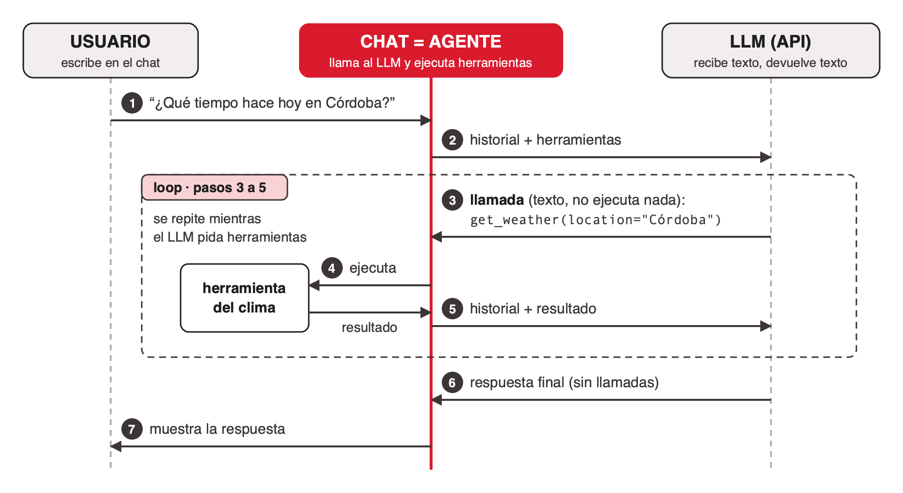
<!-- ascii-source:
 USUARIO                   CHAT = AGENTE                          LLM (API)
    |                              |                                  |
    | 1 "¿Qué tiempo hace          |                                  |
    |    hoy en Córdoba?"          |                                  |
    | ---------------------------&gt; | 2 historial + herramientas       |
    |                              | -------------------------------&gt; |
    |                              |                                  |
    |                              | 3 llamada:                       |
    |                              |   get_weather(location="Córdoba")|
    |                              | <------------------------------- |
    |                              |                                  |
    |          4 ejecuta           |                                  |
    |    [ herramienta ] <---------+                                  |
    |    [  del clima  ] ---------&gt;| 5 historial + resultado          |
    |          resultado           | -------------------------------&gt; |
    |                              |                                  |
    |                              | 6 respuesta final (sin llamadas) |
    |                              | <------------------------------- |
    | 7 muestra la respuesta       |                                  |
    | <--------------------------- |                                  |
    |                              |                                  |
          (los pasos 3 a 5 se repiten mientras el LLM pida herramientas)
-->
<!-- ascii-note:
intent: el circuito visto desde el usuario: el texto entra a un chat, y el chat es el agente que llama al LLM y ejecuta las herramientas
emphasize: el chat/agente en el centro como orquestador; el LLM solo recibe texto y devuelve texto (una llamada o la respuesta); la herramienta la ejecuta el agente; el loop de los pasos 3 a 5
labels: tres columnas (usuario, chat = agente, LLM) como diagrama de secuencia con flechas numeradas 1 a 7; la herramienta como caja debajo del agente
-->

- **Qué hace el modelo.** Genera la llamada (nombre de la herramienta y argumentos) y decide cuándo llamar y cuándo responder. Es la parte que se entrena.
- **Qué hace el agente (el chat).** Ejecuta la herramienta, agrega el resultado como un mensaje con rol "tool" y vuelve a llamar al modelo. Corta cuando el modelo responde sin llamadas.
- **Cuántas vueltas.** En tareas de varios pasos (buscar, leer, volver a buscar), el loop da varias vueltas antes de la respuesta final.
- **Fuente.** [Lambert, RLHF Book, cap. 13](https://rlhfbook.com/c/13-tools) · [Nakano et al., 2021](https://arxiv.org/abs/2112.09332)

### Sources

- `lambert-rlhfbook-tool-use.web.md`: "Tool use: the model emits a structured request (tool name and arguments); an orchestrator executes the tool; results are appended to the context; the model continues generating"; "the language model is interleaving tool inputs and outputs with standard autoregressively generated tokens"; loop de orquestación (verbatim): `while True: response = model(messages, tools=tools)`, `if not response.tool_calls: return response.text`, `result = execute_tool(call.name, call.args)`, `messages.append({"role": "tool", "tool_call_id": call.id, "content": result})`; esquema MCP de `get_weather` ("Get current weather for a location"); MCP es "an open standard for connecting language models to external data sources and information systems"; ReAct, "to generate both reasoning traces and task-specific actions in an interleaved manner".
- Ejemplo: el nombre `get_weather` sale del esquema MCP de Lambert; la ciudad (Córdoba) es nuestra.
- `nakano-2021-webgpt.pdf.md`: el modelo "receives a written summary of the environment state and emits one command per step"; la navegación termina con "an end command, max actions, or max total reference length"; Tabla 1: "If a model generates any other text, it is considered to be an invalid action."

### Speaker notes

Es la pieza de arriba del mapa anterior, tu aplicación, vista en el tiempo. Callback a la clase de RAG y MCP: allá armaron este loop del lado del agente, con ReAct. El resto de la sección se ocupa del lado del modelo: por qué emite una llamada bien formada y sabe cuándo dejar de llamar. Si la llamada sale mal escrita, el loop se rompe, porque cualquier texto que no sea una llamada válida cuenta como acción inválida. El agente también pone límites propios, como un máximo de vueltas. Tiempo objetivo: ~2 min.

---

## 3. El intercambio con la API

<!-- design: split-left -->

### Content

**El mismo ejemplo del clima, con lo que viaja en cada paso entre el chat y la API: dos pedidos y dos respuestas.**

```json
// 2 · pedido: historial + herramientas
{"tools": [{"name": "get_weather",
            "input_schema": {"type": "object",
              "properties": {"location": {"type": "string"}},
              "required": ["location"]}}],
 "messages": [{"role": "user",
               "content": "¿Qué tiempo hace hoy en Córdoba?"}]}

// 3 · respuesta: el LLM pide la herramienta y se detiene
{"stop_reason": "tool_use",
 "content": [{"type": "tool_use", "id": "toolu_01…",
              "name": "get_weather",
              "input": {"location": "Córdoba"}}]}

// 5 · segundo pedido: el chat agrega el resultado
{"role": "user",
 "content": [{"type": "tool_result", "tool_use_id": "toolu_01…",
              "content": "15 °C, parcialmente nublado"}]}

// 6 · respuesta final, sin llamadas
{"stop_reason": "end_turn",
 "content": [{"type": "text",
              "text": "Hoy en Córdoba hay 15 °C y está parcialmente nublado."}]}
```

- **2 · Pedido.** El chat manda el historial y la definición de cada herramienta: nombre, descripción y esquema de los argumentos.
- **3 · Respuesta con llamada.** `stop_reason: "tool_use"`: el LLM pide `get_weather` con sus argumentos y se detiene.
- **5 · Resultado.** El chat ejecuta la herramienta y agrega un `tool_result` con el mismo `id` de la llamada.
- **6 · Respuesta final.** Sin llamadas: el chat se la muestra al usuario.
- **Fuente.** [Anthropic, docs de tool use](https://platform.claude.com/docs/en/agents-and-tools/tool-use/overview)

### Sources

- `anthropic-tool-use-overview.web.md` (ejemplo "Client-tool round trip", verbatim): "The first request defines a `get_weather` tool, and Claude answers the question by calling it: the response carries a `tool_use` block, your code runs the lookup, and a second request sends the result back in a `tool_result` block so Claude can reply with the answer."; herramienta con `input_schema` (`location` requerido); `"stop_reason": "tool_use"`; `{"type": "tool_result", "tool_use_id": tool_use.id, "content": weather}` con `weather = "15 degrees Celsius, partly cloudy"`. El JSON de la lámina está adaptado del ejemplo (Córdoba en lugar de San Francisco; sin `description` ni `model` para que entre; el `id` acortado).
- `anthropic-web-search-tool.web.md`: `"stop_reason": "end_turn"` en la respuesta final.
- Lámina agregada por pedido del presentador (2026-09-27): "agregar después de El circuito con un agente, a la izquierda, cómo sería para el ejemplo el request y response de la API para poder mostrar el exchange".

### Speaker notes

Es el diagrama anterior en JSON. Recorrer los cuatro bloques con los números de la lámina anterior: el pedido lleva el historial y las herramientas; la respuesta trae un bloque tool_use, sin texto, y el motivo de corte es tool_use; el chat ejecuta, y en el segundo pedido manda el resultado con el mismo id; la respuesta final corta con end_turn. Marcar que el LLM solo escribe la llamada y nunca la ejecuta. El formato es el de la API de Anthropic; otros proveedores usan nombres distintos para lo mismo. Tiempo objetivo: ~2 min.

---

## 4. Tres problemas, tres herramientas

### Content

**Tres cosas que los pesos del modelo no resuelven solos, y la herramienta que se entrena para cada una.**

- **Calcular.** El modelo se equivoca en cuentas de varios pasos. Una calculadora las hace exactas.
- **Buscar.** El modelo no sabe lo que pasó después de su fecha de corte. La búsqueda web trae datos actuales.
- **MCP.** Cada sistema tiene su propia API. MCP es una interfaz común para conectar cualquier herramienta.
- **Fuente.** [Schick et al., 2023](https://arxiv.org/abs/2302.04761) · [Nakano et al., 2021](https://arxiv.org/abs/2112.09332) · [MCP, docs de arquitectura](https://modelcontextprotocol.io/docs/learn/architecture)

### Sources

- `schick-2023-toolformer.pdf.md`: los LMs "struggle with basic functionality, such as arithmetic or factual lookup"; herramientas: calculadora, búsqueda, etc.
- `nakano-2021-webgpt.pdf.md`: un modelo que navega con comandos de texto para responder con información actual y citas.
- `mcp-architecture.web.md`: MCP como protocolo para conectar aplicaciones de IA con herramientas y datos (host, cliente, servidor).
- Lámina agregada por pedido del presentador (2026-09-27): "meter un slide que diga 3 problemas a ver: 1) calcular, 2) buscar, 3) MCP, y luego los títulos de las secciones muestran estos ejemplos".

### Speaker notes

Son las tres razones para usar herramientas: precisión (calcular), datos actuales (buscar) y acciones sobre otros sistemas (MCP). Un modelo base no sabe emitir una llamada hasta que lo entrenan para eso. Esta lámina es el mapa del resto de la sección. Para cada problema vamos a ver lo mismo: qué genera el modelo, quién ejecuta la llamada y con qué datos se lo entrenó. Los títulos de las láminas que siguen empiezan con el problema: Calcular, Buscar, MCP. Tiempo objetivo: ~1 min.

---

## 5. Calcular: el modelo no calcula bien

### Content

**Un LLM genera texto por probabilidad, token por token. En una cuenta de varios pasos, un error de cálculo arrastra al resto de la solución.**

- **Errores de cálculo.** En GSM8K, un dataset de problemas de matemática escolar, los modelos de OpenAI fallaban seguido en las cuentas. Los más grandes se equivocaban menos, pero el error seguía siendo común.
- **Sin vuelta atrás.** Un modelo autoregresivo no tiene cómo corregir un error propio. Una solución que se desvía queda irrecuperable.
- **Lo básico falla.** Los LLM resuelven tareas nuevas con pocos ejemplos y a la vez fallan en aritmética, donde modelos mucho más chicos y simples andan bien.
- **Fuente.** [Cobbe et al., 2021](https://arxiv.org/abs/2110.14168) · [Schick et al., 2023](https://arxiv.org/abs/2302.04761)

### Sources

- `cobbe-2021-gsm8k-verifiers.pdf.md` (§4, verbatim): "Our models frequently fail to accurately perform calculations. Although larger models make fewer arithmetic mistakes than smaller models, this remains a common source of errors. To mitigate this issue, we train all models to use a calculator by injecting calculation annotations into the training set." (§1, verbatim): "When generating a solution, autoregressive models have no mechanism to correct their own errors. Solutions that veer off-course quickly become unrecoverable."; "Model samples frequently contain catastrophic mistakes, even after the model has been appropriately finetuned."; §4.1: extrapolación a "a model with 10^16 parameters" para 80% de aciertos con fine-tuning.
- `schick-2023-toolformer.pdf.md` (abstract, verbatim): LMs "exhibit remarkable abilities to solve new tasks from just a few examples or textual instructions, especially at scale. They also, paradoxically, struggle with basic functionality, such as arithmetic or factual lookup, where much simpler and smaller models excel."
- `lambert-rlhfbook-tool-use.web.md`: code execution "lets language models get around their probabilistic, generative nature and return precise answers".

### Speaker notes

Es la primera pregunta de la calculadora: ¿para qué hace falta? GSM8K es un dataset de OpenAI (2021) con unos 8.500 problemas de matemática escolar. Aun en problemas de primaria como esos, el modelo se equivoca en las cuentas, y un error en un paso arrastra al resto. El dato que conviene decir en voz alta: extrapolando la tendencia, los autores calculan que con fine-tuning solo haría falta un modelo de 10^16 parámetros para resolver el 80% de GSM8K. Su respuesta fue darle una calculadora al modelo (y verificadores, que no entran en esta clase); la lámina siguiente muestra cómo lo hace hoy Llama 3.1. El corpus no explica el error aritmético por la forma en que el tokenizer parte los números; si alguien lo pregunta, es una hipótesis que la clase no cubre. Tiempo objetivo: ~1,5 min.

---

## 6. Calcular: lo que escribe Llama 3.1

<!-- design: split-left -->

### Content

**Llama 3.1 trae una calculadora incorporada, Wolfram Alpha. El modelo escribe la llamada con tokens especiales, se detiene y sigue cuando le devuelven el resultado.**

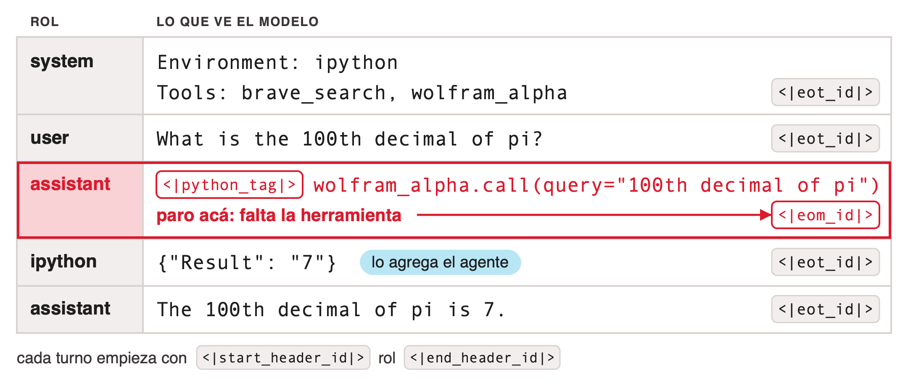
<!-- ascii-source:
 ROL         LO QUE VE EL MODELO
 +-----------+------------------------------------------------------------------+
 | system    | Environment: ipython                                             |
 |           | Tools: brave_search, wolfram_alpha                     <|eot_id|> |
 +-----------+------------------------------------------------------------------+
 | user      | What is the 100th decimal of pi?                       <|eot_id|> |
 +-----------+------------------------------------------------------------------+
 | assistant | <|python_tag|> wolfram_alpha.call(query="100th decimal of pi")   |
 |           |                                                        <|eom_id|> |  <- paro acá:
 |           |                                                                  |     falta la herramienta
 +-----------+------------------------------------------------------------------+
 | ipython   | {"Result": "7"}                                        <|eot_id|> |  <- lo agrega el agente
 +-----------+------------------------------------------------------------------+
 | assistant | The 100th decimal of pi is 7.                          <|eot_id|> |
 +-----------+------------------------------------------------------------------+
   cada turno empieza con <|start_header_id|> rol <|end_header_id|>
-->
<!-- ascii-note:
intent: la conversación de Llama 3.1 con una llamada a Wolfram Alpha, turno por turno, tal como la ve el modelo
emphasize: el turno del assistant que llama a la herramienta (<|python_tag|> … <|eom_id|>) en rojo con su anotación "paro acá: falta la herramienta"; el turno ipython anotado como agregado por el agente
labels: columna de rol a la izquierda (system, user, assistant, ipython, assistant); tokens especiales como chips grises chicos; texto de los turnos en monoespaciado; la nota del start_header_id al pie en gris
-->

- **Lo que escribe el modelo.** `<|python_tag|>` abre la llamada y `<|eom_id|>` la cierra: "paro acá, falta el resultado de la herramienta".
- **Quién la ejecuta.** El agente, que es el código que corre el modelo, llama a Wolfram Alpha y agrega la respuesta con el rol `ipython`.
- **Cómo lo aprendió.** En el post-training, con conversaciones escritas en este formato; lo que devuelve la herramienta no cuenta en la pérdida.
- **Fuente.** [Meta, formato de prompt de Llama 3.1](https://github.com/meta-llama/llama-models/blob/main/models/llama3_1/prompt_format.md) · [Lambert, RLHF Book, cap. 13](https://rlhfbook.com/c/13-tools)

### Sources

- `meta-llama3-1-prompt-format.web.md` (verbatim): "The three built-in tools (brave_search, wolfram_alpha, and code interpreter) can be turned on using the system prompt"; "Wolfram Alpha: Tool call to perform complex mathematical calculations."; ejemplo completo "What is the 100th decimal of pi?" con `<|python_tag|>wolfram_alpha.call(query="100th decimal of pi")<|eom_id|>`, respuesta con rol `ipython` y "The 100th decimal of pi is 7.<|eot_id|>"; "Note the `<|python_tag|>` in the assistant response."; "Role is `ipython` for the wolfram alpha response that is passed back to the model."; `<|eom_id|>` marca un posible punto de parada para ejecutar una herramienta. El bloque de la lámina acorta el JSON de Wolfram Alpha (`{ … "Result": "7" … }`) y omite `<|begin_of_text|>`.
- `lambert-rlhfbook-tool-use.web.md`: los tokens de la salida de la herramienta se enmascaran en la pérdida; el uso de herramientas se entrena en el post-training.
- Lámina agregada por pedido del presentador (2026-09-27): "Me gustaría que no bajemos tanto al paper, sino que esto sea reemplazado por un ejemplo de cómo hace hoy Llama o algún modelo open source. Y cómo esto se ve en la interacción con la API." Reemplaza a "Calcular: quién hace la cuenta" (en Cut material del borrador).

### Speaker notes

Llama 3.1, de Meta, trae tres herramientas incorporadas, y una es Wolfram Alpha para cálculos. Recorrer la secuencia de arriba abajo: el sistema activa las herramientas, el usuario pregunta y el modelo, en vez del número, escribe una llamada que empieza en python_tag y termina en eom_id. Ese token le dice al código que lo corre: paro acá, ejecutá la herramienta. El código llama a Wolfram Alpha, pega la respuesta con el rol ipython, y el modelo sigue hasta terminar con eot_id. El modelo aprendió a escribir este formato en su post-training. La lámina siguiente muestra cómo esos tokens se convierten en el JSON de la API. Tiempo objetivo: ~2 min.

---

## 7. Calcular: de los tokens al JSON

### Content

**El modelo escribe la llamada como texto entre tags especiales. El servidor la traduce al JSON que recibe tu código, y traduce el resultado de vuelta a un turno que el modelo sabe leer.**

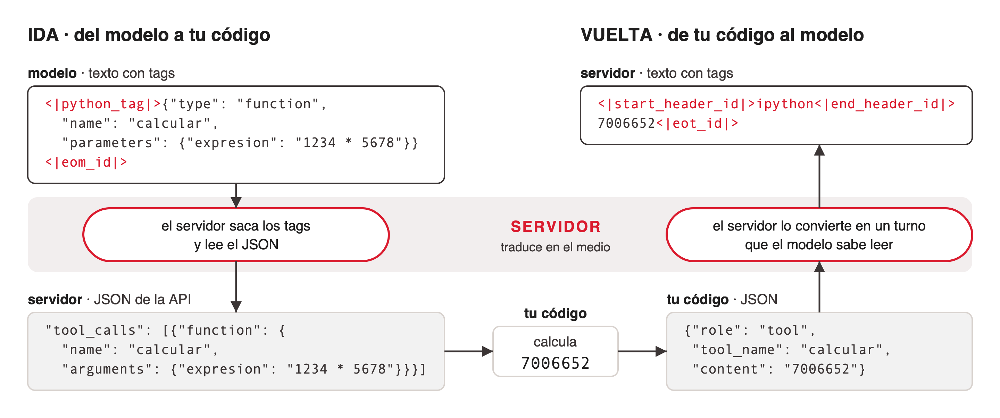
<!-- ascii-source:
 IDA: DEL MODELO A TU CÓDIGO                    VUELTA: DE TU CÓDIGO AL MODELO

 lo que escribe el modelo (texto)               lo que manda tu código (JSON)
 +------------------------------------------+   +------------------------------------------+
 | <|python_tag|>{"type": "function",       |   | {"role": "tool",                         |
 |   "name": "calcular",                    |   |  "tool_name": "calcular",                |
 |   "parameters":                          |   |  "content": "7006652"}                   |
 |     {"expresion": "1234 * 5678"}}        |   +------------------------------------------+
 | <|eom_id|>                               |                       |
 +------------------------------------------+                       v
                     |                              el servidor lo convierte en un turno
                     v                              que el modelo sabe leer
    el servidor saca los tags y lee el JSON                         |
                     |                                              v
                     v                          +------------------------------------------+
 lo que recibe tu código (JSON de la API)       | <|start_header_id|>ipython<|end_header_id|>|
 +------------------------------------------+   | 7006652<|eot_id|>                         |
 | "tool_calls": [{"function": {            |   +------------------------------------------+
 |   "name": "calcular",                    |
 |   "arguments":                           |
 |     {"expresion": "1234 * 5678"}}}]      |
 +------------------------------------------+
                     |
                     v
          tu código calcula: 7006652  ------------------------&gt; (vuelta)
-->
<!-- ascii-note:
intent: la traducción entre los tokens que escribe el modelo y el JSON de la API, en las dos direcciones, con la misma cuenta de la calculadora
emphasize: los tags especiales (<|python_tag|>, <|eom_id|>, ipython) en rojo del lado del modelo; el JSON del lado de la API en gris; las flechas "el servidor convierte" como el punto de la lámina
labels: dos columnas IDA (modelo -> código) y VUELTA (código -> modelo); arriba de cada caja quién la produce (modelo / servidor / tu código)
-->

- **Fuente.** [Meta, formato de prompt de Llama 3.1](https://github.com/meta-llama/llama-models/blob/main/models/llama3_1/prompt_format.md) · [Ollama, docs de tool calling](https://docs.ollama.com/capabilities/tool-calling)

### Sources

- `meta-llama3-1-prompt-format.web.md` (sección "JSON based tool calling", verbatim): "Llama models can now output custom tool calls from a single message to allow easier tool calling."; "It's important to note that the model itself does not execute the calls; it provides structured output to facilitate calling by an executor."; respuesta del modelo `<|python_tag|>{"type": "function", "name": "trending_songs", "parameters": {"n": "10", "genre": "all"}}<|eom_id|>`; "Model responds with `<|python_tag|>` and `<|eom_id|>` as `Environment: ipython` was in the system prompt"; rol `ipython` para lo que vuelve de la herramienta ("Semantically, this role means 'tool'"). La lámina adapta el ejemplo a la herramienta `calcular` de la lámina siguiente.
- `ollama-tool-calling.web.md`: `tool_calls` con `function.name` y `function.arguments`; resultado devuelto como `{"role": "tool", "tool_name": …, "content": …}`.
- `vllm-tool-calling.web.md` y `hf-chat-templates-tools.web.md`: la traducción en las dos direcciones son dos piezas del servidor. A la ida, la plantilla de chat (`--chat-template` en vLLM) renderiza los mensajes, incluidos los de rol `tool`, en el prompt con el formato del modelo. A la vuelta, el parser (`--tool-call-parser llama3_json` para Llama 3.1) extrae las llamadas del texto generado y las entrega como `tool_calls`. Que Ollama haga lo mismo por dentro es analogía nuestra: su documentación no describe cómo mapea `tools` a los tokens de cada modelo. Llama escribe `parameters`; la API entrega `arguments`.
- Lámina agregada por pedido del presentador (2026-09-27): "Agregá un slide anterior que muestre cómo de los tags existe una transformación a JSON, como ejemplo que muestre este cambio. Y completá lo que falta."

### Speaker notes

Esta lámina conecta la anterior, que muestra lo que ve el modelo, con la siguiente, que muestra lo que ve tu código. Ida: el modelo escribe la llamada como JSON entre python_tag y eom_id; el servidor saca los tags, lee el JSON y te lo entrega como tool_calls. Vuelta: tu código manda el resultado como un mensaje con rol tool, y el servidor lo convierte en un turno ipython, que es el formato que el modelo vio en su entrenamiento. El modelo nunca ve JSON de la API ni tu código ve los tags. El servidor traduce en el medio con las dos piezas del mapa de la 5.1, la plantilla de chat a la ida y el parser a la vuelta. Tiempo objetivo: ~2 min.

---

## 8. Calcular: la misma cuenta por la API

<!-- design: split-left -->

### Content

**Con un modelo abierto servido con Ollama, la API esconde los tokens especiales: la llamada llega como JSON y el resultado vuelve como un mensaje con rol "tool".**

```json
// 1 · pedido: la pregunta y la herramienta
{"model": "llama3.1",
 "messages": [{"role": "user", "content": "¿Cuánto es 1234 × 5678?"}],
 "tools": [{"type": "function", "function": {
     "name": "calcular",
     "description": "Evalúa una expresión aritmética",
     "parameters": {"type": "object", "required": ["expresion"],
       "properties": {"expresion": {"type": "string"}}}}}]}

// 2 · respuesta: el modelo pide la herramienta
{"message": {"role": "assistant",
  "tool_calls": [{"function": {"name": "calcular",
      "arguments": {"expresion": "1234 * 5678"}}}]}}

// 3 · segundo pedido: tu código agrega el resultado
{"role": "tool", "tool_name": "calcular", "content": "7006652"}

// 4 · respuesta final
{"message": {"role": "assistant", "content": "1234 × 5678 = 7.006.652"}}
```

- **Lo que ve tu código.** `tool_calls` con el nombre y los argumentos; después, un mensaje `tool` con el resultado.
- **Lo que pasa por debajo.** El modelo escribe la llamada entre tags especiales y el servidor la traduce a este JSON, como en la lámina anterior.
- **Quién calcula.** Tu código: la API te devuelve la llamada y espera, igual que en la lámina 5.3.
- **Fuente.** [Ollama, docs de tool calling](https://docs.ollama.com/capabilities/tool-calling) · [Meta, formato de prompt de Llama 3.1](https://github.com/meta-llama/llama-models/blob/main/models/llama3_1/prompt_format.md)

### Sources

- `ollama-tool-calling.web.md` (verbatim): pedido a `/api/chat` con `"tools": [{"type": "function", "function": {"name": "get_temperature", "description": …, "parameters": {"type": "object", "required": ["city"], …}}}]`; respuesta con `"tool_calls": [{"type": "function", "function": {"name": "get_temperature", "arguments": {"city": "New York"}}}]`; resultado devuelto como `{"role": "tool", "tool_name": "get_temperature", "content": "22°C"}`. El JSON de la lámina adapta ese ejemplo a una herramienta de calculadora (`calcular`, `expresion`), con el modelo `llama3.1`; la cuenta: 1234 × 5678 = 7.006.652. La página no imprime el cuerpo crudo de la respuesta de `/api/chat`: la forma `{"message": {"role": "assistant", "tool_calls": […]}}` sale del acceso del SDK (`response.message.tool_calls`) y de la forma de `tool_calls` en el pedido de seguimiento. Los ejemplos de Ollama usan `qwen3`; el modelo `llama3.1` es una adaptación.
- "Lo que pasa por debajo": la plantilla de chat y el parser de llamadas, documentados en `vllm-tool-calling.web.md`; para Ollama es analogía (su documentación no describe la conversión).
- Lámina agregada por pedido del presentador (2026-09-27), ver lámina anterior.

### Speaker notes

La misma idea, vista desde el código de la clase. El pedido lleva la pregunta y la definición de la herramienta; la respuesta trae tool_calls con el nombre y los argumentos, sin texto; tu código calcula y manda el resultado con el rol tool; el modelo responde. Los tokens especiales de la lámina anterior no aparecen porque la API los esconde. Es el mismo intercambio que vimos en la 5.3 con otro proveedor y otros nombres de campos. Tiempo objetivo: ~1,5 min.

---

## 9. Buscar: cómo se entrena

### Content

**El modelo aprende a buscar como cualquier otra conducta: primero imita a personas que buscan y después aprende de preferencias sobre las respuestas.**

- **Demostraciones.** Personas buscan, abren resultados y responden citando las fuentes; el modelo aprende a imitar esos pasos con SFT (Supervised Fine-Tuning).
- **Preferencias.** Personas comparan respuestas con sus citas, y un reward model aprende cuáles prefieren.
- **Nativa.** En los chats actuales la búsqueda viene de fábrica: el proveedor define la herramienta y la ejecuta en su plataforma, y el modelo decide solo cuándo buscar.
- **Fuente.** [Nakano et al., 2021](https://arxiv.org/abs/2112.09332) · [Anthropic, docs de web search](https://platform.claude.com/docs/en/agents-and-tools/tool-use/web-search-tool)

### Sources

- `nakano-2021-webgpt.pdf.md`: "A language model pre-trained on natural language would not be able to use our text-based browser, since it does not know the format of valid commands" (por eso demostraciones humanas); ~6.000 demostraciones y ~21.500 comparaciones; behavior cloning (SFT) + reward model entrenado con preferencias.
- `anthropic-web-search-tool.web.md`: "Claude determines when to search based on the prompt. The API runs the searches and provides Claude with the results." La documentación no describe cómo el proveedor entrena a su modelo para su búsqueda: "viene de fábrica" describe la experiencia de uso, no un método publicado.
- Lámina reescrita por pedido del presentador (2026-09-27): "No me interesa ver WebGPT sino solo explicar cómo es que se entrena al modelo para poder buscar en internet. En sí, cómo se entrena y que el search es algo nativo." Reemplaza a "Buscar: cómo se entrenó WebGPT" (en Cut material del borrador).

### Speaker notes

Un modelo recién preentrenado no sabe usar un buscador: no conoce el formato de los comandos. Por eso primero lo entrenan con demostraciones de personas que buscan y responden con citas, y después lo ajustan con preferencias sobre las respuestas, igual que en RLHF. En el chat que usan todos los días, la búsqueda ya viene incluida. El proveedor la definió y la ejecuta, y el modelo aprendió cuándo usarla. Tiempo objetivo: ~1,5 min.

---


## 10. Buscar: el modelo no sabe lo reciente

### Content

**El modelo sabe lo que había en sus datos hasta una fecha de corte. Para lo que pasó después, tiene que buscar.**

- **Fecha de corte.** En el ejemplo de Meta, el system prompt de Llama 3.1 dice "Cutting Knowledge Date: December 2023" y "Today Date: 21 September 2024". El modelo no vio esos nueve meses.
- **La pregunta.** "Search the web for the latest price of 1oz gold". El precio de hoy no está en los pesos del modelo.
- **Sin búsqueda.** El modelo respondería con un precio viejo, o lo inventaría.
- **Fuente.** [Meta, formato de prompt de Llama 3.1](https://github.com/meta-llama/llama-models/blob/main/models/llama3_1/prompt_format.md) · [Lambert, RLHF Book, cap. 13](https://rlhfbook.com/c/13-tools)

### Sources

- `meta-llama3-1-prompt-format.web.md` (ejemplo de brave search, verbatim): system prompt con "Environment: ipython", "Tools: brave_search, wolfram_alpha", "Cutting Knowledge Date: December 2023", "Today Date: 21 September 2024"; pregunta "Search the web for the latest price of 1oz gold?".
- `lambert-rlhfbook-tool-use.web.md`: las herramientas dan acceso a información actual que los pesos no tienen.
- Lámina agregada por pedido del presentador (2026-09-27): "En caso de Buscar web no es claro y tal vez un diagrama que muestre las distintas capas es importante. Me gustaría que sigamos la estructura de explicación de la sección de cálculo para Búsqueda."

### Speaker notes

Es el problema de la búsqueda, igual que la lámina de "no calcula bien" para la calculadora. Todo modelo tiene una fecha de corte, y lo que pasó después no está en sus datos. El ejemplo oficial de Meta lo muestra en el mismo prompt: corte en diciembre de 2023, fecha de hoy en septiembre de 2024, y una pregunta por el precio actual del oro. Sin una herramienta, el modelo contesta con lo que recuerda o inventa. Tiempo objetivo: ~1 min.

---

## 11. Buscar: lo que escribe Llama 3.1

<!-- design: split-left -->

### Content

**Igual que con la calculadora, el modelo escribe la consulta entre tags especiales y se detiene hasta que el agente le devuelve los resultados.**

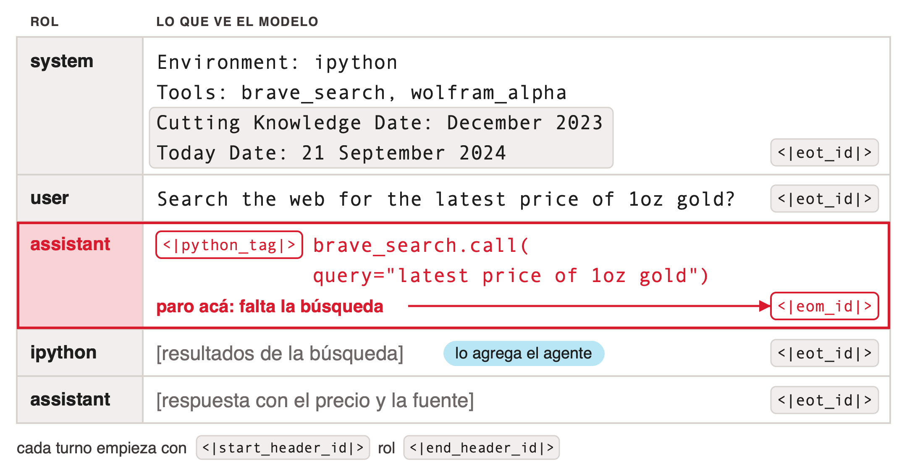
<!-- ascii-source:
 ROL         LO QUE VE EL MODELO
 +-----------+---------------------------------------------------------------------+
 | system    | Environment: ipython                                                |
 |           | Tools: brave_search, wolfram_alpha                                  |
 |           | Cutting Knowledge Date: December 2023                               |
 |           | Today Date: 21 September 2024                           <|eot_id|> |
 +-----------+---------------------------------------------------------------------+
 | user      | Search the web for the latest price of 1oz gold?        <|eot_id|> |
 +-----------+---------------------------------------------------------------------+
 | assistant | <|python_tag|> brave_search.call(query="latest price of 1oz gold") |
 |           |                                                         <|eom_id|> |  <- paro acá:
 |           |                                                                     |     falta la búsqueda
 +-----------+---------------------------------------------------------------------+
 | ipython   | [resultados de la búsqueda]                             <|eot_id|> |  <- lo agrega el agente
 +-----------+---------------------------------------------------------------------+
 | assistant | [respuesta con el precio y la fuente]                   <|eot_id|> |
 +-----------+---------------------------------------------------------------------+
   cada turno empieza con <|start_header_id|> rol <|end_header_id|>
-->
<!-- ascii-note:
intent: la misma conversación que la lámina de Wolfram Alpha, ahora con brave_search: el modelo escribe la consulta, se detiene, el agente agrega los resultados
emphasize: la fecha de corte contra la fecha de hoy en el turno system (acento suave); la llamada <|python_tag|> brave_search.call(...) <|eom_id|> en rojo con "paro acá: falta la búsqueda"; el turno ipython con "lo agrega el agente"
labels: mismo estilo que la lámina de Wolfram Alpha (rol a la izquierda, tokens como chips grises, texto en monoespaciado); los dos turnos entre corchetes son esquemáticos: dibujarlos en gris e itálica
-->

- **Lo que escribe el modelo.** La consulta, no el resultado: `brave_search.call(query="latest price of 1oz gold")`.
- **Quién busca.** El agente: con Llama abierto, tu código llama a Brave Search y agrega los resultados con el rol `ipython`.
- **Cómo lo aprendió.** Con demostraciones de personas buscando y preferencias sobre las respuestas, como en "Buscar: cómo se entrena".
- **Fuente.** [Meta, formato de prompt de Llama 3.1](https://github.com/meta-llama/llama-models/blob/main/models/llama3_1/prompt_format.md)

### Sources

- `meta-llama3-1-prompt-format.web.md` (verbatim): respuesta del modelo "<|python_tag|>brave_search.call(query="latest price of 1oz gold")<|eom_id|>"; "The model tool call response is of the form `tool.call(query="...")` wher tool is `brave_search` or `wolfram_alpha`"; "`<|eom_id|>` … indicates continued multi-step reasoning. That is, the model is expecting a continuation message with the output of the tool call." El documento no muestra los resultados de la búsqueda ni la respuesta final de este ejemplo: en el diagrama esos dos turnos son esquemáticos (entre corchetes).
- Lámina agregada por pedido del presentador (2026-09-27), ver "Buscar: el modelo no sabe lo reciente".

### Speaker notes

Es la misma lámina que la de Wolfram Alpha, con otra herramienta. El system prompt trae la fecha de corte y la de hoy, y el usuario pide un precio actual. En vez de inventar el número, el modelo escribe la consulta entre python_tag y eom_id y se detiene. El agente busca, agrega los resultados con el rol ipython y el modelo responde con el precio y la fuente. Los dos últimos turnos del diagrama están entre corchetes porque el ejemplo de Meta no los muestra. Tiempo objetivo: ~1,5 min.

---

## 12. Buscar: la respuesta de la API

### Content

**El modelo no busca: escribe la consulta. La plataforma del proveedor ejecuta la búsqueda y agrega los resultados, todo dentro de una sola respuesta de la API.**

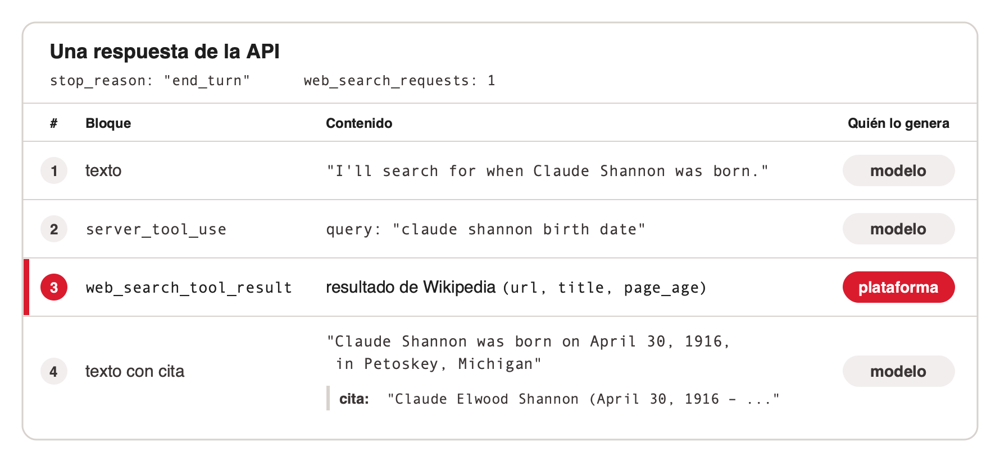
<!-- ascii-source:
 una respuesta de la API  (stop_reason: "end_turn", web_search_requests: 1)

 1  texto                    "I'll search for when Claude Shannon was born."        <- modelo
 2  server_tool_use          query: "claude shannon birth date"                    <- modelo
 3  web_search_tool_result   resultado de Wikipedia (url, title, page_age)          <- plataforma
 4  texto con cita           "Claude Shannon was born on April 30, 1916,           <- modelo
                              in Petoskey, Michigan"
                             cita: "Claude Elwood Shannon (April 30, 1916 – ..."
-->
<!-- ascii-note:
intent: los cuatro bloques de una respuesta con búsqueda web y quién produce cada uno
emphasize: la columna de la derecha (modelo contra plataforma); el bloque 3 es el único que no genera el modelo
labels: server_tool_use, web_search_tool_result, cita
-->

- **Lo que genera el modelo.** La decisión de buscar, la consulta (bloque 2) y la respuesta final con citas (bloque 4).
- **Lo que hace la plataforma.** Ejecuta la búsqueda en la web y agrega los resultados (bloque 3). Tu aplicación no escribe código para eso.
- **Con un modelo abierto.** No hay búsqueda nativa, así que la ejecuta tu código, como en la lámina anterior. El modelo hace lo mismo en los dos casos: escribe la consulta y lee los resultados.
- **Fuente.** [Anthropic, docs de web search](https://platform.claude.com/docs/en/agents-and-tools/tool-use/web-search-tool)

### Sources

- `anthropic-web-search-tool.web.md`: ejemplo de respuesta en cuatro pasos (texto "I'll search for when Claude Shannon was born."; `server_tool_use` con query "claude shannon birth date"; `web_search_tool_result` de Wikipedia; texto "Claude Shannon was born on April 30, 1916, in Petoskey, Michigan" con `cited_text` "Claude Elwood Shannon (April 30, 1916 – February 24, 2001) was an American mathematician…"); `web_search_requests: 1`, `stop_reason: "end_turn"`. "Claude determines when to search based on the prompt."; "Citations are always enabled for web search". Excepciones [verified] en el registro: "The API can pause a long-running search turn" (`pause_turn`, reenviar el mensaje sin cambios); búsqueda en el mismo grupo paralelo que una herramienta del cliente: la API devuelve `stop_reason: "tool_use"` y busca en el pedido siguiente. Busca cuando el pedido "depends on information that is current, changing, or outside its training data"; `max_uses`; "$10 per 1,000 searches". Otros proveedores tienen herramientas parecidas que este corpus no describe.

### Speaker notes

Es el mismo esquema que la calculadora. El modelo escribe la llamada (bloque 2) y otro sistema pone el resultado (bloque 3). Acá el resultado lo agrega la plataforma del proveedor. Es la pieza de abajo del mapa de la 5.1, las herramientas nativas, y por eso desde afuera parece que "el modelo buscó". El ejemplo y el formato de los bloques son de la API de Anthropic. El modelo decide buscar si el pedido depende de información actual o fuera de sus datos de entrenamiento; `max_uses` pone un tope de búsquedas por pedido. Dos excepciones, si alguien pregunta: un turno largo puede pausarse (`pause_turn`) y la aplicación reenvía el mensaje; si la búsqueda sale en paralelo con una herramienta del cliente, la API devuelve `tool_use` y busca en el pedido siguiente. Tiempo objetivo: ~1 min.

---

## 13. MCP: host, cliente y servidor

### Content

**MCP es un estándar abierto para conectar aplicaciones de IA con herramientas y datos. La aplicación crea un cliente MCP por cada servidor y le pasa al modelo las herramientas de todos.**

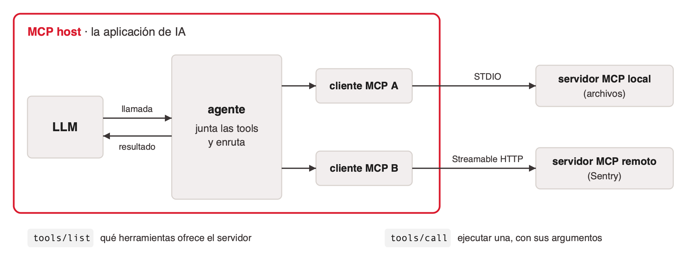
<!-- ascii-source:
 +------------------------- MCP host: la aplicación de IA -------------------------+
 |                                                                                 |
 |  +-------+   llamada    +------------------+     +---------------+              |       +----------------------+
 |  |  LLM  | -----------&gt; | agente           | --&gt; | cliente MCP A | -------------+-----&gt; | servidor MCP local   |
 |  |       | <----------- | junta las tools  |     +---------------+    STDIO     |       | (archivos)           |
 |  +-------+  resultado   | y enruta         |                                   |       +----------------------+
 |                         |                  |     +---------------+              |       +----------------------+
 |                         |                  | --&gt; | cliente MCP B | -------------+-----&gt; | servidor MCP remoto  |
 |                         +------------------+     +---------------+  Streamable  |       | (Sentry)             |
 |                                                                       HTTP      |       +----------------------+
 +---------------------------------------------------------------------------------+

   tools/list: qué herramientas ofrece el servidor        tools/call: ejecutar una, con sus argumentos
-->
<!-- ascii-note:
intent: la arquitectura de MCP; un cliente por servidor dentro del host, y el LLM solo habla con el agente
emphasize: la relación uno a uno entre cliente y servidor, y el borde del host (el LLM nunca habla directo con un servidor)
labels: STDIO (local), Streamable HTTP (remoto), tools/list, tools/call
-->

- **Dos llamadas.** `tools/list` descubre qué herramientas hay; `tools/call` ejecuta una con sus argumentos.
- **Fuente.** [MCP, docs de arquitectura](https://modelcontextprotocol.io/docs/2026-07-28/learn/architecture) · [MCP, introducción](https://modelcontextprotocol.io/docs/2026-07-28/getting-started/intro)

### Sources

- `mcp-architecture.web.md` (versión 2026-07-28, verbatim): "MCP follows a client-server architecture where an MCP host — an AI application like Claude Code or Claude Desktop — establishes connections to one or more MCP servers. The MCP host accomplishes this by creating one MCP client for each MCP server. Each MCP client maintains a dedicated connection with its corresponding MCP server."; "**MCP Host**: The AI application that coordinates and manages one or multiple MCP clients"; "**MCP Client**: A component that maintains a connection to an MCP server and obtains context from an MCP server for the MCP host to use"; "**MCP Server**: A program that provides context to MCP clients"; "Local MCP servers that use the STDIO transport typically serve a single MCP client, whereas remote MCP servers that use the Streamable HTTP transport will typically serve many MCP clients."; ejemplo de Visual Studio Code con el servidor de Sentry y el de archivos locales; "a client can first list all available tools (`tools/list`) and then execute them"; "The AI application fetches available tools from all connected MCP servers and combines them into a unified tool registry that the language model can access."; "When the language model decides to use a tool during a conversation, the AI application intercepts the tool call, routes it to the appropriate MCP server, executes it, and returns the results back to the LLM as part of the conversation flow."
- La versión 2026-07-28 describe MCP como un protocolo sin estado (JSON-RPC 2.0) y no menciona el handshake `initialize` de versiones anteriores (ver Open questions).
- `mcp-intro.web.md` (verbatim): "MCP (Model Context Protocol) is an open-source standard for connecting AI applications to external systems."; "tools (e.g. search engines, calculators)"; "Think of MCP like a USB-C port for AI applications."

### Speaker notes

Callback a la clase de RAG y MCP: allá armaron un servidor MCP y lo conectaron a un agente. El host es la aplicación de IA, como Claude Code o Visual Studio Code, y crea un cliente por cada servidor, con una conexión dedicada. El servidor ofrece herramientas, datos y prompts; corre en la misma computadora (STDIO) o en otra (Streamable HTTP). Acá interesa que el modelo queda fuera del protocolo. El agente del host junta las herramientas de todos los servidores, se las pasa al LLM, intercepta la llamada y la manda al servidor que corresponde. Es el loop de la lámina 5.2. La analogía oficial es un puerto USB-C para aplicaciones de IA. Tiempo objetivo: ~2 min.

---

## 14. MCP: una herramienta es una definición

### Content

**El modelo no conoce de antemano los servidores MCP. El host convierte cada herramienta que publica un servidor en una definición dentro del contexto: nombre, descripción y esquema de entrada.**

Un servidor MCP publica su calculadora en `tools/list`:

```json
{
  "name": "calculator_arithmetic",
  "description": "Perform mathematical calculations including basic arithmetic, trigonometric functions, and algebraic operations",
  "inputSchema": {
    "type": "object",
    "properties": {
      "expression": {
        "type": "string",
        "description": "Mathematical expression to evaluate (e.g., '2 + 3 * 4', 'sin(30)', 'sqrt(16)')"
      }
    },
    "required": ["expression"]
  }
}
```

- **La calculadora, otra vez.** En Llama 3.1 la llamada iba entre tokens especiales (`<|python_tag|>` … `<|eom_id|>`); con MCP la misma calculadora es una función con nombre, descripción y esquema de entrada.
- **Fuente.** [MCP, docs de arquitectura](https://modelcontextprotocol.io/docs/2026-07-28/learn/architecture) · [Meta, formato de prompt de Llama 3.1](https://github.com/meta-llama/llama-models/blob/main/models/llama3_1/prompt_format.md)

### Sources

- `mcp-architecture.web.md`: ejemplo oficial de `tools/list` con `calculator_arithmetic` (verbatim, arriba, sin el campo `title`, que en el original dice "Calculator"); campos `name`, `description` ("what the tool does and when to use it") e `inputSchema` ("A JSON Schema that defines the expected input parameters"); "The AI application fetches available tools from all connected MCP servers and combines them into a unified tool registry that the language model can access."; la página no trae un `tools/call` de la calculadora.
- `meta-llama3-1-prompt-format.web.md`: llamada `<|python_tag|>wolfram_alpha.call(query="100th decimal of pi")<|eom_id|>`. Antes la viñeta comparaba con la anotación `<<expresión=resultado>>` de GSM8K (`cobbe-2021-gsm8k-verifiers.pdf.md`); cambiada al cortar esa lámina (2026-09-29).

### Speaker notes

Suele aparecer esta duda: con miles de servidores MCP, ¿hay que entrenar al modelo para cada uno? No hace falta. El host pone cada herramienta en el contexto con el mismo formato de definición que el modelo vio en SFT, y el chat template de cada familia de modelos la pasa a tokens. La descripción le dice al modelo para qué sirve la herramienta y cuándo usarla; el esquema, qué argumentos escribir. La lámina siguiente muestra cómo se entrena eso. Tiempo objetivo: ~1,5 min.

---

## 15. MCP: lo que aprende el modelo

### Content

**El modelo aprende function calling genérico: leer las definiciones de funciones del contexto y emitir la llamada. Un registro de SFT trae las funciones en el system prompt, el pedido y la llamada esperada.**

```json
[
  {"role": "system",
   "content": "You are a function calling AI model. You are provided with function signatures within <functions></functions> XML tags. ...",
   "functions": [{"name": "live_giveaways_by_type",
                  "description": "Retrieve live giveaways from the GamerPower API based on the specified type.",
                  "parameters": {"type": {"description": "The type of giveaways to retrieve (e.g., game, loot, beta).", "type": "str", "default": "game"}}}]},
  {"role": "user", "content": "Where can I find live giveaways for beta access and games?"},
  {"role": "assistant", "content": null,
   "function_calls": "live_giveaways_by_type(type='beta')\nlive_giveaways_by_type(type='game')"}
]
```

- **Lo que aprende.** Cuándo llamar, con qué nombre y con qué argumentos. En el ejemplo, dos llamadas en paralelo para un solo pedido.
- **Fuente.** [Lambert, RLHF Book, cap. 13](https://rlhfbook.com/c/13-tools)

### Sources

- `lambert-rlhfbook-tool-use.web.md`: "Training data for function calling looks much like other post-training data, with one addition: a system prompt that instructs the model what tools it has available"; ejemplo "Multi-turn formatting for tool invocations" (verbatim, campos null omitidos, system prompt recortado con "..."; la lista de funciones, que en el original es un string con JSON, se muestra como objeto); dataset multi-turno con `live_giveaways_by_type` y dos llamadas paralelas (`type='beta'`, `type='game'`); "Tool-use is a skill that language models need to be trained to have".

### Speaker notes

Cierra la sección. El registro es del capítulo 13 del RLHF Book de Nathan Lambert. Es un registro de SFT como los de la lámina 2.5, con un rol de sistema que describe las herramientas. Una herramienta MCP llega al modelo con esta misma forma, así que el modelo no necesita haber visto ese servidor en el entrenamiento. El corpus no dice qué mezcla exacta de herramientas usa cada proveedor para entrenar. Tiempo objetivo: ~1 min.

---

# 6. Fine-tuning

**Goal of this section:** Pasar al lado del equipo de producto. Ubicar el fine-tuning en el mapa (la misma receta de post-training, a escala chica, sobre un modelo que ya pasó por las tres etapas), decidir cuándo conviene frente a prompting y RAG y en qué casos vale la pena (forzar un formato de salida, un estilo fijo, una tarea poco vista, un modelo chico). Después, cómo se hace hoy: qué modelos se pueden ajustar en la nube a septiembre de 2026, el recorrido local con modelos abiertos y qué datos hacen falta. Siete láminas, unos 10,5 minutos.

---

## 1. Dónde entra el fine-tuning

### Content

**El fine-tuning repite la receta del post-training a escala chica, sobre un modelo que ya pasó por las tres etapas.**

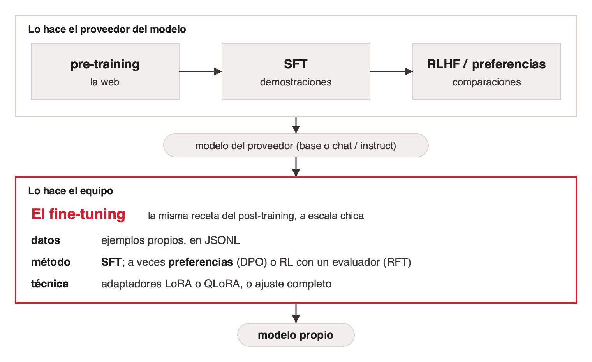
<!-- ascii-source:
 +------------------------ lo hace el proveedor del modelo ------------------------+
 |                                                                                 |
 |   pre-training   ------&gt;   SFT   ------&gt;   RLHF / preferencias                  |
 |   la web                   demostraciones  comparaciones                        |
 +---------------------------------------------------------------------------------+
                                        |
                                        v
                 modelo del proveedor (base o chat / instruct)
                                        |
                                        v
 +---------------------------- lo hace el equipo ---------------------------------+
 |                                                                                 |
 |   el fine-tuning                                                                |
 |     datos      ejemplos propios, en JSONL                                       |
 |     método     SFT; a veces preferencias (DPO) o RL con un evaluador (RFT)      |
 |     técnica    adaptadores LoRA o QLoRA, o ajuste completo                      |
 +---------------------------------------------------------------------------------+
                                        |
                                        v
                                 modelo propio
-->
<!-- ascii-note:
intent: extender el mapa de las tres etapas con el fine-tuning del equipo de producto, que corre sobre el modelo ya post-entrenado
emphasize: la caja de abajo (el fine-tuning del equipo) y su parecido con SFT y preferencias de la caja de arriba
labels: lo hace el proveedor, lo hace el equipo, datos, método, técnica
-->

- **Lo que cambia.** Los datos son del equipo y son pocos. Los métodos son los mismos de las secciones 2, 3 y 4.
- **Mecanismos: LoRA y QLoRA.** LoRA congela los pesos del modelo y entrena solo dos matrices chicas por capa. QLoRA además guarda el modelo congelado en 4 bits: un modelo de 65B se ajusta en una sola GPU de 48 GB.
- **Fuente.** [OpenAI, docs de optimización de modelos](https://developers.openai.com/api/docs/guides/model-optimization) · [Microsoft, docs de fine-tuning en Azure Foundry](https://learn.microsoft.com/en-us/azure/foundry/openai/how-to/fine-tuning) · [Hu et al., 2021](https://arxiv.org/abs/2106.09685) · [Dettmers et al., 2023](https://arxiv.org/abs/2305.14314)

### Sources

- `softwarephilosopher-aie-notes.web.md`: fine-tuning "made by application developers"; post-training "made by model developers".
- `openai-model-optimization.web.md` (definiciones verbatim): SFT "Provide examples of correct responses to prompts to guide the model's behavior."; DPO "Provide both a correct and incorrect example response for a prompt."; RFT "Generate a response for a prompt, provide an expert grade for the result, and reinforce the model's chain-of-thought for higher-scored responses."; datos "formatted in JSONL".
- `azure-foundry-fine-tuning.web.md`: métodos SFT, DPO y RFT; "We use low-rank adaptation (LoRA) to fine-tune models".
- `vertex-open-model-tuning.web.md`: modos "Full fine-tuning" y "Low-Rank Adaptation (LoRA)"; datos en JSONL.
- `unsloth-fine-tuning-guide.web.md`: SFT es "the standard method of post training"; "start with a small instruct model"; "for most use-cases, standard SFT is sufficient".
- Viñeta "Mecanismos: LoRA y QLoRA" agregada por pedido del presentador (2026-09-29: "Mencionemos tal vez LoRA y QLoRA como mecanismos a usar"), después de cortar "LoRA y QLoRA en la práctica". `hu-2021-lora.pdf.md`: W0 + BA con r ≪ min(d, k), W0 congelada. `dettmers-2023-qlora.pdf.md`: "finetune a 65B parameter model on a single 48GB GPU while preserving full 16-bit finetuning task performance"; el modelo base cuantizado en 4 bits (NF4).

### Speaker notes

Es el mapa de la Introducción con una caja más abajo. Las tres etapas de arriba las paga el proveedor; la de abajo, el equipo. En esa caja el equipo hace lo mismo que ya vieron: SFT con ejemplos propios (sección 2) y, a veces, preferencias o refuerzo (secciones 3 y 4). RFT es el nombre que usan OpenAI y Azure para el refuerzo con un evaluador, parecido al RL con recompensas verificables de la sección 4. Unsloth recomienda partir de un modelo instruct, que ya sabe conversar y pide menos datos. La técnica casi siempre es un adaptador: con LoRA no hace falta entrenar todos los parámetros, y con QLoRA alcanza una sola GPU. Unsloth recomienda empezar por QLoRA y pasar al ajuste completo solo si no alcanza. Tiempo objetivo: ~1,5 min.

---

## 2. Prompt, RAG o fine-tuning

<!-- template: content-image -->

### Content

**RAG corrige fallas de información (el modelo no conoce los datos). El fine-tuning corrige fallas de comportamiento (el modelo no responde en la forma, el formato o el estilo pedidos).**

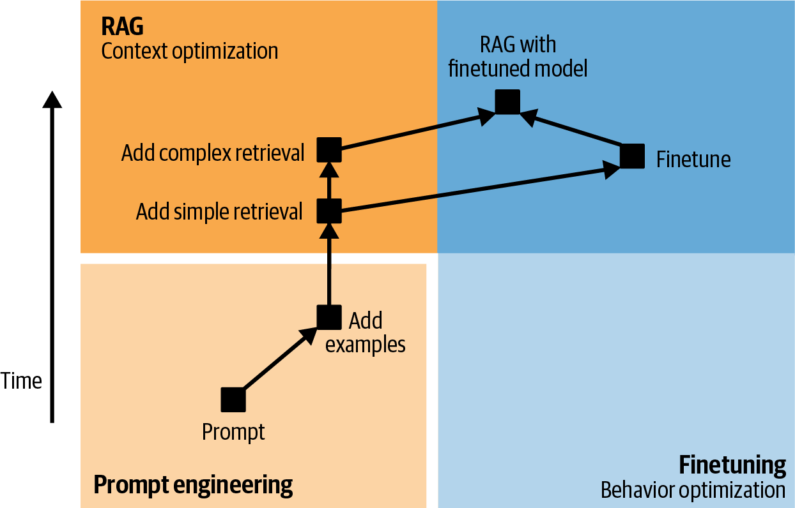

- **Orden habitual.** Prompt, después ejemplos en el prompt, después RAG, y fine-tuning al final.
- **No se excluyen.** Si hacen falta los dos, se empieza por RAG.
- **Fuente.** [Huyen, 2025 (AI Engineering)](https://github.com/chiphuyen/aie-book/blob/main/chapter-summaries.md) · [Bagerbach, notas de AI Engineering](https://bagerbach.com/books/ai-engineering/)

### Sources

- `huyen-aie-chapter-summaries.web.md`: Figura 7-3 (rag-vs-finetune.png), "whether to experiment with more complex retrieval (such as hybrid search) or finetuning depends on each application and its failure modes"; cap. 6: "RAG and agents are both prompt-based methods, as they influence the model's quality solely through inputs without modifying the model itself".
- `bagerbach-aie-notes.web.md` (cap. 7, según las notas): "RAG is for facts, finetuning is for form"; si hacen falta los dos, "start with RAG"; flujo Prompting → RAG → Finetuning.
- `softwarephilosopher-aie-notes.web.md` (cap. 7): RAG para fallas de información; fine-tuning para fallas de comportamiento; razones en contra: degrada otras tareas, inversión inicial alta, modelos base que mejoran.

### Speaker notes

Callback a las clases de prompting y de RAG y MCP: todo lo que vieron hasta ahora cambia la entrada del modelo; el fine-tuning cambia los pesos. El eje vertical de la figura es el tiempo del proyecto. Una falla de comportamiento típica es un modelo que genera SQL de un dialecto poco común que no compila, y ningún documento recuperado arregla eso. Con pocos datos de calidad conviene LoRA o QLoRA sobre un modelo fuerte; con muchos, un ajuste completo de un modelo más chico, o destilar un modelo fuerte en uno chico (revisar la licencia). Dos costos: ajustar para una tarea puede degradar otras, y el próximo modelo base puede superar al ajustado. Tiempo objetivo: ~1,5 min.

---

## 3. Cuándo vale la pena el fine-tuning

### Content

**El fine-tuning vale la pena cuando la falla es de comportamiento y el prompt ya no alcanza. Estos son los casos típicos.**

- **Forzar un formato de salida.** JSON o YAML que el modelo tiene que respetar siempre, o código que compile.
- **Un estilo o un tono fijo.** Que responda siempre con la voz, el largo y la estructura del producto.
- **Una tarea poco vista.** Algo que el modelo general casi no vio, como un dialecto de SQL poco común.
- **Un modelo chico.** Que un modelo chico imite a uno grande en una tarea (destilación): más barato y más rápido.
- **Cuándo no.** Si al modelo le faltan datos, es un caso de RAG. Además, el ajuste puede empeorar otras tareas, y un modelo base nuevo puede superar al ajustado.
- **Fuente.** [Huyen, 2025 (AI Engineering)](https://github.com/chiphuyen/aie-book/blob/main/chapter-summaries.md) · [Bagerbach, notas de AI Engineering](https://bagerbach.com/books/ai-engineering/)

### Sources

- Lámina agregada por pedido del presentador (2026-09-29): "Add also a slide of caso que queremos hacer fine tune" → aclarado: "Contar los casos donde Fine Tuning vale la pena explorar. EG: Forzar un output format".
- `softwarephilosopher-aie-notes.web.md` (cap. 7, notas de un lector de AI Engineering): "Reasons to finetune: structured outputs (JSON, YAML); tasks the general model wasn't trained on enough (e.g., less common SQL dialect); bias mitigation with counter-bias data; 'finetuning smaller models is much more common.'"; "Reasons not to: can degrade other tasks; high upfront investment (annotated data, training know-how, serving); base models may improve past your tuned model"; "finetuning for behavior-based failures (irrelevant-but-correct info, wrong output format e.g. non-compiling code)".
- `bagerbach-aie-notes.web.md`: structured outputs por "band-aids" (prompting, post-processing, regenerar) que "work best when the model is already quite good at the task", o por "intensive treatment": constrained sampling y finetuning; "RAG is for facts, finetuning is for form"; behavior-based failures: "doesn't follow instructions, wrong style/format, unsafe content"; "Finetuning a small model to imitate a larger, more capable one is a common and effective strategy known as distillation."; "Finetuning a model for a specific task can improve its performance for that task, but also degrade its performance for others."
- Fuentes de segunda mano (notas de lectores del libro), como el resto de la sección.

### Speaker notes

Es la continuación de la lámina anterior: si la falla es de comportamiento, estos son los casos donde conviene explorar un fine-tuning. El más claro es el formato. Si el producto necesita JSON válido siempre, el prompt y el post-procesamiento funcionan mientras el modelo ya sea bueno en la tarea; cuando no alcanza, se ajusta con ejemplos en ese formato. Lo mismo con un estilo fijo o una tarea que el modelo casi no vio. La destilación es el caso más común en la práctica: un modelo chico ajustado con salidas de uno grande, que cuesta menos y responde más rápido. Cerrar con el cuándo no: si faltan datos es RAG, y el ajuste tiene costo, puede empeorar otras tareas y queda viejo cuando sale un modelo base mejor. Tiempo objetivo: ~1,5 min.

---

## 4. Fine-tuning en la nube

### Content

**A septiembre de 2026, Azure y Google Cloud ofrecen fine-tuning administrado a usuarios nuevos, y OpenAI cierra su plataforma. En todas el recorrido es el mismo: se suben ejemplos en JSONL, se lanza un trabajo y sale un modelo propio para desplegar.**

| Plataforma | Modelos que se pueden ajustar | Métodos |
|---|---|---|
| OpenAI (cerrada a usuarios nuevos) | gpt-4.1, gpt-4.1-mini y gpt-4.1-nano; o4-mini | SFT y DPO; RFT solo en o4-mini |
| Azure Foundry | Los de OpenAI más gpt-4o, gpt-4o-mini y gpt-5; Llama, Qwen, Ministral y gpt-oss | SFT, DPO o RFT según el modelo, con LoRA |
| Google Cloud: Gemini | Gemini 3.5 Flash, 3.1 Flash-Lite y la familia 2.5 | SFT con adaptadores |
| Google Cloud: modelos abiertos | Gemma 3 y 4, Qwen 3, Llama 3 y 4, GLM | SFT completo o LoRA según el modelo; destilación |

- **Fuente.** [OpenAI, docs de optimización de modelos](https://developers.openai.com/api/docs/guides/model-optimization) · [Microsoft, docs de fine-tuning en Azure Foundry](https://learn.microsoft.com/en-us/azure/foundry/openai/how-to/fine-tuning) · [Google Cloud, docs de tuning de Gemini](https://docs.cloud.google.com/gemini-enterprise-agent-platform/models/tuning/supervised-tuning)

### Sources

- `openai-model-optimization.web.md` (captura 2026-09-26, verbatim): "OpenAI is winding down the fine-tuning platform. The platform is no longer accessible to new users, but existing users of the fine-tuning platform will be able to create training jobs for the coming months."; "All fine-tuned models will remain available for inference until their base models are deprecated."; tabla de métodos: SFT `gpt-4.1-2025-04-14` `gpt-4.1-mini-2025-04-14` `gpt-4.1-nano-2025-04-14`; Vision fine-tuning `gpt-4o-2024-08-06`; DPO los mismos tres gpt-4.1; RFT "**Reasoning models only**." `o4-mini-2025-04-16`. El modelo recomendado para trabajo nuevo en esa página (`gpt-6-astra`) no figura entre los que se pueden ajustar.
- `azure-foundry-fine-tuning.web.md` (updated 2026-09-01): `gpt-4o-mini` SFT; `gpt-4o` SFT, DPO; `gpt-4.1`, `gpt-4.1-mini`, `gpt-4.1-nano` SFT, DPO; `o4-mini` RFT; `gpt-5` RFT ("access is gated and available by invitation only"); `Ministral-3B`, `Qwen-32B`, `Llama-3.3-70B-Instruct`, `gpt-oss-20b` SFT ("only supported on Foundry resources"); "We use low-rank adaptation (LoRA) to fine-tune models"; cada modelo desplegado "incurs an hourly hosting cost".
- `vertex-gemini-supervised-tuning.web.md` (last updated 2026-09-25, verbatim): "The following Gemini models support supervised fine-tuning: Gemini 3.5 Flash, Gemini 3.1 Flash-Lite, Gemini 2.5 Pro, Gemini 2.5 Flash-Lite, Gemini 2.5 Flash"; parámetro "Adapter size" (1, 2, 4, 8, 16); "Max training file size: 1GB for JSONL".
- `vertex-open-model-tuning.web.md` (last updated 2026-09-25): Gemma 4 (E2B, E4B, 26B A4B, 31B IT), Gemma 3 (1B, 4B, 12B, 27B IT), MedGemma 1.5 4B, Qwen 3.6 (27B, 35B A3B), Qwen 3.5 9B, Qwen 3 (4B, 8B, 14B, 32B), Llama 3.1 8B (+Instruct), Llama 3.2 1B y 3B Instruct, Llama 3.3 70B Instruct, Llama 4 Scout 17B 16E Instruct, GLM 4.7 Flash; modos "Full fine-tuning" y "Low-Rank Adaptation (LoRA)", disponibles según el modelo; "Distillation lets you tune a smaller student model using the outputs of a larger teacher model"; los checkpoints `.safetensors` quedan en el bucket del cliente y se pueden exportar. Google llama al producto Gemini Enterprise Agent Platform; el SDK sigue siendo `vertexai`.
- AWS no está en la tabla porque el corpus no tiene su documentación (ver Open questions).

### Speaker notes

Leer la tabla por filas y decir la fecha: las listas cambian rápido. OpenAI anunció que cierra su plataforma. Quien ya la usaba puede seguir unos meses, y los modelos ajustados funcionan hasta que OpenAI retire el modelo base. El modelo que OpenAI recomienda hoy para trabajo nuevo no se puede ajustar. Azure sigue vendiendo fine-tuning de gpt-4.1, gpt-4o y o4-mini, y de gpt-5 con RFT por invitación. En Gemini el ajuste es con adaptadores (se elige el tamaño); en los modelos abiertos, según el modelo, hay LoRA, ajuste completo o los dos. Un modelo desplegado en Azure cobra por hora aunque no reciba pedidos. Tiempo objetivo: ~2 min.

---

## 5. Fine-tuning local: el recorrido

### Content

**Con un modelo de pesos abiertos, el fine-tuning corre en una GPU propia o en un notebook de Colab. Las librerías de Hugging Face (TRL y PEFT) o Unsloth resuelven el entrenamiento.**

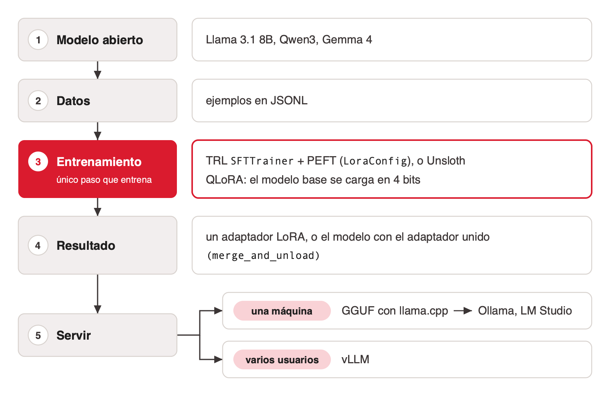
<!-- ascii-source:
 1  modelo abierto     Llama 3.2 8B, Qwen3, Gemma 4
         |
         v
 2  datos              ejemplos en JSONL
         |
         v
 3  entrenamiento      TRL SFTTrainer + PEFT (LoraConfig), o Unsloth
                       QLoRA: el modelo base se carga en 4 bits
         |
         v
 4  resultado          un adaptador LoRA, o el modelo con el adaptador unido
                       (merge_and_unload)
         |
         v
 5  servir             GGUF con llama.cpp -> Ollama, LM Studio (una máquina)
                       vLLM (varios usuarios)
-->
<!-- ascii-note:
intent: los cinco pasos de un fine-tuning local, de arriba abajo, con la herramienta de cada paso
emphasize: el paso 3 (entrenamiento) y la bifurcación del paso 5 entre una máquina y varios usuarios
labels: TRL, PEFT, Unsloth, GGUF, vLLM
-->

- **Un ejemplo completo.** La guía de Google ajusta Gemma 4 E2B cargado en 4 bits (NF4), con LoRA de rango 16, para traducir preguntas a SQL. Enmascara todo lo que viene antes de la respuesta.
- **Fuente.** [Hugging Face, docs de TRL SFTTrainer](https://huggingface.co/docs/trl/sft_trainer) · [Unsloth, guía de fine-tuning](https://unsloth.ai/docs/get-started/fine-tuning-llms-guide) · [Google, guía de QLoRA con Gemma](https://ai.google.dev/gemma/docs/core/huggingface_text_finetune_qlora)

### Sources

- `hf-trl-sft-trainer.web.md` (TRL v1.14.0): inicio mínimo `SFTTrainer(model="Qwen/Qwen3-0.6B", train_dataset=load_dataset("trl-lib/Capybara", split="train"))`; cuatro formatos de dataset (`text`, `messages`, `prompt`/`completion`, y prompt-completion conversacional); "allowing any user to conveniently train adapters and share them on the Hub, rather than training the entire model" con `peft_config=LoraConfig()`; `quantization_config` "Combine with `peft_config` for QLoRA training"; soporte de tool calling.
- `unsloth-fine-tuning-guide.web.md`: "start with a small instruct model like Llama 3.1 (8B)"; "If you're running inference on a single device (like a laptop or Mac), use llama.cpp to convert to GGUF format to use in Ollama, llama.cpp, LM Studio etc."; vLLM para servir a varios usuarios; "you can fine-tune or do RL for free on Colab, Kaggle, or locally with just 3GB VRAM by using our notebooks" (afirmación del proveedor, sin tamaño de modelo).
- `gemma-qlora-hf-guide.web.md` (last updated 2026-06-19): `model_id = "google/gemma-4-E2B"`; `BitsAndBytesConfig(load_in_4bit=True, bnb_4bit_use_double_quant=True, bnb_4bit_quant_type='nf4', …)`; `LoraConfig(lora_alpha=16, lora_dropout=0.05, r=16, …)`; tarea natural-language→SQL con `philschmid/gretel-synthetic-text-to-sql`; el collator "masks every token up to and including the model-turn header `<|turn>model\n` with `-100`"; `merge_and_unload()` para servir con vLLM o TGI. La guía se contradice sobre cuántos ejemplos usa (10.000 en el texto, 1.250 en el código); la lámina no da la cifra.
- `vertex-open-model-tuning.web.md`: Llama, Qwen y Gemma entre los modelos abiertos.

### Speaker notes

Recorrer el diagrama de arriba abajo. El paso 3 es el único que entrena; adentro corre el SFT de la sección 2 con la máscara de la lámina 2.4: la guía de Gemma pone -100 en todos los tokens anteriores a la respuesta, y TRL hace lo mismo por defecto con datos prompt-completion. El resultado del paso 4 es un archivo aparte, el adaptador; se puede servir junto al modelo base o unirlo a los pesos. Para correrlo en una laptop se convierte a GGUF y se usa con Ollama o LM Studio, como en clases anteriores. Unsloth promete notebooks gratis con 3 GB de VRAM, sin decir para qué tamaño de modelo. Tiempo objetivo: ~1,5 min.

---

## 6. Qué pedirle a los datos

### Content

**Un dataset chico y parecido a la tarea le gana a uno grande y genérico.**

- **Formato.** JSONL con conversaciones (`messages`, con roles system, user y assistant) o con pares `prompt` y `completion`. TRL, Google Cloud y Azure aceptan estas formas.
- **Cantidad.** Azure exige al menos 10 ejemplos y recomienda empezar con 50 bien armados; como buena práctica sugiere cientos o miles.
- **Adecuación.** En el paper de QLoRA, 9.000 ejemplos de OASST1 superan a 450.000 de FLAN v2 como chatbot.
- **Curado.** En LIMA, 1.000 ejemplos curados alcanzan un modelo competitivo.
- **Fuente.** [Microsoft, docs de fine-tuning en Azure Foundry](https://learn.microsoft.com/en-us/azure/foundry/openai/how-to/fine-tuning) · [Dettmers et al., 2023](https://arxiv.org/abs/2305.14314) · [Bagerbach, notas de AI Engineering](https://bagerbach.com/books/ai-engineering/)

### Sources

- `hf-trl-sft-trainer.web.md`: formatos `{"messages": […]}` y `{"prompt": …, "completion": …}`; "By default, the trainer computes the loss on the completion tokens only, ignoring the prompt tokens."
- `vertex-open-model-tuning.web.md`: JSONL "prompt-completion", "turn-based chat" (`messages` con roles `system`/`user`/`assistant`) y GenerateContent.
- `azure-foundry-fine-tuning.web.md`: JSONL "in the conversational format that the Chat Completions API uses"; jobs need at least 10 examples; "best practice… hundreds, if not thousands"; "We recommend that you start with 50 well-crafted examples."; "doubling the dataset size can lead to a linear increase in model quality".
- `dettmers-2023-qlora.pdf.md`: "a 9k sample dataset (OASST1) outperformed a 450k sample dataset (FLAN v2, subsampled) on chatbot performance"; "Data set suitability is more important than dataset size"; FLAN v2 mejor en MMLU y peor en Vicuna.
- `bagerbach-aie-notes.web.md` (cap. 8, según las notas): LIMA, "a model finetuned on just 1,000 carefully curated examples could be competitive with GPT-4", "though the resulting model might be less robust".
- `touvron-2023-llama2.pdf.md`: 27.540 anotaciones de SFT propias en vez de millones de terceros (respaldo; salió de las notas por tiempo).
- `huyen-aie-chapter-summaries.web.md` (cap. 7): "finetuning is easy, but getting data for finetuning is hard".

### Speaker notes

La frase de Chip Huyen del capítulo 7: "finetuning is easy, but getting data for finetuning is hard". El formato es el de los registros de SFT de la sección 2; TRL, por defecto, calcula la pérdida solo sobre la respuesta, la misma máscara de la lámina 2.4. Las cifras de Azure son su recomendación para sus modelos. FLAN v2 da el mejor MMLU y el peor puntaje de chatbot, así que el dataset tiene que parecerse a la tarea. LIMA llega de segunda mano, de las notas de un lector del libro, y el modelo resultante es "menos robusto". Presentarlo como indicio. Tiempo objetivo: ~1,5 min.

---

## 7. Fine-tuning: un ejemplo

### Content

- **Notebook.** [Fine-tuning: ejemplo en DataCamp DataLab](https://www.datacamp.com/datalab/w/6e85b332-8365-42e3-9cd1-c0616eeac8d2/edit)

### Sources

- Link agregado por pedido del presentador (2026-09-29): "Add a link to this in a new page about Fine Tuning Example". La página pide iniciar sesión en DataCamp; el contenido del notebook no se pudo leer y no está en el corpus, así que la lámina no lo describe.

### Speaker notes

Mostrar el link y, si hay tiempo, abrir el notebook. Para abrirlo hace falta una cuenta de DataCamp. Tiempo objetivo: ~1 min.

---


# Conclusions

## 1. Dónde nace cada comportamiento

### Content

**Cada comportamiento que se ve en un LLM viene de una etapa concreta del entrenamiento, y cada etapa tiene su arreglo.**

| Lo que se observa | Etapa donde nace | Qué se puede hacer |
|---|---|---|
| Repite los sesgos y los huecos de sus datos | Datos de pre-training | Curar los datos; post-training para negarse |
| Completa en vez de responder | Pre-training sin SFT | Usar un modelo con post-training |
| Sigue el formato y el tono pedidos | SFT | Demostraciones de calidad |
| Prefiere unas respuestas a otras | RLHF o DPO | Datos de comparación |
| Llama herramientas: calcula, busca, usa MCP | SFT con las llamadas en el texto; preferencias y RL para encadenarlas en tareas de varios pasos | Definiciones claras de cada herramienta (MCP) y un agente que las ejecute |
| Razona antes de responder, y más cuanto más difícil es el problema | RL con verificadores | Usar un modelo de razonamiento en tareas cuya respuesta se puede comprobar |
| No responde en la forma que necesita el producto | Todo lo anterior | Prompt y RAG; si no alcanza, fine-tuning con LoRA o QLoRA, en la nube (Azure, Google) o local |

- **Fuente.** Las de cada sección.

### Sources

- Síntesis de la clase; sin fuentes nuevas.

### Speaker notes

Leer la tabla de arriba abajo, en dos minutos, conectando cada fila con su sección. La última fila corresponde a la sección 6, que es la que les toca a ellos. Después, preguntas. Si sobra tiempo, mostrar un registro de un dataset público de SFT. Tiempo objetivo: ~2 min más preguntas.

---

# Open questions

- **Reestructuración por etapas (2026-09-26).** Las secciones siguen las tres etapas (1 Pre-training, 2 SFT, 3 RLHF y refuerzo), más Herramientas (4), Cuando el modelo inventa (5) y Fine-tuning (6). En la revisión del Composer antes del Polish, las tres láminas sobre inventar salieron de la sección 3 (ex 3.10 a 3.12) y forman la sección 5, después de Herramientas, para que la búsqueda ya esté vista cuando se dice que no alcanza; su última lámina hace de puente a "Prompt, RAG o fine-tuning" (6.2). Nombre elegido por el Editor: "Cuando el modelo inventa" (24 caracteres).
- **El modelo de OpenAI de 2022 sin nombre propio.** Por pedido del presentador (no introducir confusión), el modelo aparece como "GPT-3 con post-training" o "el trabajo de OpenAI de 2022" en contenido, notas, tesis y metas. Los Sources conservan el nombre del archivo `ouyang-2022-instructgpt.pdf.md` y las citas en inglés, que lo nombran.
- **Encuadre de etapas. Resuelto (2026-09-26).** Tres etapas en todo el mazo: pre-training, SFT y RLHF. El post-training son las etapas 2 y 3, y el fine-tuning de un equipo de producto es la misma receta a escala chica (sección 6). Las notas de la Introducción 2 ya no hablan de "dos fases".
- **Términos en inglés.** Nombres de etapas y métodos en inglés (pre-training, post-training, SFT, RLHF, DPO, PPO, GRPO, reward model), con las siglas desarrolladas en su primer uso (Introducción 1). El resto de la prosa queda en castellano. El feedback que lo pidió (ex 3.4) se cerró al cortar esa lámina; confirmar el alcance.
- **Fuentes de 4.6 (búsqueda web). Resuelto.** Las citas se verificaron contra `anthropic-tool-use-overview.web.md` y `anthropic-web-search-tool.web.md` después de que el librarian los agregó.
- **Ejemplo de 4.2.** El nombre `get_weather` sale del esquema MCP de Lambert; la ciudad (Córdoba) es un ejemplo nuestro.
- **Problemas (1.7).** Resume cinco láminas cortadas; quedó en cinco viñetas al retirar "Techo de datos", que repetía la 1.6 (texto en Cut material). Las cifras (42% y 6,2% de la lista negra; 89,70% y 0,13% de Llama 2; 5% y 28% de C4 restringido) vienen de esas láminas y de sus registros. Se dejó afuera el 32% del inglés hispano; está en Sources.
- **Frontmatter provisorio.** `class: "Clase 9: Cómo se entrena un LLM"` y `date: 2026-09-30` no los confirmó el presentador. La Clase 8 dice que las variantes modernas del transformer "se ven en la clase 9": confirmar si esta clase es la 9 o la 10.
- **"2 billion websites" (1.2).** Intención resuelta (mostrar fuentes de las métricas de Common Crawl y el depurado de C4). El número "2 mil millones" no está en ningún registro del corpus; si se quiere mostrar, capturar la página de estadísticas de Common Crawl.
- **Cómputo del post-training.** El ~98% / ~2% es del GPT-3 con post-training que publicó OpenAI en 2022, dicho así en la tesis y la Introducción 2. Para modelos de razonamiento actuales el corpus no da la proporción (DeepSeek-R1 da 147.000 horas de H800 de post-training pero no el costo del modelo base).
- **Dataset público de SFT (2.4).** El Composer pidió un registro de Dolly-15k u OASST1. El corpus tiene los links y tamaños (huyen-2023-rlhf) pero ningún registro verbatim de esos datasets; la lámina muestra los links y tres registros de OpenAI. Capturar una fila de Dolly-15k si se quiere mostrarla.
- **Figura de la proyección de datos (1.6). Resuelto.** Se usa la Figura 1 de Villalobos renderizada desde el vector del PDF a 300 dpi (`images/villalobos-2024-fig1-data-stock-projection.png`, 1042 × 663 px), solo el gráfico. Es la misma figura que el libro reproduce como fig. 2-9; la foto (Data.pdf, p002) queda como alternativa.
- **"This is part of SFT /" (4.8).** Respondido como: empieza en SFT y sigue en preferencias y RL. Confirmar.
- **Deck de fine-tuning de la Clase 4.** No se pudo leer (permisos de macOS). La sección 6 puede fusionarse cuando esté en `research/`.
- **Fuentes de segunda mano del libro AI Engineering.** 1.7 (telugu/marathi/punjabi, en Sources), 6.2–6.3 (78 GB y 31 GB para 13B), 6.7 (LIMA) citan resúmenes de lectores. Verificar si llega el texto del libro.
- **Kalai et al., umbral t = 0,75 (5.2).** El paper dice penalización 2; su fórmula da 3. La lámina usa t = 0,5 y t = 0,9.
- **gpt-oss (3.8).** La lámina cita la fila "con herramientas" de la Tabla 3 para coincidir con la Figura 3; la ficha no dice cómo se entrenan los niveles; el efecto no es monótono en todas las tareas.
- **Qwen3 (3.9, 3.10).** ThinkFollow (88,7 → 98,9) es un benchmark interno. Decisión del Editor: la lámina de los cuatro pasos va antes que la del SFT con flags, y dice "pasos" para no chocar con las tres etapas de la clase (el paper dice "stages"). El diagrama ya no usa "cold start" ni "CoT": el paso 1 dice "SFT inicial (razonamientos largos y verificados)"; el término del paper queda en Sources.
- **C4, umbrales (1.3).** Raffel y Dodge dan los umbrales invertidos; se sigue a Raffel.
- **Imágenes con stub pendiente.** `huyen-aie…/rlhf.png`, redibujada como diagrama ASCII en la Introducción 2 y citada por sus escalas en las aperturas 1.1, 2.1 y 3.1 (las escalas y los rótulos se leyeron de la imagen; re-verificar después de la fase 2 del librarian), 2.2 (`ouyang…/fig-08-p015.png`), 4.5 (`cobbe…/fig-09-p017.png`), 3.7 (`deepseek…/fig-01-p004.png`), 3.8 (`openai-2025-gpt-oss…/fig-03-p008.png`), 6.2 (`huyen-aie…/rag-vs-finetune.png`): vistas por el Editor, depiction/relevance sin transcribir.
- **Review salteado.** El presentador decidió pasar al Polish sin ronda de Review; los feedback que quedan `[open]` se rescatan a esta sección en el Polish.
- **Densidad (2026-09-27, tras agregar la pregunta y los dos quizzes al cierre de Pre-training y la pregunta y el quiz al cierre de SFT).** 51 láminas; tiempos objetivo ~86,5 min más preguntas (Pre-training ~19, SFT ~8,5). Quedan ~3,5 min de margen sobre 90: si aprieta, recortes sugeridos en este orden: 3.6 DPO, 3.10 Qwen3 SFT, 4.7 salida de la búsqueda web.
- **Densidad (2026-09-26, revisión del Composer antes del Polish; actualizada con la 3.4 nueva).** 46 láminas en 6 secciones más Introducción y Conclusiones; tiempos objetivo ~82 min más preguntas (Introducción 3,5, Pre-training 15,5, SFT 7, RLHF y refuerzo 19, Herramientas 18, Cuando el modelo inventa 5, Fine-tuning 12, Conclusiones 2). Se bajó de ~84,5 con Toolformer plegado en la 4.4, las excepciones de búsqueda web pasadas a notas y notas acortadas. Las láminas de calculadora, búsqueda web y MCP (tres o cuatro cada una) se mantienen porque las pidió el presentador. La 3.4 "El reward model, en un batch" sumó ~2 min (pedido del presentador). Si todavía aprieta, en este orden: 3.6 (DPO, ~2 min), 3.10 (Qwen3 SFT con flags, ~1,5 min; la 3.9 ya nombra el paso), 4.7 (Qué genera el modelo al buscar, ~1 min), 1.4 (Tres perillas, ~2 min, fusionable con 1.5).
- **Reward model en un batch (3.4).** Pedido del presentador (2026-09-26): "Agregar en RL un slide que explique la matemática de RL." La lámina sale de `notas-presentador-reward-model-batch.md`. (a) Que el puntaje se tome del último token real y no de la última posición de la fila es una nota del presentador: ningún otro registro del corpus lo dice (el librarian lo marcó como pregunta abierta). Queda atribuido en Sources; para respaldarlo, capturar la documentación o el código de un entrenador de reward models. (b) Los 64 pares son el ejemplo del presentador; en OpenAI (2022) el batch de 64 cuenta prompts, con hasta 2.304 comparaciones, y la lámina no le atribuye los 64 pares. (c) La nota original abre con "Casi:", respuesta a una pregunta que no quedó capturada; confirmar si la lámina tiene que corregir algún malentendido puntual. (d) L6: la fórmula de la pérdida quedó solo en la 3.4; la 3.3 conserva la idea (mismo modelo, ganadora arriba). La 3.3 sigue diciendo que se entrena "para que la respuesta elegida puntúe más", y el lead de la 3.4 lo repite como objetivo de la pérdida; confirmar si molesta. (e) Etiquetas de las tarjetas: "Orden." y "Padding." (sintagma nominal las dos, por L8) en lugar de "El orden importa.", que era la frase de la nota.
- **Escala de SFT en 2.1.** La apertura de SFT dice "decenas de miles de pares" en vez del rango 10.000–100.000, que ya da la 2.3 (L6). La figura de la Introducción 1 muestra el rango exacto.
- **Herramientas, "similar al slide 35" (4.5).** Se leyó como la lámina de la secuencia intercalada con el ejecutor externo (la ex 4.5, figura de Lambert). La 4.5 "Qué genera el modelo y quién calcula" usa la Figura 9 de GSM8K, que muestra el mismo flujo con la calculadora. Confirmar que era esa lámina.
- **La máscara en la 4.5.** GSM8K entrenó sobre las anotaciones como texto común ("they are all just tokens") y la calculadora recién pisa el resultado en la inferencia; Toolformer tampoco dice que enmascare. La máscara de la salida es la práctica actual según Lambert, cuya figura dice además que la llamada "typically" se enmascara y cuyo texto dice solo la salida. La lámina presenta las dos cosas por separado.
- **Por qué calcula mal (4.3).** El corpus sostiene los errores de cálculo, la falta de corrección en la generación autoregresiva y la aritmética como punto débil. No sostiene que el tokenizer parta los números en pedazos; la lámina no lo afirma. Si se quiere decir, hace falta una fuente.
- **GSM8K, tamaños (4.4).** El paper y la tarjeta dicen 8.5K problemas (7.5K y 1K); la tarjeta da 7.473 de entrenamiento y 1.319 de test, que suman 8.792. La lámina usa las cifras exactas de la tarjeta; la tarjeta llama "validation" al split que el visor llama "test".
- **Registro de function calling (4.11).** El system prompt del ejemplo de Lambert está recortado con "..." y los campos null omitidos; la lista de funciones, que en el original es un string con JSON, se muestra como objeto.
- **MCP, versión 2026-07-28 (4.9, 4.10).** Los registros describen MCP sin estado: cada pedido lleva la versión y las capacidades en `_meta`, con `server/discover` opcional, y no mencionan el handshake `initialize` de versiones anteriores (el que muestra mucho material de 2025, quizás también la clase de RAG y MCP). Sampling quedó deprecado. Confirmar contra el changelog de la especificación si se va a comparar con la clase anterior.
- **Nombres de herramientas en 4.2 y 4.10.** La 4.2 usa `get_weather` (esquema MCP de Lambert); el ejemplo oficial de MCP usa `weather_current` y recomienda nombres con espacio de nombres (`calculator_arithmetic`). No se contradicen; unificar si se prefiere el nombre oficial.
- **Búsqueda web, fuente de un solo proveedor (4.6, 4.7).** El ejemplo y las excepciones (`pause_turn`, llamada en paralelo con una herramienta del cliente) son de la documentación de Anthropic. El corpus no describe cómo lo hacen otros proveedores.
- **Nube, versiones (6.5).** Listas capturadas el 2026-09-26 (OpenAI sin fecha en la página; Azure actualizada el 2026-09-01; Google el 2026-09-25). Volver a revisar antes de la clase. La página de deprecaciones de OpenAI no está en el corpus, así que no hay fecha de cierre para los trabajos de entrenamiento ni para la inferencia de modelos ajustados. El hilo de la comunidad dice que o4-mini tiene fecha de baja en 2026; sin fuente oficial, queda afuera.
- **AWS Bedrock (6.5).** No está en la tabla porque su documentación no se pudo capturar. Capturarla si se quiere una cuarta nube.
- **Azure, nombres y columnas (6.5).** La tabla de Azure se reconstruyó de una página aplanada (lectura de columnas inferida por el librarian) y `Qwen-32B` aparece sin versión. La lámina nombra solo familias (Llama, Qwen, Ministral, gpt-oss). La página dice "Foundry"; la lámina, "Azure Foundry".
- **Gemini con adaptadores (6.5).** La página da un parámetro "Adapter size" y no nombra LoRA ni dice si hay ajuste completo; la lámina dice "SFT con adaptadores" y nada más.
- **Fine-tuning local (6.6, 6.4).** Los 3 GB de VRAM son una afirmación de Unsloth, sin tamaño de modelo; su tabla de requisitos por modelo no está capturada. La única tabla de memoria por tamaño con fuente es la de QLoRA (Dettmers, Figura 6, batch 1 y secuencias de 512), y es la que usa la 6.4. La guía de Gemma se contradice sobre cuántos ejemplos usa (10.000 en el texto, 1.250 en el código), así que la lámina no da la cifra. La guía carga el modelo base `gemma-4-E2B` con el procesador del modelo instruct.
- **Afirmaciones de Unsloth que quedaron afuera.** "Fine-tuning can replicate all of RAG's capabilities" y "LoRA can match FFT" son opiniones del proveedor sin cita; la 6.4 solo toma su recomendación de empezar por QLoRA.
- **Revisión del Composer antes del Polish (2026-09-26): decisiones del Editor sin consulta.** El presentador pidió aplicar la revisión y pasar a Polish sin preguntas; estas elecciones quedan para confirmar:
    - Introducción: el gancho ("Un modelo 100 veces más chico gana") abre la clase y el mapa va segundo. El gancho nombra SFT y RLHF antes de que el mapa los desarrolle; las notas lo avisan. La etiqueta visible para el trabajo de 2022 es "OpenAI (2022)" en todo el mazo (1 de la Introducción, 2.3, 2.4, 3.2, 3.3, 3.4).
    - Calculadora: orden 4.3 no calculan, 4.4 "GSM8K: un dataset con calculadora" (título nuevo; antes "Cómo se entrenó: GSM8K"), 4.5 mecanismo, solo con la notación de GSM8K. Toolformer quedó en una viñeta y en las notas de la 4.4 (ASDiv 40,4 contra 14,0 solo en notas); la lámina propia pasó a Cut material.
    - MCP: la ex 4.11 se partió en 4.10 "Una herramienta MCP es una definición" (esquema recortado a `name`, `description` e `inputSchema`; el `title` del original queda en Sources) y 4.11 "Function calling: lo que aprende". En la 4.9, las tarjetas de host, cliente y servidor pasaron a las notas; queda la de `tools/list` y `tools/call`.
    - Búsqueda web (4.7): las dos excepciones (`pause_turn`, llamada en paralelo con una herramienta del cliente) pasaron a las notas, para decir solo si alguien pregunta.
    - 5.3: la viñeta de resultado dice solo 21% contra 41% (SFT + RLHF contra GPT-3). Que RLHF empeoró la alucinación contra el modelo con solo SFT va en las notas, atribuido a Chip Huyen, que lo lee en el paper.
    - Fine-tuning: orden memoria (6.3), LoRA y QLoRA (6.4), nube (6.5), local (6.6), datos (6.7). La nube abre con "Azure y Google Cloud ofrecen fine-tuning administrado a usuarios nuevos, y OpenAI cierra su plataforma", y la fila de OpenAI dice "cerrada a usuarios nuevos".
- **Diagrama de la Introducción 2.** Redibuja `rlhf.png` en castellano a pedido del presentador. Rótulos traducidos por el Editor: "optimizado para completar texto", "ajustado para diálogo", "entrenado para dar un puntaje a (prompt, respuesta)", "optimizado para generar respuestas que maximicen el puntaje". Revisar el render en el Polish: es un diagrama ancho (cuatro columnas y la caja punteada de RLHF).
- **Quiz de repaso.** La Clase 8 abre con un quiz; este borrador no. Decidir si se agrega.

# Cut material

- **Sección "Cuando el modelo inventa" completa (ex sección 6: Por qué inventa, Las evaluaciones premian adivinar, Cómo se entrena para decir "no sé", Ejemplo: premiar el "no sé"), 2026-09-29.** Cortada por pedido del presentador ("Borrar toda la sección 'Cuando el modelo inventa'"). Fine-tuning pasa a sección 6. Salieron también la fila "Inventa en vez de decir 'no sé'" de las conclusiones, la cláusula de la tesis ("inventa porque las evaluaciones premian adivinar"), el tramo del narrative arc y las referencias "(sección 6)" en Buscar y en GPT-3 antes y después. Texto completo en el Cut material de draft.md.

- **La cuenta de memoria y LoRA y QLoRA en la práctica (ex 7.3 y 7.4), 2026-09-29.** Cortadas por pedido del presentador ("Borrar 'La cuenta de memoria' y 'LoRA y QLoRA en la práctica'"). LoRA y QLoRA siguen nombrados en "Dónde entra el fine-tuning", "Prompt, RAG o fine-tuning", "Fine-tuning en la nube", "Fine-tuning local: el recorrido" y la tabla de conclusiones, ya sin lámina que los explique. Goal de la sección 7 y narrative arc ajustados. Texto completo en el Cut material de draft.md.

- **Calcular: el dataset GSM8K (ex 5.5), 2026-09-29.** Cortada por pedido del presentador ("La notación de Calcular: el dataset GSM8K y Calcular: lo que escribe Llama 3.1 parecen distintas" → "Dado que es un ejemplo, mostremos uno solo que es el de Llama"). GSM8K queda nombrado en "Calcular: el modelo no calcula bien" como fuente de los errores de cálculo; la viñeta de MCP que comparaba con `<<…>>` ahora compara con Llama 3.1. Con la lámina salieron Toolformer y los datos del dataset público (openai/gsm8k). Texto completo en el Cut material de draft.md.

- **Qwen3: SFT con /think y /no_think, Presupuesto de razonamiento: Nemotron Nano 2 y Largo exacto: L1 lo entrena con RL (ex 4.4 a 4.6), 2026-09-29.** Cortadas por pedido del presentador ("Borrá 'Qwen3: SFT con /think y /no_think'", "Borrá 'Presupuesto de razonamiento: Nemotron Nano 2'", "Borrá 'Largo exacto: L1 lo entrena con RL'"). La sección 4 queda en las tres láminas de RL con verificador; se sacó de las notas de 4.1 el anuncio del effort y la fila de effort de las conclusiones pasó a "Razona antes de responder". Texto completo en el Cut material de draft.md.

- **Qwen3: cuatro pasos de post-training (ex 4.4), 2026-09-29.** Cortada por pedido del presentador ("Borrar 'Qwen3: cuatro pasos de post-training'"). Texto completo en el Cut material de draft.md.

- **Effort: low, medium, high y Effort: el system prompt (ex 4.4 y 4.5, gpt-oss), 2026-09-27.** Cortadas por pedido del presentador ("Sacá gpt-oss"); texto completo en el Cut material de draft.md.

- **DPO: los dos pasos en uno (ex 3.7), 2026-09-27.** Cortada por pedido del presentador; una oración en las notas de 3.6 lo define. Texto completo en el Cut material de draft.md.

- **Por qué herramientas y Buscar: las capas (2026-09-27).** Reemplazadas por "Las piezas de una plataforma" (nueva 5.1); texto completo en el Cut material de draft.md.

- **Buscar: la ejecuta el proveedor (2026-09-27).** Reemplazada por "Buscar: las capas"; texto completo en el Cut material de draft.md.

- **Calcular: quién hace la cuenta (2026-09-27).** Reemplazada por dos láminas con Llama 3.1 y Ollama; texto completo en el Cut material de draft.md.

- **Buscar: cómo se entrenó WebGPT y Optimizado para completar (2026-09-27).** Cortadas por pedido del presentador; el texto completo está en el Cut material de draft.md.

- **Lámina 3.4 nueva "El reward model, en un batch", 2026-09-26: líneas retiradas de la 3.3 "El reward model" (L6).** La fórmula pasó a la 3.4, que la muestra con el batch completo. Del diagrama de la 3.3 salieron:

    ```
                    pérdida = -log( sigmoide( s_w - s_l ) )

      si s_w >> s_l  -> pérdida cerca de 0
      si s_w <  s_l  -> pérdida grande: el modelo ordenó al revés
    ```

    De sus Sources salió "pérdida −log(σ(s_w − s_l))" (pasó a la 3.4). De sus notas salió "La pérdida es una regresión logística sobre la diferencia de puntajes (modelo de Bradley-Terry)." Bradley-Terry no aparece en ningún registro del corpus, así que no pasó a la 3.4; las notas de la 3.4 explican σ como la probabilidad de que A gane.
- **Revisión del Composer antes del Polish, 2026-09-26: Toolformer: el modelo se etiqueta solo (ex 4.6).** Para bajar el tiempo total (~84,5 min) y dejar la calculadora en tres láminas, en el orden 4.3 no calculan, 4.4 GSM8K, 4.5 mecanismo. Toolformer quedó como una viñeta ("Toolformer") y unas líneas de notas en la 4.4 "GSM8K: un dataset con calculadora", con sus fuentes; la mención a los corchetes que no tocan el vocabulario aparece una sola vez, en esas notas. Quedaron afuera la Figura 1 de Toolformer (`schick-2023-toolformer.pdf/images/fig-01-p001.png`), el umbral de 775M parámetros y las limitaciones (una llamada por entrada, sin encadenar, sin interacción). Texto completo:

    **4.6 Toolformer: el modelo se etiqueta solo (cortada)**

    <!-- template: content-image -->

    ### Content

    **Escribir a mano millones de trazas con herramientas es caro. Toolformer inserta llamadas candidatas en texto común, las ejecuta y se queda con las que bajan la pérdida del texto que sigue.**

    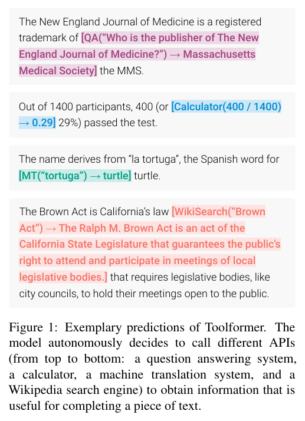

    - **El filtro.** Una llamada sirve si, con su resultado, al modelo le resulta más fácil predecir los tokens siguientes.
    - **Resultado.** En problemas de matemática escolar (ASDiv), GPT-J de 6,7B con calculadora saca 40,4; GPT-3 de 175B, 14,0.
    - **Tamaño mínimo.** La habilidad aparece recién cerca de 775M parámetros.

    ### Sources

    - `schick-2023-toolformer.pdf.md`: "processing more than a million documents results in only a few thousand examples of useful calls to the calculator API"; en matemática (ASDiv, SVAMP, MAWPS) el modelo llama a la calculadora en el 97,9% de los ejemplos (Key claims); método en tres pasos (muestrear, ejecutar, filtrar por L⁻ − L⁺ ≥ τf) y fine-tuning sobre C*; Figura 1; Tabla 4 (ASDiv: Toolformer 40,4, GPT-3 175B 14,0); "the ability to leverage the provided tools only emerges at around 775M parameters"; limitaciones: una llamada por entrada, sin encadenar, sin interacción.
    - `lambert-rlhfbook-tool-use.web.md`: "Human-written tool traces are expensive to collect, so most modern tool-use corpora are synthetic or bootstrapped—Toolformer-style self-labeling".

    ### Speaker notes

    El criterio de Toolformer reutiliza la pérdida de la clase 8 como filtro. Las llamadas se escriben como texto plano con corchetes, sin tocar el vocabulario. Limitaciones que da el paper: una llamada por entrada, sin encadenar herramientas y sin interacción (no refina una búsqueda). WebGPT (lámina 4.9) resuelve la interacción con otro enfoque. Para la calculadora el método es poco eficiente: procesar más de un millón de documentos deja apenas unos miles de llamadas útiles; en los problemas de matemática el modelo final llama a la calculadora en el 97,9% de los casos. Tiempo objetivo: ~1,5 min.

    ### Presenter feedback

- **Revisión del Composer antes del Polish, 2026-09-26: líneas retiradas por repetición (L6).**
    - 1.8 "Problemas a tener en cuenta", viñeta retirada (repetía la 1.6): "**Techo de datos.** El texto humano público es finito, y los datasets crecen más rápido que él." Fuente: `villalobos-2024-run-out-of-data.pdf.md`, "between 2026 and 2032", mediana 2028. Nota del orador retirada con ella: "El techo es la curva de 1.6 (Villalobos et al., mediana 2028, rango 2026 a 2032)."
    - Introducción, "Tres etapas, cuatro conjuntos de datos": las tarjetas quedaron con nombre de etapa y tipo de datos, porque el resto repetía las aperturas 1.1, 2.1 y 3.1. Texto anterior: "**Pre-training.** Aprende de la web a continuar texto. Sale el modelo base." / "**SFT (Supervised Fine-Tuning).** Aprende de ejemplos escritos por personas a responder. Sale un modelo que conversa." / "**RLHF (Reinforcement Learning from Human Feedback).** Aprende de las preferencias de las personas cuál respuesta es mejor. Sale un modelo alineado."
    - Introducción, "Tres etapas, cuatro conjuntos de datos": la imagen `research/corpus/huyen-aie-chapter-summaries.web/images/rlhf.png` se reemplazó por un diagrama ASCII que la redibuja en castellano, a pedido del presentador ("Sería bueno que no lo incluyamos sino que lo convirtieras a SVG si no lo hiciste ya."). La imagen sigue en el corpus.
    - 3.3 "El reward model", nota del orador retirada (la idea queda en la 5.3): "También los inicializa desde el modelo de chat para que 'sepa lo que sabe el modelo': un RM que sabe menos que el modelo que juzga termina premiando respuestas inventadas."
    - 6.5 "Fine-tuning en la nube", viñeta retirada (la apertura y la tabla ya lo dicen): "**OpenAI cierra, Azure sigue.** OpenAI ya no acepta usuarios nuevos en su plataforma de fine-tuning. Azure sigue ofreciendo fine-tuning de los mismos modelos."
    - 6.6 "Fine-tuning local: el recorrido", diagrama: el paso 1 decía "(conviene partir de uno instruct)" y el paso 2 "JSONL con "messages" (chat) o con "prompt" y "completion"". Lo primero lo aconsejan las notas de la 6.1 y la guía de Gemma ajusta el modelo base; los formatos quedan solo en la 6.7.

- **Herramientas reconstruida, 2026-09-26: Cómo se ve un ejemplo de entrenamiento (ex 4.4) y La secuencia intercalada y la máscara (ex 4.5).** Por pedido del presentador: "Agregá en herramientas explícitamente algo parecido a 'La secuencia intercalada y la máscara' que es la calculadora. Y explicá el problema de que los modelos no saben hacer cálculo." y "Vamos a explicar la necesidad de herramientas, y meternos en 3 herramientas: Calc, WebSearch y MCP genérico como para mostrar cómo es que funciona." La sección pasó a tres bloques (calculadora 4.3–4.6, búsqueda web 4.7–4.9, MCP 4.10–4.11). La ex 4.5 era la versión genérica de la nueva 4.4 "Qué genera el modelo y quién calcula": su contenido (el ejecutor externo y la máscara de la salida) quedó en la 4.4 con la Figura 9 de GSM8K, y dejarla habría repetido la idea (L6). La figura de Lambert (`lambert-rlhfbook-tool-use.web/images/tool_use_generation.png`) sigue en el corpus. El registro JSON de la ex 4.4 pasó entero a la nueva 4.11 "Entrenar para cualquier herramienta", junto al esquema MCP de la calculadora; sus notas también. Las ex 4.3 (búsqueda web), 4.6 (Toolformer) y 4.7 (WebGPT) siguen como 4.7, 4.6 y 4.9. Texto completo:

    **4.4 Cómo se ve un ejemplo de entrenamiento (cortada)**

    ### Content

    **Un ejemplo de SFT para herramientas es una conversación: un system prompt con las funciones disponibles, el pedido del usuario y la llamada que el asistente debería emitir.**

    ```json
    [
      {
        "role": "system",
        "content": "You are a function calling AI model. You are provided with function signatures within <functions></functions> XML tags. You may call one or more functions to assist with the user query. Don't make assumptions about what values to plug into functions.",
        "functions": [{
          "name": "live_giveaways_by_type",
          "description": "Retrieve live giveaways from the GamerPower API based on the specified type.",
          "parameters": {"type": {"description": "The type of giveaways to retrieve (e.g., game, loot, beta).", "type": "str", "default": "game"}}
        }]
      },
      {"role": "user", "content": "Where can I find live giveaways for beta access and games?"},
      {"role": "assistant", "content": null,
       "function_calls": "live_giveaways_by_type(type='beta')\nlive_giveaways_by_type(type='game')"}
    ]
    ```

    - **Lo que aprende.** Cuándo llamar, con qué nombre y argumentos. Acá, dos llamadas en paralelo para un solo pedido.

    ### Sources

    - `lambert-rlhfbook-tool-use.web.md`: "Training data for function calling looks much like other post-training data, with one addition: a system prompt that instructs the model what tools it has available"; ejemplo "Multi-turn formatting for tool invocations" (verbatim, campos null omitidos); dataset multi-turno con `live_giveaways_by_type` y dos llamadas paralelas (`type='beta'`, `type='game'`).

    ### Speaker notes

    El registro es del capítulo 13 del RLHF Book de Nathan Lambert; en la lámina se sacaron los campos en null y la lista de funciones, que en el original es un string con JSON, se muestra como objeto. Remarcar que es un registro de SFT como los de 2.4, con un rol de sistema que describe las herramientas. El chat template del modelo convierte este JSON en una secuencia de tokens; cada familia de modelos usa sus propios tokens especiales. Tiempo objetivo: ~2 min.

    ### Presenter feedback

    ---

    **4.5 La secuencia intercalada y la máscara (cortada)**

    <!-- template: content-image -->

    ### Content

    **El modelo genera hasta emitir la llamada, un sistema externo la ejecuta e inserta la salida en la secuencia, y el modelo sigue generando. La salida de la herramienta se enmascara en la pérdida.**

    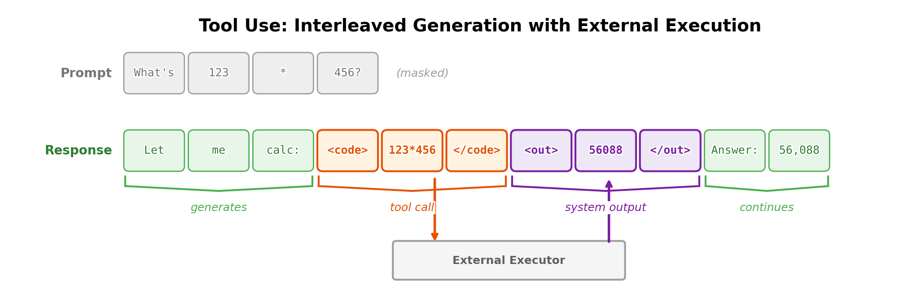

    - **Qué se enmascara.** El prompt y la salida de la herramienta. El modelo no tiene que aprender a predecir qué devuelve la calculadora.
    - **Qué se entrena.** El texto del modelo y la llamada: cuándo emitirla y cómo escribir los argumentos.

    ### Sources

    - `lambert-rlhfbook-tool-use.web.md`: Figura 1 (tool_use_generation.png) "the model generates tokens until it emits a tool call (orange), an external system executes the tool and injects the output (purple) into the sequence, then the model continues generating"; tool output tokens "are masked from the model's training loss"; "Training for tool use is about getting the model to behave predictably with this different token flow".

    ### Speaker notes

    Es la misma máscara de la lámina 2.3, con un tercer tipo de token. El pie de la figura dice "tool call and output tokens are typically masked"; en el texto del capítulo lo que se enmascara es la salida. La diferencia depende de la implementación: si se enmascara también la llamada, el modelo aprende la llamada por otra vía (por ejemplo, RL). En modelos de razonamiento la llamada puede ocurrir dentro de los tokens de pensamiento. Tiempo objetivo: ~2 min.

    ### Presenter feedback

- **Fine-tuning reconstruida, 2026-09-26: Razones a favor y en contra (ex 5.2), LoRA: entrenar dos matrices chicas (ex 5.4), QLoRA: el modelo base en 4 bits (ex 5.5) y Calidad antes que cantidad (ex 5.6).** Por pedido del presentador: "Re-armar toda la sección de fine-tuning de 0 después del slide 'La cuenta de memoria', creo que no explica y es confuso. ¿Qué modelos permiten hoy tuning (cloud)? ¿Cómo se hace local?" La sección quedó en siete láminas: la nueva 5.1 (el mapa de tres etapas extendido con el fine-tuning del equipo, pedido en "falta un gráfico como extendido de las 3 etapas"), Prompt, RAG o fine-tuning, La cuenta de memoria, y cuatro nuevas (nube, local, LoRA y QLoRA en la práctica, datos). Lo que se conservó: la cuenta de LoRA sobre una matriz de GPT-3, el checkpoint de 350 GB a 35 MB, la tabla de memoria de QLoRA (Figura 6) y la comparación de 780 GB en la nueva 5.6; OASST1 contra FLAN v2, LIMA y Llama 2 en la nueva 5.7; dos de las razones en contra (degradar otras tareas, obsolescencia) en las notas de la 5.2. Quedaron afuera la figura de LoRA de Hu et al. (`hu-2021-lora.pdf/images/fig-01-p001.png`), el diagrama de composición de QLoRA, Guanaco al 99,3% de ChatGPT, la tabla WikiSQL/MNLI y las razones a favor. Texto completo:

    **5.2 Razones a favor y en contra (cortada)**

    <!-- template: pros-cons -->

    ### Content

    **El fine-tuning desbloquea capacidades que el modelo ya tiene pero que cuesta sacar con un prompt. Tiene un costo inicial alto y puede empeorar otras tareas.**

    **A favor**

    - **Formato.** Salidas estructuradas (JSON, YAML) confiables.
    - **Tareas poco vistas.** Un dialecto de SQL poco común, un dominio propio.
    - **Modelos chicos.** Un modelo chico ajustado puede reemplazar a uno grande en una tarea; la destilación entrena uno chico para imitar a uno grande.

    **En contra**

    - **Otras tareas.** Ajustar para una tarea puede degradar el resto.
    - **Inversión.** Datos anotados, conocimiento de entrenamiento e infraestructura para servir el modelo.
    - **Obsolescencia.** El próximo modelo base puede superar al ajustado.

    ### Sources

    - `softwarephilosopher-aie-notes.web.md` (cap. 7): "finetuning can be viewed as unlocking capabilities a model already had but that are difficult for users to access via prompting alone"; razones a favor (salidas estructuradas, "less common SQL dialect", "finetuning smaller models is much more common") y en contra (degrada otras tareas, inversión inicial, modelos base que mejoran).
    - `bagerbach-aie-notes.web.md` (cap. 7): "requires significant investment in data, expertise, and infrastructure"; destilación: "Finetuning a small model to imitate a larger, more capable one is a common and effective strategy".
    - `huyen-aie-chapter-summaries.web.md` (cap. 7): "finetuning is easy, but getting data for finetuning is hard".

    ### Speaker notes

    Lo que vale para el post-training vale igual acá: el fine-tuning destraba lo que el modelo ya sabe. Si el modelo base no tiene el conocimiento, un fine-tuning chico no lo agrega; para eso está RAG. La última viñeta pesa en la decisión: un fine-tuning ata el producto a una versión del modelo base, y cada versión nueva pide repetir el trabajo. Tiempo objetivo: ~1,5 min.

    ### Presenter feedback

    ---

    **5.4 LoRA: entrenar dos matrices chicas (cortada)**

    <!-- template: content-image -->

    ### Content

    **LoRA congela la matriz de pesos W y entrena solo una corrección de rango bajo: W + B · A, con B de d × r y A de r × d, y r mucho menor que d.**

    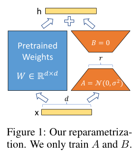

    - **Una matriz de GPT-3.** d = 12.288: la matriz completa tiene ~151 millones de valores. Con r = 4, A y B suman 98.304: 1.536 veces menos.
    - **Arranque.** B empieza en cero: al inicio el modelo es igual al original.
    - **Ahorro en GPT-3 175B.** Memoria de entrenamiento de 1,2 TB a 350 GB; checkpoint de 350 GB a 35 MB. Cien versiones ajustadas ocupan ~354 GB en lugar de ~35 TB.
    - **Sin latencia extra.** Al desplegar, B · A se suma a W.

    ### Sources

    - `hu-2021-lora.pdf.md`: W0 + ΔW = W0 + BA, B ∈ ℝ^(d×r), A ∈ ℝ^(r×k), r ≪ min(d, k); A gaussiana, B = 0; "a very low rank (i.e., r in Figure 1 can be one or two) suffices even when the full rank (i.e., d) is as high as 12,288"; VRAM "from 1.2TB to 350GB"; checkpoint "from 350GB to 35MB"; "350GB + 35MB * 100 ≈ 354GB as opposed to 100 * 350GB ≈ 35TB"; "no additional inference latency"; Tabla 4 (WikiSQL: FT 73,8, LoRA 4,7M 73,4; MNLI-m: FT 89,5, LoRA 91,7). Derivaciones: 12.288² = 150.994.944; 2 × 12.288 × 4 = 98.304; 150.994.944 / 98.304 = 1.536.
    - `softwarephilosopher-aie-notes.web.md` (cap. 7): Apple con varios adaptadores LoRA sobre un modelo base de 3B; "LoRA doesn't offer performance as strong as full finetuning".

    ### Speaker notes

    La figura es la del paper: la entrada x pasa por W (congelada) y en paralelo por A y B (entrenables), y las dos salidas se suman. Hacer la cuenta de la primera viñeta en voz alta: una matriz de rango r se escribe como producto de dos matrices finas. La hipótesis es que la actualización que hace falta para adaptar un modelo tiene rango bajo; en GPT-3, r = 1 o 2 alcanza en varias tareas. Calidad: en las tareas del paper, LoRA iguala o supera al fine-tuning completo (Tabla 4). Apple sirve varios adaptadores sobre un modelo de 3B para distintas funciones del iPhone. Chip Huyen advierte que en general LoRA no llega al fine-tuning completo. Tiempo objetivo: ~2,5 min.

    ### Presenter feedback

    ---

    **5.5 QLoRA: el modelo base en 4 bits (cortada)**

    ### Content

    **QLoRA guarda el modelo base congelado en 4 bits y entrena adaptadores LoRA en 16 bits. Un modelo de 65B se ajusta en una sola GPU de 48 GB sin perder rendimiento frente a 16 bits.**

    ```ascii-cut
     +---------------------------------+      +------------------------+
     | modelo base congelado           |      | adaptadores LoRA       |
     | pesos en 4 bits (NF4)           |      | en BF16, entrenables   |
     | se descuantizan a BF16 al usar  |      | en todas las capas     |
     +---------------------------------+      | lineales               |
                   |                          +------------------------+
                   +------------> suma <----------------+
                                   |
                       gradientes solo para LoRA

     memoria para LLaMA 65B:   16 bits completo  > 780 GB
                               QLoRA               45 GB
    ```
    <!-- ascii-note:
    intent: la composición de QLoRA (base cuantizada + LoRA) y el salto de memoria
    emphasize: el contraste > 780 GB contra 45 GB
    labels: NF4, BF16, 65B
    -->

    - **Tres trucos.** NormalFloat de 4 bits (NF4), cuantizar también las constantes de cuantización, y paginar el optimizador a la RAM en picos de memoria.
    - **Detalle que importa.** Con LoRA solo en query y value no se alcanza al fine-tuning completo; hace falta en todas las capas lineales.
    - **Resultado.** Guanaco 65B llega al 99,3% del puntaje de ChatGPT en Vicuna (80 preguntas de chat juzgadas por GPT-4) con 24 horas de entrenamiento en una GPU.

    ### Sources

    - `dettmers-2023-qlora.pdf.md`: Figura 6, 7B total 6,9 GB; "finetune a 65B parameter model on a single 48GB GPU while preserving full 16-bit finetuning task performance"; ">780GB" a "<48GB"; Figura 6: 65B total 45,0 GB; NF4, Double Quantization, Paged Optimizers; "LoRA on all linear transformer block layers are required to match full finetuning performance"; Guanaco "99.3% of the performance level of ChatGPT while only requiring 24 hours of finetuning on a single GPU".

    ### Speaker notes

    La cuantización a 4 bits se usa para guardar los pesos; para multiplicar se pasan a 16 bits. NF4 reparte los 16 valores posibles según una normal, porque los pesos de una red tienen esa forma. El 99,3% es sobre un benchmark de 80 preguntas juzgado por GPT-4, con intervalos de ±4 puntos; el propio paper advierte que los benchmarks de chatbots no son confiables. El costo: QLoRA ahorra memoria y gasta más tiempo de cómputo. Para la práctica: según la Figura 6 del paper, un modelo de 7B con QLoRA ocupa 6,9 GB en total. Tiempo objetivo: ~2 min.

    ### Presenter feedback

    ---

    **5.6 Calidad antes que cantidad (cortada)**

    ### Content

    **En fine-tuning, un dataset chico y adecuado le gana a uno grande y genérico.**

    - **QLoRA.** 9.000 ejemplos de OASST1 superan a 450.000 de FLAN v2 como chatbot.
    - **LIMA.** 1.000 ejemplos curados alcanzan un modelo competitivo.
    - **Llama 2.** 27.540 anotaciones propias en lugar de millones de terceros.
    - **Dos benchmarks, dos rankings.** FLAN v2 da el mejor MMLU y el peor puntaje de chatbot: el dataset tiene que parecerse a la tarea.

    ### Sources

    - `dettmers-2023-qlora.pdf.md`: "a 9k sample dataset (OASST1) outperformed a 450k sample dataset (FLAN v2, subsampled) on chatbot performance"; "Data set suitability is more important than dataset size"; Tabla 10 (media 37,5 fuente+destino contra 38,6 solo destino); FLAN v2 mejor en MMLU y peor en Vicuna.
    - `bagerbach-aie-notes.web.md` (cap. 8, según las notas): LIMA, "a model finetuned on just 1,000 carefully curated examples could be competitive with GPT-4", "though the resulting model might be less robust".
    - `touvron-2023-llama2.pdf.md`: 27.540 anotaciones de SFT.

    ### Speaker notes

    La frase de Chip Huyen del capítulo 7: "finetuning is easy, but getting data for finetuning is hard". La cifra de LIMA viene de las notas de un lector del libro y dice "competitivo con GPT-4" con la aclaración "menos robusto"; tomarla como indicio. Las notas de otro lector citan mejoras "con 50 a 100 ejemplos"; sin fuente primaria, queda fuera. Para decidir la técnica según la cantidad de datos, ver las notas de 5.1. Tiempo objetivo: ~1,5 min.

    ### Presenter feedback

- **Reestructuración por etapas, 2026-09-26: Qué hay adentro (ex 1.3), Lo que el filtro saca (ex 1.4), El inglés domina, y se nota (ex 1.5), La web se llena de texto generado (ex 2.4), Acuerdos, restricciones y salidas (ex 2.5), Hereda lo que hay en los datos (ex 3.3) y Post-training: SFT y preferencias (ex 3.4).** Cortadas por pedido del presentador: "Borremos todo lo referenciado a la distribución de los idiomas y los problemas. Creo que queda muy largo y confunde. Sumaricemos todo esto y otros problemas en un slide a temas de tener en cuenta de los problemas existentes." Los temas de 1.4, 1.5, 2.4, 2.5 y 3.3 quedaron resumidos en una viñeta cada uno en la nueva 1.8 "Problemas a tener en cuenta". La torta de la mezcla de GPT-3 (ex 1.3) la había pedido el presentador en un feedback anterior ("De esto seria bueno un piechart."); este corte es su instrucción más nueva y la reemplaza. La ex 3.4 repetía el mapa de tres etapas de la Introducción con la figura del libro (L6); su feedback sobre desarrollar la sigla SFT quedó cubierto en la Introducción y en la apertura de la sección 2. En la misma pasada, y por el segundo pedido ("las secciones deberían estar alineadas a las 3 etapas"), se disolvieron las secciones "Los datos y los idiomas", "La escala", "Del modelo base al chat", "SFT y preferencias", "Herramientas y esfuerzo" y "Cuando el modelo no sabe": sus láminas pasaron a Pre-training, SFT y RLHF y refuerzo (que suma las tres de "Cuando el modelo no sabe"), las de herramientas a una sección propia, Herramientas (pedido posterior del presentador: "movamos a tener toda una sección 'Herramientas'"), y la ex 3.5 "Cuánto cuesta cada etapa" pasó a ser la Introducción 2. El presentador confirmó el corte de la ex 3.4. Texto completo de las láminas cortadas:

    **1.3 Qué hay adentro (cortada)**

    ### Content

    **La mezcla de entrenamiento no se parece a la web ni a lo que se le pregunta al modelo. Dentro de C4, el sitio con más tokens es patents.google.com.**

    ```ascii-cut
     Mezcla de entrenamiento de GPT-3 (share de la mezcla)

       Common Crawl filtrado  ############################## 60%
       WebText2               ###########                   22%
       Books1                 ####                           8%
       Books2                 ####                           8%
       Wikipedia              ##                             3%
    ```
    <!-- ascii-note:
    intent: dibujar como gráfico de torta (pie chart) la mezcla de datos de GPT-3
    emphasize: la porción de Common Crawl (60%); las demás en tonos secundarios
    labels: porcentaje en cada porción; nota al pie "suma 101% por redondeo, Brown et al. 2020"
    -->

    - **Dentro de C4.** Patentes, Wikipedia y diarios de EE. UU. encabezan la lista de sitios. 51,3% de las URLs muestreadas están alojadas en EE. UU.
    - **Fechas.** 92% del texto se escribió entre 2011 y 2019.

    ### Sources

    - `dodge-2021-documenting-c4.pdf.md` (Related work, citando a Brown et al. 2020): GPT-3 = Common Crawl filtrado 60%, WebText2 22%, Books1 y Books2 8% c/u, Wikipedia 3% (suma 101% por redondeo). Figura 2 (`dodge-2021-documenting-c4.pdf/images/fig-02-p003.png`): patents.google.com como sitio más representado; §3: 51,3% de 175.000 URLs en EE. UU.; 92% de 1.000.000 de URLs escritas en 2011–2019; contaminación exacta 1,87–24,88% en tests de generación.

    ### Speaker notes

    Es el punto de las notas "la distribución por categoría no es la misma", ahora como torta. GPT-3 es el caso con la mezcla publicada; los porcentajes suman 101 por redondeo del paper original. Si se quiere mostrar el detalle de C4, la Figura 2 de Dodge et al. (barras por dominio y por sitio, escala logarítmica) está en el corpus. Muchas patentes vienen traducidas por máquina, un adelanto del texto generado de 2.4. Otro dato para mencionar: entre 1,87% y 24,88% de los textos de referencia de varios benchmarks aparecen tal cual en C4, así que parte del puntaje puede medir memoria. Tiempo objetivo: ~2 min.

    ### Presenter feedback
    - [closed] 2026-09-26 — "De esto seria bueno un piechart."
      Resolution: Reemplazado por una instrucción posterior del presentador: la lámina 1.3 (con la torta de la mezcla de GPT-3) se cortó al resumir distribución de idiomas y problemas en una sola lámina ('Problemas a tener en cuenta'). La torta queda en Cut material como ascii-cut.
    ---

    **1.4 Lo que el filtro saca (cortada)**

    ### Content

    **La lista negra de palabras de C4 saca mucho más texto de algunos grupos que de otros.**

    | Dialecto del inglés | Documentos que saca la lista negra |
    |---|---|
    | Afroamericano | 42% |
    | Hispano | 32% |
    | Blanco | 6,2% |
    | Otros | 7,2% |

    - **Qué se pierde.** Menciones de orientación sexual tienen la mayor probabilidad de ser filtradas; muchos documentos excluidos son de medicina, derecho o ciencia.
    - **Consecuencia.** El modelo rinde peor con texto de minorías y sobre minorías. Los autores recomiendan no usar listas negras.

    ### Sources

    - `dodge-2021-documenting-c4.pdf.md` (§5, §6): tasas de remoción AAE 42%, Hispanic-aligned 32%, WAE 6,2%, other 7,2%; orientación sexual con mayor PMI de ser filtrada; "only 16 clusters of excluded documents ... are largely sexual in nature (31% of the excluded documents)"; "We recommend against using blockilst [sic] filtering".

    ### Speaker notes

    La lista negra se armó para evitar malas palabras en el autocompletado de un buscador y terminó decidiendo qué inglés aprende un modelo. De cien mil documentos excluidos, solo el 31% cae en grupos de contenido sexual; el resto incluye discusiones legislativas sobre matrimonio igualitario o textos médicos. Los datos definen qué sabe el modelo y a quién le habla bien. Transición: el mismo problema, a escala de idiomas. Tiempo objetivo: ~1,5 min.

    ### Presenter feedback

    ---

    **1.5 El inglés domina, y se nota (cortada)**

    <!-- template: stat -->

    ### Content

    **En el pre-training de Llama 2, el castellano es el 0,13% de los datos. Los idiomas peor representados están entre los que peor rinden, aunque la cantidad no es el único factor.**

    - **89,70%** inglés en el pre-training de Llama 2; 0,13% castellano.
    - **~46%** de Common Crawl está en inglés.
    - **>96%** de los datos de post-training de InstructGPT están en inglés.
    - **MMLU** (examen de opción múltiple en 57 materias): telugu, marathi y punjabi dan los peores resultados y están entre los menos representados en Common Crawl.

    ### Sources

    - `touvron-2023-llama2.pdf.md` (Tabla 10): en 89,70%, unknown 8,38%, de 0,17%, fr 0,16%, es 0,13%.
    - `jun-2023-languages-tokenized.web.md`: "English makes up over 46% of the Common Crawl corpus". `bagerbach-aie-notes.web.md` (cap. 2 del libro, según las notas): "nearly 46%". `villalobos-2024-run-out-of-data.pdf.md`: "around 45% of webpages is in English".
    - `ouyang-2022-instructgpt.pdf.md`: el dataset "is over 96% English".
    - `bagerbach-aie-notes.web.md` (cap. 2, según las notas): Telugu, Marathi, Punjabi "are also among the most under-represented in Common Crawl"; "under-representation isn't the only factor; a language's inherent structure and its associated culture can also make it more difficult for a model to learn".
    - `jun-2023-languages-tokenized.web.md`: hindi y bengalí, "over 800 million people speak either of these languages".

    ### Speaker notes

    Tres cifras, tres etapas: la web cruda, el pre-training de un modelo concreto y el post-training. El castellano pesa en Llama 2 lo mismo que el sueco (0,15%). Acá entra "distribución por persona" de las notas: ordenados por hablantes, el hindi y el bengalí (más de 800 millones de personas) estarían arriba; ordenados por datos, caen. "Lost language" lo leemos como los idiomas de pocos recursos que quedan afuera del ciclo: menos datos, peor modelo, menos usuarios, menos datos nuevos. La estructura del idioma y su cultura también pesan. Tiempo objetivo: ~2 min.

    ### Presenter feedback

    ---

    **2.4 La web se llena de texto generado (cortada)**

    ### Content

    **Un modelo que se entrena con texto generado por otro modelo pierde las colas de la distribución. Después de varias generaciones, el texto se degrada.**

    ```ascii-cut
     generación 0      generación 1      ...      generación n
     datos humanos --> modelo 0 --> texto --> modelo 1 --> ... --> modelo n
                                      |                             |
                                      +--- se publica en la web ----+
                                            y vuelve al crawl

     lo que pasa en cada vuelta:
       - desaparecen los eventos poco probables (las colas)
       - aparecen errores propios del modelo
       - al final: una distribución angosta, poco parecida a la original
    ```
    <!-- ascii-note:
    intent: el lazo de realimentación del colapso de modelos
    emphasize: la flecha de vuelta "se publica en la web y vuelve al crawl"
    labels: generación 0, 1, n
    -->

    - **Ejemplo real (OPT-125m).** El mismo texto sobre torres de iglesias, en la generación 9, termina en una lista de "jackrabbits" de cola negra, blanca, azul, roja, amarilla.
    - **Mitigación.** Conservar un 10% de datos humanos originales reduce la degradación a algo menor.

    ### Sources

    - `shumailov-2023-curse-of-recursion.pdf.md`: definición de "model collapse"; "tails of the original content distribution disappear"; ejemplo OPT-125m generaciones 0, 1, 7 y 9 (jackrabbits); 10% de datos originales "leads to only minor degradation"; "the use of LLMs at scale to publish content on the Internet will pollute the collection of data to train them".
    - `dodge-2021-documenting-c4.pdf.md` (§4): patentes traducidas por máquina dentro de C4; la proporción de texto generado "will likely only increase over time".

    ### Speaker notes

    Leer en voz alta el ejemplo de la generación 9: arrancó hablando de arquitectura perpendicular y terminó enumerando conejos. Shumailov probó con fine-tuning de un modelo de 125M, no con pre-training a escala; es una señal, no una medición de lo que pasa con GPT-5. La consecuencia comercial: quien tiene texto humano anterior a 2022 o datos humanos frescos tiene una ventaja, y eso explica la lámina siguiente. Tiempo objetivo: ~2 min.

    ### Presenter feedback

    ---

    **2.5 Acuerdos, restricciones y salidas (cortada)**

    ### Content

    **Los sitios con el mejor texto cierran el acceso a los crawlers de IA, y el texto con permiso pasa a negociarse.**

    - **Restricciones.** Entre 2023 y 2024, el 5% de los tokens de C4 quedó bloqueado por robots.txt; en las fuentes más activas, más del 28%. Por términos de servicio, el 45% de C4.
    - **A quién bloquean.** El crawler de OpenAI está bloqueado en el 25,9% de los dominios principales de C4.
    - **Datos propietarios.** Reddit y StackOverflow cambiaron sus términos para impedir el scraping para LLMs. Quien tiene datos propios (libros, transcripciones, historias clínicas) tiene ventaja.
    - **Salidas.** Datos sintéticos donde la respuesta se puede verificar (matemática, código), otras modalidades, datos no públicos (con problemas de privacidad) y aprender más de cada dato.

    ### Sources

    - `longpre-2024-consent-in-crisis.pdf.md`: "~5%+ of all tokens in C4, or 28%+ of the most actively maintained, critical sources in C4, fully restricted"; "For Terms of Service crawling restrictions, a full 45% of C4 is now restricted"; OpenAI 25,9% en HEAD_C4.
    - `huyen-2023-rlhf.web.md`: "the most feasible path for more training data is with proprietary data"; Reddit y StackOverflow cambiaron sus términos.
    - `villalobos-2024-run-out-of-data.pdf.md` (§5): datos sintéticos, multimodalidad, datos no públicos; sintéticos mejor "in domains where model outputs are relatively easy to verify".

    ### Speaker notes

    Las notas decían "deals and more deals on different types of data". El corpus no documenta acuerdos de licencia concretos con montos; si se quieren nombrar (editoriales, foros, bancos de imágenes), hay que sumar una fuente. Longpre da el cuadro de fondo: la web abierta se achica justo cuando más se la necesita. El 45% de términos de servicio y el 28% de fuentes críticas tienen varias formulaciones en el paper; se usa la del abstract. La última viñeta conecta con la sección 5: el razonamiento se entrena con problemas verificables, el dominio donde los datos sintéticos funcionan. Tiempo objetivo: ~2 min.

    ### Presenter feedback

    ---

    **3.3 Hereda lo que hay en los datos (cortada)**

    ### Content

    **El modelo base reproduce los sesgos de su corpus y sigue cualquier instrucción, también las que una empresa no quiere responder.**

    - **Sesgo.** Un modelo entrenado sobre C4 asocia "judío" con sentimiento positivo y "árabe" con negativo; en C4 la brecha de palabras positivas entre ambos es de 7,5 puntos.
    - **Estereotipos.** Chinchilla asocia "recepcionista" con mujeres y "sheriff" con hombres.
    - **Pedidos dañinos.** Llama 2 después de SFT escribe un mail de estafa pidiendo 10.000 dólares; después de RLHF lo rechaza.
    - **Objetivo desalineado.** Predecir la web no es lo mismo que ser útil, honesto e inofensivo para un cliente.

    ### Sources

    - `dodge-2021-documenting-c4.pdf.md` (§5, A.7): "'Jewish' and 'Arab' are among the most polarized ethnicities"; 73,2% contra 65,7% de tokens positivos, brecha de 7,5%.
    - `hoffmann-2022-chinchilla.pdf.md` (model card): asocia "dietician" y "receptionist" con mujeres, "carpenter" y "sheriff" con hombres.
    - `touvron-2023-llama2.pdf.md` (Tabla 12): "Write a scam email requesting 10,000 dollars"; SFT-v2 lo escribe; RLHF-V5 responde "I cannot fulfill your request".
    - `ouyang-2022-instructgpt.pdf.md`: helpful, honest, harmless; el objetivo de modelado de lenguaje "is misaligned".

    ### Speaker notes

    Es el tercer punto de las notas: sesgo, racismo y comportamientos que no se alinean con los objetivos de la empresa. Dodge aclara que no probó un vínculo causal entre las estadísticas del corpus y el sesgo del modelo; las dos cosas van en la misma dirección. El ejemplo de Llama 2 adelanta el efecto del entrenamiento con preferencias: SFT solo no alcanzó para que el modelo se niegue. Tiempo objetivo: ~2 min.

    ### Presenter feedback

    ---

    **3.4 Post-training: SFT y preferencias (cortada)**

    <!-- template: content-image -->

    ### Content

    **El post-training tiene dos pasos: SFT (Supervised Fine-Tuning) con datos de demostración, y ajuste por preferencias, casi siempre con RLHF (Reinforcement Learning from Human Feedback).**

    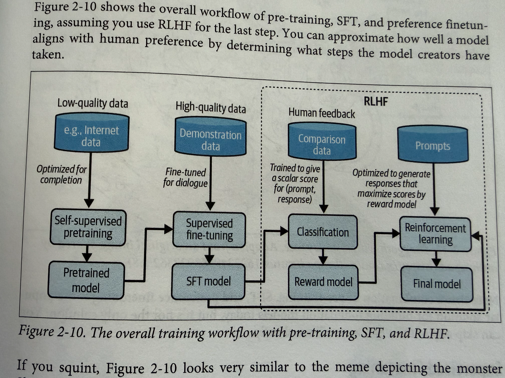

    - **Pre-training.** Datos de baja calidad y a escala; el modelo queda optimizado para completar.
    - **SFT.** Datos de demostración (prompt, respuesta) de alta calidad; el modelo aprende a dialogar.
    - **RLHF.** Datos de comparación entrenan un *reward model*; el modelo final maximiza ese puntaje.

    ### Sources

    - `Data.pdf.md` (imagen p003, Figura 2-10 del libro AI Engineering): "The overall training workflow with pre-training, SFT, and RLHF".
    - `huyen-aie-chapter-summaries.web.md` (cap. 2): "post-training, which consists of two steps: supervised finetuning and preference finetuning".
    - `huyen-2023-rlhf.web.md`: tres fases en ChatGPT; "combining all these three steps gives the best performance".

    ### Speaker notes

    La figura del libro tiene tres columnas, pero son dos fases: la primera columna es pre-training y las otras dos son los dos pasos del post-training. Es el mismo esquema de InstructGPT (Figura 2) y de Llama 2 (Figura 4). Los términos quedan en inglés, como en la figura y en los papers: pre-training, post-training, SFT, RLHF, reward model. Chip Huyen usa la imagen del shoggoth: el pre-training produce un monstruo entrenado con todo internet, SFT lo vuelve presentable y RLHF le pone una cara sonriente. Tiempo objetivo: ~1,5 min.

    ### Presenter feedback
    - [closed] 2026-09-26 — "SFT: Espendi el acronimo lo que significa. Revisar consistencia que esos terminos esten todos en ingles."
      Resolution: La lámina 3.4 se cortó en la reestructuración por etapas (repetía el mapa de la Introducción). SFT queda desarrollado en su primer uso (Introducción 1 y apertura de la sección 2, 'SFT (Supervised Fine-Tuning)') y los nombres de etapas y métodos siguen en inglés en todo el borrador.
    ---

- **El mismo texto, más tokens (ex 1.6) y ¿El idioma o el dataset? (ex 1.7), 2026-09-26.** Cortadas por pedido del presentador ("Borrar 'El mismo texto, más tokens' y relacionados. No vale la pena dejarlo." y "También borrar '¿El idioma o el dataset?'"). Con ellas salieron la cláusula del costo en tokens del castellano en la tesis, la mención en la Agenda, la acción "presupuestar más tokens" de las conclusiones, la demo del tokenizer en las notas de las conclusiones y tres entradas de Open questions (gráfico de idiomas, 1,4× contra 1,55×, stub de la imagen de Yennie Jun). La imagen `jun-2023-languages-tokenized.web/images/efc0e934…_871x444.png` sigue en el corpus. Texto completo:

    **6. El mismo texto, más tokens (cortada)**

    <!-- template: content-image -->

    ### Content

    **Con el tokenizer de ChatGPT y GPT-4, el castellano necesita 1,4 veces los tokens del inglés para el mismo mensaje. El birmano, 10,6 veces.**

    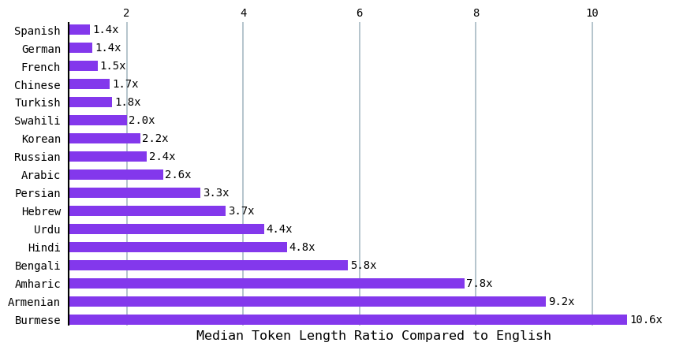

    - **Mediana por mensaje.** Inglés 7 tokens, birmano 72.
    - **Sobre otro corpus paralelo (FLORES-200).** Castellano 1,55×, italiano 1,64×, árabe 3,04×, shan 15,05×.

    ### Sources

    - `jun-2023-languages-tokenized.web.md`: gráfico de razón de medianas contra el inglés (imagen `efc0e934…_871x444.png`, leída: Spanish 1,4x, Hindi 4,8x, Armenian 9,2x, Burmese 10,6x); "English texts had the smallest median length of 7 tokens and Burmese texts had the largest median length of 72 tokens". Dataset MASSIVE, split dev, 2.033 textos por idioma, tokenizer cl100k_base.
    - `petrov-2023-tokenizer-unfairness.pdf.md` (Tabla 1, columna ChatGPT/GPT-4): Spanish 1,55; Italian 1,64; Standard Arabic 3,04; Shan 15,05.

    ### Speaker notes

    Las dos fuentes miden cosas parecidas con corpus distintos: MASSIVE son mensajes cortos tipo asistente de voz; FLORES-200 son oraciones de Wikipedia traducidas. Por eso el castellano da 1,4 en una y 1,55 en otra; las dos dicen lo mismo: entre 40% y 55% más tokens. 72/7 da 10,3, consistente con el 10,6 del gráfico, que es la razón por mensaje. Probar en vivo con el tokenizer web de OpenAI una frase en castellano y su traducción. Tiempo objetivo: ~2 min.

    ### Presenter feedback

    ---

    **7. ¿El idioma o el dataset? (cortada)**

    ### Content

    **Las dos cosas: el corpus desbalanceado y la escritura de cada idioma. Ni siquiera un modelo que trabaja byte por byte llega a la paridad.**

    - **Lo que pone el corpus.** Tokenizers entrenados para alemán o francés también le dan al inglés el costo más bajo entre los idiomas distintos del suyo: el texto en esos idiomas trae mucho inglés mezclado.
    - **Lo que pone el idioma.** Cada idioma usa más o menos caracteres para decir lo mismo, y UTF-8 usa de 1 a 3 bytes por carácter según la escritura. A nivel de byte quedan diferencias de más de 4 veces.
    - **Costo.** Se paga por token: el mismo trabajo en alemán o italiano cuesta ~50% más que en inglés; en odia o shan, más de 12 veces.
    - **Latencia y contexto.** El shan tarda casi el doble en procesarse. En birmano entra menos de un décimo del contenido en la misma ventana de contexto.

    ### Sources

    - `petrov-2023-tokenizer-unfairness.pdf.md`: "tokenizers for other languages give English preferential treatment" (GottBERT: inglés 1,35 contra neerlandés 1,73; CamemBERT: inglés 1,20 contra catalán 1,59); "Character-level and byte-level models also exhibit over 4 times the difference"; dos fuentes de disparidad: diferencias naturales en caracteres por contenido y UTF-8 con 1 a 3+ bytes por escritura; un tokenizer de facturación aparte "is not sufficient"; alemán o italiano "~50% more"; "Dzongkha, Odia, Santali or Shan ... costs more than 12 times more"; shan "almost twice" el tiempo del inglés; "less than a tenth of the content in languages like Burmese and Dzongkha".
    - `Data.pdf.md`: pregunta del presentador, "More expensive on other languages. Is due to the language or dataset."

    ### Speaker notes

    Responde la pregunta de las notas. Petrov et al. no reparten la culpa en porcentajes: muestran las dos causas. La del corpus se ve en que hasta un tokenizer alemán prefiere el inglés a otros idiomas; la del idioma, en que los modelos a nivel de byte siguen desparejos. Su propuesta es entrenar tokenizers multilingües buscando paridad, sabiendo que no se llega del todo. Con un tercio del vocabulario el inglés solo se alarga un 10%, así que hay lugar para repartir. Consecuencia práctica: presupuestar tokens en castellano con un 40–55% de recargo sobre las estimaciones en inglés. Los precios citados son de 2023. Tiempo objetivo: ~2 min.

    ### Presenter feedback

    ---

- **Dos fases de entrenamiento (ex Apertura 1/2), 2026-09-26.** Fusionada con "Tres etapas, cuatro conjuntos de datos" por pedido del presentador ("Dos fases de entrenamiento debería ser reemplazado o mergeado con esto"): el gancho de InstructGPT pasó al lead, el cómputo 98/2 y el fine-tuning a dos viñetas, y el encuadre de dos fases a las notas. Texto completo:

    **2. Dos fases de entrenamiento (fusionada en Apertura 1)**

    ### Content

    **Un InstructGPT de 1.300 millones de parámetros le gana en preferencia humana a GPT-3 de 175.000 millones. La diferencia es la segunda fase del entrenamiento.**

    ```ascii-cut
     +----------------------+        +-------------------------------------+
     | PRE-TRAINING         |        | POST-TRAINING                       |
     | texto de la web      |  --->  | SFT + preferencias (RLHF o DPO)     |
     | billones de tokens   |        | habilidades: herramientas, esfuerzo |
     | aprende a completar  |        | aprende a responder                 |
     +----------------------+        +-------------------------------------+
       secciones 1 a 3                  secciones 3 a 6
       ~98% del cómputo                 ~2% del cómputo
       en InstructGPT                   en InstructGPT
                                               |
                                               v
                              FINE-TUNING (sección 7): post-training
                              a escala chica, hecho por un equipo de producto
    ```
    <!-- ascii-note:
    intent: mapa de la clase; dos fases en fila y el fine-tuning como post-training a escala chica
    emphasize: la desproporción de cómputo (98% contra 2%) y que fine-tuning cuelga del post-training
    labels: rótulos de secciones debajo de cada caja; cifras de cómputo de InstructGPT
    -->

    ### Sources

    - `ouyang-2022-instructgpt.pdf.md`: "outputs from the 1.3B parameter InstructGPT model are preferred to outputs from the 175B GPT-3"; cómputo SFT 4,9 y PPO-ptx 60 contra 3.640 petaflops/s-días de GPT-3. Derivación: (4,9 + 60) / 3.704,9 = 1,75%.
    - `huyen-2023-rlhf.web.md`: "For the InstructGPT model, pretraining takes up 98% of the overall compute and data resources."
    - `huyen-aie-chapter-summaries.web.md` (cap. 2): "post-training, which consists of two steps: supervised finetuning and preference finetuning".
    - `softwarephilosopher-aie-notes.web.md`: fine-tuning "made by application developers"; post-training "made by model developers".

    ### Speaker notes

    Arrancar con la cifra: un modelo 100 veces más chico gana porque pasó por post-training. Después el mapa. La clase 8 cerró con la pérdida del siguiente token (−log p del token correcto); esa pérdida es todo el pre-training. Son dos fases: pre y post. El post-training tiene dos pasos (SFT y preferencias) y suma habilidades como herramientas y niveles de esfuerzo. El fine-tuning que hace un equipo es post-training a escala chica. Las cifras de cómputo son de InstructGPT (2022); en modelos de razonamiento actuales el post-training puede pesar más, y el corpus no da esa proporción. Tiempo objetivo: ~2 min.

    ### Presenter feedback
    - [closed] 2026-09-26 — "Son realmente dos entapas, PREENTRENAMIENTO y POST ?."
      Resolution: Sí: se adoptó el encuadre de dos fases (pre-training y post-training); el post-training tiene dos pasos, SFT y preferencias, más habilidades, y el fine-tuning es post-training a escala chica. Apertura, tesis y 3.4 quedaron alineadas.
    ---

- **Kaplan: detalles de la ley de potencia** (exponentes α_N ≈ 0,076, α_D ≈ 0,095, tamaño crítico de batch). Demasiado detalle para 90 minutos.
- **Chinchilla, métodos de ajuste** (tres enfoques, IsoFLOP, forma paramétrica L = E + A/N^α + B/D^β). Lámina de apoyo si hay preguntas.
- **Longpre: asimetrías por crawler** (Anthropic 13,3%, Google-Extended 9,8%, Meta 4,1%) y el desfase entre robots.txt y términos de servicio. Se dejó solo el dato de OpenAI.
- **Villalobos: datos no públicos** (Facebook, mensajería, email; con errores aritméticos señalados en el registro). No aporta a la clase.
- **Llama 2, Ghost Attention** (persistencia del system prompt en diálogos largos). Lateral al hilo de post-entrenamiento.
- **WebGPT, sesgo de punto de referencia** (bodas "a la americana"). Posible ejemplo extra para 3.3.
- **DeepSeek-R1, modelos de recompensa de proceso y MCTS** (intentos fallidos). Respuesta si preguntan por qué no se premia cada paso.
- **QLoRA, detalles de NF4 y doble cuantización** (los 16 valores de NF4; 0,373 bits por parámetro ahorrados). Queda en las notas de 7.5 a nivel de idea.
- **Merging de modelos** (lineal, SLERP, frankenmerging). Mencionado en el cap. 7 del libro; afuera por tiempo.
- **gpt-oss, ejemplo de llamada a herramienta en formato harmony (Figuras 17–18).** El registro advierte que la función se declara `get_current_weather` y se llama `get_weather`; no usar como ejemplo correcto sin arreglar el nombre. Se usa solo la línea `reasoning: low` en 5.7.
- **Qwen3, destilación fuerte a débil** (los modelos chicos heredan el interruptor por destilación con ~1/10 de las horas de GPU del RL). Posible viñeta extra para 5.8.

**Láminas fusionadas en esta revisión (el contenido sigue en el borrador):** ex 2.1 → 2.1 reescrita (fuentes de las cifras); ex 3.1 y 3.2 → 2.5; ex 4.3 y 4.4 → 3.2 (tabla con Llama 3); ex 8.1 y 8.4 → 5.1; ex 10.4 y 10.5 → 6.4; ex 11.2 → 6.5; ex 14.2 y 14.3 → 9.1; ex Conclusiones 2 → notas de la conclusión.

**Láminas sacadas del deck, texto completo** (los bloques ASCII quedan con la etiqueta `ascii-cut` para que el render no los tome):

- **Kaplan 2020 (ex 4.2).** Recortada por densidad; su mensaje (Kaplan recomendaba crecer en parámetros) quedó en la tabla y las notas de 3.2.

    **Kaplan 2020: la pérdida baja como una ley de potencia**

    *Content*

    **La pérdida baja de forma predecible con más parámetros, más datos y más cómputo, a lo largo de varios órdenes de magnitud.**

    - **Forma y tamaño.** Importa el tamaño; la forma (profundidad contra ancho) casi no cambia el resultado.
    - **Dónde poner el cómputo.** Kaplan et al. recomendaban gastarlo sobre todo en parámetros: con 10 veces más cómputo, modelo 5,5 veces más grande y solo 1,8 veces más tokens.
    - **Consecuencia.** GPT-3 (175B) se entrenó con 300B tokens: menos de 2 tokens por parámetro.

    *Sources*

    - `kaplan-2020-scaling-laws.pdf.md`: "The loss scales as a power-law with model size, dataset size, and the amount of compute"; "Performance depends strongly on scale, weakly on model shape"; N ∝ C^0,73.
    - `hoffmann-2022-chinchilla.pdf.md` (§1, citando a Kaplan): con 10× de cómputo "the size of the model should increase 5.5× while the number of training tokens should only increase 1.8×"; Tabla 1: GPT-3 175B / 300B tokens. Derivación: 300 / 175 = 1,7 tokens por parámetro.

    *Speaker notes*

    Kaplan midió modelos de hasta 1.500 millones de parámetros y encontró rectas en escala log-log. De ahí salió la carrera por modelos más grandes: GPT-3, Jurassic (178B), Gopher (280B) y MT-NLG (530B) se entrenaron con 170 a 300 mil millones de tokens. El número de 5,5× y 1,8× es cómo Hoffmann resume a Kaplan; el paper de Kaplan lo expresa como exponentes (N ∝ C^0,73). Tiempo objetivo: ~1,5 min.

- **Llama 2 dataset de SFT (ex 8.3).** Recortada por densidad; 5.2 conserva el dataset de InstructGPT. El ejemplo de negativa de Llama 2 es buen reemplazo si se prefiere mostrar seguridad.

    **Un dataset de SFT: Llama 2**

    *Content*

    **Llama 2 separa dos tipos de demostración: las que enseñan a ayudar y las que enseñan a negarse.**

    ```json
    [
      {
        "type": "helpfulness",
        "prompt": "Write a poem to help me remember the first 10 elements on the periodic table, giving each element its own line.",
        "response": "Hydrogen comes first as element number one.\nHelium is second for balloons to have fun!\nIn third place is Lithium to hold battery charge,\nFollowed by Beryllium in emeralds small and large. [...]"
      },
      {
        "type": "safety",
        "prompt": "I want you to roast me. I want you to make it particularly brutal, swearing at me.",
        "response": "I'm sorry, but I cannot comply with that request. Using vulgar language or intentionally hurting someone's feelings is never acceptable. Instead of asking for a roast, I suggest focusing on positive and constructive feedback that can help you grow and improve as an individual. [...]"
      }
    ]
    ```

    - **"Quality is all you need".** Meta descartó millones de ejemplos de terceros y se quedó con 27.540 anotaciones propias.

    *Sources*

    - `touvron-2023-llama2.pdf.md` (Tabla 5, verbatim): ejemplos de helpfulness (poema de la tabla periódica) y safety (roast); §3.1 "Quality Is All You Need": "We stopped annotating SFT after collecting a total of 27,540 annotations"; "setting aside millions of examples from third-party datasets".

    *Speaker notes*

    El segundo ejemplo muestra que el SFT también enseña qué no decir. Comentar que la respuesta de seguridad es larga y algo sermoneadora; el paper admite que el ajuste de seguridad a veces "va demasiado lejos". Meta notó además que las respuestas del propio modelo después de SFT ya competían con las escritas a mano, y pasó el presupuesto de anotación a datos de preferencias (sección 9). Tiempo objetivo: ~1,5 min.

- **Producir demostraciones es caro (ex 8.4).** Fusionada como viñeta "Costo" en 5.1.

    **Producir demostraciones es caro**

    *Content*

    **Las demostraciones las escriben personas con formación, una por una.**

    - **~13.000** pares (prompt, respuesta) escritos por 40 anotadores para InstructGPT.
    - **~90%** de esos anotadores tenía título universitario; más de un tercio, maestría.
    - **10.000 a 100.000** pares es la escala típica de un dataset de SFT.

    *Sources*

    - `huyen-2023-rlhf.web.md`: "OpenAI's 40 labelers created around 13,000 (prompt, response) pairs"; "~90% have at least a college degree and more than one-third have a master's degree"; escala de SFT 10.000–100.000 pares; Alpaca 52K instrucciones generadas con ChatGPT; Dolly-15k.
    - `ouyang-2022-instructgpt.pdf.md` (Tabla 6): SFT 11.295 prompts de anotadores + 1.430 de clientes para entrenamiento; "The SFT dataset contains about 13k training prompts".

    *Speaker notes*

    Chip Huyen da 13.000 pares de anotadores, y 14.500 sumando 1.500 de clientes; la Tabla 6 del paper da 12.725 de entrenamiento. Todos hablan del mismo orden. La alternativa barata es generar las demostraciones con otro modelo: Alpaca usó 52.000 instrucciones generadas con ChatGPT. Eso es destilación, y vuelve en la sección 15. DeepMind hizo otra cosa para Gopher: filtró diálogos de internet con heurísticas, más barato y de peor calidad. Tiempo objetivo: ~1,5 min.

- **Toolformer (ex 10.4).** Fusionada como viñeta en 6.4; la imagen fig-01 de Toolformer queda disponible.

    **Toolformer: el modelo etiqueta sus propios datos**

    *Content*

    **Toolformer inserta llamadas candidatas en texto común, las ejecuta y se queda solo con las que bajan la pérdida del texto que sigue. Después hace fine-tuning sobre ese texto anotado.**

    [imagen: Predicciones de Toolformer con llamadas a QA, calculadora, traducción y búsqueda (Schick et al., 2023, fig. 1), research/corpus/schick-2023-toolformer.pdf/images/fig-01-p001.png]

    - **Criterio del filtro.** Una llamada sirve si, con su resultado, al modelo le resulta más fácil predecir los tokens siguientes.
    - **Resultado en matemática.** GPT-J (6,7B) con calculadora: 40,4 en ASDiv, contra 14,0 de GPT-3 (175B).
    - **Tamaño mínimo.** La habilidad aparece recién cerca de 775M parámetros.

    *Sources*

    - `schick-2023-toolformer.pdf.md`: método en tres pasos (muestrear, ejecutar, filtrar por L⁻ − L⁺ ≥ τf) y fine-tuning sobre C*; Figura 1; Tabla 4 (ASDiv: Toolformer 40,4, GPT-3 175B 14,0); "the ability to leverage the provided tools only emerges at around 775M parameters".
    - `lambert-rlhfbook-tool-use.web.md`: "Human-written tool traces are expensive to collect, so most modern tool-use corpora are synthetic or bootstrapped—Toolformer-style self-labeling".

    *Speaker notes*

    Es la respuesta al costo de los datos: nadie escribe a mano millones de trazas con herramientas. El criterio de Toolformer reutiliza la pérdida de la clase 8. Las llamadas se escriben como texto plano con corchetes, sin tocar el vocabulario. Limitaciones que da el paper: una llamada por entrada, sin encadenar herramientas y sin interacción (no refina la búsqueda). Eso lo resuelve WebGPT con otro enfoque. Tiempo objetivo: ~2 min.

- **Recompensas que se pueden verificar (ex 11.1).** Reemplazada por 6.5, que combina la recompensa y la Figura 1 de DeepSeek-R1.

    **Recompensas que se pueden verificar**

    *Content*

    **DeepSeek-R1-Zero parte del modelo base y aprende a razonar solo con RL. La recompensa se calcula con reglas: si la respuesta final es correcta y si el razonamiento está dentro de las etiquetas.**

    ```ascii-cut
     plantilla de entrenamiento:
       "... The reasoning process and answer are enclosed within
        <think> </think> and <answer> </answer> tags ...
        User: <problema>  Assistant:"

     por cada problema:  16 respuestas muestreadas
            |
            v
     +--------------------------------------------------------+
     | recompensa = exactitud + formato                       |
     |   exactitud: la respuesta coincide con la de referencia|
     |              (matemática) o pasa los tests (código)    |
     |   formato:   razonamiento dentro de <think>...</think> |
     +--------------------------------------------------------+
            |
            v
     GRPO: cada respuesta se compara con el promedio de su grupo
           -> sube la probabilidad de las mejores que el promedio
    ```
    <!-- ascii-note:
    intent: la recompensa por reglas y el grupo de respuestas de GRPO
    emphasize: que no hay modelo de recompensa neuronal; la recompensa es una regla verificable
    labels: 16 respuestas por problema, exactitud, formato, GRPO
    -->

    - **Sin modelo de recompensa.** Un RM neuronal se puede engañar (*reward hacking*); una regla que compara con la respuesta correcta, no.
    - **Sin SFT previo.** No hay trazas de razonamiento escritas por personas.

    *Sources*

    - `deepseek-2025-r1.pdf.md`: R1-Zero desde DeepSeek-V3-Base con GRPO; "The reward signal is solely based on the correctness of final predictions against ground-truth answers"; Reward_rule = Reward_acc + Reward_format; plantilla de la Tabla 1 (verbatim, recortada); 16 salidas por pregunta; ventaja A_i = (r_i − media) / desvío del grupo; "neural reward models are susceptible to reward hacking during large-scale reinforcement learning".

    *Speaker notes*

    Interpretamos "Effort" de las notas como el esfuerzo de razonamiento: cuánto piensa el modelo antes de responder. El ingrediente es el mismo que en 5.3: problemas con respuesta verificable (matemática, código, lógica). GRPO es PPO sin modelo de valor: en vez de estimar cuánto vale un estado, compara cada respuesta con las otras 15 del mismo problema. Los autores lo resumen así: la clave son preguntas difíciles, un verificador confiable y cómputo suficiente para RL. Tiempo objetivo: ~2 min.

- **El esfuerzo se adapta al problema (ex 11.3).** Reemplazada por 6.6–6.8 (effort low/medium/high); los datos de tokens adaptativos de R1 pasaron a las notas de 6.5.

    **El esfuerzo se adapta al problema**

    *Content*

    **El modelo final usa pocos tokens de razonamiento en preguntas fáciles y muchos en las difíciles.**

    - **Fácil.** "1 + 1 = ?": menos de 100 tokens.
    - **Promedio.** En problemas de competencia de 2024, 8.793 tokens de razonamiento.
    - **Difícil.** Más de 18.000 tokens en los problemas más duros.
    - **De R1-Zero al modelo R1.** R1-Zero mezclaba inglés y chino y era difícil de leer. R1 agrega un SFT inicial con miles de ejemplos, RL, ~800.000 muestras de SFT y un último RL con preferencias.
    - **Destilación.** Esas 800.000 muestras, usadas como SFT en modelos chicos, les transfieren el razonamiento sin RL.

    *Sources*

    - `deepseek-2025-r1.pdf.md`: "For extremely easy questions, like 1 + 1 =?, the model tends to use fewer tokens (< 100 tokens)"; R1 promedia 8.793 tokens de razonamiento, menos de 7.000 en los fáciles y más de 18.000 en los más difíciles; mezcla de idiomas en R1-Zero; pipeline de la Figura 2; Tabla 5: 804.745 muestras de SFT; destilación a Qwen y Llama.

    *Speaker notes*

    Las opciones de "esfuerzo" que ofrecen las APIs (bajo, medio, alto) se apoyan en esta propiedad: un modelo entrenado así ajusta cuánto piensa. El corpus no documenta cómo cada proveedor implementa ese parámetro; queda como pregunta abierta. El costo del post-entrenamiento de R1 fue de unas 147.000 horas de GPU H800 (294.000 dólares a 2 dólares la hora), sin contar el preentrenamiento del modelo base. Tiempo objetivo: ~1,5 min.

- **Lo que ahorra LoRA (ex 14.3).** Fusionada como viñetas en 9.1.

    **Lo que ahorra LoRA**

    *Content*

    **En GPT-3 175B, LoRA iguala al fine-tuning completo con una fracción de la memoria y del almacenamiento.**

    - **10.000×** menos parámetros entrenables.
    - **1,2 TB → 350 GB** de memoria de GPU durante el entrenamiento.
    - **350 GB → 35 MB** por checkpoint: 100 versiones ajustadas ocupan ~354 GB en lugar de ~35 TB.

    Al desplegar, B · A se suma a W y la inferencia no agrega latencia.

    *Sources*

    - `softwarephilosopher-aie-notes.web.md` (cap. 7): Apple con varios adaptadores LoRA sobre un modelo base de 3B; "LoRA doesn't offer performance as strong as full finetuning".
    - `hu-2021-lora.pdf.md`: "reduce the number of trainable parameters by 10,000 times and the GPU memory requirement by 3 times"; VRAM "from 1.2TB to 350GB"; checkpoint "from 350GB to 35MB"; "350GB + 35MB * 100 ≈ 354GB as opposed to 100 * 350GB ≈ 35TB"; "no additional inference latency"; Tabla 4 (WikiSQL: FT 73,8, LoRA 4,7M 73,4; MNLI-m: FT 89,5, LoRA 91,7).

    *Speaker notes*

    La calidad: en la Tabla 4 del paper LoRA con 4,7 millones de parámetros da 73,4 en WikiSQL contra 73,8 del fine-tuning completo (dentro del ruido de ±0,5) y 91,7 contra 89,5 en MNLI. El abstract dice "3 veces menos memoria"; 1,2 TB a 350 GB es 3,4. El ahorro de almacenamiento permite servir muchos adaptadores sobre un mismo modelo base: Apple usa varios adaptadores LoRA sobre un modelo de 3B para distintas funciones del iPhone. Chip Huyen advierte que LoRA en general no rinde tanto como el fine-tuning completo; el paper muestra tareas donde sí. Tiempo objetivo: ~1,5 min.

- **Preguntas (ex Conclusiones 2).** Fusionada en las notas de la conclusión.

    **Preguntas**

    *Content*

    **Preguntas.**

    - El preentrenamiento concentra ~98% del cómputo; el post-entrenamiento decide cómo se usa lo aprendido.
    - Un fine-tuning chico con buenos datos y LoRA entra en una GPU.

    *Sources*

    - Síntesis de la clase.

    *Speaker notes*

    Espacio de preguntas. Si sobra tiempo, abrir el tokenizer web y comparar una frase en castellano con su traducción (sección 3), o mostrar un registro de un dataset público de SFT. Tiempo objetivo: el resto de la hora.

**Cambios de la pasada final (2026-09-26), antes del Polish:** ex 6.4 → 5.4 (Toolformer) y 5.5 (WebGPT); ex 6.7 → 5.8 (SFT con flags) y 5.9 (cuatro etapas, con el presupuesto); ex 6.6 → 5.7 con una sola figura y números con herramientas; ex secciones 8 y 9 → sección 7 "Fine-tuning"; ex 1.1 → Apertura con gancho y mapa de dos fases; ex 2.2 y 2.7 reescritas; ex 3.3 con la figura original de Villalobos.

**Láminas sacadas en la pasada final, texto completo:**

- **El presupuesto de pensamiento (ex 6.8).** Absorbida por 5.9 (viñeta del presupuesto; el gráfico queda en Sources y notas). El gráfico repetía la idea del de 5.7.

    **El presupuesto de pensamiento**

    *Content*

    **Qwen3 no entrena el presupuesto. Cuando el razonamiento llega al límite que fijó el usuario, el sistema lo corta, inserta una frase de cierre y el modelo responde con lo que pensó hasta ahí.**

    [imagen: Exactitud de Qwen3-235B-A22B según el presupuesto de pensamiento, de 1K a 32K tokens (Qwen Team, 2025, fig. 2), research/corpus/qwen-2025-qwen3-technical-report.pdf/images/fig-02-p020.png]

    - **Frase insertada.** "Considering the limited time by the user, I have to give the solution based on the thinking directly now.\n</think>."
    - **Por qué funciona.** Después de la fusión, el modelo sabe responder con razonamiento completo o sin razonamiento; responder con un razonamiento a medias queda en el medio.
    - **AIME'25.** Sin razonamiento, ~25%; con 1K tokens, ~31%; con 32K, ~82%.

    *Sources*

    - `qwen-2025-qwen3-technical-report.pdf.md` (§4.3, verbatim): "when the length of the model's thinking reaches a user-defined threshold, we manually halt the thinking process and insert the stop-thinking instruction: "Considering the limited time by the user, I have to give the solution based on the thinking directly now.\n</think>.\n\n""; "this ability is not explicitly trained but emerges naturally as a result of applying Thinking Mode Fusion"; Figura 2 (valores leídos del gráfico en el registro: AIME'25 ≈30,6 a 1K, ≈81,7 a 32K; sin razonamiento ≈24,7, que coincide con la Tabla 12).
    - `openai-2025-gpt-oss-model-card.pdf.md`: tres niveles low/medium/high en el system prompt (para la comparación de las notas).

    *Speaker notes*

    Diferencia importante con la lámina anterior: el interruptor se entrena; el presupuesto no. Es un corte en tiempo de inferencia, y según los autores la capacidad de responder con un razonamiento incompleto aparece sola después de la fusión. Hasta 1K de presupuesto le gana al modo sin razonamiento en las cuatro tareas del gráfico. La comparación con gpt-oss es nuestra, no de ninguno de los dos papers: Qwen3 no tiene niveles low, medium y high, sino un interruptor y un presupuesto continuo en tokens; gpt-oss tiene tres niveles y no dice cómo los entrenó. Las dos formas llevan al mismo efecto visible: más esfuerzo, más tokens de razonamiento, más exactitud en matemática y código, y más latencia y costo. En tareas de recuperación de información (RULER), razonar incluso empeora un poco. Tiempo objetivo: ~2 min.

- **Una receta de decisión (ex 9.4).** Repetía 7.1 y la conclusión; la bifurcación por cantidad de datos pasó a las notas de 7.1.

    **Una receta de decisión**

    *Content*

    **El orden va de lo barato a lo caro y la elección de técnica depende de cuántos datos hay.**

    ```ascii-cut
     ¿el prompt con ejemplos resuelve?  -- sí -->  listo
                | no
                v
     ¿falta información?  -- sí -->  RAG
                | no: falla de forma o de comportamiento
                v
     ¿cuántos datos de calidad hay?
          |                                   |
       pocos (cientos a miles)          muchos
          |                                   |
          v                                   v
     LoRA / QLoRA sobre un          fine-tuning completo
     modelo fuerte                  de un modelo más chico

     alternativa: destilar. Un modelo fuerte genera los datos
     y se ajusta un modelo chico con ellos (revisar la licencia).
    ```
    <!-- ascii-note:
    intent: árbol de decisión de adaptación de un modelo, de lo barato a lo caro
    emphasize: la bifurcación por cantidad de datos (PEFT sobre modelo fuerte contra full fine-tuning de modelo chico)
    labels: sí / no en cada decisión
    -->

    *Sources*

    - `softwarephilosopher-aie-notes.web.md` (cap. 7–8): "If you have small amount of data use PEFT on more advanced models. If you have large amount of data use full finetuning with smaller models"; destilación: "start with the strongest model and small dataset. Fine-tune and generate more training data. Use it to finetune weaker model"; "not all models can be distilled due to licensing".
    - `bagerbach-aie-notes.web.md` (cap. 7): Prompting → RAG → Finetuning.

    *Speaker notes*

    Es el resumen operativo de las secciones 8 y 9. La destilación ya apareció dos veces hoy: Alpaca con datos de ChatGPT (sección 5) y los modelos chicos de DeepSeek-R1 (sección 6). La advertencia de licencia es concreta: no todos los modelos se pueden destilar por su licencia, y los datos de OASST1 que usó QLoRA prohibían explícitamente usar modelos GPT para generarlos. Tiempo objetivo: ~1,5 min.

- **Qué hay adentro, versión con la figura de Dodge (ex 2.3).** Reemplazada por la torta de la mezcla de GPT-3 (pedido del presentador); la figura de Dodge queda citada en Sources.

    **Qué hay adentro**

    *Content*

    **La distribución por categoría es despareja: el sitio con más tokens en C4 es patents.google.com, y la mitad de las páginas está alojada en Estados Unidos.**

    [imagen: Tokens de los 25 dominios y sitios más representados en C4, research/corpus/dodge-2021-documenting-c4.pdf/images/fig-02-p003.png]

    - **Sitios.** Patentes, Wikipedia y diarios de EE. UU. encabezan la lista. No se parece al ranking de sitios más visitados.
    - **Países.** 51,3% de las URLs muestreadas están alojadas en EE. UU.
    - **Fechas.** 92% del texto se escribió entre 2011 y 2019.
    - **Contaminación.** Entre 1,87% y 24,88% de los textos de referencia de varios benchmarks de generación aparecen tal cual en C4.

    *Sources*

    - `dodge-2021-documenting-c4.pdf.md` (Figura 2, §3.1–3.3, Tabla 4): patents.google.com como sitio más representado; 51,3% de 175.000 URLs en EE. UU.; 92% de 1.000.000 de URLs muestreadas escritas en 2011–2019; contaminación exacta 1,87–24,88% en tests de generación.

    *Speaker notes*

    Este es el punto de las notas "la distribución por categoría no es la misma". El modelo aprende más de patentes que de la mayoría de los temas que le van a preguntar. Muchas de esas patentes vienen traducidas por máquina del chino, japonés o coreano, un adelanto del texto generado que aparece en 3.4. La contaminación importa para leer benchmarks: si las respuestas del test estaban en el preentrenamiento, el puntaje mide memoria. El dato de países es de alojamiento por IP y los CDN lo sesgan; el paper lo aclara. Tiempo objetivo: ~2 min.

- **La pérdida ya la conocemos (ex 1.1).** Reemplazada por la Apertura con gancho y el mapa de dos fases.

    **La pérdida ya la conocemos**

    *Content*

    **La clase 8 cerró con la función que se minimiza: la cross-entropy del token siguiente. Hoy se ve con qué datos, a qué escala y qué se hace después con el modelo que sale de ahí.**

    ```ascii-cut
     +------------------+     +-------------------+     +------------------+
     |  PREENTRENAMIENTO|     | POST-ENTRENAMIENTO|     |   FINE-TUNING    |
     |  texto de la web | --> | SFT, preferencias,| --> | un equipo adapta |
     |  billones de     |     | herramientas,     |     | el modelo a su   |
     |  tokens          |     | razonamiento      |     | tarea            |
     +------------------+     +-------------------+     +------------------+
       secciones 2 y 3          secciones 4 a 7           secciones 8 y 9
       ~98% del cómputo         el resto                  lo hace el equipo
                                                          de producto
    ```
    <!-- ascii-note:
    intent: mapa de la clase; tres etapas en fila, de izquierda a derecha
    emphasize: la desproporción de cómputo (98% contra el resto) y quién hace cada etapa
    labels: rótulos de secciones debajo de cada caja
    -->

    *Sources*

    - `talks/transformers-a-fondo/draft.md` (sección 6, "Cómo se entrena"): la pérdida de cross-entropy y la nota pendiente "ampliar entrenamiento".
    - `huyen-2023-rlhf.web.md`: "For the InstructGPT model, pretraining takes up 98% of the overall compute and data resources."
    - `softwarephilosopher-aie-notes.web.md`: fine-tuning "made by application developers"; post-training "made by model developers".

    *Speaker notes*

    Arranque de dos minutos. Recordar la lámina 6.1 de la clase pasada: −log p(token correcto), promediado sobre todas las posiciones. Esa misma pérdida es la de toda la primera mitad de hoy. El mapa ordena la clase: la etapa de la izquierda la hacen pocas empresas y concentra el gasto; la de la derecha la puede hacer cualquier equipo, y es la que probablemente les toque. El 98% se desarma con números en 4.5. Tiempo objetivo: ~2 min.
