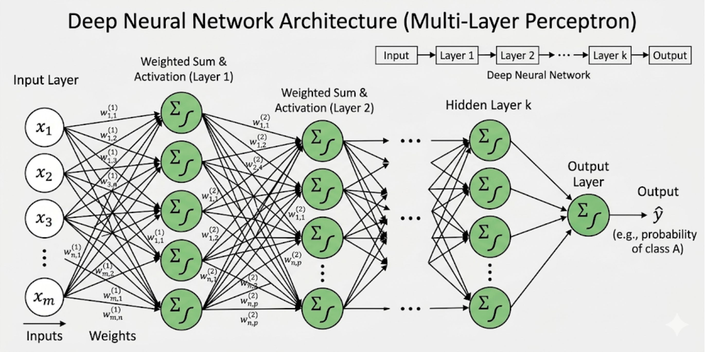

# Thesis

**Claim:** Un modelo de lenguaje hace una sola cosa, predecir el token que sigue, y todo lo que la clase recorre (tokens, embeddings, capas, gradientes, recurrencia y atención) existe para que esa predicción pueda usar el contexto entero en lugar de las últimas palabras.

**Why it matters:** Las decisiones que aparecen después en la materia (ventana de contexto, costo por consulta, alucinación, diseño de prompts) se explican desde ese mecanismo. Sin él, un LLM queda como una caja que a veces acierta.

**Presenter feedback:**

- [closed] 2026-08-14 — "Restaurado 1:1 desde `AIG4B-Clase-2-LLM.pptx`. La tesis no estaba explícita en el deck original: falta escribirla."
  Resolution: tesis escrita sobre el eje que el propio deck declara como objetivo ("entender cómo se puede generar texto automáticamente"), formulada como un mecanismo único del que cuelgan las ocho secciones. Los objetivos de sección se derivaron de ella.

---

# Agenda

**Narrative arc:**

La clase arranca por arriba, con las familias de problemas que la IA resuelve, y baja hasta la más chica de todas: predecir la palabra que sigue. Las tres primeras secciones instalan ese problema y muestran que todas las tareas de texto se pueden escribir así. La cuarta y la quinta arman las dos piezas que hacen falta para resolverlo con una red: convertir palabras en vectores y apilar perceptrones. La sexta explica cómo se ajustan esas piezas. La séptima es el nudo: procesar la frase token por token funciona y se rompe con la distancia, y la atención es lo que la desarma. La octava cierra mostrando que un LLM de hoy es el mismo problema de la sección tres, con otro tamaño.

**Sections (in delivery order):**

- 1. Problemas clásicos de ML
- 2. Motivación de NLP
- 3. Modelado de lenguaje
- 4. Embeddings
- 5. Redes neuronales
- 6. De las RNN a la atención
- 7. Transformers y LLM

<!-- Agenda tal como figuraba en el deck original (registro histórico, no se entrega así). -->
<!-- **Objetivo: Entender cómo se puede generar texto automáticamente.** -->
<!-- - **Problemas clásicos de ML** -->
<!-- - **NLP: motivación y problemas** -->
<!--   - **Language Modelling: predecir la siguiente palabra** -->
<!--   - **Representación de texto: tokens, vocabulario y embeddings** -->
<!-- - **Redes neuronales: del perceptrón al deep learning** -->
<!-- - **De RNNs a Transformers: el rol de attention** -->
<!-- - **Transformers: Cómo funciona un LLM** -->

**Presenter feedback:**

- [closed] 2026-09-03 (editor) — "Sección 2 con 10 láminas y sección 4 con 2, siendo esta última el nudo conceptual de la clase."
  Resolution: las cinco secciones pasaron a ocho. La vieja sección 2 se abrió en tres (Motivación de NLP, Modelado de lenguaje, Tokens y embeddings); la vieja sección 3 se abrió en dos (Redes neuronales, Cómo aprende una red); la vieja sección 4 pasó de 2 a 7 láminas. Ninguna sección supera las 7. El título "Del perceptrón a la red profunda" excedía el presupuesto de 25 caracteres y se retiró en el reparto.

- [closed] 2026-09-03 (editor) — "Cero diagramas propios en un material que explica mecanismos."
  Resolution: se agregaron 20 bloques ASCII. Once en láminas que no tenían figura del deck original, y nueve que reemplazan figuras planas del PowerPoint. De las 29 imágenes del deck quedan 6: las 14 decorativas se retiraron y 9 se rehicieron como diagrama propio.

---

# 0. Portada

**Goal of this section:** Apertura del deck original — portada y mapa de la clase.

**Presenter feedback:**


---

## 1. Deep learning y NLP

### Content

**Inteligencia Artificial Generativa (AI Gen) · Clase 8**

- **De la palabra al transformer**
- **Paulo Veiga, Claudio Righetti y Marco Sorondo (Universidad Austral)**
- **Última modificación: septiembre 2026**

### Sources

- `AIG4B-Clase-2-LLM.md.md` (slide 1)

### Speaker notes

Portada. Presentate y presentá a los otros dos docentes. La imagen de portada del deck original se retiró: el logo de la institución lo pone el renderizador desde `config/logo.png`.

### Presenter feedback


---

# 1. Problemas clásicos de ML

**Goal of this section:** Ubicar el modelado de lenguaje dentro del mapa completo de problemas que resuelve la IA, y dejar clara la inversión que define a machine learning.

**Presenter feedback:**


---

## 1. Siete familias de problemas de IA

<!-- slide 3 del pptx original -->

<!-- format: editorial -->

### Content

**Cada familia se define por la forma de su entrada y de su salida, no por el dominio en el que se aplica.**

- **Predicción** Aprender una función de X a Y a partir de datos etiquetados. Incluye clasificación y regresión.
- **Percepción** Extraer estructura de señales sensoriales: imagen, audio, video.
- **Representación** Aprender embeddings y espacios latentes que capturan relaciones entre datos.
- **Decisión secuencial** Maximizar recompensa acumulada a lo largo de una serie de acciones. Se formaliza como reinforcement learning.
- **Búsqueda y planificación** Encontrar la mejor secuencia de acciones dentro de un espacio de estados.
- **Razonamiento simbólico** Manipular símbolos y reglas IF–THEN para derivar conclusiones lógicas.
- **Generación** Producir muestras nuevas y coherentes: texto, imagen, audio, código. La cantidad de salidas posibles no tiene tope.

- 💡 Un sistema real casi nunca usa una sola. Un auto autónomo combina percepción, decisión secuencial y planificación.

### Sources

- `AIG4B-Clase-2-LLM.md.md` (slide 3) — las siete definiciones, verbatim del deck original.

### Speaker notes

Lámina de encuadre. Lo único que hay que dejar clavado es que la última familia, generación, es la que ocupa el resto de la clase, y que las otras seis aparecen para dar contraste. Si alguien pregunta por qué representación y generación suenan parecidas, la respuesta corta es que representación aprende el espacio y generación produce puntos nuevos dentro de él; las secciones de embeddings y de transformers lo muestran en concreto. El deck original ponía ocho iconos y nombraba siete categorías: el octavo icono era la viñeta del callout, no una familia. Los ocho se retiraron.

### Presenter feedback

- [closed] 2026-09-03 (editor) — "El deck ponía ocho iconos para siete categorías nombradas (corpus, conteo de tipos de problema en la slide 3)."
  Resolution: los ocho iconos decorativos se retiraron y la lámina enumera las siete familias que el deck efectivamente define. El octavo archivo era la viñeta del callout, según el registro del corpus.

---

## 2. El modelo aprende las reglas

<!-- slide 4 del pptx original -->

### Content

**La programación clásica recibe reglas y datos, y devuelve respuestas. Machine learning recibe datos y respuestas, y devuelve las reglas.**

```ascii
                     ENTRA               PROCESO            SALE

  PROGRAMACION       reglas      ---.
  CLASICA                            +--> [ programa  ] --> respuestas
                     datos       ---'


  MACHINE            datos       ---.
  LEARNING                           +--> [ entrenar  ] --> reglas
                     respuestas  ---'


  reglas       entran arriba   ->   salen abajo
  respuestas   salen arriba    ->   entran abajo
  datos        entran en los dos

  Lo que en un paradigma se escribe a mano, en el otro se deduce.
```
<!-- ascii-note:
intent: mostrar que los dos paradigmas usan las mismas tres piezas y que lo que cambia es cual es entrada y cual es salida; el nombre del proceso es lo de menos
emphasize: las tres lineas de abajo, que nombran la inversion pieza por pieza. En el cuerpo, la palabra "reglas" en las dos filas: entra en la de arriba y sale en la de abajo, y esa es toda la leccion
labels: "ENTRA", "PROCESO", "SALE", "PROGRAMACION CLASICA", "MACHINE LEARNING", "reglas", "datos", "respuestas", y las tres lineas de inversion
-->

- **Lo que se escribe a mano cambia de lugar.** En el paradigma clásico alguien escribe las reglas. En machine learning alguien junta ejemplos resueltos, y el algoritmo escribe las reglas.
- **La consecuencia práctica** El costo se muda de la lógica al conjunto de datos. Cuando cada tarea necesitaba su propio conjunto etiquetado a mano, ese costo se pagaba entero una vez por tarea.

### Sources

- `AIG4B-Clase-2-LLM.md.md` (slide 4) — la lámina original era solo el título y una figura. La figura se rehizo como diagrama propio: era un esquema plano rotulado en inglés que codificaba la inversión con el color de los círculos, y el diagrama nuevo la nombra pieza por pieza.

### Speaker notes

La figura es el argumento entero y conviene recorrerla en voz alta: fila de arriba, reglas más datos entran y salen respuestas; fila de abajo, datos más respuestas entran y salen reglas. Es la definición operativa de machine learning y la más útil para esta audiencia, porque describe qué artefacto produce el equipo. La figura está en inglés (Rules, Data, Answers, Classical Programming, Machine Learning); traducila al pasar. El título del deck original tenía un typo, "IA moAderna", corregido acá.

### Presenter feedback

- [closed] 2026-09-03 (editor) — "Lámina sin texto propio: sólo el título y la figura."
  Resolution: se escribió el encabezado que la figura sostiene y dos puntos de apoyo. La figura se conserva porque, según el registro del corpus, es la formalización visual de la afirmación central de la sección.

---

## 3. Clasificar y predecir un valor

<!-- slide 5 del pptx original -->

### Content

**Las dos formulaciones de predicción se distinguen por el tipo de salida: una categoría de un conjunto cerrado, o un número.**

- **Clasificación** Asignar una entrada a una de varias categorías conocidas de antemano. Pregunta: ¿a qué categoría pertenece? Ejemplo: decidir si un correo es spam.
- **Regresión** Estimar un valor continuo a partir de las características de la entrada. Pregunta: ¿qué valor va a tener? Ejemplo: estimar el precio de una casa por sus metros cuadrados.


<!-- ascii-render: force -->
```ascii
   precio
      ^
      |                                           .    ,-'
      |                                       ,-'
      |                           .     ,-'        .
      |                      .      ,-'
      |               .        ,-'
      |         .        ,-'  (?)      .
      |      .      ,-'        ^
      |   ,-'   .              |
      +-------------------------------------------> metros cuadrados
                               |
                    aca no se vendio ninguna casa, y la recta
                    igual devuelve un precio

   Cada punto es una casa ya vendida: sus metros y lo que pago
   alguien. La recta es el modelo, y contesta en todo el eje, asi
   que se le puede pedir el precio de un metraje que nunca aparecio
   en los datos. La salida sale de un rango continuo, y por eso los
   valores posibles no se pueden enumerar.
```
<!-- ascii-note:
intent: mostrar que un modelo de regresion contesta tambien donde no hay datos, que es lo que separa una salida continua de una eleccion entre categorias; el ejemplo del metraje no vendido es el argumento
emphasize: el signo (?) sobre la recta en el hueco sin puntos, con su llamada al pie; es lo que el listado de la lamina no dice
labels: "precio", "metros cuadrados", "(?)", "aca no se vendio ninguna casa, y la recta igual devuelve un precio", "La salida sale de un rango continuo"
-->

### Sources

- `AIG4B-Clase-2-LLM.md.md` (slide 5) — las dos formulaciones y sus ejemplos, verbatim.
- Diagrama propio. La lámina original ilustraba la regresión con una captura de un curso en video, en inglés y con un error tipográfico en su propio título; se rehízo como diagrama propio en español, con el mecanismo y sin nada de la fuente.

### Speaker notes

La clasificación queda del lado de la figura y la regresión del lado del diagrama: una salida discreta y una continua, en la misma pantalla. El ejemplo de la casa del texto y el del diagrama coinciden, así que se pueden señalar juntos. Detenete en el signo de pregunta: ahí no se vendió ninguna casa y la recta contesta igual, y ésa es la diferencia práctica con elegir entre categorías. La nube de puntos y la recta son esquemáticas, sin escala en los ejes a propósito, porque no hay ningún conjunto de datos detrás. La lámina original juntaba las cuatro formulaciones y cuatro figuras en una sola pantalla; acá van de a dos.

### Presenter feedback

- [closed] 2026-09-03 (editor) — "La figura de regresión era una captura de un curso en video, en inglés y con un typo en su propio título."
  Resolution: reemplazada por un diagrama propio en español que dibuja la dispersión y la recta, y agrega el argumento que el listado no hacía: la recta contesta también donde no hay datos.


---

## 4. Agrupar y crear datos nuevos

<!-- slide 5 del pptx original -->

<!-- design: split-right -->

### Content

**Las otras dos formulaciones no tienen respuesta correcta escrita de antemano: una descubre la estructura, la otra produce muestras que no estaban en los datos.**

- **Clustering** Agrupar elementos parecidos sin categorías definidas de antemano. Pregunta: ¿qué datos se parecen entre sí? Ejemplo: agrupar los tickets de soporte que describen la misma falla, sin haber decidido antes cuáles son las fallas.
- **Generación** Producir datos nuevos que se parezcan a los de entrenamiento sin copiarlos. Pregunta: ¿puedo crear datos que no estaban? Ejemplo: escribir texto o completar código.

```ascii
  ANTES                            DESPUES DE AGRUPAR

  una pila de tickets,             tres grupos, y recien ahora
  sin categoria ninguna            se les puede poner nombre

   t1  "no carga el login"          +----------------+
   t2  "el pago tira 500"           | t1   t3   t7   |  <- una persona
   t3  "no puedo entrar"            +----------------+     los lee y
   t4  "la factura sale mal"                               les pone
   t5  "timeout al pagar"           +----------------+     nombre
   t6  "no llega el recibo"         | t2   t5        |     recien
   t7  "usuario bloqueado"          +----------------+     aca
   t8  "el importe no cierra"
                                    +----------------+
                                    | t4   t6   t8   |
                                    +----------------+

  El algoritmo forma los grupos midiendo parecido entre los textos.
  No sabe que el primero es "acceso" ni el tercero "facturacion":
  los nombres los pone alguien despues, mirando el resultado.
```
<!-- ascii-note:
intent: mostrar que el agrupamiento produce los grupos y no los nombres; el algoritmo mide parecido y las etiquetas las pone una persona despues, que es lo que distingue agrupar de clasificar
emphasize: las tres cajas de la derecha con sus tickets adentro, y la llamada que dice que el nombre llega despues y lo pone una persona
labels: "ANTES", "DESPUES DE AGRUPAR", "una pila de tickets, sin categoria ninguna", "tres grupos, y recien ahora se les puede poner nombre", "una persona los lee y les pone nombre recien aca", "El algoritmo forma los grupos midiendo parecido entre los textos"
-->

- 💡 El modelo aprende patrones de los datos. Nadie le escribe las reglas.

### Sources

- `AIG4B-Clase-2-LLM.md.md` (slide 5) — las dos formulaciones y el cierre sobre patrones.
- Diagrama propio. La lámina original ilustraba el agrupamiento con una figura de un tercero, en inglés y con su logo proyectado; se rehízo como diagrama propio en español, con el mecanismo y sin nada de la marca.

### Speaker notes

El clustering es el que más cuesta, porque la pregunta "¿qué datos se parecen?" suena vacía hasta que se ve un caso. El de tickets de soporte funciona bien con esta audiencia: nadie sabe de antemano cuántas fallas distintas hay en la cola, y agrupar es justamente cómo se descubren. Leé dos o tres tickets de la columna izquierda y preguntá cómo los agruparían; van a dar los tres grupos del diagrama sin esfuerzo, y ése es el momento de decir que el algoritmo llega hasta ahí y no más. Los nombres —acceso, pagos, facturación— los pone una persona mirando el resultado, y eso es lo que separa agrupar de clasificar.

### Presenter feedback

- [closed] 2026-09-03 (editor) — "La figura de agrupamiento llevaba el logo de un tercero proyectado en una lámina de la materia."
  Resolution: reemplazada por un diagrama propio en español, sin marca ni estética de la fuente, que además agrega lo que el listado no decía: el algoritmo forma los grupos y los nombres los pone una persona después.

- [closed] 2026-09-03 — "Quedan menciones al dominio biomédico heredadas de la materia anterior: convertilas a ejemplos de software y sistemas."
  Resolution: "agrupar pacientes con síntomas similares" se reemplazó por "agrupar los tickets de soporte que describen la misma falla", que conserva la estructura del ejemplo (agrupar por parecido sin categorías previas) en el dominio de la materia.

---

# 2. Motivación de NLP

**Goal of this section:** Mostrar que toda tarea de texto cae en las mismas familias ya vistas, y qué costaba resolverlas antes de que un solo modelo sirviera para todas.

**Presenter feedback:**


---

## 1. Los mismos problemas, con texto

<!-- slide 6 del pptx original -->

### Content

**Cada formulación clásica tiene su equivalente cuando la entrada es texto. Cambia el tipo de dato, no la forma del problema.**

| Formulación | Qué resuelve | Ejemplo con texto |
|---|---|---|
| Clasificación | Asignar una categoría | ¿Este comentario es positivo o negativo? |
| Clasificación multiclase | Elegir entre varias categorías | ¿En qué idioma está escrito? |
| Clustering | Agrupar datos similares | Agrupar incidentes por causa raíz |
| Predicción | Completar información faltante | `The ___ is on the mat` → `cat` |
| Generación | Crear datos nuevos | `The cat is on the ___` → `mat` |

- **Predicción y generación son la misma operación en distinta posición.** Las dos completan un hueco con el token más probable; la única diferencia es dónde está el hueco.
- **Todas necesitan lo mismo primero:** alguna forma de convertir texto en algo que un modelo pueda operar. Eso es tokenizar y embeber, y es la sección *Tokens y embeddings*.

### Sources

- `AIG4B-Clase-2-LLM.md.md` (slide 6) — la tabla completa y la pregunta bisagra que cierra la lámina.

### Speaker notes

Lámina bisagra entre el mapa general y el resto de la clase. El punto que conviene subrayar es el primero de los dos de abajo, porque anticipa el modelado de lenguaje: predicción y generación son la misma cuenta, y por eso un modelo que sabe completar huecos sabe escribir. Las dos últimas filas de la tabla lo muestran con la misma frase. El ejemplo de sentimiento del deck original ("qué bien comimos en el restaurante") se retiró: la columna de la derecha ya trae uno.

### Presenter feedback


---

## 2. Hay más texto del que se puede leer

<!-- slide 7 del pptx original -->

### Content

**Procesamiento del lenguaje natural (NLP) es el campo que se ocupa de resolver estas tareas de forma automática, sobre volúmenes de texto que nadie va a leer entero.**

- **De dónde sale el texto** Tickets de soporte, mensajes de commit, logs de aplicación, documentación técnica, hilos de incidentes, correos, foros y reseñas de usuarios.
- **Qué se le pide** Analizar miles de reportes de usuarios sobre una misma versión; clasificar tickets por área; detectar el idioma de un documento; responder preguntas sobre un texto largo; resumir un informe de treinta páginas en un párrafo.

- 💡 El volumen es lo que convierte estas tareas en un problema de ingeniería. Cualquiera de ellas la resuelve una persona sobre diez documentos; ninguna se resuelve así sobre diez mil.

### Sources

- `AIG4B-Clase-2-LLM.md.md` (slide 7) — la definición del campo, el argumento de volumen y la lista de casos de uso.

### Speaker notes

Lámina corta y de motivación. Lo que la sostiene es el callout del final: la escala es lo que separa una tarea de NLP de un rato de lectura. Si querés un caso propio, la cola de tickets de cualquier equipo grande sirve, porque nadie la lee entera y todos necesitan saber qué hay adentro. El deck original listaba historias clínicas y opiniones de pacientes sobre un tratamiento, heredados de la materia anterior; están convertidos.

### Presenter feedback

- [closed] 2026-09-03 — "Quedan menciones al dominio biomédico heredadas de la materia anterior: convertilas a ejemplos de software y sistemas."
  Resolution: dos conversiones en esta lámina. "emails, historias clínicas, papers, redes sociales, reportes" pasó a "tickets de soporte, mensajes de commit, logs de aplicación, documentación técnica, hilos de incidentes, correos, foros y reseñas de usuarios"; y "analizar opiniones de miles de pacientes sobre un tratamiento" pasó a "analizar miles de reportes de usuarios sobre una misma versión", que conserva la estructura (muchas opiniones sobre una misma intervención). "Clasificar papers científicos por área" pasó a "clasificar tickets por área" y "resumir un paper de 30 páginas" a "resumir un informe de treinta páginas".

---

## 3. Veinticinco tareas de NLP

<!-- slide 8 del pptx original -->

### Content

**Las cinco familias, aterrizadas. Cada columna es una formulación de la lámina anterior y cada celda una tarea que alguien resuelve hoy en producción.**

| Clasificación | Clasificación multiclase | Clustering | Predicción | Generación |
|---|---|---|---|---|
| Detección de spam (spam / no spam) | Detección de idioma (español, inglés, francés…) | Agrupar noticias por tema | Autocompletar en un buscador | Resumen automático de textos |
| Análisis de sentimiento (positivo / negativo) | Clasificación de intención (comprar, preguntar, quejarse…) | Agrupar reseñas similares de productos | Predecir la siguiente palabra de una oración | Traducción automática |
| Detección de discurso de odio (sí / no) | Etiquetado gramatical (sustantivo, verbo, adjetivo…) | Segmentar usuarios por estilo de escritura | Completar huecos en el texto (masked LM) | Generación de respuestas en chatbots |
| Detección de noticias falsas (real / falsa) | Clasificación de emociones (alegría, tristeza, enojo, miedo…) | Descubrir tópicos en un corpus | Predecir la puntuación de una reseña | Generación de código a partir de texto |
| Detección de paráfrasis (sí / no) | Clasificación de tickets de soporte (facturación, técnico, ventas…) | Agrupar documentos legales por área | Predecir palabras faltantes en un OCR dañado | Parafraseo automático de oraciones |

### Sources

- `AIG4B-Clase-2-LLM.md.md` (slide 8) — la matriz completa, verbatim.

### Speaker notes

Lámina de referencia, no de lectura. Señalá una celda por columna y seguí; la matriz está para que quede como material de consulta. La celda que conviene marcar es "predecir la siguiente palabra de una oración", en la columna de predicción, porque es la que abre la sección siguiente y la que termina absorbiendo a casi todas las demás cuando aparecen los modelos fundacionales.

### Presenter feedback


---

## 4. Un modelo por tarea

<!-- slide 9 del pptx original -->

### Content

**Antes de los modelos fundacionales, cada tarea de la matriz anterior necesitaba su propio conjunto de datos etiquetado y su propio modelo entrenado desde cero.**

```ascii
  TAREA 1  sentimiento     TAREA 2  traduccion     TAREA 3  entidades
  +------------------+   +------------------+   +------------------+
  | textos crudos    |   | textos crudos    |   | textos crudos    |
  +------------------+   +------------------+   +------------------+
           |                      |                      |
           v  etiqueta            v  etiqueta            v  etiqueta
           |  una persona         |  una persona         |  una persona
  +------------------+   +------------------+   +------------------+
  | pos / neg        |   | pares es <-> en  |   | PER / ORG / LOC  |
  +------------------+   +------------------+   +------------------+
           |                      |                      |
           v                      v                      v
  +------------------+   +------------------+   +------------------+
  | modelo propio    |   | modelo propio    |   | modelo propio    |
  +------------------+   +------------------+   +------------------+

  Nada cruza de una columna a la otra. Sumar una tarea cuesta una
  columna entera, y el tramo caro es el del medio: lo escribe una
  persona, una fila por vez.
```
<!-- ascii-note:
intent: mostrar que el costo del enfoque tradicional no está en el modelo sino en la etiqueta, y que las columnas son independientes: nada de lo hecho para una tarea sirve para la siguiente
emphasize: la fila del medio, el etiquetado humano, que es donde está el costo real; el aislamiento de las tres columnas, que nunca se tocan
labels: "TAREA 1 sentimiento", "TAREA 2 traduccion", "TAREA 3 entidades", "textos crudos", "etiqueta una persona", "pos / neg", "pares es <-> en", "PER / ORG / LOC", "modelo propio", "Nada cruza de una columna a la otra"
-->

- **Recolectar, etiquetar, entrenar** eran los tres trabajos, y el segundo no se automatizaba: alguien tenía que marcar a mano qué era positivo y qué negativo.

### Sources

- `AIG4B-Clase-2-LLM.md.md` (slide 9) — los tres pasos del enfoque tradicional y el cierre: "cada tarea requería su propio pipeline, sus propios datos etiquetados, su propio modelo. Era costoso y lento."

### Speaker notes

El diagrama dice algo que la lista del deck original no decía: el costo no está en entrenar sino en etiquetar, y no se amortiza entre tareas. Recorré las tres columnas señalando que ninguna flecha cruza de una a otra. Esta lámina es la que le da peso al cierre de la clase: cuando se muestre que las tres tareas se resuelven con el mismo modelo y tres prompts distintos, el contraste es contra esta imagen. La viñeta decorativa del deck original en esta lámina se retiró.

### Presenter feedback


---

# 3. Modelado de lenguaje

**Goal of this section:** Formular el problema que resuelve un LLM —predecir el token siguiente— y dejar claro que su salida es una distribución sobre el vocabulario entero, no una palabra.

**Presenter feedback:**


---

## 1. Predecir la palabra que sigue

<!-- slide 10 del pptx original -->

### Content

**El problema tiene tres entradas: un vocabulario V, un corpus de texto T y una frase incompleta P. La salida es el token más probable a continuación de P.**

```ascii
  Una frase del corpus, sin una sola etiqueta escrita a mano:

      the   cat   sat   on   the   mat

  La ventana avanza un token por vez. Lo que quedo a la izquierda
  es la entrada; el token siguiente es la respuesta correcta.

      [ the ]                       ->  cat
      [ the cat ]                   ->  sat
      [ the cat sat ]               ->  on
      [ the cat sat on ]            ->  the
      [ the cat sat on the ]        ->  mat

  Una frase de 6 tokens dio 5 ejemplos de entrenamiento, y la
  respuesta correcta de cada uno ya estaba escrita en el texto.
  Ahi esta la diferencia con la lamina anterior: nadie etiqueto.
```
<!-- ascii-note:
intent: mostrar que la supervisión del modelado de lenguaje sale del propio texto: la ventana que se corre convierte una frase cruda en varios pares entrada-respuesta sin intervención humana
emphasize: la columna de respuestas correctas a la derecha de las flechas, que es lo que en la lámina anterior escribía una persona; el pie que cierra el contraste
labels: "the cat sat on the mat", "La ventana avanza un token por vez", "entrada", "respuesta correcta", "6 tokens dio 5 ejemplos", "nadie etiqueto"
-->

- **Por qué esto escala y lo anterior no.** El texto crudo trae la respuesta adentro. Todo lo escrito en internet es un conjunto de entrenamiento ya etiquetado para esta tarea.

### Sources

- `AIG4B-Clase-2-LLM.md.md` (slide 10) — la formulación con V, T y P, y el objetivo "predecir cuál es la siguiente palabra más probable".

### Speaker notes

Ésta es la lámina que hay que dejar clavada de la sección. El diagrama contesta la pregunta que queda flotando desde el enfoque tradicional: si etiquetar es lo caro, cómo se entrenaron los modelos grandes. La respuesta es que para esta tarea la etiqueta ya está escrita, y por eso el conjunto de entrenamiento es todo el texto disponible. Contá los ejemplos en voz alta: seis tokens, cinco pares. Si alguien pregunta por qué son cinco y no seis, es porque el último token no tiene siguiente. La viñeta decorativa del deck original en esta lámina se retiró.

### Presenter feedback


---

## 2. La salida es un vector, no una palabra

<!-- slide 10 del pptx original -->

### Content

**El modelo devuelve un número por cada token del vocabulario: la probabilidad de que ese token sea el siguiente. El vector tiene longitud |V|.**

```ascii
  ENTRADA   "the cat is on the"
                     |
                     v
                [ MODELO ]
                     |
                     v
  SALIDA    un valor por cada token del vocabulario

     mat    #################################
     bed    ############
     piso   #####
     dog    ##
     the    #
     roof   .
     ...    y asi hasta completar los |V| tokens
            -----------------------------------------------
            los |V| valores suman 1

  La lista entera es la salida del modelo. Quedarse con la barra
  mas larga es un paso aparte, y no es el unico: muestrear entre
  las primeras es lo que hace que el mismo texto de entrada no
  devuelva siempre la misma continuacion.
```
<!-- ascii-note:
intent: mostrar que la salida es una lista completa sobre el vocabulario y no una palabra, y separar dos cosas que se confunden: producir la distribucion, que hace el modelo, y elegir un token, que es un paso posterior
emphasize: la columna de barras entera, sobre todo las filas de abajo que casi no se ven y la linea de que los |V| valores suman 1; la barra mas larga es solo una fila de esa lista
labels: "ENTRADA", "MODELO", "SALIDA", "un valor por cada token del vocabulario", "los |V| valores suman 1", "La lista entera es la salida del modelo", "Quedarse con la barra mas larga es un paso aparte"
-->

- **Una posición por token del vocabulario.** El valor de cada posición es la probabilidad de ese token, y las |V| posiciones suman uno.
- **Elegir viene después.** Quedarse con el máximo es una decisión aparte, y no es la única. Muestrear con algo de aleatoriedad es la otra, y es lo que controla la temperatura.

### Sources

- `AIG4B-Clase-2-LLM.md.md` (slide 10) — el bloque "Importante": el modelo devuelve un vector de probabilidades sobre todo el vocabulario, de longitud |V|.
- Diagrama propio. La lámina original ilustraba esto con una miniatura de video del deck, en inglés y con estética de portada; se rehízo como diagrama propio en español, con el mecanismo y sin nada de la fuente.

### Speaker notes

El diagrama es el argumento entero: una frase incompleta entra, y lo que sale es la columna completa de barras. Recorré las filas de arriba abajo hasta las que casi no se ven, y decí que la lista sigue hasta completar el vocabulario. El punto que conviene decir en voz alta es el segundo de los de apoyo: el modelo produce la distribución, y elegir un token es una decisión de quien lo usa. Las barras son esquemáticas y no llevan números a propósito, porque no salen de ninguna corrida; lo único que se afirma es la estructura, que hay un valor por token y que suman uno.

### Presenter feedback

- [closed] 2026-09-03 (editor) — "La figura de la distribución era una miniatura de video, con fondo negro y título en serif, y encima vivía cinco láminas antes de que el concepto se formalizara."
  Resolution: reemplazada por un diagrama propio en español, ubicado en la lámina que formaliza el concepto. Las barras van sin números porque la afirmación de la lámina es estructural: un valor por token y los |V| suman uno.

---

## 3. Los modelos no leen letras

<!-- slide 15 del pptx original -->

### Content

**Un token es la unidad mínima que el modelo procesa: una palabra entera, un pedazo de palabra o un signo de puntuación. Tokenizar es el primer paso de cualquier tarea de NLP.**

```ascii
  POR PALABRA                          POR SUB-PALABRA

  "the cat sat on the mat"             "unbelievable"
             |                                |
             v                                v
  [the][cat][sat][on][the][mat]        [un][believ][able]
           6 tokens                          3 tokens


  UNA PALABRA QUE EL MODELO NUNCA VIO:  "descontracturante"

    por palabra      ->  [ <desconocido> ]
                         el contenido se pierde entero

    por sub-palabra  ->  [des][contract][urante]
                         se arma con piezas ya conocidas

  El vocabulario deja de tener que contener el idioma entero, y el
  mismo vocabulario sirve para varios idiomas a la vez.
```
<!-- ascii-note:
intent: mostrar que la elección de unidad no es cosmética: con palabras enteras una palabra desconocida se pierde, con sub-palabras se reconstruye desde piezas que el modelo ya tiene
emphasize: el bloque de abajo, la palabra nunca vista, y en particular la línea de sub-palabra que la descompone en tres piezas conocidas; ése es el argumento que la parte de arriba no da
labels: "POR PALABRA", "POR SUB-PALABRA", "6 tokens", "3 tokens", "UNA PALABRA QUE EL MODELO NUNCA VIO", "<desconocido>", "des / contract / urante", "se arma con piezas ya conocidas"
-->

- **Vocabularios más chicos** No hace falta una entrada por cada palabra del idioma, y las palabras nuevas se arman con piezas.

### Sources

- `AIG4B-Clase-2-LLM.md.md` (slide 15) — la definición de token, los dos ejemplos de tokenización (6 y 3 tokens) y las tres ventajas de las sub-palabras.
- `AIG4B-Clase-2-LLM.md.md` (slide 14) — "el primer paso es lograr que el modelo entienda qué significan las palabras; para eso hay que representarlas como números".

### Speaker notes

Los dos conteos del diagrama están verificados contra el deck: "the cat sat on the mat" da seis tokens y "unbelievable" da tres. El ejemplo de la palabra desconocida es agregado y no está en el deck original: sirve porque es el único momento en que se ve para qué sirve la descomposición, y "descontracturante" funciona con esta audiencia porque nadie duda de que ningún vocabulario la va a tener. Si preguntan cómo se decide el vocabulario de sub-palabras, la respuesta corta es que se aprende del corpus por frecuencia, y que el algoritmo concreto (BPE y parientes) queda fuera de esta clase.

### Presenter feedback


---

## 4. Catorce tokens y cinco frases

<!-- slide 11 del pptx original -->

### Content

**El mismo problema, con números chicos: un vocabulario de 14 tokens, un corpus de 5 frases y una frase incompleta.**

- **V** `{ "a", "to", "on", "the", "sat", "cat", "dog", "bed", "ran", "mat", " ", "<fin>", ".", "," }` — 14 tokens.
- **T** `"the cat sat on mat"` · `"a dog ran to bed"` · `"the dog sat on bed"` · `"a cat ran to mat"` · `"the cat ran to dog"` — 5 frases.
- **P** `"the dog sat on"`. La única frase del corpus que empieza así continúa con `"bed"`, así que ésa es la respuesta correcta.

**Salida del modelo, un valor por token de V:**

`a: 0,01` · `to: 0,02` · `on: 0,03` · `the: 0,04` · `sat: 0,01` · `cat: 0,01` · `dog: 0,02` · **`bed: 0,78`** · `ran: 0,03` · `mat: 0,04` · `" ": 0,01` · `<fin>: 0,00` · `".": 0,00` · `",": 0,00`

- **El vector objetivo es todo ceros y un uno** en la posición de `bed`. Entrenar es acercar la salida del modelo a ese vector.

### Sources

- `AIG4B-Clase-2-LLM.md.md` (slide 11) — vocabulario, corpus, frase incompleta y vector de salida, verbatim.
- Verificación aritmética: los 14 valores del vector suman exactamente 1,00 (0,01 + 0,02 + 0,03 + 0,04 + 0,01 + 0,01 + 0,02 + 0,78 + 0,03 + 0,04 + 0,01 + 0,00 + 0,00 + 0,00), y el vocabulario listado tiene 14 entradas.

### Speaker notes

Los números cierran: el vector suma uno exacto y el vocabulario tiene los catorce tokens que declara. Si alguien los suma en el momento, van a dar. La frase incompleta se resuelve por la tercera del corpus, "the dog sat on bed". El deck original la identificaba como `T[2]` sin declarar si indexaba desde cero o desde uno; acá se dice cuál es la frase en vez de su índice, porque las dos lecturas dan "bed" y la ambigüedad no aporta nada. Notá también que la primera frase del corpus dice "the cat sat on mat" y no "the cat sat on the mat": es un corpus de juguete y está bien, pero si alguien lo marca, es eso.

### Presenter feedback


---

## 5. Aprender es ajustar parámetros

<!-- slide 13 del pptx original -->

### Content

**Un modelo por dentro es un conjunto de números ajustables. Entrenar es buscar los valores que hacen que la salida se parezca al vector objetivo.**

- **Parámetros** Los números internos del modelo, los que el deck llama "clavijas". Empiezan en valores arbitrarios y son lo único que el entrenamiento modifica.
- **Loss (pérdida)** Un número que mide qué tan lejos quedó la salida del modelo del vector objetivo. Cuanto más chico, mejor predijo.
- **Optimización** El procedimiento que ajusta los parámetros para que la loss baje. Termina quedándose con los valores que dan la loss más chica.

- 💡 El método no depende de la tarea. Cambia qué es la respuesta correcta (el token siguiente, la categoría, el número) y el resto del procedimiento es el mismo para cualquiera de las tareas de NLP ya vistas.

### Sources

- `AIG4B-Clase-2-LLM.md.md` (slide 13) — la metáfora de las clavijas y las definiciones de loss y optimización, verbatim.
- `AIG4B-Clase-2-LLM.md.md` (slide 14) — "el mismo método sirve para resolver cualquiera de los problemas ya vistos".

### Speaker notes

Lámina de vocabulario, corta a propósito. Las tres definiciones se usan sin parar en las dos secciones de redes neuronales, así que conviene decirlas despacio y no volver sobre ellas. El ciclo concreto (cómo se calcula la loss, en qué dirección se mueven los parámetros) es la sección *Cómo aprende una red* entera y acá no se adelanta. Si alguien pregunta cuántos parámetros, la respuesta llega al hablar de profundidad. Una advertencia sobre el deck original: sus pasos 03 y 04 decían "la palabra más probable era alfombra", confundiendo la palabra correcta del corpus con la más probable según el modelo, que es justamente lo que se está comparando; acá esa redacción no se usa.

### Presenter feedback

- [closed] 2026-09-03 (editor) — "Las láminas 12, 13 y 22 del deck original decían tres veces el mismo ciclo de entrenamiento."
  Resolution: esta lámina se quedó con el vocabulario (parámetros, loss, optimización) y el ciclo de cuatro pasos vive una sola vez, en la lámina 6.3, con su figura. La lámina 12 del deck original era una pregunta de transición sin contenido propio y se retiró; la 14 se integró como apertura de la sección 4.

---

# 4. Embeddings

**Goal of this section:** Cerrar el camino de texto a números: cómo se parte una frase en unidades y cómo se le da a cada unidad un vector cuya distancia significa algo.

**Presenter feedback:**


---

## 1. Tres formas de volver texto en números

<!-- slide 16 del pptx original -->

### Content

**El vocabulario V es el conjunto de tokens que el modelo conoce, y por eso predice un vector de tamaño |V|. Pero un token es texto, y los parámetros son números: hace falta una representación numérica.**

- **Bag of words / TF-IDF** Contar apariciones de cada palabra. Ignora el orden y el significado.
- **One-hot encoding** Un vector de largo |V| con un solo uno, en la posición del token. Distingue tokens, pero todos quedan a la misma distancia entre sí.
- **Embeddings** Vectores densos de unos cientos de dimensiones, donde los tokens de significado parecido caen cerca. Es lo que usan los modelos modernos.

```ascii
  ONE-HOT                             EMBEDDING

  cat      [0 1 0 0 0 0 0 ... 0]      cat      [ 0.82 -0.31  0.54 ...]
  dog      [0 0 1 0 0 0 0 ... 0]      dog      [ 0.79 -0.28  0.51 ...]
  heladera [0 0 0 0 0 1 0 ... 0]      heladera [-0.12  0.65 -0.33 ...]

  cat - dog       ->  distancia d     cat - dog       ->  cerca
  cat - heladera  ->  distancia d     cat - heladera  ->  lejos

  Todos los pares estan a la misma    La distancia dice algo, y
  distancia. El espacio no guarda     es lo unico que hay que
  nada sobre el significado.          medir para comparar.

  |V| dimensiones, una por token      unos cientos de dimensiones
```
<!-- ascii-note:
intent: mostrar por qué one-hot no alcanza y embeddings sí, comparando la misma terna de palabras en los dos espacios: en uno todas las distancias son iguales, en el otro la distancia es la información
emphasize: las dos líneas de distancia de la columna derecha, cerca y lejos, frente a la d repetida de la izquierda; ése es todo el argumento
labels: "ONE-HOT", "EMBEDDING", "cat", "dog", "heladera", "distancia d", "cerca", "lejos", "|V| dimensiones, una por token", "unos cientos de dimensiones"
-->

### Sources

- `AIG4B-Clase-2-LLM.md.md` (slide 16) — las tres formas de representación y la observación de que en one-hot "cat" y "dog" quedan igual de lejos que "cat" y "refrigerator".

### Speaker notes

El diagrama es la definición de one-hot y su límite en la misma imagen. La terna cat / dog / heladera viene del deck original, que usaba "refrigerator"; se tradujo la tercera para que el contraste se lea sin pasar por el inglés. Lo que hay que dejar dicho es la última línea: one-hot necesita tantas dimensiones como tokens tenga el vocabulario, o sea decenas de miles, y no usa ninguna de ellas para decir algo sobre significado. Los valores de embedding son ilustrativos.

### Presenter feedback


---

## 2. De token a vector

<!-- slide 17 del pptx original -->

### Content

**Un embedding de texto es un vector que codifica el significado de un token. Cada token del vocabulario tiene el suyo, y ese vector es lo que entra al modelo.**

```ascii
   LA PALABRA        SU FILA DE NUMEROS       SU LUGAR EN EL ESPACIO

                                                ^ dim 2
    "hombre"  --->   [ . . . . . . ]  --->      |     o-------->o
                                                |   hombre    mujer
    "mujer"   --->   [ . . . . . . ]  --->      |
                                                |  o-------->o
    "rey"     --->   [ . . . . . . ]  --->      | rey       reina
                                                |
    "reina"   --->   [ . . . . . . ]  --->      +---------------> dim 1

   Cada fila tiene tantos numeros como dimensiones tiene el espacio,
   y esos numeros son las coordenadas del punto. La fila y el punto
   son la misma cosa escrita de dos maneras.

   De ahi que una relacion se pueda medir como un trecho: el que va
   de hombre a mujer y el que va de rey a reina tienen el mismo
   largo y la misma direccion.
```
<!-- ascii-note:
intent: cerrar el circuito palabra -> fila de numeros -> punto, y sobre todo que la fila y el punto son lo mismo: los numeros son las coordenadas; de ahi sale que una relacion se pueda medir como un desplazamiento
emphasize: las dos flechas del panel derecho, paralelas y del mismo largo, que muestran que la misma relacion es el mismo desplazamiento; los puntos de la fila de numeros van deliberadamente sin valores
labels: "LA PALABRA", "SU FILA DE NUMEROS", "SU LUGAR EN EL ESPACIO", "hombre", "mujer", "rey", "reina", "dim 1", "dim 2", "esos numeros son las coordenadas del punto", "el mismo largo y la misma direccion"
-->

- **El circuito completo** Palabra, fila de números, punto en el espacio. Las tres cosas son la misma, escritas de tres maneras.
- **La dimensión no es interpretable de a una.** Ningún eje del espacio significa algo por separado; lo único que se lee es la posición relativa entre puntos.

### Sources

- `AIG4B-Clase-2-LLM.md.md` (slide 16) — "hay que convertir los tokens en números"; el diagrama cierra ese paso.
- `AIG4B-Clase-2-LLM.md.md` (slide 17) — "embedding de texto: vector que codifica el significado de una palabra".
- Diagrama propio. La lámina original traía una figura del deck con los tres bloques encadenados, en inglés y con una matriz de valores ilustrativos; se rehízo como diagrama propio en español, sin los valores, que eran decorado.

### Speaker notes

Recorré el diagrama de izquierda a derecha una vez y volvé al medio: lo que hay que dejar dicho es que la fila de números y el punto son la misma cosa, porque los números *son* las coordenadas. Ése es el paso que cierra la sección y el que más cuesta. Las filas van con puntos suspensivos y sin valores a propósito: la figura del deck original traía una matriz con dos decimales que parecía medida y no salía de ningún modelo. El segundo punto de apoyo evita el malentendido más común de la sección: nadie va a poder decir qué mide la dimensión 3. Las dos flechas del panel derecho anticipan la lámina siguiente, así que señalalas y no las desarrolles acá.

### Presenter feedback

- [closed] 2026-09-03 (editor) — "La figura de palabras a matriz a espacio era la más floja de las conservadas: en inglés y con una matriz de valores ilustrativos que parecían medidos."
  Resolution: reemplazada por un diagrama propio en español que conserva el circuito de tres bloques, retira los valores y deja como argumento que la fila de números son las coordenadas del punto.


---

## 3. El espacio de embeddings

<!-- slide 17 del pptx original -->

<!-- design: split-right -->

### Content

**Los tokens de significado parecido caen cerca. Esa cercanía es lo único que el espacio codifica, y es lo que permite comparar dos textos sin compararlos palabra por palabra.**


- **Los vecindarios son campos de significado.** Realeza en una zona, frutas en otra, sin que nadie haya escrito esas categorías: salen de con qué palabras aparece cada una en el corpus.
- **La cercanía se mide, no se lee.** En dos dimensiones se ve; en las varias centenas reales del espacio, se calcula.

### Sources

- `AIG4B-Clase-2-LLM.md.md` (slide 17) — "palabras relacionadas y con significados similares se encuentran cercanos en el espacio".

### Speaker notes

La figura no tiene una sola palabra escrita: usa emojis en vez de etiquetas, así que se entiende en cualquier idioma y sirve para señalar los dos grupos sin leer nada. Es la más directa de las tres de embeddings. Lo que conviene aclarar es que la proyección a dos ejes es una simplificación útil: el espacio real tiene varias centenas de dimensiones y no se puede dibujar. Si alguien pregunta cuántas, la respuesta honesta es que depende del modelo y que esta clase no fija un número.

### Presenter feedback


---

## 4. Las relaciones también son vectores

<!-- slide 17 del pptx original -->

<!-- design: split-left -->

### Content

**El espacio no sólo agrupa: también guarda relaciones. El desplazamiento que lleva de "man" a "woman" es el mismo que lleva de "king" a "queen".**


- **La regularidad no es un accidente del ejemplo de género.** Se repite con tiempo verbal (walking → walked, swimming → swam) y con país y capital (Italy → Rome, Japan → Tokyo).
- **De ahí sale la aritmética de analogías** que se cita seguido como `rey − hombre + mujer ≈ reina`.

### Sources

- `AIG4B-Clase-2-LLM.md.md` (slide 17) — "el vector que me lleva de man a woman es el mismo que me lleva de king a queen".
- `AIG4B-Clase-2-LLM.md.md` (slide 28) — la formulación aritmética `rey − hombre + mujer ≈ reina`.
- `word2vec-mikolov.web.md` — el abstract reporta rendimiento estado del arte en similitudes sintácticas *y* semánticas; la distinción es de los autores y es la que sostiene los dos tipos de analogía de la figura.

### Speaker notes

Los tres paneles muestran tres relaciones distintas con flechas paralelas, y el argumento es la paralelidad, no los puntos. El panel del medio, tiempo verbal, es la relación sintáctica; los otros dos son semánticos, y esa división es justamente la que el paper de Mikolov usa para evaluar. Advertencia sobre lo que no se puede citar contra el corpus: la aritmética de vectores `rey − hombre + mujer ≈ reina` está en el cuerpo del paper, no en el abstract que tenemos capturado, así que en la lámina aparece como formulación del propio deck. La figura está en inglés.

### Presenter feedback


---

## 5. Word2Vec aprende de la compañía

<!-- slide 16 del pptx original -->

### Content

**Word2Vec es un método para aprender los vectores de embedding a partir de un corpus, sin que nadie los diseñe a mano. Parte de que una palabra queda definida por las palabras que la rodean.**

- **Qué produce** Un vector por palabra del vocabulario, aprendido de las coocurrencias del corpus. Vectores, no texto.
- **Qué no es** Un modelo de lenguaje. Word2Vec no genera palabras; produce las representaciones que después usa un modelo que sí genera.
- **Qué cuesta** Menos de un día para aprender vectores de calidad sobre un corpus de 1.600 millones de palabras, según el paper original. Esa es la mitad interesante del resultado: gana precisión y baja el costo a la vez.

- 💡 Cada palabra recibe un vector y sólo uno, sin importar la frase en la que aparezca. "Banco" tiene el mismo vector en un río que en una plaza. Resolver eso es lo que motiva las representaciones contextuales y, después, la atención.

### Sources

- `AIG4B-Clase-2-LLM.md.md` (slide 16) — la idea distribucional, la advertencia de que no es un modelo de lenguaje y el mecanismo de promediar los vectores del entorno.
- `word2vec-mikolov.web.md` — Mikolov, Chen, Corrado y Dean, *Efficient Estimation of Word Representations in Vector Space* (arXiv:1301.3781, enero de 2013). Del abstract: dos arquitecturas nuevas, "large improvements in accuracy at much lower computational cost", y menos de un día sobre 1.600 millones de palabras.

### Speaker notes

Tres advertencias sobre el respaldo, todas del registro del corpus, y ninguna va en la lámina. Primera: el deck original decía que Word2Vec fue el primer método que aprende embeddings, y el abstract del paper se compara explícitamente con técnicas neuronales anteriores, así que no reclama ser el primero; acá la lámina dice "un método", no "el primero". Segunda: la frase "una palabra se define por la compañía que tiene" es la hipótesis distribucional de Firth, de 1957, y no aparece en el paper; está parafraseada en el encabezado sin atribuírsela a Mikolov. Tercera: que Word2Vec promedia los vectores de contexto es la mecánica de la arquitectura CBOW, que vive en el cuerpo del paper y no en el abstract capturado, así que no la presentes como algo que el paper afirma en la parte que tenemos. El único número de la lámina, 1.600 millones de palabras en menos de un día, sí está en el abstract y se puede citar de frente.

### Presenter feedback

- [closed] 2026-09-03 (editor) — "Word2Vec se apoyaba en cuatro afirmaciones y el corpus sólo respalda una."
  Resolution: se retiró "uno de los primeros métodos" (el abstract se compara con métodos neuronales previos), la frase de Firth se dejó de atribuir al paper, el promediado de contexto pasó a notas del orador como mecánica de CBOW que vive fuera del abstract capturado, y se agregó la única cifra citable: 1.600 millones de palabras en menos de un día.

---

# 5. Redes neuronales

**Goal of this section:** Construir la red desde su unidad mínima y mostrar qué se gana al apilar capas, hasta llegar al problema que una red común no resuelve con texto.

**Presenter feedback:**


---

## 1. El perceptrón

<!-- slide 18 del pptx original -->

### Content

**Un perceptrón es la neurona artificial más simple: recibe varios números, los combina con un peso cada uno, les suma un bias y pasa el resultado por una función de activación.**

```ascii
   ENTRADAS         PESOS         SUMA       ACTIVACION   SALIDA
                (se aprenden)   PONDERADA

    x1 o------------ w1 ------+
                              |
    x2 o------------ w2 ------+
                              |
    x3 o------------ w3 ------+---> ( S ) ----> ( f ) ----> y
                              |
    1  o------------ b -------+
    ^                ^
    |                |
    |                +-- el sesgo es un peso mas y se aprende
    |                    igual que w1, w2 y w3
    |
    +-- entrada constante: no sale de los datos, vale 1 siempre

  y = f( x1*w1 + x2*w2 + x3*w3 + b )

  Aprender un perceptron es elegir cuatro numeros: w1, w2, w3 y b.
  Las entradas cambian con cada ejemplo; esos cuatro no cambian.
```
<!-- ascii-note:
intent: mostrar el sesgo como lo que realmente es, una entrada mas que no viene de los datos y que trae su propio peso aprendido, en vez de un termino suelto que aparece en la formula sin explicacion
emphasize: la cuarta fila de entrada, la que vale 1 fijo y lleva el peso b, y sus dos llamadas al pie; es la fila que distingue este diagrama de la formula escrita arriba
labels: "ENTRADAS", "PESOS (se aprenden)", "SUMA PONDERADA", "ACTIVACION", "SALIDA", "x1", "x2", "x3", "1", "w1", "w2", "w3", "b", "entrada constante: no sale de los datos, vale 1 siempre", "el sesgo es un peso mas y se aprende igual que w1, w2 y w3"
-->

- **La cuenta completa** `salida = activación( x₁·w₁ + x₂·w₂ + x₃·w₃ + bias )`.
- **Qué se aprende y qué no.** Los pesos y el bias son los parámetros que el entrenamiento ajusta. Las entradas vienen de afuera y la forma de la cuenta no cambia.
- **El peso es cuánto importa cada entrada.** El bias corre el umbral: es la predisposición del perceptrón antes de mirar las entradas.

### Sources

- `AIG4B-Clase-2-LLM.md.md` (slide 18) — la mecánica en cuatro pasos, la fórmula verbatim y la analogía de la decisión con factores.
- Diagrama propio. La lámina original traía una figura del deck, en inglés y sin dibujar el sesgo que el texto declara como parámetro aprendido; se rehízo como diagrama propio para incorporarlo.

### Speaker notes

El diagrama y la fórmula dicen lo mismo salvo en un punto, y es el que conviene señalar: la cuarta entrada vale 1 siempre y no sale de ningún dato. Esa es la forma honesta de explicar el sesgo, porque deja de ser un término que aparece en la fórmula y pasa a ser un peso más, aprendido igual que los otros tres. La figura del deck original directamente lo omitía. La analogía del original (varios factores, cada uno pesa distinto, y una decisión al final) funciona bien y va de palabra, no en la lámina. La viñeta decorativa de esta lámina se retiró.

### Presenter feedback

- [closed] 2026-09-03 (editor) — "La figura del perceptrón no dibujaba el sesgo, que el texto nombra como parámetro aprendido."
  Resolution: la figura se reemplazó por un diagrama propio en español que dibuja el sesgo como una cuarta entrada de valor constante con su propio peso. Deja de ser una pregunta abierta.


---

## 2. Apilar capas da profundidad

<!-- slide 19 y 20 del pptx original -->

<!-- design: split-right -->

### Content

**Una red neuronal profunda es una pila de capas de perceptrones, donde la salida de cada capa es la entrada de la siguiente. De ahí sale el nombre deep learning.**



- **Cada capa abstrae más que la anterior.** Las iniciales detectan patrones simples (combinaciones de letras, formas básicas); las intermedias, patrones compuestos (palabras, frases, relaciones); las finales, conceptos de alto nivel (significado, intención, contexto).
- **Más capas es más capacidad y más costo.** Más parámetros permiten modelar relaciones más complejas, y a la vez exigen más datos para entrenar y más cómputo.

- 💡 Los modelos de lenguaje de hoy tienen miles de millones de parámetros. Cada nodo del diagrama es el perceptrón de la lámina anterior, repetido.

### Sources

- `AIG4B-Clase-2-LLM.md.md` (slide 19) — la jerarquía de abstracción por capas, el trade-off entre capacidad y costo, y "los modelos de lenguaje modernos tienen miles de millones de parámetros".
- `AIG4B-Clase-2-LLM.md.md` (slide 20) — la figura del perceptrón multicapa.

### Speaker notes

Las dos láminas del deck original se juntaron: la 19 era el texto sin figura y la 20 era la figura sin texto. Lo que hay que hacer con el diagrama es señalar un nodo verde y decir "esto es la lámina anterior", y después señalar los subíndices de los pesos para que se vea por qué el conteo de parámetros explota con la profundidad. Arriba a la derecha la figura trae un esquema compacto de cajas encadenadas que sirve como lectura de alto nivel. Está en inglés. La viñeta decorativa de la slide 19 se retiró.

### Presenter feedback

- [closed] 2026-09-03 (editor) — "La slide 20 del deck original no tenía texto propio: sólo el título y la figura."
  Resolution: se fusionó con la 19, que tenía el texto y ninguna figura. La lámina resultante queda dentro del presupuesto de densidad: encabezado, figura y un bloque de apoyo.

---

## 3. Promediar una frase pierde el orden

<!-- slide 18 del pptx original -->

### Content

**Un perceptrón necesita un vector de tamaño fijo, y una frase son varios vectores. La forma directa de resolverlo es promediarlos, y esa forma tiene un costo.**

```ascii
  "el cliente cancelo el pedido"    "el pedido cancelo al cliente"
      |     |       |     |             |     |       |     |
      v     v       v     v             v     v       v     v
    [..]  [..]    [..]  [..]          [..]  [..]    [..]  [..]
       \    |      |    /                \    |      |    /
        \   |      |   /                  \   |      |   /
         +--+------+--+                    +--+------+--+
              |                                  |
              v  PROMEDIO                        v  PROMEDIO
              |                                  |
              v                                  v
     [ 0.41 -0.08  0.22 ...]           [ 0.41 -0.08  0.22 ...]

                     EL MISMO VECTOR

  Las dos frases tienen las mismas palabras y dicen cosas opuestas.
  El promedio no las distingue, porque sumar no depende del orden.
  Para que el orden importe hace falta procesar la frase token por
  token, y ese es el tema de la seccion que sigue.
```
<!-- ascii-note:
intent: mostrar que promediar es una operación conmutativa y por lo tanto ciega al orden, usando dos frases con las mismas palabras y sentido opuesto que colapsan en el mismo punto
emphasize: la línea "EL MISMO VECTOR" entre las dos salidas idénticas, que es donde se ve el problema; las dos frases de arriba, que son la evidencia
labels: "el cliente cancelo el pedido", "el pedido cancelo al cliente", "PROMEDIO", "EL MISMO VECTOR", "sumar no depende del orden"
-->

- **Ésta es la limitación que arrastra Word2Vec al pasar de palabra a frase.** El método da un vector por palabra; el promedio es una agregación que se aplica encima, no parte del método.

### Sources

- `AIG4B-Clase-2-LLM.md.md` (slide 18) — el bloque "En NLP": cómo se obtiene x₁,…,xₙ de una frase, con la observación de que promediando se pierde la información del orden.

### Speaker notes

Lámina bisagra: cierra las redes neuronales y plantea el problema que resuelve la atención. El ejemplo de las dos frases con las mismas palabras y sentido opuesto es agregado; el deck original decía "se pierde información del orden" y no lo mostraba. Con esta audiencia funciona directo, porque conmutatividad es una propiedad que ya conocen y acá tiene consecuencia semántica. Si alguien pregunta si no alcanza con ponderar el promedio, la respuesta corta es que ninguna ponderación fija arregla el orden: hace falta que el cálculo dependa de la posición, y eso es lo que hacen las redes recurrentes primero y la atención después.

### Presenter feedback


---

## 4. Bajar por la pendiente

<!-- slide 21 del pptx original -->

<!-- design: split-right -->

### Content

**El descenso por gradiente ajusta cada peso en la dirección que más reduce la loss. La dirección la da el gradiente cambiado de signo, −∇.**


- **El ciclo por ejemplo** Entra un ejemplo, el modelo predice con los pesos que tiene, se compara con la respuesta correcta, se calcula la loss, se ajustan los pesos un poco en la dirección de −∇, y sigue el ejemplo siguiente.
- **La analogía que se sostiene** Estar en una montaña con niebla y querer llegar al valle. El camino completo no se ve; la pendiente bajo los pies, sí. Cada paso va un poco para abajo.

### Sources

- `AIG4B-Clase-2-LLM.md.md` (slide 21) — el ciclo iterativo en seis pasos, la dirección −∇ y la analogía de la montaña, verbatim.

### Speaker notes

La figura es la analogía dibujada, así que contá la montaña señalándola. Hay algo que la figura muestra y el deck original nunca menciona: la superficie tiene varios valles azules, o sea varios mínimos locales, y la trayectoria termina en uno cualquiera. Si alguien lo marca, la respuesta honesta es que sí, que el descenso por gradiente no garantiza el mínimo global, y que en redes grandes eso resulta ser menos grave de lo que suena. No lo abras vos si el tiempo aprieta. La figura casi no tiene texto: sólo un "04" heredado de la numeración del deck original. La viñeta decorativa de esta lámina se retiró.

### Presenter feedback


---

## 5. El learning rate es el paso

<!-- slide 21 del pptx original -->

### Content

**El learning rate decide cuánto se mueve cada peso en cada paso. Es un número que se elige antes de entrenar, y los dos extremos fallan de maneras distintas.**

```ascii
  PASO DEMASIADO GRANDE                PASO DEMASIADO CHICO

   loss                                 loss
    ^                                    ^
    |  \                    /            |  \                   /
    |   \       o          /             |   \                 /
    |    \     / \    o   /              |    \  o            /
    |     \   /   \  / \ /               |     \  ooo        /
    |      \ /     \/   o                |      \____ooooo__/
    |       o                            |
    +---------------------> peso         +--------------------> peso

   Cada paso se pasa de largo y          Cada paso corrige poco.
   la loss rebota sin bajar.             Baja, y tarda demasiado.

  El esquema es cualitativo: la curva no sale de ninguna medicion.
  Ni el rebote ni el arrastre son un problema del modelo. Los dos
  salen del mismo numero mal elegido.
```
<!-- ascii-note:
intent: mostrar que los dos modos de falla del entrenamiento vienen del mismo parámetro, contraponiendo la trayectoria que rebota con la que se arrastra sobre la misma curva de loss
emphasize: la trayectoria de la izquierda, que rebota de pared a pared sin bajar, frente a la de la derecha, que baja y se estanca; el pie que dice que la curva es cualitativa
labels: "PASO DEMASIADO GRANDE", "PASO DEMASIADO CHICO", "loss", "peso", "la loss rebota sin bajar", "baja, y tarda demasiado", "El esquema es cualitativo"
-->

### Sources

- `AIG4B-Clase-2-LLM.md.md` (slide 21) — "learning rate = tamaño del paso: muy grande → te pasás, muy chico → tardás una eternidad".

### Speaker notes

El diagrama es cualitativo y está declarado como tal dentro del propio dibujo, porque una curva de loss dibujada a mano se lee como medición si no se aclara. Los ejes están rotulados, loss contra peso, y ésa es la única lectura válida. Lo que conviene decir es que el learning rate es el primer hiperparámetro que alguien toca cuando un entrenamiento no converge, y que las dos fallas se distinguen a simple vista en la curva de loss: si oscila, el paso es grande; si baja plano y no llega, es chico. La lámina se separó de la anterior porque el deck original metía la figura de la montaña, el ciclo de seis pasos, la analogía y el learning rate en una sola pantalla.

### Presenter feedback


---

## 6. Cuatro pasos que se repiten

<!-- slide 22 del pptx original -->

### Content

**El entrenamiento es un bucle de cuatro pasos que corre hasta que la loss deja de bajar.**

```ascii
        .-------------------------------------------------.
        |                                                 |
        v                                                 |
  +---------------+                                       |
  | PESOS y SESGO |                                       |
  +---------------+                                       |
        |                                                 |
        v                                                 |
  [ MODELO ] <---- caracteristicas ---- DATASET           |
        |                                  |              |
        | predicciones                     | etiquetas    |
        v                                  v              |
  [ CALCULAR LA LOSS ] <-------------------'              |
        |                                                 |
        v                                                 |
  [ DETERMINAR LA DIRECCION ]  hacia donde baja la loss   |
        |                                                 |
        v                                                 |
  [ ACTUALIZAR: UN PASO CHICO ] --------------------------'

  Se repite hasta que la loss no pueda bajar mas.

  El dataset entra por dos puertas distintas: las caracteristicas
  van al modelo y las etiquetas van a la loss. Lo unico que da la
  vuelta entera y vuelve a empezar son los pesos.
```
<!-- ascii-note:
intent: mostrar el entrenamiento como un lazo cerrado y, sobre todo, que el dataset entra por dos puertas distintas (caracteristicas al modelo, etiquetas a la loss); la lista de al lado nombra los cuatro pasos pero no dice que circula
emphasize: la flecha de retorno que va del ultimo paso a la caja de pesos y sesgo y cierra el lazo; las dos entradas separadas del dataset
labels: "PESOS y SESGO", "MODELO", "DATASET", "caracteristicas", "etiquetas", "predicciones", "CALCULAR LA LOSS", "DETERMINAR LA DIRECCION", "ACTUALIZAR: UN PASO CHICO", "Se repite hasta que la loss no pueda bajar mas", "Lo unico que da la vuelta entera son los pesos"
-->

- **Calcular la loss** Pasar los datos por el modelo con los pesos y el bias actuales, generar predicciones y medir qué tan lejos quedaron.
- **Determinar la dirección** Averiguar hacia dónde mover los pesos y el bias para que la loss baje.
- **Actualizar los pesos** Moverse un paso chico en esa dirección. El tamaño del paso es el learning rate.
- **Repetir** Volver al primer paso hasta que la loss no baje más.

### Sources

- `AIG4B-Clase-2-LLM.md.md` (slide 22) — los cuatro pasos del ciclo, verbatim.
- Diagrama propio. La lámina original traía una infografía del deck, en inglés y con marca gráfica de otra empresa; se rehízo como diagrama propio, en español y con el lazo cerrado a la vista.

### Speaker notes

El diagrama y la lista dicen los cuatro pasos, así que conviene usar uno de los dos y no leer los dos: recorré el lazo con el dedo y dejá la lista como referencia. Lo que el diagrama agrega y la lista no dice es el rol del conjunto de datos, que entra por dos puertas distintas, las características al modelo y las etiquetas al cálculo de la loss. La otra cosa que conviene señalar es la flecha de retorno: lo único que da la vuelta entera y vuelve a empezar son los pesos. Esta lámina es el único lugar de la clase donde vive el ciclo: la de vocabulario del modelado de lenguaje se quedó con las definiciones.

### Presenter feedback

- [closed] 2026-09-03 (editor) — "La lámina 22 del deck original no tenía título propio: el encabezado vivía en el cuerpo como texto en negrita."
  Resolution: se le puso título y los cuatro pasos pasaron de tabla numerada a ítems etiquetados, sin ordinales en la etiqueta.

- [closed] 2026-09-03 (editor) — "La infografía del ciclo llegaba en inglés y con la marca gráfica de otra empresa, y no se podía reusar con la paleta del deck."
  Resolution: reemplazada por un diagrama propio en español. El lazo se ve como lazo y se agregó el argumento que la lista no hacía: el dataset entra por dos puertas y sólo los pesos dan la vuelta.

---

## 7. Repartir la culpa hacia atrás

<!-- slide 23 y 24 del pptx original -->

### Content

**En una red de muchas capas, la retropropagación es lo que decide cuánto ajustar cada peso: propaga el error desde la salida hacia atrás y le asigna a cada peso una parte proporcional a su contribución.**

```ascii
  Una sola red, recorrida dos veces y en sentidos opuestos.

  IDA     entrada --> [ capa 1 ]==[ capa 2 ] --> ... --> prediccion
                                                              |
                                                              v
                                                            loss
                                                              |
        LA MALLA DE CERCA, ENTRE CAPA 1 Y CAPA 2              |
                                                              |
          (a) ----+----+----+    9 conexiones entre           |
                  |    |    |    estas dos capas: una         |
          (b) ----+----+----+    por cada par de nodos,       |
                  |    |    |    y el mismo patron entre      |
          (c) ----+----+----+    las capas que siguen.        |
                  v    v    v                                 |
                 (d)  (e)  (f)                                |
                                                              |
  VUELTA  entrada <== [ capa 1 ]==[ capa 2 ] <== ... <========'

  Cada + es una conexion con su propio peso, y por cada + vuelve un
  pedazo del error. Ahi esta la escala del problema: entre dos capas
  de 3 nodos hay 9 caminos de vuelta, y entre dos capas de mil nodos
  hay un millon. Un modelo real tiene miles de millones.
```
<!-- ascii-note:
intent: mostrar los dos sentidos de circulacion en las bandas de arriba y de abajo, y ampliar una sola vez la malla entre dos capas para que se vea que el error vuelve por cada conexion y no por cada capa; de ahi sale que entrenar sea un problema de escala
emphasize: la banda de VUELTA con sus flechas dobles de derecha a izquierda, que es el sentido que la lamina explica; los nueve simbolos + de la malla ampliada, que se pueden contar uno por uno
labels: "IDA", "VUELTA", "entrada", "capa 1", "capa 2", "prediccion", "loss", "LA MALLA DE CERCA, ENTRE CAPA 1 Y CAPA 2", "9 conexiones entre estas dos capas: una por cada par de nodos", "Cada + es una conexion con su propio peso", "entre dos capas de mil nodos hay un millon"
-->

- **Forward pass** La entrada viaja hacia adelante por la red hasta producir una predicción, y se mide el error contra el valor real.
- **Backward pass** El error vuelve hacia atrás por cada conexión, y en cada peso queda registrado cuánto contribuyó. Cada peso se ajusta en proporción a esa contribución.

- 💡 Formalmente es la regla de la cadena aplicada a una composición de funciones, y funciona porque una red es aproximadamente diferenciable. Es lo que hace viable entrenar redes de millones de parámetros.

### Sources

- `AIG4B-Clase-2-LLM.md.md` (slide 23) — los cuatro pasos, la regla de la cadena, la condición de diferenciabilidad y la analogía de rastrear un error en una cadena de producción.
- Diagrama propio. La lámina original traía una figura del deck, en inglés y dibujada a mano, donde los dos sentidos de circulación se perdían entre las conexiones; se rehízo como diagrama propio, con la malla ampliada una sola vez para que la densidad se vea sin tapar los dos sentidos.

### Speaker notes

Las dos láminas del deck original se juntaron: la 23 era el texto y la 24 una figura sola. El diagrama tiene dos lecturas y conviene hacerlas en orden. Primero las bandas: la ida de izquierda a derecha, la loss, y la vuelta de derecha a izquierda por la banda de abajo. Después la ampliación del medio, que es donde está el argumento nuevo: pedí que cuenten los `+`. Son nueve entre dos capas de tres nodos, y por cada uno vuelve un pedazo del error. Eso es lo que hace que entrenar sea un problema de escala y no de aritmética, y es lo que la figura original decía en silencio con su malla. La analogía del deck original, rastrear un defecto en una cadena de producción para ver quién tuvo más culpa en cada paso, funciona bien y va de palabra. La regla de la cadena está al pie a propósito: es el fundamento, no lo que hay que retener.

### Presenter feedback

- [closed] 2026-09-03 (editor) — "La slide 24 del deck original era sólo el título y la figura."
  Resolution: se fusionó con la 23, que tenía el texto y ninguna figura, y la regla de la cadena bajó a nota al pie por L9.

- [closed] 2026-09-03 (editor) — "El argumento de la lámina son los dos sentidos de circulación, y en la figura se perdían entre veinticuatro flechas."
  Resolution: reemplazada por un diagrama propio con los dos sentidos en dos bandas alineadas y la malla ampliada una sola vez entre capa 1 y capa 2, con sus nueve conexiones explícitas. Al pie se agregó la consecuencia que la densidad hace evidente y que no estaba en ninguna lámina: el error vuelve por cada conexión, y por eso entrenar es un problema de escala.

---

# 6. De las RNN a la atención

**Goal of this section:** Mostrar por qué procesar una frase token por token resuelve el orden y se rompe con la distancia, y qué hace la atención distinto.

**Presenter feedback:**


---

## 1. Una red sin memoria

<!-- slide 26 del pptx original -->

### Content

**Una red común procesa cada entrada de forma independiente: dado el mismo vector, produce siempre la misma salida. Una red recurrente recibe además el estado que dejó el paso anterior, y con eso arrastra lo que ya procesó.**

```ascii
  RED DIRECTA                          RED RECURRENTE

  paso 1  "The"                        paso 1  "The"
            |                                    |
            v                                    v
        +-------+                            +-------+
        |  red  |                            |  red  |---.
        +-------+                            +-------+   | h1
            |                                    |       |
            v                                    v       |
        salida A                             salida A    |
                                                         |
  paso 2  "cat"                        paso 2  "cat"     |
            |                                    |   .---'
            |                                    |   |
            v                                    v   v
        +-------+                            +-----------+
        |  red  |                            |    red    |
        +-------+                            +-----------+
            |                                      |
            v                                      v
        salida B                               salida C

  En cada paso entra solo la          En el paso 2 entran dos cosas:
  palabra. La salida de "cat"         la palabra Y el estado h1. La
  es la misma aparezca donde          salida de "cat" cambia segun
  aparezca en la frase.               que palabra vino antes.
```
<!-- ascii-note:
intent: mostrar la diferencia entre las dos arquitecturas por lo que entra en cada paso, no por la forma del dibujo: a la derecha el paso 2 recibe dos entradas y a la izquierda una sola, y de ahi sale que una tenga memoria y la otra no
emphasize: la conexion que baja desde la salida del paso 1 hasta la entrada del paso 2 en la columna derecha, rotulada h1, y la caja mas ancha del paso 2 que la recibe; es la unica diferencia entre las dos columnas
labels: "RED DIRECTA", "RED RECURRENTE", "paso 1", "paso 2", "The", "cat", "red", "h1", "salida A", "salida B", "salida C", "En cada paso entra solo la palabra", "En el paso 2 entran dos cosas: la palabra Y el estado h1"
-->

- **El caso concreto** Al procesar `"The cat is on the _"`, una red común da siempre la misma salida para `"cat"`, venga de donde venga. Una recurrente guarda lo que produjo con `"The"` y lo usa para procesar `"cat"`.
- **Lo único que cambia es una conexión.** Las dos columnas tienen los mismos pasos, la misma red y las mismas palabras. La diferencia está en que a la derecha el paso 2 recibe también el estado del paso 1, y eso alcanza para que haya memoria.

### Sources

- `AIG4B-Clase-2-LLM.md.md` (slide 26) — el contraste entre red común y RNN sobre la frase "The cat is on the _", verbatim.
- `AIG4B-Clase-2-LLM.md.md` (slide 25) — "las RNN procesan texto palabra por palabra, de izquierda a derecha, manteniendo un estado interno".
- Diagrama propio. La lámina original traía una figura del deck con dos paneles idénticos salvo los bucles, en inglés y con marca de agua de un tercero; se rehízo como diagrama propio para mostrar qué entra en cada paso, que es lo que la figura no dejaba ver.

### Speaker notes

Recorré las dos columnas en paralelo, paso por paso, y detenete en el paso 2: a la izquierda entra una flecha, a la derecha entran dos. Ésa es la definición operativa de la recurrencia y es todo lo que hay que retener de la lámina. El detalle que vale señalar es que el paso 1 da la misma salida en las dos columnas, porque todavía no hay estado anterior que traer; la diferencia aparece recién en el segundo. La figura del deck original mostraba los bucles pero no lo que entra en cada paso, así que el argumento quedaba en el dibujo y no en la mecánica. Anunciá la lámina siguiente: acá se ve un paso; ahora vamos a ver la frase entera.

### Presenter feedback

- [closed] 2026-09-03 (editor) — "La figura mostraba la diferencia como una forma del dibujo (los bucles) y no como lo que entra en cada paso."
  Resolution: reemplazada por un diagrama propio en español que pone las dos arquitecturas en paralelo sobre los mismos dos pasos y hace visible que en la recurrente el segundo paso recibe dos entradas.


---

## 2. La red desenrollada en el tiempo

### Content

**Desenrollar la red es dibujar una copia por cada token de la frase. Las copias comparten los mismos pesos, y lo único que viaja de una a la otra es el estado.**

```ascii
  La misma red, aplicada una vez por token. Los pesos W no cambian
  entre pasos. Lo unico que viaja hacia adelante es el estado h.

      "The"        "cat"        "is"         "on"        "the"
        |            |            |            |            |
        v            v            v            v            v
     +-----+  h1  +-----+  h2  +-----+  h3  +-----+  h4  +-----+
  h0-|  W  |----->|  W  |----->|  W  |----->|  W  |----->|  W  |--> h5
     +-----+      +-----+      +-----+      +-----+      +-----+
        |            |            |            |            |
        v            v            v            v            v
      salida       salida       salida       salida     prediccion
                                                         de "_"

  Los pesos son los mismos cinco veces: entrenar una RNN es
  entrenar una sola caja W que se reusa en cada posicion. Por eso
  la frase puede tener cualquier largo sin cambiar el modelo.
```
<!-- ascii-note:
intent: mostrar que la recurrencia es una sola red reusada, no una red por posición: los pesos W se repiten idénticos y el estado h es el único canal entre pasos; de ahí sale que la frase pueda tener cualquier largo
emphasize: la cadena horizontal de estados h0 a h5, que es lo único que se mueve entre cajas; la repetición de la etiqueta W idéntica en las cinco cajas
labels: "The / cat / is / on / the", "W", "h0", "h1", "h2", "h3", "h4", "h5", "prediccion de _", "Los pesos son los mismos cinco veces"
-->

- **Un solo juego de pesos, cualquier largo de frase.** Es lo que permite entrenar con frases de cinco palabras y aplicar el modelo a una de cincuenta.

### Sources

- `AIG4B-Clase-2-LLM.md.md` (slide 25) — la traza "El → actualiza estado → gato → actualiza estado → está → …".
- `AIG4B-Clase-2-LLM.md.md` (slide 26) — la frase de trabajo `"The cat is on the _"` y el procedimiento de guardar el vector anterior para generar la salida siguiente.

### Speaker notes

Lámina nueva, y de las que más falta hacían: el deck original describía la recurrencia en palabras y nunca la desenrollaba. Lo que hay que señalar es que las cinco cajas dicen la misma W, o sea que es una sola red aplicada cinco veces, y que la flecha horizontal es lo único que las conecta. De ahí salen dos cosas que la sección necesita: que el modelo no depende del largo de la frase, y que todo lo que el paso 5 sabe del paso 1 tiene que haber sobrevivido cuatro reescrituras del estado. Esa segunda idea es la lámina siguiente.

### Presenter feedback


---

## 3. Todo el pasado en un vector

### Content

**El estado tiene un tamaño fijo y no crece con la frase. Cuanto más larga la entrada, más comprimido queda cada token, y el primero que entró es el primero que se diluye.**

```ascii
  UNA FRASE CORTA                   UNA FRASE LARGA

  el pago fallo                     el pago de marzo fallo por un
                                    timeout del banco

      |    |    |                    |  |  |  |  |  |  |  |  |  |
      v    v    v                    v  v  v  v  v  v  v  v  v  v
  +-----------------+               +-----------------+
  |  h  tamano fijo |               |  h  tamano fijo |
  +-----------------+               +-----------------+

  Tres palabras, un vector.         Diez palabras, un vector del
                                    mismo tamano exacto.

  El estado no crece con la frase. Lo que el modelo sabe del token
  1 cuando llega al token 10 tuvo que sobrevivir nueve reescrituras
  del mismo vector. Esa compresion es el cuello de botella, y es
  independiente de que la red este bien o mal entrenada.
```
<!-- ascii-note:
intent: mostrar que el cuello de botella no es un defecto de entrenamiento sino una propiedad de la arquitectura: el mismo recipiente de tamaño fijo tiene que contener tres palabras o diez, y la compresión crece con el largo
emphasize: las dos cajas de estado, idénticas en tamaño bajo entradas de largo muy distinto; el pie que explica que la compresión es estructural
labels: "UNA FRASE CORTA", "UNA FRASE LARGA", "h tamano fijo", "Tres palabras, un vector", "Diez palabras, un vector del mismo tamano exacto", "Esa compresion es el cuello de botella"
-->

- **El cuello de botella está en la arquitectura, no en el entrenamiento.** El modelo encoder-decoder de Cho y otros (2014) lo describe de frente: una RNN codifica la secuencia entera en una representación vectorial de longitud fija, y la otra la decodifica.

### Sources

- `gru-cho-seq2seq.web.md` — Cho, van Merriënboer, Gulcehre, Bahdanau, Bougares, Schwenk y Bengio, *Learning Phrase Representations using RNN Encoder-Decoder for Statistical Machine Translation* (arXiv:1406.1078, junio de 2014; EMNLP 2014). El abstract describe la representación de longitud fija como propiedad del diseño.
- `AIG4B-Clase-2-LLM.md.md` (slide 25) — "dificultad con dependencias largas: la información se diluye con la distancia".

### Speaker notes

Lámina nueva. El dato que le da peso es que el vector de longitud fija está declarado en el abstract del paper de Cho, no es una crítica posterior: el paper lo presenta como propiedad de diseño y la crítica llegó después, con el trabajo de atención de Bahdanau, que es coautor de este mismo paper y no está en nuestro corpus. Si alguien pregunta de qué tamaño es el estado, decí que es una decisión de diseño del modelo y no fijes un número, porque no lo tenemos sostenido en ninguna fuente. El diagrama no lo fija a propósito.

### Presenter feedback


---

## 4. LSTM, GRU y ELMo

<!-- slide 25 del pptx original -->

### Content

**Tres trabajos que empujaron la línea recurrente antes de que la atención la reemplazara.**

- **LSTM** Una celda recurrente con compuertas que deciden qué guardar y qué descartar del estado en cada paso. Ataca la dilución que muestra la lámina anterior.
- **GRU** La celda con compuertas que introduce el trabajo de Cho y otros (2014), dentro del modelo encoder-decoder. Se usa como alternativa más chica a la LSTM.
- **ELMo** Representaciones de palabra profundamente contextualizadas: el vector de una palabra cambia según la oración en la que aparece. Sale de las capas internas de un modelo de lenguaje bidireccional preentrenado, y su paper nombra la polisemia como el problema que viene a resolver.

- 💡 ELMo es lo que arregla el límite de Word2Vec: ahí "banco" tiene un solo vector; con representaciones contextuales tiene uno por contexto.

### Sources

- `AIG4B-Clase-2-LLM.md.md` (slide 25) — las tres variantes tal como el deck las nombra.
- `gru-cho-seq2seq.web.md` — Cho y otros, arXiv:1406.1078, EMNLP 2014: RNN Encoder-Decoder, dos redes recurrentes entrenadas en conjunto.
- `elmo-embeddings-contextuales.web.md` — Peters, Neumann, Iyyer, Gardner, Clark, Lee y Zettlemoyer, *Deep contextualized word representations* (arXiv:1802.05365, febrero de 2018; NAACL 2018). Del abstract: las representaciones modelan el uso de la palabra y cómo ese uso varía con el contexto lingüístico, salen de los estados internos de un biLM preentrenado, y mejoran el estado del arte en seis problemas de NLP.

### Speaker notes

Tres advertencias del registro del corpus, y ninguna cambia lo que dice la lámina, pero conviene tenerlas si preguntan. Primera: LSTM no tiene captura en nuestro corpus, así que la descripción de las compuertas es del deck original y de conocimiento general, no de una fuente que podamos mostrar. Segunda: el abstract del paper de Cho no menciona la sigla GRU, ni la palabra "gated", ni compara con LSTM; la atribución es correcta y estándar, pero la celda se define en el cuerpo del paper, así que la lámina dice "que introduce el trabajo" y no "que el paper llama GRU". El deck original la calificaba de "simplificada", que es consenso posterior y no una afirmación del paper; se retiró. Tercera: el abstract de ELMo no menciona RNN ni LSTM en ninguna forma, así que la lámina no lo presenta como variante de RNN, aunque su modelo bidireccional efectivamente esté construido con LSTM. De las seis tareas que ELMo mejora, el abstract sólo nombra tres: question answering, textual entailment y análisis de sentimiento. Ninguna de las tres capturas trae un número de benchmark.

### Presenter feedback

- [closed] 2026-09-03 (editor) — "LSTM, GRU y ELMo se nombraban sin papers ni referencias (corpus, Inconsistencias)."
  Resolution: se agregaron las citas de Cho y otros (2014, EMNLP) y Peters y otros (2018, NAACL) contra los registros del corpus, y se retiraron las dos caracterizaciones que las capturas no sostienen: "GRU simplificada" y "ELMo como variante de RNN". LSTM quedó marcada en notas del orador como la única de las tres sin captura en el corpus.

---

## 5. Cuando "it" queda lejos

<!-- slide 25 del pptx original -->

### Content

**En `"The animal didn't cross the street because it was too tired"`, resolver a qué se refiere `it` obliga a llegar hasta `animal`. Con recurrencia esa información recorre seis estados intermedios; con atención, uno solo.**

```ascii
  "The animal didn't cross the street because it was too tired"
   Para resolver "it" hay que llegar hasta "animal".

        CON RECURRENCIA                    CON ATENCION

           animal                            animal
             |                                 |
             v                                 |
           didn't                              |
             |                                 |
             v                                 |
           cross                               |
             |                                 |
             v                                 |    un solo
            the                                |    salto
             |                                 |
             v                                 |
          street                               |
             |                                 |
             v                                 |
          because                              |
             |                                 |
             v                                 v
             it                                it

  Seis estados intermedios y una             "it" consulta a
  reescritura del vector en cada             "animal" directo,
  paso. Lo de "animal" que llega             sin importar cuantas
  a "it" es lo que sobrevivio.               palabras hay en medio.
```
<!-- ascii-note:
intent: comparar los dos recorridos posibles entre las mismas dos palabras de la misma frase, alineados en altura para que la diferencia se lea como distancia recorrida
emphasize: la columna derecha, la línea única y continua de "animal" a "it" con la etiqueta "un solo salto"; ése es el mecanismo que la sección viene a presentar
labels: "The animal didn't cross the street because it was too tired", "CON RECURRENCIA", "CON ATENCION", "animal", "it", "un solo salto", "Seis estados intermedios", "sin importar cuantas palabras hay en medio"
-->

### Sources

- `AIG4B-Clase-2-LLM.md.md` (slide 25) — la frase, la pregunta sobre a qué se refiere "it" y "para cuando la RNN llega a it, la info sobre animal se debilitó".
- `AIG4B-Clase-2-LLM.md.md` (slide 27) — la misma frase reutilizada como intuición positiva de la atención.

### Speaker notes

El deck original usa esta frase dos veces, primero como problema de las RNN y después como intuición de la atención. Acá está una sola vez, con los dos recorridos al lado, que es lo que hace que se entienda de una. Contá los pasos en voz alta: seis estados de "animal" a "it", con una reescritura del vector en cada uno. El conteo sale de la frase: animal, didn't, cross, the, street, because, it. Lo que hay que señalar es la columna de la derecha, no la de la izquierda: el argumento de la lámina es el salto único, y la cadena está para dar la medida de lo que se ahorra.

### Presenter feedback


---

## 6. Cada token mira a todos

<!-- slide 27 del pptx original -->

### Content

**La atención le da a cada token un peso contra todos los demás tokens de la secuencia, y con esos pesos arma su propia lectura de la frase.**

```ascii
  "it" le pregunta a cada token de la frase cuanto le importa, y
  arma su nueva representacion con las respuestas.

     The     animal    didn't   cross    the    street   because
      |         |        |        |       |        |        |
      v         v        v        v       v        v        v
    bajo       ALTO     bajo     bajo    bajo    medio     bajo
      \         |        |        |       |        |        /
       \        |        |        |       |        |       /
        +-------+--------+--------+-------+--------+------+
                              |
                              v
                  "it" reescrito con el peso
                  puesto sobre "animal"

  Los pesos son una distribucion: suman uno y salen de comparar el
  vector de "it" contra el de cada token. Esa fila se calcula para
  cada token de la frase, y todas juntas, en una multiplicacion de
  matrices. Ahi esta la paralelizacion: no hay orden que respetar.
```
<!-- ascii-note:
intent: mostrar la atención como una distribución de pesos que un token calcula contra la frase entera, y de ahí derivar la paralelización: si no hay dependencia secuencial, todas las filas se calculan a la vez
emphasize: la etiqueta ALTO sobre "animal", que es el peso que resuelve el pronombre y lo que hay que mirar; la convergencia de las siete ramas en la nueva representación
labels: "The / animal / didn't / cross / the / street / because", "bajo", "ALTO", "medio", "it reescrito con el peso puesto sobre animal", "Los pesos son una distribucion: suman uno", "no hay orden que respetar"
-->

- **Qué captura** Dependencias largas entre palabras separadas, relaciones sintácticas de sujeto, verbo y objeto, y relaciones semánticas de contexto.

### Sources

- `AIG4B-Clase-2-LLM.md.md` (slide 27) — "atención permite que cada token mire a todos los demás y decida cuáles son relevantes", la intuición de la lectura selectiva y las tres cosas que captura.

### Speaker notes

Ésta es la lámina más importante de la clase y el deck original la resolvía con tres viñetas dentro de una lámina que ya tenía otras cuatro cosas. Los pesos del diagrama son cualitativos a propósito: bajo, medio y alto, sin números, porque cualquier número que pusiéramos sería inventado y se leería como medido. Lo que hay que decir es que la fila suma uno, que es lo que la vuelve una distribución, y que la misma fila se calcula para cada token. De ahí sale la paralelización, que es la propiedad que hizo posible entrenar modelos grandes, y es el tema de la lámina siguiente.

### Presenter feedback


---

## 7. Qué se gana al soltar la recurrencia

### Content

**El Transformer prescinde por completo de recurrencia y de convoluciones, y se apoya sólo en mecanismos de atención. El resultado del paper original es doble: mejor calidad y menos tiempo de entrenamiento a la vez.**

- **Paralelización** Sin dependencia secuencial, la secuencia entera se procesa de una. Es la consecuencia directa de sacar la recurrencia, y lo que permite aprovechar una GPU de punta a punta.
- **Calidad medida** 28,4 BLEU en la tarea de traducción inglés a alemán de WMT 2014, más de 2 puntos BLEU por encima de los mejores resultados previos, incluidos los ensambles. Y 41,8 BLEU en inglés a francés, estado del arte para modelo único.
- **Costo medido** Ese resultado de inglés a francés salió de 3,5 días de entrenamiento sobre ocho GPU, que los autores describen como una fracción pequeña del costo de los mejores modelos de la literatura.

- 💡 La arquitectura no quedó atada a la traducción: el mismo paper la aplica a análisis sintáctico de constituyentes en inglés, con datos abundantes y con datos limitados.

### Sources

- `attention-is-all-you-need.web.md` — Vaswani, Shazeer, Parmar, Uszkoreit, Jones, Gomez, Kaiser y Polosukhin, *Attention Is All You Need* (arXiv:1706.03762, enviado el 12 de junio de 2017). Del abstract: "based solely on attention mechanisms, dispensing with recurrence and convolutions entirely"; 28.4 BLEU en WMT 2014 EN→DE, mejorando los mejores resultados existentes, incluidos ensembles, por más de 2 BLEU; 41.8 BLEU en WMT 2014 EN→FR, nuevo estado del arte para modelo único, tras 3,5 días sobre ocho GPU; generalización a English constituency parsing.

### Speaker notes

Lámina nueva, y la única de la clase con números medidos de una fuente primaria. Dos cuidados al decirlos. Primero: la mejora es de más de 2 **puntos** BLEU, no de un 2 %; BLEU es una escala de 0 a 100 y confundir puntos con porcentaje es el error clásico. Segundo: el abstract no dice qué GPU eran ni cuánto costaron en dinero, así que "3,5 días sobre ocho GPU" es todo lo que se puede afirmar. Lo que no está en nuestro corpus, porque la captura es la página de abstract y no el paper: self-attention, multi-head attention, positional encoding, scaled dot-product y layer normalization. Si alguien pregunta por el detalle interno, la respuesta es que está en el paper y que esta clase se queda en el mecanismo de la lámina anterior.

### Presenter feedback


---

# 7. Transformers y LLM

**Goal of this section:** Cerrar el recorrido mostrando la arquitectura completa y el ciclo que corre cada vez que un modelo escribe una palabra, y que ese ciclo es el problema del modelado de lenguaje a otra escala.

**Presenter feedback:**


---

## 1. La arquitectura de 2017

<!-- slide 27 del pptx original -->

<!-- design: split-left -->

### Content

**El Transformer es la arquitectura que reemplazó a las RNN en 2017. Procesa la secuencia entera de una vez, en paralelo, apilando bloques de atención.**


- **Dos columnas, dos trabajos.** La izquierda codifica la entrada; la derecha genera la salida token a token y consulta a la izquierda por el camino.
- **El softmax de arriba es la distribución sobre el vocabulario.** El "Output Probabilities" del tope de la figura es literalmente ese vector de tamaño |V| con el que se formuló el modelado de lenguaje.

- Figura 1 de Vaswani, Shazeer, Parmar, Uszkoreit, Jones, Gomez, Kaiser y Polosukhin, *Attention Is All You Need*, arXiv:1706.03762 (2017).

### Sources

- `AIG4B-Clase-2-LLM.md.md` (slide 27) — "la arquitectura que cambió todo (2017); a diferencia de las RNN, los Transformers procesan toda la secuencia de una vez, en paralelo" y la afirmación sobre encoder más decoder.
- `attention-is-all-you-need.web.md` — el abstract enmarca el Transformer dentro del paradigma encoder-decoder para transducción de secuencias. La figura reproducida en la lámina es la figura 1 del paper, y la atribución va al pie del contenido visible.

### Speaker notes

La figura es la figura 1 del paper de Vaswani y otros, y el deck original la reproducía sin atribución; acá el crédito está al pie de la lámina, a la vista, además de en las fuentes. Es la figura más reconocible del campo y proyectarla sin crédito es evitable. Está en inglés y es densa: no la recorras entera. Señalá tres cosas y seguí: las dos columnas, la caja de atención multi-cabeza que se repite, y el softmax de arriba, que es donde el recorrido se cierra sobre el modelado de lenguaje. El deck original agregaba que los LLM modernos usan solo decoder, o sea sólo la columna derecha. Es cierto y es consenso, pero no sale del paper de 2017 ni de ninguna fuente de nuestro corpus, así que decilo de palabra y como afirmación propia, no como algo que el paper diga. Está anotado en las preguntas abiertas.

### Presenter feedback

- [closed] 2026-09-03 (editor) — "El paper original del Transformer se referenciaba sin citación y su figura 1 se reproducía sin atribución (corpus, Inconsistencias)."
  Resolution: se agregó la cita completa contra `attention-is-all-you-need.web.md` en ésta y en la lámina 7.7, y la afirmación decoder-only bajó a notas del orador con su falta de respaldo declarada.

- [closed] 2026-09-03 (editor) — "La figura 1 del paper se proyectaba sin crédito visible."
  Resolution: se agregó la atribución al pie del contenido visible, con autores, título, identificador de arXiv y año. La figura se conserva: es la referencia canónica y vale que sea ésa.

---

## 2. Tres generaciones de representación

<!-- slide 28 del pptx original -->

### Content

**El recorrido de la clase, en una tabla: representaciones estáticas, después secuenciales, después contextuales con atención.**

| | Idea principal | Lo que aportó | Lo que no resuelve |
|---|---|---|---|
| **Word2Vec** | Aprende embeddings del contexto en el que aparecen las palabras | Representaciones semánticas aprendidas sin supervisión; las palabras parecidas quedan cerca | Un solo vector por palabra, sin importar el contexto. No modela el orden ni las secuencias |
| **RNN (LSTM, GRU)** | Procesan el texto secuencialmente con un estado interno que hace de memoria | Modelan secuencias y dependencias temporales; habilitaron traducción y generación | Procesamiento secuencial, no paralelizable. Pierden información en secuencias largas |
| **Transformers** | Atención para que cada token mire a todos los demás, en paralelo | Dependencias largas sin degradación y entrenamiento paralelo. Base de todos los LLM actuales | Enormes cantidades de datos y cómputo. La atención crece cuadráticamente con la longitud |

### Sources

- `AIG4B-Clase-2-LLM.md.md` (slide 28) — la tabla comparativa completa y el cierre "evolución: representaciones estáticas → secuenciales → contextuales con attention".

### Speaker notes

Lámina de repaso, y la única que conviene leer entera, porque cada fila es una sección de la clase. La lectura útil es en columna: la columna de la derecha es la cadena de motivaciones, porque cada limitación es lo que el renglón siguiente vino a arreglar. La tabla del deck original tenía cinco columnas, con "Novedad" y "Pros" diciendo casi lo mismo; quedaron fusionadas en una. Si preguntan por lo cuadrático de la última fila, es que cada token calcula un peso contra cada otro token, o sea n² pares.

### Presenter feedback


---

## 3. El ciclo de un LLM, token a token

<!-- slide 29 del pptx original -->

### Content

**Cada palabra que aparece en pantalla es una vuelta entera de este ciclo. El modelo escribe un token, se vuelve a leer completo y escribe el siguiente.**

```ascii
  texto de entrada:  "¿Como estas?"
        |
        v
   [ TOKENIZAR ]    ["¿"]["Como"]["est"]["as"]["?"]
        |
        v
   [ EMBEDDER ]     un vector por token
        |
        v
   [ TRANSFORMER ]  capas de atencion sobre la secuencia entera
        |
        v
   [ DISTRIBUCION ] un valor por cada token del vocabulario, |V|
        |
        v
   [ ELEGIR ]       se toma uno; la temperatura decide cuanto se
        |           aparta del mas probable
        v
     "Bien"  ---> se agrega al final del texto y vuelve a empezar
        |                                                       |
        +-------------------------------------------------------+

  El modelo no escribe una respuesta de una: escribe un token, se
  relee entero con ese token adentro, y vuelve a decidir. Lo que
  se ve como una frase que aparece de a poco son N vueltas.
```
<!-- ascii-note:
intent: mostrar que la generación es un bucle que se realimenta con su propia salida, y que el costo de una respuesta es lineal en la cantidad de tokens que produce
emphasize: la flecha de retorno desde el token producido hasta el comienzo del ciclo, que es lo que convierte cinco cajas en un bucle; el paso de la distribución sobre el vocabulario
labels: "texto de entrada", "TOKENIZAR", "EMBEDDER", "TRANSFORMER", "DISTRIBUCION", "ELEGIR", "temperatura", "se agrega al final del texto y vuelve a empezar", "N vueltas"
-->

- **Temperatura** El parámetro que decide cuánta aleatoriedad hay en el paso de elegir. Con temperatura cero, siempre el token más probable.

### Sources

- `AIG4B-Clase-2-LLM.md.md` (slide 29) — los seis pasos del ciclo, el ejemplo de tokenización `"¿Cómo estás?"` → `["¿","Cómo","est","ás","?"]`, la definición de temperatura y "los modelos generan texto token por token".

### Speaker notes

El diagrama convierte una tabla de seis celdas en un bucle, que es lo que la tabla del deck original no dejaba ver. Lo que hay que señalar es la flecha de retorno: es la que explica por qué una respuesta larga tarda más que una corta de forma proporcional, y por qué el costo se cobra por token. El ejemplo de tokenización en español es bueno y vale detenerse: "estás" se parte en dos sub-palabras y los dos signos de interrogación son tokens propios, o sea que una frase de dos palabras da cinco tokens. Eso conecta directo con la tokenización por sub-palabras.

### Presenter feedback


---

## 4. El mismo problema, a otra escala

<!-- slide 30 del pptx original -->

### Content

**Es la misma formulación de modelado de lenguaje, con los mismos tres ingredientes y otro orden de magnitud.**

| | El ejemplo de juguete | Un LLM de hoy |
|---|---|---|
| **Vocabulario V** | 14 tokens | del orden de 100.000 tokens, sub-palabras de varios idiomas |
| **Corpus T** | 5 frases | texto de internet, libros, código y papers |
| **Parámetros** | pocos | del orden de cientos de miles de millones |
| **Entrenamiento** | segundos | meses sobre miles de GPU |
| **Frase P** | `"the dog sat on"` | cualquier texto, de cualquier largo |

- **El concepto no cambia:** predecir el token siguiente. Lo que cambia es el tamaño del vocabulario, la cantidad de datos y la del modelo.

### Sources

- `AIG4B-Clase-2-LLM.md.md` (slide 30) — la tabla comparativa completa y los dos cierres.
- Verificación: el vocabulario de 14 tokens y las 5 frases coinciden con el ejemplo trabajado de la sección *Modelado de lenguaje*, donde están enumerados uno por uno.

### Speaker notes

Tres cuidados con los números de la columna derecha, y los tres importan porque son las cifras que un alumno se lleva anotadas. El primero: el deck original decía "billones de palabras" para el corpus, que en español rioplatense son 10¹² y en el original en inglés casi con seguridad eran 10⁹; como no hay forma de saber cuál era la intención, la cifra se retiró y quedó la descripción cualitativa. El segundo: los cientos de miles de millones de parámetros y los ~100.000 tokens de vocabulario salen del deck original y no de una fuente pública, porque ni OpenAI ni Anthropic publican esos números para sus modelos actuales; están con "del orden de" y anotados en las preguntas abiertas. El tercero: la fila de vocabulario del deck original mezclaba unidades, "14 palabras" contra "100.000 tokens"; acá las dos dicen tokens, que es la unidad que la clase estableció al tokenizar.

### Presenter feedback

- [closed] 2026-09-03 (editor) — "Cifras sin respaldo y unidades mezcladas en la tabla de escala (corpus, Inconsistencias sobre 'billones' y sobre palabra contra token)."
  Resolution: "billones de palabras" se retiró por ambigüedad entre 10⁹ y 10¹² y quedó la descripción cualitativa del corpus; el vocabulario y los parámetros llevan "del orden de" y están registrados en `Open questions`; la fila de vocabulario pasó a decir tokens en las dos columnas.

---

## 5. Casi cualquier tarea es generación

<!-- slide 31 del pptx original -->

### Content

**Un modelo que comprende texto y genera palabras permite reescribir casi cualquier tarea de NLP como una instrucción en texto.**

- **Sentimiento** `"¿Este comentario es positivo o negativo?"` → el modelo genera `"positivo"`.
- **Traducción** `"Traducí: the cat is on the mat"` → el modelo genera `"el gato está sobre la alfombra"`.
- **Resumen** `"Resumí este texto: […]"` → el modelo genera el resumen.

- **La cadena completa:** problema → prompt (instrucción en texto) → el modelo genera la solución.

- 💡 Con el enfoque tradicional, esas tres tareas necesitaban tres conjuntos etiquetados y tres modelos entrenados por separado. Acá son tres frases contra el mismo modelo.

### Sources

- `AIG4B-Clase-2-LLM.md.md` (slide 31) — los tres ejemplos de reformulación, la cadena problema → prompt → solución y "muchas tareas se resuelven ahora con una sola técnica: generación de texto con modelos fundacionales".

### Speaker notes

Ésta es la lámina donde la clase se cierra sobre sí misma, y el callout final es el remate: volvé a la 2.4, la de las tres columnas independientes, y contrastá. Ahí estaba el costo de etiquetar tres veces; acá son tres frases. Si alguien pregunta si entonces el entrenamiento etiquetado desapareció, la respuesta corta es que no, que se mudó al ajuste de instrucciones y a la alineación, y que eso es materia de otra clase. Esta lámina también es la que engancha con la clase de prompting.

### Presenter feedback


---

## 6. Entrenamiento e inferencia

<!-- slide 32 del pptx original -->

### Content

**Dos fases distintas, con costos, responsables y momentos distintos. Confundirlas es el malentendido más común sobre estos modelos.**

| | Entrenamiento | Inferencia |
|---|---|---|
| **Qué pasa** | Aprende ajustando parámetros | Usa parámetros ya aprendidos |
| **Cuándo** | Antes de que el modelo esté disponible | Cada vez que alguien pregunta |
| **Quién** | OpenAI, Anthropic, Meta y unos pocos más | Cualquiera que use el modelo |
| **Costo** | Millones de dólares, semanas | Fracción de segundo por respuesta |
| **Parámetros** | Se modifican constantemente | Están congelados |

- **Una conversación no entrena al modelo.** Los parámetros ya están fijos; lo que ocurre en el chat es inferencia.
- **Por eso son pocas las organizaciones que entrenan.** Entrenar un modelo grande pide un corpus de escala web y miles de GPU durante semanas.

### Sources

- `AIG4B-Clase-2-LLM.md.md` (slide 32) — la tabla completa y los dos cierres, verbatim.

### Speaker notes

Última lámina de contenido y la más aplicable de la sección. El primer punto de abajo es el que hay que decir despacio, porque es el malentendido más frecuente que va a aparecer fuera de la clase: la conversación no entrena nada. El deck original decía "billones de palabras" también acá; se retiró por la misma ambigüedad de la tabla de escala y quedó "escala web". La fila de "Ejemplo" del deck original (entrenar GPT-4 contra preguntarle qué es NLP) se retiró porque repetía lo que ya dicen las filas de qué pasa y cuándo.

### Presenter feedback

- [closed] 2026-09-03 (editor) — "'Billones de palabras' aparecía en las láminas 30 y 32 con la misma ambigüedad."
  Resolution: retirado en las dos, reemplazado por descripción cualitativa. Registrado una sola vez en `Open questions`.

---

# Conclusions

## 1. Lo que queda de la clase

### Content

- **Un modelo de lenguaje hace una sola cosa.** Predice el token siguiente y devuelve una distribución sobre el vocabulario entero. Todo lo demás de la clase, tokens, embeddings, capas, gradientes y atención, existe para que esa predicción use el contexto.
- **La etiqueta gratis es lo que cambió la escala.** Mientras cada tarea necesitaba su propio conjunto etiquetado a mano, el costo crecía tarea por tarea. El texto crudo trae la respuesta correcta adentro, y eso convirtió a internet en conjunto de entrenamiento.
- **El cuello de botella de las RNN era estructural.** Comprimir la frase entera en un vector de tamaño fijo diluye lo primero que entró, y ningún entrenamiento arregla eso. La atención lo elimina dejando que cada token consulte a todos los demás en un solo paso.
- **Un LLM de hoy es el ejemplo de catorce tokens con otro tamaño.** Cambian el vocabulario, los datos y la cantidad de parámetros. La cuenta es la misma.
- **Verificá las cifras antes de repetirlas.** Este mismo deck citaba tres papers sin nombrarlos y usaba "billones" en un sentido ambiguo entre 10⁹ y 10¹². Pasa en el material de todos, incluido el nuestro.

### Sources

- `AIG4B-Clase-2-LLM.md.md` — el deck original no tiene lámina de cierre.
- `attention-is-all-you-need.web.md`, `word2vec-mikolov.web.md`, `gru-cho-seq2seq.web.md`, `elmo-embeddings-contextuales.web.md` — las cuatro fuentes primarias que respaldan el recorrido.

### Speaker notes

Cinco frases y ninguna es un resumen de la agenda. La primera es la tesis desplegada. La segunda es la que más se recuerda, porque explica el salto de escala con un argumento económico y no con uno técnico. La tercera es el nudo de la clase y conviene decirla mirando el diagrama del cuello de botella. La quinta es la que menos se espera de una clase: contá que al revisar este mismo material encontramos tres papers citados sin nombre y una unidad ambigua, y que se corrigieron. Si te queda tiempo, cerrá con la pregunta que abre la clase siguiente: si el modelo sólo predice el token siguiente, de dónde sale que parezca que razona.

### Presenter feedback

- [closed] 2026-08-14 — "El deck original no tiene slide de cierre; hay que escribirla."
  Resolution: se escribieron cinco takeaways derivados de la tesis: el mecanismo único, el argumento económico de la supervisión gratis, el cuello de botella estructural, la continuidad de escala y la higiene de fuentes.

---

# Open questions

**Cifras que quedaron sin respaldo verificable**

- **El vocabulario de ~100.000 tokens y los cientos de miles de millones de parámetros (sección 7, escala del vocabulario)** — Vienen del deck original. Ni OpenAI ni Anthropic publican esos números para sus modelos actuales, así que no se pueden verificar contra ninguna fuente. Quedaron en la lámina con "del orden de". Falta decidir si se citan contra un modelo abierto con números publicados o si se retiran.
- **"Billones de palabras" (8.4 y 8.6)** — En español rioplatense un billón es 10¹²; el original casi con seguridad traduce "billions" (10⁹) del inglés. Retirado de las dos láminas y reemplazado por descripción cualitativa. Falta decidir si se pone una cifra con fuente.
- **Los valores de embedding de las láminas 4.2 y 4.3** — Ilustrativos, no salidas de ningún modelo. Los de la figura 17-2 vienen así del deck original. Están declarados como ilustrativos en las notas del orador.
- **Los pesos de atención de la lámina 7.6** — Deliberadamente cualitativos (bajo, medio, alto), sin números, porque cualquier valor concreto sería inventado y se leería como medido.

**Afirmaciones que el corpus no sostiene**

- **"Los LLM modernos usan solo decoder" (sección 7, la arquitectura de 2017)** — El registro de `attention-is-all-you-need.web.md` es explícito: el paper es de 2017 y GPT, LLaMA y Claude son posteriores, así que la afirmación no sale de ahí. Es correcta y es consenso, pero quedó en notas del orador como afirmación propia. Falta capturar una fuente que la sostenga.
- **LSTM sin captura en el corpus (sección 6, LSTM/GRU/ELMo)** — Es la única de las tres variantes sin fuente propia. La descripción de las compuertas sale del deck original. Convendría capturar Hochreiter y Schmidhuber (1997) antes de la próxima edición.
- **La mecánica de Word2Vec (sección 4, Word2Vec)** — Que promedia los vectores del contexto es la arquitectura CBOW, que vive en el cuerpo del paper y no en el abstract capturado. Lo mismo con la aritmética `rey − hombre + mujer ≈ reina` y con los nombres CBOW y skip-gram. Convendría capturar el PDF.
- **La atribución de la GRU a Cho y otros (sección 6, LSTM/GRU/ELMo)** — Correcta y estándar, pero el abstract capturado no menciona la sigla, ni la palabra "gated", ni compara con LSTM. La lámina está redactada para no exceder lo que la captura sostiene.
- **Las cinco capturas de arXiv son páginas de abstract, no papers** — Nada del mecanismo interno de ninguno de los cuatro trabajos está en el corpus: ni self-attention, ni multi-head, ni positional encoding, ni las compuertas de la GRU, ni las capas del biLM de ELMo.

**Decisiones de alcance**

- **Largo de la clase** — La revisión del 2026-09-03 llevó el deck de 32 a 40 láminas, con 20 diagramas ASCII y 6 figuras del deck original conservadas. Para 150 minutos son unos 3,5 minutos por lámina. Falta decidir si alcanza o si hay que recortar la última sección.
- **Los mínimos locales de la figura de descenso por gradiente (sección 5, descenso por gradiente)** — La superficie muestra varios valles y el deck original nunca los menciona. Quedó en notas del orador como material para preguntas. Falta decidir si entra al contenido visible.
- **Cuatro de las seis figuras conservadas están en inglés** — Las excepciones son la de clasificación de imágenes (título en español) y la del plano de embeddings (sin texto, usa emojis). Las cuatro restantes se conservan porque aportan algo que el arte de texto no reproduce: la superficie de pérdida en 3D, la geometría vectorial con valores en los ejes, la densidad de la red multicapa y la figura canónica del Transformer. Se traducen de palabra al presentarlas.
- Ver `research/corpus/AIG4B-Clase-2-LLM.md.md` → *Inconsistencies / open questions* para el resto de los problemas detectados en el material original.

# Cut material

## Las 14 imágenes decorativas del deck original

Retiradas el 2026-09-03. El registro del corpus las describe una por una como "marcador visual de categoría" o "viñeta que marca el bloque", todas con `Transcribed text: (ninguno)` y `Why it matters: sin contenido propio`.

- **`slide-03-1` a `slide-03-8`** — Ocho iconos de línea roja de ~0,33 pulgadas cuadradas (bola de cristal, ojos, pieza de rompecabezas, joystick, organigrama, cerebro, destellos) más la viñeta de callout. Acompañaban a las siete categorías de la lámina 1.1. El octavo era la viñeta, no una categoría, y es el origen de la discrepancia entre siete categorías nombradas y ocho iconos.
- **`slide-07-1`, `slide-09-1`, `slide-10-1`, `slide-18-2`, `slide-19-1`, `slide-21-2`** — Seis instancias del mismo glifo de 500 a 900 bytes: un rectángulo redondeado rojo oscuro con la esquina inferior derecha doblada, que marcaba el comienzo de un bloque de callout. El registro del corpus deja constancia de que `slide-09-1` y `slide-19-1` no son diagramas pese a su posición en la lámina.
- **`slide-01-1`** — El logotipo institucional de la portada, ya retirado antes de esta revisión: lo pone el renderizador desde `config/logo.png`.

De las treinta imágenes que el registro del corpus documenta, veintitrés se retiraron del disco: las decorativas y las nueve figuras rehechas como diagrama propio. Las descripciones y transcripciones del registro se conservan, y los originales siguen en `talksmith-aig4b` y en el `.pptx` de este mismo Talk. De las quince figuras con contenido, seis se conservan en el contenido visible y nueve se rehicieron como diagrama propio (ver abajo).

## Nueve figuras rehechas como diagrama propio

Retiradas del contenido el 2026-09-03. Las nueve eran diagramas planos que sólo dibujaban lo que el texto de la lámina ya decía, rotulados en inglés, y en los nueve casos el diagrama propio agrega algo que la figura no daba. El registro del corpus conserva la descripción y la transcripción de cada una.

Criterio aplicado al redibujar: se reproduce el mecanismo y nunca la marca. Fuera quedan logos, marcas de agua, títulos de video o de curso, colores corporativos y los rótulos que estaban en inglés sólo porque el original lo estaba. La procedencia queda registrada en el bloque `Sources` de cada lámina.

- **El perceptrón** (slide 18) — Tres círculos de entrada, sus pesos, un nodo de suma, uno de activación y la salida. Motivo: geometría elemental, y la figura no dibujaba el sesgo pese a que el texto lo declara como parámetro aprendido. El diagrama propio lo dibuja como una cuarta entrada de valor constante con su propio peso.
- **El ciclo de entrenamiento** (slide 22) — Infografía de los cuatro pasos. Motivo: llegaba en inglés y con la marca gráfica de otra empresa, incompatible con la paleta del deck. El diagrama propio muestra el lazo cerrado y agrega que el dataset entra por dos puertas distintas.
- **La retropropagación** (slide 24) — Red de cuatro entradas, dos capas ocultas de tres nodos y una salida, todo conectado con todo, más las flechas de vuelta. Motivo: el argumento de la lámina son los dos sentidos de circulación, y se perdían entre las conexiones. El diagrama propio pone los dos sentidos en dos bandas alineadas y amplía la malla una sola vez, con sus nueve conexiones explícitas, para conservar la densidad sin taparlos.
- **La red recurrente contra la directa** (slide 26) — Dos paneles con la misma topología de cuatro nodos y tres nodos, idénticos salvo los bucles, con marca de agua de un tercero. Motivo: la figura mostraba la diferencia como una forma del dibujo y no como lo que entra en cada paso. El diagrama propio pone las dos arquitecturas sobre los mismos dos pasos y hace visible que en la recurrente el segundo recibe dos entradas.
- **Programación clásica contra machine learning** (slide 4) — Dos filas de círculos y cajas donde se invierte qué es entrada y qué es salida. Rehecha como diagrama propio en español.
- **Palabras, matriz y espacio** (slide 17) — Tres bloques encadenados con una matriz de 4×6 de valores ilustrativos. Motivo: en inglés, y los valores con dos decimales se leían como medidos sin salir de ningún modelo. El diagrama propio conserva el circuito de tres bloques, retira los valores y deja como argumento que la fila de números son las coordenadas del punto.
- **Modelado de temas** (slide 5) — Motivo: llevaba el logo de un tercero proyectado en una lámina de la materia. El diagrama propio dibuja el agrupamiento con tickets de soporte y agrega que el algoritmo forma los grupos y los nombres los pone una persona después.
- **Generación de texto** (slide 5) — Motivo: no era un diagrama sino una miniatura de video, con fondo negro y título en serif. El diagrama propio dibuja la distribución sobre el vocabulario, con las barras sin números porque la afirmación es estructural.
- **Regresión lineal** (slide 5) — Motivo: captura de un curso en video, en inglés y con un error tipográfico en su propio título. El diagrama propio dibuja la dispersión y la recta, y agrega que la recta contesta también donde no hay datos.

## Lámina "Sidetrack: Aprendizaje (Learning)" (slide 12 del pptx original)

Retirada el 2026-09-03. Motivo: la lámina entera era una sola pregunta de transición ("cómo los modelos aprenden a generar texto a partir de los datos") sin contenido propio. La pregunta pasó a la apertura de la lámina 3.4, que es la que la contesta.

> ### Content
>
> **Cómo los modelos aprenden a generar texto (y cómo aprenden a resolver todas las tareas que vimos) a partir de los datos (corpus T)?**

## Lámina "¿Qué le vamos a enseñar a nuestro modelo?" (slide 14 del pptx original)

Retirada el 2026-09-03. Motivo: dos líneas, las dos bisagras hacia otra lámina. La primera ("el mismo método sirve para cualquiera de los problemas ya vistos") es ahora el callout de la lámina 3.4; la segunda ("hay que representar las palabras como números") abre la sección 4.

## El ciclo de entrenamiento repetido

Retirado el 2026-09-03 de la lámina 3.4. Motivo: L6, no repetir líneas entre láminas. El deck original describía el mismo bucle tres veces: en la slide 13 como siete pasos, en la slide 21 como seis y en la slide 22 como cuatro. El ciclo vive ahora una sola vez, en la lámina 6.3, con la figura que lo dibuja. La lámina 3.4 se quedó con el vocabulario (parámetros, loss, optimización) y la 6.1 con la geometría del descenso.

> | 01 | 02 | 03 |
> |---|---|---|
> | Input: el modelo recibe una frase incompleta → "El gato está en la" | Predicción: genera una distribución de probabilidades | Comparación: la palabra mas probable era "alfombra". |
> | 04 | 05 | 06 |
> | Error (Loss): se calcula qué tan lejos estuvo de la palabra mas probable. | Ajuste: se modifican los parámetros para que el error sea menor | Repetición: se hace millones de veces con millones de frases |

*(La redacción de los pasos 03 y 04 arrastraba además una confusión entre la palabra correcta del corpus y la más probable según el modelo, que es justamente lo que se compara.)*

## Ejemplos del dominio biomédico

Retirados el 2026-09-03, heredados de *Inteligencia Artificial Generativa Aplicada en Biomedicina*. Motivo: la materia es Ingeniería de Software. Los cinco reemplazos conservan la estructura del ejemplo original.

- **"agrupar pacientes con síntomas similares"** (slide 5) → "agrupar los tickets de soporte que describen la misma falla" (lámina 1.4).
- **"emails, historias clínicas, papers, redes sociales, reportes"** (slide 7) → "tickets de soporte, mensajes de commit, logs de aplicación, documentación técnica, hilos de incidentes, correos, foros y reseñas de usuarios" (lámina 2.2).
- **"analizar opiniones de miles de pacientes sobre un tratamiento"** (slide 7) → "analizar miles de reportes de usuarios sobre una misma versión" (lámina 2.2).
- **"clasificar papers científicos por área"** (slide 7) → "clasificar tickets por área" (lámina 2.2).
- **"resumir un paper de 30 páginas en un párrafo"** (slide 7) → "resumir un informe de treinta páginas en un párrafo" (lámina 2.2).

## Otras líneas retiradas

- **Los ejemplos de sentimiento de la slide 6** — "Qué bien comimos en el restaurante" → positivo; "No vuelvo nunca más a comer" → negativo. Motivo: la tabla de la misma lámina ya trae un ejemplo de sentimiento en su columna de la derecha. L6.
- **"Uno de los primeros métodos para aprender embeddings automáticamente"** (slide 16) — Motivo: el abstract de Mikolov y otros se compara explícitamente con "the previously best performing techniques based on different types of neural networks", o sea que reconoce predecesores. La lámina 4.6 dice "un método", sin reclamo de primacía.
- **"GRU (simplificada)"** (slide 25) — Motivo: el abstract del paper de Cho no menciona la sigla GRU, ni la palabra "gated", ni compara con LSTM. Que sea una simplificación de la LSTM es consenso posterior y no una afirmación del paper.
- **"ELMo (embeddings contextuales)" como variante de RNN** (slide 25) — Motivo: el abstract de Peters y otros no menciona RNN, LSTM ni recurrencia en ninguna forma. La lámina 7.4 conserva "embeddings contextuales", que sí es literalmente la tesis del paper, y suelta la clasificación arquitectónica.
- **La fila "Ejemplo" de la tabla de entrenamiento contra inferencia** (slide 32) — "Entrenar GPT-4" contra "Preguntarle qué es NLP". Motivo: repetía lo que ya dicen las filas "Qué pasa" y "Cuándo". L6.
- **Las columnas "Novedad" y "Pros" de la tabla comparativa** (slide 28) — Motivo: decían casi lo mismo con otras palabras. Fusionadas en una sola columna, "Lo que aportó", en la lámina 8.2.
