# Thesis

**Claim:** Una red neuronal es un circuito que aprende ajustando cuánta señal deja pasar cada conexión. Todo lo demás son variaciones sobre tres piezas: la capa, que es una combinación lineal seguida de una no linealidad; la matriz, donde viven los pesos; y backpropagation, que reparte la culpa del error entre todos ellos.

**Why it matters:** Sin estas tres piezas, cualquier arquitectura moderna es magia. Con ellas, es una variación sobre el mismo tema. La no linealidad en particular no es un detalle de implementación: es lo único que justifica apilar capas, porque diez capas lineales tienen exactamente el mismo poder expresivo que una. Y backpropagation no es una fórmula que hay que creer, es la regla de la cadena aplicada capa por capa, que se puede seguir con lápiz y papel.

**Presenter feedback:**

---

# Agenda

**Narrative arc:** La clase construye la red desde la intuición hasta el entrenamiento, sin saltos. Primero la metáfora del circuito de sensores y actuadores, que ya es una red neuronal. Después la pieza mínima, la neurona y la capa, y por qué el mundo real necesita curvas y no rectas. Con el bloque fijado, se apilan capas y aparecen las dos dimensiones que describen cualquier arquitectura. El cuarto capítulo recorre un caso concreto de punta a punta, con ocho variables meteorológicas y números que se pueden verificar a mano. El quinto responde por qué la no linealidad es obligatoria. Y el sexto abre la caja del entrenamiento: cómo la red mide su error y corrige cada peso.

**Sections (in delivery order):**

- 1. De la intuición a la red
- 2. La neurona y la capa
- 3. Redes profundas
- 4. El recorrido completo
- 5. Funciones de activación
- 6. Backpropagation
- 7. Anexo: material de apoyo

**Presenter feedback:**

---

# 1. De la intuición a la red

**Goal of this section:** Que la red neuronal deje de ser una caja negra antes de ver una sola fórmula. Se llega por la metáfora del circuito: sensores, compuertas que dejan pasar más o menos señal, y actuadores. Entrenar es ajustar esas compuertas. Cierra recordando el modelo lineal, que es el punto de partida conocido sobre el que se construye todo lo demás.

**Presenter feedback:**

---

## 1. Una red de sensores y actuadores

### Content

Imaginemos un auto con sensores, "viene algo por la izquierda", "estoy cerca de la pared", conectados por cables a dos actuadores: el acelerador y el freno. Entre medio hay nodos que reparten la electricidad.

Eso es, literalmente, una red neuronal.

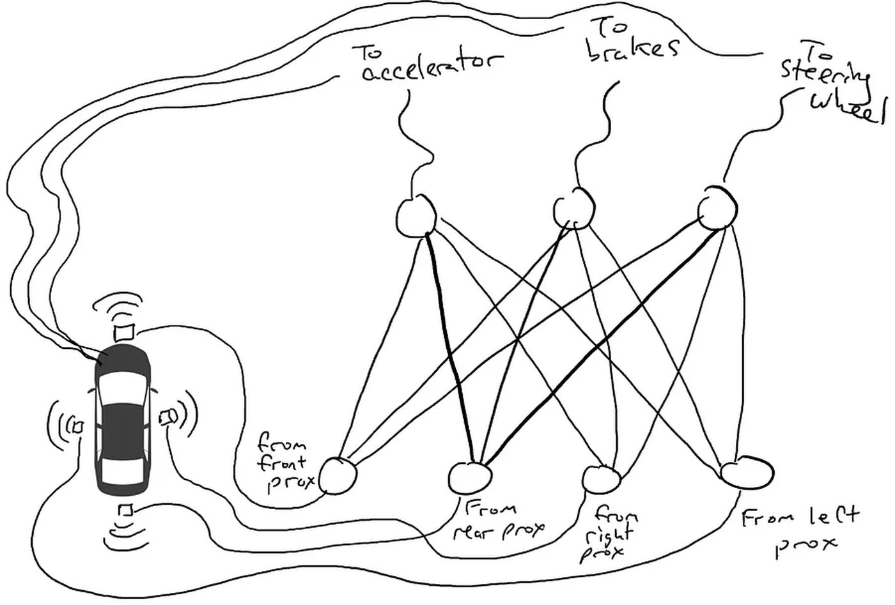

### Sources

corpus/Intro-Redes-Neuronales-105min.pptx.md (diapositiva 4). La metáfora está atribuida en el mazo original a Mark Riedl, *A Very Gentle Introduction to Large Language Models without the Hype*.

### Speaker notes

Abrí con esto y no adelantes nada de matemática. La metáfora tiene que quedar firme antes de la primera fórmula, porque es la que sostiene el resto de la clase y vuelve en el cierre como la idea número uno. Pediles que nombren los tres roles antes de que aparezcan: qué mide, qué decide y qué actúa. Si alguien pregunta por qué esto es una red neuronal y no simplemente un circuito, la respuesta es la diapositiva que sigue: porque los nodos se ajustan solos.

### Presenter feedback

---

## 2. Aprender es ajustar qué caminos conducen

### Content

Al principio los parámetros son azarosos y el auto choca. Probamos, medimos el error, retocamos apenas las compuertas y volvemos a probar. Después de muchísimas repeticiones, ciertos caminos quedan reforzados: son los que llevan del sensor correcto al actuador correcto.

**Esto es el entrenamiento.** No hay nadie programando reglas: hay un procedimiento incremental que ajusta números hasta que el comportamiento del circuito se parece al que queríamos.

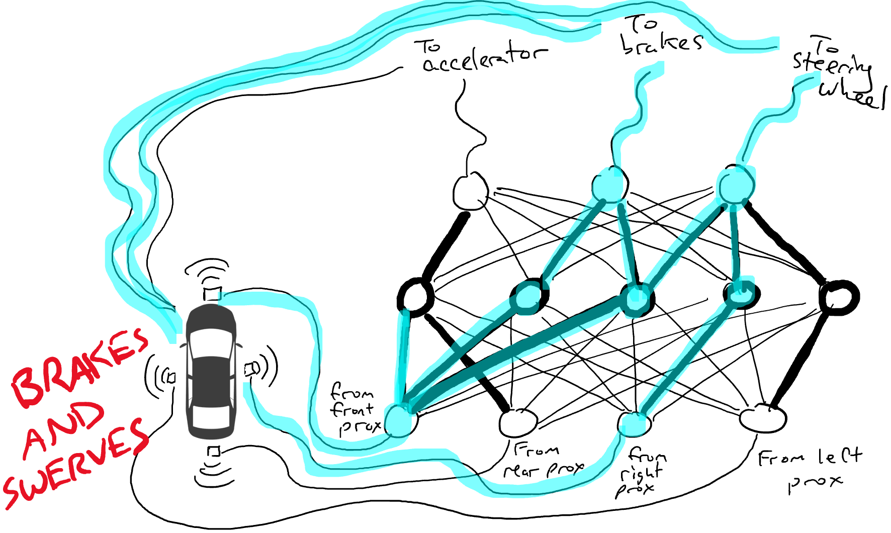

### Sources

corpus/Intro-Redes-Neuronales-105min.pptx.md (diapositiva 5)

### Speaker notes

Esta es la diapositiva que define entrenamiento, y conviene decir la frase completa en voz alta: nadie programa reglas. Es lo que más cuesta aceptar a quien viene de programar. El ciclo "adivinar, medir, corregir un poco, repetir" vuelve textual en el cierre como la sexta idea, así que dejalo instalado acá. Si querés anticipar, este ciclo es exactamente backpropagation, que es el último capítulo: lo único que falta es cómo se decide cuánto retocar cada compuerta.

### Presenter feedback

---

## 3. El modelo más simple que ya conocemos

### Content

Antes de complicar el circuito, recordemos el punto de partida: un modelo lineal que combina las entradas y produce una salida, y una medida del error entre lo que predijo y lo que esperábamos.

- **01 · La entrada.** Un vector de números `x`, las variables que describen el caso.
- **02 · El modelo.** Una combinación lineal de esas variables, con un peso por cada una.
- **03 · El error.** La suma de las diferencias al cuadrado entre lo que predijo y lo que esperábamos.

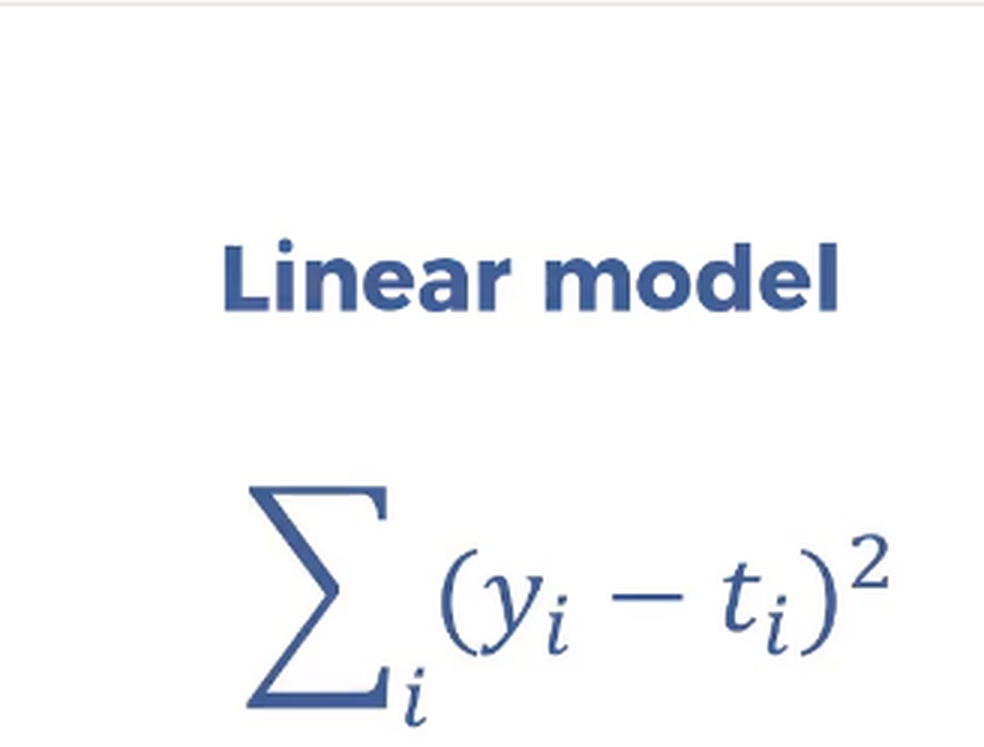

### Sources

corpus/Intro-Redes-Neuronales-105min.pptx.md (diapositiva 6)

### Speaker notes

Puente entre lo conocido y lo nuevo. La audiencia ya vio regresión lineal, así que esto es un repaso de treinta segundos, no una explicación. El detalle que sí conviene marcar: las tres piezas de esta diapositiva son exactamente las que van a reaparecer en toda la clase. La entrada es el vector x del capítulo 4, el modelo es la parte lineal de la neurona del capítulo 2, y el error es la función de coste del capítulo 6. Decirlo acá ahorra explicaciones después.

### Presenter feedback

---

# 2. La neurona y la capa

**Goal of this section:** Fijar la pieza mínima. Primero el motivo, que el mundo real no es lineal; después la neurona como combinación lineal; después la sigmoide como la no linealidad clásica; y por último la capa, que es el par de las dos y el bloque que se repite en cualquier red.

**Presenter feedback:**

---

## 1. El mundo real no es lineal

### Content

La temperatura a lo largo del año sube y baja; la distribución del ingreso cae de forma abrupta y después se aplana. Una recta puede aproximar el promedio, pero pierde justamente la forma que nos importa.

Si queremos mejores predicciones, necesitamos mejores modelos. Y **mejor** acá significa: capaz de representar curvas, saturaciones y quiebres.

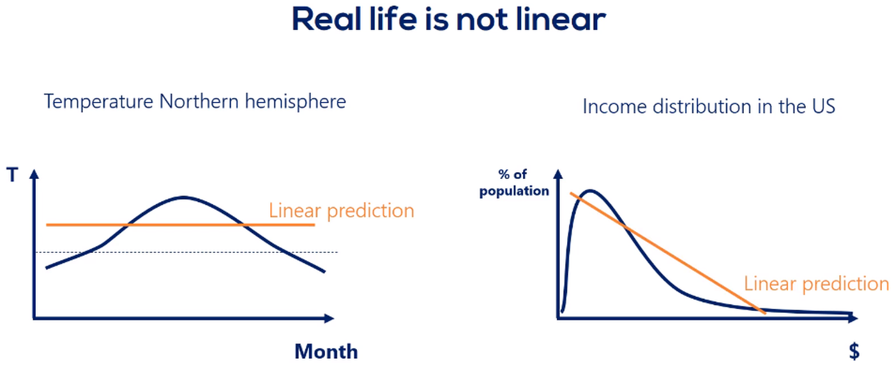

### Sources

corpus/Intro-Redes-Neuronales-105min.pptx.md (diapositiva 8)

### Speaker notes

El motivo antes que la herramienta. Los dos ejemplos son buenos porque son familiares y tienen formas distintas: la temperatura es periódica, el ingreso es una caída con cola. Pediles otros ejemplos de la vida real donde una recta claramente no alcanza; suelen salir buenos. La palabra clave es "forma": lo que la recta pierde no es precisión, es forma.

### Presenter feedback

---

## 2. La neurona: primero, una combinación lineal

### Content

Cada neurona recibe varias entradas, las multiplica por sus pesos, las suma y le agrega un sesgo. Ese único número es todo lo que produce la parte lineal.

`x` es el vector de entradas, `w` los pesos que la neurona aprendió y `b` el sesgo: un desplazamiento que le permite activarse antes o después.

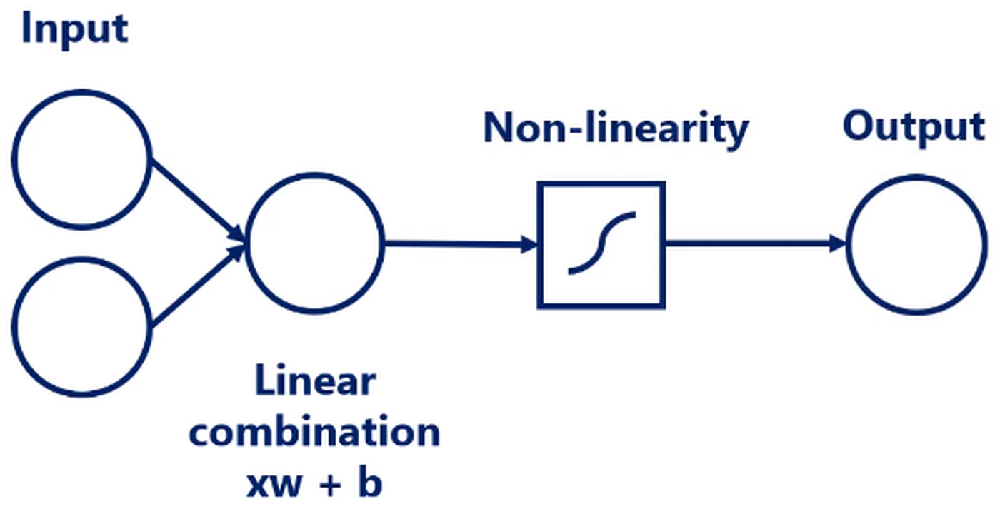

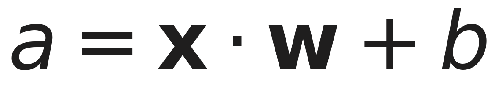

### Sources

corpus/Intro-Redes-Neuronales-105min.pptx.md (diapositiva 9)

### Speaker notes

Marcá el "primero" del título: la neurona todavía no está completa, falta la no linealidad, y eso llega en dos diapositivas. El sesgo es lo que más se pasa por alto; la frase que lo fija es la del mazo, "un desplazamiento que le permite activarse antes o después". Si querés una imagen, el sesgo mueve el umbral de decisión sin cambiar la pendiente.

### Presenter feedback

---

## 3. La sigmoide: la no linealidad clásica

### Content

La combinación lineal da un número cualquiera. La función sigmoide lo aplasta al intervalo entre 0 y 1, y con eso convierte una suma en algo que podemos leer como una probabilidad o como un grado de activación.

- **Rango acotado.** Devuelve siempre valores entre 0 y 1; se lee como probabilidad.
- **Diferenciable.** Es suave en todo punto: sin eso no habría backpropagation.
- **Monótona creciente.** Si sube la entrada, sube la salida. Conserva el orden.
- **Punto medio en 0.** `σ(0) = 0.5`; un umbral natural de decisión.

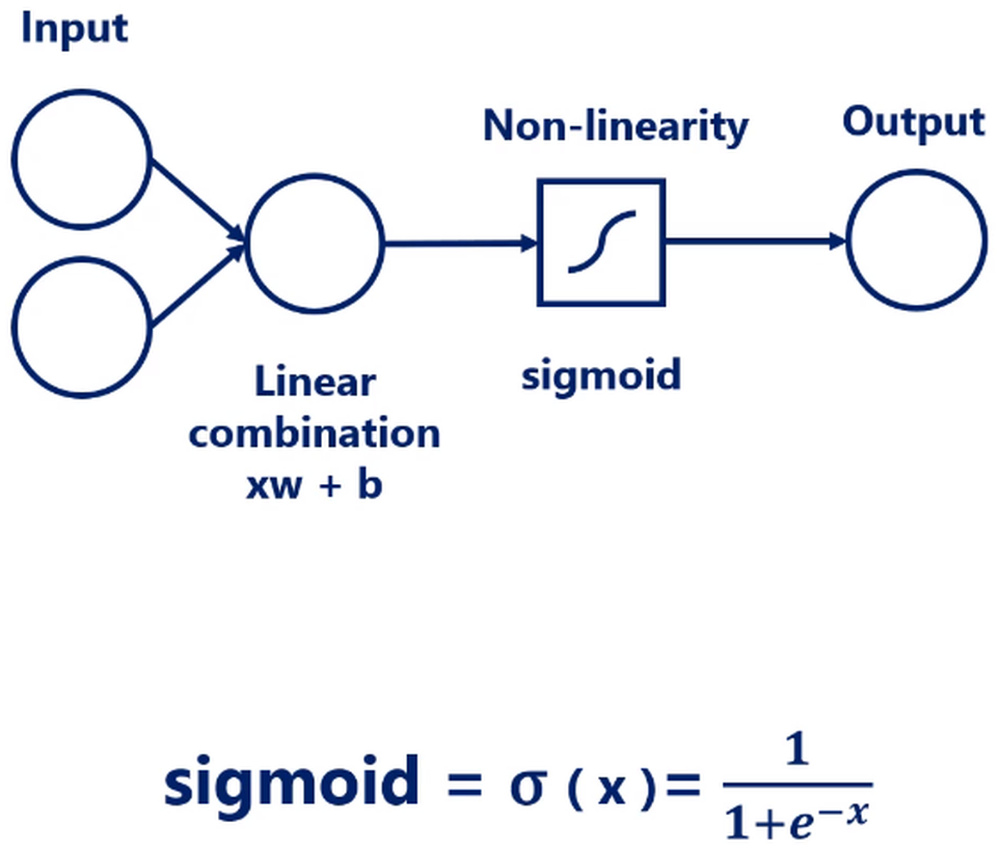

### Sources

corpus/Intro-Redes-Neuronales-105min.pptx.md (diapositiva 10)

### Speaker notes

De las cuatro propiedades, la que hay que subrayar es "diferenciable", porque es la única que se usa después: sin derivada no hay backpropagation, y eso es el capítulo 6. Aviso importante para no dejar una idea equivocada instalada: acá la sigmoide aparece como la no linealidad por defecto, pero en el capítulo 5 vamos a decir que el estándar en capas ocultas es ReLU. Si te alcanza el tiempo, adelantalo en una frase; si no, al menos no la presentes como "la que se usa hoy".

### Presenter feedback

---

## 4. La capa: el bloque que se repite

### Content

Combinación lineal seguida de una no linealidad. Ese par es una capa, y es la unidad con la que se construye cualquier red: **no hay una pieza más grande que aprender, solo esta repetida.**

Una capa toma un vector y devuelve otro vector. Encadenarlas es simplemente pasarle a la siguiente lo que produjo la anterior.

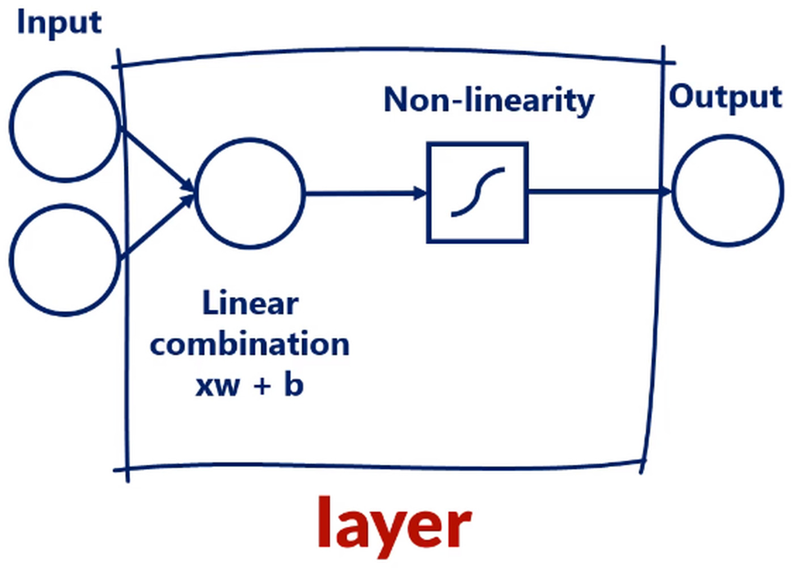

### Sources

corpus/Intro-Redes-Neuronales-105min.pptx.md (diapositiva 11)

### Speaker notes

Esta es la diapositiva más importante del capítulo y vuelve en el cierre como la segunda idea. La frase que se llevan: no hay una pieza más grande que entender. Sirve para bajar la ansiedad de quien cree que las arquitecturas modernas son otra cosa; son esta pieza repetida con variaciones. El "toma un vector y devuelve otro vector" es lo que hace obvio el encadenado, y prepara el producto matricial del capítulo 4.

### Presenter feedback

---

# 3. Redes profundas

**Goal of this section:** Pasar de una capa a muchas y dar el vocabulario que ordena cualquier arquitectura: qué es una capa oculta, cuáles son las dos dimensiones que la describen, y la distinción entre lo que fija el que diseña y lo que descubre la red.

**Presenter feedback:**

---

## 1. Apilar capas: qué es una red profunda

### Content

Entre la entrada y la salida metemos capas intermedias. Se llaman **ocultas** porque no las observamos directamente: no son ni el dato que entra ni la respuesta que sale.

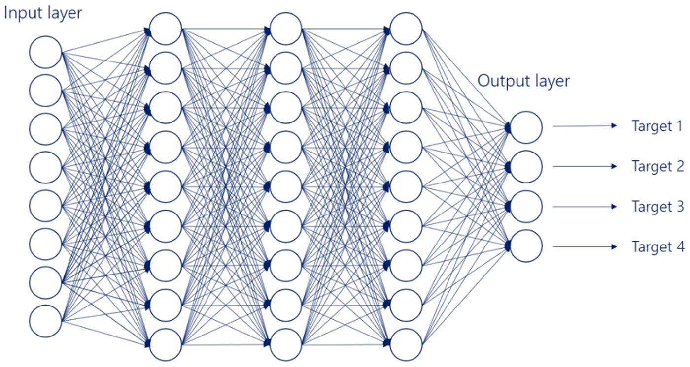

### Sources

corpus/Intro-Redes-Neuronales-105min.pptx.md (diapositiva 13)

### Speaker notes

Diapositiva corta, un minuto. El único punto que hay que dejar claro es de dónde sale la palabra "oculta", porque suena a misterio y no lo es: oculta significa que no la observás, ni a la entrada ni a la salida. Si alguien pregunta qué representan esas unidades, la respuesta honesta es que nadie se lo indicó y la red lo descubre sola; está desarrollado en el anexo, diapositiva 7.3.

### Presenter feedback

---

## 2. Las dos dimensiones: ancho y profundidad

### Content

Toda arquitectura se describe con dos números. Cambiarlos cambia por completo la capacidad, y el costo, del modelo.

- **01 · Ancho.** La cantidad de unidades dentro de una capa. El ancho de la red es el de su capa más grande.
- **02 · Profundidad.** La cantidad de capas ocultas. No cuentan ni la entrada ni la salida: solo lo que hay en el medio.

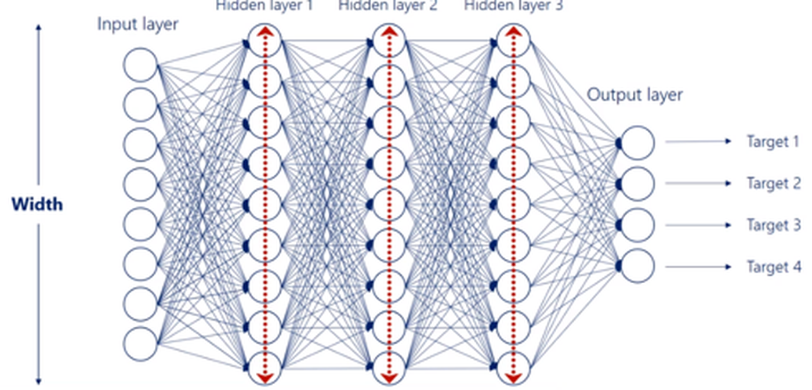

### Sources

corpus/Intro-Redes-Neuronales-105min.pptx.md (diapositiva 14)

### Speaker notes

Dos definiciones y listo. El detalle que se pregunta siempre: la profundidad no cuenta la capa de entrada ni la de salida. Una red "de tres capas" en la jerga suele significar tres ocultas, y conviene aclararlo porque los papers no son consistentes. Señalá el diagrama con el dedo mientras decís cada número.

### Presenter feedback

---

## 3. Parámetros contra hiperparámetros

### Content

Es la distinción que más confusión genera, y es simple: unos los fija quien diseña el modelo antes de entrenar; los otros los descubre la red mientras entrena.

| Aspecto | Hiperparámetros | Parámetros |
|---|---|---|
| ¿Quién los fija? | Los definimos nosotros, a mano, antes de entrenar | Los aprende la red durante el entrenamiento |
| Ejemplos | Ancho, profundidad, tasa de aprendizaje η, tamaño de lote | Pesos `w` de cada conexión y sesgos `b` de cada unidad |
| ¿Cuándo cambian? | Solo si volvemos a lanzar el entrenamiento | En cada iteración, con cada lote de datos |
| ¿Cuántos hay? | Unos pocos: decenas como mucho | Millones, o miles de millones en modelos grandes |
| ¿Cómo se eligen? | Búsqueda, experiencia previa y validación | Descenso por gradiente sobre el error |

Ajustar hiperparámetros es un **ciclo externo**; entrenar es el **ciclo interno** que corre dentro de cada configuración.

### Sources

corpus/Intro-Redes-Neuronales-105min.pptx.md (diapositiva 15)

### Speaker notes

La tabla es de referencia, no la leas entera. Detenete en dos filas: la de cuántos hay, que da la escala real (decenas contra millones), y la del ciclo externo contra el interno, que es la que ordena todo. La confusión típica es creer que la tasa de aprendizaje se aprende; no, se elige. El ciclo de ajuste completo está desarrollado en el anexo, diapositiva 7.6.

### Presenter feedback

---

# 4. El recorrido completo

**Goal of this section:** Recorrer una red concreta de punta a punta, con números que se pueden verificar a mano. Ocho variables meteorológicas, nueve unidades ocultas, y de ahí salen las 72 conexiones, la matriz 8×9 y el producto matricial. Que salgan sabiendo anticipar las dimensiones de cualquier capa.

**Presenter feedback:**

---

## 1. Tres preguntas antes de empezar

### Content

Del input a la salida con un caso real: pesos, matrices y notación.

- **01 · ¿Cómo se ve un caso real?** Ocho variables meteorológicas entrando a una red concreta.
- **02 · ¿Dónde viven los pesos?** En una matriz cuyas dimensiones podemos anticipar de memoria.
- **03 · ¿Cómo se calcula una capa?** Un producto matricial y una función de activación. Nada más.

### Sources

corpus/Intro-Redes-Neuronales-105min.pptx.md (diapositiva 17)

### Speaker notes

Es la diapositiva de encuadre del capítulo. Léela rápido y no la desarrolles: las tres respuestas son las tres diapositivas que siguen. Sirve para que sepan dónde están parados en el capítulo más denso de la clase. El "nada más" del punto tres es deliberado y conviene decirlo con énfasis: una capa es un producto y una función, no hay una tercera cosa escondida.

### Presenter feedback

---

## 2. Un caso concreto: predecir el clima

### Content

Ocho variables de entrada, temperatura media, máxima, mínima, humedad, precipitación, presión, nubosidad y visibilidad, y una primera capa oculta de nueve unidades. Con este ejemplo vamos a recorrer todo el camino, de punta a punta.

- **01 · Ocho entradas.** Una unidad por variable medida. Es el vector `x` que entra a la red.
- **02 · Nueve unidades ocultas.** El ancho de la primera capa. Lo elegimos nosotros: es un hiperparámetro.
- **03 · Setenta y dos conexiones.** Cada entrada se conecta con cada unidad oculta. Ahí viven los pesos que se aprenden.

### Sources

corpus/Intro-Redes-Neuronales-105min.pptx.md (diapositiva 18)

### Speaker notes

El ejemplo del clima es el hilo de todo el capítulo, así que instalá los tres números y no los cambies después: ocho, nueve, setenta y dos. Antes de mostrar el tercer punto, preguntá cuántas conexiones hay; que hagan la cuenta ellos. El nueve es un hiperparámetro elegido, y conviene decirlo para que se vea el capítulo anterior en acción.

### Presenter feedback

---

## 3. Cada conexión es un peso

### Content

Cada flecha que sale de una unidad de entrada y llega a una unidad oculta tiene su propio número asociado. Ese número es lo que la red aprende.

Ocho entradas por nueve unidades ocultas dan 72 conexiones. Setenta y dos números que arrancan al azar y que el entrenamiento va a corregir, uno por uno.

A los 72 pesos se les suma un sesgo por unidad oculta: nueve números más que también se aprenden. **En total, 81 parámetros solo en esta primera capa.**

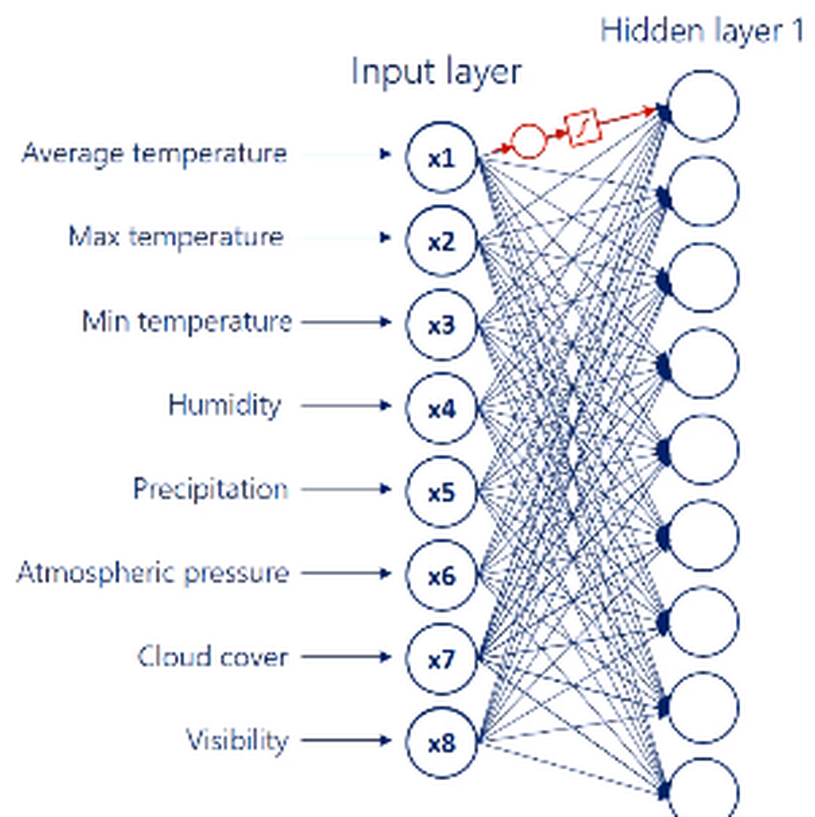

### Sources

corpus/Intro-Redes-Neuronales-105min.pptx.md (diapositiva 19)

### Speaker notes

Acá aparecen los sesgos, que en la diapositiva anterior no estaban contados. Hacé la suma en voz alta: 72 más 9 son 81. Es la primera vez en la clase que aparece un conteo de parámetros y conviene que sea a mano, porque después los números se vuelven enormes y dejan de tener escala. Si alguien pregunta por qué un sesgo por unidad y no uno por conexión: el sesgo desplaza la unidad entera, no cada entrada por separado.

### Presenter feedback

---

## 4. Todos los pesos, en una matriz

### Content

Los 72 números no viven sueltos: se ordenan en una matriz de 8 filas por 9 columnas. Cada fila es una variable de entrada y cada columna, una unidad de la capa oculta.

- **01 · Las filas.** Una por cada variable de entrada: ocho filas, de `w1·` a `w8·`.
- **02 · Las columnas.** Una por cada unidad oculta: nueve columnas.
- **03 · La celda.** El peso de esa conexión concreta. Es el número que el entrenamiento corrige.

Pensar en matrices no es un capricho de notación. Es lo que permite calcular la capa entera con una sola operación y aprovechar la GPU.

### Sources

corpus/Intro-Redes-Neuronales-105min.pptx.md (diapositiva 20)

### Speaker notes

El salto conceptual del capítulo: de flechas sueltas a una estructura. La frase que lo justifica es la del final, y vale decirla completa, porque si no la matriz parece notación por notación. Señalá una celda concreta en el diagrama y preguntá qué conexión es; el ejercicio de leer la matriz es lo que fija la convención fila-columna. La notación de subíndices está en el anexo, diapositiva 7.7.

### Presenter feedback

---

## 5. El cálculo de la capa es un producto matricial

### Content

El vector de entrada multiplica a la matriz de pesos, y el resultado es el vector de la capa oculta. Las dimensiones encajan de una única manera posible.

- **01 · Entrada.** Un vector fila de 8 números: una observación del clima.
- **02 · Pesos.** La matriz de 8×9 que la red aprendió.
- **03 · Salida.** Un vector de 9 números: la capa oculta, antes de aplicar la activación.

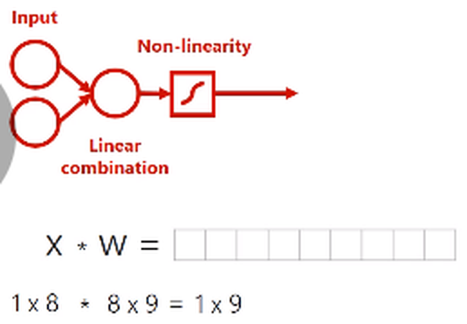

### Sources

corpus/Intro-Redes-Neuronales-105min.pptx.md (diapositiva 21)

### Speaker notes

Marcá el "antes de aplicar la activación" del punto tres: la capa todavía no está terminada, falta la no linealidad, que es el capítulo que sigue. Es el enganche entre los dos capítulos y conviene dejarlo explícito. La frase "las dimensiones encajan de una única manera posible" es la que prepara la regla práctica de la diapositiva siguiente.

### Presenter feedback

---

## 6. Resumen de dimensiones

### Content

Con esta tabla se puede reconstruir la arquitectura completa del ejemplo, y verificar que ninguna multiplicación quede mal encajada.

| Etapa | Dimensión | Qué representa |
|---|---|---|
| Entrada `x` | 1 × 8 | Las ocho variables meteorológicas de una observación |
| Pesos `W⁽¹⁾` | 8 × 9 | Todas las conexiones entre la entrada y la primera capa oculta |
| Capa oculta `h⁽¹⁾` | 1 × 9 | El resultado del producto, ya pasado por la activación |
| Pesos `W⁽ⁿ⁾` | 100 × 4 | Las conexiones entre la última capa oculta y la salida |
| Salida `y` | 1 × 4 | Los cuatro valores que la red predice |

**Regla práctica:** el número de columnas de la izquierda tiene que coincidir con el de filas de la derecha. Si no coincide, la arquitectura está mal planteada.

### Sources

corpus/Intro-Redes-Neuronales-105min.pptx.md (diapositiva 22)

### Speaker notes

Ojo con un salto de la tabla original, que conviene tapar en vivo: el ejemplo se construyó con 8 entradas y 9 unidades ocultas, y las dos últimas filas pasan de golpe a 100×4 sin decir de dónde salen las 100 unidades ni las 4 salidas. Decilo vos: entre la primera capa oculta y la salida hay otras capas que no dibujamos, la última tiene 100 unidades y la red predice 4 valores. Está desarrollado en el anexo, diapositiva 7.9. Sin esa aclaración la tabla parece tener un error.

### Presenter feedback

---

# 5. Funciones de activación

**Goal of this section:** Responder por qué la no linealidad es obligatoria, mostrar el colapso que ocurre sin ella, y dar el catálogo de las cuatro funciones con el criterio para elegir. Cierra con softmax y la advertencia de dónde se aplica.

**Presenter feedback:**

---

## 1. Tres preguntas antes de empezar

### Content

Por qué sin no linealidad la red colapsa, y cuál conviene elegir.

- **01 · ¿Qué pasa si no ponemos activación?** La red profunda colapsa en una sola capa lineal.
- **02 · ¿Qué hace exactamente la activación?** Transforma la salida de la combinación lineal en algo de otra naturaleza.
- **03 · ¿Cuál conviene usar?** Sigmoide, tanh, ReLU y softmax, y en qué situación va cada una.

### Sources

corpus/Intro-Redes-Neuronales-105min.pptx.md (diapositiva 24)

### Speaker notes

Encuadre del capítulo, léelo rápido. La respuesta al punto uno ya está adelantada en la propia diapositiva, y está bien: el spoiler es el gancho. La analogía del termostato, que explica bien el punto dos, está en el anexo, diapositiva 7.10, y es la que más ayuda si ves caras de duda.

### Presenter feedback

---

## 2. ¿Por qué necesitamos no linealidades?

### Content

Es la pregunta que sostiene todo el capítulo, y conviene contestarla antes de mirar una sola fórmula más.

> Necesitamos las no linealidades para poder romper la linealidad y representar relaciones más complicadas.

- **Sin no linealidad.** La red puede ser tan profunda como queramos: sigue siendo equivalente a una única transformación lineal. Diez capas y una capa tienen el mismo poder expresivo.
- **Con no linealidad.** Cada capa dobla el espacio a su manera. Al encadenarlas podemos aproximar prácticamente cualquier función continua, que es el **teorema de aproximación universal**.

La no linealidad no es un detalle de implementación. Es lo único que justifica apilar capas.

### Sources

corpus/Intro-Redes-Neuronales-105min.pptx.md (diapositiva 25)

### Speaker notes

Es la diapositiva bisagra de la clase: sin ella, todo el capítulo 3 no se justifica. La frase del cierre vuelve textual en las conclusiones como la tercera idea. Sobre el teorema de aproximación universal, decilo pero no lo desarrolles: garantiza que existe una red que aproxima la función, no dice cuántas unidades hace falta ni cómo encontrarla, y esa distinción es la que evita que suene a magia.

### Presenter feedback

---

## 3. Sin activación, la red colapsa

### Content

Dos transformaciones lineales encadenadas equivalen a una sola. Multiplicar por `W₁` y después por `W₂` es lo mismo que multiplicar por una única matriz `W*`: la profundidad desaparece.

**Diez capas lineales tienen exactamente el mismo poder expresivo que una.** La no linealidad es lo único que impide ese colapso.

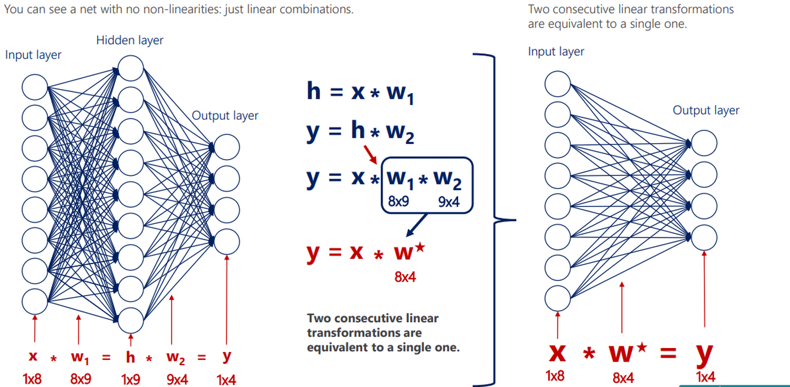

### Sources

corpus/Intro-Redes-Neuronales-105min.pptx.md (diapositiva 26)

### Speaker notes

La demostración es de una línea y conviene hacerla en el pizarrón, no leerla: W₂(W₁x) = (W₂W₁)x = W*x. Cuando lo ven escrito ya no se discute. La pregunta de control que funciona: ¿qué pasa si saco la activación de una red de diez capas? Respuesta, te queda una regresión lineal disfrazada. Conecta directo con el capítulo 2, donde la capa se definió como el par lineal más no lineal.

### Presenter feedback

---

## 4. Las funciones de activación más comunes

### Content

Todas comparten tres propiedades que el entrenamiento necesita: son **monótonas, continuas y diferenciables**. Se diferencian en el rango de salida y en cómo se comportan sus derivadas.

| Función | Definición | Rango | Cuándo usarla |
|---|---|---|---|
| Sigmoide | `σ(a) = 1 / (1 + e⁻ᵃ)` | (0, 1) | Salida binaria; interpretable como probabilidad |
| Tanh | `(eᵃ − e⁻ᵃ) / (eᵃ + e⁻ᵃ)` | (−1, 1) | Capas ocultas; centrada en 0, converge más rápido que la sigmoide |
| ReLU | `max(0, a)` | [0, ∞) | El estándar en capas ocultas: barata y evita el gradiente que se desvanece |
| Softmax | `eᵃⁱ / Σⱼ eᵃʲ` | (0, 1) | Capa de salida en clasificación multiclase; las salidas suman 1 |

La derivada importa tanto como la función: es la que viaja hacia atrás durante el entrenamiento. **Una derivada que se aplana frena el aprendizaje.**

### Sources

corpus/Intro-Redes-Neuronales-105min.pptx.md (diapositiva 27)

### Speaker notes

Acá se corrige la impresión que dejó el capítulo 2: la sigmoide fue el default histórico, pero el estándar en capas ocultas hoy es ReLU. Decilo explícito, porque tres capítulos atrás presentamos la sigmoide como "la" no linealidad. La última frase es la que conecta con backpropagation y conviene subrayarla: la derivada que se aplana es el gradiente que se desvanece, y ese es el problema de la sigmoide. El porqué histórico y la derivada de la sigmoide están en el anexo, diapositiva 7.11.

### Presenter feedback

---

## 5. Softmax: de puntajes a probabilidades

### Content

En la capa de salida no queremos números sueltos sino una distribución. Softmax toma valores arbitrariamente grandes o chicos y devuelve probabilidades que suman exactamente 1.

**Ojo con dónde se aplica.** Softmax se usa en la activación de la capa final. Si se la aplica en una capa oculta, se pierde información sobre la magnitud de los valores y solo sobrevive su proporción.

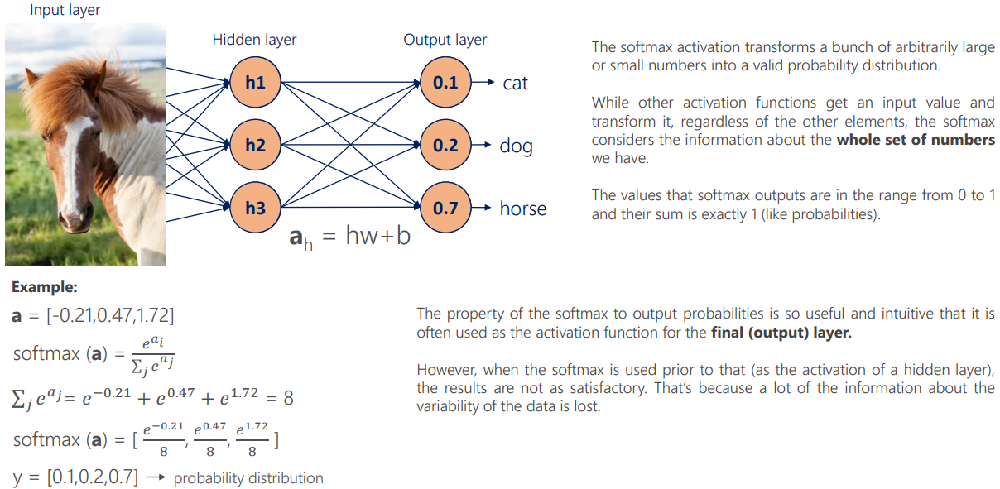

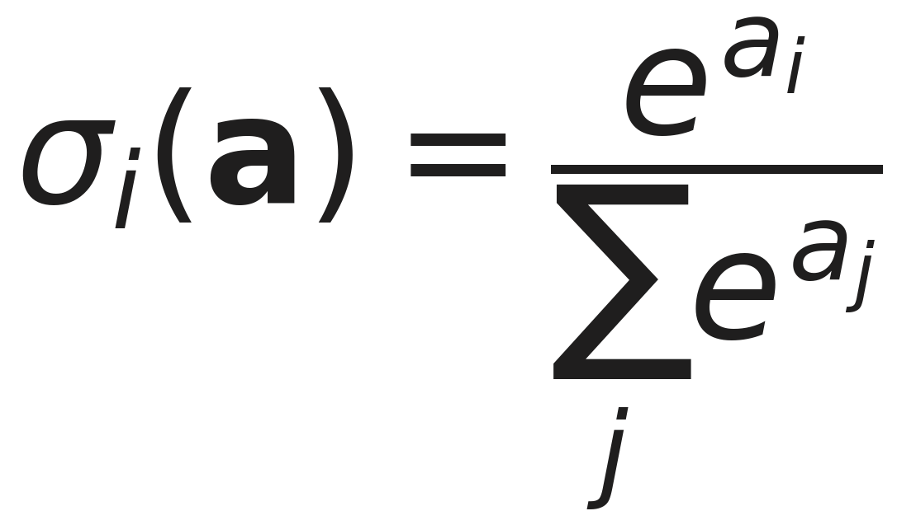

### Sources

corpus/Intro-Redes-Neuronales-105min.pptx.md (diapositiva 28)

### Speaker notes

La advertencia es el punto de la diapositiva, no la fórmula. Softmax en una capa oculta es un error que se ve en trabajos de alumnos, y la razón es concreta: normaliza, así que la magnitud se pierde y solo queda la proporción. Softmax es también la única de las cuatro que mira todas las unidades de salida a la vez; las otras tres se aplican número por número. Vale la pena marcarlo.

### Presenter feedback

---

# 6. Backpropagation

**Goal of this section:** Abrir la caja del entrenamiento. Cómo la red mide su error, cómo reparte la culpa entre los pesos con la regla de la cadena, y cómo corrige cada uno. Es el capítulo que convierte "adivinar y corregir" del capítulo 1 en un procedimiento concreto.

**Presenter feedback:**

---

## 1. Tres preguntas antes de empezar

### Content

Cómo la red mide su error y ajusta cada uno de sus pesos.

- **01 · ¿Cómo sabe la red que se equivocó?** Una función de coste que compara la predicción con el objetivo.
- **02 · ¿Cómo reparte la culpa entre pesos?** La regla de la cadena, aplicada capa por capa hacia atrás.
- **03 · ¿Cómo se corrige cada peso?** Un paso en la dirección opuesta al gradiente, del tamaño de η.

### Sources

corpus/Intro-Redes-Neuronales-105min.pptx.md (diapositiva 30)

### Speaker notes

Encuadre del capítulo más denso. Las tres preguntas son literalmente las tres diapositivas que siguen, y decirlo baja la ansiedad: no es un bloque indivisible, son tres pasos. Si el grupo viene cansado, este es el momento de avisar que lo que sigue se puede seguir con lápiz y papel y que no hay que memorizar nada.

### Presenter feedback

---

## 2. Ida y vuelta: forward y backward

### Content

El entrenamiento es un ciclo de dos movimientos. Hacia adelante, la red calcula su predicción; hacia atrás, propaga el error y ajusta cada peso según cuánto contribuyó a equivocarse.

- **01 · Propagación hacia adelante.** Empujar la entrada a través de la red. Al final de cada época, comparamos las salidas obtenidas con los objetivos y formamos el error.
- **02 · Propagación hacia atrás.** Propagar ese error hacia atrás por la red y actualizar los parámetros, pesos y sesgos, en consecuencia.

### Sources

corpus/Intro-Redes-Neuronales-105min.pptx.md (diapositiva 31)

### Speaker notes

El mapa del capítulo. Volvé explícitamente al auto del capítulo 1: forward es dejar que el auto ande, backward es retocar las compuertas después de ver dónde chocó. Es el mismo ciclo, ahora con nombre. La palabra "época" aparece por primera vez acá; definila al pasar, una pasada completa por todos los datos de entrenamiento.

### Presenter feedback

---

## 3. El error: la función de coste

### Content

Necesitamos un único número que resuma qué tan mal lo hizo la red. La pérdida L2 suma las diferencias al cuadrado entre lo que predijo y lo que debería haber predicho.

- **Al cuadrado.** Los errores por exceso y por defecto no se cancelan entre sí, y los grandes pesan más que los chicos.
- **El medio.** El factor ½ no cambia dónde está el mínimo: está puesto para que la derivada quede limpia.
- **Diferenciable.** Es lo que permite calcular el gradiente y saber en qué dirección mover cada peso.

`y` es lo que la red predijo y `t` el objetivo, el valor verdadero del dato de entrenamiento. La suma recorre todas las unidades de salida.

### Sources

corpus/Intro-Redes-Neuronales-105min.pptx.md (diapositiva 32)

### Speaker notes

Las tres justificaciones son buenas porque desarman las tres preguntas que siempre salen. La del medio es la que más sorprende: está puesto por comodidad algebraica, el 2 del exponente baja al derivar y se cancela. Decilo, porque si no parece arbitrario. Conectá con el capítulo 1: esta es la misma "suma de diferencias al cuadrado" que apareció en el modelo lineal, ahora con nombre.

### Presenter feedback

---

## 4. La regla de la cadena

### Content

¿Cuánto cambia el error si movemos un peso en particular? El peso no toca el error directamente: lo hace a través de la suma ponderada, y esta a través de la activación. La regla de la cadena encadena esos tres efectos.

- **01 · Cuánto cambia el error si cambia la salida.** Sale directo de la función de coste: la diferencia entre predicción y objetivo.
- **02 · Cuánto cambia la salida si cambia la suma.** Es la derivada de la activación evaluada en ese punto.
- **03 · Cuánto cambia la suma si cambia el peso.** Es simplemente la entrada que multiplicaba a ese peso.

### Sources

corpus/Intro-Redes-Neuronales-105min.pptx.md (diapositiva 33)

### Speaker notes

El corazón matemático, y se entiende si se recorre en orden. La clave está en la primera frase: el peso no toca el error directamente. Dibujá la cadena en el pizarrón, peso, suma, activación, error, y recorrela con el dedo hacia atrás. El tercer factor es el que más sorprende por lo simple: la derivada de la suma respecto de un peso es la entrada que lo multiplicaba, nada más.

### Presenter feedback

---

## 5. Capa de salida: el delta

### Content

Agrupamos los dos primeros factores en un solo término, `δ`, que representa la sensibilidad del error respecto de la suma ponderada de esa unidad.

Con `δ` calculado, el gradiente de cualquier peso que llega a la unidad es una multiplicación.

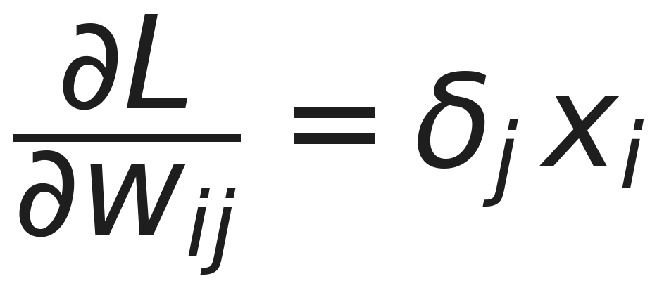

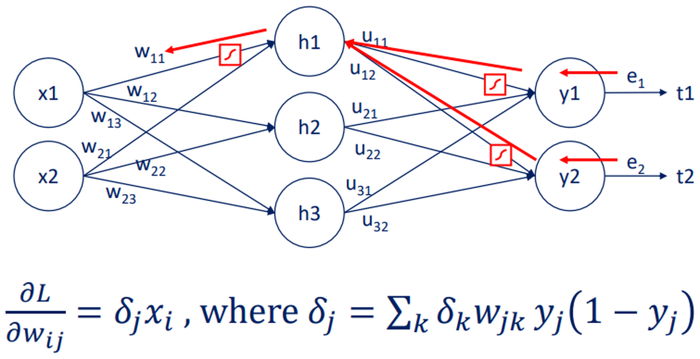

### Sources

corpus/Intro-Redes-Neuronales-105min.pptx.md (diapositiva 34)

### Speaker notes

Delta es una abreviatura, no un concepto nuevo, y conviene decirlo así para que no asuste: son los dos primeros factores de la diapositiva anterior, juntos. La ganancia es concreta: una vez que tenés delta, el gradiente de cualquier peso que llega a esa unidad es una multiplicación, no hay que rehacer la cadena. Esa economía es la que hace viable entrenar millones de parámetros.

### Presenter feedback

---

## 6. Capa oculta: propagar el delta hacia atrás

### Content

Una unidad oculta no tiene un objetivo con el cual compararse: nadie le dice cuál era su valor correcto. Su culpa se calcula sumando los deltas de todas las unidades de la capa siguiente a las que alimenta, ponderados por los pesos que las conectan.

- **01 · Capa de salida.** `δ` se calcula directo: hay un objetivo contra el cual comparar.
- **02 · Capas ocultas.** `δ` se hereda de la capa siguiente, ponderado por los pesos de conexión.
- **03 · Recursión.** El mismo cálculo se repite hacia atrás, hasta llegar a la primera capa.

**Acá está el corazón del algoritmo.** El error se reparte hacia atrás capa por capa: cada unidad recibe la parte de culpa que le corresponde según cuánto influyó en las que venían después. De ahí el nombre "propagación hacia atrás".

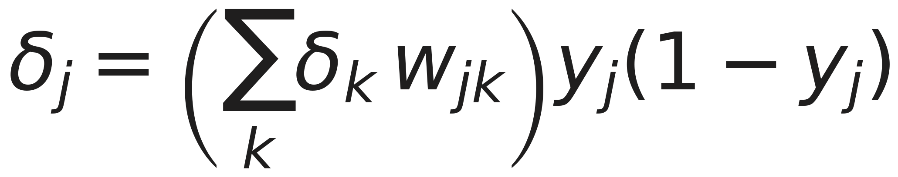

### Sources

corpus/Intro-Redes-Neuronales-105min.pptx.md (diapositiva 35)

### Speaker notes

Esta es la diapositiva que le da nombre al algoritmo, y la pregunta que la abre es la correcta: ¿contra qué se compara una unidad oculta? Contra nada, no tiene objetivo propio. La respuesta, que hereda la culpa de las unidades que alimenta, es lo que hay que dejar firme. La palabra "culpa" funciona mejor que "error" para explicarlo: cada unidad recibe la parte que le toca según cuánto influyó.

### Presenter feedback

---

## 7. El paso de actualización

### Content

Con el gradiente calculado, corregir el peso es restar una fracción de él. La tasa de aprendizaje `η` controla el tamaño del paso, y es uno de los hiperparámetros más sensibles del entrenamiento.

- **η muy chico.** El entrenamiento avanza, pero tan despacio que puede volverse impracticable.
- **η muy grande.** Los pasos se pasan del mínimo y el error oscila o directamente diverge.
- **El signo menos.** El gradiente apunta hacia donde el error crece; nos movemos justo en la dirección opuesta.

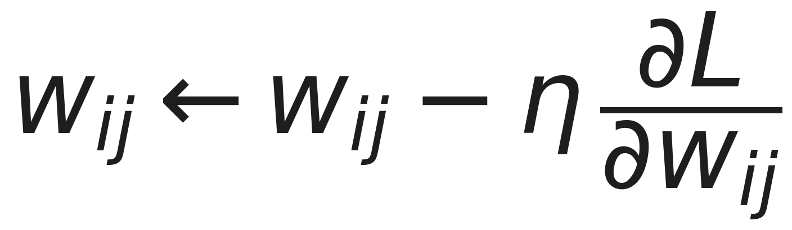

### Sources

corpus/Intro-Redes-Neuronales-105min.pptx.md (diapositiva 36)

### Speaker notes

Cierre del capítulo y del recorrido técnico. El signo menos es el detalle que más se pasa por alto y el que más confunde después: el gradiente apunta hacia arriba, nosotros queremos bajar. La imagen de la pelota bajando por un valle funciona, con η como el tamaño del paso: pasos chicos tardan una eternidad, pasos grandes saltan de una ladera a la otra sin bajar nunca. Volvé al capítulo 3: η es un hiperparámetro, se elige, no se aprende.

### Presenter feedback

---

# 7. Anexo: material de apoyo

**Goal of this section:** Las doce diapositivas que el mazo original dejó fuera del recorrido de 105 minutos. Sirven para responder preguntas en vivo o como material de lectura posterior. No se dan seguidas: se sacan cuando la pregunta aparece.

**Presenter feedback:**

---

## 1. Cada nodo decide cuánta energía deja pasar

### Content

Los nodos no son cables pelados: cada uno tiene una compuerta que decide si conduce mucha, poca o ninguna electricidad hacia el siguiente. Ese "cuánto deja pasar" es todo el secreto.

- **01 · Sensor.** La entrada. Un número que describe algo del mundo: una distancia, una temperatura, un píxel.
- **02 · Compuerta.** El nodo intermedio. Deja pasar más o menos energía según el parámetro que aprendió.
- **03 · Actuador.** La salida. Frenar o acelerar; en una red real, una clase o un número.

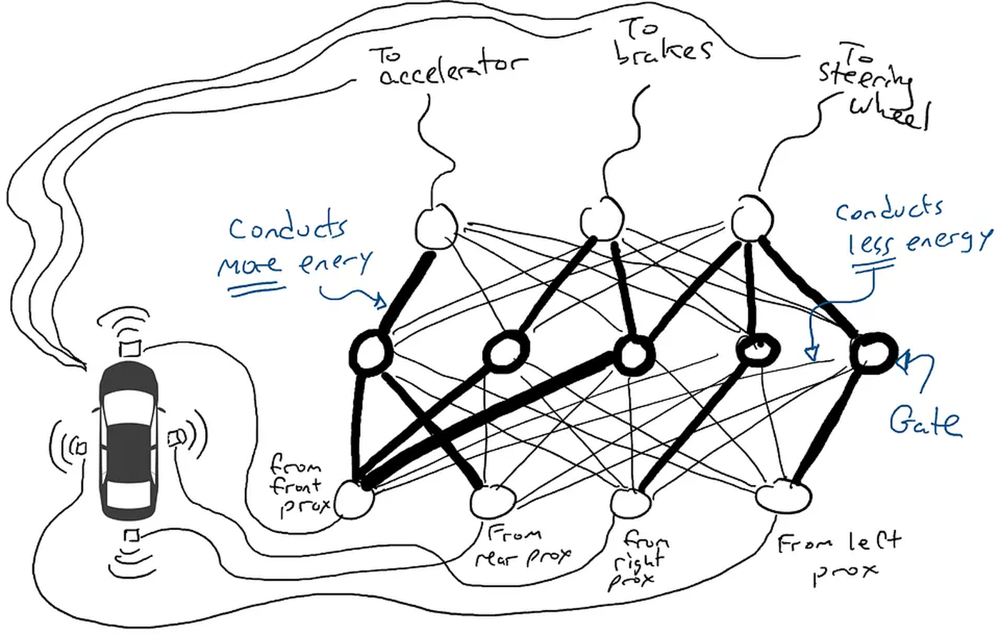

### Sources

corpus/Intro-Redes-Neuronales-105min.pptx.md (diapositiva 40, anexo)

### Speaker notes

Extiende la 1.1. Sacala si alguien pregunta qué hace exactamente un nodo, porque nombra los tres roles con precisión.

### Presenter feedback

---

## 2. Deep Learning: el mismo truco, más piezas

### Content

Deep Learning es el reconocimiento de que podemos poner otras cosas en el circuito además de resistencias y compuertas. Por ejemplo, un cálculo matemático en el medio que suma y multiplica antes de dejar pasar la electricidad. La técnica de fondo, adivinar parámetros de forma incremental, sigue siendo exactamente la misma.

- **Más piezas.** Dentro de cada nodo entra una operación matemática, no solo una compuerta binaria.
- **Más capas.** Los nodos se organizan en capas sucesivas: la salida de una es la entrada de la siguiente.
- **Misma idea.** Adivinar, medir el error, corregir. Repetir millones de veces.

**"Deep" no se refiere a la profundidad conceptual, sino a la cantidad de capas apiladas.**

### Sources

corpus/Intro-Redes-Neuronales-105min.pptx.md (diapositiva 41, anexo)

### Speaker notes

La aclaración del final es la que más rinde y la pregunta aparece seguido: qué tiene de profundo el deep learning. Nada conceptual, son capas apiladas.

### Presenter feedback

---

## 3. Del ejemplo mínimo a la red neuronal

### Content

En el ejemplo mínimo entrenamos una red sin profundidad: una capa de entrada, una de salida y nada en el medio. La salida era una combinación lineal de la entrada, nada que una regresión no pudiera hacer.

- **01 · Ejemplo mínimo.** Sin capas ocultas. La salida es una combinación lineal de la entrada, y el modelo se queda ahí.
- **02 · Red neuronal.** Sigue apoyándose en combinaciones lineales, pero les agrega una no linealidad a cada una.

Mezclando ambas cosas podemos modelar funciones arbitrarias.

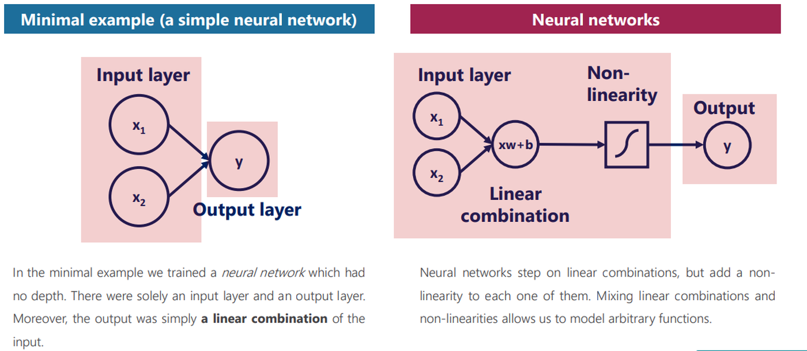

### Sources

corpus/Intro-Redes-Neuronales-105min.pptx.md (diapositiva 42, anexo)

### Speaker notes

Puente entre la 1.3 y el capítulo 2. Útil si alguien pregunta en qué se diferencia esto de una regresión.

### Presenter feedback

---

## 4. ¿Qué pasa dentro de las capas ocultas?

### Content

Esta es la pregunta incómoda. No hay una etiqueta que diga qué representa cada unidad: la red descubre por su cuenta qué combinaciones de la entrada le sirven para reducir el error.

Las capas ocultas construyen **representaciones intermedias**. En una red de visión, las primeras detectan bordes; las siguientes, texturas; las últimas, objetos. Nadie se lo indicó.

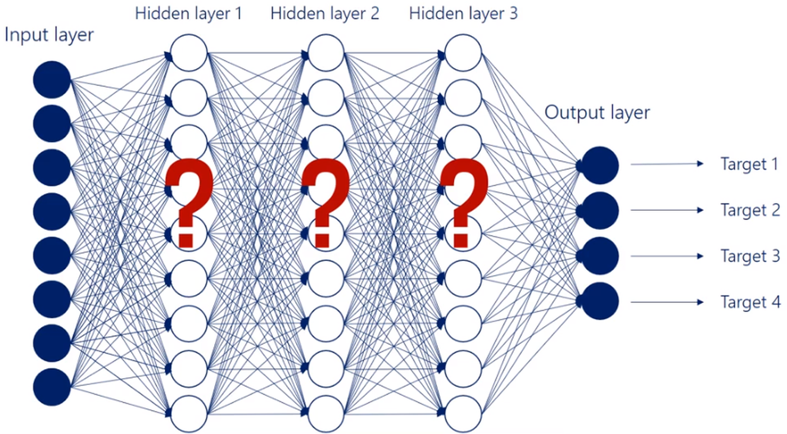

### Sources

corpus/Intro-Redes-Neuronales-105min.pptx.md (diapositiva 43, anexo)

### Speaker notes

Es la pregunta que sale sí o sí en la 3.1. Tenela a mano. El ejemplo de bordes, texturas y objetos es el que la vuelve concreta, y el remate importa: nadie se lo indicó.

### Presenter feedback

---

## 5. Cómo leer un diagrama de red

### Content

Los círculos son unidades, las flechas son transformaciones matemáticas con pesos asociados, y cada columna es una capa. Con esas tres convenciones se lee cualquier diagrama del curso.

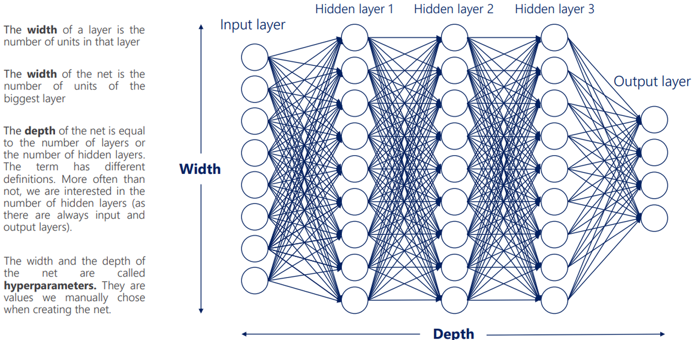

### Sources

corpus/Intro-Redes-Neuronales-105min.pptx.md (diapositiva 44, anexo)

### Speaker notes

Si el grupo no viene con base, esta conviene darla temprano, antes del capítulo 3, aunque esté en el anexo.

### Presenter feedback

---

## 6. El ciclo de ajuste

### Content

Elegimos una configuración, entrenamos, medimos, y volvemos a elegir. El entrenamiento produce los parámetros del modelo; la búsqueda de hiperparámetros produce la mejor configuración.

- **01 · Elegir la configuración.** Fijamos ancho, profundidad y tasa de aprendizaje antes de empezar.
- **02 · Entrenar y medir.** La red ajusta sus pesos, y nosotros evaluamos el error en validación.
- **03 · Volver a probar.** Cambiamos la configuración y repetimos, hasta que el error deja de mejorar.

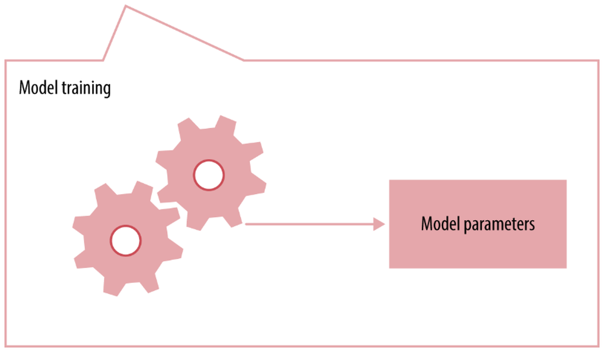

### Sources

corpus/Intro-Redes-Neuronales-105min.pptx.md (diapositiva 45, anexo)

### Speaker notes

Extiende la 3.3, el ciclo externo contra el interno. Es la que hace concreto de dónde salen los hiperparámetros.

### Presenter feedback

---

## 7. Notación: quién se conecta con quién

### Content

El subíndice no es decorativo. El primer número identifica la unidad de entrada; el segundo, la unidad oculta a la que llega. Así, `w₃₆` es el peso que va de la tercera entrada a la sexta unidad oculta.

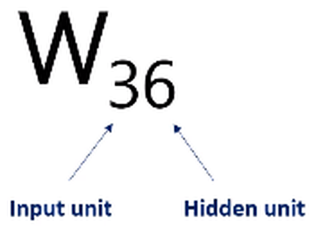

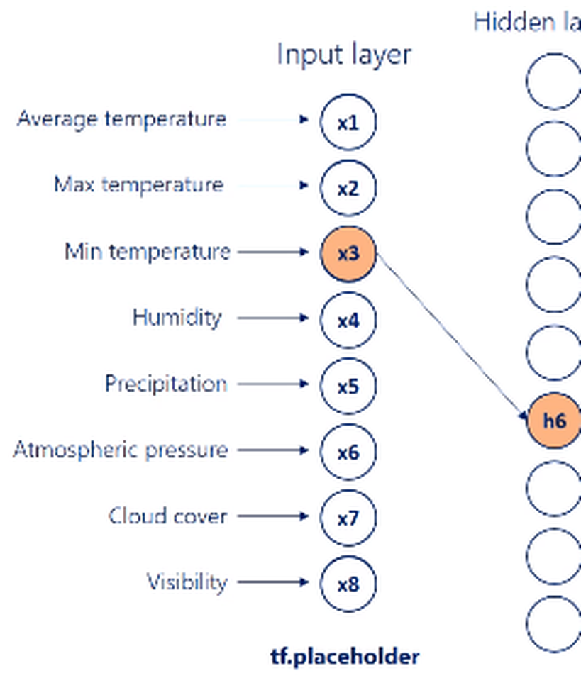

### Sources

corpus/Intro-Redes-Neuronales-105min.pptx.md (diapositiva 46, anexo)

### Speaker notes

Complementa la 4.4. Sacala si alguien se pierde leyendo la matriz de pesos.

### Presenter feedback

---

## 8. La capa oculta, completa

### Content

Cada una de las nueve unidades recibe una combinación de las ocho entradas, con sus propios pesos. Todas se calculan a la vez, no una después de la otra.

- **01 · Todo a la vez.** Las nueve unidades se calculan en paralelo, con una única multiplicación de matrices.
- **02 · Mismo input, distinto peso.** Todas ven las mismas ocho variables; lo que las diferencia es su columna de pesos.

Después del producto matricial viene la activación. Sin ese paso la capa sería lineal y toda la profundidad se desperdiciaría.

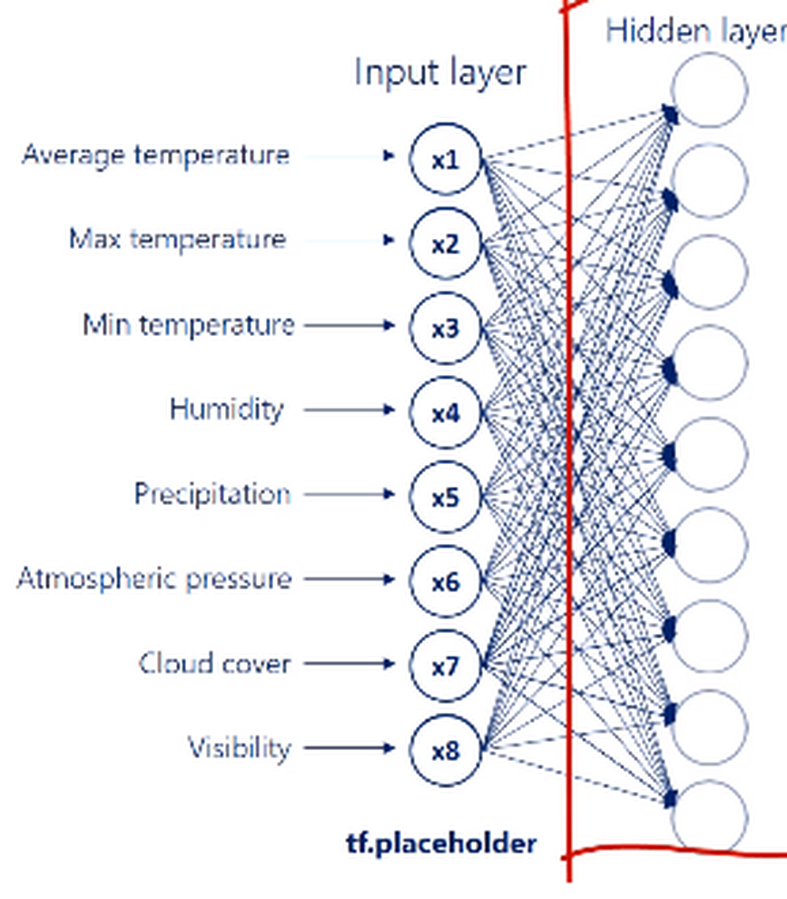

### Sources

corpus/Intro-Redes-Neuronales-105min.pptx.md (diapositiva 47, anexo)

### Speaker notes

Extiende la 4.5. El punto que aporta es "mismo input, distinto peso": lo único que diferencia a dos unidades de la misma capa es su columna.

### Presenter feedback

---

## 9. Hacia la capa de salida

### Content

El mismo mecanismo se repite. Si la última capa oculta tiene 100 unidades y queremos 4 salidas, la matriz que las conecta es de 100×4: cuatrocientos pesos más.

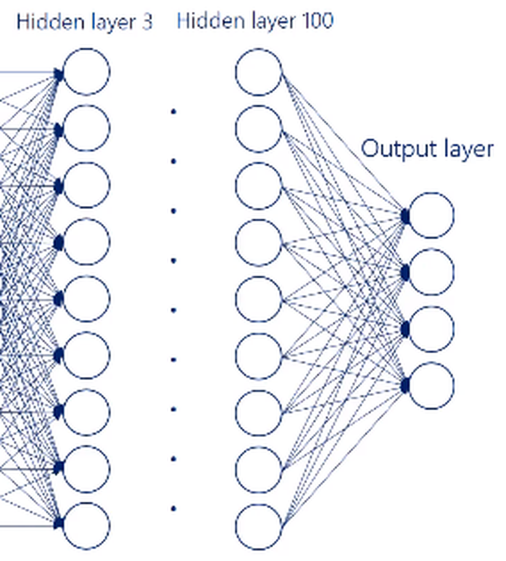

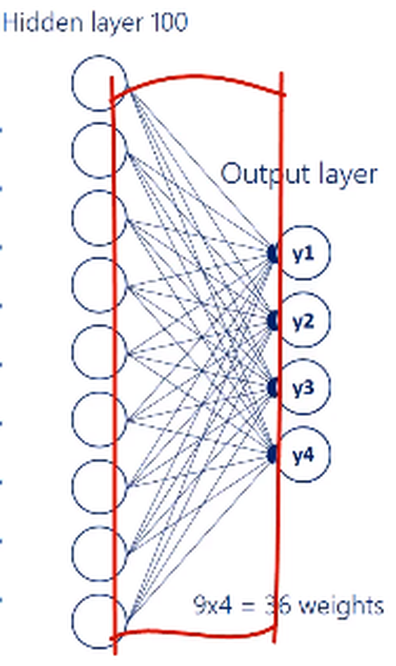

### Sources

corpus/Intro-Redes-Neuronales-105min.pptx.md (diapositiva 48, anexo)

### Speaker notes

Esta es la que explica de dónde salen el 100 y el 4 de la tabla de dimensiones de la 4.6. Si diste esa tabla sin aclararlo, esta diapositiva es la respuesta.

### Presenter feedback

---

## 10. La función de activación, con el termostato

### Content

Pensémosla como el termostato: la temperatura baja de forma continua, pero nuestra decisión, ponerse el abrigo o no, es binaria. La activación es lo que convierte una magnitud continua en una respuesta de otra naturaleza.

- **01 · La entrada es continua.** La suma ponderada da cualquier número real.
- **02 · La activación decide.** Aplasta, corta o normaliza ese número.
- **03 · La salida cambia de naturaleza.** Pasa a ser una probabilidad, una activación o un cero.

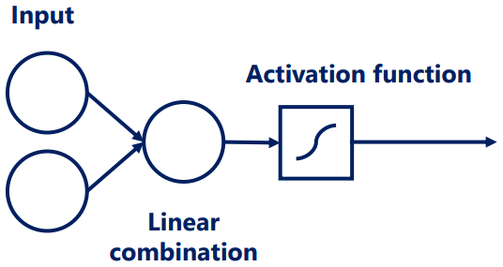

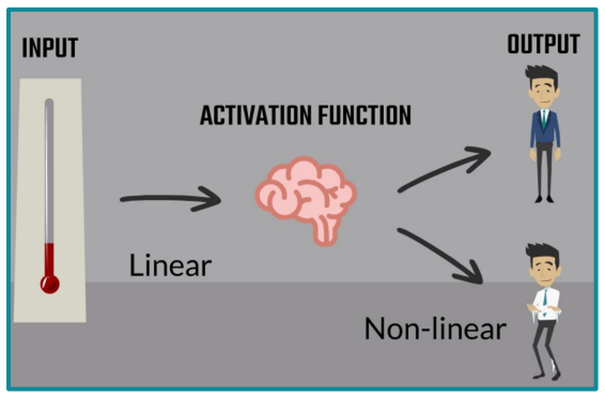

### Sources

corpus/Intro-Redes-Neuronales-105min.pptx.md (diapositiva 49, anexo)

### Speaker notes

La mejor analogía del mazo para explicar qué hace una activación. Si en el capítulo 5 ves caras de duda, esta es la que la destraba.

### Presenter feedback

---

## 11. La sigmoide y su derivada

### Content

Antes de derivar la red completa hace falta una pieza. La derivada de la sigmoide tiene una forma notablemente cómoda: se escribe en términos de la propia sigmoide, así que no hay que recalcular nada.

Por eso la sigmoide fue la activación por defecto durante años: **su derivada sale casi gratis.** Su problema aparece en los extremos, donde se aplana y el gradiente se desvanece.

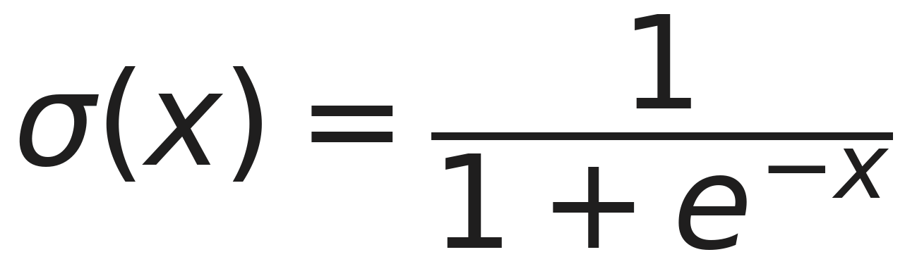

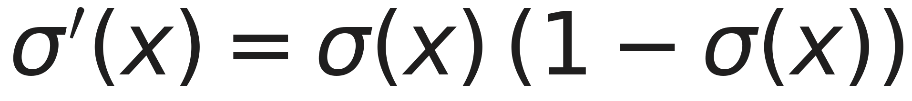

### Sources

corpus/Intro-Redes-Neuronales-105min.pptx.md (diapositiva 50, anexo)

### Speaker notes

Es la que cierra el círculo entre el capítulo 2 y el 5: por qué la sigmoide fue el default y por qué dejó de serlo. El gradiente que se desvanece se entiende solo cuando se ve que la derivada se aplana en los extremos.

### Presenter feedback

---

## 12. Glosario de símbolos

### Content

Toda la notación del capítulo de backpropagation, en un solo lugar.

| Símbolo | Nombre | Qué representa |
|---|---|---|
| `x` | Entrada | El valor que llega a la unidad desde la capa anterior |
| `w` | Peso | El número que se aprende, asociado a cada conexión |
| `a` | Suma ponderada | La combinación lineal `xw + b`, antes de la activación |
| `y` | Salida | El resultado de aplicar la activación a la suma ponderada |
| `t` | Objetivo | El valor verdadero que viene con el dato de entrenamiento |
| `L` | Pérdida | El número único que mide cuánto se equivocó la red |
| `δ` | Delta | La sensibilidad del error respecto de la suma ponderada de esa unidad |
| `η` | Tasa de aprendizaje | El tamaño del paso con el que se corrige cada peso |

### Sources

corpus/Intro-Redes-Neuronales-105min.pptx.md (diapositiva 51, anexo)

### Speaker notes

Vale la pena repartirla impresa o dejarla como material. Si vas a dar el capítulo 6 completo, tener esta tabla proyectada al costado ahorra la mitad de las preguntas.

### Presenter feedback

---

# Conclusions

## 1. Lo que nos llevamos

### Content

Seis ideas que sostienen todo lo que viene después. Si estas quedan firmes, cualquier arquitectura moderna es una variación sobre el mismo tema.

- **01 · Una red es un circuito.** Sensores, compuertas y actuadores. Aprender es ajustar cuánta señal deja pasar cada compuerta.
- **02 · La capa es el bloque.** Combinación lineal más no linealidad, repetido. No hay una pieza más grande que entender.
- **03 · La no linealidad es obligatoria.** Sin ella, apilar capas no agrega nada: la red colapsa en una sola transformación lineal.
- **04 · Los pesos viven en matrices.** Las dimensiones se deducen de la arquitectura, y el cálculo de una capa es un producto matricial.
- **05 · El error se propaga hacia atrás.** La regla de la cadena reparte la culpa entre todos los pesos, capa por capa.
- **06 · El aprendizaje es incremental.** Adivinar, medir, corregir un poco, repetir. Millones de veces.

### Sources

corpus/Intro-Redes-Neuronales-105min.pptx.md (diapositiva 37)

### Speaker notes

Recapitulá siguiendo el orden de la clase: cada idea es un capítulo. Si tenés tiempo, pedí que las digan ellos antes de mostrarlas. La primera y la última son la misma metáfora del auto, abierta y cerrada, y vale la pena señalarlo: empezamos y terminamos en el mismo lugar, ahora con nombres.

### Presenter feedback

---

## 2. Próximos pasos

### Content

Con la red neuronal como base, el curso avanza hacia las arquitecturas que la usan para generar contenido.

- **Redes convolucionales.** El mismo esqueleto, adaptado a imágenes: pesos compartidos y detección de patrones locales.
- **Redes generativas.** GANs y modelos de difusión. Dejamos de clasificar lo que existe para crear lo que no existía.
- **Aplicaciones en biomedicina.** Datos sintéticos, traducción entre modalidades y segmentación de estructuras clínicas.

Las GANs son dos de estas redes compitiendo entre sí, entrenadas con el mismo mecanismo de backpropagation que acabamos de ver.

### Sources

corpus/Intro-Redes-Neuronales-105min.pptx.md (diapositiva 38)

### Speaker notes

El cierre del mazo original apunta a la clase 8 de la materia de biomedicina, y esta diapositiva está copiada tal cual. Si esta clase se da en Ingeniería de Software, la tercera viñeta y la referencia a la clase 8 hay que reemplazarlas por el hilo real del curso. Está anotado en Open questions.

### Presenter feedback

---

# Open questions

- **Dominio.** El mazo original es de "Inteligencia Artificial Generativa Aplicada en Biomedicina" y este repositorio es de Ingeniería de Software. Los ejemplos técnicos (clima, ingreso, temperatura) son neutrales y se trasladan sin tocar nada. Lo que sí es específico de la otra materia es la diapositiva de cierre "Próximos pasos", con la viñeta de aplicaciones en biomedicina y la referencia a la clase 8. Hay que decidir si se adapta o se deja.
- **Orden respecto de `talks/modelado-redes-neuronales`.** Hay solapamiento real: la neurona y la capa, y la tabla de las cuatro activaciones, están en las dos clases. Si esta va antes como fundamentos, conviene recortar de la otra; si va después, recortar de esta. Sin decidir.
- **Duración.** El frontmatter dice 105 min, que es lo que declara el mazo original. El perfil del repositorio tiene 90 como default. Son 28 diapositivas en el recorrido principal más 12 de anexo.
- **Las 41 imágenes están sin transcribir** (Phase 2 del Librarian sin correr). Las referencias del borrador se armaron por diapositiva de origen, que es fiable porque el mapeo es 1 a 1 con el mazo, pero nadie verificó qué muestra cada una. Antes de Polish conviene correr Phase 2 al menos sobre las del recorrido principal.
- **El mazo original no tiene notas del orador en ninguna diapositiva.** Todas las de este borrador están escritas de cero y no vienen de la fuente; conviene leerlas antes del ensayo.
- **El salto de la tabla de dimensiones** (diapositiva 4.6) quedó tal cual está en el original, con el 100×4 sin introducir. La aclaración está en la 7.9 del anexo y la nota del orador de la 4.6 avisa que hay que taparlo en vivo. Si se prefiere, se puede arreglar en la diapositiva.
- **La sigmoide como default.** El original la presenta como la no linealidad clásica en el capítulo 2 y recién en el 5 dice que el estándar es ReLU. Se conservó el orden histórico y las notas del orador de 2.3 y 5.4 avisan. Si se quiere evitar la impresión equivocada, hay que reordenar.

# Cut material

Nada retirado todavía. El borrador es una reconstrucción 1 a 1 del mazo original: las 51 diapositivas del PPTX se mapean a 42 de contenido más portada, agenda, seis separadores de capítulo y el separador del anexo, que Talksmith genera.
