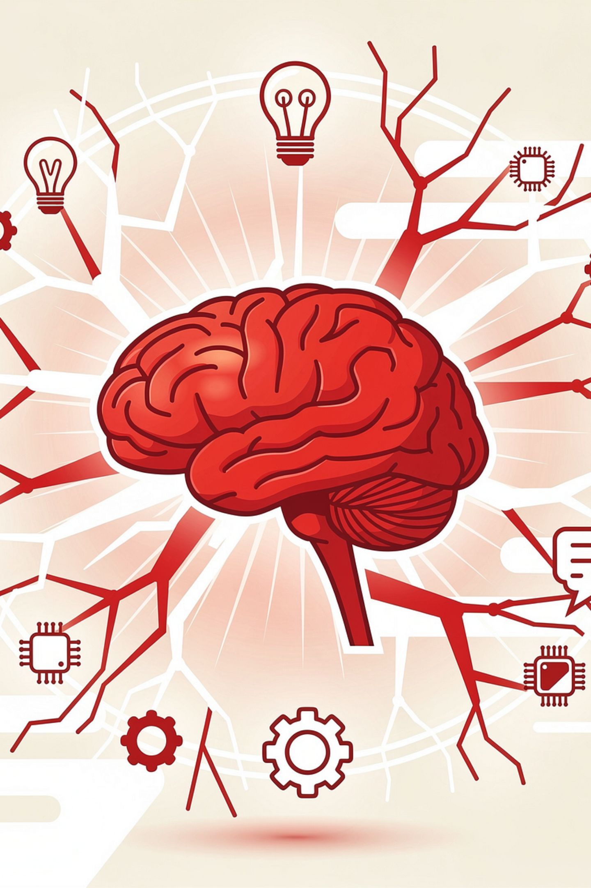
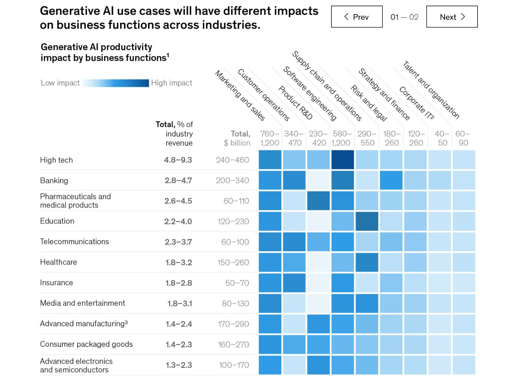
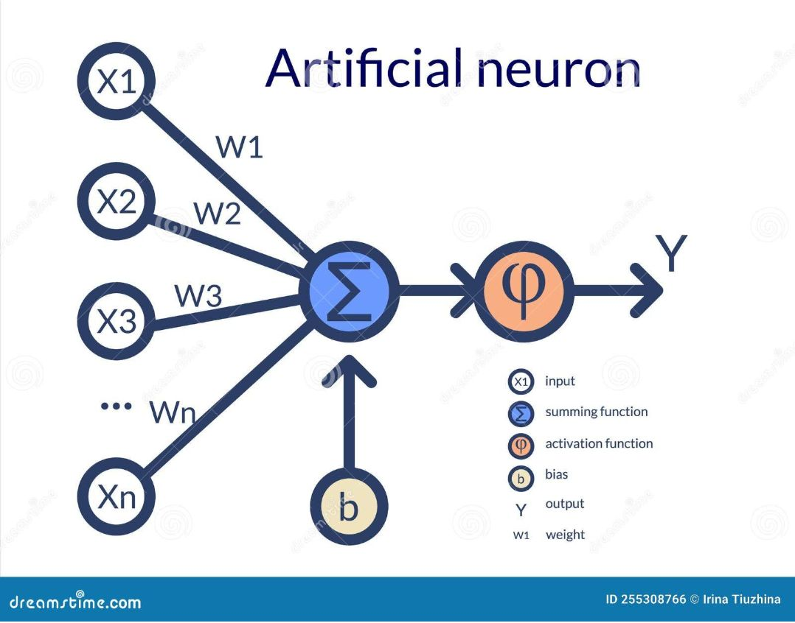
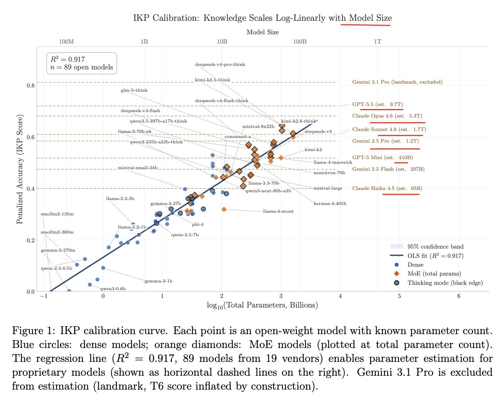

# Thesis

**Claim:** La IA generativa amplía la capacidad de quienes diseñan, construyen y operan software cuando la usan con criterio técnico, validación y responsabilidad.

**Why it matters:** La materia aporta fundamentos para evaluar modelos, construir prototipos y reconocer límites antes de incorporar IA a productos y procesos de ingeniería.

**Presenter feedback:**

---

# Agenda

**Narrative arc:** La clase conserva la secuencia completa del PPTX de referencia: encuadre de la materia, fundamentos de IA, taxonomía de problemas, modelos fundacionales, conclusiones y anexo. Cada diapositiva mantiene su posición; la adaptación reemplaza el dominio de Biomedicina por Ingeniería de Software sin condensar el texto ni las notas.

**Sections (in delivery order):

- 1. Bienvenidos
- 2. ¿Por qué esta materia?
- 3. Logística
- 4. Fundamento de AI
- 5. Taxinomia de Problemas
- 6. Modelos Fundacionales
- 7. Datos
- 8. Ecosistema Actual
- 9. Cierre y anexo

**Presenter feedback:**

---

# 1. Bienvenidos

**Goal of this section:** Presentar la materia y alinear expectativas sobre el enfoque, los docentes y el modo de trabajo.

**Presenter feedback:**

---

## 1. Inteligencia General Generativa

<!-- template: statement -->

### Content

Clase 1: Bienvenida y Logistica

Autor: Paulo Gustavo Veiga, Marco Sorondo
Ultima Modification: Aug, 2026

### Sources

- corpus/Clase-1-AI-for-BIO-Fundamento.pptx.md (diapositiva 1; adaptación íntegra)

### Speaker notes

Referencia PPTX: diapositiva 1.

Discurso Sugerido: "Bienvenidos. Hoy vamos a desmitificar la Inteligencia Artificial. Intuitivamente, solemos pensar en la IA como 'máquinas haciendo cosas que requerirían inteligencia si las hiciera un humano'. Pero si queremos ser rigurosos, como proponen Russell y Norvig, la IA es el diseño de agentes racionales: sistemas que perciben su entorno y toman acciones para maximizar sus posibilidades de éxito en un objetivo dado. No se trata de crear humanos sintéticos, sino de resolver problemas complejos con matemáticas a gran escala."

Contexto Técnico Profundo: La definición de agente racional evita el debate filosófico sobre la "conciencia" y se centra en la función matemática que mapea secuencias de percepciones a acciones (arquitectura de agentes).

Enlace Recomendado: Sitio oficial del libro "Artificial Intelligence: A Modern Approach" (Russell & Norvig)

### Presenter feedback

---

## 2. Bienvenidos!

<!-- template: content-image -->
<!-- design: column-right -->

### Content

¿Por qué eligieron esta materia?

¿Qué esperan llevarse de la cursada?


### Sources

- corpus/Clase-1-AI-for-BIO-Fundamento.pptx.md (diapositiva 2; adaptación íntegra)

### Speaker notes

Referencia PPTX: diapositiva 2.

Primera vez que dictamos esta materia (contar brevemente la historia de la materia).

### Presenter feedback
- [closed] 2026-08-05 — "El contenido deberian ser 2 preguntas: Por que eligieron esta materia?. Que es lo que esperan llevase ?"
  Resolution: El contenido pasó a las dos preguntas de apertura. Se retiró la línea que repetía el título del curso.

---

## 3. Que es Inteligencia Artificial Generativa ?

<!-- template: content-image -->
<!-- design: column-right -->

### Content

Bienvenidos! Este curso explorará los fundamentos, aplicaciones y desafíos de la Inteligencia Artificial Generativa, un campo revolucionario que está transformando nuestra interacción con la tecnología.​
A lo largo de este cuatrimestre, analizaremos los conceptos básicos de la GenAI, los modelos de lenguaje generativos, la visión artificial, y los aspectos éticos relacionados con esta tecnología emergente.​



### Sources

- corpus/Clase-1-AI-for-BIO-Fundamento.pptx.md (diapositiva 3; adaptación íntegra)

### Speaker notes

Referencia PPTX: diapositiva 3.

[Sin notas en el PPTX de referencia.]

### Presenter feedback

---

## Qué esperamos que se lleven

<!-- template: concept-breakdown -->

### Content

Una materia para entender cómo funcionan los modelos y aprender a construir con ellos con criterio de Ingeniería de Software.

Meternos en los modelos

Van a poder explicar qué hacen los transformers, cómo intervienen los datos, el entrenamiento, la inferencia y la evaluación; no sólo usar una interfaz de chat.

Práctica hands-on

Las clases combinan teoría y práctica: notebooks, repositorios, prompts, herramientas y casos concretos para experimentar, implementar, probar y documentar.

Criterio de ingeniería

El objetivo es usar IA generativa sin delegar el juicio técnico: evaluar salidas, reconocer límites y diseñar flujos con trazabilidad, seguridad y control humano.

### Sources

- corpus/Clase-1-AI-for-BIO-Fundamento.pptx.md (diapositiva 11; adaptación y reubicación)

### Speaker notes

Este slide anticipa el tipo de materia: no se trata sólo de aprender a usar una herramienta. Vamos a entrar en cómo se construyen y evalúan los modelos, y en cada clase llevar los conceptos a una práctica concreta de ingeniería.

### Presenter feedback

---

## 4. Antes que nada…

<!-- template: figures -->

### Content


Paulo Veiga

Email: pveiga@austral.edu.ar


Marco Sanchez Sorondo

Email: msanchezSorondo@austral.edu.ar


Claudio Righetti

Docente

### Sources

- corpus/Clase-1-AI-for-BIO-Fundamento.pptx.md (diapositiva 4; adaptación íntegra)

### Speaker notes

Referencia PPTX: diapositiva 4.

[Sin notas en el PPTX de referencia.]

### Presenter feedback
- [closed] 2026-08-05 — "Hacer un resize de las imagees original para que todas tengan el misma altura, no cambiar el aspect ratio. De esta manera simetrico cuando lo incluimos."
  Resolution: Las tres fotos de docentes se redimensionaron a 500 px de alto conservando el aspect ratio original.

---

## 5. Ahora cuéntennos ustedes

<!-- template: process -->

### Content

Cuatro preguntas para responder en vivo desde el celular.

¿Por qué eligieron esta materia?

¿Qué esperan llevarse de la cursada?

¿Cuánto usan hoy herramientas de IA generativa para estudiar o programar?

¿Qué es lo que más les preocupa de la IA en su futuro profesional?

Entrar en https://app.sli.do/event/s7Ccr6C4awbUzRW1RpH19c

### Sources

- corpus/slido-preguntas-en-vivo.web.md (evento de Slido para la Clase 1)

### Speaker notes

Momento sugerido: al cierre de la bienvenida, después de presentar a los docentes y antes de entrar en por qué esta materia. Da un corte de ritmo y pone a la clase a hablar antes de la primera diapositiva de contenido.

Cómo correrlo: proyectar la diapositiva, dar dos o tres minutos para que respondan desde el celular y después mostrar los resultados en pantalla desde el panel de Slido. Conviene abrir el evento antes de que arranque la clase.

Las respuestas a la tercera pregunta sirven de calibración para el resto del cuatrimestre: si la mayoría ya usa asistentes a diario, los módulos de ingeniería de prompts pueden ir más rápido y conviene invertir el tiempo ganado en evaluación y límites.

Las respuestas a la cuarta se pueden retomar en la diapositiva de limitaciones y en la del riesgo macroeconómico. Anotar dos o tres preocupaciones concretas y nombrarlas cuando lleguen esos temas.

Las preguntas de la diapositiva tienen que coincidir con las que estén cargadas en el evento de Slido.

### Presenter feedback

- [closed] 2026-08-05 — "Agregar un slide con 4 que va ser conjunto de preguntas en vivo: https://app.sli.do/event/s7Ccr6C4awbUzRW1RpH19c"
  Resolution: Se agregó la diapositiva 5 al cierre de la sección Bienvenidos, con las cuatro preguntas como lista numerada y el enlace al evento. Las dos primeras reproducen las que ya abren la diapositiva 2; las otras dos son propuesta editorial y hay que confirmarlas contra lo que esté cargado en Slido.

---

# 2. ¿Por qué esta materia?

**Goal of this section:** Explicar por qué la IA generativa importa para la formación y la práctica de Ingeniería de Software.

**Presenter feedback:**

---

## 5. ¿Por qué esto es relevante para tu carrera?

<!-- template: concept-breakdown -->

### Content

La IA generativa cambia la forma de analizar requisitos, escribir código, crear pruebas, mantener documentación y operar sistemas.

El mercado ya la incorpora

Las organizaciones suman asistentes de IA a sus flujos de desarrollo. Quienes entiendan sus límites y sepan evaluarlos pueden aportar criterio técnico desde el primer día.

Ingeniería de Software es un área de alto impacto

Copilotos de código, revisión de cambios, generación de pruebas, búsqueda sobre repositorios y soporte a incidentes ya afectan tareas reales de los equipos.

Diferenciación profesional

Un ingeniero que entiende IA puede liderar proyectos, definir controles de calidad y conversar con producto, seguridad, datos y negocio.

Impacto en todas las ciencias

Hoy desarrolla cualquiera. Un ingeniero químico arma su script de simulación y un contador automatiza un cierre contable, con ChatGPT, Claude, Gemini o Copilot. El ingeniero de software sabe exigir evidencia, pruebas y responsabilidad antes de que ese código llegue a producción.

### Sources

- corpus/Clase-1-AI-for-BIO-Fundamento.pptx.md (diapositiva 5; adaptación íntegra)

### Speaker notes

Referencia PPTX: diapositiva 5.

[Sin notas en el PPTX de referencia.]

### Presenter feedback
- [closed] 2026-08-05 — "Cambiemos -> El futuro ya está disponible por "Impacto en todas las ciencias". Hoy todos "desarrollan", desde in ing. quimico a un contactor. (mejorar el framing)"
  Resolution: El concepto pasó a Impacto en todas las ciencias, con el ejemplo del ingeniero químico y el contador, y un cierre sobre qué aporta el ingeniero de software.
 

---

## 6. El impacto de GenAI en la economía

<!-- template: concept-breakdown -->

### Content

Impulso histórico a la productividad

Automatización de tareas cognitivas y repetitivas, actuando como un "copiloto" para los trabajadores.

Creación de valor masivo

Se estima que la GenAI podría añadir entre 2,6 y 4,4 billones de dólares anuales a la economía global (equivalente al PIB de un país como Reino Unido).

Transformación de funciones corporativas

Impacto directo en operaciones, marketing, ventas, atención al cliente y desarrollo de software.

Nuevas industrias

Aparición de modelos de negocio inéditos y roles especializados (ej. ingeniería de prompts, auditoría algorítmica).

Fuente: McKinsey & Company, "The economic potential of generative AI: the next productivity frontier" (https://www.mckinsey.com/capabilities/mckinsey-digital/our-insights/the-economic-potential-of-generative-ai-the-next-productivity-frontier)

### Sources

- corpus/Clase-1-AI-for-BIO-Fundamento.pptx.md (diapositiva 6; adaptación íntegra)

### Speaker notes

Referencia PPTX: diapositiva 6.

[Sin notas en el PPTX de referencia.]

### Presenter feedback
- [closed] 2026-08-05 — "En la fuenta se perdio el link a source. Buscalo y agregalo."
  Resolution: Se repuso el enlace de McKinsey tomado de los hipervínculos del PPTX de referencia.

---

## 7. Impacto por industria y funciones

<!-- template: image-full -->

### Content



### Sources

- corpus/Clase-1-AI-for-BIO-Fundamento.pptx.md (diapositiva 7; adaptación íntegra)

### Speaker notes

Referencia PPTX: diapositiva 7.

[Sin notas en el PPTX de referencia.]

### Presenter feedback

---

## 8. Transformación en Ingeniería de Software

<!-- template: concept-breakdown -->

### Content

Aceleración del desarrollo de software

Los modelos pueden asistir en lectura de repositorios, generación de código, explicación de errores y creación de pruebas. El equipo conserva la responsabilidad de revisar, integrar y desplegar.

Productos más adaptables

La IA permite explorar interfaces, personalizar flujos y analizar grandes volúmenes de feedback, tickets y telemetría. La personalización exige datos autorizados y criterios explícitos.

Mejora de calidad y seguridad

Los equipos pueden usar IA para detectar patrones de fallas, proponer casos de prueba, resumir incidentes y encontrar documentación relevante. Ninguna sugerencia reemplaza una validación técnica.

Eficiencia operativa

La automatización de runbooks, soporte y documentación puede devolver tiempo para resolver problemas de mayor valor. Los procesos necesitan registros, permisos y mecanismos de reversión.

Redefinición de roles y responsabilidades

El equipo se reorganiza alrededor de la revisión. Quien integra código generado responde por él, y la revisión de pares concentra el control sobre la salida del modelo. Aparecen responsabilidades nuevas sobre datos, permisos y trazabilidad.

### Sources

- corpus/Clase-1-AI-for-BIO-Fundamento.pptx.md (diapositiva 8; adaptación íntegra)

### Speaker notes

Referencia PPTX: diapositiva 8.

Discurso sugerido:

“La IA generativa puede acelerar partes del trabajo de ingeniería, pero no convierte un problema ambiguo en una solución correcta por sí sola. Puede leer un repositorio, proponer una migración, escribir pruebas o resumir un incidente. El equipo sigue teniendo que definir el objetivo, revisar el cambio y hacerse cargo de las consecuencias.”

Contexto técnico: los asistentes de código trabajan sobre representaciones incompletas del sistema. Pueden desconocer dependencias privadas, decisiones de arquitectura, reglas de negocio, restricciones de seguridad o el estado actual de producción. Un equipo confiable combina la velocidad de propuesta del modelo con pruebas automatizadas, revisión de pares, despliegues graduales y observabilidad.

Caso 1. Desarrollo y mantenimiento

Un modelo puede explicar una función compleja, proponer un refactor y generar pruebas para los casos que el desarrollador enumera. El equipo debe ejecutar esas pruebas, revisar cambios de comportamiento y comprobar que el resultado respeta las convenciones del repositorio.

Caso 2. Conocimiento técnico

Un sistema de búsqueda semántica puede recuperar decisiones de arquitectura, tickets y documentación. El resultado debe mostrar de dónde obtuvo cada respuesta para que quien consulta pueda verificar si esa información sigue vigente.

Caso 3. Calidad y seguridad

Un asistente puede proponer reglas de análisis estático, casos de prueba y correcciones para vulnerabilidades conocidas. Las recomendaciones no reemplazan una revisión de seguridad ni dan permiso para ejecutar código sin aislamiento.

Caso 4. Operación

Un agente puede resumir alertas, sugerir hipótesis y ejecutar acciones acotadas de un runbook. El diseño debe limitar permisos, registrar cada acción y permitir detener o revertir una automatización.

Pregunta para la clase: “¿Qué evidencia pedirían antes de aceptar una modificación de código generada por un modelo?”

Punto clave: la IA amplifica las habilidades de un equipo cuando el proceso conserva responsabilidad, trazabilidad y controles humanos.

### Presenter feedback

- [closed] 2026-08-03 — "Borra Fuente de referencia: el PPTX original usa ejemplos de impacto sectorial; esta versión los traslada a Ingeniería de Software."
  Resolution: Se eliminó la referencia editorial del contenido visible de la diapositiva 8.
- [closed] 2026-08-05 — "Agregar una bullets que redifinio los roles y responsabilidad de los equipos de desarollo."
  Resolution: Se agregó el concepto Redefinición de roles y responsabilidades, sobre la reorganización del equipo alrededor de la revisión.

---

## 9. Limitaciones de la IA Generativa

<!-- template: concept-breakdown -->

### Content

Alucinaciones y respuestas falsas

Los modelos pueden generar código, APIs, librerías o explicaciones incorrectas con tono convincente. Una salida debe pasar por pruebas, revisión y contraste con documentación oficial.

Sesgos en los datos

Los datos de entrenamiento y los repositorios históricos contienen decisiones, desigualdades y prácticas inseguras. Un modelo puede reproducirlas sin advertirlo.

Privacidad y protección de datos

Prompts, adjuntos y contexto pueden incluir código propietario, secretos, datos personales o información de clientes. El equipo debe conocer dónde se procesa y retiene cada dato.

Sesgo de automatización

Un resultado sugerido por una herramienta puede recibir confianza excesiva. La revisión humana necesita criterios y tiempo asignado, no solo una aprobación nominal.

Acceso desigual

El costo de modelos, cómputo y conectividad condiciona quién puede experimentar, construir y desplegar soluciones.

Impacto ambiental

Entrenar y operar modelos a gran escala requiere energía, agua e infraestructura. El costo ambiental forma parte de la decisión de arquitectura.

Degradación de habilidades técnicas

Un uso sin comprensión puede erosionar la capacidad de depurar, diseñar y operar sistemas cuando la herramienta falla o entrega una respuesta errónea.

### Sources

- corpus/Clase-1-AI-for-BIO-Fundamento.pptx.md (diapositiva 9; adaptación íntegra)

### Speaker notes

Referencia PPTX: diapositiva 9.

Cómo presentar este slide

Apertura: “Vimos qué puede aportar la IA generativa a un equipo de software. Ahora revisemos los problemas que aparecen cuando una salida se acepta sin evidencia, cuando los datos no tienen controles o cuando un sistema obtiene permisos que no debería tener.”

1. Alucinaciones y respuestas falsas

Explicación: los modelos generan secuencias plausibles a partir de patrones. Pueden inventar una API, recomendar un paquete inexistente, omitir una condición de seguridad o explicar de forma convincente un comportamiento equivocado.

Ejemplo: un desarrollador pide una integración con una librería y el modelo produce funciones que no existen en esa versión. El código puede compilar si se agregan sustitutos improvisados, pero falla en producción o deja un comportamiento inseguro. Una revisión debe contrastar la propuesta con documentación oficial, pruebas y el contexto del repositorio.

Pregunta para la clase: “¿Aceptarían un cambio que el modelo no puede justificar con una fuente y una prueba reproducible?”

2. Sesgos en los datos

Explicación: los modelos aprenden de datos históricos. Repositorios públicos y documentación contienen decisiones de diseño, dependencias desactualizadas, prácticas inseguras y sesgos sobre quién usa un producto.

Ejemplo: un sistema entrenado con tickets históricos puede asignar menor prioridad a problemas que afectan a un grupo poco representado. Un asistente de código puede sugerir patrones antiguos porque aparecen con frecuencia en sus datos, aunque el proyecto ya los haya reemplazado.

Punto clave: los equipos necesitan revisar qué datos entran a un sistema, qué casos faltan y cómo miden errores por segmento o contexto.

3. Privacidad y protección de datos

Explicación: un prompt puede incluir código propietario, claves, información de clientes, registros de incidentes o decisiones internas. El proveedor puede almacenar, procesar o usar ese contexto según el contrato y la configuración elegida.

Ejemplo: si alguien copia una traza con un token de acceso o una base de datos de prueba con datos personales, el equipo puede exponer información sensible fuera de su perímetro. Las políticas deben definir qué puede enviarse, qué se debe anonimizar y qué modelos se autorizan para cada clase de dato.

Punto clave: un chat no reemplaza un canal seguro ni una revisión de cumplimiento.

4. Sesgo de automatización

Explicación: una respuesta bien escrita puede recibir más confianza que una respuesta verificada. El riesgo aumenta cuando una herramienta aparece dentro del editor, el pipeline o el panel de operaciones.

Ejemplo: un asistente propone silenciar una alerta porque la clasifica como ruido. Si el operador acepta sin revisar señales relacionadas, puede ocultar un incidente real. La interfaz debe mostrar evidencia, incertidumbre y mecanismos para inspeccionar la decisión.

5. Acceso desigual

Explicación: los modelos de mayor capacidad requieren suscripciones, infraestructura y datos que no todos los equipos pueden pagar. La calidad también varía por idioma, contexto cultural y disponibilidad de datos locales.

Ejemplo: una empresa grande puede integrar modelos privados con sus repositorios y telemetría. Un equipo pequeño puede depender de una herramienta pública con límites de uso y menor control sobre privacidad. La diferencia modifica quién puede experimentar y quién puede construir productos competitivos.

6. Impacto ambiental

Explicación: entrenar y servir modelos consume energía, agua e infraestructura. Una arquitectura que invoca un modelo en cada interacción puede elevar costo y consumo sin mejorar la experiencia.

Ejemplo: antes de agregar una llamada a un modelo, el equipo puede comparar alternativas: una regla determinista, una búsqueda, un modelo pequeño, un caché o una revisión asíncrona. La decisión debe considerar precisión, latencia, costo y consumo.

7. Degradación de habilidades técnicas

Explicación: un uso continuo de asistentes sin comprensión puede reducir la práctica de depurar, modelar datos, leer documentación y diseñar pruebas. El problema aparece con fuerza cuando una herramienta falla, cambia de proveedor o produce una salida incorrecta.

Ejemplo: si un equipo acepta parches generados durante meses sin revisar arquitectura ni pruebas, pierde contexto sobre el sistema. Durante un incidente grave, ese equipo tarda más en decidir qué hipótesis descartar y qué acción es segura.

Punto clave: la IA debe ampliar la capacidad de ingeniería, no sustituir el aprendizaje ni la responsabilidad técnica.

Cierre para debate:

“¿Qué controles deberían exigir una universidad, una empresa y un equipo de producto antes de permitir que un agente modifique datos, despliegue código o responda a usuarios?”

### Presenter feedback

- [closed] 2026-08-04 — "Borrar Fuente de referencia: el PPTX original organiza estos riesgos a partir de la guía de la OMS; esta adaptación los aplica al trabajo de software."
  Resolution: Se eliminó la referencia editorial del contenido visible de la diapositiva.
- [closed] 2026-08-05 — "Cambiemos Problemas actuales de la IA en software -> Limitacion AI Generativa."
  Resolution: El título pasó a Limitaciones de la IA Generativa.

---

## 10. El riesgo macroeconómico y el colapso del consumo

<!-- template: concept-breakdown -->

### Content

La crisis global de inteligencia 2028

Un escenario hipotético sobre los peligros de una transición demasiado abrupta hacia la IA.

El “PIB fantasma”

Récord de productividad y ganancias corporativas impulsadas por IA que no circulan en la economía real, porque las máquinas no consumen.

Desplazamiento del “cuello blanco”

En el escenario, la IA reemplaza a los trabajadores del conocimiento, que representan el 50% del empleo y el 75% del gasto discrecional.

La espiral deflacionaria

Las empresas despiden, cae el poder adquisitivo y el consumo colapsa. Para bajar costos las empresas invierten más en IA, y el ciclo se refuerza.

Fuente: Citrini Research, "The 2028 Global Intelligence Crisis" (https://www.citriniresearch.com/p/2028gic)

### Sources

- corpus/Clase-1-AI-for-BIO-Fundamento.pptx.md (diapositiva 10; adaptación íntegra)

### Speaker notes

Referencia PPTX: diapositiva 10.

. Technology improved slowly enough that humans could adapt. Intelligence, the ability to analyze, decide, create, persuade, and coordinate, was the thing that could not be replicated at scale.

Human intelligence derived its inherent premium from its scarcity. Every institution in our economy, from the labor market to the mortgage market to the tax code, was designed for a world in which that assumption held.

We are now experiencing the unwind of that premium. Machine intelligence is now a competent and rapidly improving substitute for human intelligence across a growing range of tasks

Entrada sugerida (del PPTX de referencia): "¿Cómo va? Vos que ya viste varias corridas y pánico en el mundo:"

Pregunta para debate: ¿qué decisiones de diseño, formación y regulación reducen estos riesgos sin bloquear la innovación?

### Presenter feedback

- [closed] 2026-08-05 — "Corregir la cifra del cuello blanco contra la fuente."
  Resolution: La cifra pasó de 70% a 75%, que es la que trae la fuente, y la línea ahora abre con 'En el escenario' para que se lea como parte del escenario hipotético y no como dato observado.

- [closed] 2026-08-04 — "Borrar el PPTX original presenta en todos lados."
  Resolution: Se eliminó la referencia editorial restante que mencionaba el PPTX de origen en el contenido visible de la diapositiva.
- [closed] 2026-08-05 — "El riesgo macroeconómico y la transición abrupta. Busca el link en el pptx. Revisa que el contenido de este slide no se cambio."
  Resolution: El PPTX no tiene hipervínculo en esa diapositiva, pero sí la línea de fuente: se repuso Citrini Research con el enlace al artículo. La comparación con el original mostró que el contenido sí se había cambiado, así que se restauraron el título, el PIB fantasma, el 50%/70% del cuello blanco y la cadena de la espiral deflacionaria. La pregunta de debate se movió a las notas del orador.
---

# 3. Logística

**Goal of this section:** Acordar cómo se cursa, cómo se entrega el trabajo y cómo se compone la evaluación.

**Presenter feedback:**

---

## 13. Cómo vamos a trabajar

<!-- template: process -->

### Content

Son 14 clases, los miércoles, y cada una mezcla concepto, ejemplo y práctica.

Primero discutimos la idea y después la llevamos a notebooks, repositorios y casos concretos.

El trabajo es en equipo, con registro de las pruebas y de las decisiones.

Cada dos clases hay un entregable práctico.

Esperamos presencia y participación activa.

### Sources

- corpus/Clase-1-AI-for-BIO-Fundamento.pptx.md (diapositiva 13; adaptación íntegra)

### Speaker notes

Referencia PPTX: diapositiva 13.

[Sin notas en el PPTX de referencia.]

### Presenter feedback

- [closed] 2026-08-04 — "Hay varios cards que tiene un numero. Ej: 46. Se seria mejor usar el que numera como estilo."
  Resolution: La diapositiva pasó a la plantilla de secuencia numerada; el número lo dibuja el estilo y ya no vive dentro del texto de cada card.

- [closed] 2026-08-05 — "Existe un estilo que son bullets, numerados. Buscar este estilo."
  Resolution: La diapositiva pasó a la lista numerada plana. Las cuatro tarjetas con etiqueta se abrieron en siete líneas cortas y el ordinal lo dibuja el estilo.
- [closed] 2026-08-05 — "Borra "La nota final combina los entregables con el proyecto final.""
  Resolution: Línea retirada de la diapositiva 13 y archivada en Cut material. El desglose de la nota vive en la diapositiva Evaluación (40% / 60%).
- [closed] 2026-08-05 — "Borra "Las reglas y la ponderación se publican antes de la primera entrega.""
  Resolution: Línea retirada de la diapositiva 13 y archivada en Cut material. Duplicaba lo que ya cubre la diapositiva Evaluación.
---

## 14. Entregables de clase

<!-- template: process -->

### Content

Forman parte de la evaluación junto con el trabajo final.

Ritmo

Un entregable cada dos clases, relacionado con los temas vistos.

Equipo

Se trabaja en equipos de 4 personas: 2 de Ingeniería en Sistemas y dos de Ciencia de Datos.

Trabajo durante la clase

La mayor parte del trabajo se completa durante la clase.

Evidencia

Cada equipo debe dejar trazabilidad de decisiones, prompts, código, pruebas y fuentes usadas.

Entrega obligatoria

Se entrega por el canal que indique la cátedra, con repositorio o artefactos reproducibles cuando corresponda.

### Sources

- corpus/Clase-1-AI-for-BIO-Fundamento.pptx.md (diapositiva 14; adaptación íntegra)

### Speaker notes

Referencia PPTX: diapositiva 14.

[Sin notas en el PPTX de referencia.]

### Presenter feedback

- [closed] 2026-08-04 — "Hay varios cards que tiene un numero. Ej: 46."
  Resolution: Plantilla de secuencia numerada; ordinales retirados de las etiquetas.
- [closed] 2026-08-04 — "Los grupos tiene que ser 2 personas de sistemas + 2 datos."
  Resolution: La composición del equipo ahora dice cuatro personas, dos de Ingeniería en Sistemas y dos de Ciencia de Datos. Misma redacción que la diapositiva 15.

---

## 15. Trabajo final

<!-- template: process -->

### Content

Un proyecto propio que aplique conceptos de la materia a un problema de Ingeniería de Software.

Se trabaja en equipos de cuatro personas, dos de Ingeniería en Sistemas y dos de Ciencia de Datos.

El equipo debe ser el mismo que realizó los trabajos prácticos.

La consigna completa se presenta a mitad de cuatrimestre.

Se entrega un video breve de demostración que explique el problema, la solución y sus límites.

Se entrega el código desplegado o ejecutable, con instrucciones de reproducción.

Se entrega la documentación del diseño, los datos, la estrategia de evaluación, los riesgos y las decisiones de seguridad.

### Sources

- corpus/Clase-1-AI-for-BIO-Fundamento.pptx.md (diapositiva 15; adaptación íntegra)

### Speaker notes

Referencia PPTX: diapositiva 15.

[Sin notas en el PPTX de referencia.]

### Presenter feedback

- [closed] 2026-08-04 — "En el Trabajo práctico final, agreguemos que lo vamos a mencionar a mitad de cuatrimestre. Confirmar si no estaba ya ahí."
  Resolution: No estaba en el draft (cero apariciones de "mitad de cuatrimestre"). Se agregó "La consigna completa se presenta a mitad de cuatrimestre." dentro del bloque "Equipo y alcance", en lugar de abrir un cuarto bloque, para que la grilla siga en tres columnas.
- [closed] 2026-08-04 — "Los grupos tiene que ser 2 personas de sistemas + 2 datos."
  Resolution: La composición del equipo ahora dice cuatro personas, dos de Ingeniería en Sistemas y dos de Ciencia de Datos. Misma redacción que la diapositiva 14.
- [closed] 2026-08-05 — "Existe un estilo que son bullets, numerados. Buscar este estilo."
  Resolution: La diapositiva pasó a la lista numerada de una sola columna. Los tres bloques de tarjetas se abrieron en ocho pasos planos, sin perder ninguna línea.
- [closed] 2026-08-05 — "Borra "La cátedra orienta el alcance, la evidencia y la forma de evaluar el resultado.""
  Resolution: Línea retirada de la diapositiva 15 y archivada en Cut material.
- [closed] 2026-08-05 — "Borra "La evaluación considera el resultado y la capacidad de justificarlo con evidencia técnica.""
  Resolution: Línea retirada de la diapositiva 15 y archivada en Cut material.

---

## Evaluación

<!-- template: stat -->

### Content

Cómo se compone la nota final

40%

Entregables de clase

60%

Trabajo final

**Importante:** Las entregas fuera de término impactan en la nota final.

### Sources

- Criterio de evaluación de la cátedra (2026)

### Speaker notes

La evaluación combina el trabajo sostenido durante la cursada con la capacidad de integrar lo aprendido en un proyecto final.

### Presenter feedback
- [closed] 2026-08-05 — "Ponelo al final del slide "**Importante:** Las entregas fuera de término impactan en la nota final.". No quiero que aparezca primero"
  Resolution: La línea Importante pasa a la banda inferior de la diapositiva. En el modelo de render su posición cambia de top a bottom, así se lee después de los dos porcentajes.

---

## 16. Contenidos de la Materia

<!-- template: process -->

### Content

Módulo 1: Fundamentos de IA, arquitectura de LLM y entrenamiento

Clases 1–4

Módulo 2: Ingeniería de prompts, RAG y desarrollo asistido por IA

Clases 5–8

Módulo 3: Generación multimodal, visión e interfaces

Clases 9–12

Módulo 4: Agentes, evaluación, ética, seguridad y regulación

Clases 12–14

### Sources

- corpus/Clase-1-AI-for-BIO-Fundamento.pptx.md (diapositiva 16; adaptación íntegra)

### Speaker notes

Referencia PPTX: diapositiva 16.

[Sin notas en el PPTX de referencia.]

### Presenter feedback

- [closed] 2026-08-04 — "Hay varios cards que tiene un numero. Ej: 46."
  Resolution: Plantilla de secuencia numerada; ordinales retirados de las etiquetas.

---

## 17. Preguntas

<!-- template: closing-hero -->

### Content

Abrimos la conversación.

### Sources

- corpus/Clase-1-AI-for-BIO-Fundamento.pptx.md (diapositiva 17; adaptación íntegra)

### Speaker notes

Referencia PPTX: diapositiva 17.

[Sin notas en el PPTX de referencia.]

### Presenter feedback

---

# 4. Fundamento de AI

**Goal of this section:** Construir un lenguaje compartido sobre IA, redes neuronales e historia del campo.

**Presenter feedback:**

---

## 1. Inteligencia General Generativa

<!-- template: statement -->

### Content

Clase 1: Fundamentos, Modelos y el Ecosistema Actual

### Sources

- corpus/Clase-1-AI-for-BIO-Fundamento.pptx.md (diapositiva 18; adaptación íntegra)

### Speaker notes

Referencia PPTX: diapositiva 18.

Discurso Sugerido: "Bienvenidos. Hoy vamos a desmitificar la Inteligencia Artificial. Intuitivamente, solemos pensar en la IA como 'máquinas haciendo cosas que requerirían inteligencia si las hiciera un humano'. Pero si queremos ser rigurosos, como proponen Russell y Norvig, la IA es el diseño de agentes racionales: sistemas que perciben su entorno y toman acciones para maximizar sus posibilidades de éxito en un objetivo dado. No se trata de crear humanos sintéticos, sino de resolver problemas complejos con matemáticas a gran escala."

Contexto Técnico Profundo: La definición de agente racional evita el debate filosófico sobre la "conciencia" y se centra en la función matemática que mapea secuencias de percepciones a acciones (arquitectura de agentes).

Enlace Recomendado: Sitio oficial del libro "Artificial Intelligence: A Modern Approach" (Russell & Norvig)

### Presenter feedback

- [closed] 2026-08-03 — "La diapositiva 'Inteligencia Artificial Generativa  (AI Gen)— Clase 1: Fundamentos, modelos y ecosistema actual' necesita un estilo mucho mejor, quote o similar."
  Resolution: Se cambió la diapositiva de divider a statement para separar el título principal del subtítulo de clase, sin tratarlo como una cita.

---

## 2. ¿Qué es la Inteligencia Artificial?

<!-- template: concept-columns -->

### Content

De la teoría a la intuición

Intuición

Un sistema de IA no lleva escrita una regla por cada situación. Aprende patrones a partir de datos y los aplica a casos que nunca vio, con un mecanismo que recuerda al del cerebro humano.

Un poco más formal

La IA es el diseño de agentes racionales: sistemas que perciben su entorno y toman acciones para maximizar **sus posibilidades de éxito en un objetivo dado**. Resolver problemas complejos con matemáticas a gran escala, en lugar de crear humanos sintéticos.

Fuente: Russell & Norvig, "Artificial Intelligence: A Modern Approach"

La IA no es magia: es estadística, álgebra lineal y grandes cantidades de datos bien organizados.

### Sources

- corpus/Clase-1-AI-for-BIO-Fundamento.pptx.md (diapositiva 19; adaptación íntegra)

### Speaker notes

Referencia PPTX: diapositiva 19.

Diapositiva 1: ¿Qué es la Inteligencia Artificial? (De la teoría a la intuición)

Discurso Sugerido: "Bienvenidos. Hoy vamos a desmitificar la Inteligencia Artificial. Intuitivamente, solemos pensar en la IA como 'máquinas haciendo cosas que requerirían inteligencia si las hiciera un humano'. Pero si queremos ser rigurosos, como proponen Russell y Norvig, la IA es el diseño de agentes racionales: sistemas que perciben su entorno y toman acciones para maximizar sus posibilidades de éxito en un objetivo dado. No se trata de crear humanos sintéticos, sino de resolver problemas complejos con matemáticas a gran escala."

Contexto Técnico Profundo: La definición de agente racional evita el debate filosófico sobre la "conciencia" y se centra en la función matemática que mapea secuencias de percepciones a acciones (arquitectura de agentes).

Enlace Recomendado: Sitio oficial del libro "Artificial Intelligence: A Modern Approach" (Russell & Norvig)

### Presenter feedback
- [closed] 2026-08-05 — "Buscar que otro slide formay podriamos usar. Son dos conceptos que se enotrodice."
  Resolution: La diapositiva pasó de single-point a concept-columns: Intuición y Un poco más formal quedan como dos columnas paralelas, con la atribución a Russell & Norvig como fuente al pie y el cierre sobre estadística y álgebra lineal como remate.
- [closed] 2026-08-05 — "De la teoría a la intuición es realmente un lead title"
  Resolution: 'De la teoría a la intuición' queda como lead de la diapositiva, arriba de las dos columnas.
- [closed] 2026-08-05 — "Marcar en negrita "sus posibilidades de éxito en un objetivo dado""
  Resolution: La frase quedó en negrita en la columna 'Un poco más formal'. Se dejó sin tocar en las notas del orador, donde la cita va corrida.


---

## 3. Una Breve Historia (Parte 1)

<!-- template: timeline -->

### Content

De Turing al primer invierno — 1948 a 1997

1948

La Teoría de la Información (Claude Shannon)

Shannon publica "A Mathematical Theory of Communication". Define conceptos como bit, entropía y canal de comunicación, sentando las bases matemáticas para el procesamiento de datos.

1950

El test de Turing

Alan Turing propone la pregunta "¿Pueden pensar las máquinas?" y la reemplaza por un experimento observable, el juego de la imitación. Nace el marco conceptual de la IA.

1956

Nacimiento oficial

Conferencia de Dartmouth. John McCarthy acuña el término "Inteligencia Artificial". Comienza la primera era de optimismo.

1958

El Perceptrón (Frank Rosenblatt)

Rosenblatt crea la primera red neuronal artificial capaz de aprender. Minsky y Papert demostrarían en 1969 sus limitaciones, desencadenando el primer "invierno de la IA".

1980-90s

Sistemas expertos e inviernos

Auge y caída de los sistemas basados en reglas. Los "inviernos de la IA" frenan la inversión y la investigación.

1986

Backpropagation revoluciona el aprendizaje

Rumelhart, Hinton y Williams popularizan el algoritmo de retropropagación del error, permitiendo entrenar redes neuronales multicapa.

1997

Deep Blue vence a Kasparov

La supercomputadora de IBM derrota al campeón mundial Garry Kasparov por 3½-2½. Primera vez que una máquina gana un match completo contra el mejor ajedrecista del mundo. No hay aprendizaje: es fuerza bruta (200M de posiciones por segundo) más reglas escritas por humanos.

### Sources

- corpus/Clase-1-AI-for-BIO-Fundamento.pptx.md (diapositiva 20; adaptación íntegra)

### Speaker notes

Referencia PPTX: diapositiva 20.

Diapositiva 2: Una Breve Historia (De Turing a la Generación)

Discurso sugerido: "La IA no nació con ChatGPT. Sus bases matemáticas tienen más de 70 años. Desde el Test de Turing en 1950 y la Conferencia de Dartmouth en 1956, pasamos por 'inviernos de la IA' por falta de cómputo. El punto de inflexión llegó en 2012 con las redes neuronales profundas (AlexNet) y en 2017 con una arquitectura llamada 'Transformer', creada por Google, que cambió las reglas del juego y nos trajo a la era generativa en la que estamos hoy."

Contexto técnico profundo: el artículo "Attention Is All You Need" (2017) introdujo el mecanismo de autoatención (self-attention) y eliminó la necesidad de procesamiento secuencial (RNNs). Eso habilitó la paralelización masiva en GPUs y, con ella, el entrenamiento de los LLMs modernos. Los dos hitos que cierran el arco, AlexNet y el Transformer, se desarrollan en la Parte 2; acá funcionan como anticipo.

Enlace recomendado: paper original "Attention Is All You Need" (arXiv:1706.03762).

Nota de ritmo: siete entradas, unos 12 minutos si se cuenta todo. Los tres hitos que más dan para desarrollar son 1950, 1958 y 1997.

---

1936 · La máquina universal de Turing

No es un objeto físico con engranajes ni cables, sino un modelo matemático que Turing definió en "On Computable Numbers" para responder qué significa que algo sea calculable. La máquina tiene una cinta infinita, un cabezal que lee y escribe un símbolo por vez y una tabla de estados. Nada más.

Turing demostró que ese modelo mínimo resuelve cualquier problema que tenga una solución algorítmica. Es el plano original de cualquier procesador moderno: un CPU con miles de millones de transistores no calcula nada que una máquina de Turing no pueda calcular, solo lo hace más rápido.

El problema de la parada. En el mismo trabajo Turing mostró que hay límites que ninguna cantidad de memoria o velocidad levanta. Supongamos un programa CALCULADOR_DE_PARADA que recibe cualquier otro programa y responde, antes de ejecutarlo, si va a terminar o si va a quedar colgado en un bucle infinito. Construimos entonces un programa rebelde que consulta al CALCULADOR sobre sí mismo: si la respuesta es "termina", el rebelde entra en un bucle infinito; si es "no termina", el rebelde se detiene. La paradoja es la misma de "esta oración es falsa". El CALCULADOR no puede existir.

Por qué importa en 2026: cuando un alumno pregunta si un modelo puede verificar automáticamente que el código que generó es correcto, la respuesta de fondo tiene 90 años. Hay preguntas sobre programas que ninguna máquina responde en general, por más grande que sea el modelo.

1948 · La teoría de la información (Claude Shannon)

Shannon publica "A Mathematical Theory of Communication" en el Bell System Technical Journal. Define el bit como unidad de información, la entropía como medida de incertidumbre y la capacidad de un canal como límite de lo que se puede transmitir con ruido.

Conexión directa con la clase: la entropía de Shannon es la misma función de pérdida con la que se entrena un LLM. Cuando un modelo predice el token siguiente, lo que minimiza es la entropía cruzada entre su distribución y la real. La métrica de perplejidad es la exponencial de ese número.

1950 · El juego de la imitación

Turing publica "Computing Machinery and Intelligence" en la revista Mind. En 1950 nadie lograba definir "pensar" de una forma que todos aceptaran, así que Turing cambió la pregunta: si una máquina actúa de manera indistinguible de un ser humano, la tratamos como inteligente.

Cómo funciona el juego. Tres participantes en habitaciones separadas, comunicados solo por texto: un interrogador humano, un hombre (o la máquina, en la versión de IA) y una mujer (o un humano, que sirve de control). El interrogador hace preguntas por escrito y tiene que decidir quién es quién. La máquina pasa la prueba si el interrogador se equivoca con la misma frecuencia con que se equivocaría entre dos personas.

Discusión para la clase: los LLMs actuales pasan versiones cortas del test y siguen fallando en aritmética de varios pasos o en mantener coherencia en un texto largo. Sirve para preguntar si el test mide inteligencia o mide imitación del lenguaje, que es exactamente lo que Turing eligió medir.

1956 · Nacimiento oficial

La conferencia de Dartmouth reúne durante un verano a John McCarthy, Marvin Minsky, Nathaniel Rochester y el propio Shannon. McCarthy acuña el término "Inteligencia Artificial" en la propuesta de financiamiento de 1955. La propuesta estimaba que un grupo de diez personas podía avanzar de forma significativa en dos meses.

Ese optimismo de calendario es un patrón que se repite en cada ola, incluida la actual. Vale la pena señalarlo acá y volver a él cuando se hable de plazos de adopción.

1958 · El perceptrón (Frank Rosenblatt)

Rosenblatt construye en el Cornell Aeronautical Laboratory la primera red neuronal artificial que aprende de ejemplos en lugar de seguir reglas escritas. El Mark I Perceptron era hardware: una cámara de 400 fotoceldas y potenciómetros que ajustaban los pesos con motores.

1969 · Minsky y Papert

El libro "Perceptrons" demuestra que un perceptrón de una sola capa no puede representar la función XOR. El resultado era correcto y limitado a esa arquitectura, pero se leyó como una condena a las redes neuronales en general. La inversión en el área se cortó y empezó el primer invierno de la IA.

1980-90s · Sistemas expertos e inviernos

Un sistema experto es un programa que imita el razonamiento de un especialista humano en un dominio acotado, con una base de reglas del tipo "si estos síntomas, entonces esta hipótesis" y un motor de inferencia que las encadena. MYCIN diagnosticaba infecciones bacterianas, DENDRAL identificaba estructuras moleculares y XCON configuraba equipos en Digital Equipment Corporation, donde llegó a ahorrar decenas de millones de dólares al año.

Por qué se cayeron: cada regla se escribía a mano, el mantenimiento crecía más rápido que el sistema y ninguno generalizaba fuera de su dominio. El mercado de las máquinas LISP colapsó a fines de los 80 y llegó el segundo invierno.

Paralelo útil para la clase: la ingeniería de prompts tiene el mismo riesgo si se convierte en una colección de reglas escritas a mano que nadie puede mantener.

1986 · Backpropagation

Rumelhart, Hinton y Williams publican en Nature "Learning representations by back-propagating errors" y popularizan el algoritmo que permite entrenar redes de varias capas. La idea ya circulaba (Linnainmaa en 1970, Werbos en 1974); lo que cambió fue mostrar que funcionaba en la práctica y que las capas ocultas aprendían representaciones útiles.

Con varias capas la limitación del XOR desaparece. Faltaban los datos y el cómputo, que llegaron recién con las GPUs.

1997 · Deep Blue vence a Kasparov

En mayo de 1997, en Nueva York, la supercomputadora de IBM gana el match por 3½-2½. En 1996 Kasparov había ganado el enfrentamiento anterior por 4-2, así que la revancha es la primera vez que una máquina gana un match completo contra el campeón mundial.

Cómo lo hacía: búsqueda alfa-beta sobre el árbol de jugadas, unos 200 millones de posiciones por segundo en hardware dedicado, y una función de evaluación con miles de parámetros que ajustaron grandes maestros humanos. No hay aprendizaje. Deep Blue es búsqueda más poder de cómputo más heurísticas escritas por personas.

El contraste con lo que viene: AlphaGo en 2016 y los LLMs de hoy aprenden de datos en lugar de recibir la heurística escrita. Deep Blue cierra la era de las reglas y la Parte 2 abre la del aprendizaje.

### Presenter feedback

- [closed] 2026-08-05 — "Definir la redacción final de "Codificar a entrenar"."
  Resolution: La línea quedó redactada completa: el trabajo del ingeniero de visión deja de ser escribir detectores a mano.
- [closed] 2026-08-05 — "Mejorar y expander los presenter notes con mas detalles."
  Resolution: Las notas del orador se reorganizaron por hito y se ampliaron. Se conservó todo el material previo (máquina universal, problema de la parada, juego de la imitación, sistemas expertos, Deep Blue) y se sumaron 1936, 1969, fechas, fuentes y ganchos de discusión para la clase.
- [closed] 2026-08-05 — "Deep Blue vence a Kasparov  no esta correcto. Revisa y atualiza con summary de esto."
  Resolution: Se reemplazó el cuerpo de la entrada 1997 por el resumen del presentador: match ganado 3½-2½, primer match completo contra el campeón mundial y fuerza bruta de 200M de posiciones por segundo, sin aprendizaje.

La supercomputadora de IBM derrota al campeón mundial Garry Kasparov
por 3½–2½. Primera vez que una máquina gana un match completo contra
el mejor ajedrecista del mundo. No hay aprendizaje: es fuerza bruta
(200M de posiciones por segundo) más reglas escritas por humanos.

---

## 4. Redes Neuronales — Estructura y Celda Básica

<!-- template: content-image -->
<!-- design: split-left -->

### Content

De la neurona biológica al perceptrón artificial

Red Neuronal Simple

Anatomía de una Neurona Artificial

🔢 Entradas (x₁, x₂, ..., xₙ)

Señales de entrada — datos crudos o salidas de neuronas anteriores.

⚖️ Pesos (w₁, w₂, ..., wₙ)

Cada entrada se multiplica por un peso. El modelo aprende ajustando estos valores durante el entrenamiento.

∑ Suma Ponderada + Bias

z = w₁x₁ + w₂x₂ + ... + wₙxₙ + b
El bias permite desplazar la función de activación.

⚡ Función de Activación f(z)

Introduce no-linealidad. Ejemplos: ReLU, Sigmoid, Tanh. Determina si la neurona "se activa" y con qué intensidad.

Output: ŷ = f(z)



### Sources

- corpus/Clase-1-AI-for-BIO-Fundamento.pptx.md (diapositiva 21; adaptación íntegra)

### Speaker notes

Referencia PPTX: diapositiva 21.

[Sin notas en el PPTX de referencia.]

### Presenter feedback

---

## 5. Una Breve Historia (Parte 2)

<!-- template: timeline -->

### Content

Del deep learning a la era generativa — 2011 a 2026

2011 

Watson gana en Jeopardy!

IBM Watson derrota a los mejores campeones humanos del concurso de preguntas. Demuestra comprensión del lenguaje natural a gran escala.

2012 

La revolución del deep learning

AlexNet gana ImageNet con una ventaja histórica. Las redes neuronales profundas y las GPUs cambian todo: el ingeniero de visión ya no escribe los detectores a mano, los aprende la red.

2016 

AlphaGo vence a Lee Sedol

Google DeepMind derrota al campeón mundial de Go, un juego con más combinaciones posibles que átomos en el universo. Considerado imposible para la IA hasta ese momento. Toma decisiones estratégicas en un espacio de búsqueda enorme.


2017  

Atención es todo

Google publica "Attention Is All You Need". Nace la arquitectura Transformer, base de todos los modelos modernos.


2020s 

Era generativa

GPT-3, ChatGPT, Gemini, Claude. Los Foundation Models democratizan el acceso a capacidades de IA sin precedentes.

2022  

ChatGPT rompe internet

OpenAI lanza ChatGPT. Alcanza 100 millones de usuarios en 2 meses, el producto de mayor crecimiento en la historia.

2025

La IA se abarata y empieza a actuar

DeepSeek R1 derrumba el costo del razonamiento y borra ~US$590.000M de valor de Nvidia en un día; en paralelo, los agentes pasan de demo a producción y MCP se consolida como estándar de conexión.

2026

La IA encuentra lo que décadas de revisión humana no vieron

Anthropic reporta más de 10.000 vulnerabilidades halladas por Claude Mythos en el primer mes de Glasswing: 2.000 en Cloudflare y 271 de Firefox ya corregidas. El caso más citado, una ejecución remota de 17 años en el NFS de FreeBSD explotada sin intervención humana, circula sin CVE ni aviso de seguridad y el propio foro de FreeBSD lo discute.

### Sources

- corpus/Clase-1-AI-for-BIO-Fundamento.pptx.md (diapositiva 22; adaptación íntegra)
- corpus/freebsd-forums-mythos-zero-days.web.md (el bug de NFS en FreeBSD)
- corpus/engadget-mythos-glasswing-10000.web.md (cifras de impacto del programa Glasswing)
- corpus/medium-mythos-bugs-seguridad.web.md (anuncio y encuadre de Project Glasswing)

### Speaker notes

Referencia PPTX: diapositiva 22.

Nota de ritmo: ocho entradas. Las que más dan para desarrollar son 2012, 2016, 2017 y 2026. La diapositiva siguiente (Move 37) desarrolla 2016.

---

2011 · Watson gana en Jeopardy!

IBM Watson derrota a Ken Jennings y Brad Rutter, los dos mejores jugadores en la historia del programa. Watson corría sobre 2.880 núcleos POWER7 con 16 TB de memoria y unos 4 TB de contenido indexado. Durante el juego estuvo desconectado de internet: todo lo que sabía estaba cargado de antemano.

Cómo funcionaba: la arquitectura DeepQA generaba cientos de hipótesis por pregunta, buscaba evidencia para cada una en paralelo y las puntuaba con alrededor de cien algoritmos distintos. Respondía solo cuando la confianza superaba un umbral.

El error que vale contar: en el Final Jeopardy de categoría "Ciudades de Estados Unidos", Watson respondió "Toronto". Sirve para mostrar que un sistema puede ganar un torneo y equivocarse en algo que ningún humano erraría, porque su noción de categoría no es la nuestra.

2012 · La revolución del deep learning

AlexNet, de Krizhevsky, Sutskever y Hinton, gana el ImageNet Large Scale Visual Recognition Challenge con 15,3% de error top-5 contra 26,2% del segundo. Una diferencia de más de diez puntos en una competencia donde se peleaba por décimas.

Los números de ImageNet: más de 14 millones de imágenes etiquetadas y más de 20.000 categorías en el dataset completo. La competencia usaba un subconjunto de 1.000 clases y 1,2 millones de imágenes de entrenamiento.

Lo que cambió: la red se entrenó en dos GPUs GTX 580 de consumo. El salto no fue una idea nueva (las redes convolucionales son de los 80) sino la combinación de datos etiquetados a escala, GPUs baratas y ReLU + dropout para entrenar redes profundas sin que se degraden. De acá sale la frase de la diapositiva sobre pasar de codificar a entrenar: antes un ingeniero de visión escribía a mano los detectores de bordes y texturas; después los aprende la red.

2016 · AlphaGo vence a Lee Sedol

DeepMind gana el match 4-1 en Seúl, en marzo. El Go tiene un factor de ramificación de alrededor de 250 contra 35 del ajedrez, así que la búsqueda por fuerza bruta que le alcanzó a Deep Blue acá no sirve.

Cómo funcionaba: dos redes neuronales (una de política, que propone jugadas, y una de valor, que evalúa posiciones) guiando una búsqueda Monte Carlo por árbol. El entrenamiento tuvo dos etapas: primero aprendizaje supervisado sobre partidas de jugadores humanos fuertes, después aprendizaje por refuerzo jugando millones de partidas contra versiones de sí mismo.

La aclaración que conviene hacer en clase: AlphaGo sí aprendió de humanos. El que se entrenó sin ningún dato humano fue AlphaGo Zero, un año después, y jugaba mejor.

La jugada 78 de Lee Sedol en la cuarta partida, la única que ganó, es el espejo de la jugada 37: una jugada que AlphaGo no tenía contemplada y que le desarmó la evaluación.

2017 · Atención es todo

Vaswani y otros publican "Attention Is All You Need" en NeurIPS. La propuesta es eliminar las redes recurrentes (RNN/LSTM) y quedarse solo con mecanismos de atención.

Por qué fue revolucionario, en tres puntos:

1. Paralelización total. Las RNN procesaban la secuencia palabra por palabra, cada paso dependiendo del anterior. Los Transformers procesan toda la secuencia a la vez, y eso los vuelve mucho más rápidos en GPUs.

2. Mejor manejo de contexto largo. Las RNN olvidaban información lejana. La atención conecta cualquier palabra con cualquier otra de forma directa, sin importar la distancia.

3. Escalabilidad. La arquitectura mejora de forma predecible con más datos, más parámetros y más cómputo, y eso abrió la puerta a los modelos gigantes.

El costo que no está en la diapositiva: la atención es cuadrática en la longitud de la secuencia. Duplicar el contexto cuadruplica el cómputo. Es la razón por la que el contexto largo sigue siendo caro y por la que hay tanta investigación en variantes eficientes.

2020s · Era generativa

GPT-3 llega en 2020 con 175.000 millones de parámetros y muestra que un modelo suficientemente grande resuelve tareas nuevas con solo verlas descritas en el prompt, sin reentrenamiento.

Dos referencias que ordenan la década y ya están en el corpus: las leyes de escala de Kaplan y otros (arXiv:2001.08361), que muestran que la performance mejora como una ley de potencia frente a datos, parámetros y cómputo; y el reporte de Stanford que acuña el término foundation model (arXiv:2108.07258).

2022 · ChatGPT rompe internet

OpenAI lanza ChatGPT el 30 de noviembre de 2022. Llegó al millón de usuarios en cinco días y se le estimaron 100 millones de usuarios mensuales en enero de 2023.

Precisión que conviene tener a mano: esa cifra de 100 millones es una estimación de UBS, no un dato publicado por OpenAI, y el título de producto de más rápido crecimiento se lo quitó Threads en julio de 2023. La afirmación de la diapositiva vale para el momento, no para siempre.

Lo que cambió no fue el modelo: GPT-3.5 ya existía. Cambió la interfaz. Un chat gratuito y sin fricción convirtió una API para desarrolladores en un producto masivo, y ese es el punto que vale para una carrera de Ingeniería de Software.

2025 · La IA se abarata y empieza a actuar

DeepSeek publica R1 el 20 de enero de 2025, un modelo de razonamiento con pesos abiertos y un costo por token muy por debajo del de sus competidores cerrados. El 27 de enero Nvidia pierde alrededor de 589.000 millones de dólares de capitalización en una sola rueda, la mayor caída diaria de una empresa en la historia del mercado estadounidense. La tesis que se rompió ese día no fue técnica sino económica: que el razonamiento de frontera exigía siempre más cómputo y más gasto.

El segundo movimiento del año es el paso de los agentes de la demo a la producción. Un agente no responde una pregunta: ejecuta una secuencia de acciones sobre sistemas reales, con permisos, registros y posibilidad de reversión. Eso convierte el problema en uno de ingeniería, no de prompt.

MCP (Model Context Protocol) es el protocolo abierto que estandariza cómo un modelo se conecta a herramientas y fuentes de datos. Durante 2025 lo adoptaron los principales proveedores, y con eso la integración dejó de ser un desarrollo a medida por cada par modelo-herramienta.

Por qué cierra la clase: los tres movimientos apuntan al mismo lugar. Si el costo baja, si el modelo actúa y si conectarlo es estándar, lo que queda como trabajo distintivo del ingeniero de software es el criterio, los controles y la responsabilidad sobre lo que el sistema hace. Es la tesis de la materia.

2026 · La IA encuentra lo que décadas de revisión humana no vieron

Anthropic publica Claude Mythos Preview el 7 de abril de 2026 con acceso restringido: 12 empresas socias y 40 organizaciones de infraestructura crítica, bajo el programa Project Glasswing. No lo liberó al público, con el argumento de que el modelo es demasiado capaz para publicarlo de forma segura.

El caso de FreeBSD es el que conviene contar. Mythos identificó y explotó por su cuenta una vulnerabilidad de ejecución remota de código en el servicio NFS que llevaba 17 años en el árbol, y obtuvo acceso root sin autenticación. Sin que nadie le pidiera buscar ahí.

Las cifras del primer mes, del reporte de Anthropic del 23 de mayo de 2026: más de 10.000 vulnerabilidades entre los socios, con la mayoría reportando cientos de severidad alta o crítica. Cloudflare encontró 2.000 bugs, 400 de ellos altos o críticos. Mozilla corrigió 271 vulnerabilidades de Firefox. Un barrido sobre 1.000 proyectos de código abierto devolvió 6.202 vulnerabilidades altas o críticas sobre 23.019 halladas.

Qué discutir en clase: NFS es código revisado durante 17 años por una comunidad que se toma la seguridad en serio, con auditorías, fuzzing y análisis estático encima. Que un modelo lo encuentre solo no dice que los humanos sean malos revisando; dice que el costo de buscar exhaustivamente se derrumbó. La pregunta para un ingeniero es qué cambia en su proceso cuando esa búsqueda deja de ser cara, y qué pasa cuando la misma capacidad está del otro lado.

La cadena de procedencia del caso de FreeBSD, que vale la pena mostrar en clase tal cual: la frase la escribe Valentin Monteiro en un post de dev.to, blackbird9 la pega en el foro de FreeBSD el 9 de abril de 2026, y el enlace de respaldo apunta a una página de Anthropic sobre sí misma. Tres saltos y ninguna verificación independiente. No hay número de CVE ni aviso FreeBSD-SA en toda la captura, y en el hilo participa al menos un desarrollador del proyecto sin aportar ninguno. La comunidad discute la afirmación con escepticismo.

Por qué eso es material de clase y no un problema: la diapositiva enseña dos cosas a la vez. Una capacidad nueva, y cómo se verifica una afirmación técnica antes de repetirla. Si alguien pregunta si el bug de FreeBSD es real, la respuesta honesta es que Anthropic lo afirma, la prensa lo repite y el proyecto afectado no lo confirmó. Esa es la respuesta correcta y es la que conviene modelar.

Las cifras de Glasswing son autoinformadas por Anthropic. La única con respaldo de un tercero es la de Mozilla, que publicó por su cuenta las 271 vulnerabilidades de Firefox corregidas. No sumar los 10.000 con los 23.019 del barrido de código abierto: son ventanas y poblaciones distintas.

### Presenter feedback

- [closed] 2026-08-05 — "Agregar un slide con https://www.youtube.com/watch?v=JNrXgpSEEIE"
  Resolution: Se agregó la diapositiva 6, Move 37, con el video de la segunda partida entre AlphaGo y Lee Sedol. El video quedó ingestado en el corpus como youtube-jnrxgpseeie.web.md.
- [closed] 2026-08-05 — "Agregar summary: El aprendizaje por refuerzo con self-play generó conocimiento estratégico que la comunidad humana no tenía después de 2.500 años de juego."
  Resolution: La frase quedó como remate de la diapositiva 6 (Move 37), que es donde se paga el argumento, arriba del enlace al video. Si preferís que cierre la Breve Historia (Parte 2), se mueve en un minuto.
- [closed] 2026-08-05 — "Agregar mas detalles en la seccion de notas para presenter."
  Resolution: Las notas del orador se reorganizaron por hito y se ampliaron de ~1.000 a ~5.900 caracteres. Se conservó todo el material previo sobre AlexNet y Transformers, y se sumaron cifras, fechas, arquitecturas y los reparos de precisión de 2011, 2016 y 2022.
- [closed] 2026-08-05 — "Agreguemos en itos" 2025 — La IA se abarata y empieza a actuar. DeepSeek R1 derrumba el costo del razonamiento y borra ~US$590.000M de valor de Nvidia en un día; en paralelo, los agentes pasan de demo a producción y MCP se consolida como estándar de conexión.""
  Resolution: Se agregó el hito 2025 al final del timeline, con el texto del presentador. El lead de la diapositiva pasó de '2011 a 2022' a '2011 a 2025' para no contradecir la entrada nueva. Las notas del orador suman el detalle: fechas de R1 y de la caída de Nvidia, qué significa que un agente actúe, y qué estandariza MCP.
- [closed] 2026-08-05 — "Indexa: https://medium.com/data-science-collective/mythos-found-bugs-that-50-million-security-tests-missed-nobody-asked-it-to-92c204d6e738 y agrega el bug de BSD y el impacto"
  Resolution: Se indexaron tres fuentes (el artículo de Medium, el hilo del foro de FreeBSD y la nota de Engadget) y se agregó el hito 2026 al timeline: el bug de NFS de 17 años en FreeBSD con acceso root sin autenticar, más las cifras del primer mes de Glasswing. El artículo de Medium no contiene el caso de FreeBSD; sale del hilo del foro.

---

## 6. Move 37

<!-- template: single-point -->

### Content

Segunda partida del match entre AlphaGo y Lee Sedol. Seúl, marzo de 2016.

En la jugada 37 AlphaGo apoya una piedra en la quinta línea, lejos de donde se estaba jugando. Los comentaristas la dieron por error. Lee Sedol se levantó de la mesa y tardó más de diez minutos en responder. AlphaGo ganó esa partida y después el match por 4-1.

Una jugada que ningún humano habría elegido.

El sistema estimó que un jugador humano la jugaría una vez cada diez mil. La eligió igual, porque su evaluación de la posición venía de millones de partidas contra sí mismo y no solo del repertorio humano con el que había empezado a entrenar.

El aprendizaje por refuerzo con self-play generó conocimiento estratégico que la comunidad humana no tenía después de 2.500 años de juego.

Ver en clase: "Move 37!! Lee Sedol vs AlphaGo Match 2" (https://www.youtube.com/watch?v=JNrXgpSEEIE)

### Sources

- corpus/youtube-jnrxgpseeie.web.md (video del momento de la jugada 37)

### Speaker notes

Momento sugerido: proyectar el video justo después de la diapositiva de la Breve Historia (Parte 2), cuando aparece la entrada de 2016.

Por qué esta jugada y no otra: es el caso más limpio para mostrar que un sistema entrenado por refuerzo no imita al humano, sino que lo supera por caminos que el humano no considera. Fan Hui, el jugador europeo al que AlphaGo había derrotado meses antes, la describió como hermosa después de entenderla.

El contrapunto honesto: en la cuarta partida Lee Sedol jugó la 78, una cuña que AlphaGo no tenía contemplada, y el sistema se desarmó durante varias jugadas. Fue la única partida que AlphaGo perdió. Conviene contar las dos.

Pregunta para la clase: si un sistema propone una decisión de arquitectura que ningún miembro del equipo habría propuesto, ¿qué evidencia hace falta para aceptarla? Es la misma pregunta que enfrentaron los comentaristas en 2016, trasladada a un code review.

Aclaración técnica: AlphaGo (2016) sí se entrenó con partidas humanas antes de la etapa de refuerzo. AlphaGo Zero, un año después, aprendió sin ningún dato humano y jugaba mejor. Si alguien pregunta, la distinción importa.

### Presenter feedback

- [closed] 2026-08-05 — "La etiqueta y el cuerpo se leen corridos en el render."
  Resolution: La etiqueta cierra con punto, así el render la separa del cuerpo en lugar de encadenarlos en la misma oración.

---

# 5. Taxinomia de Problemas

**Goal of this section:** Distinguir familias de problemas y vincularlas con sistemas de software.

**Presenter feedback:**

---

## 1. ¿Qué tipos de problemas resuelve la IA?

<!-- template: concept-breakdown -->

### Content

Predicción

Aprender X → Y a partir de datos etiquetados. Incluye clasificación y regresión.

Percepción

Extraer estructura de señales sensoriales: imagen, audio, video.

Representación

Aprender embeddings y espacios latentes que capturan relaciones entre datos.

Decisión Secuencial

Maximizar recompensa acumulada. Formalizado como Reinforcement Learning.

Búsqueda / Planificación

Encontrar la mejor secuencia de acciones en un espacio de estados.

Razonamiento Simbólico

Manipular símbolos y reglas IF–THEN para derivar conclusiones lógicas.

Generación

Producir nuevas muestras coherentes: texto, imagen, audio, código. Infinita cantidad de outputs.

💡 Un auto autónomo combina percepción + decisión secuencial + planificación

### Sources

- corpus/Clase-1-AI-for-BIO-Fundamento.pptx.md (diapositiva 23; adaptación íntegra)

### Speaker notes

Referencia PPTX: diapositiva 23.

Diapositiva 3: La Taxonomía de Problemas: ¿Qué resolvemos?

Discurso Sugerido: "Para entender la IA, hay que verla como una caja de herramientas. ¿Qué problemas resuelve? Principalmente, podemos categorizarlos en siete áreas clave. Por ejemplo, en Predicción, la IA puede predecir categorías o valores continuos, como si una planta tiene una plaga o estimar el rendimiento de una cosecha. En Percepción, la IA extrae significado de imágenes o audio. La Generación nos permite crear nuevo contenido. Los sistemas de Decisión Secuencial aprenden a tomar series de acciones para lograr objetivos, como en los juegos. Y el Razonamiento Simbólico permite a la IA usar reglas lógicas."

Contexto Técnico Profundo: La Predicción mapea entradas $X$ a salidas $Y$ (discretas o continuas). La Percepción extrae características de datos crudos. La Representación busca estructuras subyacentes (embeddings). La Generación modela distribuciones de probabilidad. La Decisión Secuencial optimiza acciones a lo largo del tiempo (Reinforcement Learning). La Búsqueda y Planificación encuentran secuencias óptimas de acciones. El Razonamiento Simbólico se basa en sistemas expertos y lógica.

### Presenter feedback

- [closed] 2026-08-05 — "Revisa que esta inconsistente que Predicción es el unico que tiene slide seperador. Hacelo para todos."
  Resolution: La sección se reconstruyó con la estructura del PPTX: siete pares de separadora más diapositiva de detalle, de 9 a 15 diapositivas. Se restauraron los seis hitos que faltaban o estaban vagos (ResNet 2015 con 3,57%, Word2Vec 2013, AlphaGo 2016 y AlphaZero 2017, DeepMind 2016 con el 40%, Deep Blue 1997, ChatGPT 2022), más las herramientas y arquitecturas de cada familia. Los ejemplos de biomedicina y agro se tradujeron a software; los hitos históricos quedaron intactos.
- [closed] 2026-08-05 — "Revisar si "¿Qué tipos de problemas resuelve la IA?" lo copiaste en forma erroneal del pptx."
  Resolution: La diapositiva de resumen está bien copiada: las siete familias, sus descripciones y la línea del auto autónomo coinciden palabra por palabra con la diapositiva 23 del PPTX. Lo que estaba mal era el resto de la sección, que había comprimido seis diapositivas del PPTX en una cada una y perdido los hitos con sus fechas y cifras.

---

## Predicción

<!-- template: image-full -->

### Content

Aprender una función X → Y a partir de datos etiquetados.

El modelo mapea entradas a salidas conocidas y minimiza el error. Esta categoría sostiene muchas aplicaciones industriales.

```ascii
      ENTRADA                    MODELO                    SALIDA
   ejemplos con                                        prediccion para
   respuesta conocida                                  un caso nuevo

  +---------------+          +---------------+       +---------------+
  |  X      -> Y  |          |               |       |   X nuevo     |
  |  ticket -> P1 |  ---->   |    funcion    | ----> |      |        |
  |  ticket -> P3 |          |    f(X) = Y   |       |      v        |
  |  ticket -> P1 |          |               |       |     "P1"      |
  +---------------+          +---------------+       +---------------+

  cada entrada trae           ajusta f hasta que      responde sobre
  su respuesta                el error es minimo      casos que no vio
```
<!-- ascii-note:
intent: la prediccion aprende una funcion a partir de pares entrada-respuesta y la aplica a un caso nuevo
emphasize: las flechas X -> Y dentro de la caja de entrada; el caso nuevo bajando a su prediccion en la salida
labels: ENTRADA / MODELO / SALIDA como rotulos de columna
-->

### Sources

- corpus/Clase-1-AI-for-BIO-Fundamento.pptx.md (diapositiva 24; adaptación separada)

### Speaker notes

Presentar Predicción como una de las familias más frecuentes de problemas de IA antes de recorrer sus variantes.

### Presenter feedback

- [closed] 2026-08-05 — "En vez de crear un nuevo slide, poné el diagrama en el slide que introduce el tema. Ej: Predicción, que es el slide 30."
  Resolution: El diagrama va en la separadora que introduce cada familia, sin crear diapositivas nuevas. Se completaron las cinco que faltaban (Predicción, Decisión Secuencial, Búsqueda / Planificación, Razonamiento Simbólico, Generación), así las siete de la taxonomía quedan iguales. Predicción y Generación repiten la gramática de tres columnas; Decisión Secuencial es un ciclo, Búsqueda un árbol y Razonamiento una cadena, porque esa forma es parte de lo que enseña cada familia.

---

## 2. Ejemplos de problemas predictivos

<!-- template: concept-breakdown -->
<!-- format: editorial -->

### Content

Clasificación binaria

Spam/no spam · fraude/legítimo · incidente crítico/no crítico

Clasificación multiclase

Tipo de ticket · categoría de error · prioridad de soporte

Regresión

Esfuerzo estimado · demanda de infraestructura · tiempo de resolución

Series temporales

Ventas · uso de recursos · tráfico · volumen de alertas

Herramientas: Scikit-learn · XGBoost · LightGBM · TensorFlow · PyTorch · AutoML

Métricas: Accuracy · F1-Score · AUC-ROC · MAE · RMSE · R²

Hito: en 2012, AlexNet (Krizhevsky et al.) ganó ImageNet con 15,3% de error top-5 contra 26,2% del segundo, usando predicción sobre imágenes. Marcó el inicio de la era del deep learning.

### Sources

- corpus/Clase-1-AI-for-BIO-Fundamento.pptx.md (diapositiva 24; adaptación íntegra)

### Speaker notes

Referencia PPTX: diapositiva 24.

[Sin notas en el PPTX de referencia.]

Contexto del hito: AlexNet compitió en ImageNet 2012 con una red convolucional entrenada en dos GPUs de consumo. Más de diez puntos de diferencia con el segundo puesto, en una competencia donde se peleaba por décimas, abrieron la década del deep learning. La misma cifra aparece en la Breve Historia (Parte 2).

### Presenter feedback

- [closed] 2026-08-05 — "Unificar la formulación del hito de AlexNet con la de la Breve Historia."
  Resolution: El hito pasó a las cifras precisas, 15,3% de error top-5 contra 26,2% del segundo, iguales a las de la Breve Historia (Parte 2). Las notas suman el contexto y señalan que la cifra se repite en la otra diapositiva.

---

## Percepción

<!-- template: image-full -->

### Content

Extraer estructura significativa de señales sensoriales.

```ascii
      ENTRADA                    MODELO                    SALIDA
   senal cruda                                       estructura nombrada

  +---------------+          +---------------+       +---------------+
  |    pixeles    |          |               |       |   "factura"   |
  |    ondas      |  ---->   |    encoder    | ----> |   "boton #3"  |
  |    frames     |          |               |       |   "hola, que" |
  +---------------+          +---------------+       +---------------+

  el programa no             aprende que rasgos       cada cosa tiene
  puede operar sobre         importan en la senal     nombre y lugar
  esto directamente
```
<!-- ascii-note:
intent: la percepcion convierte una senal sin significado en simbolos que el programa puede manipular
emphasize: el contraste entre la caja de entrada y la de salida; la flecha de izquierda a derecha
labels: ENTRADA / MODELO / SALIDA como rotulos de columna
-->

### Sources

- corpus/Clase-1-AI-for-BIO-Fundamento.pptx.md (diapositiva 25; adaptación separada)

### Speaker notes

Los sistemas de percepción convierten datos crudos (píxeles, ondas de audio, frames de video) en objetos, eventos y conceptos interpretables. Sostienen la visión por computadora y el procesamiento del habla.

Encuadrar Percepción antes de los ejemplos. Acá el sistema lee señales crudas y las traduce a entidades sobre las que después se decide.

### Presenter feedback

- [closed] 2026-08-05 — "Para cada uno de los slides Representación/Percepción genera un ASCCI chart que explique el concepto. Idealmente, que tengan consistencia entre ellos."
  Resolution: Las dos separadoras llevan un diagrama ASCII con la misma gramática: tres columnas ENTRADA / MODELO / SALIDA, cajas del mismo ancho, la misma flecha y un pie por columna. Percepción va de señal cruda a estructura nombrada; Representación, de símbolos sueltos a un espacio donde la distancia mide parecido. Las dos pasaron de statement a content-image.

---

## 3. Ejemplos de problemas de percepción

<!-- template: concept-breakdown -->
<!-- format: grid -->

### Content

Clasificación de imágenes

Qué hay en esta imagen: una captura de pantalla, una foto, un documento escaneado.

Detección de objetos

Dónde están los elementos y qué son: controles de interfaz, defectos, matrículas.

Segmentación semántica

Etiquetar cada píxel según su clase.

Reconocimiento de voz

Audio a texto (ASR) para transcripción, comandos y subtitulado.

Análisis de video

Detección de eventos y seguimiento de objetos a lo largo de los frames.

Aplicaciones en software: procesamiento de facturas y formularios · OCR · accesibilidad · moderación de contenido · análisis de capturas de interfaz · extracción de información de documentos

Herramientas: OpenCV · YOLO v8/v11 · PyTorch + torchvision · TensorFlow · Whisper (OpenAI) · Hugging Face

Arquitecturas: CNN · Vision Transformer (ViT) · U-Net · Wav2Vec

Hito: en 2015, ResNet (Microsoft) superó la precisión humana en reconocimiento de imágenes con un error del 3.57% en ImageNet, por debajo del 5% humano.

### Sources

- corpus/Clase-1-AI-for-BIO-Fundamento.pptx.md (diapositiva 25; adaptación íntegra)

### Speaker notes

Referencia PPTX: diapositiva 25.

[Sin notas en el PPTX de referencia.]

Contexto del hito: ResNet introdujo las conexiones residuales, que permitieron entrenar redes mucho más profundas. El 3.57% de error quedó por debajo del 5% que se atribuye a un anotador humano en la misma tarea.

### Presenter feedback

---

## Representación

<!-- template: image-full -->

### Content

Aprender estructuras internas que capturan relaciones entre datos.

```ascii
      ENTRADA                    MODELO                    SALIDA
   simbolos sueltos                                   espacio de vectores

  +---------------+          +---------------+       +---------------+
  |     "rey"     |          |               |       |  rey . reina  |
  |    "reina"    |  ---->   |    encoder    | ----> |               |
  |   "banana"    |          |               |       |  banana .     |
  +---------------+          +---------------+       +---------------+

  cadenas sin                aprende que cosas        la distancia es
  relacion entre si          aparecen en contextos    el significado
                             parecidos
```
<!-- ascii-note:
intent: la representacion convierte simbolos sin relacion en puntos de un espacio donde la distancia mide parecido
emphasize: la cercania entre rey y reina frente a banana en la caja de salida; la flecha de izquierda a derecha
labels: ENTRADA / MODELO / SALIDA como rotulos de columna
-->

### Sources

- corpus/Clase-1-AI-for-BIO-Fundamento.pptx.md (diapositiva 26; adaptación separada)

### Speaker notes

Un modelo de representación ubica cada objeto en un espacio de vectores donde la cercanía significa parecido. Ese espacio es lo que después permite buscar por significado, recomendar y detectar lo anómalo.

Encuadrar Representación como la familia que produce embeddings y espacios latentes. Es la pieza que después usan la búsqueda semántica, la recomendación y buena parte de los LLMs.

### Presenter feedback

---

## 4. Ejemplos de problemas de representación

<!-- template: concept-breakdown -->
<!-- format: editorial -->

### Content

Embeddings de texto

Palabras, frases, fragmentos de código, documentos y tickets convertidos en vectores de significado.

Búsqueda semántica

Recuperar documentación y decisiones pasadas por significado, aunque las palabras no coincidan.

Recomendación

Usuarios, productos, librerías, componentes y expertos ubicados en el mismo espacio vectorial.

Detección de anomalías

Puntos alejados de la región normal del espacio.

Clustering

Agrupar datos similares sin etiquetas previas.

Herramientas: Word2Vec · GloVe · Sentence Transformers · Scikit-learn · FAISS (Meta) · Pinecone · Qdrant

Hito: en 2013, Word2Vec (Google) mostró que los embeddings capturan relaciones semánticas: Rey − Hombre + Mujer ≈ Reina. Cambió el procesamiento del lenguaje natural.

### Sources

- corpus/Clase-1-AI-for-BIO-Fundamento.pptx.md (diapositiva 26; adaptación íntegra)

### Speaker notes

Referencia PPTX: diapositiva 26.

[Sin notas en el PPTX de referencia.]

Contexto del hito: la aritmética vectorial de Word2Vec mostró que la geometría del espacio codifica relaciones de género, número y categoría sin que nadie las declare. De ahí bajan las bases de datos vectoriales que hoy sostienen RAG.

### Presenter feedback

---

## Decisión Secuencial

<!-- template: image-full -->

### Content

Maximizar recompensa acumulada a través de acciones en el tiempo.

Formalizado como Reinforcement Learning (RL): un agente interactúa con un entorno, toma acciones y recibe recompensas. Aprende por ensayo y error qué secuencia de decisiones maximiza el resultado a largo plazo.

```ascii
                    +---------------------+
          +-------> |       AGENTE        | --------+
          |         |  elige una accion   |         |
          |         +---------------------+         |
          |                                         |
    estado, recompensa                           accion
          |                                         |
          |         +---------------------+         |
          +-------- |       ENTORNO       | <-------+
                    |  cambia de estado   |
                    +---------------------+

    no hay respuesta correcta que copiar: la senal es la recompensa,
    llega tarde, y el agente aprende que secuencia la maximiza
```
<!-- ascii-note:
intent: en decision secuencial no hay pares entrada-respuesta sino un lazo entre agente y entorno donde la recompensa llega despues de actuar
emphasize: el lazo cerrado; las dos etiquetas sobre las flechas, accion en un sentido y estado/recompensa en el otro
labels: AGENTE y ENTORNO como las dos cajas del ciclo
-->

### Sources

- corpus/Clase-1-AI-for-BIO-Fundamento.pptx.md (diapositiva 27; adaptación separada)

### Speaker notes

Encuadrar Decisión Secuencial marcando la diferencia con Predicción. Acá no hay una etiqueta correcta por ejemplo, sino una señal de recompensa que llega tarde y evalúa una secuencia entera.

### Presenter feedback

---

## 5. Ejemplos de problemas de decisión secuencial

<!-- template: concept-breakdown -->
<!-- format: editorial -->

### Content

Juegos

Go · ajedrez · Atari · StarCraft

Robótica

Control de movimiento y manipulación de objetos.

Trading algorítmico

Estrategias de inversión adaptativas bajo incertidumbre y restricciones.

Optimización de redes

Tráfico, data centers, balanceo de carga y ajuste de capacidad.

RLHF

Alinear LLMs con preferencias humanas.

Herramientas: OpenAI Gym · Stable Baselines3 · Ray RLlib · MuJoCo · TRL (Hugging Face)

Riesgo central: una recompensa mal definida induce comportamientos útiles para la métrica y dañinos para el objetivo real.

Hito: en 2016, AlphaGo (DeepMind) venció a Lee Sedol 4-1 en Go, un juego con más combinaciones que átomos en el universo. En 2017, AlphaZero aprendió ajedrez, Go y shogi desde cero en menos de 24 horas.

### Sources

- corpus/Clase-1-AI-for-BIO-Fundamento.pptx.md (diapositiva 27; adaptación íntegra)

### Speaker notes

Referencia PPTX: diapositiva 27.

[Sin notas en el PPTX de referencia.]

Contexto del hito: AlphaGo combinó redes de política y valor con búsqueda Monte Carlo. AlphaZero eliminó las partidas humanas del entrenamiento y aprendió solo por autojuego. RLHF es la aplicación de esta misma familia sobre modelos de lenguaje.

### Presenter feedback

---

## Búsqueda / Planificación

<!-- template: image-full -->

### Content

Encontrar la mejor secuencia de acciones en un espacio de estados.

```ascii
                         ESTADO INICIAL
                              (o)
                             /   \
                            /     \
                          (o)     (o)
                          / \     / \
                         /   \   /   \
                       (o)  [o] (o)  (o)
                             |
                            [o]
                             |
                            [X]  META

    el modelo del entorno se conoce de antemano: cada rama es una
    accion posible y su costo. El problema es elegir el camino,
    no descubrir las reglas
```
<!-- ascii-note:
intent: la busqueda explora un arbol de estados con reglas conocidas y elige el mejor camino hasta la meta
emphasize: el camino marcado con corchetes desde la raiz hasta la meta, frente a las ramas descartadas
labels: ESTADO INICIAL arriba y META abajo
-->

### Sources

- corpus/Clase-1-AI-for-BIO-Fundamento.pptx.md (diapositiva 28; adaptación separada)

### Speaker notes

Encuadrar Búsqueda y Planificación como la familia con modelo del entorno conocido. Conviene anticipar la comparación con RL, que aparece en la diapositiva siguiente.

### Presenter feedback

---

## 6. Ejemplos de problemas de búsqueda y planificación

<!-- template: concept-breakdown -->
<!-- format: grid -->

### Content

Logística

Ruta óptima para flotas de reparto (VRP).

Manufactura

Secuenciación de tareas en producción.

Planificación

Asignación de recursos con restricciones.

Planificación de software

Resolución de dependencias · orden de pruebas · orquestación de runbooks · asignación de recursos en la nube.

Robótica

Trayectorias en espacios físicos.

Juegos de estrategia

MCTS en ajedrez y Go.

Herramientas: Google OR-Tools · A* / Dijkstra · MCTS · PDDL / Fast Downward · OptaPlanner

Diferencia clave con RL: acá el modelo del entorno es conocido. En RL, el agente lo descubre por experiencia.

Hito: en 2016, DeepMind aplicó planificación y RL para reducir el consumo energético de los data centers de Google en un 40%, con un ahorro de cientos de millones de dólares anuales.

### Sources

- corpus/Clase-1-AI-for-BIO-Fundamento.pptx.md (diapositiva 28; adaptación íntegra)

### Speaker notes

Referencia PPTX: diapositiva 28.

[Sin notas en el PPTX de referencia.]

Contexto del hito: el sistema de DeepMind ajustaba refrigeración a partir de miles de sensores. El 40% corresponde a la energía de enfriamiento, no al consumo total del data center.

### Presenter feedback

---

## Razonamiento Simbólico

<!-- template: image-full -->

### Content

Manipular símbolos y reglas explícitas para derivar conclusiones lógicas.

El razonamiento simbólico opera sobre representaciones explícitas del conocimiento: reglas IF–THEN, ontologías y lógica formal. Resulta interpretable, auditable y determinista. Los sistemas expertos son su aplicación práctica.

```ascii
     HECHOS                    REGLAS                  CONCLUSION

  +---------------+       +-------------------+     +---------------+
  | el pago vence |       | SI vence hoy      |     |               |
  |     hoy       | ----> | Y no hay fondos   |---> |   rechazar    |
  |               |       | ENTONCES rechazar |     |   el pago     |
  | no hay fondos |       +-------------------+     |               |
  +---------------+                                 +---------------+
                                    |                       |
                                    v                       v
                          cada paso queda            se puede auditar
                          escrito por una            por que se decidio
                          persona                    lo que se decidio
```
<!-- ascii-note:
intent: el razonamiento simbolico encadena hechos y reglas escritas por personas hasta una conclusion trazable
emphasize: la cadena de izquierda a derecha; las dos flechas hacia abajo que explican por que el resultado es auditable
labels: HECHOS / REGLAS / CONCLUSION como rotulos de columna
-->

### Sources

- corpus/Clase-1-AI-for-BIO-Fundamento.pptx.md (diapositiva 29; adaptación separada)

### Speaker notes

Encuadrar Razonamiento Simbólico como la familia anterior al aprendizaje estadístico y todavía vigente donde hace falta trazabilidad: crédito, seguros, cumplimiento normativo, verificación de código.

### Presenter feedback

---

## 7. Ejemplos de problemas de razonamiento simbólico

<!-- template: concept-breakdown -->
<!-- format: editorial -->

### Content

Sistemas expertos

Diagnóstico de incidentes a partir de reglas y runbooks verificables.

Validación normativa

Verificación automática de cumplimiento legal y regulatorio.

Reglas de negocio

Decisiones de crédito, seguros, facturación y límites de uso.

Grafos de conocimiento

Wikidata y knowledge graphs internos de servicios, equipos y dependencias.

Verificación formal

Demostración de propiedades de código, contratos y restricciones de arquitectura.

Herramientas: Prolog · Drools · Datalog · OWL / RDF / SPARQL · Neo4j · LLMs combinados con knowledge graphs

Uso actual: un LLM propone pasos de razonamiento y un motor simbólico los verifica cuando el caso exige trazabilidad.

Hito: en 1997, Deep Blue (IBM) venció a Garry Kasparov con búsqueda simbólica y evaluación de posiciones, sin aprendizaje automático. Fue la primera victoria de una máquina sobre el campeón mundial de ajedrez.

### Sources

- corpus/Clase-1-AI-for-BIO-Fundamento.pptx.md (diapositiva 29; adaptación íntegra)

### Speaker notes

Referencia PPTX: diapositiva 29.

[Sin notas en el PPTX de referencia.]

Contexto del hito: Deep Blue evaluaba unas 200 millones de posiciones por segundo con una función escrita por sus autores. Ninguna parte del sistema aprendía de los datos, lo que ilustra hasta dónde llega el enfoque simbólico puro.

### Presenter feedback

---

## Generación

<!-- template: image-full -->

### Content

Modelar la distribución de los datos y producir nuevas muestras coherentes.

```ascii
      ENTRADA                    MODELO                    SALIDA
   muchos ejemplos                                     muestras nuevas
   del mismo tipo                                      que nunca existieron

  +---------------+          +---------------+       +---------------+
  |  . . .  . .   |          |               |       |      *        |
  |   . .  . . .  |  ---->   |  distribucion | ----> |        *      |
  |  . .  . . .   |          |     P(X)      |       |   *           |
  +---------------+          +---------------+       +---------------+

  el corpus de                aprende la forma        cada muestra es
  entrenamiento               de la nube, no los      plausible y nueva
                              puntos                  a la vez
```
<!-- ascii-note:
intent: la generacion aprende la forma de la distribucion y muestrea puntos nuevos que podrian haber pertenecido a ella
emphasize: los puntos del corpus frente a los asteriscos de la salida, que ocupan lugares distintos dentro de la misma nube
labels: ENTRADA / MODELO / SALIDA como rotulos de columna
-->

### Sources

- corpus/Clase-1-AI-for-BIO-Fundamento.pptx.md (diapositiva 30; adaptación separada)

### Speaker notes

Encuadrar Generación señalando lo que la separa de Predicción: la cantidad de salidas válidas no está acotada, así que la evaluación deja de apoyarse en accuracy.

### Presenter feedback

---

## 8. Ejemplos de problemas de generación

<!-- template: concept-breakdown -->
<!-- format: editorial -->

### Content

Texto

Respuestas · resúmenes · traducción · código · documentación · pruebas.

Imágenes

Diseño de interfaz · prototipos · íconos · síntesis fotorrealista.

Audio y música

Voz sintética y composición musical.

Video

Animación y síntesis de escenas para demostraciones de producto.

Datos sintéticos

Casos de prueba, datasets de entrenamiento y escenarios de carga generados a medida.

Herramientas: GPT-4 · Claude · Gemini · Stable Diffusion · DALL·E · GitHub Copilot · Suno · AlphaFold

Arquitecturas: Transformer · Diffusion Models · VAE · GAN, todas modelan P(X) o P(Y|X)

Hito: en noviembre de 2022, ChatGPT alcanzó 100 millones de usuarios en 2 meses, el producto de mayor crecimiento de la historia. Marcó la entrada de la IA generativa en el uso masivo.

### Sources

- corpus/Clase-1-AI-for-BIO-Fundamento.pptx.md (diapositiva 30; adaptación íntegra)

### Speaker notes

Referencia PPTX: diapositiva 30.

[Sin notas en el PPTX de referencia.]

Contexto del hito: los 100 millones de usuarios en 2 meses se comparan con los 9 meses de TikTok y los 30 meses de Instagram. El PPTX original cierra esta familia con Moléculas y candidatos a fármacos; acá el ejemplo equivalente son los datos sintéticos, y AlphaFold queda en la lista de herramientas.

### Presenter feedback

---

# 6. Modelos Fundacionales

**Goal of this section:** Explicar qué son los modelos fundacionales y por qué cambiaron la forma de construir productos de IA.

**Presenter feedback:**

---

## Modelos Fundacionales

<!-- template: image-full -->

### Content

Un modelo entrenado a escala sobre datos generales, que se adapta a muchas tareas sin volver a entrenarse.

```ascii
   MODELO DE LENGUAJE                    FOUNDATION MODEL
   la idea, desde 1950                   la escala, desde 2018

  +------------------+     +---------------------------------------+
  |  asigna P(palabra|     |  entrenado sobre datos generales,     |
  |  | contexto)     |     |  se adapta con prompting o fine-tuning|
  |                  |     |                                       |
  |  n-gramas, RNN   |     |   +--------------+  +--------------+  |
  +------------------+     |   |     LLM      |  |  MULTIMODAL  |  |
                           |   |  solo texto  |  | texto+imagen |  |
                           |   +--------------+  +--------------+  |
                           +---------------------------------------+

   modelar lenguaje es viejo; lo nuevo es la escala. Un LLM es un
   Foundation Model especializado en texto, y un multimodal es uno
   que procesa varios tipos de dato a la vez
```
<!-- ascii-note:
intent: mostrar que LLM y multimodal estan CONTENIDOS en Foundation Model, y que modelo de lenguaje es un linaje mas viejo y mas amplio
emphasize: la caja grande de Foundation Model conteniendo las dos chicas; el contraste de fechas entre las dos columnas
labels: MODELO DE LENGUAJE y FOUNDATION MODEL como rotulos de columna
-->

### Sources

- corpus/Clase-1-AI-for-BIO-Fundamento.pptx.md (diapositiva 31; encuadre separado del detalle)
- corpus/arxiv-2108-07258-foundation-models.web.md (el reporte de Stanford que acuña el término)

### Speaker notes

Encuadre antes del detalle. La diapositiva siguiente define los cuatro términos uno por uno; esta muestra cómo se relacionan, que es lo que la lista no deja ver.

El punto que más cuesta: un LLM no es algo distinto de un Foundation Model, es un Foundation Model especializado en texto. La lista de cuatro columnas los pone al mismo nivel y eso confunde.

El término "foundation model" lo acuña el reporte de Stanford de 2021 (arXiv:2108.07258), que está en el corpus de la materia.

### Presenter feedback

- [closed] 2026-08-05 — "Me gusta agregar en ASCCI para LLMs, Foundation Models y Multimodal como sugeriste."
  Resolution: El diagrama de contención va en una diapositiva de definición al inicio de la sección, siguiendo la regla que propusiste para la taxonomía: primero define y muestra el esquema, después la diapositiva de detalle. La de cuatro columnas queda intacta.

---

## 1. LLMs, Foundation Models y Multimodal

<!-- template: concept-columns -->

### Content

Language Models

Un modelo que asigna probabilidades a secuencias de palabras. Dado un contexto, predice cuál es la siguiente palabra más probable.

Características:

Existen desde los años 1950
Basados en la idea: P(palabra | contexto)
Primero estadísticos (n-gramas), luego neuronales

Ejemplos: N-gramas · Shannon (1948) · Modelos de Markov · RNNs

Foundation Model

Un modelo entrenado a escala masiva sobre datos generales, que puede adaptarse a múltiples tareas con poco o ningún reentrenamiento (fine-tuning o prompting).

Características:

Entrenado con billones de tokens
Generalista por naturaleza
Base para construir aplicaciones específicas

Ejemplos: GPT-4, Gemini, Claude, LLaMA, DALL·E, Stable Diffusion

LLM (Large Language Model)

Un Foundation Model especializado en texto. Aprende la distribución del lenguaje natural y puede generar, resumir, traducir, razonar y escribir código.

Características:

Solo procesa y genera texto (tokens)
Arquitectura Transformer con atención
Escala: desde 7B hasta +1T parámetros

Ejemplos: GPT-4, Claude 3, Gemini Pro, LLaMA 3, Mistral

Modelo Multimodal

Un Foundation Model que procesa y genera múltiples tipos de datos simultáneamente: texto, imágenes, audio, video y código en un mismo modelo unificado.

Características:

Combina encoders de distintas modalidades
Un solo modelo para ver, escuchar y hablar
Permite razonamiento cruzado entre modalidades

Ejemplos: GPT-4o, Gemini 1.5 Pro, Claude 3.5, LLaVA

🔑 Relación: Todo LLM es un Foundation Model, pero no todo Foundation Model es un LLM. Todo modelo Multimodal es un Foundation Model, pero va un paso más allá al integrar múltiples modalidades.

### Sources

- corpus/Clase-1-AI-for-BIO-Fundamento.pptx.md (diapositiva 31; adaptación íntegra)

### Speaker notes

Referencia PPTX: diapositiva 31.

[Sin notas en el PPTX de referencia.]

### Presenter feedback

- [closed] 2026-08-04 — "Conceptos clave el titulo es -> LLMs, Foundation Models y Multimodal"
  Resolution: El título de la diapositiva pasó a ser "LLMs, Foundation Models y Multimodal"; se retiró el subtítulo, que ahora duplicaba el título.

---

## 2. IA Tradicional vs. Foundation Models

<!-- template: concept-columns -->

### Content

IA Tradicional (Machine Learning/InHouse)

Un modelo por tarea específica
Requiere datos etiquetados abundantes para cada caso de uso
Difícil de reutilizar entre dominios distintos
Ejemplo: un detector de fallos en autopartes en Pilar solo detecta eso

Foundation Models

Modelos gigantescos entrenados con datos a gran escala que adquieren una comprensión general del mundo y se adaptan a múltiples tareas: traducir texto, escribir código, analizar contratos legales o generar imágenes.
Se exponen como SaaS o se pueden correr localmente. No es necesario tener un data science en tu empresa para empezar a hacer uso de los mismos.

Lectura recomendada: On the Opportunities and Risks of Foundation Models (Stanford HAI, arXiv:2108.07258)

### Sources

- corpus/Clase-1-AI-for-BIO-Fundamento.pptx.md (diapositiva 32; adaptación íntegra)

### Speaker notes

Referencia PPTX: diapositiva 32.

Diapositiva 5: El Salto Cuantitativo: IA Tradicional vs. Foundation Models


Discurso Sugerido: "Hasta hace pocos años, la IA era 'artesanal'. Si una empresa en el Parque Industrial de Pilar quería un modelo para detectar fallas en autopartes, entrenaba una IA solo para eso. Hoy entramos en la era de los Foundation Models (Modelos Fundacionales). Son modelos gigantescos, entrenados con datos a gran escala, que no saben hacer una sola cosa, sino que tienen una comprensión general del mundo y pueden adaptarse a múltiples tareas: desde traducir texto hasta escribir código o analizar un contrato legal."

Contexto Técnico Profundo: El término fue acuñado por el Stanford Institute for Human-Centered AI (HAI) en 2021 para describir modelos entrenados con datos amplios a gran escala que pueden adaptarse (fine-tuning o in-context learning) a una amplia gama de tareas downstream.

Enlace Recomendado: On the Opportunities and Risks of Foundation Models (Stanford HAI, arXiv:2108.07258)

### Presenter feedback

- [closed] 2026-08-04 — "Lo mismo que ¿Por qué son relevantes los Foundation Models?"
  Resolution: El título de la diapositiva pasó a ser "IA Tradicional vs. Foundation Models"; se retiró el subtítulo, que ahora duplicaba el título.

---

# 7. Datos

**Goal of this section:** Entender cómo aprenden los modelos, con qué datos se entrenan y qué implica operar a escala.

**Presenter feedback:**

---

## 3. Paradigmas de Aprendizaje

<!-- template: concept-breakdown -->

### Content

¿Cómo aprenden las máquinas?

Supervisado

Definición: requiere pares (X, Y) etiquetados por personas.
Dataset: limpio, balanceado y representativo. Cuanto más grande y diverso, mejor generaliza.
Ejemplos: ticket → prioridad · transacción → fraude/normal.
Casos: clasificación de incidencias asistida · detección de fraude bancario.

No supervisado

Definición: solo entradas X, sin etiquetas. El modelo descubre estructura latente.
Dataset: no requiere anotación, pero sí limpieza y normalización. Es sensible a outliers y ruido.
Ejemplos: agrupar clientes por comportamiento · detectar anomalías sin etiquetas.
Casos: segmentación en retail · análisis exploratorio de riesgo financiero.

Self-supervised

Definición: el propio dato genera las etiquetas, por ejemplo al predecir la próxima palabra. Permite usar grandes volúmenes sin anotación humana y sostiene el preentrenamiento de LLMs.
Dataset: masivo, diverso y con curación selectiva.
Ejemplos: predecir la próxima palabra · embeddings de código e imágenes.
Casos: entrenamiento de LLMs · búsqueda semántica corporativa.

Semi-supervisado

Definición: combina pocos datos etiquetados con muchos sin etiquetar. Resulta útil cuando etiquetar cuesta tiempo o requiere expertos.
Dataset: una fracción etiquetada y una mayoría sin etiquetar.
Ejemplos: 5% de tickets etiquetados + 95% sin etiqueta.
Casos: clasificación de documentos técnicos · sistemas con revisión humana.

Reinforcement Learning

Definición: no hay dataset fijo. El agente genera experiencias al interactuar con el entorno. La calidad del simulador y la función de recompensa resultan críticas.
Ejemplos: agente aprende Go · optimización dinámica de precios.
Casos: optimización de inventario · control autónomo en robótica industrial.

Active Learning

Definición: el modelo selecciona ejemplos inciertos o informativos para que una persona los etiquete.
Dataset: pequeño, pero seleccionado de forma estratégica.
Ejemplos: modelo elige qué cambios de código revisar · sistema pide resolver casos ambiguos.
Casos: revisión de seguridad asistida · clasificación legal con revisión mínima.

Regla general: supervisado maximiza precisión si existen datos etiquetados; self-supervised escala con datos crudos; RL aprende de interacción; active learning reduce el costo de etiquetado.

### Sources

- corpus/Clase-1-AI-for-BIO-Fundamento.pptx.md (diapositiva 33; adaptación íntegra)

### Speaker notes

Referencia PPTX: diapositiva 33.

¿Por qué tantos datos?

Self-supervised learning no requiere etiquetas humanas:

el texto mismo genera sus propios objetivos (por ejemplo, predecir la próxima palabra), lo que permite entrenar con volúmenes masivos de datos crudos sin costo de etiquetado explícito.

 Evolución histórica de la escala

En 2018-2020, cientos de miles de millones de tokens eran “enorme”.

Para 2024-2025, los modelos de vanguardia usan decenas de trillones de tokens, con algunos conjuntos de datos incluso públicos superando 100 trillones de tokens.

 Implicaciones

Más datos → mejor comprensión y generalización del lenguaje.

Escala de datos y tamaño del modelo (parámetros) suelen crecer juntos.

Necesita infraestructura enorme (clusters de GPUs / TPUs).

### Presenter feedback

---

## 4. La escala es masiva

<!-- template: timeline -->

### Content

Tokens de entrenamiento por modelo — 2020 a 2024

2020 — 300B tokens

GPT-3 · OpenAI · ≈45 TB de texto

2022 — 780B tokens

PaLM · Google · Tokens de alta calidad multilingüe

2022 — 1.4T tokens

Chinchilla · DeepMind · Demostró que más datos > más parámetros

2023 — 1.4T tokens

LLaMA · Meta · Primer modelo open-source competitivo

2023 — 2T tokens

LLaMA-2 · Meta · Versión mejorada con RLHF

2023 — 6T tokens

GPT-4 · OpenAI · ~6 trillion tokens (estimado)

2024 — 15T tokens

LLaMA-3 · Meta · Estado del arte open-source

💡 Self-supervised learning no requiere etiquetas humanas: el texto genera sus propios objetivos (predecir la próxima palabra), permitiendo entrenar con volúmenes masivos sin costo de etiquetado.

### Sources

- corpus/Clase-1-AI-for-BIO-Fundamento.pptx.md (diapositiva 34; adaptación íntegra)

### Speaker notes

Referencia PPTX: diapositiva 34.

[Sin notas en el PPTX de referencia.]

### Presenter feedback

---

## 5. ¿Con qué datos se entrenan?

<!-- template: concept-breakdown -->

### Content

¿Con qué datos se entrenan?

Fuentes de datos de los foundation models

Web pública

Common Crawl, C4 y OpenWebText: escala masiva y diversidad temática.

Libros digitalizados

BooksCorpus y Project Gutenberg: lenguaje estructurado y coherente.

Enciclopedias

Wikipedia: conocimiento factual organizado.

Código fuente

GitHub y The Stack: entrenamiento para generación y comprensión de código.

Artículos y papers

arXiv y conjuntos académicos: lenguaje técnico y especializado.

Foros y preguntas frecuentes

Stack Overflow, Reddit y comunidades: conversación natural y resolución de problemas.

Datos licenciados

Contratos con publishers y bases privadas: mayor control de calidad y de uso.

Datos humanos curados

Conjuntos internos de fine-tuning: alineación, seguridad y comportamiento.

Cada fuente introduce decisiones de calidad, licencias, privacidad y sesgo.

### Sources

- corpus/Clase-1-AI-for-BIO-Fundamento.pptx.md (diapositiva 35; adaptación íntegra)

### Speaker notes

Referencia PPTX: diapositiva 35.

[Sin notas en el PPTX de referencia.]

### Presenter feedback

---

## 6. Escala, datos y poder de cómputo

<!-- template: value-columns -->

### Content

Escala, datos y poder de cómputo

Dimensión | Valor aproximado | Contexto real

Parámetros | cientos de miles de millones | capacidad representacional de modelos frontier.

Tokens entrenados | decenas de trillones | web filtrada, libros, código y datos sintéticos.

GPUs utilizadas | miles o decenas de miles | clusters especializados que operan de forma continua.

Duración | meses | entrenamiento industrial con infraestructura dedicada.

GPU-horas totales | decenas de millones | consumo de cómputo acumulado.

Consumo eléctrico | decenas de GWh | costo ambiental y de infraestructura.

Costo total | decenas o cientos de millones de dólares | hardware, energía, ingeniería y datos.

La tabla conserva el orden de magnitud del PPTX original para explicar por qué muchos equipos consumen modelos existentes en vez de entrenarlos desde cero.

### Sources

- corpus/Clase-1-AI-for-BIO-Fundamento.pptx.md (diapositiva 36; adaptación íntegra)

### Speaker notes

Referencia PPTX: diapositiva 36.

Diapositiva 6: La Anatomía de un Foundation Model (Escala y Datos)

Discurso Sugerido: "La magia de estos modelos no radica en un algoritmo místico, sino en la fuerza bruta y la escala. Estamos hablando de modelos entrenados con billones de palabras (prácticamente todo el internet público). Sus 'cerebros' tienen cientos o miles de millones de 'parámetros', que son las conexiones neuronales artificiales. Entrenar uno de estos modelos requiere miles de tarjetas gráficas (GPUs) funcionando durante meses y millones de dólares en electricidad."

Contexto Técnico Profundo: La relación entre el volumen de datos (tokens), el tamaño del modelo (parámetros) y el cómputo (FLOPs) se rige por las "Scaling Laws" (Leyes de Escalamiento). Modelos actuales como GPT-4 o Gemini manejan arquitecturas Mixture-of-Experts (MoE) con billones de parámetros dispersos.

Enlace Recomendado: Scaling Laws for Neural Language Models (OpenAI, arXiv:2001.08361)

### Presenter feedback

---

## Estimar lo que los laboratorios no publican

<!-- template: image-full -->

### Content



### Sources

- corpus/arxiv-2604-24827-ikp.web.md
- [Incompressible Knowledge Probes: Estimating Black-Box LLM Parameter Counts via Factual Capacity](https://arxiv.org/abs/2604.24827)

### Speaker notes

La figura calibra puntajes de conocimiento factual contra el tamaño conocido de modelos abiertos. Las líneas punteadas de la derecha son estimaciones para modelos cerrados, no revelaciones de arquitectura por parte de los laboratorios. El paper presenta estas cifras como capacidad efectiva de orden de magnitud: su intervalo de predicción al 90% es aproximadamente un factor de 3 en cada dirección. La figura indica 89 modelos abiertos; la versión 2 del abstract reporta una calibración sobre 93.

### Presenter feedback

---

# 8. Ecosistema Actual

**Goal of this section:** Ubicar las familias y actores relevantes del ecosistema de modelos actual.

**Presenter feedback:**

---

## 7. Modelos de propósito general

<!-- template: concept-breakdown -->
<!-- format: editorial -->

### Content

OpenAI — GPT-5.2

Cerrado, por API. El ecosistema de herramientas más grande.

Google DeepMind — Gemini 3.6 Flash

La variante Flash cambia potencia por latencia y costo.

Anthropic — Claude 4

Familia escalonada: Opus para lo difícil, Sonnet para el resto.

Meta — Llama 4 Maverick y Scout

Pesos abiertos: se despliega en infraestructura propia.

DeepSeek — V4 Pro y V4 Flash

Compite por costo por token, no por el primer puesto.

Moonshot AI — Kimi K3

Contexto largo y uso de herramientas en varios pasos.

Alibaba — Qwen3.7-Max

Familia amplia, con versiones abiertas y foco no estadounidense.

El mercado combina modelos cerrados por API, familias abiertas y modelos diseñados específicamente para agentes. La disponibilidad y las versiones cambian con rapidez.

### Sources

- corpus/Clase-1-AI-for-BIO-Fundamento.pptx.md (diapositiva 37; referencia de estructura)
- [OpenAI Models](https://platform.openai.com/docs/api-reference/models/object)
- [Google Gemini API Models](https://ai.google.dev/gemini-api/docs/models)
- [Anthropic Claude](https://docs.anthropic.com/en/docs/welcome)
- [Meta Llama 4](https://about.fb.com/ltam/news/2025/04/la-coleccion-de-modelos-llama-4-el-inicio-de-una-nueva-era-de-innovacion-multimodal-nativa-para-inteligencia-artificial/)
- [DeepSeek API — novedades](https://api-docs.deepseek.com/updates/)
- [Moonshot AI](https://www.moonshot.ai/)
- [Alibaba Qwen3.7-Max](https://www.alibabagroup.com/en-US/document-1994119844504535040)

### Speaker notes

Actualizado el 4 de agosto de 2026. Esta slide ofrece un mapa de familias y modelos representativos, no un ranking. Antes de adoptar un modelo, verificar versión, disponibilidad regional, licencia, precio, límites de uso y políticas de datos.

### Presenter feedback

- [closed] 2026-08-04 — "Deja el titulo 'Modelos de propósito general' en vez de 'Modelos de propósito general relevantes en agosto de 2026'. Y un pequeño highlight de cada uno. Lo que esta ahora en la descripcion no es muy util."
  Resolution: Título acortado (la fecha vive en las notas del orador). Cada modelo pasó de una descripción genérica a un rasgo diferenciador: cerrado vs. pesos abiertos, latencia/costo, familia escalonada, costo por token, contexto largo, alcance regional.

---

# 9. Cierre y anexo

**Goal of this section:** Cerrar los conceptos centrales y preservar el material complementario en su orden original.

**Presenter feedback:**

---

## 1. Conclusiones Clave

<!-- template: process -->

### Content

Conclusiones clave

Lo que debes llevarte de esta sesión

La IA aprende de datos, objetivos y retroalimentación; no funciona como un conjunto fijo de reglas escritas a mano.

Los foundation models cambiaron las reglas del juego: un modelo entrenado a escala puede adaptarse a texto, código, imágenes y tareas de producto.

La escala importa, pero también la alineación, la seguridad, la evaluación y el control sobre los datos.

Los agentes y la multimodalidad amplían las capacidades de los sistemas. Los equipos deben diseñar permisos, trazabilidad y mecanismos de supervisión.

Preguntas: este es el momento para conectar los conceptos con problemas concretos de Ingeniería de Software.

### Sources

- corpus/Clase-1-AI-for-BIO-Fundamento.pptx.md (diapositiva 38; adaptación íntegra)

### Speaker notes

Referencia PPTX: diapositiva 38.

[Sin notas en el PPTX de referencia.]

### Presenter feedback

- [closed] 2026-08-04 — "Hay varios cards que tiene un numero. Ej: 46. Se seria mejor usar el que numera como estilo."
  Resolution: Era el ejemplo señalado (diapositiva 46). Pasó a lista numerada: el número se dibuja como chip y las cuatro conclusiones quedaron sin etiqueta artificial.

---

## 2. Anexo

<!-- template: divider -->

### Content

[Sin contenido visible en el PPTX de referencia.]

### Sources

- corpus/Clase-1-AI-for-BIO-Fundamento.pptx.md (diapositiva 39; adaptación íntegra)

### Speaker notes

Referencia PPTX: diapositiva 39.

[Sin notas en el PPTX de referencia.]

### Presenter feedback

---

## 3. Modelos Discriminativos vs Generativos

<!-- template: concept-columns -->

### Content

La distinción entre modelos discriminativos y generativos ayuda a elegir el enfoque técnico adecuado. Los modelos discriminativos dibujan fronteras de decisión para clasificar datos existentes. Los generativos aprenden una distribución y producen nuevas instancias.

Atributo

Discriminativo

Generativo

¿Qué aprenden?

p(y|x): la probabilidad de una etiqueta dado un input.

p(x) o p(x,y): la distribución completa de los datos.

¿Qué responden?

“¿A qué clase pertenece este dato?”

“¿Cómo se vería una instancia compatible con esta distribución?”

Ejemplos

Clasificación de tickets · detección de fraude · priorización de alertas.

Generación de código de prueba · documentación · GPT-4 · Stable Diffusion.

Conexión moderna: los LLMs son generativos, pero pueden asistir en tareas discriminativas mediante prompting, herramientas y validación externa.

### Sources

- corpus/Clase-1-AI-for-BIO-Fundamento.pptx.md (diapositiva 40; adaptación íntegra)

### Speaker notes

Referencia PPTX: diapositiva 40.

[Sin notas en el PPTX de referencia.]

### Presenter feedback

---

## 4. El Desafío del Mundo Real

<!-- template: concept-columns -->

### Content

De la teoría a la práctica

Entorno Ideal (Laboratorio)

Totalmente observable, determinista, episódico, estático, discreto, conocido y de agente único.

Ejemplo: Resolver un Sudoku o jugar al Tres en Raya (Tic-Tac-Toe).
Resultado: Problemas resueltos hace décadas con algoritmos simples.

Entorno Real (El campo de batalla)

Parcialmente observable, estocástico, secuencial, dinámico, continuo, multiagente y desconocido.

Ejemplo: Conducción autónoma en una ciudad con tráfico impredecible o robótica de rescate.
Resultado: Requiere agentes que aprenden, planifican con incertidumbre y optimizan utilidades.

¿Por qué ganarle al campeón mundial de ajedrez (1997) fue 'fácil' comparado con lograr que un coche se conduzca solo bajo la lluvia? El entorno lo explica todo.

### Sources

- corpus/Clase-1-AI-for-BIO-Fundamento.pptx.md (diapositiva 41; adaptación íntegra)

### Speaker notes

Referencia PPTX: diapositiva 41.

[Sin notas en el PPTX de referencia.]

### Presenter feedback

---

## 5. El futuro: agentes autónomos e IA multimodal

<!-- template: content+cards+image -->
<!-- design: column-right -->

### Content

Agentes autónomos

Los LLMs evolucionan de herramientas de pregunta-respuesta a agentes capaces de planificar, usar APIs, navegar, consultar repositorios, ejecutar código y completar tareas de varios pasos.

Frameworks como LangGraph, AutoGen u OpenAI Agents permiten orquestar agentes que colaboran para investigar, operar un flujo de trabajo, asistir a soporte o coordinar herramientas de desarrollo.

IA multimodal

Los modelos procesan y generan texto, imágenes, audio, video y código dentro de una misma experiencia.

Modelos multimodales: texto + visión + audio en tiempo real.

Generación de video: prototipos, demostraciones y contenido audiovisual.

Implicaciones: análisis de interfaces, accesibilidad, educación inmersiva, soporte técnico y automatización de tareas con herramientas.

La autonomía requiere permisos acotados, auditoría de acciones, evaluación y capacidad de detener el sistema.


### Sources

- corpus/Clase-1-AI-for-BIO-Fundamento.pptx.md (diapositiva 42; adaptación íntegra)

### Speaker notes

Referencia PPTX: diapositiva 42.

Diapositiva 9: El Futuro: Agentes Autónomos e IA Multimodal (Tema Crítico Sugerido 2)

Discurso Sugerido: "¿Hacia dónde vamos? La IA ya no solo es un 'chatbot' al que le haces preguntas. Estamos entrando en la era de los Agentes Autónomos e IA Multimodal. Pronto veremos sistemas que no solo generan texto, sino que 'ven' tu pantalla, 'escuchan' tu voz y ejecutan tareas complejas de forma independiente, como gestionar toda la logística de una exportación para una PyME en Pilar interactuando con otros softwares, sin intervención humana constante."

Contexto Técnico Profundo: La multimodalidad nativa permite procesar diferentes tensores de entrada (audio, visión, texto) en un mismo espacio latente. La "Agentic AI" implica el uso de LLMs como motores de razonamiento que utilizan herramientas externas (Tool Calling/Function Calling) y memoria a largo plazo.

Enlace Recomendado: Gartner: Top Strategic Technology Trends (Agentic AI)

### Presenter feedback

---

## 6. Tipos de Agentes en IA

<!-- template: value-columns -->

### Content

De la reacción simple al aprendizaje autónomo

Tipo de Agente

Base de Decisión

Capacidad Clave

Limitación Principal

Reactivo Simple

Percepción actual (Condición ➔ Acción)

Rápido y directo

Sin memoria; falla si no puede ver todo el entorno en el momento.

Basado en Modelos

Percepción + Estado Interno (Memoria)

Entiende el contexto continuo y recuerda lo que ya no ve

No planifica hacia el futuro; solo reacciona a la situación actual.

Basado en Objetivos

Estado Interno + Metas a futuro

Planifica secuencias de acciones para lograr un resultado

No distingue si un camino es eficiente o costoso, solo si llega a la meta.

Basado en Utilidad

Metas + Función de "Felicidad/Eficiencia"

Optimiza; evalúa y elige la mejor opción posible

No sabe adaptarse de forma autónoma a entornos o reglas totalmente nuevas.

Que Aprende

Utilidad + Evaluación (Crítico) y Exploración

Evoluciona, corrige errores pasados y se adapta a lo desconocido

Mayor complejidad de diseño y requiere procesamiento de entrenamiento.

### Sources

- corpus/Clase-1-AI-for-BIO-Fundamento.pptx.md (diapositiva 43; adaptación íntegra)

### Speaker notes

Referencia PPTX: diapositiva 43.

[Sin notas en el PPTX de referencia.]

### Presenter feedback

---

## 7. Dimensiones del Entorno

<!-- template: value-columns -->

### Content

Simple (Laboratorio) vs. Complejo (Mundo Real)

Dimensión

Entorno Simple (Laboratorio)

Entorno Complejo (Mundo Real)

Implicancia para la IA

Observabilidad

Totalmente Observable: Sensores captan todo.
(Ej: Ajedrez, ves todo el tablero)

Parcialmente Observable: Información oculta.
(Ej: Póker, cartas ocultas; conducir con niebla)

Debe decidir asumiendo la información que le falta.

Certeza

Determinista: Resultado exacto garantizado.
(Ej: Cubo Rubik, las piezas van donde las movés)

Estocástico: Azar o probabilidad.
(Ej: Frenar sobre asfalto mojado)

Requiere manejar el riesgo y la incertidumbre.

Impacto Temporal

Episódico: Decisiones aisladas.
(Ej: IA que clasifica fotos de gatos)

Secuencial: Acciones afectan el futuro.
(Ej: Inversiones financieras a largo plazo)

Obliga a planificar a futuro y prever consecuencias.

Estabilidad

Estático: El entorno espera.
(Ej: Resolver un Sudoku en papel)

Dinámico: Cambia mientras "piensa".
(Ej: Conducir en el tráfico del centro)

La velocidad de procesamiento es cuestión de supervivencia.

Valores

Discreto: Estados y opciones finitas.
(Ej: Casillas y turnos de las Damas)

Continuo: Variables fluidas e infinitas.
(Ej: Ángulos, viento y fuerza al volar un dron)

Aumenta drásticamente la cantidad de cálculos.

Participantes

Agente Único: Opera solo.
(Ej: IA resolviendo un laberinto)

Multiagente: Otros actores interactúan.
(Ej: Robots jugando fútbol, vehículos cooperando)

Debe predecir el comportamiento ajeno.

Reglas

Conocido: Sabe cómo funciona todo.
(Ej: Solitario, las reglas vienen programadas)

Desconocido: Ignora las reglas.
(Ej: Robot explorando terreno en Marte)

Exige explorar y aprender mediante ensayo y error.

### Sources

- corpus/Clase-1-AI-for-BIO-Fundamento.pptx.md (diapositiva 44; adaptación íntegra)

### Speaker notes

Referencia PPTX: diapositiva 44.

Para darle dinamismo a tu clase, podés usar esta tabla para mostrar que el gran salto de la IA en los últimos años fue salir de la columna del "Entorno Simple" (donde triunfaba en los años 90) para empezar a dominar la columna del "Entorno Complejo".

Con las bases de "Qué es un agente" y "Dónde opera" ya resueltas de forma muy visual, el siguiente bloque lógico en el enfoque de Russell y Norvig es cómo la IA toma acción.

### Presenter feedback

---

## 8. Diapositiva de reserva

<!-- template: divider -->

### Content

[Sin contenido visible en el PPTX de referencia.]

### Sources

- corpus/Clase-1-AI-for-BIO-Fundamento.pptx.md (diapositiva 45; adaptación íntegra)

### Speaker notes

Referencia PPTX: diapositiva 45.

[Sin notas en el PPTX de referencia.]

### Presenter feedback

# Conclusions

La diapositiva de conclusiones se conserva como 5.1 porque el PPTX original continúa con un anexo técnico.

# Open questions

- El contenido completo se conserva por instrucción del presentador, aunque algunas diapositivas excedan la densidad habitual para una proyección en vivo.
- Confirmar días, horarios, aula, plataforma de entregas y ponderación final de la cursada.
- Validar qué recursos visuales del PPTX original se reutilizarán en la versión de Ingeniería de Software.
- Diapositiva 10 (riesgo macroeconómico): la fuente Citrini Research es ficción especulativa declarada. El propio texto abre con "What follows is a scenario, not a prediction" y está escrito como un memo fechado en junio de 2028, publicado el 22 de febrero de 2026. La diapositiva ya enmarca el punto 1 como escenario hipotético, pero la línea del cuello blanco proyecta "50% del empleo y 70% del gasto discrecional" como dato. En la fuente la cifra es 75%, no 70%, y pertenece a la narrativa del escenario. Decidir si se corrige el número, si se enmarca toda la diapositiva como escenario o si se busca una fuente real de participación del empleo de cuello blanco.
- Registro de corpus `anthropic-docs-welcome.web.md`: la captura trae nomenclatura de modelos inusual y una mención a un modelo sin clasificadores de seguridad. No verificado y no usado en ninguna diapositiva. Verificar contra otra fuente antes de citarlo.
- Registro de corpus `meta-llama-4.web.md`: la página tiene 16 meses y compara contra modelos ya superados, sin publicar números. No sirve como referencia de estado del arte.
- Diapositiva "La revolución del deep learning": la línea "Codificar a entrenar" parece una frase truncada. Definir la redacción final.

# Cut material

Retirado de la diapositiva "Cómo vamos a trabajar" el 2026-08-05, a pedido del presentador. Las dos líneas duplicaban lo que ya dice la diapositiva "Evaluación", que desglosa la nota en 40% de entregables y 60% de trabajo final:

- "La nota final combina los entregables con el proyecto final."
- "Las reglas y la ponderación se publican antes de la primera entrega."

Retirado de la diapositiva "Trabajo final" el 2026-08-05, a pedido del presentador:

- "La cátedra orienta el alcance, la evidencia y la forma de evaluar el resultado."
- "La evaluación considera el resultado y la capacidad de justificarlo con evidencia técnica."

Fuera de eso, el contenido del PPTX de referencia permanece preservado en el corpus y en este borrador 1:1.
