# Thesis

**Claim:** En un MLP, casi nada de lo que decide el resultado es la arquitectura. Se decide antes, en cuatro lugares: cómo se codifica la entrada, cómo se parte el dataset, qué forma tiene la salida y qué fórmula mide el error. Backpropagation es el mecanismo que convierte ese error en pesos corregidos, y no es una decisión de diseño sino la condición para que las cuatro anteriores importen. Lo que separa un modelo que entrena de uno que sirve es lo último: medirlo sin engañarse y frenar el overfitting.

**Why it matters:** Una red no ve un cliente, una imagen ni un contrato: ve una fila de números. Si la información que importa quedó mal codificada, ninguna cantidad de capas la recupera, y la mayoría de los errores de producción en ML nacen en la frontera entre el dato crudo y el modelo. En el medio está la partición del dataset, que no cambia el modelo pero decide si la métrica dice la verdad: medir con los mismos datos con los que se entrenó es tomar examen con las respuestas a la vista. La salida y la loss function vienen juntas y las determina la tarea, no el gusto de quien entrena. Abrir backpropagation importa porque es donde se entiende qué se ajusta y cuándo, y de ahí salen las perillas que uno toca cuando el entrenamiento no anda. Del otro lado, un modelo con 99% de accuracy puede ser inútil y uno que ajusta perfecto en entrenamiento puede fallar en cada caso nuevo. Codificar bien, partir bien, modelar bien la salida y su loss, saber medir y saber regularizar cubre el 80% de las decisiones reales.

---

# Agenda

**Narrative arc:** La clase sigue el recorrido de un dato a través de la red. Primero, qué se decide de verdad al diseñar (casi todo está en la entrada y la salida). Después el input en detalle: cómo un problema cualquiera se convierte en un vector de floats. Con el dato ya codificado, qué se hace con el dataset antes de entrenar: partirlo en tres, que es lo que vuelve honesta cualquier métrica posterior. Luego el output: cómo la tarea determina cuántas neuronas y qué activación lleva la última capa. Con la salida definida, qué fórmula convierte una predicción equivocada en un número, y cuál corresponde a cada familia de problema. Con el modelo completo, cómo se corrigen los pesos: el ciclo hacia adelante y hacia atrás, el reparto de la culpa capa por capa, y en qué momento exacto del entrenamiento se aplica el ajuste. Con la red ya entrenada, cómo se mide de verdad su desempeño con la matriz de confusión (accuracy sola no alcanza). Y para cerrar, el problema que arruina modelos que parecían buenos, el overfitting: cómo se diagnostica y cómo se trata, con L2 al frente del arsenal.

**Sections (in delivery order):**

- 1. Qué se diseña de verdad
- 2. Modelar la entrada
- 3. Partir el dataset
- 4. Modelar la salida
- 5. La loss function
- 6. Backpropagation
- 7. Medir un clasificador
- 8. Capas ocultas

---

# 1. Qué se diseña de verdad

**Goal of this section:** Reencuadrar el diseño de una red y dar el vocabulario mínimo. La intuición del alumno suele estar en "cuántas capas, cuántas neuronas"; el mensaje es que esas decisiones importan poco y que el trabajo real está en cómo entra y cómo sale el dato. Deja cinco cosas: que la forma del input la decide la arquitectura, qué es exactamente un MLP y que es el alcance de la clase, cuáles son las seis decisiones que recorre la clase, qué es una neurona y su activación con las cuatro ocultas y sus formas, y de qué está hecho el vector de entrada.

---

## 1. La red ve una fila de números

### Content

Todo lo que entra a una red es una fila de números de largo fijo, todos del mismo tipo (float). Esa fila es el único acceso que la red tiene al problema.

- **Todo entra como números.** Un cliente, una máquina, una foto o un contrato llegan a la red como un vector de floats de tamaño fijo. La semántica original (que esto era una edad y aquello un barrio) desaparece en la codificación.
- **El input es una traducción.** Como toda traducción, puede perder cosas. Si la información que importa no quedó en esa fila, o quedó de una forma que borra su estructura, ninguna arquitectura la recupera después.
- **El error de codificación entra silencioso.** La red solo ve floats y no tiene forma de detectar que una posición "era un código" y otra "era una cantidad". Nadie recibe una excepción: el modelo entrena, converge y se equivoca.

<!-- template: quote -->
<!-- generate-image: right | la traducción frágil entre un mundo complejo y una fila de números, con información que puede perderse en el paso -->

### Sources

corpus/chat.md.md (§13 Las ideas de fondo; §2 El input: principio general)

### Speaker notes

Abrí con esto porque reordena toda la clase. La mayoría llega pensando que diseñar una red es elegir capas. Planteales la pregunta: ¿qué ve realmente la red cuando le pasás un cliente? La respuesta (un vector de números) es el hilo de las próximas dos secciones. Anclá la idea de "traducción con pérdida": es la que justifica por qué le vamos a dedicar 20 minutos a la entrada.

---

## 2. El dato decide la arquitectura

### Content

Cada tipo de dato tiene una **forma natural**: cuántos ejes necesita para no perder información. Esa forma es la que decide qué arquitectura le corresponde, y no al revés.

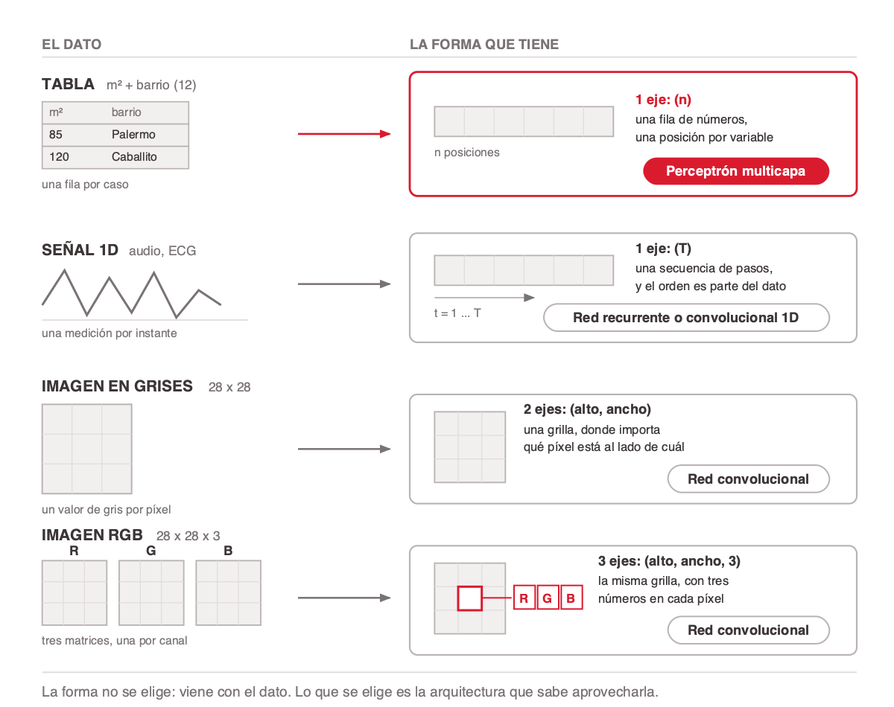
<!-- ascii-source:
   TABLA                              SENAL 1D  (audio, ECG)

   edad  ingreso  zona                    /\      /\   /\
   ----  -------  ----                   /  \    /  \ /  \
    34    52000    12                   /    \  /    V
    41    38000    07                  /      \/

   -> [ ][ ][ ] ... [ ]                -> [x1][x2][x3] ... [xT]
      una fila de n numeros               una secuencia de T pasos
      MLP                                 CNN 1D / RNN

   IMAGEN EN GRISES                   IMAGEN RGB

   +---------------+                  +---------------+
   |               |                  |      [*]      |   cada pixel
   |    28 x 28    |                  |               |   guarda tres
   |               |                  |    28 x 28    |   numeros: R G B
   +---------------+                  +---------------+

   -> una grilla alto x ancho         -> la misma grilla,
      CNN                                3 numeros por pixel
                                         CNN
-->
<!-- ascii-note:
intent: mostrar cuatro tipos de dato, la forma natural de cada uno y la arquitectura que le corresponde
emphasize: que lo que cambia entre los cuatro es la cantidad de ejes que hace falta para no perder informacion; el pixel ampliado de RGB que guarda tres numeros en el mismo punto, no tres grillas
labels: TABLA fila de n numeros MLP, SENAL 1D secuencia de T pasos CNN 1D o RNN, IMAGEN EN GRISES grilla alto por ancho CNN, IMAGEN RGB la misma grilla con 3 numeros por pixel CNN; cuatro paneles en dos filas, mismo lienzo y mismos margenes
-->

- **La forma viene con el dato.** Es cuántos ejes necesita para no perder información, y no se elige: una tabla es una fila, una imagen es una grilla.
- **La arquitectura sí se elige.** Y se elige para aprovechar esa forma, no al revés.
- **Por eso el caso de esta clase es la tabla.** Ya viene como un MLP la espera; los otros tres habría que aplanarlos, y al aplanar se pierde la vecindad.

### Sources

corpus/chat.md.md (§2 El input: principio general — familias de estructura y su arquitectura natural)
784 = 28 × 28 — ejemplo aportado por el presentador (MNIST), no figura en el corpus

### Speaker notes

Esta diapositiva fija el alcance de la clase y conviene darla despacio, porque todo lo que sigue se apoya en ella. Recorré los cuatro paneles en orden y en cada uno hacé la misma pregunta: ¿cuántos ejes hacen falta para no perder nada? Uno, uno, dos, dos.

La pregunta que funciona antes de mostrarla: si les paso una foto de 28 por 28 en escala de grises, ¿cuántos números son? Respuesta, 784. Sirve para que dimensionen, y para que se vea que aplanar siempre se puede.

El punto que más rinde es el que ordena la diapositiva: la forma no es una decisión de diseño, viene con el dato. Lo que uno elige es si la arquitectura la aprovecha. Un MLP no tiene ningún mecanismo para saber que dos píxeles son vecinos, así que le da lo mismo el orden; por eso la fila aplanada le sirve y por eso la tabla es su caso natural.

Dos matices que el diagrama no dice con todas las letras y conviene decir vos: en una imagen importa qué píxel está al lado de cuál, y en una señal importa el orden de los pasos. Esa vecindad es lo que un MLP no tiene forma de aprovechar, y es la razón de que existan las otras arquitecturas.

Sobre el panel de RGB, que es el que más se malinterpreta: son tres números en el mismo punto, no tres grillas. El píxel ampliado del dibujo es para eso. De los tres ejes, el de color es el único que se podría reordenar sin cambiar el problema; alto y ancho no.

Por si alguien pregunta si el aplanado es automático: no lo es. Una capa densa opera solo sobre el último eje (Keras: "Dense computes the dot product between the inputs and the kernel along the last axis"). Aplanar es una capa que uno pone: `layers.Flatten()`.

No te metas con cómo funciona una convolución ni con attention. Alcanza con que quede claro que existen, que les corresponde otra forma de dato, y que de acá en adelante la clase modela un MLP sobre datos tabulares.

---

## 3. Qué es un MLP

### Content

> **Multi-Layer Perceptron**, o perceptrón multicapa: una capa de entrada, una o más capas ocultas donde cada neurona se conecta con todas las de la capa anterior (de ahí el nombre "densa", o *fully connected*), y una capa de salida.

<!-- template: quote -->

### Sources

corpus/chat.md.md (§1 Conceptos base: Pesos y bias; §7 Ejemplos completos — dónde se usa una capa fully connected después de un extractor)

### Speaker notes

Una sola frase en pantalla, veinte segundos. Leela y marcá con el dedo la parte que importa: cada neurona se conecta con todas las de la capa anterior. De acá en adelante, cuando la clase diga "la red", dice esto.

El nombre es histórico y viene del perceptrón de Rosenblatt; si alguien pregunta por qué se llama perceptrón habiendo capas densas de por medio, contestá eso y seguí, no abras ese frente.

Si aparece la pregunta de para qué sirve hoy un MLP con las CNN y los transformers dando vueltas, la respuesta corta es que en visión el MLP es el bloque final. La CNN convierte la imagen en un vector de features y ese vector entra a una fully connected que produce la salida. El MLP no quedó obsoleto, quedó adentro.

---

## 4. Una neurona, en una línea

### Content

Antes de diseñar conviene fijar el objeto mínimo. Una capa hace dos cosas: una combinación lineal y una no linealidad.

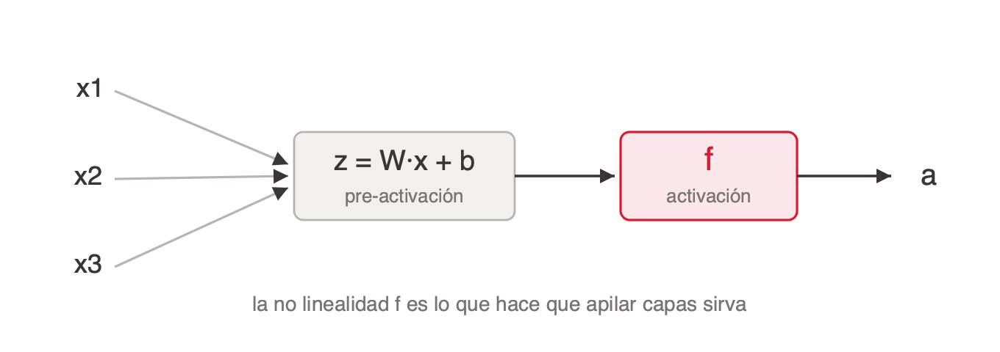
<!-- ascii-source:
   x1 ---w1--\
   x2 ---w2---&gt; [ z = W·x + b ] --&gt; [ f ] --&gt; a
   x3 ---w3--/    (pre-activación)   (activación)
-->
<!-- ascii-note:
intent: mostrar el paso de entradas a activación en una neurona
emphasize: las dos etapas z (lineal) y f (no lineal)
labels: x entradas, W·x+b pre-activación, f activación, a salida
-->

1. La neurona recibe las entradas `x` y calcula la **pre-activación** `z = W·x + b`: una combinación lineal de las entradas más un sesgo.
2. Ese `z` pasa por la **activación** `a = f(z)`, y `a` es lo que la neurona entrega a la capa siguiente.
3. La no linealidad de `f` es lo que hace que apilar capas sirva. Sin ella, la composición de capas lineales colapsa a una sola matriz.
4. Hay un puñado de candidatas para `f` y casi siempre gana ReLU. Las vemos en la sección 8, junto con el resto de las decisiones de las capas ocultas; la activación de salida es otra historia, la determina la tarea.

### Sources

corpus/chat.md.md (§1 Conceptos base: Activación, Pesos y bias)

### Speaker notes

Refresco rápido, la audiencia tiene base técnica. El punto que no puede faltar: por qué la no linealidad. Preguntales qué pasa si sacás la ReLU de una red de 5 capas. Respuesta: te queda una regresión lineal disfrazada. Si preguntan cuántos parámetros tiene una capa: `m·n + m`, con n entradas y m neuronas. No lo desarrolles, no hace falta en el resto de la clase.

---

## 5. Lo que hay que diseñar

### Content

Diseñar un MLP son seis decisiones, y la que todos creen que es la principal, cuántas capas ponerle, es la que menos pesa. Son las seis que recorre esta clase, en este orden.

- **La entrada.** Cómo cada variable del problema se convierte en floats. Es donde se gana o se pierde el modelo, y donde más tiempo vamos a estar.
- **El dataset.** Cómo se parte antes de entrenar, en train, validación y test. Sin esto ninguna métrica posterior es honesta.
- **La salida.** Cuántas neuronas y qué activación lleva la última capa. No se elige: la determina la tarea. Predecir un precio pide una neurona sin activación; clasificar en N clases, N neuronas con softmax.
- **La loss function.** La fórmula que convierte una predicción equivocada en un número, el único que la red intenta bajar. Viene junto con la salida: la salida lineal de un precio pide MSE, MAE o Huber; el softmax de N clases pide cross-entropy.
- **El error.** Cómo se mide que el modelo sirve, una vez entrenado. Resumir su desempeño en un solo número es una decisión de diseño, y ningún número sirve para todos los casos.
- **# Capas & # Neuronas.** Cuántas capas ocultas y cuántas neuronas por capa. Es lo único de la lista que se elige libremente, y lo que menos impacto tiene.

**Nota:** 1 a 3 capas ocultas alcanzan para datos tabulares, ancho en potencias de 2 decreciente, ReLU salvo motivo. El retorno está en las otras cinco.

<!-- format: editorial -->

### Sources

corpus/chat.md.md (§9 Diseño de la red: qué se decide y qué no)

### Speaker notes

Este es el mapa mental que quiero que se lleven, y además es la agenda de la clase disfrazada de contenido: casi cada viñeta es una sección. El overfitting salió de la lista a propósito, porque no es algo que se diseñe sino un problema que aparece y que la clase trata al final; si alguien pregunta por qué no está, esa es la respuesta. Lo mismo con backpropagation: es el algoritmo que hace funcionar todo lo demás, no una decisión de diseño. Recorrelas señalando hacia adelante, sin desarrollar ninguna. El remate es la última línea: contrastá con la expectativa, pasan horas tuneando capas y el retorno está en la entrada. Dato honesto para dejar caer acá o al final: en datos tabulares una red muchas veces pierde contra gradient boosting (XGBoost, LightGBM); las redes brillan cuando hay estructura que explotar (imágenes, texto, señales). Sirve para bajar la sobreexpectativa.

---

## 6. Del dato a los nodos de entrada

### Content

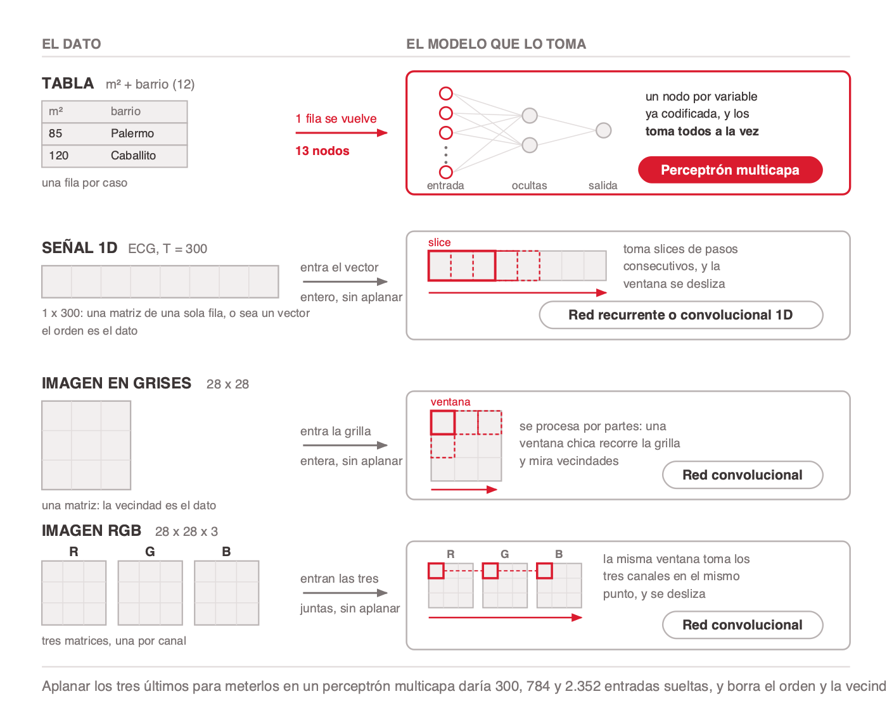
<!-- ascii-source:
   EL DATO                              EL MODELO QUE LO TOMA
   ------------------------------------------------------------------

   TABLA   m2 + barrio (12)             1 fila se vuelve 13 nodos
   +------+-----------+                          |
   | m2   | barrio    |                          v            MLP
   | 85   | Palermo   |      ------&gt;          (o)-\
   | 120  | Caballito |                       (o)--+--(O)--\
   +------+-----------+                       (o)--+--(O)---+--(S)
     una fila por caso                         ...-/
                                              (o)-/
                                          entrada  ocultas  salida
                                          los toma todos a la vez

   SENAL 1D  ECG, T = 300               entra el vector entero, sin aplanar

   +--+--+--+--+--+--+--+--+                 slice
   |  |  |  |  |  |  |  |  |   ------&gt;    +======+- - -+- - -+
   +--+--+--+--+--+--+--+--+              |      |     |     |     RNN / CNN 1D
    1 x 300: una matriz de una             +======+- - -+- - -+
    sola fila, o sea un vector              ----------------&gt;
    el orden es el dato                     toma slices de pasos
                                            consecutivos y se desliza

   IMAGEN EN GRISES  28 x 28            entra la grilla entera, sin aplanar

   +----+----+----+                          ventana
   |    |    |    |          ------&gt;      +====+- - -+- - -+
   +----+----+----+                       |    |     |     |          CNN
   |    |    |    |                       +====+- - -+- - -+
   +----+----+----+                       | - -|     |     |
     una matriz: la vecindad                -------------&gt;
     es el dato                             se procesa por partes: una
                                            ventana chica recorre la grilla

   IMAGEN RGB  28 x 28 x 3              entran las tres juntas, sin aplanar

    R      G      B                          R      G      B
   +---+  +---+  +---+       ------&gt;      +=+-+  +=+-+  +=+-+
   |   |  |   |  |   |                    | | |--| | |--| | |          CNN
   +---+  +---+  +---+                    +---+  +---+  +---+
     tres matrices, una                     --------------&gt;
     por canal                              la misma ventana toma los tres
                                            canales en el mismo punto

   ------------------------------------------------------------------
   aplanar los tres ultimos para un MLP daria 300, 784 y 2.352 entradas
   sueltas, y borra el orden y la vecindad
-->
<!-- ascii-note:
intent: mostrar el traspaso del dato al modelo que lo toma, una fila por caso, y que solo el MLP procesa todas las entradas de una vez mientras los otros tres recorren la estructura por partes
emphasize: el contraste entre el MLP, que toma los 13 nodos juntos, y las tres filas siguientes, donde una ventana marcada en rojo recorre el dato; la senal dibujada como una matriz de una sola fila (un vector) y no como cajas sueltas; y las tres matrices RGB con la misma ventana en el mismo punto de los tres canales
labels: cada fila lleva el nombre del dato a la izquierda, la leyenda del traspaso sobre la flecha, y el pill de arquitectura abajo a la derecha dentro del bloque del modelo (MLP, RNN / CNN 1D, CNN, CNN); la ventana o slice va en rojo con su posicion actual en linea llena y las siguientes punteadas, mas una flecha de recorrido debajo; el pie cierra con el costo de aplanar
-->

### Sources

corpus/chat.md.md (§ Ejemplos completos: 12 barrios más m² dan 13 neuronas de entrada, 1 m² normalizado más 12 one-hot, arquitectura `13→32→16→1`; § El input: el largo del vector queda fijo, y una forma que borra la estructura no se recupera con ninguna arquitectura; § Escalas y normalización)
784 = 28 × 28 y 2.352 = 784 × 3 — ejemplo aportado por el presentador (MNIST), no figura en el corpus

### Speaker notes

Esta diapositiva es la continuación directa de la anterior, y lo que agrega es el conteo. Abrí con la corrección que trae: **aplanar no es algo que le pase al dato, es algo que pide el MLP**. Si el mismo dato va a una CNN, no se aplana nada.

Recorré los cuatro paneles con la misma pregunta: ¿qué recibe la red? Solo en el primero la respuesta es "nodos sueltos", y son trece. En los otros tres la respuesta es una secuencia, una matriz y tres matrices: la estructura sigue ahí.

El detalle del panel de la tabla: **dos variables dan trece nodos**, no dos. El one-hot del barrio ocupa doce posiciones él solo. Es la primera vez en la clase que aparece que una variable puede ocupar más de un nodo, y es lo que la sección que sigue desarrolla.

Sobre RGB, que es el que más se malinterpreta: son tres matrices, una por canal, dibujadas una al lado de la otra. No son tres imágenes apiladas ni hay un tercer eje espacial. Dicho de otro modo, cada píxel guarda tres números.

El pie es el remate y conviene leerlo entero: si igual quisieras meter los tres últimos en un MLP, se pueden aplanar, y salen 300, 784 y 2.352 entradas sueltas. Ahí es donde se borra el orden y la vecindad. La pregunta que funciona: ¿cuántas entradas tendría una foto de 224 por 224 en color? 150.528. Sirve para que se vea por qué visión no usa MLP.

Dos cosas que la diapositiva ya no dice y conviene decir vos. **El largo no cambia:** la red espera siempre la misma cantidad de entradas, y por eso las imágenes se redimensionan y el texto se trunca o se rellena hasta un largo fijo. **La escala:** con una variable que va de 0 a 1.000.000 y otra de 0 a 1, la primera domina el entrenamiento por su magnitud y no por su importancia. Esa segunda es el puente a la sección que sigue, así que dejala para el final.

Y el remate, que el pie del diagrama ya insinúa: una tabla ya viene en la forma que un MLP espera, y por eso es el caso de esta clase.

No te metas con cómo una CNN conserva la grilla. Alcanza con que quede dicho que no aplana, y seguir.

---

# 2. Modelar la entrada

**Goal of this section:** El corazón de la clase. Mostrar el método para convertir cualquier variable en floats: la pregunta de la resta, one-hot contra embedding, la normalización y la tabla de decisiones que cierra la sección. Que salgan sabiendo decidir de qué largo es el vector de entrada de un problema real.

---

## 1. Qué significa que el dato sea tabular

### Content

Esta clase modela datos **tabulares**: una fila por ejemplo y una columna por variable, sin vecindad ni orden intrínseco entre las columnas. Intercambiar la columna de edad con la de ingreso no cambia el significado del dato mientras cada una conserve su nombre.

Esa propiedad es la que hace que un MLP encaje. Una capa densa conecta cada neurona con todas las entradas y no usa la posición para nada, así que recibir las columnas en otro orden no le quita información. En una imagen sí se la quitaría, porque ahí la posición del píxel es parte del dato.

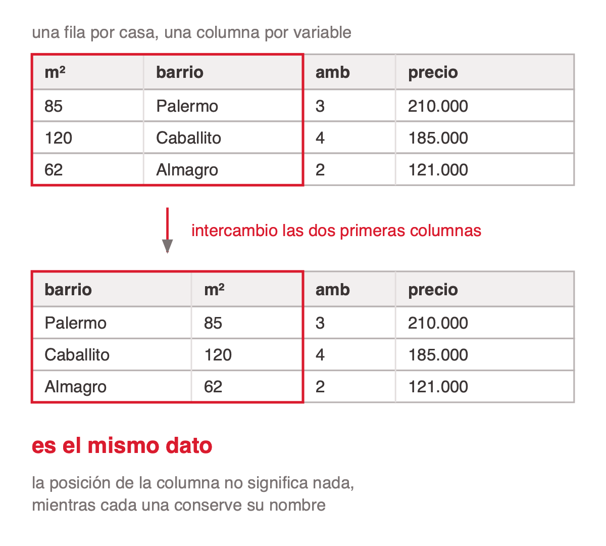
<!-- ascii-source:
   una fila por casa, una columna por variable

   +--------+----------+------+---------+
   |  m2    | barrio   | amb  | precio  |
   +--------+----------+------+---------+
   |  85    | Palermo  |  3   | 210.000 |
   |  120   | Caballito|  4   | 185.000 |
   |  62    | Almagro  |  2   | 121.000 |
   +--------+----------+------+---------+

              intercambio dos columnas
                       |
                       v

   +----------+--------+------+---------+
   | barrio   |  m2    | amb  | precio  |
   +----------+--------+------+---------+
   | Palermo  |  85    |  3   | 210.000 |
   | Caballito|  120   |  4   | 185.000 |
   | Almagro  |  62    |  2   | 121.000 |
   +----------+--------+------+---------+

              es EL MISMO dato

   la posicion de la columna no significa nada,
   mientras cada una conserve su nombre
-->
<!-- ascii-note:
intent: mostrar con el caso de house pricing que en datos tabulares el orden de las columnas no lleva informacion
emphasize: las dos columnas que se intercambian entre la primera tabla y la segunda, y que las dos tablas dicen exactamente lo mismo
labels: la tabla de casas con m2, barrio, ambientes y precio; la leyenda de intercambio entre las dos tablas; el remate de que es el mismo dato; formato vertical, pensado para ir en una columna al costado de la diapositiva
-->

### Sources

corpus/chat.md.md (§2 El input: principio general — el caso sin estructura y su invariancia al orden de columnas)

### Speaker notes

Definí "tabular" por contraste con una imagen, que es el ejemplo que todos tienen a mano: en una tabla no hay píxeles vecinos ni orden temporal que explotar, y el modelo puede recibir las columnas en cualquier orden mientras sepa cuál es cuál. Ese es el punto que conecta con la diapositiva de arquitecturas de la sección anterior: el MLP no usa la posición, y en tabular no hay posición que usar, así que la arquitectura y el dato se corresponden.

El resto de la sección es método, y conviene anunciarlo así: cada columna del dataset se convierte en una o más posiciones del vector, y lo que decide en cuántas y con qué valores es el tipo de variable.

Si alguien pregunta por imágenes, texto o series temporales, la respuesta corta es que cada familia tiene su arquitectura y que las vimos al pasar en la sección 1. No abras ese frente acá.

---

## 2. La pregunta que decide la codificación

### Content

Frente a cualquier variable, una sola pregunta ordena la decisión: **¿qué significa la resta entre dos valores?**

- **Da una cantidad interpretable** (85 m² menos 60 m² son 25 m² reales): 1 float normalizado, una posición del vector.
- **Da un orden pero no una magnitud confiable** (satisfacción 4 menos 2): ordinal, evaluar también one-hot.
- **No significa nada** (barrio 14 menos barrio 7): one-hot o embedding según cuántos valores distintos haya.
- **No se puede ni plantear:** probablemente no sea una feature útil.

**Poner un número real en el vector es afirmar algo.** Cada float le promete a la red dos cosas sobre esa posición: que las diferencias son comparables (14 está más lejos de 7 que de 13) y que la magnitud escala el efecto, porque el aporte a `z = W·x + b` es el peso por el valor. Con 85 m² y 60 m² la promesa se cumple. Con barrio 14 y barrio 7 es falsa, y ahí es donde hay que cambiar de codificación.

Todo termina en floats, nunca en enteros. Los enteros aparecen en un solo lugar: como índice para buscar una fila en una tabla de embeddings. El entero no entra a la red, entra al lookup.

### Sources

corpus/chat.md.md (§3 Codificación de variables: la pregunta que decide todo; §3 Todo termina en floats)

### Speaker notes

Esta pregunta es la herramienta más transferible de la clase. Si se llevan una sola cosa de la sección, que sea esta. Ejemplo en vivo: tirales tres variables de un dataset que conozcan (edad, código postal, nivel educativo) y que apliquen la pregunta en voz alta. El código postal es la trampa clásica: parece número, la resta no significa nada.

---

## 3. Numéricas: normalizar no es opcional

### Content

**Normalizar** es reexpresar una variable en una escala comparable con las demás antes de que entre a la red. Cambia la unidad en la que se lee el número, no la información que trae. Aplica a las numéricas con magnitud real: superficie, ingreso, edad, cantidad de transacciones.

- **z-score por defecto:** `(x − μ) / σ`. El valor pasa a leerse como "cuántos desvíos por encima o por debajo del promedio". La unidad original desaparece.
- **log antes del z-score:** con colas largas, `log(1+x)` comprime los valores altos antes de estandarizar. La diferencia entre 1 y 10 transacciones importa más que entre 4000 y 4010. Casos típicos: ingresos, cantidad de transacciones, días desde la última compra.
- **Los booleanos y one-hot no se tocan:** ya están en 0 y 1.
- **Escala pareja no es importancia pareja.** Normalizar no le quita peso a una variable; la importancia la aprenden los pesos. Solo la pone en condiciones de ser evaluada.

**Nota:** por qué no es opcional. El gradiente respecto a un peso es proporcional al valor de la entrada que lo acompaña, pero el learning rate es uno solo para toda la red. Si una variable vale ~200 (m²) y otra vale 0 o 1 (cochera), sus gradientes están a escala 200 a 1 y el entrenamiento zigzaguea.

### Sources

corpus/chat.md.md (§5 Escalas y normalización)

### Speaker notes

El "por qué" formal es el número de condición de la Hessiana, pero para la clase alcanza con la imagen de las curvas de nivel: escalas parejas dan círculos y el gradiente apunta al mínimo; escalas dispares dan elipses alargadas y el gradiente apunta a la pared. Efecto secundario importante: con sigmoide o tanh una entrada grande satura la neurona (derivada casi cero) y deja de aprender. Aclará que árboles y gradient boosting no necesitan normalización; es una particularidad de los métodos basados en gradiente.

---

## 4. Categóricas: one-hot contra embedding

### Content

Una categoría sin orden se codifica de dos formas, y la cardinalidad decide cuál.

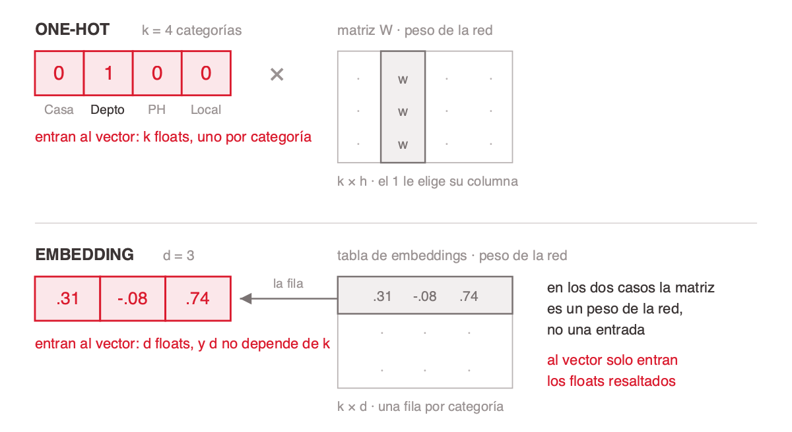
<!-- ascii-source:
ONE-HOT   k = 4 categorías
   [ 0 ][ 1 ][ 0 ][ 0 ]   x   W  (matriz de pesos, k × h)
    Casa Depto  PH  Local
   entran al vector: k floats, uno por categoría

EMBEDDING   d = 3
   [ .31 ][ -.08 ][ .74 ]   es la fila "Depto" de la tabla (k × d)
   entran al vector: d floats, y d no depende de k

en los dos casos la matriz es un peso de la red, no una entrada;
lo que entra al vector son solo los floats resaltados
-->
<!-- ascii-note:
intent: separar lo que entra al vector de lo que es peso de la red, y mostrar que el embedding aporta d floats (una fila) y no la tabla entera
emphasize: los floats que entran al vector, resaltados en rojo en las dos filas; las dos matrices quedan en gris porque son pesos
labels: ONE-HOT con las cuatro celdas y los nombres de categoria; matriz W; EMBEDDING con las tres celdas de la fila; tabla k x d con su primera fila marcada; remate al pie
-->

- **One-hot** (cardinalidad baja): un float por valor, todas en 0 salvo una en 1. Todas las categorías quedan a la misma distancia, que es la verdad del dato. No se aprende, es interpretable, necesita pocos datos.
- **Embedding** (cardinalidad alta): aporta al vector `d` floats, no `k`. Esos `d` floats son **una fila** de una tabla entrenable de `k × d` que vive dentro de la red, como cualquier peso: la categoría es el índice, la fila es lo que entra. Con 500 barrios y `d = 24`, el vector recibe 24 floats donde one-hot le pondría 500, y la red aprende la distancia entre categorías desde los datos.
- **La regla de la cardinalidad:** hasta 15 valores, one-hot; de 15 a 50, cualquiera; 50 o más, embedding.

Las dos matrices tienen el mismo estatus: son pesos de la red, no entradas. De hecho un embedding es matemáticamente equivalente a un one-hot seguido de una capa lineal sin sesgo — la tabla de embeddings **es** la primera capa. Lo único que cambia es de qué largo es el tramo del vector que aporta la columna: `k` con one-hot, `d` con embedding.

### Sources

corpus/chat.md.md (§4 One-hot vs. embedding; §7 Con 500 barrios)

### Speaker notes

La pregunta que va a aparecer: si la red toma un vector, ¿qué hace acá una matriz? La respuesta es que la tabla `k × d` no es la entrada, es un parámetro — exactamente el mismo estatus que la `W` del panel de one-hot, que también es una matriz y a nadie le hace ruido porque se lee como pesos. Lo que entra al vector es una fila, `d` floats, elegida por el índice de la categoría. Con embedding la multiplicación por el one-hot se saltea y se va directo a buscar la fila, que es la misma cuenta hecha más barata.

El puente conceptual que engancha: así arranca un LLM. Cada token es un índice que busca su fila en una tabla de unas 50.000 por 4096. El embedding de categorías tabulares y el embedding de palabras son la misma idea, una representación densa aprendida donde la geometría del espacio codifica el significado. Las dos ventajas no obvias del embedding: comparte estadística entre categorías parecidas (una categoría rara hereda de sus vecinas) y es reutilizable para clustering o búsqueda por similitud.

---

## 5. Errores de codificación caros

### Content

Casi todos entran silenciosos: el modelo entrena sin dar error y falla en producción.

- **Código como número.** Un identificador de categoría cargado como entero. La red lee orden y magnitud donde no hay ninguno: con barrio 7 y barrio 14, asume que 14 es "el doble" de 7. Van como one-hot o embedding.
- **Identificador único como feature.** Una columna cuyo valor no se repite entre ejemplos, como DNI, CUIT o número de póliza. No tiene poder predictivo porque no hay nada que generalizar; si el modelo "aprende" de ella, está memorizando. Se descarta.
- **Variable cíclica aplastada.** Una magnitud que vuelve a empezar (hora, día de la semana, mes) codificada como número plano. Los extremos del ciclo quedan lejísimos: las 23:00 y las 00:00 están a una hora y como números planos están a 23. Se codifica con dos floats, `sin(2πt/T)` y `cos(2πt/T)`.
- **Faltante rellenado con 0.** Un hueco tapado con un valor que la red no distingue de un dato real. Cuando 0 es válido, confunde ausencia con valor. La receta es imputar (media o mediana) más un flag binario, que muchas veces predice más que la variable misma.

### Sources

corpus/chat.md.md (§3 Codificación de variables: enteros que son códigos, cíclicas, faltantes; §11 Los errores que más cuestan)

### Speaker notes

Sección de "no lo hagas". Estos cuatro son los que más veces vas a ver en trabajos de alumnos y en producción. El de los códigos y el de los IDs únicos son los favoritos. Contá el caso del ID: el modelo memoriza el dataset de train, da accuracy perfecto y se derrumba con datos nuevos. Es un puente natural hacia el sobreajuste.

---

## 6. La tabla de decisiones

### Content

La sección entera cabe en una tabla. Cada fila es un tipo de variable que te vas a encontrar, y la columna del medio es la única decisión que hay que tomar. En la última columna, **`k` es la cantidad de valores distintos** que toma la variable y **`d` es la dimensión del embedding**, que se elige.

| Variable | ¿Qué es? | Ejemplo | Codificación | # de inputs (floats) |
|---|---|---|---|---|
| Booleana | Dos valores, sí o no | Tiene cochera | 0 o 1, tal cual | 1 |
| Numérica con magnitud | Número en un rango parejo | Superficie 85 m² | z-score `(x − μ) / σ` | 1 |
| Numérica con cola larga | Número con pocos valores enormes | Ingreso mensual | `log(1+x)` y después z-score | 1 |
| Ordinal | Categorías con orden, sin distancia | Plan Free → Enterprise | Float 0, 0.5, 1 más one-hot, concatenados | 1 + k |
| Nominal, cardinalidad baja | Categorías sin orden, pocas | Tipo de vivienda (4 valores) | One-hot | k |
| Nominal, cardinalidad alta | Categorías sin orden, muchas | Barrio (500 valores) | Embedding de dimensión d | d |
| Código con forma de número | Etiqueta escrita como número | Código postal, código de producto | Embedding. Nunca como número | d |
| Identificador único | Distinto en cada fila | DNI, CUIT, número de póliza | Se descarta | 0 |
| Cíclica | Magnitud que vuelve a empezar | Hora del día, mes de venta | `sin(2πt/T)` y `cos(2πt/T)` | 2 |
| Fecha | Un instante: ciclo más antigüedad | Fecha de alta del cliente | "Cuándo en el ciclo" (cíclica) más "hace cuánto" (continua) | 2 por ciclo + 1 |
| Texto libre | Frases sin vocabulario fijo | Reseña, descripción | Sentence transformer (TF-IDF como baseline) | d |

<!-- format: editorial -->

**Corrido, tipo por tipo.** Cada fila de esta tabla está entrenada — con su forma incorrecta al lado, para ver cuánto cuesta — en [`input-data-types.ipynb`](https://github.com/austral-ing-ai/talksmith-ing/blob/main/missions/mlp/input-data-types.ipynb).

### Sources

corpus/chat.md.md (§3 Codificación de variables; §4 One-hot vs. embedding)

### Speaker notes

Es la diapositiva de referencia de la sección, la que van a fotografiar. No la leas fila por fila: pediles que elijan tres variables de un dataset que conozcan y las ubiquen. Las filas que más discusión generan son las tres del medio (ordinal, código con forma de número, identificador único) y son justamente las tres que más aparecen mal resueltas en los trabajos. Dos aclaraciones para tener a mano: la fila de fecha dice "2 por ciclo" porque una fecha suele tener más de uno, el mes del año y el día de la semana, y ahí son 2 + 2 + 1; y si alguien pregunta por qué faltantes no está en la tabla, la respuesta es que faltar no es un tipo de variable sino algo que le puede pasar a cualquiera. Se imputa (media o mediana en las numéricas, categoría propia en las categóricas) y se suma un float más, el flag binario que dice si el dato estaba. Ese flag muchas veces predice más que la variable misma. El cierre importa: el largo del vector de entrada es una consecuencia de la tabla, no una decisión de arquitectura. Si alguien pregunta por qué la columna dice floats y no neuronas, la respuesta corta es que la entrada no calcula nada: una neurona hace `z = W·x + b` más activación, y la primera que hace eso es la primera capa oculta. Es una imprecisión frecuente en los libros y vale la pena marcarla, porque es la misma idea con la que abre la clase: la red ve un vector de floats.

---

# 3. Partir el dataset

**Goal of this section:** Qué se hace con el dataset antes de entrenar. Los tres conjuntos, para qué sirve cada uno, en qué proporción, y qué errores de partición arruinan la medición sin lanzar ningún error. Es la sección que hace honesta cualquier métrica de las secciones 5 y 6.

---

## 1. Un dataset, tres trabajos distintos

### Content

**Partir el dataset** es reservar de antemano tres porciones separadas, cada una con un trabajo distinto. Existe por una sola razón: si medís el modelo con los mismos datos con los que lo entrenaste, la métrica miente.

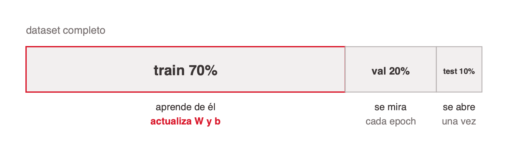
<!-- ascii-source:
  dataset completo
  +-----------------------------+----------+---------+
  |          train  70%         | val  20% | test 10%|
  +-----------------------------+----------+---------+
     aprende de el                se mira    se abre
     actualiza W y b              cada epoch una vez
-->
<!-- ascii-note:
intent: mostrar las tres porciones del dataset y qué hace el modelo con cada una
emphasize: los tres bloques y la asimetría de tamaño; que solo train actualiza pesos
labels: train 70%, val 20%, test 10%
-->

- **Train.** La muestra con la que se ajusta el modelo. Es la única que actualiza `W` y `b`. El modelo la ve y aprende de ella.
- **Validación.** Evaluación frecuente durante el entrenamiento, para tunear hiperparámetros y decidir cuándo cortar (early stopping). El modelo la ve después de cada epoch y nunca entrena con ella. También se la llama dev set.
- **Test.** Se abre una sola vez, con el modelo ya terminado. Es la lectura más cercana al desempeño en producción que se puede conseguir antes de desplegar.

### Sources

corpus/train-test-split-roboflow.web.md (§1 Resumen; §3 Training set; §4 Validation set; §5 Test set; §10 Ratios); corpus/train-validation-test-sets.web.md (§1 Los tres conjuntos, definidos)

### Speaker notes

Arranca por el porqué, no por los porcentajes: medir con los datos de entrenamiento es como tomar examen con las respuestas a la vista. Los números 70/20/10 están en el diagrama y son criterio práctico de la industria (Roboflow los recomienda como default), no un resultado empírico; decilo así si alguien pregunta de dónde salen. Con datasets muy grandes, de decenas de miles de ejemplos, 80/10/10 también funciona, porque ese 10% sigue siendo mucha muestra. El punto que más se olvida es el piso absoluto: con 200 ejemplos totales, un 10% de test son 20 casos y cualquier métrica sobre 20 casos es ruido. Ahí conviene cross-validation, que aparece en la 3.4.

---

## 2. Los tres, lado a lado

### Content

| Criterio | Train | Validación | Test |
|---|---|---|---|
| Para qué sirve | El modelo aprende de él | Tuning, early stopping, elegir modelo | Evaluación final sin sesgo |
| Cuándo lo ve el modelo | Cada epoch | Se evalúa cada epoch, nunca entrena con él | Una vez, al final |
| Actualiza los pesos | Sí | No | No |
| Augmentation | Sí | No | No |
| Proporción típica | 70% | 20% | 10% |

- **Por eso no alcanza con partir en dos.** Sin validación terminás tuneando contra el test, y cuando desplegás sus métricas ya no son insesgadas. El split de dos vías sirve solo si no tomás ninguna decisión iterativa, que no describe a ningún proyecto real.

### Sources

corpus/train-test-split-roboflow.web.md (§6 La distinción sutil; §7 Preprocesamiento contra augmentation; §11 Por qué no alcanza con train y test; tabla comparativa); corpus/train-validation-test-sets.web.md (§2 Qué distingue a validación de test)

### Speaker notes

Esta tabla es el resumen que se llevan de la sección. La fila que cuesta es "actualiza los pesos": muchos creen que el modelo aprende algo de validación porque la métrica aparece en pantalla cada epoch. No aprende nada; el que aprende sos vos, y por eso hace falta el test. La analogía que funciona: validación son los simulacros que hacés para estudiar, test es el examen final; si te dan el examen final de simulacro, deja de medir. Menciona que en Kaggle el test set se libera recién al cierre de la competencia, exactamente por esto.

---

## 3. Todo se aprende solo del train

### Content

La partición no alcanza si el preprocesamiento se calcula mal. Las estadísticas de normalización se calculan **solo** con el conjunto de entrenamiento, y se guardan para reaplicarlas idénticas en validación, test y producción.

```python
# MAL: μ y σ contaminados con el test (data leakage)
scaler.fit_transform(X_test)

# BIEN: μ y σ aprendidos solo del train
scaler.fit(X_train)
scaler.transform(X_test)
```

- **Calcularlos sobre todo el dataset es data leakage.** Información del test se filtra al entrenamiento y la métrica sale optimista. La regla general: todo lo que se aprende de los datos se aprende solo del train, transformaciones incluidas.
- **La transformación se aplica a los tres, sus parámetros salen de uno.** Normalizar, imputar y mapear categorías corre sobre train, validación y test por igual. Pero μ, σ, la mediana de imputación y el diccionario categoría a índice se calculan únicamente sobre train.
- **Un modelo desplegado no son solo `W` y `b`.** Son los pesos más los μ y σ de cada variable, más el diccionario categoría a índice, más los valores de imputación. Si se guardan solo los pesos, el modelo queda inservible.
- **El bug es silencioso.** Normalizar en producción con μ=120 en vez de 95 no lanza ninguna excepción. Solo devuelve predicciones incorrectas.

### Sources

corpus/chat.md.md (§6 μ, σ y el artefacto de producción); corpus/train-test-split-roboflow.web.md (§7 Preprocesamiento contra augmentation)

### Speaker notes

Esta diapositiva venía de la sección de input y encaja mejor acá, con la partición ya explicada. Es el error número uno de producción en ML según la fuente: que la normalización o el diccionario de categorías queden fuera del artefacto. La regla para llevarse: el preprocesamiento y el modelo se despliegan juntos; quien consume el modelo no debería tener que saber que la normalización existe. Ojo con un matiz que la fuente de Roboflow no cubre: ellos dicen "el preprocesamiento se aplica a los tres splits" y es cierto, pero no advierten que los parámetros salen solo de train. Si hay tiempo, mencioná data drift: la solución no es recalcular μ y σ en producción, es detectar el drift y reentrenar.

---

## 4. Los errores que arruinan la medición

### Content

Ninguno de estos lanza una excepción. Todos devuelven una métrica mejor que la real.

- **Duplicados repartidos entre conjuntos.** El mismo caso, o uno casi idéntico, cae en train y también en test. El test deja de medir generalización y mide memoria: el modelo ya vio la respuesta. Aparece en cualquier dataset armado juntando fuentes. Se deduplica antes de partir, nunca después.
- **No estratificar con clases desbalanceadas.** El split aleatorio reparte sin mirar la clase. Con 2% de fraude, el test puede quedar con tres casos positivos, y un recall calculado sobre tres casos no es una métrica, es una anécdota. Se estratifica por la clase, así las tres porciones conservan la proporción original.
- **Partir al azar una serie de tiempo.** Si el dato tiene orden temporal, el azar pone futuro en train y pasado en test. El modelo predice enero mirando marzo, información que en producción nunca va a tener. El número se ve espectacular y no se sostiene. Se corta por fecha: lo anterior a un día entrena, lo posterior evalúa.
- **Achicar validación y test.** "Más datos, mejor modelo" tienta a dejar 90% en train. Con validación y test chicos la métrica tiene tanto ruido que dos modelos distintos parecen iguales, o el peor parece mejor. El piso práctico son unos pocos cientos de ejemplos en cada uno.

```python
from sklearn.model_selection import train_test_split

# 70 / 20 / 10 en dos pasos, con la clase estratificada
train_X, hold_X, train_y, hold_y = train_test_split(
    X, y, test_size=0.30, random_state=42, stratify=y
)
val_X, test_X, val_y, test_y = train_test_split(
    hold_X, hold_y, test_size=1/3, random_state=42, stratify=hold_y
)
```

`random_state` fijo hace la partición reproducible, que es lo que permite comparar dos modelos sobre exactamente los mismos datos.

Fuente: Jacob Solawetz (Roboflow), [Train, Validation, Test Split Explained (with Ratios)](https://blog.roboflow.com/train-test-split/) (2026); Tarang Shah, [About Train, Validation and Test Sets in Machine Learning](https://tarangshah.com/blog/2017-12-03/train-validation-and-test-sets/) (2017). Estratificación y partición temporal son aporte del docente.

### Sources

corpus/train-test-split-roboflow.web.md (§8 Errores típicos; §9 Cómo se hace en Python); conocimiento del área (estratificación y partición temporal, no cubiertas por las fuentes)

### Speaker notes

Los dos del medio son aporte propio: ninguna de las dos fuentes cubre estratificación ni series de tiempo, y las dos importan para los trabajos que entregan. El de series de tiempo es el que más veces vas a ver mal resuelto, y el síntoma es un modelo que en el papel anda espectacular. Conectá con la sección 2: el identificador único es la versión extrema de este problema, memorizar en vez de aprender. Y dejá el puente abierto hacia overfitting: la brecha entre train y validación, que es el diagnóstico de la sección 6, solo se puede mirar si esta partición está bien hecha.

---

## 5. Qué hacer y qué no

### Content

La sección en reglas operativas. A la izquierda lo que hay que hacer siempre; a la derecha lo que más se ve mal resuelto.

**Qué hacer**

- Partir antes de explorar
- Partir por grupo, no por fila
- Fijar la semilla y guardar el split
- Augmentation solo en train

**Qué no hacer**

- Tunear contra el test
- Volver a partir porque el número no cerró
- Confiar en el corte por defecto

### Sources

corpus/train-test-split-roboflow.web.md (§6 La distinción sutil; §7 Preprocesamiento contra augmentation); corpus/train-validation-test-sets.web.md (§2 Qué distingue a validación de test)
Partir antes de explorar, partir por grupo, fijar la semilla y no volver a partir son aporte propio para la clase; no figuran en el corpus

### Speaker notes

Esta es la diapositiva que se fotografía y la que cierra la sección. Las dos columnas se leen enfrentadas, no en orden, y cada línea se desarrolla en voz alta: la diapositiva es el índice, vos sos el contenido.

**Partir antes de explorar.** Es la que más se resiste, y la objeción típica es "pero si todavía no entrené nada". La respuesta: las decisiones que tomás mirando los datos, qué variables sacar, cómo tratar los outliers, qué imputar, también son aprendizaje. Si las tomaste mirando todo, el test ya no está limpio.

**Partir por grupo.** Es la que más aparece en los trabajos que entregan. El caso que lo hace evidente: diez radiografías del mismo paciente repartidas entre train y test. El modelo no generaliza a pacientes nuevos, reconoce a ese paciente. Vale igual para varias filas del mismo cliente o de la misma sesión.

**Fijar la semilla y guardar el split.** Un experimento que no se puede repetir no se puede comparar con el siguiente. Guardar los índices, no solo la semilla.

**Augmentation solo en train.** Validación y test se quedan con los datos originales, porque su trabajo es representar lo que viene en producción. El preprocesamiento, en cambio, se aplica a los tres: esa es la distinción que se confunde.

**Tunear contra el test.** Dala despacio porque es contraintuitiva. El modelo no entrena con validación ni con test; la diferencia sos vos, que elegís mirando validación y a lo largo de muchos experimentos vas sobreajustando tus decisiones a ese conjunto. El test atrapa eso solo si nada se eligió mirándolo, y por eso existe el tercer conjunto.

**Volver a partir porque el número no cerró.** Repartir hasta que el resultado guste es elegir la partición más favorable. Es sobreajustar al test sin darse cuenta y sin que nada falle.

**Confiar en el corte por defecto.** La más práctica: mostrá la firma de `train_test_split` y señalá que `stratify` es opcional y viene en `None`, que no hay parámetro de grupo, y que no mira el tiempo. La mayoría de los splits rotos que van a ver son exactamente ese default.

---

# 4. Modelar la salida

**Goal of this section:** Mostrar que la última capa no se elige, la determina la tarea, y que activación de salida y loss van siempre juntas. La loss aparece acá nombrada en el catálogo y se desarrolla en la sección 5. Que salgan sabiendo mapear "qué predice el modelo" a "cuántas neuronas, qué activación, qué loss", y sabiendo por qué la forma de cada activación de salida corresponde a lo que se predice.

---

## 1. Un catálogo para elegir sin dudar

### Content

Casi cualquier tarea entra en esta tabla. Elegida la fila, la salida queda determinada.

| Qué predice | Neuronas | Activación | Loss |
|---|---|---|---|
| Un real (precio) | 1 | Lineal | MSE / MAE / Huber |
| Sí o no (churn) | 1 | Sigmoide | BCE |
| Una de N clases | N | Softmax | Cross-entropy |
| Varias de N (tags) | N | Sigmoide ×N | BCE |
| Conteo (demanda) | 1 | Softplus / exp | Poisson NLL |
| Percentiles (P10, P50, P90) | 3, uno por percentil | Lineal | Pinball |
| Distribución (μ, σ) | 2 | μ lineal, σ softplus | NLL gaussiana |

Un caso que conviene remarcar: cuando el negocio necesita un rango y no un punto, los percentiles (P10, P50, P90) son la opción más rentable. No asumen forma de la distribución y dan directamente el intervalo que el negocio quiere.

**Corrido, tarea por tarea.** Las siete familias están entrenadas — cada una con su forma incorrecta al lado — en [`output-layer-types.ipynb`](https://github.com/austral-ing-ai/talksmith-ing/blob/main/missions/mlp/output-layer-types.ipynb), sobre las mismas casas del notebook de la entrada.

### Sources

corpus/chat.md.md (§8 Catálogo completo de outputs; predecir una distribución, no un punto)

### Speaker notes

No leas toda la tabla; usala como referencia y detenete en dos o tres filas. La de percentiles suele ser nueva para los alumnos y es muy útil en la práctica (stock, riesgo, capacidad, donde importa el peor escenario). La media es la respuesta correcta a una pregunta que muchas veces nadie hizo. La distribución con μ y σ conecta con estadística que ya vieron.

Si alguien pregunta por qué la fila de percentiles dice 3 y no `N`: porque la fila ya eligió cuáles son. `N` y `k` aparecen donde el número lo pone el problema — cuántas clases hay, cuántos tags —; acá lo pone quien modela, y son tantas neuronas como percentiles pida el negocio. Con P50 y P95 solos serían 2.

---

## 2. La capa de salida la determina la tarea

### Content

La activación de salida es el mismo tipo de objeto que ReLU, pero se elige con otro criterio: poner el número en el rango y la interpretación correctos. Son cuatro, y cada una corresponde a un tipo de respuesta.

| Activación | Representación | Rango | Ejemplo |
|---|---|---|---|
| Lineal (ninguna) | `y = z` | todo ℝ | precio |
| Sigmoide | `σ(z) = 1 / (1 + e⁻ᶻ)` | (0, 1) | probabilidad de churn |
| Softmax | `eᶻⁱ / Σⱼeᶻʲ` | vector que suma 1 | clase de una imagen |
| Softplus | `log(1 + eᶻ)` | (0, ∞) | demanda o desvío |

"Activación lineal" es una forma elegante de decir ninguna activación. Es la única capa donde no poner activación es lo correcto.

<!-- template: concept-breakdown -->

### Sources

corpus/chat.md.md (§8 La capa de salida)

### Speaker notes

Contrastá con las capas ocultas: ahí la activación casi no importa (ReLU y listo). En la salida, cada opción corresponde a un rango y a una interpretación. Quedate en la fórmula y el rango; las formas las dibuja la diapositiva que sigue, no las adelantes. Preguntá por casos: ¿qué activación para predecir la cantidad de unidades vendidas? Softplus o exp, porque un conteo no puede ser negativo. La salida lineal con MSE para conteos permite predicciones negativas, un error clásico.

---

## 3. Cómo se ven las cuatro

### Content

La tabla de la diapositiva anterior dice el rango; el dibujo dice la forma. Es lo que hace evidente por qué cada una sirve para lo que sirve.

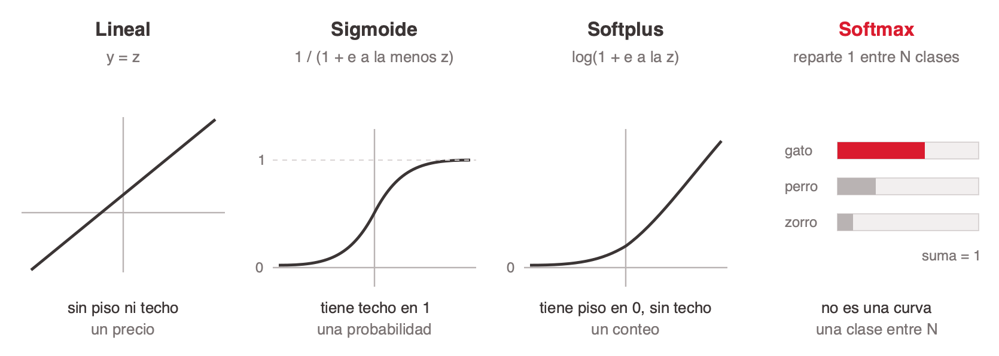
<!-- ascii-source:
     Lineal  y = z          Sigmoide  1/(1+e^-z)     Softplus  log(1+e^z)     Softmax  reparte 1
        |       /              |     _______            |         /
        |      /             1 |    /                   |        /            gato  [######   ]
    ----+-----/----        ----+---/-------         ----+------/------        perro [##       ]
        |    /               0 |__/                   0 |____/                zorro [#        ]
        |   /                  |                        |                          suma = 1

    sin piso ni techo      tiene techo en 1       tiene piso en 0        no es una curva
    un precio              una probabilidad       un conteo              una clase entre N
-->
<!-- ascii-note:
intent: mostrar la forma de las cuatro activaciones de salida en cuatro paneles iguales, con el mismo layout que el diagrama de las activaciones ocultas
emphasize: el techo de la sigmoide en 1 y el piso de softplus en 0; que softmax no es una curva sino un reparto que suma 1
labels: Lineal, Sigmoide, Softplus, Softmax; sin piso ni techo, techo en 1, piso en 0, reparto entre clases
-->

- **Lineal.** La recta `y = z`. No tiene piso ni techo, y por eso sirve para un precio: cualquier valor real es una respuesta válida.
- **Sigmoide.** Aplasta cualquier número en (0, 1). El techo en 1 es lo que la convierte en una probabilidad.
- **Softplus.** Piso en 0 y sin techo. Es la forma correcta para un conteo o un desvío, que no pueden ser negativos.
- **Softmax.** No transforma un valor, reparte 1 entre N clases que compiten. Es la única que necesita ver todas las neuronas de salida a la vez.

### Sources

corpus/chat.md.md (§8 La capa de salida)

### Speaker notes

Es el complemento visual de la diapositiva anterior y se da rápido, dos minutos. El punto que justifica la diapositiva: la forma explica el uso. La sigmoide tiene techo en 1, por eso es una probabilidad. Softplus tiene piso en 0 y no tiene techo, por eso sirve para conteos. La lineal no tiene ni piso ni techo, por eso sirve para un precio. Y softmax no es una curva: si alguien la dibuja como curva, no la entendió. Cerrá con la pregunta de la diapositiva anterior si no la hiciste: ¿cuál para unidades vendidas?

---

# 5. La loss function

**Goal of this section:** Dar el segundo componente del par que la tarea determina. La sección anterior dejó cuántas neuronas y qué activación; esta deja qué número minimiza la red y por qué ese y no otro. Que salgan sabiendo elegir la loss para las tres familias que van a usar (regresión, binaria, multiclase), sabiendo leer su fórmula y la consecuencia de la forma de cada una, y con las especializadas ubicadas como referencia.

---

## 1. Qué es, en el fondo, la IA

### Content

> La IA es el diseño de agentes racionales: sistemas que perciben su entorno y toman acciones para maximizar sus posibilidades de éxito en un objetivo dado. Resolver problemas complejos con matemáticas a gran escala, en lugar de crear humanos sintéticos.

<!-- template: quote -->

### Sources

Cita aportada por el presentador. Sin fuente atribuida todavía (ver Open questions)

### Speaker notes

Abrí la sección con esta diapositiva y dejala en pantalla mientras la leés entera. Es una definición de la materia, no de la clase, así que vale bajar un cambio de ritmo acá.

El puente a la sección es la última parte de la primera oración: **un objetivo dado**. Todo lo que sigue es la respuesta a la pregunta de dónde sale ese objetivo y cómo se escribe en una fórmula. La loss function es, literalmente, el objetivo dado.

La segunda oración sirve para bajar la mística: nada de lo que van a ver en esta clase se parece a construir una mente. Es una fórmula, una derivada y un paso de actualización, repetidos muchas veces.

---

## 2. Loss, cost y objective

### Content

Una **loss function** es la fórmula que convierte una predicción equivocada en un número — el único que la red intenta bajar, y del que sale el gradiente que corrige cada peso. Pero alrededor de ese número hay **tres** que se usan como sinónimos y no lo son.

- **Loss.** El error de un solo ejemplo. Es lo que mide la fórmula que elegimos acá.
- **Cost.** El promedio del loss sobre un batch o sobre el dataset. Es el número que el entrenamiento reporta.
- **Objective.** El cost más los términos de regularización, cuando las hay. Es lo que el optimizador minimiza de verdad, y la sección 6 muestra cuáles son, una vez que el gradiente esté sobre la mesa.

La loss no se elige libre: viene con la salida. Para predecir un precio la tarea pide una neurona sin activación, porque el valor puede ser cualquier número real, y sobre esa salida van MSE, MAE o Huber. Cambiar la activación de salida obliga a cambiar la loss, y al revés.

**Notación de acá en adelante:** `y` es lo que la red predijo y `t` el valor verdadero que viene con el dato.

### Sources

corpus/chat.md.md (§1 Conceptos base: Loss, cost, error, objective; §8 La capa de salida — activación de salida y loss se eligen juntas siempre)
El ejemplo de la salida lineal para un precio lo aportó el presentador; la fila correspondiente del catálogo (1 neurona / lineal / MSE-MAE-Huber) sí está en el corpus (§8)

### Speaker notes

Es la diapositiva de vocabulario de la sección y conviene darla despacio, porque los tres términos se usan como sinónimos en todos lados y después no se entiende de qué se habla. La distinción viene de los cursos de Andrew Ng; Bishop y Goodfellow usan "error function" y "cost function" indistintamente, y en papers modernos se dice "loss" para todo. Si alguien te corrige, esa es la respuesta honesta: la distinción es útil para enseñar, no es un estándar.

Cuidado con la palabra "error" a secas, que es la que más confusión genera: en estadística es el residuo `y − t`, y "error rate" es la proporción de clasificaciones incorrectas. Ninguna de las dos es la loss.

El punto de la diferenciabilidad es el que ordena la clase entera y vale la pena insistir: la razón por la que no entrenamos directamente sobre accuracy, que es lo que en el fondo nos importa, es que accuracy no tiene derivada. Se entrena sobre un sustituto derivable y se mide con lo que importa. Esa brecha entre lo que se optimiza y lo que se reporta reaparece en la sección 7.

---

## 3. Regresión: MSE, MAE y Huber

### Content

Salida de una neurona con activación lineal. Las tres losses miden lo mismo, la distancia entre `y` y `t`, y se diferencian en cuánto castigan un error grande.

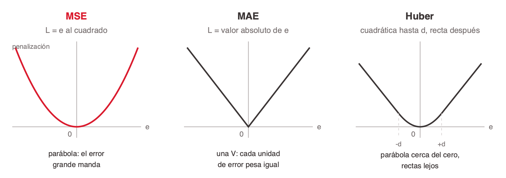
<!-- ascii-source:
      cuanto castiga cada loss un error de tamano  e = y - t

     MSE   e^2               MAE   |e|             Huber  (d = 1)
       |\           /          |\          /          |\          /
       | \         /           | \        /           | \        /
       |  \       /            |  \      /            |  \      /
       |   \     /             |   \    /             |   \    /
       |    \   /              |    \  /              |    \__/
   ----+-----\_/-----      ----+-----\/-----      ----+------+-----
       0      e                0      e                0     e

   parabola: el error      una V: cada unidad     parabola cerca del
   grande manda            de error pesa igual    cero, rectas lejos
-->
<!-- ascii-note:
intent: contrastar la forma de las tres curvas de penalizacion sobre el mismo eje de error
emphasize: que MSE es una parabola que acelera, MAE una V de pendiente constante, y Huber una parabola cerca del cero cuyas colas se vuelven rectas
labels: eje horizontal e = y - t, eje vertical penalizacion; MSE e^2, MAE |e|, Huber con d = 1
-->

- **MSE (error cuadrático medio).** `L = (y − t)²`. Castiga el error al cuadrado, así que un ejemplo muy lejos aporta más gradiente que cien ejemplos cerca. Es el default de regresión y la opción correcta cuando los valores raros son datos legítimos que el modelo tiene que aprender.
- **MAE (error absoluto medio).** `L = |y − t|`. Castiga proporcional al error, así que un outlier pesa como un ejemplo más. Es la opción cuando los valores raros son ruido o errores de carga.
- **Huber.** Cuadrática mientras `|y − t| ≤ d` y lineal a partir de ahí. Se queda con el gradiente suave de MSE cerca del cero y con la resistencia de MAE lejos. `d` es un hiperparámetro y marca dónde está la frontera.

### Sources

corpus/chat.md.md (§8 Catálogo completo de outputs — real (precio): 1 neurona / lineal / MSE-MAE-Huber)
El contraste entre las tres (MSE castiga fuerte los errores grandes, MAE resiste outliers, Huber es el punto medio) lo aportó el presentador; las fórmulas son estándar y no figuran en el corpus

### Speaker notes

El número que cierra la discusión, y conviene escribirlo en el pizarrón: con un error de 1, 2 y 10, MSE castiga 1, 4 y 100; MAE castiga 1, 2 y 10; Huber con `d = 1` castiga 0,5, 1,5 y 9,5. Ese salto de 100 contra 10 es exactamente por qué una propiedad mal cargada arrastra el entrenamiento entero con MSE.

Huber con `d = 1` vale `½e²` mientras `|e| ≤ 1` y `|e| − ½` después. Si alguien pregunta por el medio que aparece en la parte cuadrática y no en MSE, la respuesta es que está para que las dos ramas peguen sin salto en `|e| = d`, y vuelve en la sección que sigue con otro motivo.

La pregunta que funciona para elegir: ¿esa propiedad de 20 millones es un dato real o alguien puso un cero de más? Si es real, MSE. Si es carga sucia, MAE o Huber. La elección de loss es una afirmación sobre los datos, no una preferencia.

Aviso práctico para el trabajo: si el target no está normalizado, MSE sobre precios en pesos da números gigantes y el entrenamiento arranca inestable. Normalizar el target y desescalar al predecir es la costumbre.

---

## 4. Clasificación binaria: BCE

### Content

Salida de una neurona con sigmoide, o sea una probabilidad entre 0 y 1. La **binary cross-entropy** castiga según cuánta probabilidad le dio la red a la respuesta correcta.

`L = −[ t · log(y) + (1 − t) · log(1 − y) ]`

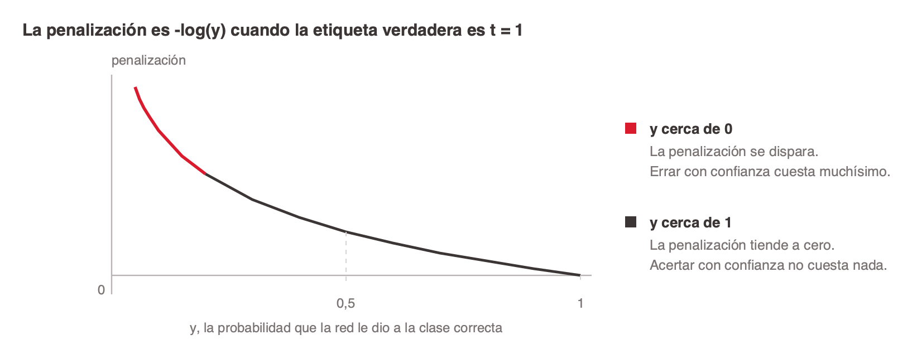
<!-- ascii-source:
        penalizacion  -log(y)   cuando la etiqueta verdadera es  t = 1

    L  |
       |\
       | \
       |  \
       |   \____
       |        \________
   ----+------------------+----  y  (probabilidad que dio la red)
       0                  1

   y cerca de 1   ->  penalizacion cerca de 0    acertar seguro no cuesta
   y cerca de 0   ->  penalizacion al infinito   errar seguro cuesta todo
-->
<!-- ascii-note:
intent: mostrar que la penalizacion de BCE explota cuando la red le da poca probabilidad a la clase correcta
emphasize: la asintota vertical en y = 0 y que la curva toca cero en y = 1
labels: eje horizontal y de 0 a 1 (probabilidad predicha), eje vertical penalizacion -log(y)
-->

- **Siempre queda un solo término vivo.** Con `t = 1` sobrevive el primer término y la penalización es `−log(y)`; con `t = 0` sobrevive el segundo y es `−log(1 − y)`. `t` vale 0 o 1, así que el otro se multiplica por cero y desaparece.
- **La confianza equivocada es lo caro.** Decir 0,5 y errar cuesta poco; decir 0,01 y errar cuesta muchísimo. Es lo que empuja a la red a calibrar y no solo a acertar el lado.
- **Con logits crudos hay que convertir al predecir.** `prob = keras.ops.sigmoid(model(x))`. Un logit de 2,3 no es una probabilidad.

### Sources

corpus/chat.md.md (§8 La capa de salida — sí o no (churn): 1 neurona / sigmoide / BCE; el detalle de implementación de la loss que recibe logits y el error de la doble sigmoide)
La fórmula de BCE es estándar y no figura en el corpus

### Speaker notes

Recuperá acá el bloque que quedó archivado sobre los pares que no se rompen: es el mismo contenido y este es su lugar natural ahora que la loss tiene sección propia.

La forma de leer la fórmula sin que asuste: son dos casos disfrazados de uno. `t` vale 0 o 1, así que uno de los dos términos se multiplica por cero y desaparece. Mostralo con los dos casos en el pizarrón antes de mostrar la fórmula completa y deja de dar miedo.

El error de la doble sigmoide es de los que más aparecen en los trabajos y es difícil de diagnosticar, porque el modelo entrena, no tira excepción, simplemente aprende mal. La señal: probabilidades apelotonadas cerca de 0,5 que nunca se despegan.

Si preguntan por qué logaritmo, la respuesta corta es que convierte productos de probabilidades en sumas (la verosimilitud de todo el dataset es un producto) y que su derivada da la forma limpia `y − t` cuando se combina con la sigmoide. Esa cancelación es la que hace que el par sigmoide más BCE entrene bien y que otros pares no.

---

## 5. Clasificación multiclase: cross-entropy

### Content

Salida de N neuronas con softmax, o sea un vector de probabilidades que suma 1. La **cross-entropy** mira una sola casilla de ese vector, la de la clase verdadera, y castiga `−log` de esa probabilidad.

`L = −log(y_c)`, donde `c` es la clase correcta.

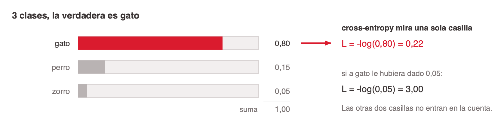
<!-- ascii-source:
    3 clases, la verdadera es  gato

    la red predice                    cross-entropy mira una sola casilla

    gato   [########  ]  0.80   <---  L = -log(0.80) = 0.22
    perro  [##        ]  0.15
    zorro  [#         ]  0.05
                         ----
                         1.00

    si a gato le hubiera dado 0.05:   L = -log(0.05) = 3.00
-->
<!-- ascii-note:
intent: mostrar que cross-entropy ignora las clases equivocadas y solo mira la probabilidad de la correcta
emphasize: la flecha a la casilla de gato y el contraste entre 0.22 y 3.00
labels: tres clases gato/perro/zorro con sus probabilidades, la suma 1.00, y las dos penalizaciones
-->

- **Las clases compiten.** Softmax reparte una única unidad de probabilidad, así que subir una clase baja las otras. Es correcto cuando las etiquetas son excluyentes.
- **El softmax puede ir adentro.** `CategoricalCrossentropy(from_logits=True)` recibe logits crudos y aplica el softmax adentro, igual que su hermana binaria. Con etiquetas enteras en vez de one-hot, `SparseCategoricalCrossentropy`.
- **Etiquetas no excluyentes rompen el modelado.** Un ticket puede ser urgente y de facturación al mismo tiempo. Ahí van N sigmoides con BCE, no un softmax, porque forzar competencia entre etiquetas compatibles está mal desde el diseño.

### Sources

corpus/chat.md.md (§8 La capa de salida — una de N clases: N neuronas / softmax / cross-entropy; varias de N (tags): sigmoide ×N + BCE; el error de usar softmax donde va sigmoide)
La fórmula es estándar y no figura en el corpus. Los dos valores del diagrama son derivados: −log(0,80) = 0,22 y −log(0,05) = 3,00 (logaritmo natural); las tres probabilidades suman 1,00

### Speaker notes

La idea que se llevan: cross-entropy no mira el vector entero, mira una casilla. Todo el trabajo de repartir lo hizo el softmax antes.

El contraste de 0,22 contra 3,00 es el que conviene dejar escrito. Con 0,80 de probabilidad a la clase correcta la penalización es casi nada; con 0,05 se multiplica por más de trece. Y la red no necesita acertar la clase para mejorar: le alcanza con subir la probabilidad de la correcta, aunque siga sin ser la más alta. Eso responde la pregunta de por qué el entrenamiento avanza aunque accuracy no se mueva durante varias épocas.

El caso del ticket es el mejor ejemplo del error de modelado y conviene preguntarlo antes de responderlo: si un ticket puede ser urgente y de facturación, ¿sirve softmax? No, porque las obliga a competir por la misma unidad de probabilidad. Van N sigmoides independientes con BCE, una por etiqueta.

---

## 6. Las especializadas, para tener ubicadas

### Content

Tres casos donde la loss de siempre da resultados malos de una forma que no se nota. No hace falta memorizarlas, alcanza con reconocer cuándo buscarlas.

| Qué predice | Salida | Loss | Por qué la de siempre falla |
|---|---|---|---|
| Un conteo (demanda, visitas) | 1 neurona, softplus o exp | Poisson NLL | Lineal con MSE predice conteos negativos y asume varianza constante, cuando en un conteo a mayor media hay mayor varianza |
| Un rango (P10, P50, P90) | k neuronas lineales | Pinball | Un valor puntual no responde la pregunta cuando la decisión depende del peor escenario |
| Una distribución (μ, σ) | 2 neuronas, μ lineal y σ softplus | NLL gaussiana | Predecir la media sola tira a la basura cuánta incertidumbre hay |

**Los percentiles son los más rentables de los tres.** No asumen forma de la distribución, dan directamente el intervalo que el negocio pide y se implementan en pocas líneas con pinball loss. El detalle que muerde: hay que forzar que los percentiles no se crucen.

<!-- format: editorial -->

### Sources

corpus/chat.md.md (§8 Catálogo completo de outputs y "Predecir una distribución, no un punto"; "Casos que sorprenden" — conteos, ranking, supervivencia)

### Speaker notes

Es una diapositiva de referencia y se pasa rápido, dos minutos. El objetivo no es que las aprendan sino que las reconozcan cuando el problema no entra en las tres familias anteriores.

La fila de conteos es la que más rinde porque el error es invisible: el modelo entrena, converge, y predice menos tres unidades de demanda. Nadie mira las predicciones negativas hasta que alguien las mira.

La de percentiles es la que más van a usar en la práctica, sobre todo en stock, riesgo y capacidad. La frase que la vende: la media es la respuesta correcta a una pregunta que muchas veces nadie hizo.

Si alguien pregunta por ranking, supervivencia o embeddings, la respuesta corta es que existen, que siguen la misma lógica de que la tarea determina el par salida-loss, y que quedan fuera del alcance de esta clase.

---

## 7. Percentiles: la pinball loss

### Content

Ninguna columna del dataset dice cuál es el P90. Cada ejemplo trae **un solo número**, el valor que efectivamente pasó, igual que en cualquier regresión. Lo que decide si la red aprende el promedio, la mediana o el P90 **es la loss, y nada más**.

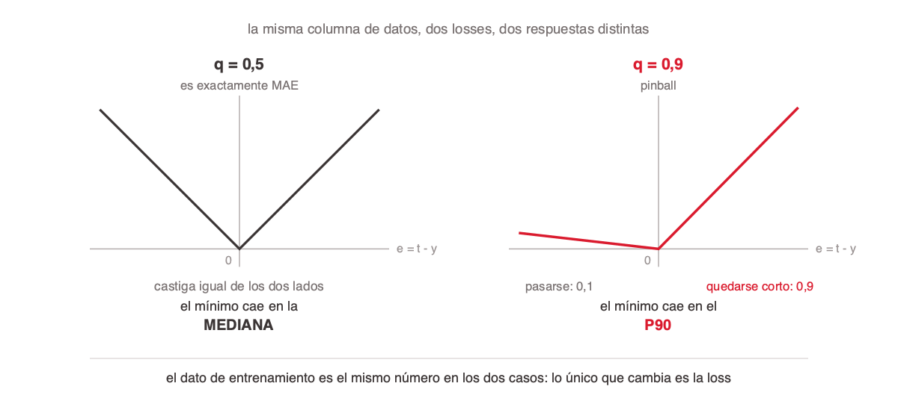
<!-- ascii-source:
      la misma columna de datos, dos losses, dos respuestas distintas

        q = 0,5   (MAE)                    q = 0,9   (pinball)
          |\        /|                       |                 /
          | \      / |                       |                /
          |  \    /  |                       |               /
          |   \  /   |                       |___           /
      ----+----\/----+----              ----+----\_________/----
          0     e                            0        e

      castiga igual de los dos lados       pasarse cuesta 0,1
      el minimo cae en la MEDIANA          quedarse corto cuesta 0,9
                                           el minimo cae en el P90

   el dato de entrenamiento es el mismo numero en los dos casos:
   lo unico que cambia es la loss, y con ella el estadistico que la red aprende
-->
<!-- ascii-note:
intent: mostrar que la asimetria de la pinball es lo que corre el minimo de la mediana al P90, con el mismo dato de entrenamiento
emphasize: la pendiente despareja del panel derecho, 0,9 de un lado contra 0,1 del otro
labels: eje horizontal e = t - y en los dos paneles, eje vertical la penalizacion; q = 0,5 a la izquierda y q = 0,9 a la derecha; remate al pie
-->

`L = max( q · (t − y), (q − 1) · (t − y) )`

- **Cada loss tiene su estadístico, y no se elige: se deduce.** El valor que minimiza MSE es **el promedio**; el que minimiza MAE es **la mediana**; el que minimiza pinball con `q` es **el percentil `q`**. Es una propiedad de la fórmula, no una intención de quien entrena.
- **La asimetría es todo el mecanismo.** Con `q = 0,9`, quedarse corto cuesta nueve veces más que pasarse. A la red le conviene subir la predicción hasta que solo el 10% de los casos le queden por encima — que es, por definición, el P90.
- **MAE es pinball con `q = 0,5`.** Los dos lados pesan igual y el mínimo cae en la mediana. No son dos losses distintas: MAE es el caso simétrico de la familia.
- **Una neurona por percentil pedido.** Con P10, P50 y P90 la última capa tiene tres neuronas lineales, cada una entrenada con su propio `q` contra el mismo objetivo.

### Sources

corpus/chat.md.md (§8 Predecir una distribución, no un punto — pinball loss); conocimiento del área (la correspondencia loss-estadístico)

### Speaker notes

Esta es la diapositiva que más rinde de la sección si se da despacio, porque cierra una idea que viene abierta desde la 5.2: **la loss no mide el error, lo define.** Hasta acá se podía leer como "elegimos la fórmula que mejor mide la distancia". Acá se ve que la fórmula también elige qué es lo que el modelo va a terminar aprendiendo.

La pregunta que conviene hacer antes de mostrar el diagrama: *"si el dataset no tiene una columna con el P90, ¿de dónde lo saca la red?"*. Dejala respirar. La respuesta desarma la intuición de que el modelo aprende lo que está en los datos: los datos traen un número por fila, y el P90 aparece porque la loss lo empuja ahí.

El número que conviene escribir en el pizarrón: con `q = 0,9`, si la predicción está por debajo del valor real el castigo es `0,9 · error`; si está por encima, `0,1 · error`. Mientras más del 10% de los casos queden por encima de la predicción, subirla sigue conviniendo. El equilibrio es exactamente el P90.

Que MAE sea pinball con `q = 0,5` sorprende y ordena: no hay que memorizar dos fórmulas, hay una familia con un parámetro. Y explica de paso por qué MAE es robusta a outliers y MSE no — la pendiente constante es lo que las separa, y eso ya se vio en la 5.3.

Si preguntan por qué no entrenar tres redes separadas, una por percentil: se puede, y da lo mismo. Se hacen en una sola por comodidad y porque comparten el cuerpo de la red. El detalle que muerde en producción es que nada garantiza que los percentiles no se crucen — que el P90 predicho quede por debajo del P50 — y eso hay que forzarlo aparte.

# 6. Backpropagation

**Goal of this section:** Abrir la caja del entrenamiento. Hasta acá el modelo estaba diseñado y la loss elegida, pero nadie dijo cómo se corrigen los pesos. La sección abre con la idea que ordena todo, entrenar es buscar el mínimo de una función, recorre el algoritmo (ciclo hacia adelante y hacia atrás, regla de la cadena, delta, propagación y paso de actualización) y cierra con la mecánica que más se confunde en la práctica: el forward va fila por fila, el backward solo acumula valores intermedios, y `W` y `b` se tocan una única vez, al cerrar el batch. **Regla editorial de la sección:** ninguna diapositiva puede dar a entender que el backward corrige pesos; lo que el backward produce son valores intermedios que se acumulan.

---

## 1. Buscar el mínimo de una función

### Content

Antes del algoritmo, la idea que lo ordena todo. Fijado el dataset, la loss depende **solo de los pesos**: cambiar un peso cambia el error. Eso dibuja una superficie, y entrenar es caminar por ella hacia abajo.

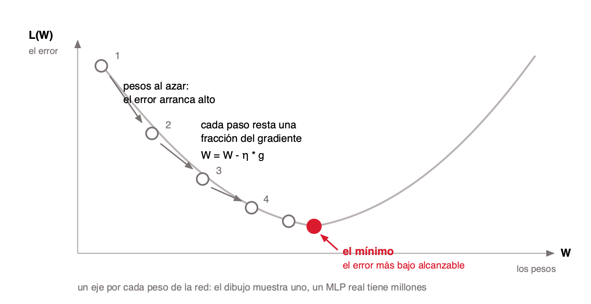
<!-- ascii-source:
   un eje por cada peso de la red: el dibujo muestra uno,
   un MLP real tiene millones

      L(W)   el error, como funcion de los pesos
       ^
       |  o (1)                                             /
       |   \    pesos al azar: el error arranca alto       /
       |    \                                             /
       |     o (2)                                       /
       |      \                                         /
       |       o (3)                                   /
       |        \      cada paso:  W <- W - n * grad  /
       |         o (4)                               /
       |          \__                            __/
       |             o__ o__ o__ o__ o__ o__ ___/
       |                          ^
       |                       el minimo: el error mas bajo alcanzable
       +----------------------------------------------------------&gt; W

-->
<!-- ascii-note:
intent: instalar la imagen mental del descenso por una superficie de error antes de entrar en las formulas
emphasize: el punto de arranque alto y al azar, los pasos cada vez mas cortos cerca del fondo, y el minimo marcado
labels: L(W) el error en el eje vertical, W los pesos en el horizontal, (1) a (4) los pasos sucesivos, n es la tasa de aprendizaje; la primera linea es el titulo del grafico y aclara que el dibujo es de un solo peso
-->

- **La loss es una función de los pesos.** El dataset está fijo, así que lo único que puede cambiar el error es `W` y `b`. La superficie del dibujo es esa dependencia.
- **No hay fórmula que salte al mínimo.** Se arranca en un punto al azar y se llega caminando, paso a paso. Por eso entrenar lleva tiempo.
- **El gradiente es la brújula.** Indica hacia dónde el error *sube* más rápido. El paso va justo en la dirección contraria, y de ahí sale el signo menos que aparece en todas las fórmulas que siguen.
- **Backpropagation es cómo se calcula esa brújula.** No cambia la idea: es el procedimiento que consigue el gradiente de millones de pesos sin rehacer la cuenta para cada uno.

**Todo lo que viene son los detalles de este dibujo.** Qué función se deriva, cómo se calcula la dirección, y en qué momento exacto se da el paso.

### Sources

Google, *Machine Learning Crash Course* — "Gradient descent is a mathematical technique that iteratively finds the weights and bias that produce the model with the lowest loss" <https://developers.google.com/machine-learning/crash-course/linear-regression/gradient-descent>
Stanford CS231n, *Optimization* — "we are making an update in the negative direction of the gradient df since we wish our loss function to decrease, not increase" <https://cs231n.github.io/optimization-1/>
knowledge-library/backpropagation/index.md (aportado por la Talk intro-redes-neuronales) — el paso de actualización, el rol de η y el signo menos
El diagrama es propio: la presentación de introducción no tiene un gráfico de la superficie de error, solo la analogía de la pelota en el valle en prosa

### Speaker notes

Esta diapositiva es la que hay que dar bien para que las cinco siguientes no sean cinco fórmulas sueltas. Todo el resto de la sección son detalles de este dibujo, y conviene decirlo así al abrir y al cerrar.

La pregunta de apertura que funciona: si les doy la red y el dataset, ¿de qué depende el error? De los pesos, y de nada más. Ese es el salto conceptual, porque hasta acá venían pensando la loss como función de la predicción.

Dos honestidades, dichas al pasar y sin desarrollarlas: el dibujo tiene un eje y la red tiene millones, y la superficie real no es un valle limpio sino algo con mesetas y mínimos locales, así que el algoritmo llega a uno bueno, no al mejor. Si preguntan si entonces importa dónde se arranca: sí, y por eso la inicialización es una decisión.

No gastes acá la analogía de la pelota bajando por el valle: es de la diapositiva de la tasa de aprendizaje, donde η le da sentido al largo del paso.

---

## 2. Qué es backpropagation, y de dónde salió

### Content

**Backpropagation es el algoritmo que consigue la brújula.** Dado el error al final de la red, calcula de cuánto es culpable **cada uno** de los pesos, todos en una sola pasada hacia atrás.

- **La alternativa ingenua sería tantear.** Mover un peso, volver a correr la red entera, ver cuánto cambió el error, y repetir. Una corrida completa **por cada peso**, millones de corridas para dar **un solo** paso de entrenamiento.
- **Backprop consigue lo mismo en una ida y una vuelta.** Ese factor es la diferencia entre entrenable y no entrenable, y es lo que hace posible entrenar una red grande.
- **1986 — Rumelhart, Hinton y Williams.** *"Learning representations by back-propagating errors"*, en Nature. No lo inventan — la técnica ya existía: muestran que **funciona**, y que las capas ocultas aprenden representaciones útiles por su cuenta. Ahí arranca todo lo demás.
- **Hoy nadie lo programa a mano.** Lo que en los frameworks se llama *autograd* o *gradient tape* es este mismo algoritmo, automatizado, y es literalmente lo que corre adentro de `model.fit`.

### Sources

Rumelhart, Hinton & Williams (1986), *Learning representations by back-propagating errors*, Nature 323, 533-536 <https://www.nature.com/articles/323533a0>
Werbos (1974), *Beyond Regression: New Tools for Prediction and Analysis in the Behavioral Sciences*, tesis doctoral, Harvard
Linnainmaa (1970), *The representation of the cumulative rounding error of an algorithm as a Taylor expansion of the local rounding errors*, tesis de maestría, Universidad de Helsinki
talks/introduccion (clase 1 de la materia) - la línea de tiempo de la IA ya ubica 1986 y el invierno posterior a *Perceptrons*
No figura en el corpus de esta Talk: la historia la aportan el agente y la clase 1

### Speaker notes

Es la diapositiva de contexto de la sección y se da rápido, dos minutos. Lo que tiene que quedar es una sola idea: backpropagation **no** es "cómo aprende la red" — eso es el descenso por gradiente de la diapositiva anterior. Backprop es cómo se **calcula el gradiente**, y nada más. Los dos se confunden todo el tiempo, y separarlos acá evita media hora de confusión después.

El argumento del costo es el que justifica que el algoritmo exista, y conviene hacerlo con números en voz alta: si tantear cuesta una corrida por peso, una red de un millón de pesos necesita un millón de corridas para dar **un** paso. Backprop lo hace en dos. Ese factor es la diferencia entre entrenable y no entrenable, y es exactamente la economía que se ve en detalle en "Qué vale cada factor".

En pantalla quedó una sola fecha, 1986, y es a propósito. El resto de la historia va en voz alta si hay clima para contarla: la técnica ya existía desde **1970**, cuando Linnainmaa la publica como *diferenciación automática en modo reverso* en una tesis sobre errores de redondeo, y **Werbos** la aplica a redes neuronales en 1974 sin que nadie le diera bola, porque desde *Perceptrons* (1969) y el problema del XOR las redes estaban en desgracia. El punto interesante no es quién fue primero: es que la técnica existió **dieciséis años** antes de que a alguien le importara, y que hacía falta que alguien mostrara que funcionaba en un problema real. Es la historia de casi toda la IA moderna, donde la idea suele estar mucho antes que la demostración.

Enganche con la clase 1: la línea de tiempo de la materia ya ubica 1986 como el año en que "backpropagation revoluciona el aprendizaje". Esta diapositiva es el zoom de ese renglón, y conviene referirla explícitamente.

Un dato que despierta a la clase: Hinton recibió el Nobel de Física en 2024 por sus aportes fundacionales al aprendizaje con redes neuronales. El comité citó sobre todo las máquinas de Boltzmann y no backpropagation, así que no lo digas como "ganó el Nobel por esto" — pero es el mismo Hinton y la misma línea de trabajo.

Si preguntan por qué se llama "hacia atrás", la respuesta corta es que la única información que existe está al final, en la comparación de la predicción con el objetivo, y hay que repartirla hacia el principio. Es exactamente lo que dibuja la diapositiva siguiente.

---

## 3. Entrenar es un ciclo de dos movimientos

### Content

**Hacia adelante** la red calcula su predicción, una fila por vez. **Hacia atrás** reparte el error y deja anotado, en **valores intermedios**, cuánto contribuyó cada peso a equivocarse. Los pesos no se mueven todavía: se corrigen recién cuando terminó el batch entero, y ahí se pasa al batch siguiente.

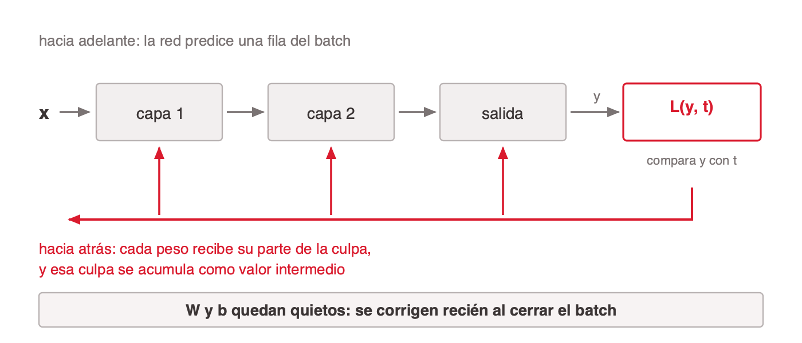
<!-- ascii-source:
   hacia adelante: la red predice UNA fila del batch

        entrada     capa 1     capa 2    salida
                      (o)        (o)
          (o)         (o)        (o)
   x --&gt;  (o)         (o)        (o)       (o) --&gt; y
          (o)         (o)        (o)                 |
                      (o)        (o)                 |  L(y, t)
                                                     v
          +<-------------------------------------------+
          |           ^          ^         ^
          |           |          |         |   la culpa vuelve por
          v           |          |         |   las mismas conexiones

   hacia atras: cada peso recibe su parte de la culpa,
                y esa culpa se ACUMULA como valor intermedio

   W y b quedan quietos: se corrigen al cerrar el batch
-->
<!-- ascii-note:
intent: mostrar el ciclo cerrado forward-backward de UNA fila sobre los nodos de la red, y que su resultado se acumula en vez de aplicarse
emphasize: que el error nace en la comparacion de y con t, viaja hacia atras por las mismas conexiones que uso el forward, y que W y b quedan intactos hasta el cierre del batch
labels: dibujar la red como capas de nodos redondos unidos todos con todos, no como cajas; entrada, capa 1, capa 2 y salida rotuladas arriba de cada capa; x entrada, y prediccion, t objetivo, L la loss; flechas hacia la derecha en el forward y un riel rojo por debajo que sube a cada capa en el backward; la linea final sobre W y b en tono de advertencia
-->

- **Propagación hacia adelante.** Empujar una fila a través de la red hasta obtener `y`. Es la misma cuenta que hace el modelo ya entrenado cuando predice.
- **Propagación hacia atrás.** Recorrer la red al revés calculando valores intermedios: cuánta culpa le toca a cada unidad y, a partir de eso, el gradiente de cada peso. Esos gradientes se **suman a un acumulador**; no se aplican.
- **La corrección, al cerrar el batch.** Cuando todas las filas del batch pasaron, se promedia el acumulador y ahí sí se corrigen `W` y `b`, una sola vez. Después arranca el batch siguiente con la red ya ajustada.
- **Lo que cambia y lo que no.** Cambian los pesos `W`, los sesgos `b` y las tablas de embedding. Los datos, la cantidad de capas y el learning rate quedan fijos: son hiperparámetros que elige quien entrena.

### Sources

knowledge-library/backpropagation/index.md (aportado por la Talk intro-redes-neuronales, capítulo 6 de su mazo)
corpus/chat.md.md (§1 Conceptos base: Qué cambia durante el entrenamiento)

### Speaker notes

Esta sección repite material que ya vieron en la clase de introducción, así que el tono es de repaso rápido, no de primera exposición. Preguntá al abrir quién se acuerda de qué hace el backward; según la respuesta, acelerá o frená.

El punto que ordena todo lo que sigue: la red no tiene ninguna forma de saber cuál era el valor correcto de un peso. Lo único que tiene es un número final que le dice cuánto se equivocó, y el algoritmo entero existe para repartir ese número hacia atrás.

Si alguien pregunta por qué el forward y el backward usan las mismas conexiones, la respuesta corta es que el backward recorre la misma cadena de operaciones al revés, aplicando derivadas en lugar de multiplicaciones.

---

## 4. El número que hay que derivar

### Content

Lo que hay que derivar es **la loss function**, y cuál es la fija la tarea. Tomemos un ejemplo: si la red predice el precio de una casa, la salida es una neurona lineal y la loss es el error cuadrático.

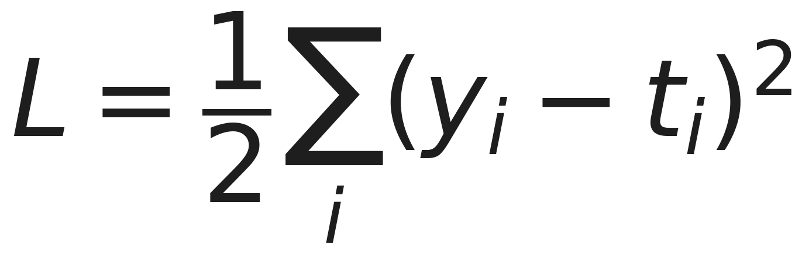

- **Qué recorre la `Σ`.** `y` es lo que la red predijo y `t` el objetivo. La suma es sobre las **unidades de salida de un ejemplo**, no sobre las filas del batch. Y acá la salida es **una sola neurona**, así que tiene un único término: `L = ½(y − t)²`. La `Σ` está por el caso general — N clases, N salidas — que es la notación con la que trabaja el resto de la sección.
- **Al cuadrado.** Los errores por exceso y por defecto dejan de cancelarse, y los grandes pesan más que los chicos. Es la misma propiedad que separaba MSE de MAE en la sección anterior.
- **El factor ½.** No mueve el mínimo. Está para que la derivada quede limpia: el 2 del exponente baja al derivar y se cancela contra él.
- **Diferenciable.** Es lo que permite calcular el gradiente y saber en qué dirección mover cada peso. Sin esta propiedad no hay algoritmo.

**El algoritmo no cambia con la loss.** Un sí o no llevaría BCE y una multiclase cross-entropy, y eso cambiaría **un solo factor** de todo lo que sigue. El resto del backward es idéntico para cualquier loss diferenciable.

### Sources

knowledge-library/backpropagation/index.md (aportado por la Talk intro-redes-neuronales) — imagen `s32`, la loss L2 y sus tres decisiones de diseño

### Speaker notes

Aclará el ½ apenas aparece, porque en la sección anterior MSE se escribió sin él y alguien lo va a notar. La respuesta: multiplicar la loss por una constante positiva no cambia dónde está el mínimo, solo escala el gradiente, y el ½ se elige para que la derivada quede sin coeficientes. En la práctica los frameworks promedian sobre el batch y el ½ no aparece.

Decí en voz alta que en este ejemplo la `Σ` tiene **un solo término**, apenas aparece la fórmula. El alumno ve una suma y busca sobre qué se suma; si no se lo aclarás, la lectura por defecto es "sobre los ejemplos", que es el error que hay que evitar. La fórmula lleva la `Σ` igual porque a partir de la regla de la cadena la sección trabaja con `yⱼ` y `tⱼ`, subíndice de unidad de salida, y conviene que la notación ya esté puesta.

Si alguien pregunta si esto es la loss o el `cost` — y es una pregunta razonable, porque una `Σ` con el índice suelto es exactamente como se escribe una suma sobre ejemplos — la respuesta es: es la **loss**, de un ejemplo. La suma es sobre las unidades de salida de esa fila. El `cost` es su promedio sobre el batch y aparece cuando se cierra el batch, más adelante en la sección.

Esta es la única diapositiva de la sección donde conviene detenerse en la fórmula misma. Las que siguen son derivaciones de esta.

El ejemplo del precio no es decorativo: es el mismo de la sección anterior y el del notebook, así que no hay que presentar nada nuevo. Decilo como una cadena de consecuencias, que es como se lee la tabla de la 5.1: predecimos un precio, entonces la salida es una neurona lineal, entonces la loss es el error cuadrático. Nadie eligió la loss a mano.

Si preguntan por qué se deriva sobre L2 si después van a usar cross-entropy, la respuesta es que el algoritmo no cambia: lo único que cambia es el primer factor de la cadena. La estructura del backward es la misma para cualquier loss diferenciable.

---

## 5. La regla de la cadena

### Content

La pregunta que hay que responder es concreta: **¿cuánto cambia el error si movemos un peso en particular?** El peso no toca el error directo. Lo hace a través de la suma ponderada, y esta a través de la activación.


### Sources

knowledge-library/backpropagation/index.md (aportado por la Talk intro-redes-neuronales) — imagen `s33`, la regla de la cadena descompuesta en tres factores. Se redibujó para esta Talk sumándole la definición de `a`, que en la original no estaba y quedaba solo en el texto

### Speaker notes

La metáfora que funciona: el peso influye en el error a través de una cadena de tres eslabones, y la regla de la cadena dice que el efecto total es el producto de los tres efectos parciales.

Recorré los tres factores de derecha a izquierda en la fórmula, que es el orden en el que se calculan. El tercero es el más fácil y conviene mostrarlo primero para bajar la ansiedad: es literalmente la entrada.

El segundo factor es el que va a importar en la sección 8: es la derivada de la activación. Si esa derivada se aplana, el producto entero se va a cero y el peso deja de aprender. Es la razón por la que ReLU le ganó a la sigmoide en las capas ocultas. Dejalo anunciado, todavía no vieron esa sección, y cuando lleguemos conviene volver a esta diapositiva.

Sobre la notación, por si alguien la marca: las `x` del dibujo son *lo que entra a la unidad*. Si `j` está en la primera capa son el dato; si hay capas antes, son las salidas de esas capas. Muchos textos les ponen otro nombre por eso, pero acá `a` ya está tomada por la suma ponderada, así que se dejó `x` con la aclaración al costado.

El dibujo está hecho **parado sobre una unidad de salida**, y eso conviene decirlo con esas palabras: elegís una unidad, elegís uno de sus pesos, y seguís el camino hasta el error. Su `y` toca la loss directo porque es de salida. Para una unidad oculta los tres factores son los mismos, pero el primero deja de ser directo, porque la loss depende de esa unidad a través de todas las de la capa siguiente. Eso es exactamente la diapositiva de propagar el delta hacia atrás, así que la pregunta es un buen puente si aparece.

El tercer factor, la derivada de la suma respecto de un peso, solo se entiende si tienen presente que `z` es una suma de productos: derivar `z` respecto de `wᵢⱼ` deja la `xᵢ` que lo acompañaba, y nada más. La fórmula de `z` no está escrita en el dibujo a propósito — ya se ve en el camino, donde las entradas llegan al nodo de la suma y sale `zⱼ` — así que decilo en voz alta señalando ese nodo.

---

## 6. La misma cadena, en movimiento

### Content

El dibujo anterior muestra el camino; este video muestra el **empujón viajando por él**. Se mueve `w` un poquito y se ve el efecto bajar por la cadena — a la suma, a la activación, al error — que es exactamente lo que calcula la fórmula de tres factores.


- **Lo que agrega sobre el dibujo.** La derivada deja de ser una fórmula y pasa a ser una pregunta física: si empujo esto tanto, ¿cuánto se mueve aquello? Cada barra que se desplaza es uno de los tres factores.
- **La notación es otra, y hay que avisarlo antes.** Él escribe `C₀` donde nosotros escribimos `L`, y `a⁽ᴸ⁾` donde nosotros escribimos `y`. Su `y` es el objetivo, que para nosotros es `t`. El superíndice `⁽ᴸ⁾` es el número de capa, no la loss.
- **Y un 2 en vez del ½.** Su coste no lleva el factor ½, así que al derivar le queda un 2 adelante. La cuenta es la misma.
- **Termina donde estamos.** El último cuadro es la regla de la cadena encuadrada, con los mismos tres factores y en el mismo orden.

Fuente: 3Blue1Brown, [*Backpropagation calculus · Deep Learning Chapter 4*](https://www.youtube.com/watch?v=tIeHLnjs5U8&t=333s)

### Sources

3Blue1Brown (Grant Sanderson), *Backpropagation calculus | Deep Learning Chapter 4* <https://www.youtube.com/watch?v=tIeHLnjs5U8&t=333s> — clip aportado por el presentador como `images/change_rule.webm` (67 s, recorte del capítulo)
La tabla de traducción de notación ya existía en las notas del orador de "Qué vale cada factor" de esta misma Talk; acá sube a pantalla, que es donde hace falta

### Speaker notes

Dos minutos, y va **después** del dibujo y no antes: el dibujo instala la estructura y el video le pone movimiento. Al revés es lindo y no se entiende.

Avisá la notación **antes** de darle play, no después. Es la advertencia más rentable de la sección: si un alumno mira el capítulo entero en casa sin ella, va a ver que `y` es el objetivo allá y la predicción acá, y va a concluir que uno de los dos está mal. Ninguno lo está.

La traducción completa, para tener a mano: su `C₀` es nuestra `L`; su `a⁽ᴸ⁾` es nuestra `y`; su `z⁽ᴸ⁾` es nuestra `z`; su `y` es nuestra `t`. El superíndice `⁽ᴸ⁾` es índice de capa. Y el 2 que aparece al derivar es porque su coste no lleva el ½ que sí lleva el nuestro.

El momento que hay que señalar con la mano es cuando se mueve la barra de `w` y las de abajo responden con distinta amplitud: esa diferencia de amplitud **es** la derivada. Si sale bien, es la diapositiva que hace que la sección entera cierre.

El clip es una captura de pantalla y en los últimos segundos asoma la barra del reproductor de YouTube. Si molesta, pausá antes de que termine.

Recomendá el capítulo completo como material de la clase: dura diez minutos y es la mejor explicación visual del tema que hay dando vueltas.

Si el tiempo aprieta, es de las primeras que se saltean — no agrega contenido nuevo, agrega intuición. Pero si la das, dala entera: cortar el video a la mitad es peor que no ponerlo.

---

## 7. Qué vale cada factor

### Content

La diapositiva anterior dijo **cuáles** son los tres factores. Esta dice **cuánto vale cada uno**, y los tres salen de cosas que ya están calculadas.

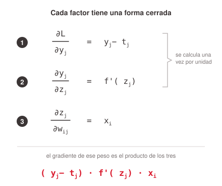

- **El error, si cambia la salida.** Con la loss cuadrática queda la diferencia limpia entre lo que la red predijo y lo que debía predecir: `yⱼ − tⱼ`. Es el único factor que se entera de qué loss elegiste.
- **La salida, si cambia la suma.** La derivada de la activación, evaluada en el valor que tomó esa unidad: `f'(zⱼ)`. Si esa derivada se aplana, el producto entero se va a cero.
- **La suma, si cambia el peso.** La entrada que multiplicaba a ese peso, nada más: `xᵢ`. El más simple de los tres, y conviene mostrarlo primero.
- **Los dos primeros se reusan.** ① y ② dependen de la unidad, no del peso: se calculan **una vez por unidad** y sirven para todos los pesos que llegan a ella. Una capa de 512 entradas por 256 neuronas tiene 131.072 pesos y se resuelve con 256 cuentas más una multiplicación por peso. Sin esa economía, entrenar millones de parámetros sería impracticable.

**El gradiente de un peso es un producto de tres números que ya tenés.** Ninguno obliga a recorrer la red de nuevo, y esa es toda la eficiencia de backpropagation.

### Sources

Deducción estándar de la regla de la cadena aplicada a la capa de salida; misma notación que el resto de la sección (`z` suma ponderada, `y` salida, `t` objetivo). No figura en el corpus.

### Speaker notes

Esta es la diapositiva que cierra la cuenta y conviene darla despacio, con los mismos números que la anterior: ①②③ son los mismos tramos del dibujo de la red.

Recorré de abajo hacia arriba, que es el orden de menor a mayor dificultad. El ③ es literalmente la entrada, y ahí baja la ansiedad. El ② es la derivada de la activación, y es el gancho para volver a la sección de activaciones ocultas: si `f` es una sigmoide saturada, ese factor es casi cero y el peso deja de aprender. El ① es el único que depende de qué loss elegiste, y por eso la diapositiva del número que hay que derivar decía que cambiar de loss cambia un solo factor.

Si alguien trae la versión de los videos de 3Blue1Brown, que usa `C₀`, `a⁽ᴸ⁾` y `y` para el objetivo, aclará la traducción: acá `L` es la loss y no el índice de capa, `y` es la predicción y `t` el objetivo, y lo que allá se llama `a` acá se llama `y`. La cuenta es la misma; el `2` que aparece allá es porque su coste no lleva el factor ½.

El remate es la última línea: tres números que ya están calculados. Nada de esto obliga a recorrer la red otra vez, y eso es exactamente lo que hace viable entrenar millones de parámetros.

---

## 8. Una capa más atrás

### Content

Hasta acá seguimos un peso que llega **directo** a la unidad de salida. ¿Y un peso del medio, que está dos unidades de distancia del error? La respuesta es la que hace viable todo el algoritmo: **no hay que rehacer nada**.

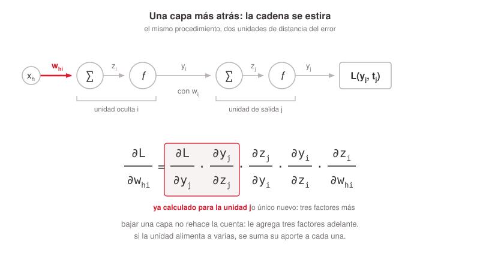


### Sources

Deducción estándar de la regla de la cadena sobre dos capas; misma notación que el resto de la sección. No figura en el corpus.

### Speaker notes

**Los cuatro puntos del dibujo, para decirlos en voz alta:**

- **La cadena se estira, no se rehace.** Bajar una capa agrega tres factores adelante de los que ya tenías. La cola de la cadena es idéntica.
- **Los tres nuevos son los mismos de siempre.** El peso que conecta las dos unidades (`∂zⱼ/∂yᵢ = wᵢⱼ`), la derivada de la activación de la unidad oculta (`f'(zᵢ)`) y la entrada que multiplicaba al peso (`xₕ`). No aparece ninguna idea nueva.
- **Por eso el orden es de atrás para adelante.** Si empezaras por la primera capa tendrías que recorrer toda la red por cada peso. Empezando por la salida, cada capa reusa lo que la siguiente ya dejó calculado.

- **Y si alimenta a varias, se suman.** Una unidad oculta casi nunca alimenta a una sola de la capa siguiente. Su culpa es la **suma** de lo que le devuelve cada una, ponderada por el peso que las conecta.

**Esa reutilización es backpropagation.** El mismo cálculo se repite capa por capa hasta la primera, y de ahí sale el nombre: el error se propaga hacia atrás. Lo que viaja son culpas, no pesos corregidos — `W` y `b` siguen intactos durante todo el recorrido.

Esta es la diapositiva que convierte la regla de la cadena en un algoritmo, y conviene darla con la mano sobre el dibujo.

Empezá por la pregunta y esperá la respuesta: si un peso está dos unidades más atrás, ¿hay que empezar la cuenta de cero? Mucha gente asume que sí, y ahí es donde el algoritmo parece caro.

Después mostrá el recuadro: esos dos factores son exactamente los mismos que en la diapositiva anterior, ya calculados para la unidad de salida. Lo único que se agrega son tres factores adelante, y los tres son cosas que ya saben leer.

El remate es el orden. Si recorrieras la red de adelante hacia atrás tendrías que rehacer la cola por cada peso; yendo de atrás para adelante, cada capa hereda el trabajo de la siguiente. Eso es literalmente de dónde sale el nombre del algoritmo, y es el puente directo a la diapositiva de propagar la culpa.

Si alguien trae la versión de 3Blue1Brown de esta misma fórmula, que la escribe con `C₀`, `a⁽ᴸ⁾` y superíndices de capa: es la misma cadena. Acá el nivel de capa se lee en los índices de las unidades (`h` entra a `i`, `i` entra a `j`) en vez de en un superíndice.

---

## 9. La tasa de aprendizaje η

### Content

Cerrado el batch y promediados los gradientes acumulados, corregir un peso es restarle una fracción de su gradiente: `W ← W − η · ∂L/∂W`. Cuánta es esa fracción lo fija la **tasa de aprendizaje `η`**, y es uno de los hiperparámetros más sensibles del entrenamiento.

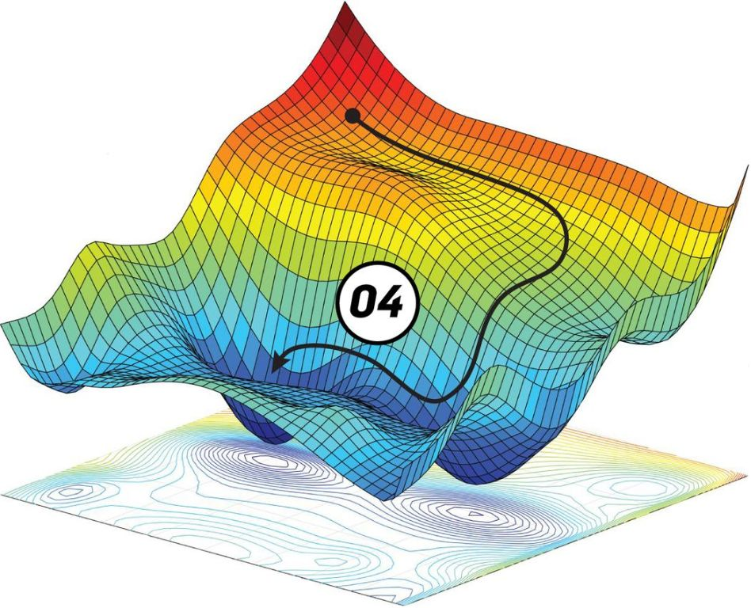

- **El ciclo por ejemplo** Entra un ejemplo, el modelo predice con los pesos que tiene, se compara con la respuesta correcta, se calcula la loss, se ajustan los pesos un poco en la dirección de −∇, y sigue el ejemplo siguiente.
- **La analogía que se sostiene** Estar en una montaña con niebla y querer llegar al valle. El camino completo no se ve; la pendiente bajo los pies, sí. Cada paso va un poco para abajo.

### Sources

- `AIG4B-Clase-2-LLM.md.md` (slide 21) — el ciclo iterativo en seis pasos, la dirección −∇ y la analogía de la montaña, verbatim.

### Speaker notes

La figura es la analogía dibujada, así que contá la montaña señalándola. Hay algo que la figura muestra y el deck original nunca menciona: la superficie tiene varios valles azules, o sea varios mínimos locales, y la trayectoria termina en uno cualquiera. Si alguien lo marca, la respuesta honesta es que sí, que el descenso por gradiente no garantiza el mínimo global, y que en redes grandes eso resulta ser menos grave de lo que suena. No lo abras vos si el tiempo aprieta. La figura casi no tiene texto: sólo un "04" heredado de la numeración del deck original. La viñeta decorativa de esta lámina se retiró.

---

## 5. El learning rate es el paso

### Content

**El learning rate decide cuánto se mueve cada peso en cada paso. Es un número que se elige antes de entrenar, y los dos extremos fallan de maneras distintas.**

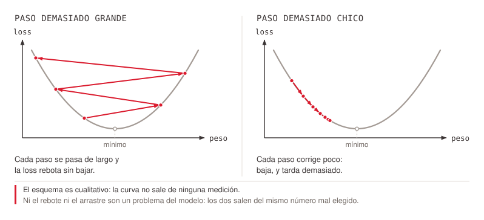
<!-- ascii-source:
  PASO DEMASIADO GRANDE                PASO DEMASIADO CHICO

   loss                                 loss
    ^                                    ^
    |  \                    /            |  \                   /
    |   \       o          /             |   \                 /
    |    \     / \    o   /              |    \  o            /
    |     \   /   \  / \ /               |     \  ooo        /
    |      \ /     \/   o                |      \____ooooo__/
    |       o                            |
    +---------------------&gt; peso         +--------------------&gt; peso

   Cada paso se pasa de largo y          Cada paso corrige poco.
   la loss rebota sin bajar.             Baja, y tarda demasiado.

  El esquema es cualitativo: la curva no sale de ninguna medicion.
  Ni el rebote ni el arrastre son un problema del modelo. Los dos
  salen del mismo numero mal elegido.
-->
<!-- ascii-note:
intent: mostrar que los dos modos de falla del entrenamiento vienen del mismo parámetro, contraponiendo la trayectoria que rebota con la que se arrastra sobre la misma curva de loss
emphasize: la trayectoria de la izquierda, que rebota de pared a pared sin bajar, frente a la de la derecha, que baja y se estanca; el pie que dice que la curva es cualitativa
labels: "PASO DEMASIADO GRANDE", "PASO DEMASIADO CHICO", "loss", "peso", "la loss rebota sin bajar", "baja, y tarda demasiado", "El esquema es cualitativo"
-->

- **El signo menos.** El gradiente apunta hacia donde el error crece, así que el paso va en la dirección opuesta.
- **`η` muy chico.** El entrenamiento avanza, pero tan despacio que puede volverse impracticable.
- **`η` muy grande.** Los pasos se pasan del mínimo y el error oscila o diverge.

### Sources

knowledge-library/backpropagation/index.md (aportado por la Talk intro-redes-neuronales) — imagen `s36`, el paso de actualización y el rol de la tasa de aprendizaje

Diagrama propio, traído de la Talk deep-learning-y-nlp (lámina 5.5 "El learning rate es el paso", retirada de allá el 2026-09-04 por duplicar esta sección) — las dos trayectorias de falla sobre la misma curva de loss.

### Speaker notes

La analogía de la pelota bajando por un valle ahora está dibujada, y son dos pelotas sobre la misma curva: la de la izquierda salta de una ladera a la otra sin bajar nunca, la de la derecha baja y se arrastra. Contala señalando, porque el remate es el diagnóstico y se lleva directo a la práctica: si la loss oscila, el paso es grande; si baja plana y no llega, es chico. Es el primer hiperparámetro que alguien toca cuando un entrenamiento no converge.

La curva es cualitativa y el propio dibujo lo declara al pie, porque una curva de loss trazada a mano se lee como medición si no se aclara. Los ejes están rotulados, loss contra peso, y ésa es la única lectura válida.

Conectá con la sección 2 de esta clase: el gradiente respecto de un peso es proporcional al valor de la entrada, y el learning rate es uno solo para toda la red. Si una variable va de 0 a 1.000.000 y otra de 0 a 1, sus gradientes viven en escalas distintas y un solo `η` no le sirve a las dos. Ese es el argumento formal de por qué se normaliza el input, y ahora tienen la fórmula delante.

Si preguntan por Adam, la respuesta corta: escala el paso por parámetro y absorbe parte del problema, pero no arregla la saturación ni una inicialización rota.

---

## 10. Batch y época no son lo mismo

### Content

Los pesos no se ajustan ejemplo por ejemplo ni una sola vez por dataset. El train se parte en **batches** de tamaño fijo, y cada batch produce **un** ajuste.

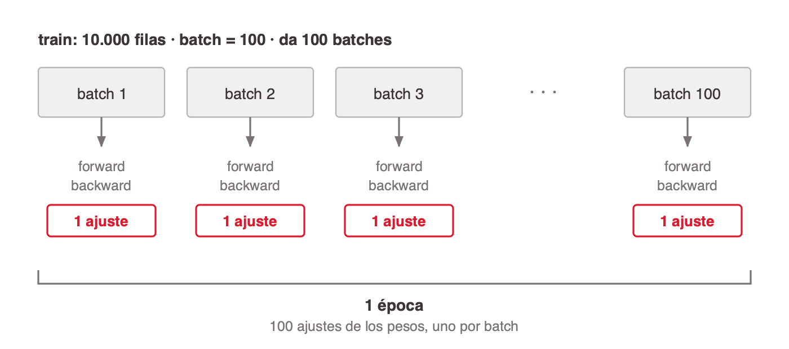
<!-- ascii-source:
   train: 10.000 filas,  batch = 100  ->  100 batches

   +---------+  +---------+  +---------+           +---------+
   | batch 1 |  | batch 2 |  | batch 3 |    ...    |batch 100|
   +---------+  +---------+  +---------+           +---------+
        |            |            |                     |
     forward      forward      forward               forward
     backward     backward     backward              backward
     1 ajuste     1 ajuste     1 ajuste              1 ajuste

   |<------------------------ 1 epoca ------------------------&gt;|
                     100 ajustes de los pesos
-->
<!-- ascii-note:
intent: separar visualmente el batch (una unidad de ajuste) de la epoca (una pasada completa por el train)
emphasize: que cada batch produce exactamente un ajuste y que la epoca es la suma de todos los batches
labels: 10.000 filas de train, batch de 100, 100 batches, 1 epoca, 1 ajuste por batch
-->

- **Batch.** Un subconjunto de filas del train que entra junto. Las `B` filas hacen el forward a la vez con los mismos pesos, se promedia su loss, y ese promedio es lo que se deriva.
- **Un ajuste por batch.** No uno por fila ni uno por dataset: exactamente uno cada vez que se cierra un batch. Con 10.000 filas y batch de 100 son 100 ajustes por vuelta.
- **Época.** Una pasada completa por todo el train, o sea por todos sus batches. Con 10.000 filas y batch de 100, una época son 100 ajustes de los pesos.

**El tamaño del batch es un hiperparámetro.** No se aprende: lo elige quien entrena, y cambia cuántos ajustes entran en cada época.

### Sources

corpus/chat.md.md (§1 Conceptos base: Pesos y bias — batches, input `(B,n)` a salida `(B,m)` con los mismos pesos para todas las filas; Qué cambia durante el entrenamiento — el batch size es hiperparámetro); §4 One-hot vs. embedding (gradiente ralo: solo se actualizan las filas presentes en el batch)
Keras, `Model.fit` — `batch_size`: "Number of samples per gradient update"; `epochs`: "An epoch is an iteration over the entire `x` and `y` data provided" <https://keras.io/api/models/model_training_apis/>
El ejemplo aritmético (10.000 filas / batch 100 = 100 batches por época) es construido para la clase y no figura en el corpus

### Speaker notes

Esta diapositiva es el pedido explícito de la clase y la confusión más frecuente del tema, así que no la apures. La pregunta de apertura que la ordena: si el dataset tiene 10.000 filas y entrenamos 10 épocas, ¿cuántas veces se tocaron los pesos? Casi siempre contestan 10, o 10.000. Con batch de 100 son 1.000.

Los tres números que conviene dejar en el pizarrón: filas del train, tamaño del batch, ajustes por época. El tercero sale de dividir los dos primeros.

Si preguntan por qué no ajustar fila por fila, la respuesta tiene dos mitades: el gradiente de una sola fila es ruidoso y el promedio del batch lo estabiliza, y procesar 100 filas a la vez aprovecha la GPU mucho mejor que 100 pasadas sueltas.

Dato que conecta con la sección 2, por si hay tiempo: en una tabla de embeddings el gradiente es ralo, solo se actualizan las filas de las categorías que aparecieron en el batch. Un barrio que aparece tres veces en todo el train recibe tres actualizaciones y queda casi como se inicializó.

---

## 11. El ciclo completo, batch a batch

### Content

Todo junto, y con el reloj a la vista: **dentro del batch se acumula, al cerrar el batch se aplica.** Por eso el batch size no cambia solo la velocidad — cambia cuántos ajustes entran en cada vuelta y cuánto ruido arrastra cada uno.

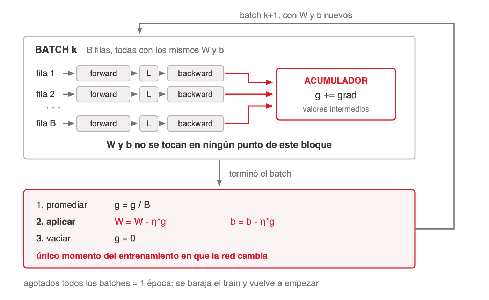
<!-- ascii-source:
    .------------------------------------------------------------------.
                                                                      |
    v                                                                 |
    +--------------------------------------------------------------+  |
    |                                                              |  |
    |  BATCH k        B filas, todas con los MISMOS W y b          |  |
    |                                                              |  |
    |   fila 1  -> forward -> L -> backward --.                    |  |
    |   fila 2  -> forward -> L -> backward --+--&gt; g += grad       |  |
    |    ...                                  |                    |  |
    |   fila B  -> forward -> L -> backward --'    ACUMULADOR      |  |
    |                                              (valores        |  |
    |                                               intermedios)   |  |
    |  W y b NO se tocan en ningun punto de este bloque            |  |
    |                                                              |  |
    +--------------------------------------------------------------+  |
                              |                                       |
                      termino el batch                                |
                              |                                       |
                              v                                       |
    +--------------------------------------------------------------+  |
    |                                                              |  |
    |  1. promediar    g <- g / B                                  |  |
    |  2. APLICAR      W <- W - n*g       b <- b - n*g             |  |
    |  3. vaciar       g <- 0                                      |  |
    |                                                              |  |
    |  unico momento del entrenamiento en que la red cambia        |  |
    |                                                              |  |
    +--------------------------------------------------------------+  |
                              |                                       |
                              '--- batch k+1, con W y b nuevos -------'

    agotados todos los batches = 1 epoca -> se baraja y vuelve a empezar
-->
<!-- ascii-note:
intent: mostrar el ciclo de vida completo de un batch, con el limite exacto entre acumular y aplicar
emphasize: el bloque de arriba (donde W y b quedan intactos) contra el bloque de abajo (el unico donde cambian), y la flecha de retorno que cierra el ciclo hacia el batch siguiente
labels: BATCH k, filas 1 a B, forward, L la loss, backward, g el acumulador de gradientes, n es la tasa de aprendizaje, 1 epoca cuando se agotan los batches; el bloque de arriba en tono neutro y el de abajo destacado
-->


### Sources

Keras, `Model.fit` — `batch_size`: "Number of samples per gradient update" <https://keras.io/api/models/model_training_apis/>
Keras, *Writing a training loop from scratch* — el bucle abierto a mano: gradient tape, `tape.gradient` y `optimizer.apply_gradients` <https://keras.io/guides/writing_a_training_loop_from_scratch/>
Stanford CS231n, *Optimization* — "the gradient from a mini-batch is a good approximation of the gradient of the full objective" <https://cs231n.github.io/optimization-1/>
corpus/chat.md.md (§1 Conceptos base: Pesos y bias — las B filas pasan con los mismos pesos)

### Speaker notes

Es la diapositiva de síntesis de la sección: si el tiempo aprieta, esta se da igual y se recortan las fórmulas del medio. Dala señalando con la mano el límite entre los dos bloques: arriba no pasa nada en la red, abajo pasa todo. "Acumular arriba, aplicar abajo", repetido hasta que sea aburrido.

En Keras las tres líneas del bloque de abajo están adentro de `model.fit` y no se ven. Para el que ya programó, donde la diapositiva hace clic es en el bucle abierto a mano: se abre un *gradient tape* que va grabando las operaciones del forward, eso es acumular; `tape.gradient(loss, model.trainable_weights)` cierra la cuenta y devuelve el gradiente; `optimizer.apply_gradients(...)` lo aplica. No hay un cuarto paso de vaciar, porque cada tape arranca limpio y se descarta al cerrar el batch: eso que acá sale gratis, en otros frameworks hay que hacerlo a mano, y olvidarse degrada el entrenamiento sin tirar ningún error.

Una precisión que un alumno que programó va a marcar, y conviene decirla vos primero: el desglose fila por fila del dibujo es la descomposición matemática, no el código. el gradiente se calcula **una vez por batch** y la suma sobre las `B` filas ocurre vectorizada adentro. El resultado es idéntico, porque el gradiente del batch es el promedio de los gradientes por fila; el dibujo abre esa cuenta para que se vea de dónde sale.

Sobre barajar entre épocas: se hace para que los batches no sean siempre los mismos grupos de filas.

Una precisión que conviene decir vos primero, porque en el dibujo `g` parece un solo número: **el acumulador tiene la misma forma que `W`**. Hay un casillero por peso, y lo que se suma ahí es el gradiente de ese peso en particular, `gᵢⱼ += ∂L/∂wᵢⱼ`. Lo mismo para cada bias, en su propio casillero. Promediar, aplicar y vaciar son las tres operaciones hechas casillero por casillero, no sobre un escalar.

---

## 12. La función objetivo

### Content

Lo que el optimizador minimiza no es la loss: es la **función objetivo** `J`, que suma dos términos — el `cost`, que ya conocen, más una penalización por complejidad.

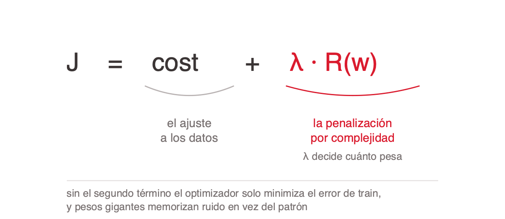
<!-- ascii-source:
   J   =   cost   +   λ · R(w)
          \______/    \_________/
          el ajuste   la penalización
          a los datos por complejidad

   λ decide cuánto pesa la penalización

sin el segundo término el optimizador solo minimiza el error de train,
y pesos gigantes memorizan ruido en vez del patrón
-->
<!-- ascii-note:
intent: descomponer el objetivo en el término de ajuste y el término de regularización, y mostrar que lambda decide el balance entre los dos
emphasize: el término lambda por R(w), que es lo que la diapositiva agrega; el resto queda en gris
labels: J objetivo, cost ajuste a los datos, lambda por R(w) penalización por complejidad, remate al pie
-->

Sin regularización el optimizador solo busca minimizar el error en train, y el camino más corto para eso pueden ser pesos gigantes que memorizan ruido en vez de aprender el patrón. El término extra lo obliga a balancear ajustar bien los datos contra mantener el modelo simple. Las tres primeras opciones de abajo son formas distintas de escribir `R(w)`; la cuarta regulariza sin entrar en la fórmula.

- **L2** — Ridge, o *weight decay*: suma `λ Σ w²`. Su gradiente es `2λw`, así que el paso de la diapositiva 9 le resta a cada peso una fracción de sí mismo: eso es literalmente el *decay* del nombre. Achica todos y ninguno llega a cero. Es el default.
- **L1** — Lasso: suma `λ Σ |w|`. Su gradiente es `λ·signo(w)`, un empujón del mismo tamaño sin importar cuán chico sea el peso — por eso llega a clavarlos en cero, y de ahí la selección de variables (*sparsity*).
- **Elastic Net** — combina L1 y L2. Un poco de cada uno, para cuando ni la selección dura de L1 ni el achique parejo de L2 alcanzan solos.
- **Dropout — el que queda afuera de `J`** — no suma ningún término a la fórmula ni toca el gradiente: apaga neuronas al azar en cada forward del entrenamiento, así la red no puede depender de ninguna en particular. Regulariza rompiendo la coadaptación entre neuronas, no penalizando pesos. Solo actúa entrenando; en inferencia está apagado.

**El término entra al gradiente como cualquier otra parte de `J`.** Por eso en **cada paso de actualización** empuja los pesos hacia cero, además de hacia el mínimo del error — y por eso la diapositiva va acá y no en la sección de la loss: hasta que el gradiente y el paso no estuvieron sobre la mesa, no había con qué explicarlo.

### Sources

corpus/chat.md.md (§10 Regularización: qué problema resuelve; L2 weight decay); pedido del docente (2026-08-25, reubicada 2026-08-26)

### Speaker notes

Esta diapositiva está acá y no en la sección de la loss por una razón que conviene decirles: un término de regularización **se define** en el cost pero **actúa** en el paso de actualización. Hasta la 6.9 no había con qué explicarlo; ahora sí, y la frase que lo cierra es que el gradiente del término es un empujón hacia cero que se aplica en cada paso, al mismo tiempo que el empujón hacia menos error.

Cierra además el vocabulario que abrió la 5.2, donde quedó dicho que el `objective` es el cost más los términos de regularización. Acá aparece por primera vez con símbolo, `J`, y conviene escribirlo en el pizarrón: hasta ahora en la sección 6 vieron `L`, que es otra cosa. Una precisión por si la preguntan: cuando no hay regularización, `J` es exactamente el cost — el segundo término no siempre está.

El orden de la explicación importa más que las fórmulas: primero el problema (minimizar solo el error de train premia memorizar), después el mecanismo (un costo extra por complejidad), y recién ahí los nombres. Al revés no se entiende por qué existen.

Sobre `λ`: es el hiperparámetro que decide el balance, típicamente entre 1e-5 y 1e-2. En Keras se declara por capa, `layers.Dense(64, kernel_regularizer=regularizers.l2(1e-4))`. Un `λ` demasiado grande hace underfitting, y ese es el error de aplicación más común. Encaja con el orden de perillas de la diapositiva que sigue: `λ` es una perilla más, y no la primera.

Dropout es el que más preguntas trae porque no entra en la fórmula. La respuesta corta es que regulariza de otra manera, rompiendo la coadaptación entre neuronas, y que solo actúa en entrenamiento: en inferencia está apagado.

Si preguntan cómo se sabe que hace falta regularizar, la respuesta es la brecha entre train y validación — y es exactamente la fila que van a ver en la diapositiva siguiente, "train baja y validación sube". Conviene anunciarlo así, porque es el único renglón de ese checklist cuya acción no se explica en la sección. Ahora sí. Y sé honesto en que el diagnóstico completo de overfitting no lo cubrimos por tiempo.

---

## 13. Qué mirar cuando esto se entrena

### Content

En la práctica nadie mira las fórmulas: se mira la curva de loss y se toca alguna perilla. Este es el mapa de síntoma, causa y qué tocar.

| Lo que ves | Qué suele ser | Qué tocar |
|---|---|---|
| La loss no baja desde el arranque | `η` demasiado chico, o el gradiente se desvanece antes de llegar a las primeras capas | Subir `η` ×10; ReLU en las ocultas en vez de sigmoide; revisar la inicialización |
| La loss oscila fuerte, o se va a `NaN` | `η` demasiado grande, o el gradiente explota | Bajar `η` ÷10; recortar el gradiente con `clipnorm` o `global_clipnorm` |
| La loss baja pero con mucho ruido | Batch chico: el promedio sale de pocas filas y el gradiente es ruidoso | Subir el batch size |
| Train baja y validación sube | Overfitting, no un problema de gradiente | Sección 9 |
| Una variable domina el ajuste | Codificación de la entrada, no el gradiente | Sección 2 |

- **Las perillas, en orden de impacto.** `η` primero y por lejos. Después el batch size. Después activación e inicialización. Último, cuántas capas y cuántas neuronas, que es lo que todos tocan primero.
- **Una perilla por vez.** Si se mueven dos y el resultado mejora, no se sabe cuál fue.

### Sources

Pascanu, Mikolov & Bengio (2013), *On the difficulty of training Recurrent Neural Networks* — "There are two widely known issues with properly training Recurrent Neural Networks, the vanishing and the exploding gradient problems"; proponen "a gradient norm clipping strategy to deal with exploding gradients and a soft constraint for the vanishing gradients problem" <https://arxiv.org/abs/1211.5063>
Keras, `Adam` y argumentos base del optimizador — `learning_rate` "Defaults to `0.001`"; `clipnorm`: "If set, the gradient of each weight is individually clipped so that its norm is no higher than this value"; `global_clipnorm`: "If set, the gradient of all weights is clipped so that their global norm is no higher than this value" <https://keras.io/api/optimizers/adam/>
Stanford CS231n, *Backpropagation* — el backward "starts at the end and recursively applies the chain rule to compute the gradients all the way to the inputs of the circuit" <https://cs231n.github.io/optimization-2/>
knowledge-library/backpropagation/index.md (aportado por la Talk intro-redes-neuronales) — η muy chico y η muy grande; la derivada de la sigmoide que se aplana en los extremos
La tabla de síntoma, causa y perilla es construida para la clase; no figura en el corpus

### Speaker notes

**Los dos modos de falla del gradiente, para decirlos en voz alta** (salieron de la diapositiva porque la tabla ya los nombra):

- **El gradiente que se desvanece.** Cada capa hacia atrás multiplica por la derivada de su activación. Si esa derivada es chica, el producto se achica capa tras capa y las primeras dejan de recibir señal. Es el argumento formal de por qué ReLU desplazó a la sigmoide en capas ocultas.

Esta es la diapositiva que los alumnos van a fotografiar, y la que más rinde en la práctica de laboratorio. Dala como checklist, no como teoría.

El orden de las perillas es el mensaje principal y es contraintuitivo: el reflejo de todo el mundo es agregar capas, y es lo último de la lista. `η` es la primera y la que más mueve la aguja. Conectá con la diapositiva 5 de la sección 1, donde ya dijimos que la cantidad de capas es lo que menos pesa; esta lo confirma desde el otro lado.

Las dos filas de `NaN` y de loss estancada son las que van a ver de verdad en la práctica. Si tenés tiempo, provocá una en vivo subiendo `η` a 10 y mostrá el `NaN`.

El gradiente que se desvanece es el segundo factor de la regla de la cadena, multiplicado capa tras capa: aquel factor chiquito, elevado a la cantidad de capas. Decilo explícito. Y dejalo anunciado hacia adelante: las activaciones ocultas son la sección 8, y ahí se cierra el círculo con por qué ReLU desplazó a la sigmoide.

Las dos bandas que antes explicaban el gradiente que se desvanece y el que explota se sacaron de la diapositiva porque la tabla ya los nombra en la columna del medio. Decilos vos: **el que se desvanece** es que cada capa hacia atrás multiplica por la derivada de su activación, y si es chica el producto se achica capa tras capa hasta que las primeras dejan de recibir señal. **El que explota** es el simétrico: el producto crece y el paso se dispara; se ataca recortando la norma del gradiente antes de aplicarlo.

# 7. Medir un clasificador

**Goal of this section:** El modelo ya está diseñado y entrenado; ahora, ¿anda? La sección va en cadena y trabaja sobre dos clases de punta a punta: accuracy engaña, la matriz de confusión separa los cuatro tipos de resultado, de ahí salen precisión, recall y F1, con eso ya definido tres quiz obligan a elegir cuál duele en tres casos reales, y el umbral cierra mostrando que la elección es una perilla y no un destino. El caso multiclase queda como una nota al final. Nota: este tema no está en el corpus; el contenido viene del conocimiento del área (ver Open questions).

---

## 1. El 99% de accuracy que no sirve

### Content

**Accuracy** es la fracción de predicciones correctas sobre el total.

```
              predicciones correctas
Accuracy  =  ------------------------
                total de casos
```

Un detector de fraude sobre 10.000 transacciones, donde 100 son fraude y 9.900 legítimas. La regla más tonta posible: decir siempre "no es fraude".

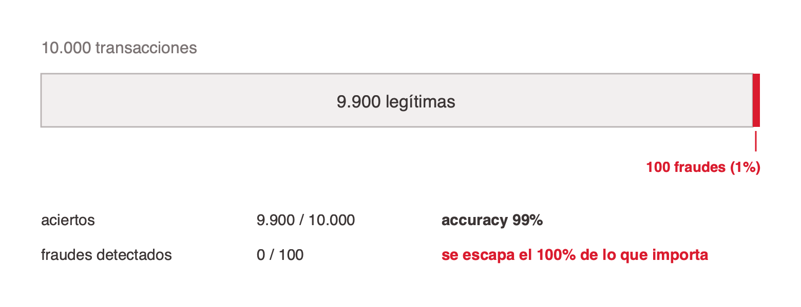
<!-- ascii-source:
  10.000 transacciones
  +-------------------------------------------------+---+
  |             9.900 legitimas                     |100|
  +-------------------------------------------------+---+
                                                      ^
                            el modelo dice "no es fraude" a todo

    aciertos           9.900 / 10.000  =  accuracy 99%
    fraudes detectados     0 / 100     =  se escapa el 100% de lo que importa
-->
<!-- ascii-note:
intent: mostrar que el 99% de accuracy sale de la clase mayoritaria y que la clase que importa se pierde entera
emphasize: el contraste entre la barra enorme de legitimas y el bloque chico de fraudes; los dos numeros de abajo
labels: 9.900 legitimas, 100 fraudes, accuracy 99%, fraudes detectados 0
-->

- **Accuracy la escribe la clase mayoritaria.** Con clases desbalanceadas el número lo pone la clase grande, y el error que importa queda escondido adentro.
- **No todos los errores cuestan lo mismo.** Dejar pasar un fraude y molestar a un cliente legítimo con una alerta son errores distintos, con costos distintos. Accuracy los suma como si fueran iguales.
- **Hace falta separar los tipos de error,** no un solo número. Ahí entra la matriz de confusión.

### Sources

Conocimiento del área (no cubierto por el corpus). Ejemplo del detector de fraude, ilustrativo.

### Speaker notes

Arranque con gancho concreto: el clasificador que dice siempre "no". Es la mejor forma de que se les caiga la ficha de que accuracy sola no alcanza. Escribí la fórmula en el pizarrón antes de mostrar el diagrama y hacé la cuenta con ellos: 9.900 sobre 10.000. El golpe llega cuando pasás al segundo número, 0 sobre 100. Los números son ilustrativos, no un dato de una fuente; dejalo claro si alguien pregunta. Este es el puente desde la salida (sección 4, clasificación con sigmoide) hacia cómo se evalúa esa clasificación.

---

## 2. La matriz de confusión

### Content

Para clasificación binaria, todos los resultados caen en una tabla de 2×2 que cruza lo que el modelo predijo con lo que era verdad.


<!-- ascii-source:
                        REALIDAD
                  Positivo      Negativo
              +-------------+-------------+
   PREDICHO   |     TP      |     FP      |   Positivo
              | (acierto)   | (falsa      |
              |             |  alarma)    |
              +-------------+-------------+
              |     FN      |     TN      |   Negativo
              | (se escapó) |  (acierto)  |
              +-------------+-------------+
-->
<!-- ascii-note:
intent: la matriz de confusión 2x2 cruzando predicción y realidad
emphasize: las dos celdas de error FP y FN
labels: TP verdadero positivo, FP falso positivo, FN falso negativo, TN verdadero negativo
-->

- **TP (verdadero positivo):** era positivo y el modelo lo marcó. Acierto.
- **FP (falso positivo):** era negativo y el modelo lo marcó. Falsa alarma.
- **FN (falso negativo):** era positivo y el modelo lo dejó pasar. Lo más caro en fraude o diagnóstico médico.
- **TN (verdadero negativo):** era negativo y el modelo lo dejó pasar. Acierto.

### Sources

Conocimiento del área (no cubierto por el corpus).

### Speaker notes

El centro de la sección. Dibujá la matriz en el pizarrón mientras aparece en la diapositiva y pedí que ubiquen el ejemplo del fraude en cada celda. La confusión típica del alumno es FP vs FN; anclalo con el costo: en un test médico, un FN (mandar a casa a alguien enfermo) suele ser mucho peor que un FP (un estudio de más). Que se lleven que la matriz es la foto completa y accuracy es solo la diagonal sobre el total.

---

## 3. Precision, recall y F1

### Content

De las cuatro celdas salen las métricas que de verdad describen a un clasificador.

**Precisión.** De todo lo que el modelo marcó, ¿cuánto era de verdad?

- Fórmula: `TP / (TP + FP)`. Sube cuando el modelo molesta poco con falsas alarmas.
- **Importa cuando** el falso positivo es caro: mandar a spam un mail importante.

**Recall.** De todo lo que había, ¿cuánto encontró?

- Fórmula: `TP / (TP + FN)`. Sube cuando se escapan pocos.
- **Importa cuando** el falso negativo es caro: no detectar una enfermedad o un fraude.

**F1.** ¿Y si las dos importan parecido?

- Fórmula: `2 · (P · R) / (P + R)`, la media armónica. La manda el número más chico: con precisión 0.9 y recall 0.5 el promedio da 0.70 y F1 da 0.64; con recall 0, F1 da 0.
- **Importa cuando** ninguna de las dos alcanza sola, como el caso de churn del quiz.

**Nota:** precisión y recall están en tensión. Subir una suele bajar la otra, y qué priorizar lo decide el costo del error, no la matemática.

### Sources

Conocimiento del área (no cubierto por el corpus).

### Speaker notes

Insistí en la intuición antes que en la fórmula. Precision responde "cuando dice que sí, ¿le creo?"; recall responde "de todos los que eran, ¿cuántos encontró?". El truco mnemotécnico: precisión mira la columna de predichos positivos, recall mira la fila de reales positivos. Si preguntan por qué media armónica y no promedio: el promedio deja que un 1.0 tape un 0.0, y un clasificador que marca todo tiene recall 1.0 con precision pésima. La armónica no lo permite, porque tiende al más chico de los dos. Hacé la cuenta de 0.9 y 0.5 en el pizarrón, son diez segundos y se entiende de una. F1 es útil pero peligroso si se reporta solo; siempre conviene mirar las dos. Si dan tiempo, escribí accuracy = (TP+TN)/total: es la misma fórmula de la 5.1, ahora con los cuatro términos ya definidos, y cierra el círculo de la sección.

---

## 4. Quiz 1: el filtro de spam

### Content

Un filtro de spam. Bloquear un mail legítimo es peor que dejar pasar uno dudoso: el usuario perdona ver basura en la bandeja, no perdona perder una factura.

**¿Qué métrica priorizás?**

1. Precisión
2. Recall

**Respuesta: precisión.** El error caro es el falso positivo, marcar como spam algo que no lo era. Priorizar precisión significa que el filtro solo bloquea cuando está seguro, a costa de dejar pasar algo de spam.

<!-- template: quiz -->

### Sources

Conocimiento del área (no cubierto por el corpus). Caso ilustrativo.

### Speaker notes

El primero de los tres, y el más fácil. Pedí voto a mano alzada antes de revelar. Si alguien contesta recall, la pregunta que lo desarma: ¿qué preferís, ver tres spams por día o perder un mail de tu jefe?

---

## 5. Quiz 2: el test de una enfermedad grave

### Content

Un test para detectar una enfermedad grave y tratable. Dejar ir a una persona enferma es peor que pedirle estudios extra a una sana.

**¿Qué métrica priorizás?**

1. Precisión
2. Recall

**Respuesta: recall.** El error caro es el falso negativo, no detectar a quien sí estaba enfermo. Priorizar recall significa que el test marca ante la duda, a costa de mandar a estudios a gente sana.

<!-- template: quiz -->

### Sources

Conocimiento del área (no cubierto por el corpus). Caso ilustrativo.

### Speaker notes

El espejo del anterior, y el contraste es el punto: mismo modelo, misma matemática, decisión opuesta. Lo que cambió no es técnico, es cuánto cuesta cada error. Acá es donde conviene decir en voz alta que la métrica la elige el negocio, no el modelo.

---

## 6. Quiz 3: el modelo de churn

### Content

Un modelo que marca quién se va a dar de baja, y a cada marcado se le ofrece un descuento. Un descuento regalado a alguien que no se iba cuesta plata; un cliente que se va sin oferta también.

**¿Qué métrica priorizás?**

1. Precisión
2. Recall
3. F1

**Respuesta: F1.** Los dos errores cuestan parecido, así que optimizar una sola métrica deja la otra libre. F1 es el número que las mantiene atadas, y por eso es el caso donde sirve como número único.

<!-- template: quiz -->

### Sources

Conocimiento del área (no cubierto por el corpus). Caso ilustrativo.

### Speaker notes

El que cierra la secuencia y el que justifica F1. Los dos anteriores tenían un error claramente más caro; este no, y ahí es donde una sola métrica deja de alcanzar. Un cuarto caso para tirar en voz alta si sobra tiempo, sin diapositiva: una alerta de fraude donde el equipo puede revisar pocas alertas pero cada fraude no detectado cuesta caro. No tiene respuesta única, depende de la capacidad de revisión y del costo del fraude, y por eso funciona mejor como discusión abierta que como quiz.

---

## 7. El umbral, una perilla de negocio

### Content

Un clasificador binario no devuelve "sí" o "no", devuelve una probabilidad. El **umbral** es el número que la convierte en decisión.


<!-- ascii-source:
        probabilidad que devuelve el modelo
   0.0 ----------------------------------------------- 1.0
              |                  |                |
           umbral 0.2        umbral 0.5       umbral 0.8

           marca mucho        el default       marca poco
           recall  alto                        recall  bajo
           precision baja                      precision alta
-->
<!-- ascii-note:
intent: mostrar que mover el umbral sobre el eje de probabilidad intercambia recall por precision
emphasize: el eje 0.0 a 1.0 y las tres posiciones del umbral; el cruce de recall y precision entre los extremos
labels: probabilidad 0.0 a 1.0, umbral 0.2 / 0.5 / 0.8, recall, precision
-->

- **El umbral es una perilla de negocio.** Se mueve según cuál de los dos errores duele más. Dejarlo en 0.5 también es una decisión, no un default neutro.
- **La curva precision-recall** muestra ese intercambio para todos los umbrales de una vez, y sirve para comparar dos modelos sin fijar ninguno.

**Nota:** toda esta sección trabaja sobre dos clases. Con más de dos, la matriz crece a una fila por clase real y una columna por clase predicha, y precisión y recall se calculan por clase y se promedian. La idea es la misma.

### Sources

Conocimiento del área (no cubierto por el corpus).

### Speaker notes

El umbral es lo que más cuesta que entiendan y lo más útil en la práctica. Recorré el diagrama con el dedo, de izquierda a derecha, y que ellos digan qué pasa con cada métrica antes de que lo leas. Ejemplo para anclar: un modelo de fraude con recall bajo en 0.5 pasa a recall alto bajando el umbral a 0.2, a costa de más falsas alarmas que el equipo antifraude tendrá que revisar. Ahí se ve que es una decisión de operación y no de modelado. La nota del final va al pasar, en diez segundos: toda la sección es binaria a propósito, y con más clases la idea no cambia. Si alguien pregunta, el ejemplo concreto es un clasificador de diez dígitos que confunde el 4 con el 9 y nunca el 4 con el 0; eso se ve en la celda de la matriz y jamás en la accuracy. No lo desarrolles salvo que lo pidan. Si el tiempo aprieta, esta diapositiva se puede dar solo con el diagrama.

---

# 8. Capas ocultas

**Goal of this section:** La única parte de la arquitectura que se elige libremente, y la que menos pesa de las seis decisiones. Cuántas capas, cuánto ancho, qué activación y cómo arrancan los pesos. La sección da recetas de punto de partida y, sobre todo, el procedimiento para corregirlas mirando el error, en vez de adivinar. Cierra el recorrido de diseño justo antes de que el overfitting muestre qué pasa cuando sobra capacidad.

---

## 1. Cuántas capas y cuánto ancho

### Content

Es la única decisión de la lista que se elige libremente, y la que menos impacto tiene. Conviene resolverla rápido con un punto de partida y corregir después mirando el error.

| Cuántos datos tenés | Punto de partida |
|---|---|
| Cientos de filas | 1 capa de 8 a 16 neuronas |
| Miles | 1 o 2 capas de 32 a 64 |
| Decenas de miles | 2 o 3 capas de 64 a 128 |

- **Más ancho que la entrada.** La primera capa oculta no debería ser más angosta que el vector de entrada, para no crear un cuello de botella que tire información antes de empezar.
- **Potencia de 2 y decreciente.** 128, 64, 32 hacia la salida. La potencia de 2 es alineación de memoria; lo decreciente es que la red va comprimiendo hacia la respuesta.
- **Lo que manda es la cantidad de datos.** La relación que importa es parámetros contra filas de entrenamiento, no parámetros contra features.
- **El procedimiento, no la fórmula.** Empezar chico y mirar el error de **train**: si es alto, falta capacidad y hay que agrandar; si el train está bien y la validación mal, sobra capacidad y hay que achicar o regularizar.

**1 a 3 capas ocultas alcanzan para datos tabulares.** Si necesitás más profundidad que eso en una tabla, el problema casi nunca es la arquitectura.

### Sources

corpus/chat.md.md (§ Arquitectura: cantidad de capas 1–3 para tabular, ancho en potencias de 2 decreciente; ancho de las capas ocultas — más ancho que la entrada, alineación de memoria, decreciente; datos y punto de partida — cientos / miles / decenas de miles; el procedimiento de empezar chico y mirar el error de train; la relación parámetros contra cantidad de datos)

### Speaker notes

Esta es la diapositiva que la clase espera desde el principio y la que hay que desinflar. Recordales la primera diapositiva de la sección 1: de las seis decisiones, esta es la última en impacto, y llegaron hasta acá sin haberla necesitado.

Lo que se llevan no es la tabla, es el procedimiento de las dos últimas líneas. La tabla es un punto de partida para no quedarse trabado; el error de train dice si hay que agrandar y la brecha con validación dice si hay que achicar. Es un lazo, no una fórmula cerrada.

Si preguntan por qué potencias de 2, la respuesta honesta es alineación de memoria en la GPU, y que la diferencia entre 60 y 64 neuronas no se va a notar en un dataset tabular. No lo vendas como si fuera profundo.

El cuello de botella es el error que más van a cometer: poner una primera capa de 8 neuronas después de un one-hot de 40 posiciones. La información se pierde ahí y ninguna capa posterior la recupera.

Y si alguien pregunta por el teorema de aproximación universal para justificar una sola capa muy ancha: es cierto y es inútil en la práctica, porque el teorema no dice cuántas neuronas hacen falta ni que el entrenamiento las vaya a encontrar.

---

## 2. Las activaciones ocultas, y cómo se ven

### Content

Una **activación oculta** es la función no lineal `f` que se aplica después de `z = W·x + b` en las capas del medio. Su trabajo no es acotar el resultado a un rango con sentido, como en la salida, sino **romper la linealidad** para que apilar capas sirva de algo. Son cuatro candidatas y una gana casi siempre.

| Función | Fórmula | Rango | Cuándo |
|---|---|---|---|
| ReLU | `max(0, z)` | [0, ∞) | El default de las capas ocultas |
| GELU / SiLU | suavizaciones de ReLU | (−0.3, ∞) aprox. | Transformers |
| Tanh | `(eᶻ − e⁻ᶻ) / (eᶻ + e⁻ᶻ)` | (−1, 1) | Redes recurrentes, salidas centradas |
| Sigmoide | `1 / (1 + e⁻ᶻ)` | (0, 1) | Casi nunca en capas ocultas |


<!-- ascii-source:
     ReLU  max(0,z)          GELU / SiLU            Tanh  (-1,1)         Sigmoide  (0,1)
        |        /              |        /             |    _______         |    _______
        |       /               |       /            1 |   /              1 |   /
    ----+------/----        ----+---.--/----       ----+--/-------      ----+--/-------
        |     /                 |  \_/               0 | /              0.5 | /
        |____/                  |__/                -1 |/                 0 |/

    plana y despues        igual pero suave       acotada y            acotada, nunca
    recta. barata          en el cero             centrada en 0        negativa
-->
<!-- ascii-note:
intent: mostrar la forma de las cuatro activaciones ocultas una al lado de la otra, para compararlas de un vistazo
emphasize: el codo de ReLU en el cero, que es lo que la distingue; la saturación de tanh y sigmoide en los extremos
labels: ReLU, GELU/SiLU, Tanh, Sigmoide; eje horizontal z, eje vertical f(z)
-->

**Nota:** la sigmoide y la tanh saturan. El **gradiente** es la derivada del error respecto de un peso: dice cuánto cambia el error si movés ese peso, y es lo único que el entrenamiento tiene para corregirlo (sección 6). Con `z` grande la derivada de estas dos es casi cero, el gradiente que llega a las capas de abajo se apaga y la red deja de aprender. ReLU no satura del lado positivo, y esa es la razón por la que ganó.

### Sources

corpus/chat.md.md (§1 Conceptos base: Activación)

### Speaker notes

Esta es la diapositiva que faltaba: hasta acá la activación era un nombre, ahora tiene forma. Recorré el diagrama de izquierda a derecha y detenete en el codo de ReLU: es literalmente dos rectas pegadas, y con eso alcanza. La pregunta que funciona: ¿por qué una función tan tonta le gana a las suaves? Respuesta corta, no satura y es baratísima de calcular. La saturación es el concepto que se llevan, y vuelve en la sección 2 con la normalización: una entrada grande sin normalizar satura la neurona igual que un `z` grande.

---

## 3. Cómo arrancan los pesos

### Content

Los pesos empiezan en valores al azar, pero **no en cualquier azar**. La escala de esa inicialización decide si la señal sobrevive al atravesar las capas o se apaga en el camino.

- **Por qué no todos en cero.** Si todas las neuronas de una capa arrancan iguales, calculan lo mismo y reciben el mismo gradiente: quedan idénticas para siempre. El azar es lo que las hace distintas.
- **El efecto es multiplicativo.** Si cada capa multiplica la escala de las activaciones por un factor `c`, después de 10 capas el efecto es `c¹⁰`. Con `c = 1.5` la señal se multiplica por 58; con `c = 0.5` se divide por 1.000. Eso es exactamente el gradiente que explota y el que se desvanece de la sección 6.
- **He para ReLU, Glorot para el resto.** Las dos eligen la varianza de `W` para que `c` quede cerca de 1 al arrancar. He (o Kaiming) está pensada para ReLU; Glorot (o Xavier) para activaciones simétricas como tanh. Son el default de los frameworks, así que casi nunca hay que tocarlas.
- **Un solo problema, cuatro herramientas.** Normalizar la entrada, inicializar bien, normalizar entre capas (BatchNorm, LayerNorm) y recortar el gradiente atacan todos la misma cosa: que la escala no se descontrole al atravesar la red.

**Lo accionable es corto.** Dejá el default del framework, normalizá la entrada, y si el entrenamiento no arranca, revisá la inicialización antes de agregar capas.

### Sources

corpus/chat.md.md (§ Normalización y escala: el problema entre capas — qué viaja y cómo se controla; el efecto multiplicativo c=1.2→×6, c=1.5→×58, c=0.8→×0.1, c=0.5→×0.001 tras 10 capas; Xavier/He eligen Var(W) para c≈1 al inicio; BatchNorm, LayerNorm y conexiones residuales; el concepto único que unifica normalización del input, inicialización, normalización interna y control de gradientes)
Keras, inicializadores `HeNormal` y `GlorotUniform` — `GlorotUniform` es el default de `Dense` <https://keras.io/api/layers/initializers/>

### Speaker notes

Esta diapositiva es corta a propósito y cierra la sección. El mensaje operativo es el remate: no toques el default, normalizá la entrada. Todo lo demás es para que entiendan por qué el default es el que es.

El punto que más rinde es el multiplicativo, y conviene hacerlo con números en voz alta: 1.5 elevado a 10 da 58, 0.5 elevado a 10 da un milésimo. Ahí se ve que no hace falta ningún fenómeno raro para que el gradiente explote o se apague, alcanza con que cada capa desajuste un poco la escala.

Conectá con la sección 6: el gradiente que se desvanece y el que explota que aparecieron en la diapositiva de qué mirar durante el entrenamiento son este mismo fenómeno visto desde el backward.

Lo de arrancar todos en cero es la pregunta que siempre aparece, y la respuesta de la simetría es corta y satisfactoria: si arrancan iguales, se quedan iguales.

No abras BatchNorm ni LayerNorm más allá de nombrarlas. Están en la card para que sepan que existen y que atacan lo mismo, no para explicarlas.

---

# Conclusions

## 1. Lo que hay que llevarse

### Content

- **El diseño está en la entrada y la salida.** La cantidad de capas importa poco; cómo se codifica cada variable y cómo se modela la respuesta es donde se gana o se pierde el modelo.
- **La red solo ve floats.** Codificar mal es fatal porque el error entra silencioso y ninguna arquitectura lo corrige. La pregunta de la resta ordena casi toda la decisión de codificación.
- **La partición decide si la métrica dice la verdad.** Train para aprender, validación para decidir, test una sola vez al final. Y todo lo que se aprende de los datos, μ y σ incluidos, se aprende solo del train.
- **La loss viene con la salida.** Elegida la tarea quedan determinadas las neuronas, la activación y la fórmula que mide el error. Esa fórmula tiene que ser diferenciable, y esa es la razón por la que nadie entrena directamente sobre accuracy.
- **El ajuste ocurre una vez por batch.** El forward predice, el backward reparte la culpa capa por capa, y los pesos se corrigen recién cuando el batch entero terminó de procesarse. Una época son tantos ajustes como batches tenga el train.
- **Accuracy sola engaña.** La matriz de confusión separa los tipos de error; precision, recall y F1 describen lo que accuracy esconde, y el umbral es una perilla de negocio.
- **Regularizar es bajar varianza a propósito.** Primero se diagnostica el overfitting (brecha train-validación), después se trata: L2 de base, dropout en redes profundas, early stopping casi siempre.

### Sources

corpus/chat.md.md (§1, §8, §9, §10, §13); knowledge-library/backpropagation/index.md; conocimiento del área (sección 7)

### Speaker notes

Recapitulá siguiendo el recorrido del dato: se codificó (entrada), se partió (dataset), salió (salida), se le puso número al error (loss), se corrigieron los pesos (backpropagation), lo medimos (clasificador) y lo cuidamos (regularización). Siete ideas, una por sección troncal. Dejá espacio para preguntas antes del checklist.

---

## 2. Checklist operativo para la práctica

### Content

Para cada variable de un problema real, antes de tocar la red:

- **¿Es número, categoría, ciclo, fecha o texto?** Define la familia de codificación.
- **¿Qué significa la resta entre dos valores?** Decide float, ordinal, one-hot o embedding.
- **¿Cuántos valores distintos tiene?** One-hot o embedding según la cardinalidad.
- **¿Puede faltar, y faltar significa algo?** Imputación más flag, o categoría propia.
- **¿La voy a tener disponible al momento de predecir?** Si no, no es una feature.

Para la salida: ¿qué pregunta responde el modelo, necesita un valor o un rango, las clases son excluyentes, el valor tiene que ser positivo? Con eso resuelto, la cantidad de neuronas sale sola.

### Sources

corpus/chat.md.md (§12 Checklist operativo)

### Speaker notes

Cierre accionable. Este checklist es directamente aplicable al TP o al dataset con el que trabajen. Sugiero dejarlo como material de la clase. Si hay práctica a continuación, este es el puente: que apliquen el checklist a un dataset real antes de escribir una sola línea de la red.

---

## 3. Los notebooks de la clase

### Content

Todo lo que vimos está corrido, con los números a la vista, en dos notebooks que trabajan **sobre las mismas 2000 casas**. Uno recorre la entrada y el otro la salida, y esa división es la misma de esta clase.

- **La entrada — [`input-data-types.ipynb`](https://github.com/austral-ing-ai/talksmith-ing/blob/main/missions/mlp/input-data-types.ipynb)** ([abrir en Colab](https://colab.research.google.com/github/austral-ing-ai/talksmith-ing/blob/main/missions/mlp/input-data-types.ipynb)). Tipo por tipo, la conversión a floats y cuántos ocupa cada uno: booleana, numérica, cola larga, ordinal, one-hot, embedding, cíclica, fecha e identificador. Cada codificación incorrecta está entrenada al lado de la correcta, para ver cuánto cuesta.
- **La salida — [`output-layer-types.ipynb`](https://github.com/austral-ing-ai/talksmith-ing/blob/main/missions/mlp/output-layer-types.ipynb)** ([abrir en Colab](https://colab.research.google.com/github/austral-ing-ai/talksmith-ing/blob/main/missions/mlp/output-layer-types.ipynb)). Las mismas casas, pero el precio pasa a ser **entrada** y se predice otra cosa: días hasta vender, visitas, si se vendió, segmento, atributos. Una sección por familia de salida, con su par activación + loss y la forma incorrecta entrenada al lado.
- **El cuerpo de la red nunca cambia.** En el notebook de la salida son siete tareas con exactamente la misma red y la misma matriz de entrada. Lo único que se mueve es la última capa. Es la tesis de la clase, corrida.

### Sources

missions/mlp/ (material de la materia)

### Speaker notes

Dejá el link a mano y decilo dos veces, porque es el material que más van a usar para el trabajo práctico. Los dos notebooks abren en Colab sin instalar nada y sin bajar el dataset: leen el CSV desde una URL.

El detalle que conviene señalar en voz alta es que **son las mismas casas en los dos**. No es una coincidencia de armado: es lo que deja ver que codificar la entrada y modelar la salida son decisiones independientes. En el primero el precio es la respuesta; en el segundo es un dato más y la respuesta es otra cosa.

Si preguntan por dónde empezar: el de la entrada sigue el orden de la sección 2 y el de la salida sigue el de las secciones 4 y 5, así que se pueden leer en paralelo con estas diapositivas.

---

# Open questions

- Sección 7 (Medir un clasificador) no está cubierta por el corpus (`chat.md.md`). El contenido viene del conocimiento del área. Si el presentador quiere anclarlo a una fuente propia (apunte, capítulo, ejemplo con números reales de un dataset del curso), conviene sumarla en la Colecta y re-verificar los números. El ejemplo del "99% de accuracy" y los costos FP/FN son ilustrativos, no datos de una fuente.
- La fuente advierte que en datos tabulares una red suele perder contra gradient boosting (XGBoost, LightGBM). Está en las notas del orador (slide 1.5) como contrapunto honesto. Decidir si darle más aire en clase o dejarlo como comentario al pasar.
- **Duración: es el problema más serio del mazo y empeoró en esta ronda.** 51 diapositivas de contenido para 90 minutos, contra 48 antes de esta ronda y 34 antes de la anterior. La sección 6 pasó de 7 a 10 diapositivas. A dos minutos por diapositiva la clase da 102 minutos sin una sola pregunta del público, y esta clase es presencial. Hay que recortar o partir la clase en dos, y es una decisión del presentador. Candidatas a recortar, en este orden: slide 8.4 (L1 contra L2), slide 3.4 (errores de partición, dejando los dos primeros bullets más el código), slide 7.7 (el umbral, que se puede dar solo con el diagrama), slide 5.6 (las especializadas), y dentro de la sección 6, fusionar 6.5 (el delta) con 6.4 (la regla de la cadena), que es la fusión más natural del mazo. **Lo que no conviene recortar de la sección 6** son 6.1, 6.9 y 6.10: son las tres pedidas explícitamente y las que más rinden por minuto.
- Diagramas: 15. Los 10 anteriores (formas de input por arquitectura, neurona, activaciones ocultas, one-hot, partición, activaciones de salida, desbalance de accuracy, matriz de confusión, umbral, curvas de overfitting, objetivo L2) más 5 nuevos de esta ronda: penalización de MSE/MAE/Huber, penalización de BCE, reparto de cross-entropy, ciclo forward-backward y batches contra época. Además hay 5 imágenes reusadas de la biblioteca de conocimiento, que no se renderizan.
- Las dos directivas `generate-image` (slides 1.1 y 8.1) siguen sin cumplir: ninguna sesión tuvo capacidad de generación de imágenes. Las diapositivas conservan su texto y no dependen de ellas.
- Ninguna de las dos fuentes nuevas cubre partición estratificada ni partición temporal, y las dos importan para los trabajos que entregan los alumnos. En la diapositiva 3.4 están como aporte del docente, sin fuente detrás. Si se quiere anclar, hace falta sumar una tercera fuente en la Colecta.
- Los ratios 70/20/10 y 80/10/10 son recomendación de la casa de Roboflow (contenido de marketing de producto), no resultado de un estudio. Están citados como criterio práctico de la industria; si alguien en clase pregunta de dónde salen, esa es la respuesta honesta.
- El artículo de Roboflow está escrito para visión por computadora y esta clase es tabular. Los ejemplos se trasladaron (imágenes a filas), la lógica no cambió. Revisar en el ensayo que no quede ningún resto de vocabulario de visión.
- El framing MLP de la sección 1 (diapositivas 1.2, 1.3 y 1.6) viene de una exploración del presentador en un chat, no del corpus. El corpus respalda las familias de estructura y su arquitectura natural (§2), los umbrales de one-hot contra embedding (§4) y la normalización z-score (§5), pero no el ejemplo de MNIST 28x28 con 784 posiciones ni el contraste de tres arquitecturas tal como quedó armado. Si se quiere anclar, la exploración se puede sumar en la Colecta como fuente propia.
- **Notación `y` / `t`.** Las secciones 5 y 6 usan `y` para la predicción y `t` para el objetivo, que es la notación de las cinco imágenes reusadas de la biblioteca de conocimiento y la que los alumnos ya vieron en `intro-redes-neuronales`. El corpus (§1) usa `y − ŷ`, o sea `y` para el valor real. Las dos convenciones son estándar y no se pueden mezclar. Si el presentador prefiere `ŷ`, hay que reescribir las fórmulas de la sección 5 y volver a dibujar las cinco imágenes.
- **Notas del orador por encima del presupuesto — 22 de 51 diapositivas superan las ~120 palabras** que `principles.md` fija para una diapositiva de 1 a 2 minutos. Se recortaron las cuatro de la sección 6 escritas el 2026-08-21 (6.1, 6.8, 6.9, 6.10); la 6.9 queda deliberadamente en ~235 porque es la de síntesis y carga el anclaje al bucle de entrenamiento más la precisión de matemática contra API. Las peores pendientes son **2.6 (266 palabras)**, **1.2 (216)**, **5.3 (201)** y **5.2 (189)**, todas anteriores a esta ronda. Según la regla, una nota así larga significa que la diapositiva son dos: el remedio choca de frente con el problema de duración, así que la decisión va junto con esa.
- **La sección 6 no sale del corpus de esta Talk.** El algoritmo de backpropagation viene de `knowledge-library/backpropagation/index.md`, curado desde la Talk `intro-redes-neuronales`, cuya advertencia de procedencia dice que el material es de un mazo de clase y no de un paper. Las fórmulas son estándar y verificables en cualquier texto de deep learning. La mecánica de batches contra época (slide 6.7) es aporte propio apoyado en el corpus solo para el manejo de batches `(B,n)` y para que el batch size sea hiperparámetro.
- **La cita de apertura de la sección 5 (slide 5.1) no tiene fuente atribuida.** El texto es una paráfrasis cercana a la definición de IA como diseño de agentes racionales de Russell y Norvig (*Artificial Intelligence: A Modern Approach*). Confirmar con el presentador si va con atribución y, si es así, con qué edición, o si queda como cita sin atribuir.
- **Las fórmulas de las losses no están en el corpus.** El corpus nombra MSE, MAE, Huber, BCE, cross-entropy, Poisson NLL, pinball y NLL gaussiana en el catálogo de outputs (§8), pero no escribe ninguna fórmula ni el contraste entre las tres de regresión. Las fórmulas de las slides 5.3, 5.4 y 5.5 son estándar y están marcadas así en sus campos Sources.
- **La 1.3 y la 5.1 son diapositivas de una sola frase.** Las dos rinden en vivo y cuestan poco tiempo, pero dos citas a pantalla completa en un mazo de 48 diapositivas es un patrón nuevo. Vale mirarlas juntas en el ensayo.
- La cita de Keras sobre el aplanado (notas del orador de la 1.2) está verificada contra la documentación oficial pero no vive en el corpus. Ingerir esa página si se la quiere como fuente formal de la Talk.

# Cut material

## Diapositiva 6.2 "Qué es backpropagation, y de dónde salió" — la línea de tiempo (retirada por pedido del presentador, 2026-08-26)

La diapositiva era una `timeline` de cuatro hitos y pasó a cards, con **1986 como única fecha en pantalla**. Los dos hitos previos salieron del cuerpo y bajaron a las notas del orador, que ahora los cuenta en voz alta con el argumento de los dieciséis años. Las citas de Werbos y Linnainmaa se conservan en `Sources` justamente porque el orador los menciona. Texto retirado:

- **1970 — Linnainmaa.** La técnica aparece, y no en redes neuronales: es *diferenciación automática en modo reverso*, publicada en una tesis de maestría sobre propagación de errores de redondeo.
- **1974 — Werbos.** Paul Werbos la aplica a redes neuronales en su tesis doctoral en Harvard. Pasa casi inadvertida: desde *Perceptrons* (1969) y el problema del XOR, las redes estaban en desgracia.

## Diapositiva 6.11 "El ciclo completo, batch a batch" — los cuatro pasos de la izquierda (retirados por pedido del presentador, 2026-08-26)

La columna de texto transcribía el diagrama: el dibujo ya dice fila por fila el forward con los mismos `W` y `b`, el `g_ij += dL/dw_ij` del acumulador, el "W y b NO se tocan", los tres pasos del cierre (promediar, aplicar, vaciar) y el retorno al batch `k+1` con la época al pie. Al sacarlos, la diapositiva pasó de `process` a `image-full` y el diagrama toma el lienzo entero, que es lo que necesita: tiene texto chico adentro de dos bloques y a media pantalla no se lee de atrás. Lo único que el dibujo no decía — que el batch size cambia el resultado y no solo la velocidad — subió al lead. Texto retirado:

- **El forward es individual.** Cada fila del batch atraviesa la red por su cuenta y produce su propia predicción y su propia loss. Las `B` filas ven exactamente los mismos `W` y `b`.
- **El backward acumula, no aplica.** Calcula la culpa de cada unidad y, con ella, el gradiente de cada peso. Cada uno se **suma a su propio casillero** del acumulador: `gᵢⱼ += ∂L/∂wᵢⱼ`. El acumulador tiene la misma forma que `W`, un número por peso. La red no cambió.
- **Al cerrar el batch, el ajuste.** Se promedia el acumulador, se restan `η · g` de `W` y de `b`, y se vacía el acumulador. Un batch, un ajuste.
- **Y se pasa al siguiente.** El batch `k+1` arranca con la red ya corregida. Cuando se agotan los batches terminó una época, se baraja el train y vuelve a empezar.


**Por qué importa.** Porque explica algo que no se deduce de las fórmulas: el batch size no cambia solo la velocidad, cambia el resultado. Mueve cuántos ajustes entran en cada vuelta y cuánto ruido arrastra cada uno.

## Card "La sigmoide va en un solo lado" de la 5.4 (retirada por pedido del presentador, 2026-08-25)

Card de la diapositiva "Clasificación binaria: BCE". Se retira entera, con su texto. Al sacarla queda sin apoyo en pantalla la card que le sigue ("Con logits crudos hay que convertir al predecir"), que da por explicado qué es un logit crudo, y el párrafo de las notas del orador sobre el error de la doble sigmoide, que ya no tiene anclaje visible. Texto retirado, verbatim:

- **La sigmoide va en un solo lado.** `BinaryCrossentropy(from_logits=True)` aplica la sigmoide adentro, por estabilidad numérica, y entonces la última capa va sin activación. Poner las dos cosas la aplica dos veces y el modelo entrena mal.

## Seccion 9 Overfitting completa (retirada por pedido del presentador, 2026-08-24)

Siete diapositivas mas su divisoria: el diagnostico en dos numeros, sesgo contra varianza, L2, L1 contra L2, dropout, el resto del arsenal y cual usar segun el caso. Se retira entera por presupuesto de tiempo. **Overfitting y L2 estaban en el briefing original de la clase**, asi que si se recupera, conviene volver a leer las referencias que quedaron apuntando aca (la card Objective de 5.1 y la fila de train-validacion de 6.10). Texto retirado, verbatim:

# 9. Overfitting

**Goal of this section:** Diagnosticar y tratar, en ese orden. Primero definir overfitting como la brecha train-validación, dar el diagnóstico de tres casos y explicar el intercambio sesgo-varianza que justifica por qué regularizar empeora el entrenamiento a propósito. Después el tratamiento: L2 (weight decay) en detalle porque es el estándar y está en el título de la clase, L1 por contraste, dropout, y el resto del arsenal con la guía de cuál usar y los errores de aplicación.

---

## 1. El diagnóstico en dos números

### Content

Overfitting es la brecha entre el error de entrenamiento y el de validación. El diagnóstico sale de mirar los dos juntos.

| Error de train | Error de validación | Diagnóstico | Qué hacer |
|---|---|---|---|
| Alto | Alto | Underfitting | Más capacidad |
| Bajo | Alto | **Overfitting** | Regularizar |
| Bajo | Bajo | Bien | Nada |

El síntoma es la separación: el error de train baja sin parar y el de validación deja de bajar y empieza a subir. La red dejó de aprender el patrón y empezó a memorizar los ejemplos.

<!-- generate-image: left | una brecha que se abre entre aprendizaje aparente y desempeño real, tensión entre memorizar y generalizar -->

### Sources

corpus/chat.md.md (§10 Regularización: qué problema resuelve)

### Speaker notes

Este es el mapa de decisión que ordena la segunda mitad de la sección. Insistí en el orden: primero se diagnostica, después se trata. Regularizar un modelo que hace underfitting (train alto) empeora las dos métricas. Conectá con el ID único de la sección 2: memorizar el DNI es overfitting en estado puro, train perfecto y validación mala.

---

## 2. Sesgo contra varianza

### Content

La regularización no mejora el ajuste. Lo empeora a propósito en entrenamiento, a cambio de que el modelo generalice mejor a datos nuevos. La brecha de la diapositiva anterior se ve así a lo largo del entrenamiento:


<!-- ascii-source:
error
  |\                         curva de validación
  | \                    __/  (vuelve a subir)
  |  \___             __/
  |      \______   __/   <-- acá empieza a sobreajustar
  |             \_/______  curva de entrenamiento (sigue bajando)
  +------------------------------&gt; épocas
-->
<!-- ascii-note:
intent: curvas de train y validación que se separan (overfitting = alta varianza)
emphasize: el punto donde validación deja de bajar y empieza a subir
labels: eje x épocas, eje y error, dos curvas train y validación
-->

- **Mucha capacidad da alta varianza:** el modelo pasa exactamente por cada punto de train, incluido el ruido, y cambia mucho con datos nuevos. Es la curva de validación que sube.
- **Poca capacidad da alto sesgo:** no captura el patrón ni en train.
- **Regularizar es un intercambio explícito:** se acepta un poco más de sesgo (peor ajuste en train) para bajar la varianza (mejor desempeño fuera de train).
- **El objetivo nunca fue el error de train.** Un modelo que ajusta perfecto lo que ya vio y falla en lo nuevo no sirve para nada.

### Sources

corpus/chat.md.md (§10 Regularización: qué problema resuelve)

### Speaker notes

El intercambio sesgo-varianza es el fundamento teórico de todo lo que viene. La metáfora que funciona: estudiar para un examen memorizando las respuestas de los ejercicios viejos (varianza alta, te va mal con ejercicios nuevos) contra entender el método (algo de sesgo, generaliza). Preparen el terreno: todas las técnicas que vienen a continuación son formas distintas de bajar varianza.

---

## 3. L2: penalizar los pesos grandes

### Content

L2 agrega un término al objetivo que penaliza los pesos grandes:


<!-- ascii-source:
   J  =  cost  +  λ · Σ w²
         \___/     \______/
         ajuste    penalización
                   (empuja cada w hacia 0)
-->
<!-- ascii-note:
intent: descomponer el objetivo con el término de regularización L2
emphasize: el término lambda por suma de w al cuadrado
labels: J objetivo, cost ajuste, término L2
-->

- **Pesos chicos, función suave.** Un peso grande hace que la salida sea muy sensible a esa entrada. Con pesos chicos la función aprendida es más suave, y una función suave no puede pasar exactamente por cada punto de entrenamiento, que es justo lo que hace el overfitting.
- **Weight decay, el otro nombre.** El gradiente del término λΣw² empuja cada peso un poco hacia cero en cada paso.
- **λ, el hiperparámetro.** Típicamente entre 1e-5 y 1e-2. En Keras se declara por capa: `layers.Dense(64, kernel_regularizer=regularizers.l2(1e-4))`.
- **El sesgo queda afuera.** El bias no controla la sensibilidad a la entrada, así que no se penaliza. En inferencia L2 no hace nada, ya quedó incorporado en los pesos.

### Sources

corpus/chat.md.md (§10 Regularización: L2 weight decay)

### Speaker notes

El tema del título, dedicale tiempo. El "por qué funciona" es lo importante: pesos grandes, función que oscila para tocar cada punto; pesos chicos, función suave que generaliza. Dibujá dos ajustes sobre los mismos puntos, uno que serpentea y uno suave. Aclará el detalle del bias, que a casi nadie le queda claro: penalizás pesos, no sesgos, porque el bias solo desplaza, no amplifica la entrada.

---

## 4. L1 contra L2

### Content

Misma idea, otra norma: L1 penaliza con el valor absoluto en lugar del cuadrado.

- **L2 penaliza `w²`:** reduce todos los pesos sin llevarlos a cero. Resultado, pesos parejos y chicos. Es el estándar en redes.
- **L1 penaliza `|w|`:** lleva los pesos chicos exactamente a cero. Resultado, una solución rala que selecciona features. Se usa más en modelos lineales (Lasso) que en redes.
- **Elastic net combina las dos.** Rara vez hace falta en una red.

La diferencia práctica: si querés que el modelo descarte features solo, L1. Si querés que ningún peso domine, L2.

### Sources

corpus/chat.md.md (§10 Regularización: L1)

### Speaker notes

Comparación corta, no te extiendas. El punto geométrico, si quieren profundizar: la bola L1 tiene puntas sobre los ejes, y ahí es donde el óptimo tiende a caer con alguna coordenada en cero (rala). La bola L2 es redonda, empuja parejo. Para la clase alcanza con "L1 selecciona, L2 empareja".

---

## 5. Dropout: no depender de ninguna neurona

### Content

Durante el entrenamiento, dropout apaga al azar una fracción de las neuronas en cada paso hacia adelante.

- **Apagado al azar.** Cada neurona se apaga con probabilidad p, típico 0.2 a 0.5 en capas ocultas. La red no puede depender de ninguna neurona en particular, así que reparte la representación en vez de armar detectores frágiles.
- **Un ensamble implícito.** Muchas subredes que comparten pesos, entrenadas en simultáneo.
- **En inferencia se desactiva.** Todas las neuronas quedan activas. En Keras es una capa más, `layers.Dropout(0.2)`, y solo actúa dentro de `fit`.
- **En Keras no hay que acordarse.** `fit` lo activa y `predict` lo apaga solo, así que el error clásico de dejar dropout encendido al predecir acá no existe. Si lo querés activo a propósito, para MC dropout, hay que pedirlo: `model(x, training=True)`.

### Sources

corpus/chat.md.md (§10 Regularización: Dropout)

### Speaker notes

Vale marcar lo que Keras les ahorra: en otros frameworks hay que poner el modelo en modo evaluación a mano, y si te olvidás dropout sigue activo al predecir y el modelo devuelve un número distinto en cada llamada. Acá `fit` y `predict` lo manejan solos, y lo mismo vale para BatchNorm. La lectura de ensamble es elegante: en cada paso entrenás una subred distinta, y en inferencia usás el promedio. Dato para el que pregunte por qué en visión moderna casi no se usa dropout: se lleva mal con BatchNorm (lo vemos en la próxima slide).

---

## 6. El resto del arsenal y cuál usar

### Content

Hay más de una herramienta, y la mejor a veces no es la más sofisticada.

- **Early stopping:** cortar el entrenamiento cuando la validación deja de mejorar. Gratis, sin hiperparámetro que calibrar, funciona con cualquier arquitectura. Es el que más rinde y el que menos se menciona.
- **Más datos:** ataca la causa, no el síntoma. Caro, pero es el mejor remedio.
- **Data augmentation:** generar variantes del dato (recortes, giros, ruido). Muy efectivo en visión.
- **Reducir capacidad:** menos capas o neuronas. Simple y directo.

Guía rápida por caso:

| Situación | Elegir |
|---|---|
| Tabular, red chica | L2 + early stopping |
| Red profunda | Dropout + L2 |
| Visión | Data augmentation, después dropout |
| Transformers | Dropout bajo (0.1) + weight decay |

### Sources

corpus/chat.md.md (§10 Regularización: el resto del arsenal; cuál usar)

### Speaker notes

Early stopping es el que quiero que se lleven como primer reflejo: cero costo, siempre conviene. La tabla es de referencia, no la leas entera. Tres matices para no aplicar mal, si hay tiempo: regularizar sin overfitting empeora las dos métricas; dropout y BatchNorm se llevan mal (dropout cambia la varianza que BatchNorm acaba de normalizar); y weight decay sobre embeddings castiga a las categorías raras que no aparecieron en el batch, justo las que menos entrenadas están.

---

## Diapositiva 2.1 Que significa que el dato sea tabular - parrafo de cierre (retirado, 2026-08-21)

"Falta el paso de la columna al numero. Cada columna se convierte en una o mas posiciones del vector, y de que depende esa conversion es el resto de esta seccion." Retirado por pedido del presentador: la diapositiva 1.6 ya muestra ese paso con numeros (13 nodos desde dos variables) y la seccion 2 entera es ese desarrollo, asi que el parrafo anunciaba algo ya dicho.

## Diapositiva 1.6 Del dato a los nodos de entrada - todo el texto del cuerpo (retirado, 2026-08-21)

Por pedido del presentador la diapositiva quedo con el diagrama solo. El contenido sigue disponible en las notas del orador. Texto retirado:

Lead: "Que recibe el modelo en cada caso. Solo el MLP toma una fila de nodos sueltos y los procesa todos a la vez; los otros tres reciben la estructura entera y la recorren por partes."

- El largo no cambia. La red espera siempre la misma cantidad de entradas. Por eso las imagenes se redimensionan y el texto se trunca o se rellena hasta un largo fijo.
- La escala. Con una variable que va de 0 a 1.000.000 y otra de 0 a 1, la primera domina el entrenamiento por su magnitud y no por su importancia. Es el material de la seccion que sigue.

Remate: "Una tabla ya viene en la forma que un MLP espera. Por eso es el caso de esta clase."

## Diapositiva 1.6 Una posicion por variable - tabla Tipo de dato / Como se convierte en input (recortada, 2026-08-21)

Reemplazada por el diagrama de mapeo a nodos de entrada. La tabla era ademas un anticipo mas pobre de la 2.6 La tabla de decisiones, que recorre el mismo eje con diez filas y ademas dice cuantos floats ocupa cada codificacion. Texto retirado:

| Tipo de dato | Como se convierte en input |
|---|---|
| Numerico | Directo, normalizado a media 0 y desvio 1 |
| Categorico | One-hot hasta unas 15 categorias, embedding de 50 en adelante |
| Imagen | Pixeles normalizados, aplanados para un MLP |
| Texto | Tokenizacion y despues embeddings |
| Audio | Espectrograma, o la forma de onda muestreada |

Tambien se retiraron los dos bullets de apertura, que el diagrama ahora muestra con numeros: "Tabular. Una posicion por columna ya codificada: edad, ingreso, antiguedad." y "Imagen en escala de grises de 28 por 28. 784 posiciones, una por pixel, con el valor de gris normalizado."

## Diapositiva 1.2 El dato decide la arquitectura - tabla Dato / Forma / Arquitectura (recortada por densidad, 2026-08-21)

La diapositiva llevaba el diagrama de cuatro paneles y esta tabla a la vez, y las dos decian lo mismo: el diagrama ya muestra, para cada caso, el dato tal como es, la forma en que llega a la red y el nombre de la arquitectura. Con las dos juntas la diapositiva pasaba el presupuesto de densidad y el diagrama quedaba ilegible. Texto retirado:

| Dato | Su forma natural | Arquitectura |
|---|---|---|
| **Tabla** | Una fila de `n` numeros, una posicion por columna | MLP |
| **Senal** | Una secuencia de `T` pasos, donde el orden es parte del dato | CNN 1D / RNN |
| **Imagen en escala de grises** | Una grilla de alto por ancho, donde importa que pixel esta al lado de cual | CNN |
| **Imagen RGB** | La misma grilla, con tres numeros en cada pixel | CNN |

## Diapositiva 1.2 El dato decide la arquitectura - parrafo de alcance (retirado por el presentador, 2026-08-21)

El parrafo decia que el alcance de esta clase es el MLP sobre datos tabulares, que una tabla ya viene en la forma que un MLP espera, y que los otros tres se pueden aplanar en una fila pero al aplanar se pierde la vecindad. La declaracion de alcance sobrevive en las notas del orador y en el pill de MLP acentuado del diagrama.

## Diapositiva 6.7 "El paso de actualización" — bullet "Una vez por batch, no una vez por fila" (recortado por revisión Composer, 2026-08-21)

Duplicaba el bullet "Un ajuste por batch" de la 6.8, que es la diapositiva dueña del conteo. Texto retirado: "**Una vez por batch, no una vez por fila.** El paso se da con el gradiente promediado de las `B` filas que acaban de pasar, y después el acumulador se vacía." La 6.7 se queda con la aritmética del paso y con `η`.

## Diapositiva 6.8 "Batch y época no son lo mismo" — párrafo de notas sobre pesos quietos (recortado por revisión Composer, 2026-08-21)

Lo enuncia la 6.2 y lo dibuja la 6.9, así que en las notas de la 6.8 era la tercera vez. Texto retirado: "El punto que más se resiste es que los pesos quedan quietos durante el batch. La forma de decirlo: las 100 filas se evalúan todas con la misma red, la de antes del ajuste. Si los pesos cambiaran en el medio, las primeras filas y las últimas estarían evaluando modelos distintos."

## Diapositiva 2.1 "Todo termina en un vector de floats" — tabla de seis familias de estructura (recortada por feedback, 2026-08-20)

Se retiró al declararse el alcance MLP en la sección 1. La tabla listaba seis familias (sin estructura, grilla 1D, grilla 2D, secuencia, conjunto, grafo) con su arquitectura natural, y quedaba solapada con la tabla de tres arquitecturas de la diapositiva 1.2 y con la tabla de tipos de dato de la 1.5. La 2.1 pasó a definir solo el caso tabular.

## 1. Todo termina en un vector de floats

### Content

El input es todo lo que sabés del problema, convertido a números. Vamos a concentrarnos en el primer caso, **sin estructura (tabular)**: una fila por ejemplo y una columna por variable, sin vecindad ni orden intrínseco entre las columnas. Lo que cambia entre un caso y otro es qué significa la posición dentro del vector, y eso determina la arquitectura natural.

| Estructura | Qué es | Ejemplos | Invariancia | Arquitectura |
|---|---|---|---|---|
| Sin estructura (tabular) | Filas y columnas, sin vecindad ni orden intrínseco entre columnas | Cliente (edad, ingreso, barrio), solicitud de préstamo, ficha clínica | El orden de las columnas | Fully connected |
| Grilla 1D (señal) | Muestras tomadas a intervalos regulares sobre un eje continuo | ECG, audio, vibración de una máquina, temperatura horaria | Desplazar en el tiempo | Conv 1D, RNN, Transformer |
| Grilla 2D (imagen) | Píxeles con vecindad en dos ejes | Radiografía, foto satelital, captura de pantalla | Desplazar en el espacio | Conv 2D |
| Secuencia | Elementos discretos de un vocabulario, en orden y de largo variable | Reseña, log de eventos, código fuente, cadena de ADN | Nada, el orden es todo | Transformer |
| Conjunto | Elementos sin orden y en cantidad variable | Carrito de compras, síntomas de un paciente, hashtags de un post | El orden de los elementos | Deep Sets, attention |
| Grafo | Nodos y aristas, sin numeración canónica | Transferencias entre cuentas, red social, molécula | Renumerar los nodos | GNN |

Señal y secuencia se confunden seguido y son distintas. La señal está muestreada a intervalos regulares y una ventana de 50 muestras significa lo mismo al principio o al final; la secuencia es una lista de símbolos de un vocabulario, sin intervalo temporal fijo y sin invariancia por desplazamiento.

La pregunta que ordena todo el zoológico: **¿qué transformaciones puedo aplicarle al input sin cambiar la respuesta correcta?** Esa invariancia elige la familia de arquitectura.

### Sources

corpus/chat.md.md (§2 El input: principio general)

### Speaker notes

Este marco es elegante y vale la pena bajarlo despacio. Definí "sin estructura" en contraste con una imagen: en una tabla, intercambiar dos columnas no cambia el significado si el modelo conserva sus nombres; no hay píxeles vecinos ni orden temporal que explotar. La confusión que más aparece es señal contra secuencia: el audio es señal (muestreo regular, invariante al desplazamiento), el texto es secuencia (símbolos discretos, largo variable, sin invariancia). El ADN sirve de ejemplo tramposo porque parece señal y es secuencia. Para el resto de la clase nos quedamos en el caso tabular, el más común en problemas de negocio y donde las decisiones de codificación se ven más claras. Usá los ejemplos de la tabla para que cada familia tenga una imagen mental. Mencioná que texto e imágenes terminan también en un vector de tamaño fijo (un embedding) y de ahí vuelven al caso simple.

## Párrafo de faltantes de la diapositiva 2.6 (borrado por el presentador en el borrador, 2026-08-21)

El presentador lo sacó de la diapositiva junto con el renombre de la columna. La sustancia (imputar y sumar un flag binario) quedó en las notas del orador, que ya respondían la pregunta de por qué faltantes no es una fila de la tabla. Texto retirado:

> **Faltar no es un tipo, le pasa a cualquiera.** Puede faltar un booleano, un barrio o una fecha, así que no es una fila más: es un modificador que se aplica sobre la fila que corresponda. Se imputa (media o mediana en las numéricas, categoría propia en las categóricas) y **se suma un float**, el flag binario que dice si el dato estaba. Ese flag muchas veces predice más que la variable misma.

## Diapositiva 4.4 "Dos formas de modelar mal la salida" (retirada por feedback, 2026-08-19)

Se retiró por pedido del presentador. El contenido queda archivado acá:

- **Softmax donde iba sigmoide.** Softmax fuerza a que las clases compitan y sumen 1, así que solo sirve cuando las etiquetas son excluyentes. Un ticket puede ser "urgente" y "de facturación" a la vez: ahí la salida está mal modelada de raíz y van N sigmoides independientes, una por etiqueta.
- **Predecir un punto cuando el negocio pedía un rango.** Si la decisión depende del peor escenario (cuánto stock, cuánto riesgo, cuánta capacidad), un valor puntual no alcanza. Ahí van percentiles o una distribución.

Los dos errores comparten causa: la salida se eligió mirando la arquitectura en vez de la pregunta del negocio.

Notas del orador que se pierden con ella: el ejemplo del ticket multi-etiqueta, la pregunta de control (¿clasificar géneros de una película es softmax o sigmoide? sigmoide, porque puede ser comedia y drama) y el remate de que modelar la salida es una decisión de producto, no solo técnica.

Fuente: corpus/chat.md.md (§8 Los dos errores más comunes).

## Desglose en tres baldes de la diapositiva 1.2 (reemplazado por feedback, 2026-08-19)

La versión anterior de la diapositiva 1.2 organizaba el diseño en tres baldes en vez de listar los aspectos de la clase. Se reemplazó por pedido del presentador; el contraste final sobrevive como remate de la diapositiva nueva, y este es el detalle que se retiró:

- **Lo determina la tarea (no se decide):** cantidad de neuronas de salida, activación de salida y función de loss. Predecir un precio pide una salida lineal con MSE; clasificar en N clases pide softmax con cross-entropy. No hay margen.
- **Lo determina la codificación (crítico):** cantidad de neuronas de entrada y si se normaliza. Salen de cómo se representan las variables, y es donde se gana o se pierde el modelo.
- **Lo que sí se elige (importa poco):** cantidad de capas ocultas (1 a 3 alcanza para datos tabulares), ancho de cada capa (potencias de 2, decreciente) y activación oculta (ReLU salvo motivo).

Fuente: corpus/chat.md.md (§9 Diseño de la red: qué se decide y qué no).

## Diapositiva 2.6 "μ y σ: el modelo no son solo los pesos" (retirada por feedback, 2026-08-19)

La diapositiva se retiró de la sección 2 por pedido del presentador. **El contenido no se descartó:** el bloque de código MAL/BIEN, los tres bullets (data leakage, el artefacto de producción completo, el bug silencioso) y las notas del orador pasaron a la diapositiva 3.3 "Todo lo que se aprende sale solo del train", donde el tema queda mejor apoyado porque la partición ya está explicada. Se le sumó ahí un bullet nuevo sobre la diferencia entre aplicar la transformación (a los tres conjuntos) y calcular sus parámetros (solo sobre train).

## Activación y loss se eligen juntas (retirada por feedback)

- `BCEWithLogitsLoss` y `CrossEntropyLoss` ya incluyen la sigmoide y el softmax por estabilidad numérica. Si además se pone la activación en la capa, se aplica dos veces y el modelo entrena mal.
- En inferencia, con logits crudos: `prob = torch.sigmoid(model(x))`. Un logit de 2.3 no es una probabilidad.
- Fuente: corpus/chat.md.md (§8 El detalle de implementación; los pares que no se rompen).
