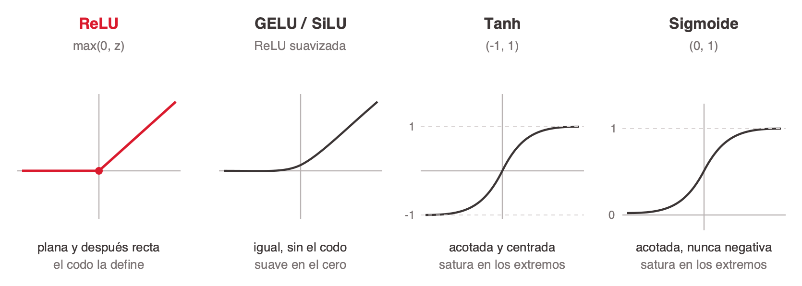
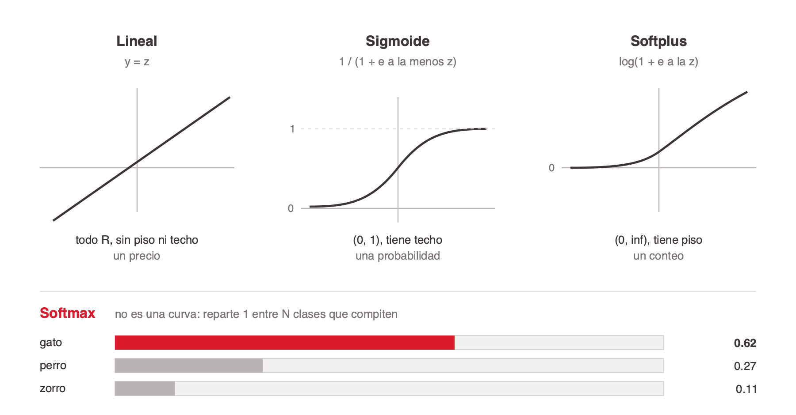
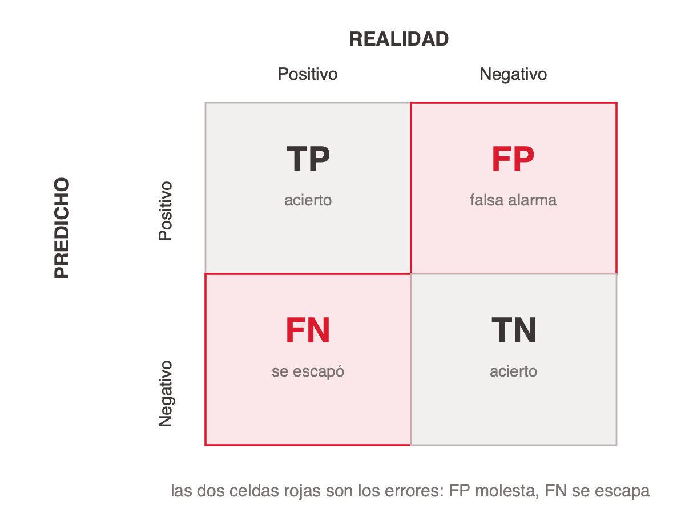
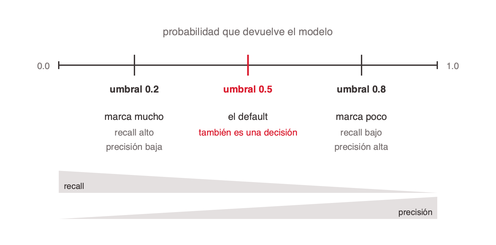
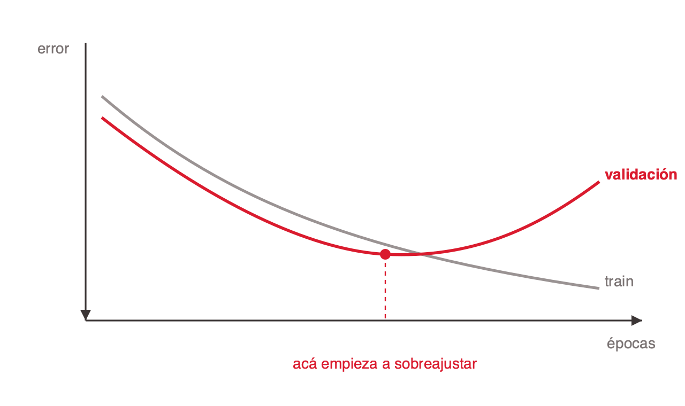

# Thesis

**Claim:** El diseño de una red neuronal se decide casi entero en cómo se codifica la entrada y cómo se modela la salida; el resto de la arquitectura sale del problema. Medir con la matriz de confusión y frenar el overfitting con regularización es lo que separa un modelo que entrena de uno que sirve.

**Why it matters:** Una red no ve un cliente, una imagen ni un contrato: ve un tensor de floats. Si la información que importa quedó mal codificada, ninguna cantidad de capas la recupera, y la mayoría de los errores de producción en ML nacen en la frontera entre el dato crudo y el modelo. Del otro lado, un modelo con 99% de accuracy puede ser inútil y uno que ajusta perfecto en entrenamiento puede fallar en cada caso nuevo. Diseñar bien la entrada y la salida, saber medir y saber regularizar cubre el 80% de las decisiones reales.

---

# Agenda

**Narrative arc:** La clase sigue el recorrido de un dato a través de la red. Primero, qué se decide de verdad al diseñar (casi todo está en la entrada y la salida). Después el input en detalle: cómo un problema cualquiera se convierte en un vector de floats. Con el dato ya codificado, qué se hace con el dataset antes de entrenar: partirlo en tres, que es lo que vuelve honesta cualquier métrica posterior. Luego el output: cómo la tarea determina la última capa y su loss. Con la red ya armada, cómo se mide de verdad su desempeño con la matriz de confusión (accuracy sola no alcanza). Y para cerrar, el problema que arruina modelos que parecían buenos, el overfitting: cómo se diagnostica y cómo se trata, con L2 al frente del arsenal.

**Sections (in delivery order):**

- 1. Qué se diseña de verdad
- 2. Modelar la entrada
- 3. Partir el dataset
- 4. Modelar la salida
- 5. La matriz de confusión
- 6. Overfitting y regularización

---

# 1. Qué se diseña de verdad

**Goal of this section:** Reencuadrar el diseño de una red. La intuición del alumno suele estar en "cuántas capas, cuántas neuronas"; el mensaje es que esas decisiones importan poco y que el trabajo real está en la entrada y la salida. Sienta la base (neurona, activación) y el mapa de qué se decide y qué sale solo.

---

## 1. La red no ve el problema, ve un tensor

### Content

Un **tensor** es un arreglo de números de N dimensiones, todos del mismo tipo (float) y con una forma fija. Un escalar es un tensor de 0 dimensiones, un vector de 1, una matriz de 2, una imagen RGB de 3 (alto, ancho, canal). Todo lo que entra, circula y sale de una red es un tensor.

- **Todo entra como números.** Un cliente, una máquina, una foto o un contrato llegan a la red como un vector de floats de tamaño fijo. La semántica original (que esto era una edad y aquello un barrio) desaparece en la codificación.
- **El input es una traducción.** Como toda traducción, puede perder cosas. Si la información que importa no quedó en el tensor, o quedó de una forma que borra su estructura, ninguna arquitectura la recupera después.
- **El error de codificación entra silencioso.** La red solo ve floats y no tiene forma de detectar que una posición "era un código" y otra "era una cantidad". Nadie recibe una excepción: el modelo entrena, converge y se equivoca.

<!-- template: quote -->
<!-- generate-image: right | la traducción frágil entre un mundo complejo y un tensor de números, con información que puede perderse en el paso -->

### Sources

corpus/chat.md.md (§13 Las ideas de fondo; §2 El input: principio general)

### Speaker notes

Abrí con esto porque reordena toda la clase. La mayoría llega pensando que diseñar una red es elegir capas. Planteales la pregunta: ¿qué ve realmente la red cuando le pasás un cliente? La respuesta (un vector de números) es el hilo de las próximas dos secciones. Anclá la idea de "traducción con pérdida": es la que justifica por qué le vamos a dedicar 20 minutos a la entrada.

---

## 2. Lo que hay que diseñar

### Content

Diseñar una red son cinco decisiones, y ninguna de las cinco es cuántas capas ponerle. Son las cinco que recorre esta clase, en este orden.

- **La entrada.** Cómo cada variable del problema se convierte en floats. Es donde se gana o se pierde el modelo, y donde más tiempo vamos a estar.
- **El dataset.** Cómo se parte antes de entrenar, en train, validación y test. Sin esto ninguna métrica posterior es honesta.
- **La salida.** Cuántas neuronas, qué activación y qué loss. No se elige: la determina la tarea. Predecir un precio pide salida lineal con MSE; clasificar en N clases, softmax con cross-entropy.
- **El error.** Con qué se mide que el modelo sirve. Accuracy sola engaña, y la matriz de confusión separa los tipos de error que accuracy suma.
- **El overfitting.** Cómo se detecta que el modelo memorizó en vez de aprender, y qué herramientas lo controlan.
- **Las capas y las neuronas.** No están en la lista. Eso sí se elige, y es lo que menos importa del diseño.

**Nota:** 1 a 3 capas ocultas alcanzan para datos tabulares, ancho en potencias de 2 decreciente, ReLU salvo motivo. El retorno está en las cinco de arriba.

<!-- format: editorial -->

### Sources

corpus/chat.md.md (§9 Diseño de la red: qué se decide y qué no)

### Speaker notes

Este es el mapa mental que quiero que se lleven, y además es la agenda de la clase disfrazada de contenido: cada viñeta es una sección. Recorrelas señalando hacia adelante, sin desarrollar ninguna. El remate es la última línea: contrastá con la expectativa, pasan horas tuneando capas y el retorno está en la entrada. Dato honesto para dejar caer acá o al final: en datos tabulares una red muchas veces pierde contra gradient boosting (XGBoost, LightGBM); las redes brillan cuando hay estructura que explotar (imágenes, texto, señales). Sirve para bajar la sobreexpectativa.

---

## 3. Una neurona, en una línea

### Content

Antes de diseñar conviene fijar el objeto mínimo. Una capa hace dos cosas: una combinación lineal y una no linealidad.


<!-- ascii-source:
   x1 ---w1--\
   x2 ---w2---&gt; [ z = W·x + b ] --&gt; [ f ] --&gt; a
   x3 ---w3--/    (pre-activación)   (activación)
-->
<!-- ascii-note:
intent: mostrar el paso de entradas a activación en una neurona
emphasize: las dos etapas z (lineal) y f (no lineal)
labels: x entradas, W·x+b pre-activación, f activación, a salida
-->

- **Pre-activación:** `z = W·x + b`. Combinación lineal de las entradas más un sesgo.
- **Activación:** `a = f(z)`. La no linealidad `f` es lo que hace que apilar capas sirva. Sin ella, la composición de capas lineales colapsa a una sola matriz.
- **Elección de `f`:** hay un puñado de candidatas y casi siempre gana ReLU. Las vemos en la diapositiva que sigue. La activación de salida es otra historia: la determina la tarea, y va en la sección 4.

### Sources

corpus/chat.md.md (§1 Conceptos base: Activación, Pesos y bias)

### Speaker notes

Refresco rápido, la audiencia tiene base técnica. El punto que no puede faltar: por qué la no linealidad. Preguntales qué pasa si sacás la ReLU de una red de 5 capas. Respuesta: te queda una regresión lineal disfrazada. Los parámetros de una capa son m·n + m; útil para la cuenta de parámetros que aparece más adelante.

---

## 4. Las activaciones ocultas, y cómo se ven

### Content

Una **activación oculta** es la función no lineal `f` que se aplica después de `z = W·x + b` en las capas del medio. Su trabajo no es acotar el resultado a un rango con sentido, como en la salida, sino **romper la linealidad** para que apilar capas sirva de algo. Son cuatro candidatas y una gana casi siempre.

| Función | Fórmula | Rango | Cuándo |
|---|---|---|---|
| ReLU | `max(0, z)` | [0, ∞) | El default de las capas ocultas |
| GELU / SiLU | suavizaciones de ReLU | (−0.3, ∞) aprox. | Transformers |
| Tanh | `(eᶻ − e⁻ᶻ) / (eᶻ + e⁻ᶻ)` | (−1, 1) | Redes recurrentes, salidas centradas |
| Sigmoide | `1 / (1 + e⁻ᶻ)` | (0, 1) | Casi nunca en capas ocultas |


<!-- ascii-source:
     ReLU  max(0,z)          GELU / SiLU            Tanh  (-1,1)         Sigmoide  (0,1)
        |        /              |        /             |    _______         |    _______
        |       /               |       /            1 |   /              1 |   /
    ----+------/----        ----+---.--/----       ----+--/-------      ----+--/-------
        |     /                 |  \_/               0 | /              0.5 | /
        |____/                  |__/                -1 |/                 0 |/

    plana y despues        igual pero suave       acotada y            acotada, nunca
    recta. barata          en el cero             centrada en 0        negativa
-->
<!-- ascii-note:
intent: mostrar la forma de las cuatro activaciones ocultas una al lado de la otra, para compararlas de un vistazo
emphasize: el codo de ReLU en el cero, que es lo que la distingue; la saturación de tanh y sigmoide en los extremos
labels: ReLU, GELU/SiLU, Tanh, Sigmoide; eje horizontal z, eje vertical f(z)
-->

**Nota:** la sigmoide y la tanh saturan. Con `z` grande su derivada es casi cero, el gradiente que llega a las capas de abajo se apaga y la red deja de aprender. ReLU no satura del lado positivo, y esa es la razón por la que ganó.

### Sources

corpus/chat.md.md (§1 Conceptos base: Activación)

### Speaker notes

Esta es la diapositiva que faltaba: hasta acá la activación era un nombre, ahora tiene forma. Recorré el diagrama de izquierda a derecha y detenete en el codo de ReLU: es literalmente dos rectas pegadas, y con eso alcanza. La pregunta que funciona: ¿por qué una función tan tonta le gana a las suaves? Respuesta corta, no satura y es baratísima de calcular. La saturación es el concepto que se llevan, y vuelve en la sección 2 con la normalización: una entrada grande sin normalizar satura la neurona igual que un `z` grande.

---

# 2. Modelar la entrada

**Goal of this section:** El corazón de la clase. Mostrar el método para convertir cualquier variable en floats: la pregunta de la resta, one-hot contra embedding, la normalización y la tabla de decisiones que cierra la sección. Que salgan sabiendo decidir cuántas neuronas de entrada necesita un problema real.

---

## 1. Todo termina en un vector de floats

### Content

El input es todo lo que sabés del problema, convertido a números. Vamos a concentrarnos en el primer caso, **sin estructura (tabular)**: una fila por ejemplo y una columna por variable, sin vecindad ni orden intrínseco entre las columnas. Lo que cambia entre un caso y otro es qué significa la posición dentro del vector, y eso determina la arquitectura natural.

| Estructura | Qué es | Ejemplos | Invariancia | Arquitectura |
|---|---|---|---|---|
| Sin estructura (tabular) | Filas y columnas, sin vecindad ni orden intrínseco entre columnas | Cliente (edad, ingreso, barrio), solicitud de préstamo, ficha clínica | El orden de las columnas | Fully connected |
| Grilla 1D (señal) | Muestras tomadas a intervalos regulares sobre un eje continuo | ECG, audio, vibración de una máquina, temperatura horaria | Desplazar en el tiempo | Conv 1D, RNN, Transformer |
| Grilla 2D (imagen) | Píxeles con vecindad en dos ejes | Radiografía, foto satelital, captura de pantalla | Desplazar en el espacio | Conv 2D |
| Secuencia | Elementos discretos de un vocabulario, en orden y de largo variable | Reseña, log de eventos, código fuente, cadena de ADN | Nada, el orden es todo | Transformer |
| Conjunto | Elementos sin orden y en cantidad variable | Carrito de compras, síntomas de un paciente, hashtags de un post | El orden de los elementos | Deep Sets, attention |
| Grafo | Nodos y aristas, sin numeración canónica | Transferencias entre cuentas, red social, molécula | Renumerar los nodos | GNN |

Señal y secuencia se confunden seguido y son distintas. La señal está muestreada a intervalos regulares y una ventana de 50 muestras significa lo mismo al principio o al final; la secuencia es una lista de símbolos de un vocabulario, sin intervalo temporal fijo y sin invariancia por desplazamiento.

La pregunta que ordena todo el zoológico: **¿qué transformaciones puedo aplicarle al input sin cambiar la respuesta correcta?** Esa invariancia elige la familia de arquitectura.

### Sources

corpus/chat.md.md (§2 El input: principio general)

### Speaker notes

Este marco es elegante y vale la pena bajarlo despacio. Definí "sin estructura" en contraste con una imagen: en una tabla, intercambiar dos columnas no cambia el significado si el modelo conserva sus nombres; no hay píxeles vecinos ni orden temporal que explotar. La confusión que más aparece es señal contra secuencia: el audio es señal (muestreo regular, invariante al desplazamiento), el texto es secuencia (símbolos discretos, largo variable, sin invariancia). El ADN sirve de ejemplo tramposo porque parece señal y es secuencia. Para el resto de la clase nos quedamos en el caso tabular, el más común en problemas de negocio y donde las decisiones de codificación se ven más claras. Usá los ejemplos de la tabla para que cada familia tenga una imagen mental. Mencioná que texto e imágenes terminan también en un vector de tamaño fijo (un embedding) y de ahí vuelven al caso simple.

---

## 2. La pregunta que decide la codificación

### Content

Frente a cualquier variable, una sola pregunta ordena la decisión: **¿qué significa la resta entre dos valores?**

- **Da una cantidad interpretable** (85 m² menos 60 m² son 25 m² reales): 1 float normalizado, una neurona.
- **Da un orden pero no una magnitud confiable** (satisfacción 4 menos 2): ordinal, evaluar también one-hot.
- **No significa nada** (barrio 14 menos barrio 7): one-hot o embedding según cuántos valores distintos haya.
- **No se puede ni plantear:** probablemente no sea una feature útil.

**Poner un número real en el tensor es afirmar algo.** Cada float le promete a la red dos cosas sobre esa posición: que las diferencias son comparables (14 está más lejos de 7 que de 13) y que la magnitud escala el efecto, porque el aporte a `z = W·x + b` es el peso por el valor. Con 85 m² y 60 m² la promesa se cumple. Con barrio 14 y barrio 7 es falsa, y ahí es donde hay que cambiar de codificación.

Todo termina en floats, nunca en enteros. Los enteros aparecen en un solo lugar: como índice para buscar una fila en una tabla de embeddings. El entero no entra a la red, entra al lookup.

### Sources

corpus/chat.md.md (§3 Codificación de variables: la pregunta que decide todo; §3 Todo termina en floats)

### Speaker notes

Esta pregunta es la herramienta más transferible de la clase. Si se llevan una sola cosa de la sección, que sea esta. Ejemplo en vivo: tirales tres variables de un dataset que conozcan (edad, código postal, nivel educativo) y que apliquen la pregunta en voz alta. El código postal es la trampa clásica: parece número, la resta no significa nada.

## 3. Numéricas: normalizar no es opcional

### Content

**Normalizar** es reexpresar una variable en una escala comparable con las demás antes de que entre a la red. Cambia la unidad en la que se lee el número, no la información que trae. Aplica a las numéricas con magnitud real: superficie, ingreso, edad, cantidad de transacciones.

- **z-score por defecto:** `(x − μ) / σ`. El valor pasa a leerse como "cuántos desvíos por encima o por debajo del promedio". La unidad original desaparece.
- **log antes del z-score:** con colas largas, `log(1+x)` comprime los valores altos antes de estandarizar. La diferencia entre 1 y 10 transacciones importa más que entre 4000 y 4010. Casos típicos: ingresos, cantidad de transacciones, días desde la última compra.
- **Los booleanos y one-hot no se tocan:** ya están en 0 y 1.
- **Escala pareja no es importancia pareja.** Normalizar no le quita peso a una variable; la importancia la aprenden los pesos. Solo la pone en condiciones de ser evaluada.

**Nota:** por qué no es opcional. El gradiente respecto a un peso es proporcional al valor de la entrada (`∂J/∂wⱼ = δ · xⱼ`), pero el learning rate es uno solo para toda la red. Si una variable vale ~200 (m²) y otra vale 0 o 1 (cochera), sus gradientes están a escala 200 a 1 y el entrenamiento zigzaguea.

### Sources

corpus/chat.md.md (§5 Escalas y normalización)

### Speaker notes

El "por qué" formal es el número de condición de la Hessiana, pero para la clase alcanza con la imagen de las curvas de nivel: escalas parejas dan círculos y el gradiente apunta al mínimo; escalas dispares dan elipses alargadas y el gradiente apunta a la pared. Efecto secundario importante: con sigmoide o tanh una entrada grande satura la neurona (derivada casi cero) y deja de aprender. Aclará que árboles y gradient boosting no necesitan normalización; es una particularidad de los métodos basados en gradiente.

---

## 4. Categóricas: one-hot contra embedding

### Content

Una categoría sin orden se codifica de dos formas, y la cardinalidad decide cuál.


<!-- ascii-source:
one-hot "Depto":  [0, 1, 0, 0]   una neurona por valor, todas equidistantes
                      |
        W · x  selecciona la columna de W  --&gt;  cada categoría, sus propios pesos
-->
<!-- ascii-note:
intent: mostrar que one-hot con W selecciona una columna de pesos
emphasize: el 1 activa una sola columna de W
labels: one-hot vector, W matriz de pesos
-->

- **One-hot** (cardinalidad baja): una neurona por valor, todas en 0 salvo una en 1. Todas las categorías quedan a la misma distancia, que es la verdad del dato. No se aprende, es interpretable, necesita pocos datos.
- **Embedding** (cardinalidad alta): una tabla de `k × d` floats entrenable. La red aprende la distancia entre categorías desde los datos. Con 500 barrios, un embedding de dimensión 24 usa 24 neuronas donde one-hot usaría 500.
- **La regla de la cardinalidad:** hasta 15 valores, one-hot; de 15 a 50, cualquiera; 50 o más, embedding.

Un embedding es matemáticamente equivalente a un one-hot seguido de una capa lineal sin sesgo. Conceptualmente, la tabla de embeddings es la primera capa de la red.

### Sources

corpus/chat.md.md (§4 One-hot vs. embedding; §7 Con 500 barrios)

### Speaker notes

El puente conceptual que engancha: así arranca un LLM. Cada token es un índice que busca su fila en una tabla de unas 50.000 por 4096. El embedding de categorías tabulares y el embedding de palabras son la misma idea, una representación densa aprendida donde la geometría del espacio codifica el significado. Las dos ventajas no obvias del embedding: comparte estadística entre categorías parecidas (una categoría rara hereda de sus vecinas) y es reutilizable para clustering o búsqueda por similitud.

---

## 5. Errores de codificación caros

### Content

Casi todos entran silenciosos: el modelo entrena sin dar error y falla en producción.

- **Código como número.** Un identificador de categoría cargado como entero. La red lee orden y magnitud donde no hay ninguno: con barrio 7 y barrio 14, asume que 14 es "el doble" de 7. Van como one-hot o embedding.
- **Identificador único como feature.** Una columna cuyo valor no se repite entre ejemplos, como DNI, CUIT o número de póliza. No tiene poder predictivo porque no hay nada que generalizar; si el modelo "aprende" de ella, está memorizando. Se descarta.
- **Variable cíclica aplastada.** Una magnitud que vuelve a empezar (hora, día de la semana, mes) codificada como número plano. Los extremos del ciclo quedan lejísimos: las 23:00 y las 00:00 están a una hora y como números planos están a 23. Se codifica con dos neuronas, `sin(2πt/T)` y `cos(2πt/T)`.
- **Faltante rellenado con 0.** Un hueco tapado con un valor que la red no distingue de un dato real. Cuando 0 es válido, confunde ausencia con valor. La receta es imputar (media o mediana) más un flag binario, que muchas veces predice más que la variable misma.

### Sources

corpus/chat.md.md (§3 Codificación de variables: enteros que son códigos, cíclicas, faltantes; §11 Los errores que más cuestan)

### Speaker notes

Sección de "no lo hagas". Estos cuatro son los que más veces vas a ver en trabajos de alumnos y en producción. El de los códigos y el de los IDs únicos son los favoritos. Contá el caso del ID: el modelo memoriza el dataset de train, da accuracy perfecto y se derrumba con datos nuevos. Es un puente natural hacia overfitting, que vemos en la sección 6.

---

## 6. De la variable al tensor: la tabla de decisiones

### Content

La sección entera cabe en una tabla. Cada fila es una variable que te vas a encontrar, y la columna del medio es la única decisión que hay que tomar.

| Variable | Ejemplo | Codificación | Neuronas |
|---|---|---|---|
| Booleana | Tiene cochera | 0 o 1, tal cual | 1 |
| Numérica con magnitud | Superficie 85 m² | z-score `(x − μ) / σ` | 1 |
| Numérica con cola larga | Ingreso mensual | `log(1+x)` y después z-score | 1 |
| Ordinal | Plan Free → Enterprise | Float 0, 0.5, 1 más one-hot, concatenados | 1 + k |
| Nominal, cardinalidad baja | Tipo de vivienda (4 valores) | One-hot | k |
| Nominal, cardinalidad alta | Barrio (500 valores) | Embedding de dimensión d | d |
| Código con forma de número | Código postal, código de producto | Embedding. Nunca como número | d |
| Identificador único | DNI, CUIT, número de póliza | Se descarta | 0 |
| Cíclica | Hora del día, mes de venta | `sin(2πt/T)` y `cos(2πt/T)` | 2 |
| Fecha | Fecha de alta del cliente | "Cuándo en el ciclo" (cíclica) más "hace cuánto" (continua) | 2 + 1 |
| Texto libre | Reseña, descripción | Sentence transformer (TF-IDF como baseline) | d |
| Con faltantes | Frente del lote sin dato | Imputar media o mediana más flag binario | 1 + 1 |

Sumar la última columna da la cantidad de neuronas de entrada. Esa cuenta no se elige: sale de la tabla.

<!-- format: editorial -->

### Sources

corpus/chat.md.md (§3 Codificación de variables; §4 One-hot vs. embedding)

### Speaker notes

Es la diapositiva de referencia de la sección, la que van a fotografiar. No la leas fila por fila: pediles que elijan tres variables de un dataset que conozcan y las ubiquen. Las filas que más discusión generan son las tres del medio (ordinal, código con forma de número, identificador único) y son justamente las tres que más aparecen mal resueltas en los trabajos. El cierre importa: la cantidad de neuronas de entrada es una consecuencia de la tabla, no una decisión de arquitectura.

---

# 3. Partir el dataset

**Goal of this section:** Qué se hace con el dataset antes de entrenar. Los tres conjuntos, para qué sirve cada uno, en qué proporción, y qué errores de partición arruinan la medición sin lanzar ningún error. Es la sección que hace honesta cualquier métrica de las secciones 5 y 6.

---

## 1. Un dataset, tres trabajos distintos

### Content

**Partir el dataset** es reservar de antemano tres porciones separadas, cada una con un trabajo distinto. Existe por una sola razón: si medís el modelo con los mismos datos con los que lo entrenaste, la métrica miente.


<!-- ascii-source:
  dataset completo
  +-----------------------------+----------+---------+
  |          train  70%         | val  20% | test 10%|
  +-----------------------------+----------+---------+
     aprende de el                se mira    se abre
     actualiza W y b              cada epoch una vez
-->
<!-- ascii-note:
intent: mostrar las tres porciones del dataset y qué hace el modelo con cada una
emphasize: los tres bloques y la asimetría de tamaño; que solo train actualiza pesos
labels: train 70%, val 20%, test 10%
-->

- **Train.** La muestra con la que se ajusta el modelo. Es la única que actualiza `W` y `b`. El modelo la ve y aprende de ella.
- **Validación.** Evaluación frecuente durante el entrenamiento, para tunear hiperparámetros y decidir cuándo cortar (early stopping). El modelo la ve después de cada epoch y nunca entrena con ella. También se la llama dev set.
- **Test.** Se abre una sola vez, con el modelo ya terminado. Es la lectura más cercana al desempeño en producción que se puede conseguir antes de desplegar.

### Sources

corpus/train-test-split-roboflow.web.md (§1 Resumen; §3 Training set; §4 Validation set; §5 Test set; §10 Ratios); corpus/train-validation-test-sets.web.md (§1 Los tres conjuntos, definidos)

### Speaker notes

Arranca por el porqué, no por los porcentajes: medir con los datos de entrenamiento es como tomar examen con las respuestas a la vista. Los números 70/20/10 están en el diagrama y son criterio práctico de la industria (Roboflow los recomienda como default), no un resultado empírico; decilo así si alguien pregunta de dónde salen. Con datasets muy grandes, de decenas de miles de ejemplos, 80/10/10 también funciona, porque ese 10% sigue siendo mucha muestra. El punto que más se olvida es el piso absoluto: con 200 ejemplos totales, un 10% de test son 20 casos y cualquier métrica sobre 20 casos es ruido. Ahí conviene cross-validation, que aparece en la 3.4.

---

## 2. Los tres, lado a lado

### Content

| | Train | Validación | Test |
|---|---|---|---|
| Para qué sirve | El modelo aprende de él | Tuning, early stopping, elegir modelo | Evaluación final sin sesgo |
| Cuándo lo ve el modelo | Cada epoch | Se evalúa cada epoch, nunca entrena con él | Una vez, al final |
| Actualiza los pesos | Sí | No | No |
| Augmentation | Sí | No | No |
| Proporción típica | 70% | 20% | 10% |

- **La diferencia sutil está entre validación y test.** El modelo no entrena con ninguno de los dos. La diferencia sos vos: tomás decisiones mirando validación, y a lo largo de muchos experimentos vas sobreajustando tus elecciones a ese conjunto. El test atrapa eso, porque nada del modelo se eligió mirándolo.
- **Por eso no alcanza con partir en dos.** Sin validación terminás tuneando contra el test, y cuando desplegás sus métricas ya no son insesgadas. El split de dos vías sirve solo si no tomás ninguna decisión iterativa, que no describe a ningún proyecto real.
- **Augmentation solo en train.** Agrandar el training set con variaciones sirve para aprender. Validación y test tienen que quedarse con los datos originales, porque su trabajo es representar lo que viene en producción. El preprocesamiento, en cambio, se aplica a los tres.

### Sources

corpus/train-test-split-roboflow.web.md (§6 La distinción sutil; §7 Preprocesamiento contra augmentation; §11 Por qué no alcanza con train y test; tabla comparativa); corpus/train-validation-test-sets.web.md (§2 Qué distingue a validación de test)

### Speaker notes

Esta tabla es el resumen que se llevan de la sección. La fila que cuesta es "actualiza los pesos": muchos creen que el modelo aprende algo de validación porque la métrica aparece en pantalla cada epoch. No aprende nada; el que aprende sos vos, y por eso hace falta el test. La analogía que funciona: validación son los simulacros que hacés para estudiar, test es el examen final; si te dan el examen final de simulacro, deja de medir. Menciona que en Kaggle el test set se libera recién al cierre de la competencia, exactamente por esto.

---

## 3. Todo lo que se aprende sale solo del train

### Content

La partición no alcanza si el preprocesamiento se calcula mal. Las estadísticas de normalización se calculan **solo** con el conjunto de entrenamiento, y se guardan para reaplicarlas idénticas en validación, test y producción.

```python
# MAL: μ y σ contaminados con el test (data leakage)
scaler.fit_transform(X_test)

# BIEN: μ y σ aprendidos solo del train
scaler.fit(X_train)
scaler.transform(X_test)
```

- **Calcularlos sobre todo el dataset es data leakage.** Información del test se filtra al entrenamiento y la métrica sale optimista. La regla general: todo lo que se aprende de los datos se aprende solo del train, transformaciones incluidas.
- **La transformación se aplica a los tres, sus parámetros salen de uno.** Normalizar, imputar y mapear categorías corre sobre train, validación y test por igual. Pero μ, σ, la mediana de imputación y el diccionario categoría a índice se calculan únicamente sobre train.
- **Un modelo desplegado no son solo `W` y `b`.** Son los pesos más los μ y σ de cada variable, más el diccionario categoría a índice, más los valores de imputación. Si se guardan solo los pesos, el modelo queda inservible.
- **El bug es silencioso.** Normalizar en producción con μ=120 en vez de 95 no lanza ninguna excepción. Solo devuelve predicciones incorrectas.

### Sources

corpus/chat.md.md (§6 μ, σ y el artefacto de producción); corpus/train-test-split-roboflow.web.md (§7 Preprocesamiento contra augmentation)

### Speaker notes

Esta diapositiva venía de la sección de input y encaja mejor acá, con la partición ya explicada. Es el error número uno de producción en ML según la fuente: que la normalización o el diccionario de categorías queden fuera del artefacto. La regla para llevarse: el preprocesamiento y el modelo se despliegan juntos; quien consume el modelo no debería tener que saber que la normalización existe. Ojo con un matiz que la fuente de Roboflow no cubre: ellos dicen "el preprocesamiento se aplica a los tres splits" y es cierto, pero no advierten que los parámetros salen solo de train. Si hay tiempo, mencioná data drift: la solución no es recalcular μ y σ en producción, es detectar el drift y reentrenar.

---

## 4. Partir mal: los errores que arruinan la medición

### Content

Ninguno de estos lanza una excepción. Todos devuelven una métrica mejor que la real.

- **Duplicados repartidos entre conjuntos.** Si el mismo caso (o uno casi idéntico) cae en train y en test, el test deja de medir generalización y mide memoria. Se conoce como train/test bleed y aparece en cualquier dataset que se armó juntando fuentes.
- **No estratificar con clases desbalanceadas.** Con 2% de fraude, un split aleatorio puede dejar el test con tres casos positivos. La partición se estratifica por la clase para que las tres porciones tengan la misma proporción.
- **Partir al azar una serie de tiempo.** Si el dato tiene orden temporal, el split aleatorio pone futuro en train y pasado en test: el modelo predice con información que en producción no va a tener. Ahí se corta por fecha, no al azar.
- **Achicar validación y test.** "Más datos, mejor modelo" tienta a dejar 90% en train. Con validación y test chicos la métrica queda ruidosa y te lleva a elegir un modelo peor.
- **Cross-validation, y cuándo paga.** K-fold parte train en k porciones y entrena k veces, promediando. Da una estimación más confiable con datasets chicos, y cuesta k entrenamientos. Con modelos profundos rara vez conviene; con datasets chicos o modelos baratos, sí.

```python
from sklearn.model_selection import train_test_split

# 70 / 20 / 10 en dos pasos, con la clase estratificada
train_X, hold_X, train_y, hold_y = train_test_split(
    X, y, test_size=0.30, random_state=42, stratify=y
)
val_X, test_X, val_y, test_y = train_test_split(
    hold_X, hold_y, test_size=1/3, random_state=42, stratify=hold_y
)
```

`random_state` fijo hace la partición reproducible, que es lo que permite comparar dos modelos sobre exactamente los mismos datos.

### Sources

corpus/train-test-split-roboflow.web.md (§8 Errores típicos; §9 Cómo se hace en Python; §12 Cross-validation); corpus/train-validation-test-sets.web.md (§4 Cross-validation); conocimiento del área (estratificación y partición temporal, no cubiertas por las fuentes)

### Speaker notes

Los dos del medio son aporte propio: ninguna de las dos fuentes cubre estratificación ni series de tiempo, y las dos importan para los trabajos que entregan. El de series de tiempo es el que más veces vas a ver mal resuelto, y el síntoma es un modelo que en el papel anda espectacular. Conectá con la sección 2: el identificador único es la versión extrema de este problema, memorizar en vez de aprender. Y dejá el puente abierto hacia overfitting: la brecha entre train y validación, que es el diagnóstico de la sección 6, solo se puede mirar si esta partición está bien hecha.

---

# 4. Modelar la salida

**Goal of this section:** Mostrar que la última capa no se elige, la determina la tarea, y que activación de salida y loss van siempre juntas. Que salgan sabiendo mapear "qué predice el modelo" a "cuántas neuronas, qué activación, qué loss", y evitar los dos errores de modelado de salida más comunes.

---

## 1. La capa de salida la determina la tarea

### Content

La activación de salida es el mismo tipo de objeto que ReLU, pero se elige con otro criterio: poner el número en el rango y la interpretación correctos. Las cuatro representaciones viven en una misma slide para comparar su forma y su rango.

| Activación | Representación | Rango | Ejemplo |
|---|---|---|---|
| Lineal (ninguna) | `y = z` | todo ℝ | precio |
| Sigmoide | `σ(z) = 1 / (1 + e⁻ᶻ)` | (0, 1) | probabilidad de churn |
| Softmax | `eᶻⁱ / Σⱼeᶻʲ` | vector que suma 1 | clase de una imagen |
| Softplus | `log(1 + eᶻ)` | (0, ∞) | demanda o desvío |

"Activación lineal" es una forma elegante de decir ninguna activación. Es la única capa donde no poner activación es lo correcto.

<!-- template: concept-breakdown -->

### Sources

corpus/chat.md.md (§8 La capa de salida)

### Speaker notes

Contrastá con las capas ocultas: ahí la activación casi no importa (ReLU y listo). En la salida, cada opción corresponde a una forma y un rango. Recorré las cuatro filas como representaciones: recta para lineal, curva acotada para sigmoide, competencia entre clases para softmax y curva positiva para softplus. Preguntá por casos: ¿qué activación para predecir la cantidad de unidades vendidas? Softplus o exp, porque un conteo no puede ser negativo. La salida lineal con MSE para conteos permite predicciones negativas, un error clásico.

---

## 2. Cómo se ven las cuatro

### Content

La tabla de al lado dice el rango; el dibujo dice la forma. Es lo que hace evidente por qué cada una sirve para lo que sirve.


<!-- ascii-source:
    Lineal  y = z           Sigmoide  1/(1+e^-z)        Softplus  log(1+e^z)
       |       /               |    ________               |         /
       |      /              1 |   /                       |        /
    ---+-----/-----            |  /                        |      _/
       |    /                0 |_/                       0 |____/
       |   /                   +-----------                +-----------
    todo R, sin techo       (0,1), una probabilidad     (0,inf), un conteo

    Softmax   e^zi / sum(e^zj)        no es una curva: reparte 1 entre N clases

       gato    [##################        ]  0.62
       perro   [########                  ]  0.27
       zorro   [###                       ]  0.11
                                             suma = 1
-->
<!-- ascii-note:
intent: mostrar la forma de las cuatro activaciones de salida; softmax se muestra como reparto entre clases porque no es una curva
emphasize: el techo de la sigmoide en 1 y el piso de softplus en 0; que las barras de softmax suman 1
labels: Lineal, Sigmoide, Softplus, Softmax; rangos todo R, (0,1), (0,inf), suma 1
-->

Tres son curvas sobre un solo número. **Softmax es distinta:** no transforma un valor, reparte una probabilidad entre N clases que compiten. Por eso es la única que necesita ver todas las neuronas de salida a la vez.

### Sources

corpus/chat.md.md (§8 La capa de salida)

### Speaker notes

Es el complemento visual de la diapositiva anterior y se da rápido, dos minutos. El punto que justifica la diapositiva: la forma explica el uso. La sigmoide tiene techo en 1, por eso es una probabilidad. Softplus tiene piso en 0 y no tiene techo, por eso sirve para conteos. La lineal no tiene ni piso ni techo, por eso sirve para un precio. Y softmax no es una curva: si alguien la dibuja como curva, no la entendió. Cerrá con la pregunta de la diapositiva anterior si no la hiciste: ¿cuál para unidades vendidas?

---

## 3. Un catálogo para elegir sin dudar

### Content

Casi cualquier tarea entra en esta tabla. Elegida la fila, la salida queda determinada.

| Qué predice | Neuronas | Activación | Loss |
|---|---|---|---|
| Un real (precio) | 1 | Lineal | MSE / MAE / Huber |
| Sí o no (churn) | 1 | Sigmoide | BCE |
| Una de N clases | N | Softmax | Cross-entropy |
| Varias de N (tags) | N | Sigmoide ×N | BCE |
| Conteo (demanda) | 1 | Softplus / exp | Poisson NLL |
| Cuantiles (P10, P50, P90) | k | Lineal | Pinball |
| Distribución (μ, σ) | 2 | μ lineal, σ softplus | NLL gaussiana |

Un caso que conviene remarcar: cuando el negocio necesita un rango y no un punto, los cuantiles (P10, P50, P90) son la opción más rentable. No asumen forma de la distribución y dan directamente el intervalo que el negocio quiere.

### Sources

corpus/chat.md.md (§8 Catálogo completo de outputs; predecir una distribución, no un punto)

### Speaker notes

No leas toda la tabla; usala como referencia y detenete en dos o tres filas. La de cuantiles suele ser nueva para los alumnos y es muy útil en la práctica (stock, riesgo, capacidad, donde importa el peor escenario). La media es la respuesta correcta a una pregunta que muchas veces nadie hizo. La distribución con μ y σ conecta con estadística que ya vieron.

---

## 4. Dos formas de modelar mal la salida

### Content

- **Softmax donde iba sigmoide.** Softmax fuerza a que las clases compitan y sumen 1, así que solo sirve cuando las etiquetas son excluyentes. Un ticket puede ser "urgente" y "de facturación" a la vez: ahí la salida está mal modelada de raíz y van N sigmoides independientes, una por etiqueta.
- **Predecir un punto cuando el negocio pedía un rango.** Si la decisión depende del peor escenario (cuánto stock, cuánto riesgo, cuánta capacidad), un valor puntual no alcanza. Ahí van cuantiles o una distribución.

Los dos errores comparten causa: la salida se eligió mirando la arquitectura en vez de la pregunta del negocio.

### Sources

corpus/chat.md.md (§8 Los dos errores más comunes)

### Speaker notes

Cierre de sección. El de softmax vs sigmoide es conceptual y se entiende con el ejemplo del ticket multi-etiqueta. Preguntá: ¿clasificar géneros de una película es softmax o sigmoide? Sigmoide, porque una película puede ser comedia y drama. Buen momento para reforzar que el modelado de la salida es una decisión de producto, no solo técnica.

---

# 5. La matriz de confusión

**Goal of this section:** El modelo ya está diseñado y entrenado; ahora, ¿anda? La sección va en cadena: accuracy engaña, la matriz de confusión separa los cuatro tipos de resultado, de ahí salen precision, recall y F1, con eso ya definido el quiz obliga a elegir cuál duele en cuatro casos reales, y el umbral cierra mostrando que la elección es una perilla y no un destino. Nota: este tema no está en el corpus; el contenido viene del conocimiento del área (ver Open questions).

---

## 1. El 99% de accuracy que no sirve

### Content

**Accuracy** es la fracción de predicciones correctas sobre el total.

```
              predicciones correctas
Accuracy  =  ------------------------
                total de casos
```

Un detector de fraude sobre 10.000 transacciones, donde 100 son fraude y 9.900 legítimas. La regla más tonta posible: decir siempre "no es fraude".


<!-- ascii-source:
  10.000 transacciones
  +-------------------------------------------------+---+
  |             9.900 legitimas                     |100|
  +-------------------------------------------------+---+
                                                      ^
                            el modelo dice "no es fraude" a todo

    aciertos           9.900 / 10.000  =  accuracy 99%
    fraudes detectados     0 / 100     =  se escapa el 100% de lo que importa
-->
<!-- ascii-note:
intent: mostrar que el 99% de accuracy sale de la clase mayoritaria y que la clase que importa se pierde entera
emphasize: el contraste entre la barra enorme de legitimas y el bloque chico de fraudes; los dos numeros de abajo
labels: 9.900 legitimas, 100 fraudes, accuracy 99%, fraudes detectados 0
-->

- **Accuracy la escribe la clase mayoritaria.** Con clases desbalanceadas el número lo pone la clase grande, y el error que importa queda escondido adentro.
- **No todos los errores cuestan lo mismo.** Dejar pasar un fraude y molestar a un cliente legítimo con una alerta son errores distintos, con costos distintos. Accuracy los suma como si fueran iguales.
- **Hace falta separar los tipos de error,** no un solo número. Ahí entra la matriz de confusión.

### Sources

Conocimiento del área (no cubierto por el corpus). Ejemplo del detector de fraude, ilustrativo.

### Speaker notes

Arranque con gancho concreto: el clasificador que dice siempre "no". Es la mejor forma de que se les caiga la ficha de que accuracy sola no alcanza. Escribí la fórmula en el pizarrón antes de mostrar el diagrama y hacé la cuenta con ellos: 9.900 sobre 10.000. El golpe llega cuando pasás al segundo número, 0 sobre 100. Los números son ilustrativos, no un dato de una fuente; dejalo claro si alguien pregunta. Este es el puente desde la salida (sección 4, clasificación con sigmoide) hacia cómo se evalúa esa clasificación.

---

## 2. La matriz de confusión

### Content

Para clasificación binaria, todos los resultados caen en una tabla de 2×2 que cruza lo que el modelo predijo con lo que era verdad.


<!-- ascii-source:
                        REALIDAD
                  Positivo      Negativo
              +-------------+-------------+
   PREDICHO   |     TP      |     FP      |   Positivo
              | (acierto)   | (falsa      |
              |             |  alarma)    |
              +-------------+-------------+
              |     FN      |     TN      |   Negativo
              | (se escapó) |  (acierto)  |
              +-------------+-------------+
-->
<!-- ascii-note:
intent: la matriz de confusión 2x2 cruzando predicción y realidad
emphasize: las dos celdas de error FP y FN
labels: TP verdadero positivo, FP falso positivo, FN falso negativo, TN verdadero negativo
-->

- **TP (verdadero positivo):** era positivo y el modelo lo marcó. Acierto.
- **FP (falso positivo):** era negativo y el modelo lo marcó. Falsa alarma.
- **FN (falso negativo):** era positivo y el modelo lo dejó pasar. Lo más caro en fraude o diagnóstico médico.
- **TN (verdadero negativo):** era negativo y el modelo lo dejó pasar. Acierto.

### Sources

Conocimiento del área (no cubierto por el corpus).

### Speaker notes

El centro de la sección. Dibujá la matriz en el pizarrón mientras aparece en la slide y pedí que ubiquen el ejemplo del fraude en cada celda. La confusión típica del alumno es FP vs FN; anclalo con el costo: en un test médico, un FN (mandar a casa a alguien enfermo) suele ser mucho peor que un FP (un estudio de más). Que se lleven que la matriz es la foto completa y accuracy es solo la diagonal sobre el total.

---

## 3. Precision, recall y F1

### Content

De las cuatro celdas salen las métricas que de verdad describen a un clasificador.

- **Precision = TP / (TP + FP).** De todo lo que el modelo marcó como positivo, cuánto lo era. Sube cuando molesta poco con falsas alarmas. Importa cuando el costo del FP es alto (marcar spam un mail importante).
- **Recall = TP / (TP + FN).** De todo lo que era positivo, cuánto agarró. Sube cuando se escapan pocos. Importa cuando el costo del FN es alto (no detectar una enfermedad o un fraude).
- **F1 = 2 · (P · R) / (P + R).** La media armónica entre precision y recall. A diferencia del promedio común, la manda el número más chico: con precision 0.9 y recall 0.5, el promedio da 0.70 y F1 da 0.64; con recall 0, el promedio da 0.45 y F1 da 0. Es el número único cuando las dos importan parecido.
- **Precision y recall están en tensión.** Subir una suele bajar la otra. Qué priorizar lo decide el costo del error, no la matemática.

### Sources

Conocimiento del área (no cubierto por el corpus).

### Speaker notes

Insistí en la intuición antes que en la fórmula. Precision responde "cuando dice que sí, ¿le creo?"; recall responde "de todos los que eran, ¿cuántos encontró?". El truco mnemotécnico: precisión mira la columna de predichos positivos, recall mira la fila de reales positivos. Si preguntan por qué media armónica y no promedio: el promedio deja que un 1.0 tape un 0.0, y un clasificador que marca todo tiene recall 1.0 con precision pésima. La armónica no lo permite, porque tiende al más chico de los dos. Hacé la cuenta de 0.9 y 0.5 en el pizarrón, son diez segundos y se entiende de una. F1 es útil pero peligroso si se reporta solo; siempre conviene mirar las dos. Si dan tiempo, escribí accuracy = (TP+TN)/total: es la misma fórmula de la 5.1, ahora con los cuatro términos ya definidos, y cierra el círculo de la sección.

---

## 4. Quiz: ¿precisión o recall?

### Content

En cada caso, elegí qué error es menos tolerable. La métrica que priorizás cae sola.

1. **Filtro de spam:** bloquear un mail legítimo es peor que dejar pasar uno dudoso. ¿Priorizás precisión o recall?
2. **Test de una enfermedad grave:** dejar ir a una persona enferma es peor que pedir estudios extra. ¿Priorizás precisión o recall?
3. **Alerta de fraude:** el equipo puede revisar pocas alertas, pero cada fraude no detectado cuesta caro. ¿Qué priorizás y qué costo aceptás?
4. **Modelo de churn:** el modelo marca quién se va a dar de baja y a cada marcado se le ofrece un descuento. Un descuento regalado a alguien que no se iba cuesta plata; un cliente que se va sin oferta también. ¿Qué métrica reportás?

**Respuesta:** precisión cuando una alerta falsa es cara; recall cuando dejar pasar un positivo es más grave. En fraude no hay respuesta universal, depende de la capacidad de revisión y del costo del fraude. En churn los dos errores cuestan parecido y ninguna de las dos sola describe el modelo: ese es el caso donde F1 sirve como número único.

<!-- template: quiz -->

### Sources

Conocimiento del área (no cubierto por el corpus). Casos ilustrativos.

### Speaker notes

Hacé las cuatro preguntas antes de mostrar la respuesta. En spam, la respuesta esperada es precisión; en diagnóstico, recall. En fraude, no cierres con una métrica automática: pediles que expliciten el costo de una revisión y el costo de no detectar. El de churn es el que cierra la idea de F1: los dos errores cuestan parecido, así que optimizar una sola métrica deja la otra libre y F1 es el número que las mantiene atadas. La diapositiva cierra la secuencia: la matriz separó los errores, precision y recall los nombraron, y acá se decide cuál duele.

---

## 5. El umbral y la matriz N×N

### Content

Un clasificador binario no devuelve "sí" o "no", devuelve una probabilidad. El **umbral** es el número que la convierte en decisión.


<!-- ascii-source:
        probabilidad que devuelve el modelo
   0.0 ----------------------------------------------- 1.0
              |                  |                |
           umbral 0.2        umbral 0.5       umbral 0.8

           marca mucho        el default       marca poco
           recall  alto                        recall  bajo
           precision baja                      precision alta
-->
<!-- ascii-note:
intent: mostrar que mover el umbral sobre el eje de probabilidad intercambia recall por precision
emphasize: el eje 0.0 a 1.0 y las tres posiciones del umbral; el cruce de recall y precision entre los extremos
labels: probabilidad 0.0 a 1.0, umbral 0.2 / 0.5 / 0.8, recall, precision
-->

- **El umbral es una perilla de negocio.** Se mueve según cuál de los dos errores duele más. Dejarlo en 0.5 también es una decisión, no un default neutro.
- **La curva precision-recall** muestra ese intercambio para todos los umbrales de una vez, y sirve para comparar dos modelos sin fijar ninguno.

En multiclase la matriz crece a N×N: la diagonal son los aciertos y cada celda fuera de ella dice con qué clase se confunde. Precision y recall se calculan por clase y se promedian.

### Sources

Conocimiento del área (no cubierto por el corpus).

### Speaker notes

El umbral es lo que más cuesta que entiendan y lo más útil en la práctica. Recorré el diagrama con el dedo, de izquierda a derecha, y que ellos digan qué pasa con cada métrica antes de que lo leas. Ejemplo para anclar: un modelo de fraude con recall bajo en 0.5 pasa a recall alto bajando el umbral a 0.2, a costa de más falsas alarmas que el equipo antifraude tendrá que revisar. Ahí se ve que es una decisión de operación y no de modelado. La línea de N×N va al pasar, conecta con el softmax de la sección 4 y no necesita más de treinta segundos. Si el tiempo aprieta, esta diapositiva se puede dar solo con el diagrama.

---

# 6. Overfitting y regularización

**Goal of this section:** Diagnosticar y tratar, en ese orden. Primero definir overfitting como la brecha train-validación, dar el diagnóstico de tres casos y explicar el intercambio sesgo-varianza que justifica por qué regularizar empeora el entrenamiento a propósito. Después el tratamiento: L2 (weight decay) en detalle porque es el estándar y está en el título de la clase, L1 por contraste, dropout, y el resto del arsenal con la guía de cuál usar y los errores de aplicación.

---

## 1. El diagnóstico en dos números

### Content

Overfitting es la brecha entre el error de entrenamiento y el de validación. El diagnóstico sale de mirar los dos juntos.

| Error de train | Error de validación | Diagnóstico | Qué hacer |
|---|---|---|---|
| Alto | Alto | Underfitting | Más capacidad |
| Bajo | Alto | **Overfitting** | Regularizar |
| Bajo | Bajo | Bien | Nada |

El síntoma es la separación: el error de train baja sin parar y el de validación deja de bajar y empieza a subir. La red dejó de aprender el patrón y empezó a memorizar los ejemplos.

<!-- generate-image: left | una brecha que se abre entre aprendizaje aparente y desempeño real, tensión entre memorizar y generalizar -->

### Sources

corpus/chat.md.md (§10 Regularización: qué problema resuelve)

### Speaker notes

Este es el mapa de decisión que ordena la segunda mitad de la sección. Insistí en el orden: primero se diagnostica, después se trata. Regularizar un modelo que hace underfitting (train alto) empeora las dos métricas. Conectá con el ID único de la sección 2: memorizar el DNI es overfitting en estado puro, train perfecto y validación mala.

---

## 2. Sesgo contra varianza

### Content

La regularización no mejora el ajuste. Lo empeora a propósito en entrenamiento, a cambio de que el modelo generalice mejor a datos nuevos. La brecha de la slide anterior se ve así a lo largo del entrenamiento:


<!-- ascii-source:
error
  |\                         curva de validación
  | \                    __/  (vuelve a subir)
  |  \___             __/
  |      \______   __/   <-- acá empieza a sobreajustar
  |             \_/______  curva de entrenamiento (sigue bajando)
  +------------------------------&gt; épocas
-->
<!-- ascii-note:
intent: curvas de train y validación que se separan (overfitting = alta varianza)
emphasize: el punto donde validación deja de bajar y empieza a subir
labels: eje x épocas, eje y error, dos curvas train y validación
-->

- **Mucha capacidad da alta varianza:** el modelo pasa exactamente por cada punto de train, incluido el ruido, y cambia mucho con datos nuevos. Es la curva de validación que sube.
- **Poca capacidad da alto sesgo:** no captura el patrón ni en train.
- **Regularizar es un intercambio explícito:** se acepta un poco más de sesgo (peor ajuste en train) para bajar la varianza (mejor desempeño fuera de train).
- **El objetivo nunca fue el error de train.** Un modelo que ajusta perfecto lo que ya vio y falla en lo nuevo no sirve para nada.

### Sources

corpus/chat.md.md (§10 Regularización: qué problema resuelve)

### Speaker notes

El intercambio sesgo-varianza es el fundamento teórico de todo lo que viene. La metáfora que funciona: estudiar para un examen memorizando las respuestas de los ejercicios viejos (varianza alta, te va mal con ejercicios nuevos) contra entender el método (algo de sesgo, generaliza). Preparen el terreno: todas las técnicas que vienen a continuación son formas distintas de bajar varianza.

---

## 3. L2: penalizar los pesos grandes

### Content

L2 agrega un término al objetivo que penaliza los pesos grandes:


<!-- ascii-source:
   J  =  cost  +  λ · Σ w²
         \___/     \______/
         ajuste    penalización
                   (empuja cada w hacia 0)
-->
<!-- ascii-note:
intent: descomponer el objetivo con el término de regularización L2
emphasize: el término lambda por suma de w al cuadrado
labels: J objetivo, cost ajuste, término L2
-->

- **Pesos chicos, función suave.** Un peso grande hace que la salida sea muy sensible a esa entrada. Con pesos chicos la función aprendida es más suave, y una función suave no puede pasar exactamente por cada punto de entrenamiento, que es justo lo que hace el overfitting.
- **Weight decay, el otro nombre.** El gradiente del término λΣw² empuja cada peso un poco hacia cero en cada paso.
- **λ, el hiperparámetro.** Típicamente entre 1e-5 y 1e-2. En PyTorch: `Adam(params, weight_decay=1e-4)`.
- **El sesgo queda afuera.** El bias no controla la sensibilidad a la entrada, así que no se penaliza. En inferencia L2 no hace nada, ya quedó incorporado en los pesos.

### Sources

corpus/chat.md.md (§10 Regularización: L2 weight decay)

### Speaker notes

El tema del título, dedicale tiempo. El "por qué funciona" es lo importante: pesos grandes, función que oscila para tocar cada punto; pesos chicos, función suave que generaliza. Dibujá dos ajustes sobre los mismos puntos, uno que serpentea y uno suave. Aclará el detalle del bias, que a casi nadie le queda claro: penalizás pesos, no sesgos, porque el bias solo desplaza, no amplifica la entrada.

---

## 4. L1 contra L2

### Content

Misma idea, otra norma: L1 penaliza con el valor absoluto en lugar del cuadrado.

- **L2 penaliza `w²`:** reduce todos los pesos sin llevarlos a cero. Resultado, pesos parejos y chicos. Es el estándar en redes.
- **L1 penaliza `|w|`:** lleva los pesos chicos exactamente a cero. Resultado, una solución rala que selecciona features. Se usa más en modelos lineales (Lasso) que en redes.
- **Elastic net combina las dos.** Rara vez hace falta en una red.

La diferencia práctica: si querés que el modelo descarte features solo, L1. Si querés que ningún peso domine, L2.

### Sources

corpus/chat.md.md (§10 Regularización: L1)

### Speaker notes

Comparación corta, no te extiendas. El punto geométrico, si quieren profundizar: la bola L1 tiene puntas sobre los ejes, y ahí es donde el óptimo tiende a caer con alguna coordenada en cero (rala). La bola L2 es redonda, empuja parejo. Para la clase alcanza con "L1 selecciona, L2 empareja".

---

## 5. Dropout: no depender de ninguna neurona

### Content

Durante el entrenamiento, dropout apaga al azar una fracción de las neuronas en cada paso hacia adelante.

- **Apagado al azar.** Cada neurona se apaga con probabilidad p, típico 0.2 a 0.5 en capas ocultas. La red no puede depender de ninguna neurona en particular, así que reparte la representación en vez de armar detectores frágiles.
- **Un ensamble implícito.** Muchas subredes que comparten pesos, entrenadas en simultáneo.
- **En inferencia se desactiva.** Todas las neuronas quedan activas. En PyTorch, `nn.Dropout(0.2)`.
- **El bug clásico.** Olvidar `model.eval()` deja dropout activo en inferencia, y el modelo devuelve predicciones distintas en cada llamada. Le pasa también a BatchNorm.

### Sources

corpus/chat.md.md (§10 Regularización: Dropout)

### Speaker notes

El `model.eval()` es el bug de PyTorch que van a cometer sí o sí en la práctica; que suene fuerte ahora para que lo recuerden después. La lectura de ensamble es elegante: en cada paso entrenás una subred distinta, y en inferencia usás el promedio. Dato para el que pregunte por qué en visión moderna casi no se usa dropout: se lleva mal con BatchNorm (lo vemos en la próxima slide).

---

## 6. El resto del arsenal y cuál usar

### Content

Hay más de una herramienta, y la mejor a veces no es la más sofisticada.

- **Early stopping:** cortar el entrenamiento cuando la validación deja de mejorar. Gratis, sin hiperparámetro que calibrar, funciona con cualquier arquitectura. Es el que más rinde y el que menos se menciona.
- **Más datos:** ataca la causa, no el síntoma. Caro, pero es el mejor remedio.
- **Data augmentation:** generar variantes del dato (recortes, giros, ruido). Muy efectivo en visión.
- **Reducir capacidad:** menos capas o neuronas. Simple y directo.

Guía rápida por caso:

| Situación | Elegir |
|---|---|
| Tabular, red chica | L2 + early stopping |
| Red profunda | Dropout + L2 |
| Visión | Data augmentation, después dropout |
| Transformers | Dropout bajo (0.1) + weight decay |

### Sources

corpus/chat.md.md (§10 Regularización: el resto del arsenal; cuál usar)

### Speaker notes

Early stopping es el que quiero que se lleven como primer reflejo: cero costo, siempre conviene. La tabla es de referencia, no la leas entera. Tres matices para no aplicar mal, si hay tiempo: regularizar sin overfitting empeora las dos métricas; dropout y BatchNorm se llevan mal (dropout cambia la varianza que BatchNorm acaba de normalizar); y weight decay sobre embeddings castiga a las categorías raras que no aparecieron en el batch, justo las que menos entrenadas están.

---

# Conclusions

## 1. Lo que hay que llevarse

### Content

- **El diseño está en la entrada y la salida.** La cantidad de capas importa poco; cómo se codifica cada variable y cómo se modela la respuesta es donde se gana o se pierde el modelo.
- **La red solo ve floats.** Codificar mal es fatal porque el error entra silencioso y ninguna arquitectura lo corrige. La pregunta de la resta ordena casi toda la decisión de codificación.
- **Accuracy sola engaña.** La matriz de confusión separa los tipos de error; precision, recall y F1 describen lo que accuracy esconde, y el umbral es una perilla de negocio.
- **Regularizar es bajar varianza a propósito.** Primero se diagnostica el overfitting (brecha train-validación), después se trata: L2 de base, dropout en redes profundas, early stopping casi siempre.

### Sources

corpus/chat.md.md (§9, §10, §13); conocimiento del área (sección 5)

### Speaker notes

Recapitulá siguiendo el recorrido del dato: entró (input), salió (output), lo medimos (matriz de confusión), lo cuidamos (regularización). Cuatro ideas, una por sección troncal. Dejá espacio para preguntas antes del checklist.

---

## 2. Checklist operativo para la práctica

### Content

Para cada variable de un problema real, antes de tocar la red:

- **¿Es número, categoría, ciclo, fecha o texto?** Define la familia de codificación.
- **¿Qué significa la resta entre dos valores?** Decide float, ordinal, one-hot o embedding.
- **¿Cuántos valores distintos tiene?** One-hot o embedding según la cardinalidad.
- **¿Puede faltar, y faltar significa algo?** Imputación más flag, o categoría propia.
- **¿La voy a tener disponible al momento de predecir?** Si no, no es una feature.

Para la salida: ¿qué pregunta responde el modelo, necesita un valor o un rango, las clases son excluyentes, el valor tiene que ser positivo? Con eso resuelto, la cantidad de neuronas sale sola.

### Sources

corpus/chat.md.md (§12 Checklist operativo)

### Speaker notes

Cierre accionable. Este checklist es directamente aplicable al TP o al dataset con el que trabajen. Sugiero dejarlo como material de la clase. Si hay práctica a continuación, este es el puente: que apliquen el checklist a un dataset real antes de escribir una sola línea de la red.

---

# Open questions

- Sección 4 (Matriz de confusión) no está cubierta por el corpus (`chat.md.md`). El contenido viene del conocimiento del área. Si el presentador quiere anclarlo a una fuente propia (apunte, capítulo, ejemplo con números reales de un dataset del curso), conviene sumarla en la Colecta y re-verificar los números. El ejemplo del "99% de accuracy" y los costos FP/FN son ilustrativos, no datos de una fuente.
- La fuente advierte que en datos tabulares una red suele perder contra gradient boosting (XGBoost, LightGBM). Está en las notas del orador (slide 1.2) como contrapunto honesto. Decidir si darle más aire en clase o dejarlo como comentario al pasar.
- Duración: con la sección 3 nueva el borrador pasó de ~25 a ~29 diapositivas para 90 min, y es el punto que más conviene mirar en el ensayo. Candidatas a recortar, en este orden: slide 6.4 (L1 contra L2), slide 3.4 (errores de partición, dejando los dos primeros bullets más el código) y slide 5.5, que ya quedó aligerada y se puede dar solo con el diagrama.
- Diagramas a dibujar en Polish: 8 (los 5 originales más el de la partición en 3.1, el del desbalance en 5.1 y el del umbral en 5.5). Los 3 nuevos son de esta ronda de review.
- Ninguna de las dos fuentes nuevas cubre partición estratificada ni partición temporal, y las dos importan para los trabajos que entregan los alumnos. En la slide 3.4 están como aporte del docente, sin fuente detrás. Si se quiere anclar, hace falta sumar una tercera fuente en la Colecta.
- Los ratios 70/20/10 y 80/10/10 son recomendación de la casa de Roboflow (contenido de marketing de producto), no resultado de un estudio. Están citados como criterio práctico de la industria; si alguien en clase pregunta de dónde salen, esa es la respuesta honesta.
- El artículo de Roboflow está escrito para visión por computadora y esta clase es tabular. Los ejemplos se trasladaron (imágenes a filas), la lógica no cambió. Revisar en el ensayo que no quede ningún resto de vocabulario de visión.

# Cut material

## Desglose en tres baldes de la diapositiva 1.2 (reemplazado por feedback, 2026-08-19)

La versión anterior de la diapositiva 1.2 organizaba el diseño en tres baldes en vez de listar los aspectos de la clase. Se reemplazó por pedido del presentador; el contraste final sobrevive como remate de la diapositiva nueva, y este es el detalle que se retiró:

- **Lo determina la tarea (no se decide):** cantidad de neuronas de salida, activación de salida y función de loss. Predecir un precio pide una salida lineal con MSE; clasificar en N clases pide softmax con cross-entropy. No hay margen.
- **Lo determina la codificación (crítico):** cantidad de neuronas de entrada y si se normaliza. Salen de cómo se representan las variables, y es donde se gana o se pierde el modelo.
- **Lo que sí se elige (importa poco):** cantidad de capas ocultas (1 a 3 alcanza para datos tabulares), ancho de cada capa (potencias de 2, decreciente) y activación oculta (ReLU salvo motivo).

Fuente: corpus/chat.md.md (§9 Diseño de la red: qué se decide y qué no).

## Diapositiva 2.6 "μ y σ: el modelo no son solo los pesos" (retirada por feedback, 2026-08-19)

La diapositiva se retiró de la sección 2 por pedido del presentador. **El contenido no se descartó:** el bloque de código MAL/BIEN, los tres bullets (data leakage, el artefacto de producción completo, el bug silencioso) y las notas del orador pasaron a la diapositiva 3.3 "Todo lo que se aprende sale solo del train", donde el tema queda mejor apoyado porque la partición ya está explicada. Se le sumó ahí un bullet nuevo sobre la diferencia entre aplicar la transformación (a los tres conjuntos) y calcular sus parámetros (solo sobre train).

## Activación y loss se eligen juntas (retirada por feedback)

- `BCEWithLogitsLoss` y `CrossEntropyLoss` ya incluyen la sigmoide y el softmax por estabilidad numérica. Si además se pone la activación en la capa, se aplica dos veces y el modelo entrena mal.
- En inferencia, con logits crudos: `prob = torch.sigmoid(model(x))`. Un logit de 2.3 no es una probabilidad.
- Fuente: corpus/chat.md.md (§8 El detalle de implementación; los pares que no se rompen).
