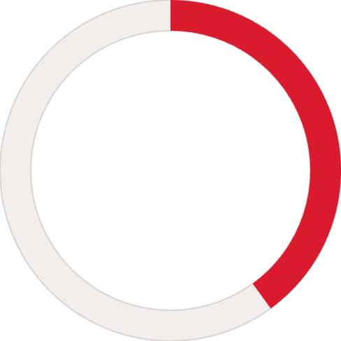
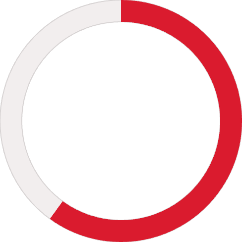
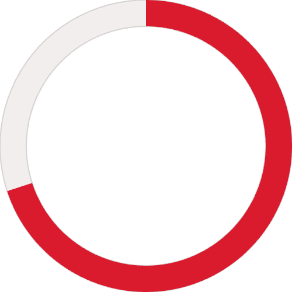
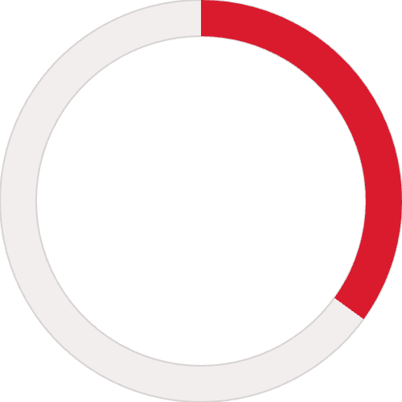

# Thesis

**Claim:**

**Why it matters:**

**Presenter feedback:**

- [open] 2026-08-14 — "Restaurado 1:1 desde `AIG4B-Clase-3-Prompting.pptx`. La tesis no estaba explícita en el deck original: falta escribirla."

---

# Agenda

**Narrative arc:**

Reconstruido desde la slide de agenda del deck original.

**Sections (in delivery order):**

- 1. Fundamentos de foundational models
- 2. Selección de modelos y costos
- 3. Ingeniería de prompts estructurada
- 4. In-context learning
- 5. Técnicas avanzadas de prompting
- 6. Foundational models en medicina
- 7. Resumen y práctica

<!-- agenda tal como figura en el deck original: -->
<!-- **1** -->
<!-- - **Fundamentos de Foundational Models** -->
<!-- - Ventana de contexto, tokens, limitaciones y modelos mentales -->
<!-- **2** -->
<!-- - **Ingeniería de Prompts Estructurada** -->
<!-- - 6 componentes, XML tags, salidas JSON y optimización por modelo -->
<!-- **3** -->
<!-- - **In-Context Learning** -->
<!-- - Zero-shot, Few-shot y Many-shot con ejemplos clínicos -->
<!-- **4** -->
<!-- - **Técnicas Avanzadas de Prompting** -->
<!-- - CoT, Self-Consistency, Extended Thinking y Prompt Chaining -->
<!-- **5** -->
<!-- - **Selección de Modelos y Costos** -->
<!-- - Framework de decisión, prompt caching, model cascading y TOON -->
<!-- **6** -->
<!-- - **Foundational Models en Medicina** -->
<!-- - Aplicaciones reales, recorrido del paciente, research biomédica y marco ético OMS -->
<!-- **7** -->
<!-- - **Resumen y Práctica** -->
<!-- - Módulos interactivos de aitutorial.dev + sistema de triage con LLM -->

**Presenter feedback:**

---

# 0. Portada

**Goal of this section:** Apertura del deck original — portada y material previo a la primera sección.

**Presenter feedback:**

---

## 1. Trabajar con LLMs: prompts, costos y producción

<!-- slide 1 del pptx original -->

### Content

**Inteligencia Artificial Generativa (AI Gen) — Clase 5**

- **Paulo Veiga, Claudio Righetti, Marco Sorondo — Universidad Austral**
- **Última modificación: agosto 2026**

### Sources

- `AIG4B-Clase-3-Prompting.md.md` (slide 1)

### Speaker notes

### Presenter feedback

---

## 2. (sin título)

<!-- slide 2 del pptx original -->

### Content

### Sources

- `AIG4B-Clase-3-Prompting.md.md` (slide 2)

### Speaker notes

### Presenter feedback

---

## 3. (sin título)

<!-- slide 3 del pptx original -->

### Content

### Sources

- `AIG4B-Clase-3-Prompting.md.md` (slide 3)

### Speaker notes

### Presenter feedback

---

## 4. Agenda

<!-- slide 4 del pptx original -->

### Content

**1**

- **Fundamentos de Foundational Models**

- Ventana de contexto, tokens, limitaciones y modelos mentales

**2**

- **Ingeniería de Prompts Estructurada**

- 6 componentes, XML tags, salidas JSON y optimización por modelo

**3**

- **In-Context Learning**

- Zero-shot, Few-shot y Many-shot con ejemplos clínicos

**4**

- **Técnicas Avanzadas de Prompting**

- CoT, Self-Consistency, Extended Thinking y Prompt Chaining

**5**

- **Selección de Modelos y Costos**

- Framework de decisión, prompt caching, model cascading y TOON

**6**

- **Foundational Models en Medicina**

- Aplicaciones reales, recorrido del paciente, research biomédica y marco ético OMS

**7**

- **Resumen y Práctica**

- Módulos interactivos de aitutorial.dev + sistema de triage con LLM

### Sources

- `AIG4B-Clase-3-Prompting.md.md` (slide 4)

### Speaker notes

### Presenter feedback

---

# 1. Fundamentos de foundational models

**Goal of this section:**

**Presenter feedback:**

---

## 1. ¿Qué es un Prompt?

<!-- slide 5 del pptx original -->

### Content

- **Un prompt es la instrucción, pregunta o entrada textual que proporcionas a un Modelo de Lenguaje Grande (LLM) para que genere una respuesta.**

| Medio de Comunicación | Define Tarea y Contexto | Calidad = Resultado |
|---|---|---|
| La interfaz principal entre el humano y la IA. | Establece qué hacer y bajo qué condiciones. | Un mejor prompt produce respuestas más útiles y precisas. |

- **💡 Analogía: Un prompt es como una receta para un chef experto — cuanto más clara y específica, mejor el resultado.**

### Sources

- `AIG4B-Clase-3-Prompting.md.md` (slide 5)

### Speaker notes

### Presenter feedback

---

## 2. ¿Que es lo que se guarda en un prompt?

<!-- slide 6 del pptx original -->

### Content

**Componentes**

**Lo que hay que saber**

**System prompt**

- Cada mensaje nuevo se concatena al historial, consumiendo espacio progresivamente (chat).

- Todo compite por la atención del modelo simultáneamente.

- Instrucciones base del sistema que definen el comportamiento general del modelo.

**Historial de mensajes**

- Toda la conversación previa entre usuario y modelo.

- Más contexto no siempre es mejor: puede diluir lo importante.

- El modelo no "elige" qué leer; procesa todo el contexto junto.

**Datos inyectados**

- Archivos, resultados de búsqueda, datos de APIs externos.

**Respuestas del modelo**

- Sus propias respuestas previas también consumen espacio en la ventana.

### Sources

- `AIG4B-Clase-3-Prompting.md.md` (slide 6)

### Speaker notes

### Presenter feedback

---

## 3. Ventana de Contexto

<!-- slide 7 del pptx original -->

### Content

- **¿Qué es?**

- **Tamaños típicos en 2026**

- **La ventana de contexto es la memoria de trabajo activa del LLM: todo lo que el modelo puede «ver» en un momento dado para generar su respuesta.**

- **1M**

- **GPT-5.4 (OpenAI)**

- **Es finita, cuando se llena, el modelo pierde acceso a la información más antigua.**

- **1M**

- **Claude Opus 4.6 (Anthropic)**

- **2M**

- **Gemini 3 Pro (Google)**

- **10M**

- **Llama 4 (Meta)**

- La carrera por ventanas más largas es la nueva frontera competitiva en 2026.

- historial, respuestas,

### Sources

- `AIG4B-Clase-3-Prompting.md.md` (slide 7)

### Speaker notes

### Presenter feedback

---

## 4. ¿Cuanto es 1 millón de Tolkien tokens ?

<!-- slide 8 del pptx original -->

### Content

- **"Claude Code tiene ahora una ventana de contexto de 1 millón de tokens por defecto. Un millón de tokens es mucho: la trilogía de El Señor de los Anillos más El Hobbit tienen unas 576.000 palabras, lo que equivale a ~750.000 tokens. Las cuatro obras caben en un único prompt... y aún sobra espacio."**

| 📚 ~750K tokens | 🏥 ~800K tokens |
|---|---|
| Toda la obra de Tolkien (El Hobbit + trilogía LOTR) | Años de historial clínico completo de un paciente |

### Sources

- `AIG4B-Clase-3-Prompting.md.md` (slide 8)

### Speaker notes

### Presenter feedback

---

## 5. Economía de Tokens

<!-- slide 9 del pptx original -->

### Content

**¿Qué son los tokens?**

- Los tokens son subpalabras, no palabras completas. Por ejemplo, "Ingeniería Biomédica" equivale a aproximadamente 4-5 tokens. El modelo procesa y factura en unidades de tokens, tanto de entrada como de salida.

- Un prompt de 2.000 tokens + respuesta de 500 tokens cuesta aproximadamente $0,01 con GPT-4o.

<!-- enlace de la forma: https://gpt-tokenizer.dev -->
- [Pruébalo en tiempo real: gpt-tokenizer.dev](https://gpt-tokenizer.dev)

### Sources

- `AIG4B-Clase-3-Prompting.md.md` (slide 9)

### Speaker notes

### Presenter feedback

---

## 6. La Fórmula del Costo

<!-- slide 10 del pptx original -->

### Content

- Cada vez que envías un mensaje en un chat largo, pagas por dos conceptos diferentes. La fórmula se ve así:

- **Costo Total = (Tokens de Entrada × Precio Entrada) + (Tokens de Salida × Precio Salida)**

**Costo Total=(Tokens de Entrada×Precio Entrada)+(Tokens de Salida×Precio Salida)**

- **El efecto bola de nieve en el costo**

- Turno de Chat

- Lo que tú escribes

- Lo que la app le envía al LLM (Entrada)

- Lo que te cobran

- Como vimos antes, para que el modelo recuerde el contexto, la aplicación le tiene que reenviar la historia del chat. Mira cómo se acumula el gasto en una conversación:

| Mensaje 1 | "Hola, haz un código..." | Solo tu mensaje 1. | Barato. |
|---|---|---|---|
| Mensaje 2 | "Ahora cámbiale esto..." | Mensaje 1 + Respuesta 1 + Mensaje 2. | Un poco más caro. |
| Mensaje 3 | "Y agrégale esto otro..." | Mensaje 1 + Resp. 1 + Mensaje 2 + Resp. 2 + Mensaje 3. | Más caro que el anterior. |

### Sources

- `AIG4B-Clase-3-Prompting.md.md` (slide 10)

### Speaker notes

### Presenter feedback

---

## 7. Limitaciones de los Foundational Models

<!-- slide 12 del pptx original -->

### Content

| Alucinaciones | No-Determinismo | Sesgo de Recencia |
|---|---|---|
| Predicen texto plausible, no verifican hechos. Mitigación: restringir al contexto dado + revisión humana. | El mismo prompt produce respuestas diferentes (temperature > 0). Temperature 0 = mínima creatividad; 2.0 = máxima. En producción: usar temperature baja + múltiples iteraciones. | El modelo presta más atención al inicio y al final del prompt; el contenido del medio recibe menos atención. Estrategia: instrucciones críticas al inicio, queries específicas al final. |

### Sources

- `AIG4B-Clase-3-Prompting.md.md` (slide 12)

### Speaker notes

### Presenter feedback

---

## 8. Alucinaciones: En Profundidad

<!-- slide 13 del pptx original -->

### Content

- **¿Por qué ocurren?**

- **Casos reales documentados**

- Los LLMs no tienen acceso a hechos verificados. Generan el token más probable dado el contexto, lo que puede producir texto fluido pero factualmente incorrecto.

- **Air Canada (2024)**

- El chatbot alucinó una política de reembolso inexistente. El tribunal falló en contra de la aerolínea, que debió compensar al pasajero.

- **Entrenamiento sesgado**

- Datos de entrenamiento incompletos o desactualizados. El modelo extrapola más allá de lo que sabe.

- **Abogados en EE.UU. (2023)**

- Dos abogados presentaron citas de jurisprudencia generadas por ChatGPT que no existían. Fueron sancionados por el tribunal.

- **Confianza sin verificación**

- El modelo no distingue entre lo que sabe y lo que inventa. Responde con igual seguridad en ambos casos.

- **Med-PaLM en diagnóstico**

- Modelos médicos pueden generar diagnósticos plausibles pero incorrectos con alta confianza aparente.

- **Presión de completado**

- El modelo siempre intenta completar el texto, incluso cuando no tiene información suficiente.

- **Wikipedia falsa**

- LLMs pueden generar referencias bibliográficas con autores, títulos y DOIs completamente inventados.

### Sources

- `AIG4B-Clase-3-Prompting.md.md` (slide 13)

### Speaker notes

### Presenter feedback

---

## 9. Mitigación de Alucinaciones: Estrategias Clave

<!-- slide 14 del pptx original -->

### Content

- Formal Testing como ventaja clave

- Grounding en contexto

- Dataset de evaluación

- Instruir al modelo a responder solo con el contexto dado.

- Mínimo 50-100 casos con ground truth del dominio clínico.

- Métricas de alucinación

- RAG (Retrieval-Augmented Generation)

- Faithfulness score, hallucination rate, ROUGE-L.

- Inyectar únicamente información verificada y relevante por consulta.

- Regression testing

- Temperature = 0

- Ejecutar el eval set en cada cambio de prompt.

- Minimizar aleatoriedad en tareas de extracción o clasificación.

- Red teaming

- Probar con casos ambiguos y contradictorios antes de producción.

- Self-Consistency

- Generar múltiples respuestas y seleccionar por votación de mayoría.

- Revisión humana en el loop

- El output es siempre un borrador; el clínico valida antes de actuar.

- Regla de oro: si no puedes medir la tasa de alucinación de tu sistema, no puedes desplegarlo en un entorno clínico.

### Sources

- `AIG4B-Clase-3-Prompting.md.md` (slide 14)

### Speaker notes

### Presenter feedback

---

## 10. Modelo Mental: Motores de Completado

<!-- slide 15 del pptx original -->

### Content

| Cómo piensan los LLMs | Implicancia práctica |
|---|---|
| Completan patrones del entrenamiento; no "entienden" la intención humana. | Pensar en el LLM como un autocompletado muy sofisticado cambia cómo construimos los prompts. |

**Fortaleza**

**Prompt vago**

- Excelente pattern matching sobre datos conocidos.

- "Extrae nombre y email" → puede fallar sin patrón explícito.

**Debilidad**

**Prompt estructurado**

- Alucinan sobre patrones no vistos en el entrenamiento.

- Dar un patrón de completado explícito:
- Nombre: [campo]
- Email: [campo]
- De: [texto]

**Sin razonamiento interno**

- Predicen el siguiente token más probable.

### Sources

- `AIG4B-Clase-3-Prompting.md.md` (slide 15)

### Speaker notes

### Presenter feedback

---

## 11. Agenda

<!-- slide 16 del pptx original -->

### Content

**1**

- **Fundamentos de Foundational Models**

- Ventana de contexto, tokens, limitaciones y modelos mentales

**2**

- **Ingeniería de Prompts Estructurada**

- 6 componentes, XML tags, salidas JSON y optimización por modelo

**3**

- **In-Context Learning**

- Zero-shot, Few-shot y Many-shot con ejemplos clínicos

**4**

- **Técnicas Avanzadas de Prompting**

- CoT, Self-Consistency, Extended Thinking y Prompt Chaining

**5**

- **Selección de Modelos y Costos**

- Framework de decisión, prompt caching, model cascading y TOON

**6**

- **Foundational Models en Medicina**

- Aplicaciones reales, recorrido del paciente, research biomédica y marco ético OMS

**7**

- **Resumen y Práctica**

- Módulos interactivos de aitutorial.dev + sistema de triage con LLM

### Sources

- `AIG4B-Clase-3-Prompting.md.md` (slide 16)

### Speaker notes

### Presenter feedback

---

## 12. Prompting y Medicina

<!-- slide 50 del pptx original -->

### Content

- **Benchmarks clínicos (2024–2025)**

- **Modelos especializados**

**86.5%**

- **Med-PaLM 2 (Google)**

- 86.5% en MedQA. Fine-tuning médico + chain of retrieval. Preferido sobre médicos en 8 de 9 ejes clínicos. (2023) - No es publico

- Med-PaLM 2 en USMLE (MedQA)

- **GPT-4o / o3 (OpenAI)**

**81.4%**

- Aprueba USMLE (United States Medical Licensing Examination)con puntuaciones competitivas. o3 supera el 90% en exámenes de medicina general (MRCGP, 2025).

- GPT-4 en USMLE (5-shot)

- **Claude 3 Opus (Anthropic)**

**62%**

- 62% de precisión en diagnóstico diferencial radiológico, superando a GPT-4o y Gemini 1.5 Pro.

- Claude 3 Opus en diagnóstico radiológico

- **Gemini Mosaic (Google DeepMind)**

**65%**

- 65% de informes de Rx de tórax evaluados como equivalentes o mejores que los de radiólogos expertos.

- Informes de Rx de tórax preferidos sobre radiólogos (Gemini Mosaic)

### Sources

- `AIG4B-Clase-3-Prompting.md.md` (slide 50)

### Speaker notes

### Presenter feedback

---

# 2. Selección de modelos y costos

**Goal of this section:**

**Presenter feedback:**

---

## 1. Más sobre Costos: Modelos Anthropic

<!-- slide 11 del pptx original -->

### Content

| Modelo | Entrada ($/MTok) | Salida ($/MTok) | Otros costos |
|---|---|---|---|
| Fable 5 | $10.00 | $50.00 | Batch: $5/$25 · Cache hit: $1.00 · Solo US: ×1.1 |
| Opus 4.8 | $5.00 | $25.00 | Fast Mode: $10/$50 · Cache hit: $0.50 · Cache write 1h: $10.00 |
| Sonnet 4.6 | $3.00 | $15.00 | Cache hit: $0.30 · Cache write 1h: $6.00 |
| Haiku 4.5 | $1.00 | $5.00 | Cache hit: $0.10 · Cache write 1h: $2.00 |

- **Costos adicionales (todos los modelos)**

- Búsqueda web: $10 / 1,000 búsquedas
- Ejecución de código: 50 hs gratis/día, luego $0.05/hora

- **Impacto del Effort en el Costo**

- El nivel de effort (esfuerzo de razonamiento) afecta el costo porque determina cuántos tokens de "thinking" genera el modelo, y esos tokens se facturan a tarifa de salida aunque no se devuelvan en la respuesta. Opus 4.8 introdujo controles de effort (low / high / xhigh / max), y el default se movió de medium a high,

- Selector de modelos y effort en Claude (Anthropic, 2026)

### Sources

- `AIG4B-Clase-3-Prompting.md.md` (slide 11)

### Speaker notes

### Presenter feedback

---

## 2. El Paisaje de Modelos

<!-- slide 45 del pptx original -->

### Content

- ¿Cómo elegir el modelo correcto?

- Tabla comparativa de modelos

- No existe un modelo universal. La elección depende de la tarea, el volumen, el contexto necesario y el presupuesto. Elegir mal puede multiplicar los costos por 10x o degradar la calidad.

| Modelo | Contexto | Costo (entrada/salida por 1M tokens) | Mejor para |
|---|---|---|---|
| GPT-4o | 128K | $2.50 / $10.00 | Razonamiento complejo, salida estructurada |

- ¿La tarea es simple (clasificación, extracción básica)?
- ├─ Sí → Gemini 2.0 Flash o GPT-4o Mini
- └─ No → Continuar
- ¿Necesitas >200K tokens de contexto?
- ├─ Sí → Claude Sonnet 4.6 o Gemini 1.5 Pro (2M)
- └─ No → Continuar
- ¿Necesitas salida JSON estructurada?
- ├─ Sí → GPT-4o
- └─ No → Claude Sonnet 4.6 (mejor prosa)
- ¿El costo es crítico (alto volumen)?
- ├─ Sí → Model cascading + Gemini 2.0 Flash
- └─ No → Usar el mejor modelo para calidad

| GPT-4o Mini | 128K | $0.15 / $0.60 | Tareas simples, alto volumen |
|---|---|---|---|
| Claude Sonnet 4.6 | 200K | $3.00 / $15.00 | Documentos largos, análisis matizado |
| Claude Haiku 3 | 200K | $0.25 / $1.25 | Clasificación rápida, extracción simple |
| Gemini 1.5 Pro | 2M | $1.25 / $5.00 | Contexto masivo, multimodal |
| Gemini 2.0 Flash | 1M | $0.075 / $0.30 | Budget, alta velocidad |
| Llama 3.3 70B | 128K | Self-hosted ~$0.03/$0.10 | Requisitos on-premise |

- Precios a marzo 2026. Verificar en: openai.com/api/pricing, anthropic.com/pricing, ai.google.dev/pricing

### Sources

- `AIG4B-Clase-3-Prompting.md.md` (slide 45)

### Speaker notes

### Presenter feedback

---

## 3. (sin título)

<!-- slide 46 del pptx original -->

### Content

**Prompt Caching: Reducción de Costos 50-90%**

- El problema

- Buenas prácticas

- Envías la misma base de conocimiento de 50K tokens con CADA request. Sin caching, 10.000 queries × 50K tokens = 501M tokens de entrada. A $3/1M: $1.503.

- 1. Cachear contenido estático

- La solución

- Bases de conocimiento, system prompts, protocolos clínicos

- Marcar las partes reutilizables del prompt para caching. El proveedor almacena esos tokens y los reutiliza en requests posteriores.

- 2. No cachear input del usuario

- // Sin caching: 10.000 queries × 50.100 tokens
- // Costo: $1.503
- // Con caching (80% hit rate):
- // Misses (20%): 2.000 × 50K tokens
- // Hits (80%): 8.000 × 5K tokens (90% reducción)
- // Costo total: $450 → Ahorro: $1.053 (70%)

- Cambia en cada request

- 3. Estructura: cacheable primero

- Poner partes estáticas al inicio del prompt

- 4. Monitorear hit rates

- Ajustar patrones de query para maximizar hits

- Casos de uso en biomedicina

- Protocolos clínicos

- Mismo protocolo de 30K tokens enviado con cada consulta de triage

- Literatura médica

- Base de artículos indexados reutilizada en múltiples queries

- Historial del paciente

- Contexto de sesión cacheado durante la consulta

### Sources

- `AIG4B-Clase-3-Prompting.md.md` (slide 46)

### Speaker notes

### Presenter feedback

---

## 4. (sin título)

<!-- slide 47 del pptx original -->

### Content

**Prompt Caching: Ejemplo de Implementación**

- ¿Cómo se estructura el prompt?

- Ejemplo: Anthropic Cache Control

- El caching funciona marcando las partes estáticas del prompt con un bloque de cache_control. El proveedor almacena esos tokens y los reutiliza en requests posteriores sin recalcularlos.

- import anthropic
- client = anthropic.Anthropic()
- # Parte ESTÁTICA — se cachea (50K tokens)
- system_prompt = """
- Eres un médico especialista en medicina interna.
- Guías clínicas AHA 2023: [... 50K tokens ...]
- """
- response = client.messages.create(
- model="claude-sonnet-4-6",
- system=[{
- "type": "text",
- "text": system_prompt,
- "cache_control": {"type": "ephemeral"}
- }],
- messages=[{
- "role": "user",
- # Parte DINÁMICA — cambia por request
- "content": "Paciente: 45F, disnea, SpO2 92%"
- }]
- )
- # Request 1: cache MISS → $0.15 (50K tokens)
- # Request 2: cache HIT  → $0.015 (90% ahorro)
- # Request 1000: cache HIT → $0.015

- Anatomía del prompt cacheado

- 1. Parte estática (cacheable)

- System prompt, base de conocimiento, protocolos clínicos. Se marca con cache_control.

- 2. Parte dinámica (no cacheable)

- Input del usuario, datos del paciente, query específica. Cambia en cada request.

- 3. Hit de caché

- Si la parte estática ya fue procesada, el proveedor la reutiliza. Costo: 10% del precio normal.

- Ahorro típico: 70-90% en costos de entrada para workloads con contexto repetido.

### Sources

- `AIG4B-Clase-3-Prompting.md.md` (slide 47)

### Speaker notes

### Presenter feedback

---

## 5. (sin título)

<!-- slide 48 del pptx original -->

### Content

**Model Cascading: Modelos Baratos Primero**

- La estrategia

- ¿Cuándo usar cascading?

- Intentar primero con el modelo más barato/rápido. Si la confianza es baja, escalar al modelo más caro/inteligente. Reduce costos manteniendo calidad cuando el gating de confianza es confiable.

- Alto volumen de tareas similares

- Muchas queries con distribución predecible de dificultad

- Query entra al sistema

- Señales de confianza claras

- Request del usuario o sistema clínico

- Algunos modelos proveen log-probabilities

- Presión de costos con requisitos de calidad

- Modelo barato (Haiku/GPT-3.5)

- No se puede sacrificar precisión clínica

- Intenta resolver con alta confianza

- ¿Cuándo evitarlo?

- Baja latencia requerida

- ¿Confianza suficiente?

- El cascading agrega delay por llamadas adicionales

- Evaluar score de confianza del output

- Confianza difícil de medir

- Sin señal confiable, el routing falla

- Sí → Retornar respuesta

- Bajo volumen

- Costo mínimo, latencia baja

- La complejidad no vale la pena

- No → Escalar a GPT-4/Sonnet

- Solo cuando realmente se necesita

| Factor | Modelo único | Cascading |
|---|---|---|
| Precisión | Estable, predecible | Depende de la calidad del routing |
| Latencia | Menor (una llamada) | Mayor (fallback agrega llamadas) |
| Costo | Mayor por llamada | Menor en promedio si hay muchos wins baratos |
| Complejidad | Menor | Mayor (routing, monitoreo) |

### Sources

- `AIG4B-Clase-3-Prompting.md.md` (slide 48)

### Speaker notes

### Presenter feedback

---

## 6. Agenda

<!-- slide 49 del pptx original -->

### Content

- **1**

- Fundamentos de Foundational Models

- Ventana de contexto, tokens, limitaciones y modelos mentales

- **2**

- Ingeniería de Prompts Estructurada

- 6 componentes, XML tags, salidas JSON y optimización por modelo

- In-Context Learning

- **3**

- Zero-shot, Few-shot y Many-shot con ejemplos clínicos

- **4**

- Técnicas Avanzadas de Prompting

- CoT, Self-Consistency, Extended Thinking y Prompt Chaining

- Selección de Modelos y Costos

- **5**

- Framework de decisión, prompt caching y model cascading

- **6**

- Foundational Models en Medicina

- Aplicaciones reales, recorrido del paciente, research biomédica y marco ético OMS

- Resumen y Práctica

- **7**

- Módulos interactivos de aitutorial.dev + sistema de triage con LLM

### Sources

- `AIG4B-Clase-3-Prompting.md.md` (slide 49)

### Speaker notes

### Presenter feedback

---

# 3. Ingeniería de prompts estructurada

**Goal of this section:**

**Presenter feedback:**

---

## 1. (sin título)

<!-- slide 17 del pptx original -->

### Content

**Los 6 Componentes de un Prompt**

- Ejemplo Completo: Prompt Estructurado

- Rol / Persona

- 1

- Establece expertise y patrones de comportamiento.
- Ej: "Eres un médico especialista en cardiología."

- # [1] ROL / PERSONA
- Eres un médico especialista en medicina interna con 15 años de experiencia clínica.
- # [2] CONTEXTO
- Estás asistiendo en la guardia de un hospital de tercer nivel.
- Las guías clínicas vigentes son las de la AHA 2023.
- # [3] INSTRUCCIONES
- 1. Analiza los síntomas del paciente.
- 2. Lista los diagnósticos diferenciales más probables (máximo 3).
- 3. Recomienda los estudios complementarios iniciales.
- 4. Sugiere el manejo inmediato.
- # [4] RESTRICCIONES
- - No prescribas medicamentos con dosis específicas.
- - Responde SOLO en base a los datos provistos.
- - Formato de salida: JSON con claves: diagnosticos, estudios, manejo.
- # [5] EJEMPLOS (Few-shot)
- Paciente: 60M, dolor precordial irradiado al brazo izquierdo, diaforesis.
- → {"diagnosticos": ["IAM", "angina inestable", "disección aórtica"],
- "estudios": ["ECG", "troponinas", "Rx tórax"],
- "manejo": "Activar código infarto, AAS 300mg, monitoreo continuo"}
- # [6] INPUT
- Paciente: 45F, disnea progresiva de 3 días, edemas en MMII,
- ortopnea, PAS 160mmHg, FC 110bpm, SpO2 92%.

- Contexto

- 2

- Información de fondo relevante: datos del paciente, guías clínicas aplicables, situación específica.

- Instrucciones

- 3

- Direcciones paso a paso de qué hacer. Cuanto más específicas y detalladas, mejor el resultado.

- Restricciones

- 4

- Define límites, reglas y formato de salida. Especifica qué NO debe hacer o incluir el modelo.

- Ejemplos (Few-shot)

- 5

- Demuestra el comportamiento esperado con casos resueltos. 3-5 ejemplos suelen ser suficientes.

- Input

- 6

- Los datos reales a procesar: el caso concreto que el modelo debe resolver en esta llamada.

### Sources

- `AIG4B-Clase-3-Prompting.md.md` (slide 17)

### Speaker notes

### Presenter feedback

---

## 2. Salidas Estructuradas: JSON Schema

<!-- slide 18 del pptx original -->

### Content

- Schema enforcement reduces parsing errors and retries — making outputs machine-checkable.

- Dos enfoques

- Beneficios en Producción

- Schema en el Prompt

- ✓ Validación automática
- Outputs verificables programáticamente.

- ✓ Menos errores de parsing
- Reducción de fallos en el pipeline.

- Incluir el formato JSON directamente en las instrucciones. Más flexible, menos garantías.

- ✓ Integración directa
- Conectable with sistemas clínicos.

- ✓ Casos clínicos
- Extracción, clasificación, reportes.

- JSON Mode (API)

- Usar response_format: json_object. Más fiable, garantiza estructura válida.

- {
- "diagnosticos": ["string"],
- "estudios": ["string"],
- "manejo": "string",
- "urgencia": "alta | media | baja"
- }

<!-- enlace de la forma: https://aitutorial.dev/prompting/structured-prompt-engineering -->
- Ejemplo: schema para output clínico estructurado
- [Ver ejemplo interactivo en aitutorial.dev →](https://aitutorial.dev/prompting/structured-prompt-engineering)

### Sources

- `AIG4B-Clase-3-Prompting.md.md` (slide 18)

### Speaker notes

### Presenter feedback

---

## 3. (sin título)

<!-- slide 19 del pptx original -->

### Content

**XML Tags: Estructura Semántica**

- ¿Por qué XML?

- Ejemplo de estructura

- Los LLMs fueron entrenados extensivamente con datos HTML/XML de la web. Los tags crean límites semánticos explícitos entre secciones, reduciendo la ambigüedad.

- <task>Classify customer sentiment</task>
- <instruction>
- Return ONLY one word: positive, neutral, or negative.
- For each <input>, produce the corresponding <output>.
- </instruction>
- <examples>
- <example>
- <input>Your product is amazing! Best purchase ever.</input>
- <output>positive</output>
- </example>
- <example>
- <input>It's okay, does the job but nothing special.</input>
- <output>neutral</output>
- </example>
- <example>
- <input>Terrible quality. Broke after one week. Demanding refund!</input>
- <output>negative</output>
- </example>
- </examples>
- <input>
- The shipping was fast and the product arrived in perfect condition. Would buy again!
- </input>

**40%**

- Reducción

- Mínima en alucinaciones con XML + validación

**60%**

- Reducción

- Máxima reportada en algunos benchmarks

- El overhead de tokens por los tags se compensa ampliamente con menos reintentos y errores.

### Sources

- `AIG4B-Clase-3-Prompting.md.md` (slide 19)

### Speaker notes

### Presenter feedback

---

## 4. Optimización por Modelo

<!-- slide 20 del pptx original -->

### Content

| GPT-4 / GPT-4o | Claude (Sonnet/Opus) | Gemini 1.5 Pro |
|---|---|---|
| Mejor en structured outputs y JSON/schema compliance. Usar roles explícitos y schemas bien definidos. | Mejor en razonamiento natural, chain-of-thought y contexto largo. Usar bloques <thinking> y formato XML. | Mejor en ventanas de 2M tokens y multimodal. Queries al final del contexto, ideal para documentos largos y PDFs. |

**Un prompt óptimo para GPT-4 puede no serlo para Claude o Gemini. Probar y evaluar en cada modelo antes de llevar a producción.**

### Sources

- `AIG4B-Clase-3-Prompting.md.md` (slide 20)

### Speaker notes

### Presenter feedback

---

## 5. Agenda

<!-- slide 21 del pptx original -->

### Content

**1**

- **Fundamentos de Foundational Models**

- Ventana de contexto, tokens, limitaciones y modelos mentales

**2**

- **Ingeniería de Prompts Estructurada**

- 6 componentes, XML tags, salidas JSON y optimización por modelo

**3**

- **In-Context Learning**

- Zero-shot, Few-shot y Many-shot con ejemplos clínicos

**4**

- **Técnicas Avanzadas de Prompting**

- CoT, Self-Consistency, Extended Thinking y Prompt Chaining

**5**

- **Selección de Modelos y Costos**

- Framework de decisión, prompt caching, model cascading y TOON

**6**

- **Foundational Models en Medicina**

- Aplicaciones reales, recorrido del paciente, research biomédica y marco ético OMS

**7**

- **Resumen y Práctica**

- Módulos interactivos de aitutorial.dev + sistema de triage con LLM

### Sources

- `AIG4B-Clase-3-Prompting.md.md` (slide 21)

### Speaker notes

### Presenter feedback

---

# 4. In-context learning

**Goal of this section:**

**Presenter feedback:**

---

## 1. In-Context Learning (ICL)

<!-- slide 22 del pptx original -->

### Content

- **Capacidad del LLM de aprender patrones a partir de ejemplos en el prompt, sin modificar sus pesos. El modelo no se re-entrena: reconoce patrones en los ejemplos y los aplica al caso nuevo.**

- **Zero-shot**

- Solo instrucción, sin ejemplos. Depende del conocimiento preentrenado del modelo.

- **Few-shot**

- 2–10 ejemplos resueltos antes del caso a resolver. El más utilizado en producción.

- **Many-shot**

- Decenas o cientos de ejemplos para tareas complecias o con alta variabilidad.

### Sources

- `AIG4B-Clase-3-Prompting.md.md` (slide 22)

### Speaker notes

### Presenter feedback

---

## 2. Few-Shot Learning

<!-- slide 23 del pptx original -->

### Content

**Buenas prácticas**

**Ejemplo: Clasificación de sentimiento**

- Incluir 2-10 ejemplos en el prompt para guiar al modelo.
- Estructura: Instrucción + Ejemplo 1 + Ejemplo 2 + ... + Caso nuevo.
- Ejemplos representativos: cubrir casos positivos, negativos y edge cases.
- Formato consistente entre todos los ejemplos.
- 3-5 ejemplos suelen ser suficientes (calidad > cantidad).

- Clasifica el sentimiento como
- POSITIVO, NEGATIVO o NEUTRO.
- "La batería dura muchísimo"
- → POSITIVO
- "Se trabó a los dos días"
- → NEGATIVO
- "El dispositivo llegó el martes"
- → NEUTRO"

### Sources

- `AIG4B-Clase-3-Prompting.md.md` (slide 23)

### Speaker notes

### Presenter feedback

---

## 3. Many-Shot Learning

<!-- slide 24 del pptx original -->

### Content

- ¿Cuándo usar many-shot?

- Ejemplo: Few-Shot en Triage Clínico

- Decenas o cientos de ejemplos, aprovechando ventanas de contexto grandes.
- Útil cuando few-shot no captura suficiente variabilidad del problema.
- Para tareas con muchas categorías (ej: 20+ diagnósticos posibles).
- Modelo en producción: agregar ejemplos al prompt según surgen errores.
- Es mejorar el modelo sin re-entrenarlo.

- # INSTRUCCIÓN
- Clasifica la urgencia clínica como EMERGENCIA, URGENTE o NO URGENTE.
- # EJEMPLOS (Few-shot)
- Paciente: 65M, dolor torácico opresivo, irradiado a brazo izquierdo, diaforesis.
- → EMERGENCIA (Sospecha de SCA)
- Paciente: 8M, caída de bicicleta, deformidad en antebrazo, pulsos distales presentes.
- → URGENTE (Probable fractura)
- Paciente: 30F, fiebre 38.5°C por 2 días, odinofagia, sin dificultad respiratoria.
- → NO URGENTE (Compatible con faringitis)
- # INPUT
- Paciente: 45F, cefalea intensa súbita "la peor de su vida", rigidez de nuca.
- → ???

### Sources

- `AIG4B-Clase-3-Prompting.md.md` (slide 24)

### Speaker notes

### Presenter feedback

---

## 4. Agenda

<!-- slide 25 del pptx original -->

### Content

**1**

- **Fundamentos de Foundational Models**

- Ventana de contexto, tokens, limitaciones y modelos mentales

**2**

- **Ingeniería de Prompts Estructurada**

- 6 componentes, XML tags, salidas JSON y optimización por modelo

**3**

- **In-Context Learning**

- Zero-shot, Few-shot y Many-shot con ejemplos clínicos

**4**

- **Técnicas Avanzadas de Prompting**

- CoT, Self-Consistency, Extended Thinking y Prompt Chaining

**5**

- **Selección de Modelos y Costos**

- Framework de decisión, prompt caching, model cascading y TOON

**6**

- **Foundational Models en Medicina**

- Aplicaciones reales, recorrido del paciente, research biomédica y marco ético OMS

**7**

- **Resumen y Práctica**

- Módulos interactivos de aitutorial.dev + sistema de triage con LLM

### Sources

- `AIG4B-Clase-3-Prompting.md.md` (slide 25)

### Speaker notes

### Presenter feedback

---

# 5. Técnicas avanzadas de prompting

**Goal of this section:**

**Presenter feedback:**

---

## 1. Técnicas Avanzadas de Prompting: Resumen

<!-- slide 26 del pptx original -->

### Content

| Chain of Thought (CoT) | Self-Consistency | Extended Thinking |
|---|---|---|
| Razonamiento paso a paso para mejorar precisión. Fuerza tokens intermedios que guían la predicción final. | Genera múltiples respuestas y selecciona por votación de mayoría. Reduce errores por no-determinismo. | Modelos Claude exponen su razonamiento interno con tags <thinking>. Ideal para tareas críticas y complejas. |

| Tree of Thought (ToT) | Prompt Chaining |
|---|---|
| Explora múltiples caminos de razonamiento en paralelo. Útil para problemas con múltiples soluciones posibles. | Divide tareas complejas en secuencia de prompts simples. El output de cada paso alimenta al siguiente. |

### Sources

- `AIG4B-Clase-3-Prompting.md.md` (slide 26)

### Speaker notes

### Presenter feedback

---

## 2. (sin título)

<!-- slide 27 del pptx original -->

### Content

**Chain of Thought (CoT)**

- ¿Cómo funciona?

- Impacto medido

- Mostrar al modelo el razonamiento paso a paso, no solo el resultado final. Es como pensar en voz alta.

- Instrucción directa

- Agregar frases como «Pensemos paso a paso» o «Razona antes de responder».

- Ejemplos con razonamiento explícito

**70%**

- Mostrar ejemplos donde el proceso de resolución es visible, no solo la respuesta final.

- Mejora en precisión

- Problemas matemáticos complejos

**35%**

- Menos errores

- Generación de código con Chain of Thought (CoT)

- Relación with ICL: Chain of Thought (CoT) e ICL están relacionados: Few-Shot CoT es ICL donde los ejemplos incluyen el razonamiento explícito, no solo la respuesta. ICL enseña qué responder; CoT enseña cómo razonar.

### Sources

- `AIG4B-Clase-3-Prompting.md.md` (slide 27)

### Speaker notes

### Presenter feedback

---

## 3. CoT en Acción: Ejemplo

<!-- slide 28 del pptx original -->

### Content

**Sin CoT**

**Con CoT**

- Prompt: "¿Cuánto es el 15% de propina en una cuenta de $47.83?"
- Respuesta: $7.17

- Prompt: "¿Cuánto es el 15% de propina en una cuenta de $47.83? Piensa paso a paso."
- Respuesta:
- 1. Cuenta total: $47.83
- 2. 15% = 47.83 × 0.15
- 3. = $7.17
- Propina: $7.17

- No se puede auditar ni depurar el razonamiento.

- Razonamiento auditable. Los errores son detectables.

- En diagnóstico médico: CoT produce patrones de razonamiento clínico más auditables y fiables. Costo: mayor latencia por outputs más largos.

<!-- enlace de la forma: https://aitutorial.dev/prompting/advanced-techniques -->
- [Ejemplo:](https://aitutorial.dev/prompting/advanced-techniques)

### Sources

- `AIG4B-Clase-3-Prompting.md.md` (slide 28)

### Speaker notes

### Presenter feedback

---

## 4. Self-Consistency: Votación por Mayoría

<!-- slide 29 del pptx original -->

### Content

**El problema y la solución**

**¿Çuándo usarlo?**

- Problema: una sola respuesta puede ser incorrecta por no-determinismo o ambigüedad del prompt.
- Solución: generar múltiples respuestas independientes e implementar un mecanismo de votación sobre los resultados.
- 5 agentes = 5× el coste, pero la precisión mejora significativamente. CoT + Self-Consistency combinados producen ganancias adicionales (Wang et al., 2022).

**Alto riesgo**

**Razonamiento complejo**

- Decisiones médicas, financieras o legales donde los errores son costosos.

- Problemas donde múltiples cadenas de pensamiento pueden divergir.

**Clasificación con confianza**

**Evaluación previa**

- Siempre validar en tu evaluation set; no asumir ganancias universales.

- Tareas que requieren evaluar la confianza del modelo.

### Sources

- `AIG4B-Clase-3-Prompting.md.md` (slide 29)

### Speaker notes

### Presenter feedback

---

## 5. Self-Consistency: Ejemplo

<!-- slide 30 del pptx original -->

### Content

- ¿Cómo funciona?

- Ejemplo: Votación por Mayoría

- En lugar de confiar en una sola respuesta, se generan múltiples respuestas independientes y se selecciona la más frecuente.

- # CASO CLÍNICO
- Paciente: 45M, dolor abdominal derecho, fiebre 38.5°C, náuseas 12h.
- # RUN 1
- Diagnóstico: Apendicitis aguda → Urgencia: ALTA
- # RUN 2
- Diagnóstico: Apendicitis aguda → Urgencia: ALTA
- # RUN 3
- Diagnóstico: Cólico renal → Urgencia: MEDIA
- # RESULTADO (votación)
- → Apendicitis aguda — ALTA urgencia (2/3 votos)
- → Confianza: 67%

- Cuándo usar

- Decisiones de alto riesgo (médicas, financieras, legales).
- Razonamiento complejo donde los errores son costosos.

- Consideración de costo

- 3-5 llamadas al modelo = 3-5x costo.
- Usar solo cuando la precisión lo justifica.

<!-- enlace de la forma: https://aitutorial.dev/prompting/advanced-techniques -->
- [Ejemplo: aitutorial.dev/prompting/advanced-techniques](https://aitutorial.dev/prompting/advanced-techniques)

### Sources

- `AIG4B-Clase-3-Prompting.md.md` (slide 30)

### Speaker notes

### Presenter feedback

---

## 6. Extended Thinking (Anthropic)

<!-- slide 31 del pptx original -->

### Content

**Los modelos Claude con extended thinking exponen el proceso interno de razonamiento mediante tags <thinking>, habilitando capacidades avanzadas para aplicaciones críticas:**

| Debugging | Calidad | Transparencia |
|---|---|---|
| Revela exactamente dónde falló el razonamiento del modelo. Los bloques <thinking> exponen el proceso interno paso a paso, permitiendo identificar y corregir errores sistemáticos. | Fuerza al modelo a pensar deliberadamente antes de responder. Ejemplo en análisis de contratos: analizar documento → identificar obligaciones → evaluar riesgos → generar recomendación. | Habilita audit trails completos para decisiones críticas. El contenido de thinking se almacena separadamente para compliance regulatorio y revisión clínica. |

### Sources

- `AIG4B-Clase-3-Prompting.md.md` (slide 31)

### Speaker notes

### Presenter feedback

---

## 7. Extended Thinking: Ejemplo

<!-- slide 32 del pptx original -->

### Content

- **Prompt con <thinking>**

- **¿Por qué importa?**

- <document>
- Paciente: 45M, dolor abdominal derecho, fiebre 38.5°C, náuseas 12h
- </document>
- <thinking>
- Necesito analizar este caso para:
- 1. Síntomas principales y su duración
- 2. Diagnósticos diferenciales posibles
- 3. Nivel de urgencia
- 4. Próximos pasos recomendados
- Déjame trabajar cada sección...
- </thinking>
- Responde en JSON with: diagnosis, urgency, next_steps

- **Debugging**

- Ver exactamente dónde falló el razonamiento

- **Calidad**

- Fuerza al modelo a pensar antes de responder

- **Transparencia**

- Los clientes pueden auditar las decisiones de IA

- El bloque <thinking> se puede guardar como trazabilidad para cumplimiento normativo (compliance) en aplicaciones clínicas.

### Sources

- `AIG4B-Clase-3-Prompting.md.md` (slide 32)

### Speaker notes

### Presenter feedback

---

## 8. Tree of Thought (ToT)

<!-- slide 33 del pptx original -->

### Content

**Más allá del CoT lineal**

**Analogía médica**

- **ToT extiende CoT explorando múltiples caminos de razonamiento en paralelo, como ramas de un árbol de decisión.**

- **ToT es similar al diagnóstico diferencial clínico: considerar múltiples hipótesis, evaluar la evidencia disponible para cada una y descartar las menos probables.**

**Limitaciones**

- **Mayor coste computacional que CoT lineal.**
- **Mayor complejidad de implementación.**
- **Útil para problemas con múltiples soluciones posibles.**
- **No siempre justifica el overhead en tareas simples.**

- Generar ramas

- Evaluar ramas

- Seleccionar camino

### Sources

- `AIG4B-Clase-3-Prompting.md.md` (slide 33)

### Speaker notes

### Presenter feedback

---

## 9. Tree of Thought (ToT): Ejemplo

<!-- slide 34 del pptx original -->

### Content

- **¿Cómo funciona?**

- **Ejemplo: Caso Clínico**

- ToT extiende CoT explorando múltiples caminos de razonamiento en paralelo, como ramas de un árbol. El modelo evalúa cada rama y selecciona la más prometedora.

- # CASO CLÍNICO
- Paciente: 35F, dolor torácico agudo, disnea,
- taquicardia 110bpm, viaje largo en avión hace 48h.
- # INSTRUCCIÓN (Tree of Thought)
- 1. Genera 3 hipótesis diagnósticas posibles
- 2. Evalúa la evidencia a favor y en contra de cada una
- 3. Selecciona el diagnóstico más probable con justificación
- # RESULTADO
- → Diagnóstico prioritario: TEP
- → Recomendación: angioTC pulmonar urgente
- → Transparencia: razonamiento auditable para decisión clínica

- **Razonamiento del modelo**

- **Rama A: TEP (Tromboembolismo Pulmonar)**

- Viaje largo, disnea, taquicardia → Score Wells: 6 (alta probabilidad). Rama seleccionada.

- **Rama B: Neumotórax espontáneo**

- Posible, pero sin trauma ni factores de riesgo claros. Probabilidad media-baja.

- **Rama C: SCA (Síndrome Coronario Agudo)**

- Dolor torácico compatible, pero perfil joven sin factores cardiovasculares. Descartado.

### Sources

- `AIG4B-Clase-3-Prompting.md.md` (slide 34)

### Speaker notes

### Presenter feedback

---

## 10. Prompt Chaining

<!-- slide 35 del pptx original -->

### Content

- Concepto

- Ejemplo: Pipeline médico de triage

- Dividir una tarea compleja en una secuencia de prompts simples, donde el output de un paso alimenta al siguiente. Cada paso puede ser más preciso al enfocarse en una sola sub-tarea. Es decir, se ejecutan varias llamadas en vez de una lo cual incre

- Paso 1

- Ticket / consulta recibida

- Debugging

- Se identifica exactamente en qué paso ocurre el fallo.

- Paso 2

- Clasificar urgencia: alta / media / baja

- Resiliencia

- Pasos fallidos se reintentan de forma independiente.

- Paso 3

- Extraer detalles clínicos relevantes

- Optimización

- Cada prompt se optimiza para su tarea específica.

- Paso 4

- Escalabilidad

- Buscar en base de conocimiento (RAG)

- Escala a pipelines de producción complejos.

- Paso 5

- Generar respuesta estructurada

- Prompt Chaining convierte tareas imposibles en secuencias manejables. Es la base de los agentes de IA modernos.

### Sources

- `AIG4B-Clase-3-Prompting.md.md` (slide 35)

### Speaker notes

### Presenter feedback

---

## 11. Prompt Chaining: Ejemplo

<!-- slide 36 del pptx original -->

### Content

- ¿Cómo funciona?

- Ejemplo: Pipeline Clínico

- Una tarea compleja se divide en pasos simples y secuenciales. El output de cada paso alimenta al siguiente.

- # PASO 1 — Clasificar urgencia
- Input: Mensaje del paciente
- → Output: ALTA / MEDIA / BAJA
- # PASO 2 — Extraer detalles
- Input: Mensaje + clasificación
- → Output: síntomas, duración, antecedentes
- # PASO 3 — Buscar en KB (RAG)
- Input: Detalles extraídos
- → Output: protocolos clínicos relevantes
- # PASO 4 — Generar respuesta
- Input: Todo lo anterior
- → Output: respuesta estructurada para el médico

- Ventajas

- Cada paso es simple → menos errores
- Pasos fallidos pueden reintentarse de forma independiente
- Más barato: solo llamar pasos costosos cuando se necesitan
- Más fácil de evaluar y mejorar

- Trade-offs

- Mayor latencia (llamadas secuenciales)
- Código más complejo
- Múltiples llamadas al LLM (pero frecuentemente más barato en total)

### Sources

- `AIG4B-Clase-3-Prompting.md.md` (slide 36)

### Speaker notes

### Presenter feedback

---

## 12. Técnicas Avanzadas de Prompting: Pros y Contras

<!-- slide 37 del pptx original -->

### Content

- **Pros**

- **Cons**

| Chain of Thought (CoT) | Chain of Thought (CoT) |
|---|---|
| Razonamiento auditable; mejora precisión en diagnóstico; errores detectables | Mayor latencia y costo; poco útil para tareas simples; no garantiza corrección |

| Self-Consistency | Self-Consistency |
|---|---|
| Reduce errores por no-determinismo; aumenta confianza en decisiones críticas | Multiplica el costo (3-5x llamadas); mayor latencia |

- **Extended Thinking**

- **Extended Thinking**

- Solo en modelos Claude; mayor costo por tokens de thinking

- Razonamiento visible y auditable; ideal para tareas críticas; facilita trazabilidad

- **Tree of Thought (ToT)**

- Muy costoso; complejo de implementar; difícil de controlar

- **Tree of Thought (ToT)**

- Explora múltiples caminos; mejor que Chain of Thought (CoT) en planificación

- **Prompt Chaining**

- Mayor latencia total; código más complejo; múltiples llamadas al LLM

- **Prompt Chaining**

- Pasos simples y reintentables; más fácil de evaluar y mejorar

### Sources

- `AIG4B-Clase-3-Prompting.md.md` (slide 37)

### Speaker notes

### Presenter feedback

---

## 13. ¿Por qué funcionan estas técnicas?

<!-- slide 38 del pptx original -->

### Content

- **El LLM no 'piensa': predice tokens**

- **Por qué Chain of Thought (CoT) y Tree of Thought (ToT) mejoran los resultados**

- **Los tokens intermedios son cálculo real**

- Un LLM no razona internamente antes de responder.
- Genera el texto token a token, de izquierda a derecha, de forma autoregresiva. Cada token nuevo depende únicamente de los tokens anteriores en el contexto.

- Al escribir los pasos, el modelo genera representaciones intermedias que condicionan mejor los tokens siguientes. El razonamiento escrito actúa como memoria de trabajo explícita.

- No hay un 'motor de razonamiento' oculto. Lo que ves en la respuesta ES el razonamiento.

- **Más contexto = mejor predicción final**

- Cada paso escrito enriquece el contexto disponible para el siguiente token. Un razonamiento de 200 tokens guía mejor la respuesta final que un prompt de 10 tokens.

- Analogía: es como pedirle a alguien que resuelva un problema matemático en su cabeza vs. que lo escriba paso a paso en papel. El papel no lo hace más inteligente, pero sí más preciso.

- **Reduce el espacio de error**

- Sin CoT, el modelo debe 'saltar' directamente a la respuesta. Con CoT, cada paso intermedio reduce la incertidumbre acumulada antes de la conclusión.

### Sources

- `AIG4B-Clase-3-Prompting.md.md` (slide 38)

### Speaker notes

### Presenter feedback

---

## 14. ¿Por qué tardan más en responder?

<!-- slide 39 del pptx original -->

### Content

- Mayor calidad tiene un costo directo: más tokens generados = más tiempo de cómputo. No es magia, es aritmética.

| Chain of Thought (CoT) | Self-Consistency |
|---|---|
| Genera 100-500 tokens de razonamiento antes de la respuesta final. Latencia: 2-5× mayor que sin CoT. | Ejecuta el mismo prompt N veces (típicamente 5-10). Latencia y coste: N× el de una sola llamada. |

| Extended Thinking | Prompt Chaining |
|---|---|
| El modelo genera un bloque <thinking> interno de miles de tokens antes de responder. Latencia: puede ser 10-30 segundos en casos complejos. | Cada paso es una llamada API independiente. Un pipeline de 5 pasos tiene 5× la latencia base más el tiempo de procesamiento entre pasos. |

| Tree of Thought (ToT) | Testing Sistemático |
|---|---|
| Explora múltiples ramas de razonamiento en paralelo antes de seleccionar la mejor. Latencia: proporcional al número de ramas evaluadas, típicamente 3-5× CoT. | Evalúa el prompt contra N casos de prueba en cada iteración. Latencia de desarrollo: proporcional al tamaño del dataset de evaluación. |

- Regla práctica: usar estas técnicas solo cuando la precisión justifica el coste. Para tareas simples o de baja criticidad, un prompt directo es más eficiente.

### Sources

- `AIG4B-Clase-3-Prompting.md.md` (slide 39)

### Speaker notes

### Presenter feedback

---

## 15. El Problema: Prompts sin Verificación

<!-- slide 40 del pptx original -->

### Content

- ¿Qué sale mal sin un proceso sistemático?

- Lo que necesitamos

- Evaluación subjetiva

- 'Parece que funciona bien' no es suficiente. Un prompt que funciona en 10 ejemplos puede fallar en producción con miles de casos.

- Dataset de evaluación

- Casos representativos con respuestas esperadas (ground truth).

- Regresiones invisibles

- Mejorar el prompt para un caso puede romper otros. Sin tests, los cambios son ciegos.

- Métricas definidas

- Exactitud, F1, BLEU, o métricas de dominio específico (ej. sensibilidad clínica).

- Sin baseline

- Sin métricas de referencia, es imposible saber si un cambio mejoró o empeoró el sistema.

- Versionado de prompts

- Rastrear qué cambió, cuándo y con qué impacto en las métricas.

- Testing automatizado

- Ejecutar el eval set en cada cambio, como CI/CD para código.

- Un prompt sin datos de evaluación es una hipótesis sin experimento. El testing sistemático convierte la ingeniería de prompts en una disciplina reproducible.

### Sources

- `AIG4B-Clase-3-Prompting.md.md` (slide 40)

### Speaker notes

### Presenter feedback

---

## 16. (sin título)

<!-- slide 41 del pptx original -->

### Content

**DSPy: Optimización Automática de Prompts**

- Cómo funciona DSPy

- Analogía: es como el backpropagation del deep learning, pero para prompts. En vez de ajustar pesos, ajusta instrucciones.

- 1. Definir el programa

- ¿Qué es DSPy?

- Declaras módulos (ChainOfThought, ReAct, etc.) y cómo se conectan, sin escribir el prompt.

- DSPy (Declarative Self-improving Python) es un framework de Stanford que trata los prompts como parámetros optimizables, no como texto fijo. En lugar de escribir prompts a mano, defines el comportamiento deseado y DSPy los optimiza automáticamente contra un dataset de evaluación.
- Creado por Omar Khattab (Stanford NLP). Disponible en: dspy.ai

- 2. Proveer ejemplos

- Un pequeño dataset de inputs y outputs esperados (puede ser tan pequeño como 10-20 ejemplos).

- 3. Elegir un optimizador

- BootstrapFewShot, MIPRO, BayesianSignatureOptimizer. DSPy prueba variantes automáticamente.

- 4. Compilar

- DSPy genera y evalúa prompts candidatos, seleccionando el que maximiza la métrica definida.

|  | Prompt manual | DSPy |
|---|---|---|
| Tiempo de iteración | Horas/días | Minutos |
| Reproducibilidad | Baja | Alta |
| Escala a nuevos modelos | Manual | Automática |
| Requiere expertise en prompting | Sí | Reducido |

### Sources

- `AIG4B-Clase-3-Prompting.md.md` (slide 41)

### Speaker notes

### Presenter feedback

---

## 17. Versionado de Prompts

<!-- slide 42 del pptx original -->

### Content

- **¿Por qué versionar prompts?**

- **Herramientas y prácticas**

- Un prompt es código. Debe tratarse con el mismo rigor que el código fuente: control de versiones, historial de cambios, rollback ante regresiones.

- **Git para prompts**

- Guardar prompts en archivos .txt o .md versionados en Git. Simple y efectivo para equipos pequeños.

- **Trazabilidad**

- Saber exactamente qué prompt generó qué output en producción. Crítico para auditorías clínicas y regulatorias.

- **LangSmith (LangChain)**

- Plataforma de observabilidad: traza cada llamada LLM, versiona prompts y compara métricas entre versiones.

- **Rollback seguro**

- **PromptLayer**

- Si una nueva versión degrada las métricas, revertir en segundos al prompt anterior.

- Logging y versionado de prompts con dashboard de métricas. Integración directa con OpenAI y Anthropic.

| A/B Testing | Weights & Biases (W&B) |
|---|---|
| Comparar dos versiones del prompt en producción con tráfico real antes de hacer el cambio definitivo. | Usado en ML tradicional, ahora con soporte para experimentos de prompts y evaluación de LLMs. |

### Sources

- `AIG4B-Clase-3-Prompting.md.md` (slide 42)

### Speaker notes

### Presenter feedback

---

## 18. Datos y Testing Sistemático

<!-- slide 43 del pptx original -->

### Content

- Un prompt sin datos de evaluación es una hipótesis sin experimento. El testing sistemático convierte la ingeniería de prompts en una disciplina reproducible.

- Construir el dataset de evaluación

- Pipeline de testing sistemático

- 01

- 🔁 Eval automatizado

- Recolectar casos reales

- Script que ejecuta el prompt sobre todo el eval set y calcula métricas automáticamente. Debe correr en < 5 minutos para no frenar la iteración.

- Mínimo 50-100 ejemplos representativos del problema. Incluir casos edge y casos difíciles deliberadamente.

| 02 | 📏 Métricas por tarea |
|---|---|
| Definir ground truth | Clasificación: accuracy, F1, AUC. Generación: BLEU, ROUGE, BERTScore. Clínico: sensibilidad, especificidad, valor predictivo. |

- Respuestas esperadas anotadas por expertos del dominio (ej. médicos para aplicaciones clínicas).

- 🚨 Regression tests

- 03

- Suite de casos críticos que NUNCA deben fallar. Si el prompt los rompe, el cambio se rechaza automáticamente.

- Estratificar por dificultad

- Separar en fácil / medio / difícil. Un buen prompt debe rendir bien en todos los estratos.

- 04

- Separar train / eval / test

- Nunca optimizar el prompt sobre el test set. Usar eval para iterar, test solo para la evaluación final.

- Regla de oro: si no puedes medir la mejora, no puedes saber si mejoraste. El eval set es tan importante como el prompt mismo.

### Sources

- `AIG4B-Clase-3-Prompting.md.md` (slide 43)

### Speaker notes

### Presenter feedback

---

## 19. Agenda

<!-- slide 44 del pptx original -->

### Content

**1**

- **Fundamentos de Foundational Models**

- Ventana de contexto, tokens, limitaciones y modelos mentales

**2**

- **Ingeniería de Prompts Estructurada**

- 6 componentes, XML tags, salidas JSON y optimización por modelo

**3**

- **In-Context Learning**

- Zero-shot, Few-shot y Many-shot con ejemplos clínicos

**4**

- **Técnicas Avanzadas de Prompting**

- CoT, Self-Consistency, Extended Thinking y Prompt Chaining

**5**

- **Selección de Modelos y Costos**

- Framework de decisión, prompt caching, model cascading y TOON

**6**

- **Foundational Models en Medicina**

- Aplicaciones reales, recorrido del paciente, research biomédica y marco ético OMS

**7**

- **Resumen y Práctica**

- Módulos interactivos de aitutorial.dev + sistema de triage con LLM

### Sources

- `AIG4B-Clase-3-Prompting.md.md` (slide 44)

### Speaker notes

### Presenter feedback

---

## 20. Versionado de Prompts

<!-- slide 58 del pptx original -->

### Content

- **¿Por qué versionar prompts?**

- **Herramientas y prácticas**

- Un prompt es código. Debe tratarse con el mismo rigor que el código fuente: control de versiones, historial de cambios, rollback ante regresiones.

- **Git para prompts**

- Guardar prompts en archivos .txt o .md versionados en Git. Simple y efectivo para equipos pequeños.

- **Trazabilidad**

- Saber exactamente qué prompt generó qué output en producción. Crítico para auditorías clínicas y regulatorias.

- **LangSmith (LangChain)**

- Plataforma de observabilidad: traza cada llamada LLM, versiona prompts y compara métricas entre versiones.

- **Rollback seguro**

- **PromptLayer**

- Si una nueva versión degrada las métricas, revertir en segundos al prompt anterior.

- Logging y versionado de prompts con dashboard de métricas. Integración directa con OpenAI y Anthropic.

| A/B Testing | Weights & Biases (W&B) |
|---|---|
| Comparar dos versiones del prompt en producción con tráfico real antes de hacer el cambio definitivo. | Usado en ML tradicional, ahora con soporte para experimentos de prompts y evaluación de LLMs. |

### Sources

- `AIG4B-Clase-3-Prompting.md.md` (slide 58)

### Speaker notes

### Presenter feedback

---

## 21. Self-Consistency: Ejemplo

<!-- slide 59 del pptx original -->

### Content

- ¿Cómo funciona?

- Ejemplo: Votación por Mayoría

- En lugar de confiar en una sola respuesta, se generan múltiples respuestas independientes y se selecciona la más frecuente.

- # CASO CLÍNICO
- Paciente: 45M, dolor abdominal derecho, fiebre 38.5°C, náuseas 12h.
- # RUN 1
- Diagnóstico: Apendicitis aguda → Urgencia: ALTA
- # RUN 2
- Diagnóstico: Apendicitis aguda → Urgencia: ALTA
- # RUN 3
- Diagnóstico: Cólico renal → Urgencia: MEDIA
- # RESULTADO (votación)
- → Apendicitis aguda — ALTA urgencia (2/3 votos)
- → Confianza: 67%

- Cuándo usar

- Decisiones de alto riesgo (médicas, financieras, legales).
- Razonamiento complejo donde los errores son costosos.

- Consideración de costo

- 3-5 llamadas al modelo = 3-5x costo.
- Usar solo cuando la precisión lo justifica.

<!-- enlace de la forma: https://aitutorial.dev/prompting/advanced-techniques -->
- [Ejemplo: aitutorial.dev/prompting/advanced-techniques](https://aitutorial.dev/prompting/advanced-techniques)

### Sources

- `AIG4B-Clase-3-Prompting.md.md` (slide 59)

### Speaker notes

### Presenter feedback

---

## 22. Razonamiento: Thinking / Deep Thinking

<!-- importado de talksmith-mim/talks/hiperparametros-ai — seccion "4. Cuanto piensa", slide 1 -->

### Content

- Perilla nueva y muy actual, hoy expuesta de frente al usuario: cuánto *razona* el modelo internamente antes de contestar. Las herramientas la exponen, cada vez más, como **modos con nombre**.
- Pensala como una progresión de tres escalones, no un interruptor de sí/no:
  - **Respuesta directa** (sin pensar): el modelo contesta al toque. Rápido y barato; es el default para tareas simples (una búsqueda, un formateo, una pregunta trivial).
  - **"Thinking"** (pensar): el modelo razona un poco antes de responder. Buen equilibrio para la mayoría de las tareas no triviales; agrega algo de latencia y costo.
  - **"Deep Thinking"** (pensar profundo / *extended thinking*): el modelo razona mucho más. Es lo mejor para tareas difíciles, de varios pasos o analíticas; notablemente más lento y más caro (pagás también el razonamiento interno que no ves).
- Cómo aparece según la herramienta (en términos generales, sin defaults por versión): varias ya ofrecen un botón o modo de "Thinking" y uno de "Deep Thinking" / *extended thinking*; otras te dejan graduar el esfuerzo por niveles o asignar un **presupuesto de pensamiento** (tokens de razonamiento). Los nombres exactos y los defaults cambian seguido entre proveedores.
- Trade-off de negocio: subir de escalón mejora la calidad en tareas difíciles, pero **calidad, latencia y costo suben juntos**. No hay modo "bueno": hay uno *apropiado a la dificultad de la tarea*.
- Guía práctica: **emparejá el modo con la dificultad**. Tarea simple → respuesta directa. Tarea no trivial del día a día → Thinking. Análisis, planificación o problema multi-paso → Deep Thinking. Pensar de más en una tarea fácil es tirar plata (y a veces empeora la respuesta).

<!-- ascii-source:
  RESPUESTA DIRECTA  -->   THINKING          -->   DEEP THINKING
  (sin pensar)             (pensar)                (pensar profundo)

  + rápido                 razona un poco          razona mucho más
  + barato                 buen balance            mejor en tareas difíciles
  tareas simples           tareas no triviales     análisis / multi-paso

  calidad  ------------------------------------------->  sube
  latencia ------------------------------------------->  sube
  costo    ------------------------------------------->  sube

  Regla: emparejá el modo con la dificultad de la tarea
-->
<!-- ascii-note:
intent: mostrar la progresión de tres niveles de razonamiento como los exponen las herramientas — respuesta directa (rápido/barato, tareas simples) → Thinking (razonamiento moderado, balance) → Deep Thinking (razonamiento profundo, mejor en tareas difíciles pero más lento/caro)
emphasize: la progresión de izquierda a derecha (directa → Thinking → Deep Thinking) y cómo calidad, latencia y costo suben juntos; la regla de ajustar el modo a la dificultad
labels: "RESPUESTA DIRECTA (sin pensar)", "THINKING (pensar)", "DEEP THINKING (pensar profundo)", ejes calidad ↑ / latencia ↑ / costo ↑, la regla de cierre
-->

### Sources

- Importado de `talksmith-mim/talks/hiperparametros-ai/final.md` (seccion "4. Cuanto piensa", slide 1).
- Fuente original alli: `research/corpus/parametros-llm.md.md` — **no esta en el corpus de esta Talk**.
- Nota heredada: los defaults y nombres de version por modelo estaban marcados como NO verificados; el slide habla en terminos generales.

### Speaker notes

Tercera perilla tocable, y la más "de hoy". Hasta hace poco esto vivía escondido en la API; ahora aparece de frente en las herramientas que usan todos los días, con nombres propios: "Thinking" (pensar) y "Deep Thinking" (pensar profundo / extended thinking). La lámina la presento como una progresión de tres escalones, no un interruptor: respuesta directa → Thinking → Deep Thinking. (1) Respuesta directa: el modelo contesta al toque, rápido y barato, es el default para lo simple. (2) Thinking: razona un poco antes de contestar, buen equilibrio para la mayoría de las tareas no triviales del día a día. (3) Deep Thinking: razona mucho más, es lo mejor para análisis, planificación y problemas de varios pasos. La idea de negocio es simple: podés graduar cuánto "piensa" el modelo. Uso la analogía del corpus: "¿que piense 5 segundos o 5 minutos?". El trade-off hay que decirlo claro y es el corazón del slide: al subir de escalón, calidad, latencia y costo suben JUNTOS —y sí, pagás también los tokens de pensamiento internos aunque no los veas—. Para una búsqueda rápida o formatear un texto, ir a Deep Thinking es tirar plata; incluso puede empeorar la respuesta por "sobre-pensar". El mensaje, igual que con temperatura: no hay un modo "bueno", hay uno *apropiado a la dificultad de la tarea* — emparejá el modo con la tarea. Importante para no quedar mal: NO atribuyo un modo o default concreto a un modelo/versión puntual (el corpus los marca como no verificados); hablo de los modos "Thinking" / "Deep Thinking" como los rotulan las herramientas y de la progresión en general, diciendo que los nombres exactos cambian entre proveedores.

### Presenter feedback

- [open] 2026-08-28 — "Importado de otra Talk: el encuadre es de negocio y esta audiencia es de Ingenieria de Software. Revisar el registro."

---

## 23. Extended Thinking (Anthropic)

<!-- slide 60 del pptx original -->

### Content

**Los modelos Claude con extended thinking exponen el proceso interno de razonamiento mediante tags <thinking>, habilitando capacidades avanzadas para aplicaciones críticas:**

| Debugging | Calidad | Transparencia |
|---|---|---|
| Revela exactamente dónde falló el razonamiento del modelo. Los bloques <thinking> exponen el proceso interno paso a paso, permitiendo identificar y corregir errores sistemáticos. | Fuerza al modelo a pensar deliberadamente antes de responder. Ejemplo en análisis de contratos: analizar documento → identificar obligaciones → evaluar riesgos → generar recomendación. | Habilita audit trails completos para decisiones críticas. El contenido de thinking se almacena separadamente para compliance regulatorio y revisión clínica. |

### Sources

- `AIG4B-Clase-3-Prompting.md.md` (slide 60)

### Speaker notes

### Presenter feedback

---

## 24. Extended Thinking: Ejemplo

<!-- slide 61 del pptx original -->

### Content

- **Prompt con <thinking>**

- **¿Por qué importa?**

- <document>
- Paciente: 45M, dolor abdominal derecho, fiebre 38.5°C, náuseas 12h
- </document>
- <thinking>
- Necesito analizar este caso para:
- 1. Síntomas principales y su duración
- 2. Diagnósticos diferenciales posibles
- 3. Nivel de urgencia
- 4. Próximos pasos recomendados
- Déjame trabajar cada sección...
- </thinking>
- Responde en JSON with: diagnosis, urgency, next_steps

- **Debugging**

- Ver exactamente dónde falló el razonamiento

- **Calidad**

- Fuerza al modelo a pensar antes de responder

- **Transparencia**

- Los clientes pueden auditar las decisiones de IA

- El bloque <thinking> se puede guardar como trazabilidad para cumplimiento normativo (compliance) en aplicaciones clínicas.

### Sources

- `AIG4B-Clase-3-Prompting.md.md` (slide 61)

### Speaker notes

### Presenter feedback

---

## 25. Tree of Thought (ToT)

<!-- slide 62 del pptx original -->

### Content

**Más allá del CoT lineal**

**Analogía médica**

- **ToT extiende CoT explorando múltiples caminos de razonamiento en paralelo, como ramas de un árbol de decisión.**

- **ToT es similar al diagnóstico diferencial clínico: considerar múltiples hipótesis, evaluar la evidencia disponible para cada una y descartar las menos probables.**

**Limitaciones**

- **Mayor coste computacional que CoT lineal.**
- **Mayor complejidad de implementación.**
- **Útil para problemas con múltiples soluciones posibles.**
- **No siempre justifica el overhead en tareas simples.**

- Generar ramas

- Evaluar ramas

- Seleccionar camino

### Sources

- `AIG4B-Clase-3-Prompting.md.md` (slide 62)

### Speaker notes

### Presenter feedback

---

## 26. Tree of Thought (ToT): Ejemplo

<!-- slide 63 del pptx original -->

### Content

- **¿Cómo funciona?**

- **Ejemplo: Caso Clínico**

- ToT extiende CoT explorando múltiples caminos de razonamiento en paralelo, como ramas de un árbol. El modelo evalúa cada rama y selecciona la más prometedora.

- # CASO CLÍNICO
- Paciente: 35F, dolor torácico agudo, disnea,
- taquicardia 110bpm, viaje largo en avión hace 48h.
- # INSTRUCCIÓN (Tree of Thought)
- 1. Genera 3 hipótesis diagnósticas posibles
- 2. Evalúa la evidencia a favor y en contra de cada una
- 3. Selecciona el diagnóstico más probable con justificación
- # RESULTADO
- → Diagnóstico prioritario: TEP
- → Recomendación: angioTC pulmonar urgente
- → Transparencia: razonamiento auditable para decisión clínica

- **Razonamiento del modelo**

- **Rama A: TEP (Tromboembolismo Pulmonar)**

- Viaje largo, disnea, taquicardia → Score Wells: 6 (alta probabilidad). Rama seleccionada.

- **Rama B: Neumotórax espontáneo**

- Posible, pero sin trauma ni factores de riesgo claros. Probabilidad media-baja.

- **Rama C: SCA (Síndrome Coronario Agudo)**

- Dolor torácico compatible, pero perfil joven sin factores cardiovasculares. Descartado.

### Sources

- `AIG4B-Clase-3-Prompting.md.md` (slide 63)

### Speaker notes

### Presenter feedback

---

# 6. Foundational models en medicina

**Goal of this section:**

**Presenter feedback:**

---

## 1. Recorrido del Paciente: Oportunidades con Foundational Models

<!-- slide 51 del pptx original -->

### Content

| 1. Síntomas | 2. Diagnóstico |
|---|---|
| Los LLMs triangulan urgencia y orientan al paciente antes de la consulta. ✓ Éxito: GPT-3.5 redujo preguntas repetidas del 14,4% al 3,2% y emociones negativas del 7,8% al 2,4% (2.164 pacientes). → Futuro: Asistentes virtuales que derivan al especialista correcto en tiempo real. | Apoyo al clínico con análisis de imágenes y extracción de datos de medicación. ✓ Éxito: MedGemma logró 81% de informes de rayos X equivalentes al clínico y 98,7% de precisión en extracción de medicación. → Futuro: Diagnóstico diferencial asistido integrado. |

| 3. Tratamiento | 4. Seguimiento |
|---|---|
| Automatización de notas clínicas y borradores de comunicación médica. ✓ Éxito: ChatGLM2-6B redujo la transcripción clínica en un 80,7%; 197 clínicos ya utilizan borradores automáticos; 50% menos tiempo en notas clínicas (dato agregado de múltiples implementaciones). → Futuro: Ambient listening: notas generadas en tiempo real durante la consulta. | Soporte personalizado post-consulta y monitoreo de adherencia. ✓ Éxito: GPT-4 en terapia cognitiva grupal con 244 participantes redujo la tasa de deserción en 23 puntos. → Futuro: Monitoreo continuo, alertas tempranas y soporte de salud mental 24/7. |

- 5. Educación y Salud Mental

- Los LLMs simulan pacientes y apoyan la formación clínica y el bienestar mental.
- ✓ Éxito: Simulación de pacientes diversos para entrenamiento médico.
- → Futuro: Agentes de soporte emocional 24/7 y entornos de simulación clínica adaptativos para residentes.

<!-- enlace de la forma: https://www.frontiersin.org/journals/digital-health -->
- [[[[Fuentes: Frontiers in Digital Health (2025) — LLMs in real-world clinical workflows · MedGemma, Google DeepMind (2025) · Nature Medicine (2025) — Reliability of LLMs as medical assistants · WHO — Ethics & Governance of AI for Health: LMMs (2024)](https://www.frontiersin.org/journals/digital-health)](https://deepmind.google/technologies/medgemma/)](https://www.nature.com/nm)](https://iris.who.int/handle/10665/375579)

### Sources

- `AIG4B-Clase-3-Prompting.md.md` (slide 51)

### Speaker notes

### Presenter feedback

---

## 2. Research Biomédica: Oportunidades con Foundational Models

<!-- slide 52 del pptx original -->

### Content

| Hipótesis y Literatura | Target y Diseño Molecular |
|---|---|
| Los LLMs aceleran la revisión de literatura y la generación de hipótesis a escala. ✓ Éxito: BioGPT extrae relaciones gen-enfermedad de PubMed; Elicit supera 1M de búsquedas de revisión sistemática. → Futuro: Agentes que generan hipótesis falsificables a partir del corpus completo de literatura biomédica. | Los LLMs predicen estructuras proteicas y optimizan candidatos a fármacos. ✓ Éxito: AlphaFold predijo estructuras de 200M+ proteínas; ISM001-055 (Insilico Medicine) es el primer fármaco diseñado con IA en Fase II (fibrosis pulmonar). → Futuro: Diseño de novo optimizado para eficacia, toxicidad y manufacturabilidad simultáneamente. |

| Preclínica y Validación | Ensayos Clínicos |
|---|---|
| Los LLMs combinan datos multimodales para predecir indicaciones y contraindicaciones. ✓ Éxito: TxGNN (Harvard) predice indicaciones para 17.000 enfermedades; Recursion Pharmaceuticals integra LLMs con microscopía. → Futuro: Gemelos digitales celulares que reducen la necesidad de ensayos en animales. | Los LLMs simplifican el reclutamiento y automatizan la gestión de protocolos. ✓ Éxito: GPT-4 mejora el reclutamiento simplificando criterios de elegibilidad (Nature Medicine, 2024); matching de pacientes en Mayo Clinic con NLP. Detección automática de interacciones medicamentosas en sistemas de HCE. → Futuro: Protocolos adaptativos por IA, análisis intermedio automatizado y reportes regulatorios generados automáticamente. |

<!-- enlace de la forma: https://arxiv.org/abs/2210.10341 -->
- [[[[[[[[Fuentes: BioGPT, Microsoft Research (2022) · AlphaFold 2/3, DeepMind (2022/2024) · ESMFold, Meta AI (2022) · Insilico Medicine — ISM001-055 Fase II · TxGNN, Harvard (Nature Medicine, 2024) · Recursion Pharmaceuticals · Consensus · Elicit](https://arxiv.org/abs/2210.10341)](https://alphafold.ebi.ac.uk/)](https://esmatlas.com/)](https://www.insilico.com/ism001)](https://www.nature.com/articles/s41591-023-02351-8)](https://www.recursion.com/)](https://consensus.app/)](https://elicit.com/)

### Sources

- `AIG4B-Clase-3-Prompting.md.md` (slide 52)

### Speaker notes

### Presenter feedback

---

## 3. Casos de Éxito: Donde se Aplican Hoy

<!-- slide 53 del pptx original -->

### Content

- Evidencia clínica real de implementaciones en entornos hospitalarios y de atención primaria documentadas entre 2023 y 2025.

| Documentación Clínica | Diagnóstico y Soporte Clínico | Comunicación con Pacientes | Educación y Salud Mental |
|---|---|---|---|
| 50% menos tiempo en notas clínicas 80,7% de reducción en transcripción (ChatGLM2-6B) 197 clínicos usan borradores automáticos en atención primaria, gastroenterología y hepatología | MedGemma (Google): 81% de informes de rayos X con decisiones equivalentes 98,7% de precisión en extracción de datos de medicación Detección automática de interacciones medicamentosas | 2.164 pacientes atendidos vía GPT-3.5 en recepción ambulatoria Preguntas repetidas: 14,4% → 3,2% Emociones negativas: 7,8% → 2,4% | GPT-4 en terapia cognitiva grupal: 244 participantes, deserción cayó 23 puntos Simulación de pacientes diversos para entrenamiento médico Cadena de razonamiento paso a paso para el aprendizaje clínico |

### Sources

- `AIG4B-Clase-3-Prompting.md.md` (slide 53)

### Speaker notes

### Presenter feedback

---

## 4. Oportunidades vs. Riesgos

<!-- slide 54 del pptx original -->

### Content

- **Marco de la OMS para Grandes Modelos Multimodales (2024)**

- **Oportunidades**

- **Riesgos (OMS)**

- **Democratizar el acceso**

- **Liberar tiempo clínico**

- **Alucinaciones y desinformación**

- **Sesgo y equidad**

- Datos de entrenamiento sesgados hacia países de altos ingresos, lo que puede perpetuar desigualdades en salud.

- Información médica personalizada para pacientes y cuidadores, también en zonas de baja cobertura sanitaria.

- Automatización de notas, registros electrónicos y traducción médica, reduciendo la carga administrativa.

- Respuestas plausibles pero falsas que pueden parecer autoritativas, con consecuencias graves en contextos clínicos.

- **Acelerar la investigación**

- **Mejorar la educación**

- **Privacidad y datos sensibles**

- **Dependencia tecnológica**

- Análisis de grandes volúmenes de datos, diseño de fármacos y revisión de literatura a escala.

- Simulación adaptativa, razonamiento paso a paso y escenarios clínicos virtuales para profesionales en formación.

- Cumplimiento de normativas de protección de datos (RGPD), consentimiento informado y anonimización robusta.

- Riesgo de degradación de habilidades clínicas y automation bias cuando el médico delega en exceso al modelo.

### Sources

- `AIG4B-Clase-3-Prompting.md.md` (slide 54)

### Speaker notes

### Presenter feedback

---

## 5. Mitigaciones Clave y Para Pensar

<!-- slide 55 del pptx original -->

### Content

- Mitigaciones que Funcionan

- Para Reflexionar

- 01

- Escasez de evidencia robusta

- La brecha de uso es real

- Human-in-the-loop

- Supervisión humana obligatoria en todas las implementaciones clínicas exitosas documentadas. Sin excepción.

- Solo 4 estudios (2024–2025) cumplen criterios rigurosos de implementación real clínica. La mayor parte de la evidencia es observacional o en entornos controlados.

- Precisión del LLM solo: 94,9%. Uso por el público general sin guía: <34,5%. El modelo no es el único factor; el contexto de uso importa tanto como la tecnología.

- 02

- RAG + Fine-tuning local

- Retrieval-augmented generation con datos específicos del entorno clínico local para mejorar precisión y relevancia.

- ¿Quién responde cuando falla?

- Los 6 principios OMS

- Autonomía · Bienestar · Transparencia · Responsabilidad · Equidad · Sostenibilidad. Un marco ético ineludible para cualquier despliegue en salud.

- 03

- La OMS exige marcos de responsabilidad claros para cuando un LMM cause daño. Hoy esa pregunta sigue sin respuesta regulatoria definitiva en la mayoría de países.

- Monitoreo continuo

- Evaluación pre/post intervención, encuestas de usabilidad y métricas de calidad clínica de forma sistemática.

- 04

- Fuentes: WHO (2024), Frontiers in Digital Health (2025), Nature Medicine (2025), PMC Reviews

- Gobernanza por etapa

- La OMS propone regulación diferenciada para desarrollo, provisión y despliegue de los modelos en salud.

### Sources

- `AIG4B-Clase-3-Prompting.md.md` (slide 55)

### Speaker notes

### Presenter feedback

---

## 6. Agenda

<!-- slide 56 del pptx original -->

### Content

**1**

- **Fundamentos de Foundational Models**

- Ventana de contexto, tokens, limitaciones y modelos mentales

**2**

- **Ingeniería de Prompts Estructurada**

- 6 componentes, XML tags, salidas JSON y optimización por modelo

**3**

- **In-Context Learning**

- Zero-shot, Few-shot y Many-shot con ejemplos clínicos

**4**

- **Técnicas Avanzadas de Prompting**

- CoT, Self-Consistency, Extended Thinking y Prompt Chaining

**5**

- **Selección de Modelos y Costos**

- Framework de decisión, prompt caching, model cascading y TOON

**6**

- **Foundational Models en Medicina**

- Aplicaciones reales, recorrido del paciente, research biomédica y marco ético OMS

**7**

- **Resumen y Práctica**

- Módulos interactivos de aitutorial.dev + sistema de triage con LLM

### Sources

- `AIG4B-Clase-3-Prompting.md.md` (slide 56)

### Speaker notes

### Presenter feedback

---

# 7. Resumen y práctica

**Goal of this section:**

**Presenter feedback:**

---

## 1. ¡A Practicar!

<!-- slide 57 del pptx original -->

### Content

- Completa los siguientes módulos interactivos en aitutorial.dev. Tiempo estimado: 45-60 minutos.

| Foundational Models Fundamentals | Técnicas Avanzadas de Prompting |
|---|---|
| aitutorial.dev/prompting/llm-foundamentals (https://aitutorial.dev/prompting/llm-foundamentals) Ventana de contexto, tokens, limitaciones y modelo mental del completado. (https://aitutorial.dev/prompting/llm-foundamentals) | aitutorial.dev/prompting/advanced-techniques (https://aitutorial.dev/prompting/advanced-techniques) CoT, Self-Consistency, Extended Thinking y Prompt Chaining aplicados. (https://aitutorial.dev/prompting/advanced-techniques) |

| Structured Prompt Engineering | Prompt Optimization & Testing |
|---|---|
| aitutorial.dev/prompting/structured-prompt-engineering (https://aitutorial.dev/prompting/structured-prompt-engineering) Los 6 componentes, XML tags y salidas JSON en la práctica. (https://aitutorial.dev/prompting/structured-prompt-engineering) | aitutorial.dev/prompting/prompt-optimization-and-testing (https://aitutorial.dev/prompting/prompt-optimization-and-testing) Evaluar, iterar y llevar prompts a producción de forma rigurosa. (https://aitutorial.dev/prompting/prompt-optimization-and-testing) |

### Sources

- `AIG4B-Clase-3-Prompting.md.md` (slide 57)

### Speaker notes

### Presenter feedback

---

# Conclusions

## 1. Key takeaways

### Content

### Sources

- `AIG4B-Clase-3-Prompting.md.md`

### Speaker notes

### Presenter feedback

- [open] 2026-08-14 — "El deck original no tiene slide de cierre; hay que escribirla."

---

# Open questions

- Tesis y objetivo de cada sección quedaron vacíos: el deck original no los declara.
- Ver `research/corpus/AIG4B-Clase-3-Prompting.md.md` → *Inconsistencies / open questions* para los problemas detectados en el material original.

# Cut material
