# Thesis

**Claim:** El LLM completa tokens de izquierda a derecha y no tiene un motor de razonamiento aparte, así que toda técnica de prompting que funciona lo hace por la misma razón: obliga al modelo a escribir los pasos intermedios, y esos pasos escritos son el cómputo.

**Why it matters:** Cada punto de calidad se paga en tokens, en latencia y en dinero, así que la habilidad central de la clase es emparejar la técnica y el modelo con la dificultad real de la tarea.

---

# Agenda

**Narrative arc:**

La clase abre por la máquina: qué entra en la ventana de contexto, qué cuesta cada token y por qué el modelo inventa cuando se queda sin patrón. De ahí pasa a las decisiones que tienen precio (qué modelo, qué caching, qué cascada) y después al oficio de escribir el prompt: anatomía, ejemplos y encadenamiento del razonamiento. El bloque de técnicas avanzadas termina explicando por qué funcionan, que es la tesis de la clase. Las dos últimas secciones bajan todo al ciclo de vida de un producto de software y dejan la práctica como trabajo domiciliario.

**Sections (in delivery order):**

- 1. Fundamentos
- 2. Modelos y costos
- 3. Prompts estructurados
- 4. In-context learning
- 5. Técnicas avanzadas
- 6. LLMs en ingeniería
- 7. Resumen y práctica

<!-- Agenda tal como figuraba en el deck original (registro histórico, no se entrega así). -->
<!-- Difería del orden real de entrega, prometía TOON (ninguna slide lo cubre) y un -->
<!-- "sistema de triage con LLM" que la slide de práctica no entrega. Ver corpus -->
<!-- AIG4B-Clase-3-Prompting.md.md, Inconsistencias 15 y 16. -->
<!-- **1** Fundamentos de Foundational Models — Ventana de contexto, tokens, limitaciones y modelos mentales -->
<!-- **2** Ingeniería de Prompts Estructurada — 6 componentes, XML tags, salidas JSON y optimización por modelo -->
<!-- **3** In-Context Learning — Zero-shot, Few-shot y Many-shot con ejemplos clínicos -->
<!-- **4** Técnicas Avanzadas de Prompting — CoT, Self-Consistency, Extended Thinking y Prompt Chaining -->
<!-- **5** Selección de Modelos y Costos — Framework de decisión, prompt caching, model cascading y TOON -->
<!-- **6** Foundational Models en Medicina — Aplicaciones reales, recorrido del paciente, research biomédica y marco ético OMS -->
<!-- **7** Resumen y Práctica — Módulos interactivos de aitutorial.dev + sistema de triage con LLM -->

---

# 0. Portada

**Goal of this section:** Abrir la clase: portada, encuadre y el mapa de las siete secciones.

---

## 1. Trabajar con LLMs

### Content

**Inteligencia Artificial Generativa (AI Gen) · Clase 5**

- **Prompts, costos y producción**
- **Paulo Veiga, Claudio Righetti y Marco Sorondo (Universidad Austral)**
- **Última modificación: agosto 2026**

### Sources

- `AIG4B-Clase-3-Prompting.md.md` (slide 1)

### Speaker notes

Portada. Presentate y presentá a los otros dos docentes. Encuadre de una frase antes de arrancar: esta clase no es un catálogo de trucos de prompting, es la clase donde se entiende qué hace el modelo por dentro cuando lo promptean, y por qué cada mejora de calidad tiene un precio en tokens y en latencia. Avisá acá que la clase dura dos horas y media y que los módulos de práctica de aitutorial.dev quedan como trabajo domiciliario.

---

# 1. Fundamentos

**Goal of this section:** Dejar instalado un modelo mental correcto de qué es un LLM por dentro: una ventana de contexto finita que se factura por token y un motor de completado que inventa cuando se queda sin patrón.

---

## 1. ¿Qué es un prompt?

### Content

- **Un prompt es la instrucción, pregunta o entrada textual que se le da a un modelo de lenguaje grande (LLM) para que genere una respuesta.**

| Medio de comunicación | Define tarea y contexto | Calidad = resultado |
|---|---|---|
| La interfaz principal entre la persona y el modelo. | Establece qué hacer y bajo qué condiciones. | Un prompt mejor produce respuestas más útiles y precisas. |

- **💡 Un prompt se parece a un ticket bien escrito: cuanto más claro el enunciado y las condiciones de aceptación, menos vueltas da quien lo resuelve.**

### Sources

- `AIG4B-Clase-3-Prompting.md.md` (slide 5)

### Speaker notes

Arranque suave, pero conviene no darlo por sabido. El punto que sí hay que dejar clavado es el tercero: la calidad del prompt no es cortesía, es la única palanca de control que queda una vez elegido el modelo. La analogía del ticket funciona mejor que la de la receta para esta audiencia: todos escribieron alguna vez un issue de dos líneas y recibieron una implementación que no era la que querían. El prompt tiene el mismo problema y la misma solución.

---

## 2. ¿Qué se guarda en un prompt?

### Content

**Todo lo que el modelo ve en un turno vive en la ventana de contexto, y todo compite por su atención al mismo tiempo.**

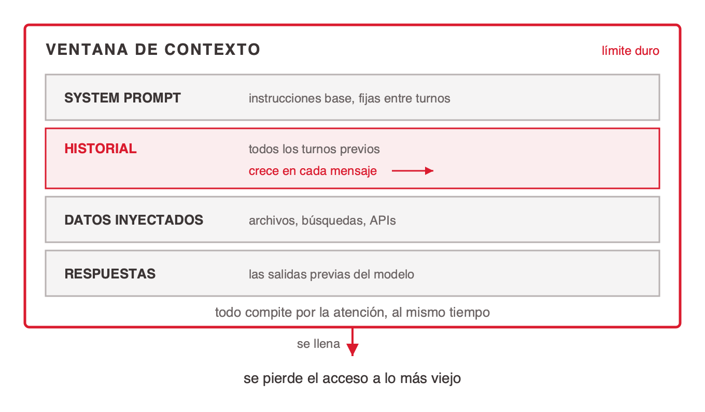
<!-- ascii-source:
  +===================== VENTANA DE CONTEXTO =====================+
  |                                                 (limite duro) |
  |   +--------------------------------------------------------+  |
  |   | SYSTEM PROMPT      instrucciones base, fijas            |  |
  |   +--------------------------------------------------------+  |
  |   | HISTORIAL          todos los turnos previos             |  |
  |   |                    crece en cada mensaje  >>>>          |  |
  |   +--------------------------------------------------------+  |
  |   | DATOS INYECTADOS   archivos, busquedas, APIs            |  |
  |   +--------------------------------------------------------+  |
  |   | RESPUESTAS         las salidas previas del modelo       |  |
  |   +--------------------------------------------------------+  |
  |                                                               |
  |        todo compite por la atencion, al mismo tiempo          |
  +===============================================================+
                              |
                    se llena  v
              se pierde el acceso a lo mas viejo
-->
<!-- ascii-note:
intent: mostrar la ventana de contexto como un contenedor finito con cuatro tipos de contenido apilados adentro, y su borde como limite duro que se desborda
emphasize: el marco exterior como limite duro; la banda HISTORIAL, unica que crece sola en cada turno; la flecha de desborde al pie
labels: "VENTANA DE CONTEXTO (limite duro)", "SYSTEM PROMPT", "HISTORIAL", "DATOS INYECTADOS", "RESPUESTAS", "todo compite por la atencion, al mismo tiempo", "se pierde el acceso a lo mas viejo"
-->

- ⚠️ Más contexto no es mejor contexto: el modelo no elige qué leer, procesa todo junto y lo importante se diluye.

### Sources

- `AIG4B-Clase-3-Prompting.md.md` (slide 6)

### Speaker notes

Recorré el contenedor banda por banda, porque las definiciones ya no están en la lámina. **System prompt**: las instrucciones base que fijan el comportamiento general del modelo, fijas entre turnos. **Historial**: toda la conversación previa; cada mensaje nuevo se concatena y ocupa lugar de forma acumulativa. **Datos inyectados**: archivos, resultados de búsqueda, respuestas de APIs externas. **Respuestas del modelo**: sus propias salidas previas, que también ocupan lugar. Cuatro cosas entran en la ventana y solo una la escribe el usuario en ese momento. Es la slide donde conviene romper la ilusión de que "el chat se acuerda": no se acuerda, la aplicación le reenvía todo el historial en cada turno. De ahí salen dos consecuencias que se cobran más adelante en la clase. La primera es de plata: el historial se paga entero, otra vez, en cada mensaje (la slide de la fórmula del costo lo cuantifica). La segunda es de calidad: el modelo reparte atención sobre todo lo que entra, así que meter más contexto puede empeorar la respuesta en lugar de mejorarla. Si el grupo pregunta por qué, adelantá el sesgo de recencia de la slide de limitaciones: el modelo mira más el principio y el final del prompt que el medio.

---

## 3. Ventana de contexto

### Content

- **La ventana de contexto es la memoria de trabajo activa del modelo. Contiene todo lo que puede ver en un momento dado para generar la respuesta: system prompt, historial, datos inyectados y sus propias respuestas.**
- **Es finita. Cuando se llena, el modelo pierde acceso a lo más viejo.**

**Tamaños en 2026**

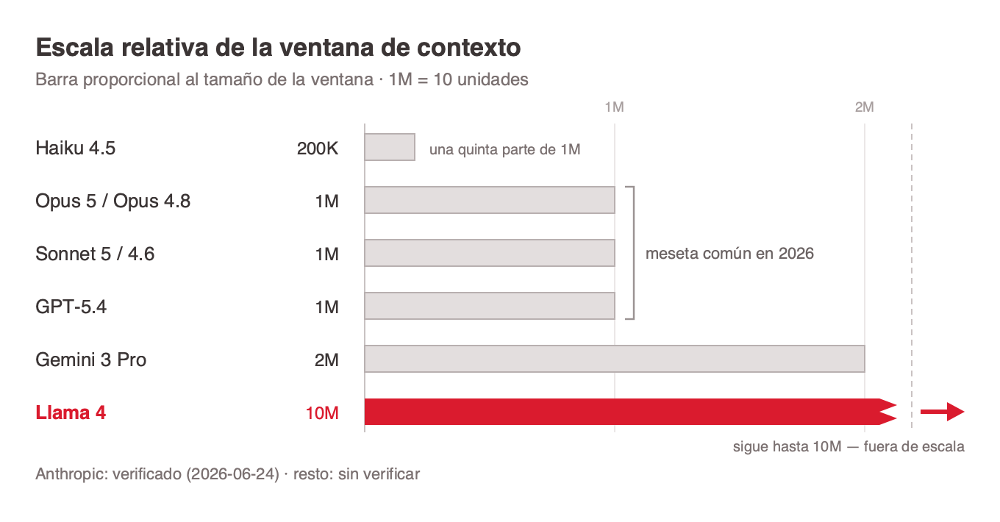
<!-- ascii-source:
  Escala relativa de la ventana de contexto   (1M = 10 unidades)

  Haiku 4.5          200K   ##
  Opus 5 / Opus 4.8  1M     ##########
  Sonnet 5 / 4.6     1M     ##########
  GPT-5.4            1M     ##########
  Gemini 3 Pro       2M     ####################
  Llama 4            10M    ##################################### ->

  Anthropic: verificado (2026-06-24)  |  resto: sin verificar
-->
<!-- ascii-note:
intent: comparar por magnitud, de un vistazo, lo que una tabla de cifras no transmite; la barra de 10M se corta al borde porque a escala real no entra en el lienzo
emphasize: el salto de 200K a 1M, y que 1M es hoy la meseta comun de casi todos los modelos; la barra truncada de Llama 4 con su flecha de continuidad
labels: nombre del modelo a la izquierda, cifra de ventana en el medio, barra proporcional a la derecha, y el pie que separa lo verificado de lo no verificado
-->

- La carrera por ventanas más largas es la frontera competitiva del momento.

### Sources

- `AIG4B-Clase-3-Prompting.md.md` (slide 7)
- Ventanas de los modelos Anthropic verificadas contra el catálogo vigente de la API de Claude (corte 2026-06-24).

### Speaker notes

La definición primero y la tabla después: la ventana es memoria de trabajo, no memoria a largo plazo. La analogía útil acá es la RAM contra el disco. Nada de lo que está en la ventana persiste entre sesiones, y nada de lo que quedó afuera existe para el modelo. Sobre la tabla: la fila de Anthropic está verificada contra el catálogo vigente de la API; las tres filas de otros proveedores vienen del deck original y no las pude verificar, así que decilas como orden de magnitud y no como dato preciso. El punto pedagógico está en otro lado: un millón de tokens ya dejó de ser una restricción práctica para casi todo trabajo de software, y que el cuello de botella se mudó del tamaño de la ventana al costo de llenarla.

---

## 4. ¿Cuánto es 1 millón de ~~Tolkien~~ tokens?

<!-- design: column-right -->

### Content


- **"Claude Code tiene ahora una ventana de contexto de 1 millón de tokens por defecto. Un millón de tokens es mucho: la trilogía de El Señor de los Anillos más El Hobbit tienen unas 576.000 palabras, lo que equivale a ~750.000 tokens. Las cuatro obras caben en un único prompt... y aún sobra espacio."**

| 📚 ~750K tokens | 💾 ¿Y un repositorio? |
|---|---|
| Toda la obra de Tolkien: El Hobbit más la trilogía de El Señor de los Anillos. | El código, los tests y la documentación de un servicio de tamaño medio entran cómodos. La cuenta exacta depende del repo. |

### Sources

- `AIG4B-Clase-3-Prompting.md.md` (slide 8) — cita verbatim en §Raw excerpts [8]. El deck original no atribuye la cita a un autor ni a una publicación.

### Speaker notes

Esta es la slide del "ah, mirá". Sirve para que la cifra deje de ser abstracta: 576.000 palabras de Tolkien son unos 750.000 tokens, y todavía sobran 250.000. La segunda columna es la traducción al mundo de ellos, y conviene decirla con honestidad: no tengo una medición del repo, tengo un orden de magnitud. Si querés hacerlo vivo, pediles que estimen cuántos tokens tiene el repositorio del trabajo práctico y después lo miden con el tokenizador en la slide siguiente. Aviso de derechos, por si el material se republica: el fotograma de Gandalf es de la película y el deck original no lo acredita.

---

## 5. Cómo se tokeniza

<!-- design: split-left -->

### Content

**Antes de llegar al modelo, todo texto se parte en piezas de un vocabulario fijo. Ese vocabulario es lo que decide cuántos tokens cuesta una frase, y cada familia de modelos tiene el suyo.**

| Encoding de `tiktoken` (OpenAI) | Vocabulario | Modelos que lo usan |
|---|---|---|
| `r50k_base` (gpt2) | 50.257 | GPT-2 y los primeros GPT-3 |
| `p50k_base` | 50.281 | Codex, text-davinci-002/003 |
| `cl100k_base` | 100.257 | GPT-3.5-turbo, GPT-4, embeddings v2/v3 |
| `o200k_base` | 199.999 | GPT-4o y la serie o |
| `o200k_harmony` | 201.087 | variante del anterior, formato *harmony* |

- **BPE, el algoritmo** Arranca de caracteres sueltos y fusiona los pares más frecuentes hasta llenar el vocabulario. Por eso lo común es un token y lo raro se parte en pedazos.
- **Vocabulario creciente** De cincuenta mil entradas a doscientas mil. Uno más grande corta menos: el mismo texto rinde menos tokens.
- **Los conteos no son comparables** Entre familias el número cambia, así que una estimación no se traslada. Para Claude el conteo se le pide a la API con `count_tokens`: estimarlo con `tiktoken` da un costo equivocado.

### Sources

- Vocabularios verificados contra el código fuente de `tiktoken` (`tiktoken_ext/openai_public.py`, consultado el 2026-09-01): `r50k_base` 50.257, `p50k_base` 50.281, `cl100k_base` 100.257, `o200k_base` 199.999, `o200k_harmony` 201.087. **El archivo no mapea encodings a modelos**: esa columna viene de la documentación de OpenAI y de fuentes secundarias, no del código.
- Catálogo vigente de la API de Claude: el conteo de tokens para modelos Claude se hace con el endpoint `count_tokens`, no con tokenizadores de otros proveedores.
- `gpt-tokenizer.web.md` — el playground interactivo, para verlo en vivo.

### Speaker notes

Esta lámina responde la pregunta que quedó abierta en la anterior: si un millón de tokens es toda la obra de Tolkien, ¿quién decide dónde se corta? La respuesta es BPE, y la intuición vale más que el algoritmo: se empieza con caracteres sueltos y se fusionan los pares que más aparecen, hasta llenar un vocabulario de tamaño fijo. Por eso las palabras comunes son un token y las raras se parten en pedazos. La tabla no la leas fila por fila; usala para mostrar una sola cosa, que es la columna del medio: el vocabulario se cuadruplicó en pocos años. Y de ahí sale la consecuencia práctica: un vocabulario más grande corta menos, así que el mismo texto da menos tokens en un modelo nuevo que en uno viejo. Los conteos no son comparables entre familias. El cierre es el que más les va a servir y el error que más se ve: estimar el costo de un prompt de Claude con tiktoken. Son tokenizadores distintos y el número no sirve; para Claude hay un endpoint que lo cuenta. Si querés hacerlo vivo, abrí el playground y pegá una línea de código: un identificador en camelCase se parte en tres o cuatro tokens, y eso explica por qué el código consume más de lo que uno cree.

---

## 6. Economía de tokens

### Content

**Los tokens son subpalabras, no palabras completas. El modelo procesa y factura en tokens, tanto los de entrada como los de salida.**

- "Ingeniería de Software" no cuenta como dos palabras: el tokenizador la parte en varios trozos, y la cuenta exacta cambia según el modelo.
- Un prompt de 2.000 tokens de entrada más una respuesta de 500 de salida cuesta unos **$0,014** con Claude Sonnet 4.6.

<!-- enlace de la forma: https://gpt-tokenizer.dev -->
- [Probarlo en tiempo real: gpt-tokenizer.dev](https://gpt-tokenizer.dev)

### Sources

- `AIG4B-Clase-3-Prompting.md.md` (slide 9)
- `gpt-tokenizer.web.md` — tokenizador interactivo, para verificar el corte en subpalabras en vivo.
- Derivación del costo: $0,0135 = (2.000 / 1.000.000 × $3) + (500 / 1.000.000 × $15), con la tarifa vigente de Claude Sonnet 4.6 ($3 / $15 por MTok). Redondeado a $0,014.

### Speaker notes

Momento de abrir gpt-tokenizer.dev en vivo y pegar una línea de código. El efecto es inmediato: un identificador en camelCase se parte en cuatro o cinco tokens, y un bloque de JSON con indentación se come muchísimos más de los que cualquiera estimaría a ojo. Ese es el punto: la intuición de "una palabra, un token" está mal, y está mal justo en la dirección que más importa, porque el código y el JSON tokenizan peor que la prosa. El costo de $0,014 parece nada, y lo es hasta que se multiplica por diez mil llamadas diarias. Guardá esa multiplicación para la slide siguiente, que es donde el número empieza a doler.

---

## 7. La fórmula del costo

### Content

**Costo total = (tokens de entrada × precio de entrada) + (tokens de salida × precio de salida)**

| Turno | Lo que escribe el usuario | Lo que la app le manda al modelo |
| --- | --- | --- |
| Mensaje 1 | "Hola, escribime una función..." | Solo el mensaje 1. |
| Mensaje 2 | "Ahora cambiale esto..." | Mensaje 1 + respuesta 1 + mensaje 2. |
| Mensaje 3 | "Y agregale esto otro..." | Mensaje 1 + resp. 1 + mensaje 2 + resp. 2 + mensaje 3. |

- 💡 **¿Por qué explota el consumo?** Para que el modelo mantenga el contexto, la aplicación le reenvía toda la conversación previa en cada turno. El modelo no recuerda nada entre llamadas: cada turno vuelve a leer todo desde cero, y eso es lo que se cobra.

### Sources

- `AIG4B-Clase-3-Prompting.md.md` (slide 10)

### Speaker notes

Esta es la slide que explica por qué la factura de un chatbot crece sin que crezca el uso. La fórmula tiene dos términos y el interesante es el primero: los tokens de entrada de un turno incluyen todo lo anterior. Un chat de veinte turnos paga el turno uno veinte veces. Señalá la tabla de izquierda a derecha una fila por vez y dejá que la tercera columna hable sola. Acá conviene sembrar dos cosas que se cobran después en la clase: prompt caching existe justo para atacar este crecimiento, y las técnicas avanzadas de la sección cinco compran calidad gastando tokens de salida, que son los caros. Si alguien pregunta por qué la salida cuesta cinco veces más que la entrada, la respuesta corta es que se genera token por token y no se paraleliza como la lectura del prompt.

---

## 8. Cómo funciona el caching

### Content

**El proveedor no guarda respuestas: guarda el estado ya calculado de un prefijo de tokens. De ahí sale la regla única que gobierna todo — coincidencia por prefijo — y también la facilidad con la que se rompe.**

- **Coincide por prefijo, no por contenido** No es "¿ya vi este texto antes?". El proveedor guarda el cómputo de los primeros N tokens del pedido; si esos N coinciden byte a byte con los de la llamada anterior, se reutilizan en vez de recalcularse.
- **Un byte distinto invalida todo lo que sigue** Y el orden del pedido es fijo: primero las herramientas, después el system prompt, después los mensajes. Por eso lo estable va adelante y lo que cambia en cada llamada va al final.
- **Hay un mínimo, y falla en silencio** Un prefijo por debajo del mínimo del modelo no se cachea: sin error, sin aviso. Un prompt corto puede estar marcado para cachear y no cachear nunca.
- **Se verifica en la respuesta** El contador de tokens leídos del caché dice si funcionó. Si da cero en llamadas repetidas, hay un invalidador escondido: una fecha en el system prompt, un JSON sin ordenar, una lista de herramientas que cambia de orden.

- 🎯 **Por qué encaja acá.** La bola de nieve de la lámina anterior es un prefijo que crece: cada turno agrega al final y deja intacto lo de antes. El caso ideal para el caching.

### Sources

- Catálogo vigente de la API de Claude (corte 2026-06-24): el caching es coincidencia por prefijo; cualquier cambio de byte en el prefijo invalida lo que sigue; el orden de armado es herramientas → system → mensajes; el prefijo mínimo cacheable depende del modelo y por debajo de ese umbral no cachea sin emitir error; el contador de tokens leídos del caché es la forma de verificarlo.

### Speaker notes

Esta lámina existe para que el caching no se lea como magia cuando lleguen a la sección de costos. La idea que tienen que llevarse es una sola: no se cachean respuestas, se cachea el cómputo de un prefijo. Y de ahí sale todo lo demás por deducción, así que en vez de enumerar reglas, deducilas en voz alta con ellos. Si lo que se guarda es el prefijo, entonces lo estable tiene que ir adelante — obvio. Si un byte cambia, todo lo que viene después se recalcula — también obvio. Los dos puntos que más les van a servir en la práctica son los dos últimos, porque fallan en silencio. Un prompt corto marcado para cachear puede no cachear nunca, y nadie te avisa. Y el invalidador clásico es meter la fecha y hora en el system prompt: cambia en cada llamada, está al principio, y tira abajo el caché entero. Por eso se verifica mirando el contador de tokens leídos del caché en la respuesta: si da cero en llamadas repetidas, hay un invalidador escondido. Cerrá conectando con la lámina anterior: la conversación que crece es un prefijo que crece, y por eso es el caso ideal.

---

## 9. Del chat al caché programático
### Content

**En un chat el prefijo crece solo: cada turno agrega al final y deja intacto todo lo anterior. En una aplicación no hay esa suerte — el pedido lo armás vos, y sos vos quien decide dónde corta la frontera entre lo que se reutiliza y lo que cambia.**

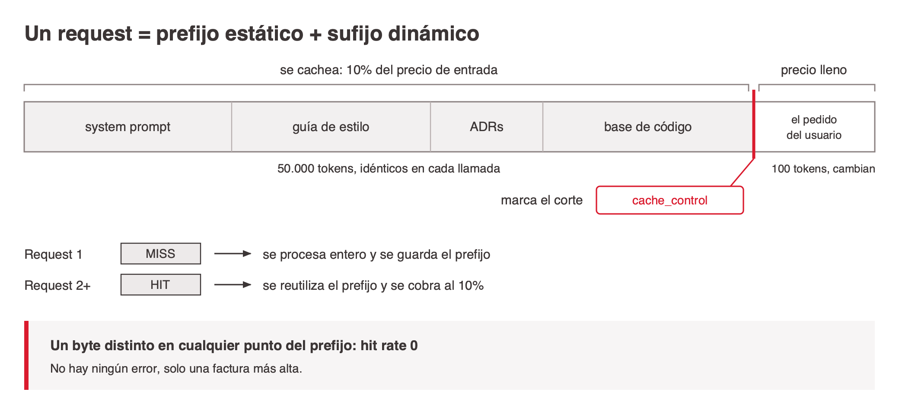
<!-- ascii-source:
  UN REQUEST  =  PREFIJO ESTATICO  +  SUFIJO DINAMICO

  |<----------- se cachea: 10% del precio -----------&gt;|<-- precio lleno --&gt;|
  +---------------------------------------------------+--------------------+
  | system prompt | guia de estilo | ADRs | base cod.  | el diff del user   |
  +---------------------------------------------------+--------------------+
   50.000 tokens, identicos en cada llamada             100 tokens, cambian
                                                     ^
                                                     |
                                    [ cache_control ] marca el corte

  Request 1    MISS  ->  se procesa entero y se guarda el prefijo
  Request 2+   HIT   ->  se reutiliza el prefijo y se cobra al 10%

  !!  un byte distinto en CUALQUIER punto del prefijo  ->  hit rate 0
      y no hay ningun error: solo una factura mas alta
-->
<!-- ascii-note:
intent: mostrar que el caching hace match por PREFIJO, no por contenido: la frontera entre lo estatico y lo dinamico es lo que decide si hay hit, y por eso el orden dentro del prompt es load-bearing
emphasize: la linea divisoria entre prefijo y sufijo con la marca [ cache_control ]; la desproporcion 50.000 contra 100 tokens; la advertencia final del fallo silencioso
labels: "PREFIJO ESTATICO", "SUFIJO DINAMICO", "se cachea: 10% del precio", "precio lleno", "cache_control", "MISS", "HIT", "hit rate 0"
-->

- **Monitorear el hit rate** Si `cache_read_input_tokens` da cero, algo está invalidando el prefijo en silencio.

**El caso típico de un equipo de software:** la guía de estilo, las decisiones de arquitectura ya documentadas —los *ADR*— y el fragmento de base de código que el asistente necesita son idénticos en cada consulta; el pedido del usuario son doscientos tokens. Ese reparto es el que el caching premia, y `cache_control` es la marca que dice dónde termina uno y empieza el otro.

### Sources

- `AIG4B-Clase-3-Prompting.md.md` (slide 46)
- Precio del cache hit (10% de la entrada) verificado contra el catálogo vigente de la API de Claude.

### Speaker notes

Esta es la lámina que cierra el puente, y conviene abrirla con una pregunta: cuando chatean con un asistente, ¿quién marca el corte? Nadie: el prefijo crece solo porque cada turno se agrega al final, y el proveedor lo aprovecha sin que ellos hagan nada. En una aplicación propia eso no pasa, porque el pedido lo arman ellos en cada llamada, y por eso hay que marcar el corte a mano. Ahí entra `cache_control`. Caminá el diagrama señalando las tres decisiones que se deducen del match por prefijo: cachear lo estático — base de conocimiento, system prompt, documentación de arquitectura, guía de estilo—, no cachear el input del usuario porque rompe el prefijo, y poner primero lo cacheable. La advertencia del pie es la que más les va a servir: si el system prompt lleva un `datetime.now()` adentro, el prefijo cambia en cada llamada y el hit rate es cero sin que nadie se entere, porque no hay error, solo una factura más alta. El caso del equipo de software es el ideal y vale decirlo: cincuenta mil tokens idénticos contra doscientos que cambian. Los números del ahorro los ven en la sección de costos; acá el foco es el mecanismo y quién marca el corte.

---

## 10. Prompt caching: implementación

### Content

**El caching se activa marcando las partes estáticas del prompt con un bloque `cache_control`.**

<!-- ascii-render: documentation-only -->
```python
import anthropic
client = anthropic.Anthropic()

# ESTATICO -- se cachea (50K tokens)
system_prompt = """Sos un revisor de codigo senior.
Guia de estilo, ADRs y convenciones: [... 50K ...]"""

response = client.messages.create(
    model="claude-sonnet-5",
    system=[{"type": "text", "text": system_prompt,
             "cache_control": {"type": "ephemeral"}}],
    # DINAMICO -- cambia en cada request
    messages=[{"role": "user",
               "content": "Revisa este diff: [... 100 ...]"}])

# Request 1     cache MISS  ->  se procesa y se guarda
# Request 2+    cache HIT   ->  se cobra al 10%
```

- **Parte estática (cacheable)** System prompt, guía de estilo, decisiones de arquitectura, base de conocimiento. Se marca con `cache_control`.
- **Parte dinámica (no cacheable)** El diff, el ticket, la consulta puntual. Cambia en cada request, así que va después del corte.
- **Hit de caché** Si el prefijo ya fue procesado, el proveedor lo reutiliza en vez de recalcularlo.

### Sources

- `AIG4B-Clase-3-Prompting.md.md` (slide 47)
- Derivación del ejemplo: 50.000 tokens a $3/MTok = $0,15 sin caché; con hit, 10% = $0,015.

### Speaker notes

Veinte líneas de código y una sola idea: la frontera entre lo que se cachea y lo que no la dibuja el programador, poniendo `cache_control` en el bloque correcto. Señalá el orden. Lo estático arriba, lo dinámico abajo, siempre, porque el match es por prefijo. Si alguien pone el diff arriba del system prompt, el caché no sirve para nada y no hay ningún error que lo avise. El ejemplo pasó de un system prompt de guías clínicas a la guía de estilo y los ADRs del repo, que es el caso real de un asistente de revisión de código: cincuenta mil tokens de convenciones que no cambian, cien tokens de diff que cambian siempre.

---

## 11. Tokenomics: el costo real

### Content

**En agosto de 2026 la Linux Foundation creó la Tokenomics Foundation, con 30 empresas fundadoras, para estandarizar cómo se mide el costo y el retorno de la IA. Su punto de partida es incómodo: el token es la parte visible de la cuenta, no la cuenta.**

- **El token es la unidad, no el total** Buena parte del costo no está en los tokens: cómputo, almacenamiento, base de datos, caché y el trabajo de los ingenieros. Pero el token es la unidad atómica consistente que atraviesa todos esos costos, y por eso sirve para contarlos.
- **Falta un lenguaje común** El problema que declaran es que no hay forma compartida de conectar gasto con valor. Cada proveedor cobra distinto, y esa fragmentación vuelve incomparable el costo total de propiedad entre organizaciones.
- **Se mide por llamada, no por token** Uno de los entregables del plan es un método estándar de *costo de servir*: la cuenta completa expresada como costo por llamada, para que el número corresponda al trabajo realmente hecho y no a una unidad interna del proveedor.

- 🎯 **Por qué importa para esta clase.** Goldman Sachs proyecta que el consumo de tokens se multiplique por 24 hacia 2030. Todo lo que vamos a ver después — caching, cascading, effort — son palancas sobre la parte visible de esa cuenta. La discusión que se está abriendo es cómo medir la parte que no se ve.

### Sources

- `research/web/tokenomics-foundation-linux/` — Linux Foundation, comunicado del 4 de agosto de 2026, capturado el 2026-08-28. Fundación lanzada con 30 miembros fundadores (entre ellos Accenture, IBM, JPMorganChase, Oracle, SAP, ServiceNow, Broadcom, Lenovo). Aportan verbatim: que el token es "una unidad atómica consistente de uso" mientras el costo real abarca cómputo, almacenamiento, base de datos, caché y trabajo humano; el objetivo de expresar el costo de servir "por llamada en vez de por token"; y la proyección de Goldman Sachs de 24x en consumo de tokens hacia 2030.
- Nota: la captura todavía no tiene registro en `research/corpus/` — falta la pasada del librarian sobre la carpeta nueva.

### Speaker notes

Esta lámina existe para que la fórmula de la lámina anterior no se lea como si fuera toda la verdad. Acaban de calcular costo por token, y acá aparece una fundación de la Linux Foundation, con treinta empresas grandes adentro, diciendo que ese número es la punta del iceberg. Es material fresco: se lanzó el 4 de agosto de este año, o sea hace tres semanas. Dos cosas para decir en voz alta. La primera es la buena noticia para la clase: aunque el token no sea todo el costo, es la unidad que atraviesa todos los demás, y por eso sirve para contar. La segunda es la incómoda: hoy no hay forma estándar de comparar el costo total entre proveedores, y por eso el ejercicio de la tabla de tarifas que van a ver en la sección siguiente es necesariamente parcial. Si alguien pregunta por qué les importa a ellos como ingenieros: porque el entregable que están proponiendo es medir costo por llamada en vez de por token, que es exactamente la unidad con la que uno razona cuando diseña un sistema. Y el número de Goldman Sachs, veinticuatro veces más consumo hacia 2030, es el que explica por qué esto se volvió urgente ahora.

---

## 12. Tokenomics: qué están construyendo

### Content

**La práctica se ordena alrededor de dos preguntas: qué cuesta realmente la IA, y cuánto vale la inteligencia que devuelve. El plan de trabajo son entregables concretos, no un manifiesto.**

- **Definiciones** Publicar qué es tokenomics y definir el valor y la densidad de un token, separando entrada, salida, razonamiento y caché. Sin vocabulario común no hay comparación posible.
- **Costo de servir** Un método estándar para medir la cuenta completa, expresada como **costo por llamada** en vez de costo por token, para que el número corresponda al trabajo hecho.
- **Medición de valor** Un marco que relacione el gasto con resultados, empezando por la proporción de trabajo que se completa sin intervención humana, medida contra lo que ese proceso cuesta hoy.
- **Telemetría de costo** Llevar el reporte de costos de IA a FOCUS, la especificación abierta de datos de facturación, para poder normalizar cifras entre proveedores.

- 🎯 **Lo más cercano a esta clase.** Uno de sus proyectos, *Big-T*, clasifica la complejidad de costo de una carga de trabajo **antes** de decidir a qué modelo enrutarla. Es exactamente la decisión que vamos a ver en la sección de costos, pero convertida en método.

### Sources

- `research/web/tokenomics-foundation-linux/` — Linux Foundation, comunicado del 4 de agosto de 2026. Aportan verbatim las dos preguntas que la práctica busca responder ("qué cuesta realmente la IA y cuál es el valor de la inteligencia"), los entregables del plan (definiciones incluyendo valor y densidad de token por entrada/salida/razonamiento/caché; modelo de referencia del costo completo; costo de servir expresado por llamada; marco de medición de valor a partir de la proporción de trabajo sin intervención humana; educación y certificación), el proyecto Big-T para clasificar complejidad de costo antes del ruteo entre modelos, y la telemetría de costos sobre la especificación FOCUS.

### Speaker notes

La lámina anterior planteó el problema; ésta muestra que hay un plan y no solo un diagnóstico, que es lo que la vuelve creíble. Las dos preguntas de arriba vale leerlas tal cual, porque son sorprendentemente honestas para un comunicado: qué cuesta realmente esto, y cuánto vale lo que devuelve. La segunda es la difícil y todavía nadie la sabe responder. De los cuatro entregables, el que más les va a servir como ingenieros es el segundo: pasar de costo por token a costo por llamada. El token es una unidad interna del proveedor; la llamada es la unidad con la que uno diseña un sistema, y por eso el cambio de unidad no es cosmético. El de medición de valor tiene una definición operativa linda y conviene señalarla: empiezan por la proporción de trabajo que se completa sin que intervenga una persona, contra lo que ese proceso cuesta hoy. Es medible, no es retórica. Y cerrá con Big-T, que es el puente directo a la sección que viene: clasificar la complejidad de costo de una carga antes de elegir modelo es exactamente el árbol de decisión y la cascada que van a ver, pero como método formal en vez de criterio de cada equipo.

---

## 13. Limitaciones de los LLM

### Content

| Alucinaciones | No-determinismo | Sesgo de recencia |
|---|---|---|
| El modelo predice texto plausible y no verifica hechos. Mitigación: restringirlo al contexto dado más revisión humana. | El mismo prompt produce respuestas distintas con temperature > 0. Temperature 0 da la mínima variabilidad; 2.0 la máxima. En producción: temperature baja más varias iteraciones. | El modelo presta más atención al principio y al final del prompt que al medio. Estrategia: instrucciones críticas al inicio, la consulta concreta al final. |

### Sources

- `AIG4B-Clase-3-Prompting.md.md` (slide 12)

### Speaker notes

Tres fallas de familia, no tres bugs. Ninguna se arregla con un modelo mejor, todas se administran con diseño del sistema alrededor del modelo. La de no-determinismo suele ser la que más molesta a esta audiencia, porque rompe la intuición de función pura: mismo input, distinto output. Y ojo con el atajo de "pongo temperature 0 y listo": baja la variabilidad, no la elimina, y en tareas creativas la degrada. El sesgo de recencia es el que menos se conoce y el más accionable: si el prompt tiene cincuenta mil tokens de contexto y la pregunta está en el medio, la respuesta empeora. Instrucción arriba, pregunta abajo. Las tres se retoman en la sección de técnicas avanzadas, así que dejalas planteadas y seguí.

---

## 14. ¿Por qué alucina un modelo?

### Content

**El modelo genera el token más probable dado el contexto. Cuando no tiene el dato, igual genera algo: la fluidez del texto no depende de que sea cierto.**

- **Sin acceso a hechos verificados** El modelo no consulta una base de verdad. Produce texto plausible a partir de patrones, y plausible no es lo mismo que correcto.
- **Entrenamiento incompleto o viejo** Con datos parciales o desactualizados, el modelo extrapola más allá de lo que sabe.
- **Confianza sin verificación** No distingue entre lo que sabe y lo que inventa. Responde con la misma seguridad en los dos casos.
- **Presión de completado** Siempre intenta terminar el texto, incluso sin información suficiente. Un espacio en blanco no es una salida válida para él.

### Sources

- `AIG4B-Clase-3-Prompting.md.md` (slide 13)

### Speaker notes

Cuatro causas y ninguna es un defecto de implementación: son consecuencias directas de cómo funciona un motor de completado. La tercera es la que hay que subrayar, porque es la que hace peligrosa a la alucinación en un equipo de software: el modelo no tiene un canal separado para decir "no sé". La probabilidad del token siguiente es alta tanto cuando recita algo que vio mil veces como cuando arma algo verosímil de la nada, y el texto sale con el mismo tono en ambos casos. La cuarta explica por qué la alucinación aparece justo en el peor momento: cuanto más raro el pedido, menos patrón hay y más inventa. Sembrá acá el vínculo con la tesis: si el modelo es un completador, el trabajo del ingeniero es acorralarlo con contexto y con verificación.

---

## 15. Alucinaciones: casos reales

### Content

- **Air Canada (2024)** El chatbot de la aerolínea inventó una política de reembolso que no existía. El tribunal falló en contra de la empresa, que tuvo que compensar al pasajero.
- **Abogados en EE.UU. (2023)** Dos abogados presentaron citas de jurisprudencia generadas por ChatGPT que no existían. El tribunal los sancionó.
- **Referencias bibliográficas falsas** Los modelos generan citas con autores, títulos y DOIs completos e inventados, con el formato exacto de una referencia real.
- **APIs y paquetes que no existen** Un asistente de código inventa funciones, parámetros y dependencias con la misma sintaxis convincente que el código válido. El compilador lo agarra; el reviewer distraído, no siempre.

### Sources

- `AIG4B-Clase-3-Prompting.md.md` (slide 13)

### Speaker notes

Los dos primeros casos son judiciales y están documentados: sirven para instalar que la alucinación ya tiene costo legal, no solo costo técnico. El de Air Canada es el más útil porque la defensa de la empresa fue que el chatbot era una entidad separada, y el tribunal la rechazó: el que despliega el modelo responde por lo que el modelo dice. El cuarto caso es el que le toca a esta audiencia de cerca, y conviene preguntarles si les pasó. La respuesta suele ser que sí. El detalle que hace la diferencia es que el código alucinado compila mal y se detecta rápido, pero una dependencia alucinada que alguien registra con ese nombre en el repositorio público es un vector de ataque real. Ahí engancha la sección de riesgos de la última parte de la clase.

---

## 16. Mitigar alucinaciones: el prompt

### Content

**Lo que se puede hacer dentro de la llamada al modelo, sin cambiar el sistema alrededor.**

- **Grounding en contexto** Instruir al modelo a responder solo con el contexto provisto, y a decir que no sabe cuando ese contexto no alcanza.
- **RAG (retrieval-augmented generation)** Recuperar e inyectar solo la información verificada y relevante para esa consulta, en vez de confiar en la memoria del modelo.
- **Temperature = 0** Minimizar la aleatoriedad en tareas de extracción y clasificación, donde la creatividad es un defecto.
- **Self-consistency** Generar varias respuestas independientes y quedarse con la más frecuente.
- **Revisión humana en el loop** El output es siempre un borrador. Alguien del equipo lo valida antes de que llegue a producción.

### Sources

- `AIG4B-Clase-3-Prompting.md.md` (slide 14)
- `self-consistency-wang.web.md` — Wang et al. (2022), la fuente primaria de self-consistency.

### Speaker notes

Cinco palancas ordenadas de la más barata a la más cara. Grounding es una línea de texto en el system prompt y ya cambia el comportamiento. RAG es infraestructura: alguien tiene que indexar, recuperar y decidir qué entra. Temperature 0 es gratis pero no es gratis en todas las tareas, así que aclará el alcance: extracción y clasificación sí, generación de texto no. Self-consistency se ve en detalle en la sección cinco, acá solo nombrala. Y la quinta es la que ningún equipo puede saltear: mientras la tasa de alucinación del sistema no esté medida, la revisión humana no es una etapa opcional del proceso, es la única garantía que hay.

---

## 17. Mitigar alucinaciones: el proceso

### Content

**El testing formal es la ventaja competitiva de un equipo de software acá: es la disciplina que ya se tiene y que la mayoría de los equipos de producto no aplica a los prompts.**

- **Dataset de evaluación** Mínimo 50 a 100 casos con ground truth del dominio, anotados por quien sabe.
- **Métricas de alucinación** Faithfulness score, hallucination rate, ROUGE-L. Sin métrica no hay umbral de aceptación.
- **Regression testing** Correr el eval set completo en cada cambio de prompt, igual que la suite de tests en cada commit.
- **Red teaming** Probar con casos ambiguos y contradictorios antes de salir a producción.

- 🎯 **Regla de oro: un sistema cuya tasa de alucinación no se puede medir no se despliega.**

### Sources

- `AIG4B-Clase-3-Prompting.md.md` (slide 14)

### Speaker notes

Acá la clase les habla en su idioma y conviene decirlo de frente: las cuatro prácticas de esta slide son CI/CD aplicado a un artefacto que casi nadie versiona ni testea. El dataset de evaluación es el fixture, las métricas son los asserts, el regression testing es el pipeline y el red teaming es el fuzzing. La pregunta que suele aparecer es de dónde salen los 50 a 100 casos. Respuesta honesta: de producción, mirando lo que el sistema ya respondió mal, y anotando a mano. No hay atajo. La regla de oro del cierre es la frase para llevarse, y se retoma en la sección cinco con la slide de prompts sin verificación.

---

## 18. Modelo mental: motores de completado

### Content

**Los LLM completan patrones vistos en el entrenamiento y no entienden la intención. Pensarlos como un autocompletado muy sofisticado cambia cómo se escribe el prompt.**

**Cómo es el modelo**

- **Fortaleza** Muy bueno reconociendo patrones que vio muchas veces.
- **Debilidad** Alucina cuando el patrón no estaba en el entrenamiento.
- **Sin razonamiento interno** Predice el siguiente token más probable, y nada más.

**Qué hacer con eso**

- **Prompt vago** "Extraé nombre y email" puede fallar, porque no hay un patrón explícito que completar.
- **Prompt estructurado** Darle el patrón de completado servido:
  `Nombre: [campo]` / `Email: [campo]` / `De: [texto]`

### Sources

- `AIG4B-Clase-3-Prompting.md.md` (slide 15)

### Speaker notes

Esta slide es el ensayo de la tesis, y por eso vale la pena bajar la velocidad. Si el modelo completa patrones, entonces un prompt bien escrito es un patrón fácil de completar, y uno mal escrito es un patrón ambiguo. El ejemplo de la derecha lo muestra en cuatro líneas: el mismo pedido, escrito como plantilla, deja de tener grados de libertad. Es el mismo mecanismo que explica por qué funcionan las etiquetas XML de la sección tres y los ejemplos few-shot de la sección cuatro. Anticipá que en la sección cinco esto mismo va a explicar por qué chain of thought mejora la precisión: escribir los pasos es generar el patrón que hace más probable el token correcto al final.

---

# 2. Modelos y costos

**Goal of this section:** Convertir la elección de modelo en una decisión con números: qué cobra cada uno, cuánto ahorra el caching y cuándo conviene encadenar un modelo barato con uno caro.

---

## 1. Tarifas: familia Claude

### Content

| Modelo | Generación | Ventana | Entrada ($/MTok) | Salida ($/MTok) |
|---|---|---|---|---|
| Fable 5 | 2026 | 1M | $10,00 | $50,00 |
| Opus 5 | 2026 | 1M | $5,00 | $25,00 |
| Opus 4.8 | 2026 | 1M | $5,00 | $25,00 |
| Sonnet 5 | 2026 | 1M | $2,00 | $10,00 |
| Sonnet 4.6 | 2026 | 1M | $3,00 | $15,00 |
| Haiku 4.5 | 2025 | 200K | $1,00 | $5,00 |

- **Modificadores de tarifa** Cache hit: 10% del precio de entrada · Batch: 50% de la tarifa · Fast Mode (Opus 5 y Opus 4.8): $10 / $50 · Búsqueda web: $10 por cada 1.000 búsquedas · Ejecución de código: 50 h gratis por día, después $0,05/hora.

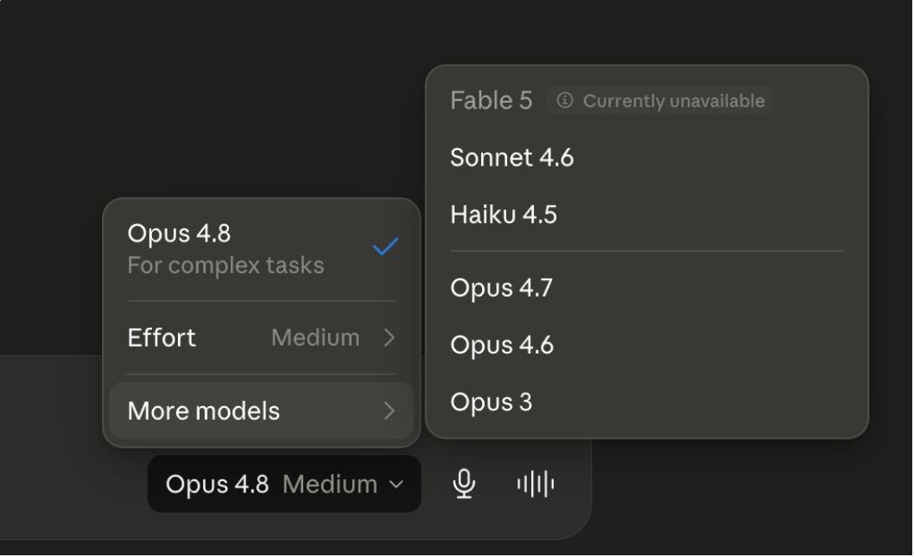

### Sources

- `AIG4B-Clase-3-Prompting.md.md` (slide 11) — tarifario y captura del selector de modelo.
- Precios, ventanas y niveles de effort verificados contra el catálogo vigente de la API de Claude (corte 2026-06-24). Correcciones respecto del deck original: se agregaron Opus 5 y Sonnet 5, y la lista de niveles de effort incluye `medium`, que el deck omitía.
- Derivación del cache hit: $0,50 en Opus 4.8 = 10% de $5,00 de entrada; la misma relación se cumple en las cuatro filas del deck original.

### Speaker notes

Dos cosas y ninguna es la tabla. La primera: la salida cuesta cinco veces la entrada en toda la familia, así que la variable que hay que vigilar es cuánto habla el modelo, no cuánto se le manda. La segunda: entre Haiku 4.5 y Fable 5 hay un factor diez de precio, y esa distancia es la que hace que valga la pena la cascada que viene después. Mostrales la captura: el selector de modelo y de esfuerzo está a la vista en la interfaz, no escondido en la API — el esfuerzo lo trabajamos en detalle en la sección de técnicas avanzadas. Si preguntan por Fable 5, aclará que la captura lo muestra como no disponible en ese momento y que la tabla sí le pone precio: son dos estados del mismo producto en fechas distintas.

---

## 2. Elegir modelo: árbol de decisión

### Content

**Cuatro preguntas en orden. La primera que dé "sí" define el modelo.**

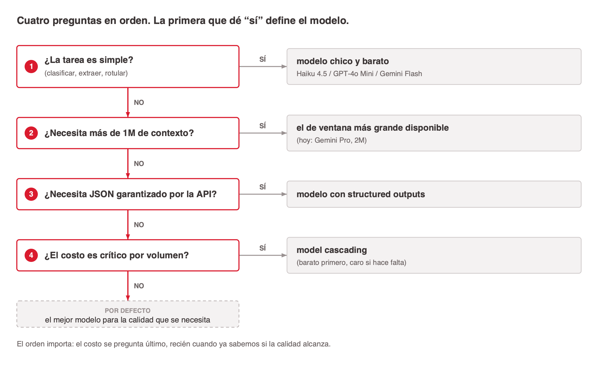
<!-- ascii-source:
  ¿La tarea es simple?
  (clasificar, extraer, rotular)
       |
       +-- SI --&gt; modelo chico y barato
       |            Haiku 4.5 / GPT-4o Mini / Gemini Flash
       NO
       |
  ¿Necesita mas de 1M de contexto?
       |
       +-- SI --&gt; el de ventana mas grande disponible
       |            (hoy: Gemini Pro, 2M)
       NO
       |
  ¿Necesita JSON garantizado por la API?
       |
       +-- SI --&gt; modelo con structured outputs
       |
       NO --&gt; el mejor modelo para la calidad que se necesita
       |
  ¿El costo es critico por volumen?
       |
       +-- SI --&gt; model cascading (barato primero, caro si hace falta)
-->
<!-- ascii-note:
intent: mostrar la eleccion de modelo como una cascada de cuatro preguntas en orden fijo, donde la primera que da "si" corta la decision; el orden de las preguntas es el contenido, no los nombres de modelo que devuelve
emphasize: la columna de decisiones encadenadas y las salidas de cada rama SI; que la pregunta de costo va ultima, despues de resolver dificultad, contexto y formato
labels: "¿La tarea es simple?", "¿Necesita mas de 1M de contexto?", "¿Necesita JSON garantizado por la API?", "¿El costo es critico por volumen?", y las salidas de cada rama
-->

### Sources

- `AIG4B-Clase-3-Prompting.md.md` (slide 45)
- Nombres de modelo actualizados: el árbol original recomendaba GPT-3.5 y Gemini 1.5 Pro, dos generaciones atrás del resto del deck.

### Speaker notes

El árbol vale más por el orden de las preguntas que por los nombres que devuelve. Primero la dificultad de la tarea, porque es la que más plata mueve: si clasificar tickets se puede hacer con un modelo chico, cualquier discusión sobre caching es secundaria. Segundo el contexto, que es una restricción dura y no negociable. Tercero el formato de salida, que en la práctica decide quién queda en carrera cuando el output alimenta código. Y recién al final el costo, porque optimizar costo antes de saber si la calidad alcanza es optimizar lo que no importa. Decí también por qué el árbol nombra familias y no versiones: los nombres cambian cada seis meses, las preguntas no.

---

## 3. Prompt caching: los números

### Content

**El mismo workload de 10.000 consultas, con 80% de hit rate.**

| Escenario | Cuenta | Costo |
|---|---|---|
| Sin caching | 10.000 × 50.100 tokens = 501M | **$1.503,00** |
| Misses (20%) | 2.000 × 50.100 tokens = 100,2M | $300,60 |
| Hits (80%) | 8.000 × (50.000 × 0,10 + 100) = 40,8M equivalentes | $122,40 |
| **Con caching** | | **$423,00** |

- 🎯 **Ahorro: $1.080,00 sobre $1.503,00, un 72%.**
- ⚠️ La cuenta ignora el costo de escritura del caché, que se cobra por encima de la tarifa de entrada la primera vez. Con 10.000 consultas sobre el mismo prefijo, ese costo se diluye.

### Sources

- `AIG4B-Clase-3-Prompting.md.md` (slide 46)
- Derivaciones, a $3/MTok (Claude Sonnet 4.6): sin caching = 501.000.000 / 1.000.000 × $3 = $1.503,00 · misses = 100.200.000 / 1.000.000 × $3 = $300,60 · hits = 8.000 × 5.100 tokens equivalentes = 40.800.000, × $3/MTok = $122,40 · total = $423,00 · ahorro = $1.503,00 − $423,00 = $1.080,00 = 71,9% de $1.503,00.

### Speaker notes

Esta slide corrige un error del deck original, y vale la pena decirlo en voz alta porque enseña algo: el deck declaraba $450 de costo con caching y un ahorro del 70%, y la cuenta no cerraba. Rehecha da $423 y 72%. La diferencia es chica en plata y grande en método: una cifra que nadie recalculó sobrevivió a todas las revisiones porque sonaba razonable. Es el mismo problema que van a tener con las salidas de un LLM. Sobre la fila de hits: los 5.100 tokens equivalentes salen de 50.000 cacheados al 10% más los 100 dinámicos a precio completo. La advertencia del final es honesta y conviene no saltearla, porque en un workload de pocas llamadas por prefijo la escritura del caché se puede comer el ahorro.

---

## 4. Model cascading

### Content

**Intentar primero con el modelo barato. Si la confianza es baja, escalar al caro. El ahorro depende de que el gating de confianza sea confiable.**

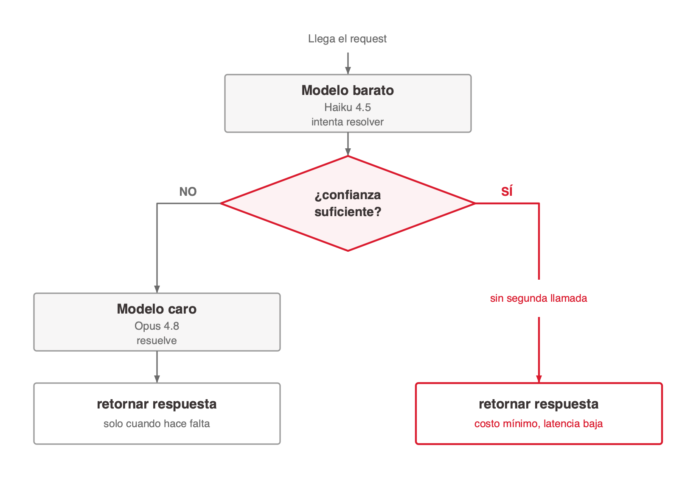
<!-- ascii-source:
  Request entra
       |
       v
  +---------------------------+
  |  Modelo barato            |
  |  (Haiku 4.5)              |
  |  intenta resolver         |
  +---------------------------+
       |
       v
  ¿confianza suficiente?
       |
       +-- SI --&gt; retornar respuesta      (costo minimo, latencia baja)
       |
       +-- NO --&gt; +---------------------------+
                  |  Modelo caro             |
                  |  (Opus 4.8)              |
                  |  resuelve                |
                  +---------------------------+
                            |
                            v
                     retornar respuesta      (solo cuando hace falta)
-->

<!-- ascii-note:
intent: mostrar el flujo de dos etapas del model cascading, con el gate de confianza como el punto de decision que define si el ahorro existe
emphasize: el rombo de decision "¿confianza suficiente?" y las dos ramas con su costo asociado; la rama SI es la que produce el ahorro
labels: "Modelo barato (Haiku 4.5)", "¿confianza suficiente?", "Modelo caro (Opus 4.8)", costo minimo / solo cuando hace falta
-->

### Sources

- `AIG4B-Clase-3-Prompting.md.md` (slide 48)
- Nombres de modelo actualizados: el deck original nombraba "Haiku/GPT-3.5" y "GPT-4/Sonnet", dos generaciones atrás del resto del deck.

### Speaker notes

La idea es de una línea y la trampa está en el rombo del medio. Todo el ahorro del cascading depende de que el sistema sepa cuándo la respuesta barata no alcanza, y esa señal casi nunca viene servida. Algunos proveedores devuelven log-probabilities y sirven; con otros hay que armar el gate a mano, por ejemplo pidiéndole al modelo chico que declare su confianza, con el problema obvio de que un modelo mal calibrado declara alta confianza sobre cosas que inventó. Preguntales cómo lo resolverían. Suele salir la idea de una segunda llamada de verificación, y ahí conviene señalar que esa llamada también cuesta y puede comerse el ahorro. La slide siguiente da los criterios para decidir si vale la pena.

---

## 5. Cascading: cuándo sí y cuándo no

### Content

**Cuándo conviene**

- **Alto volumen de tareas parecidas** Muchas consultas con una distribución de dificultad predecible.
- **Señal de confianza clara** El sistema puede saber cuándo la respuesta barata no alcanza.
- **Presión de costo con piso de calidad** Hay que ahorrar sin bajar la precisión.

**Cuándo evitarlo**

- **Latencia baja requerida** Cada escalón agrega una llamada más.
- **Confianza difícil de medir** Sin señal confiable, el routing falla en silencio.
- **Bajo volumen** La complejidad de mantener el routing no se paga.

### Sources

- `AIG4B-Clase-3-Prompting.md.md` (slide 48)

### Speaker notes

La fila que decide es la última de la tabla. El cascading no es una configuración, es un componente más del sistema: hay que rutear, monitorear el porcentaje de escalados y detectar cuándo el gate se desalinea. Un equipo chico que procesa cien consultas por día está pagando esa complejidad para ahorrar unos dólares. Un equipo que procesa cien mil, no. Si querés cerrar con una regla práctica: medí primero cuánto cuesta hacer todo con el modelo bueno a effort bajo. Muchas veces eso alcanza y no hace falta cascada, porque un modelo nuevo a effort bajo suele rendir como el anterior a effort alto, y un solo modelo mantiene un solo namespace de caché.

---

# 3. Prompts estructurados

**Goal of this section:** Pasar del prompt escrito a mano al prompt con anatomía: seis componentes, delimitadores explícitos y un contrato de salida que el código pueda validar.

---

## 1. Los 6 componentes

### Content

**La diferencia entre un prototipo que a veces anda y un sistema de producción suele estar en la estructura del prompt, no en la redacción.**

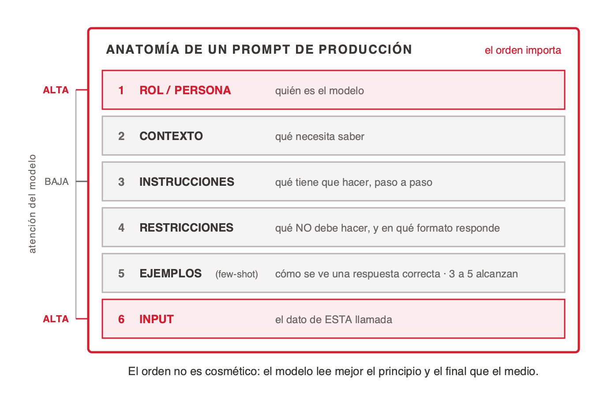
<!-- ascii-source:
  ANATOMIA DE UN PROMPT DE PRODUCCION

  atencion
  del modelo
            +--------------------------------------------------+
    ALTA >  | 1  ROL / PERSONA     quien es el modelo           |
            +--------------------------------------------------+
            | 2  CONTEXTO          que necesita saber           |
            +--------------------------------------------------+
    BAJA >  | 3  INSTRUCCIONES     que tiene que hacer, paso    |
            |                      a paso                       |
            +--------------------------------------------------+
            | 4  RESTRICCIONES     que NO debe hacer, y en que  |
            |                      formato responde             |
            +--------------------------------------------------+
            | 5  EJEMPLOS          como se ve una respuesta     |
            |    (few-shot)        correcta -- 3 a 5 alcanzan   |
            +--------------------------------------------------+
    ALTA >  | 6  INPUT             el dato de ESTA llamada      |
            +--------------------------------------------------+

  El orden no es cosmetico: el modelo lee mejor el principio y el final
  que el medio, por eso el rol va arriba y el input abajo.
-->
<!-- ascii-note:
intent: mostrar el prompt como un bloque compuesto de seis partes apiladas en un orden que importa, y ligar ese orden al sesgo de recencia (el modelo atiende mejor el principio y el final que el medio)
emphasize: la pila de seis bandas numeradas como una sola unidad; los marcadores ALTA / BAJA / ALTA de la izquierda, que son el argumento de por que ese orden y no otro
labels: "ROL / PERSONA", "CONTEXTO", "INSTRUCCIONES", "RESTRICCIONES", "EJEMPLOS (few-shot)", "INPUT", eje de atencion ALTA / BAJA / ALTA, y la linea de cierre sobre el orden
-->

### Sources

- `AIG4B-Clase-3-Prompting.md.md` (slide 17)
- `aitutorial-structured-prompt-engineering.web.md` — anatomía de seis componentes y la tesis de apertura ("the difference between a flaky prototype and a reliable production system often comes down to prompt structure").

### Speaker notes

Seis componentes y el orden importa. Las definiciones ya no están en la lámina, así que van habladas mientras señalás cada banda. **Rol**: fija el nivel de expertise y los patrones de comportamiento. **Contexto**: la información de fondo que la tarea necesita, el servicio, las convenciones del equipo. **Instrucciones**: qué hacer, paso a paso, y cuanto más específicas mejor. **Restricciones**: los límites y el formato de salida. **Ejemplos**: casos resueltos que demuestran el comportamiento esperado. **Input**: los datos concretos de esta llamada. Rol y contexto van arriba porque condicionan todo lo que sigue, y porque el modelo presta más atención al principio del prompt. El input va último por la misma razón invertida: es lo que tiene que estar fresco cuando empieza a generar. La discusión que suele aparecer es si hace falta todo esto para pedir un resumen. No, y conviene decirlo: los seis componentes son la anatomía de un prompt de producción, el que corre diez mil veces por día y tiene que dar el mismo formato siempre. Para una consulta única en el chat, alcanza con instrucciones e input. El ejemplo de la slide siguiente muestra los seis armados.

---

## 2. Un prompt completo

### Content

**Los seis componentes armados, sobre una tarea real: revisar un pull request.**

<!-- ascii-render: documentation-only -->
```
# [1] ROL / PERSONA
Sos un revisor de codigo senior, con experiencia en sistemas de alta disponibilidad.

# [2] CONTEXTO
Estas revisando un pull request sobre el servicio de facturacion.
Las convenciones del equipo estan en CONTRIBUTING.md y en la guia de estilo del lenguaje.

# [3] INSTRUCCIONES
1. Lee el diff completo antes de comentar.
2. Lista los problemas mas graves (maximo 3).
3. Para cada uno, indica archivo y linea.
4. Propone un fix concreto.

# [4] RESTRICCIONES
- No reescribas el modulo entero: solo el fragmento afectado.
- Comenta unicamente lo que aparece en el diff.
- Formato de salida: JSON con las claves severidad, archivo, linea, problema, fix.

# [5] EJEMPLOS (Few-shot)
Diff: se agrega open(path) sin with ni close() en billing/export.py, linea 42.
-> {"severidad": "alta", "archivo": "billing/export.py", "linea": 42,
    "problema": "El descriptor no se cierra si la escritura lanza excepcion.",
    "fix": "Usar with open(path) as f: en lugar de open(path)."}

# [6] INPUT
Diff: en billing/invoice.py, linea 118, se concatena input del usuario
dentro de una query SQL con un f-string.
```

### Sources

- `AIG4B-Clase-3-Prompting.md.md` (slide 17) — estructura de seis bloques del prompt original.
- `aitutorial-structured-prompt-engineering.web.md` — la fuente promete el prompt armado pero la extracción lo perdió; este ejemplo es propio, escrito sobre el esqueleto de la fuente.

### Speaker notes

Leé el prompt en voz alta, bloque por bloque, y hacé notar dos cosas. La primera: el bloque de restricciones es el que más trabajo hace, y es el que la gente saltea. "Comentá solo lo que aparece en el diff" es lo que impide que el modelo se ponga a opinar sobre archivos que no se tocaron. La segunda: el ejemplo few-shot no muestra solo la respuesta, muestra el formato exacto, y por eso el modelo lo copia. Buen momento para una pregunta al grupo: qué pasa si sacamos el bloque 5. Respuesta: el JSON sale, pero con claves distintas cada vez, y el código que lo parsea empieza a romperse. Aclará que este prompt es propio: la fuente que lo promete lo perdió en la extracción.

---

## 3. Salidas estructuradas: JSON Schema

### Content

**Imponer un esquema de salida reduce los errores de parseo y los reintentos, y vuelve la salida verificable por código.**

**Dos enfoques**

- **Esquema en el prompt** Incluir el formato JSON en las instrucciones. Más flexible, sin garantías.
- **Modo JSON de la API** Usar `response_format: json_object`. Más confiable: garantiza estructura válida.

<!-- ascii-render: documentation-only -->
```
{
  "severidad": "alta | media | baja",
  "archivo": "string",
  "linea": "number",
  "problema": "string",
  "fix": "string"
}
```

- ✅ **Validación automática** La salida se verifica con el esquema, sin leerla a mano.
- ✅ **Menos errores de parseo** Menos fallos en el pipeline y menos reintentos.
- ✅ **Integración directa** El JSON entra al issue tracker o al bot de review sin traducción intermedia.

<!-- enlace de la forma: https://aitutorial.dev/prompting/structured-prompt-engineering -->
- [Ver ejemplo interactivo en aitutorial.dev →](https://aitutorial.dev/prompting/structured-prompt-engineering)

### Sources

- `AIG4B-Clase-3-Prompting.md.md` (slide 18)
- `aitutorial-structured-prompt-engineering.web.md` — la distinción entre incluir el esquema en el prompt y usar la funcionalidad de salidas estructuradas de la API, y la afirmación sobre parseo y reintentos.

### Speaker notes

La distinción entre los dos enfoques es la que hay que dejar clara, porque se confunde todo el tiempo. Pedir el formato en el prompt es una sugerencia: el modelo casi siempre obedece y ese casi es el problema, porque el uno por ciento que falla aparece en producción a las tres de la mañana. La funcionalidad de salidas estructuradas de la API es una garantía a nivel de decodificación, no una instrucción. Si el output alimenta código, se usa la segunda. El esquema de la slide es el del revisor de código de la slide anterior, así que se ve el circuito completo: el prompt pide, el esquema define, el código valida. Y una advertencia útil: un esquema muy estricto sobre una tarea ambigua no arregla la ambigüedad, la esconde en un campo con un valor plausible.

---

## 4. XML: estructura semántica

<!-- design: split-right -->

### Content

**Las etiquetas marcan dónde empieza y termina cada parte del prompt. El modelo no tiene que inferir la estructura: se la das dibujada.**

<!-- ascii-render: documentation-only -->
```
<tarea>Clasificar issues de GitHub</tarea>
<instruccion>
Devolve UNA sola palabra: bug, feature o pregunta.
Para cada <entrada>, produci la <salida> correspondiente.
</instruccion>
<ejemplos>
  <ejemplo>
    <entrada>Al exportar a CSV con mas de 10.000 filas, el proceso corta en la 8.192.</entrada>
    <salida>bug</salida>
  </ejemplo>
  <ejemplo>
    <entrada>Estaria bueno poder filtrar el listado por fecha de creacion.</entrada>
    <salida>feature</salida>
  </ejemplo>
  <ejemplo>
    <entrada>¿El endpoint /v2/orders soporta paginacion por cursor?</entrada>
    <salida>pregunta</salida>
  </ejemplo>
</ejemplos>
<entrada>
Despues de actualizar a la 3.2, el login con SSO devuelve 500 en staging.
</entrada>
```

- **Fronteras explícitas** Tarea, instrucciones, ejemplos y entrada quedan separados sin ambigüedad. Nada se confunde con nada.
- **Formato que ya conocen** Los LLM se entrenaron con enormes cantidades de HTML y XML de la web, así que la notación les resulta familiar.
- **La salida también se delimita** Pedir la respuesta dentro de una etiqueta vuelve trivial el parseo y evita que el modelo mezcle explicación con resultado.
- **El overhead se paga solo** Las etiquetas suman tokens, pero se compensan con menos reintentos y menos errores de parseo. Si el prompt es estable, el caching lo absorbe.

### Sources

- `AIG4B-Clase-3-Prompting.md.md` (slide 19)
- `aitutorial-structured-prompt-engineering.web.md` — por qué funcionan las etiquetas (entrenamiento sobre HTML/XML, fronteras claras en el contexto) y el overhead de tokens compensado por caching. La misma fuente atribuye un "40-60% menos de alucinaciones" a "teams report", sin estudio ni medición: por eso la afirmación queda cualitativa acá.

### Speaker notes

El argumento de por qué funcionan las etiquetas es el mismo de la slide del motor de completado: el modelo vio millones de documentos con esta forma, así que una etiqueta de apertura es un patrón fortísimo. La segunda razón es más práctica: sin delimitadores, el modelo no sabe dónde termina la instrucción y dónde empieza el dato, y ese es el agujero por donde entra una inyección de prompt. Sobre las dos donas: el deck original les ponía 40% y 60% de reducción de alucinaciones, y esa cifra no tiene respaldo. La fuente la atribuye a "lo que reportan los equipos", sin estudio. Así que la afirmación queda cualitativa y las donas están marcadas para rehacer o retirar en el polish.

---

# 4. In-context learning

**Goal of this section:** Mostrar que los ejemplos dentro del prompt cambian el comportamiento del modelo sin tocar sus pesos, y dar el criterio para elegir cuántos poner.

---

## 1. In-context learning (ICL)

### Content

**Capacidad del modelo de aprender un patrón a partir de ejemplos puestos en el prompt, sin modificar sus pesos. No se re-entrena: reconoce el patrón en los ejemplos y lo aplica al caso nuevo.**

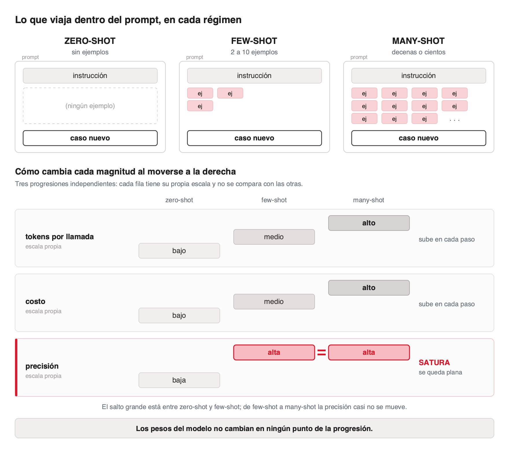
<!-- ascii-source:
  Lo que viaja dentro del prompt, en cada regimen

  ZERO-SHOT            FEW-SHOT                  MANY-SHOT
  sin ejemplos         2 a 10 ejemplos           decenas o cientos

  [ instruccion ]      [ instruccion ]           [ instruccion ]
                       [ ej ][ ej ]              [ ej ][ ej ][ ej ][ ej ]
                       [ ej ]                    [ ej ][ ej ][ ej ][ ej ]
                                                 [ ej ][ ej ]  ...
  [ caso nuevo  ]      [ caso nuevo  ]           [ caso nuevo  ]

  tokens por llamada  -----------------------------------------&gt;  suben
  precision           -----------------------------------------&gt;  sube y satura
  costo               -----------------------------------------&gt;  sube siempre

  Los pesos del modelo no cambian en ningun punto de la progresion.
-->
<!-- ascii-note:
intent: mostrar que los tres regimenes de in-context learning son el MISMO prompt con distinta cantidad de ejemplos intercalados entre la instruccion y el caso nuevo, y que la progresion tiene un costo monotono contra una precision que satura
emphasize: las tres columnas como variaciones de una misma estructura; el bloque de ejemplos que crece de vacio a saturado; el contraste entre "precision sube y satura" y "costo sube siempre"
labels: "ZERO-SHOT", "FEW-SHOT", "MANY-SHOT", "instruccion", "ej", "caso nuevo", ejes tokens / precision / costo, y la linea de cierre sobre los pesos
-->

### Sources

- `AIG4B-Clase-3-Prompting.md.md` (slide 22)
- `few-shot-learners-brown.web.md` — Brown et al. (2020), el paper de GPT-3: "with tasks and few-shot demonstrations specified purely via text interaction with the model", sin actualizaciones de gradiente ni fine-tuning. El término *in-context learning* y la taxonomía zero/one/few-shot son del cuerpo del paper, no del abstract capturado.

### Speaker notes

La frase que hay que dejar clavada es "sin modificar los pesos", y el diagrama la sostiene: las tres columnas son el mismo prompt, con más o menos ejemplos metidos entre la instrucción y el caso. Las definiciones van habladas. **Zero-shot**: solo la instrucción, sin ejemplos, todo depende del conocimiento preentrenado. **Few-shot**: entre 2 y 10 casos resueltos antes del caso a resolver, y es el régimen más usado en producción. **Many-shot**: decenas o cientos de ejemplos, para tareas complejas o con mucha variabilidad. Señalá los tres ejes del pie, porque ahí está la decisión: la precisión satura y el costo no. Para esta audiencia el contraste natural es con fine-tuning: fine-tuning cambia el artefacto y cuesta una corrida de entrenamiento, in-context learning cambia el prompt y cuesta tokens. Eso reordena la intuición de cuándo conviene cada cosa. El dato histórico ayuda: la capacidad se documentó en el paper de GPT-3 en 2020, y lo llamativo entonces fue que nadie la había programado, apareció al escalar. Un matiz de honestidad, por si alguien va a la fuente: el término "in-context learning" y la taxonomía de zero, one y few-shot están en el cuerpo del paper, no en el abstract.

---

## 2. Zero-shot vs. few-shot

<!-- slide nueva: el deck original define zero-shot y nunca lo ejemplifica -->

### Content

**Mismo modelo, misma tarea, mismo input. Lo único que cambia es si hay ejemplos.**

| Zero-shot | Few-shot |
|---|---|
| `Clasifica la severidad de este issue.`<br><br>`Issue: el export a CSV corta en la fila 8.192.`<br><br>→ `"Parece un problema de tamaño de buffer. Severidad media-alta, dependiendo del uso."` | `Clasifica la severidad como CRITICO, ALTO o BAJO.`<br><br>`Issue: caen todos los checkouts en produccion. -> CRITICO`<br>`Issue: el tooltip esta en ingles. -> BAJO`<br><br>`Issue: el export a CSV corta en la fila 8.192.`<br><br>→ `ALTO` |
| Formato libre, vocabulario propio, imposible de parsear. | Una etiqueta del conjunto pedido. El código la consume directo. |

- 💡 Los ejemplos no le enseñan al modelo qué es la severidad. Le enseñan qué forma tiene la respuesta y dónde están los cortes entre categorías.

### Sources

- `AIG4B-Clase-3-Prompting.md.md` (slide 22) — el deck original define los tres regímenes y da ejemplo de few-shot y many-shot, pero nunca de zero-shot.
- `few-shot-learners-brown.web.md` — Brown et al. (2020).

### Speaker notes

Slide nueva, y llena un agujero real del deck original: definía zero-shot y nunca lo mostraba. El contraste sobre el mismo input es lo que hace el trabajo. En zero-shot el modelo responde bien en el sentido humano y mal en el sentido operativo: la respuesta es correcta y no se puede parsear, porque inventó su propia escala. Con dos ejemplos, la escala deja de ser suya. Ese es el punto de la línea de cierre y conviene decirlo despacio, porque contradice la intuición de que los ejemplos "enseñan el concepto". No enseñan el concepto: fijan el formato y ubican las fronteras entre categorías. Si el grupo pregunta cuántos ejemplos, la respuesta viene en la slide siguiente.

---

## 3. Few-shot learning

### Content

**Buenas prácticas**

- Incluir entre 2 y 10 ejemplos en el prompt.
- Estructura: instrucción, ejemplo 1, ejemplo 2, ..., caso nuevo.
- Ejemplos representativos: casos claros de cada categoría más los casos borde.
- Formato idéntico en todos los ejemplos.
- Tres a cinco suelen alcanzar. Calidad antes que cantidad.

**Ejemplo: clasificar el sentimiento de un comentario**

<!-- ascii-render: documentation-only -->
```
Clasifica el sentimiento como POSITIVO, NEGATIVO o NEUTRO.

"La bateria dura muchisimo"        -> POSITIVO
"Se trabo a los dos dias"          -> NEGATIVO
"El dispositivo llego el martes"   -> NEUTRO
```

### Sources

- `AIG4B-Clase-3-Prompting.md.md` (slide 23)
- `aitutorial-structured-prompt-engineering.web.md` — "3-5 examples usually enough"; más ejemplos son más tokens y más costo; los ejemplos deberían cubrir casos borde y no solo los obvios.
- `few-shot-learners-brown.web.md` — Brown et al. (2020).

### Speaker notes

La práctica que más rinde y menos se aplica es la tercera. Casi todo el mundo pone tres ejemplos fáciles, y el modelo aprende a resolver lo fácil, que ya resolvía solo. Los ejemplos tienen que cubrir los casos borde: el comentario ambiguo, el que mezcla dos categorías, el que está en otro idioma. Esa es la fuente que lo dice, no una opinión. La cuarta práctica parece cosmética y no lo es: si el formato varía entre ejemplos, el modelo tiene dos patrones para elegir y elige por turno. Y la quinta tiene una razón de plata que ya vieron: cada ejemplo viaja en cada request, así que veinte ejemplos son veinte veces ese costo, multiplicado por el volumen.

---

## 4. Many-shot learning

### Content

**Cuándo pasar a many-shot**

- Decenas o cientos de ejemplos, aprovechando las ventanas de contexto grandes.
- Cuando few-shot no captura la variabilidad del problema.
- Cuando hay muchas categorías, o categorías con fronteras finas.
- En producción: agregar ejemplos al prompt a medida que aparecen los errores. Es mejorar el sistema sin re-entrenar nada.

**Ejemplo: triage de issues de GitHub**

<!-- ascii-render: documentation-only -->
```
# INSTRUCCION
Clasifica la severidad del issue como CRITICO, ALTO o BAJO.

# EJEMPLOS
Issue: en produccion, todos los checkouts fallan con 500 desde el deploy de las 14:20.
-> CRITICO (caida total de una ruta que genera ingresos)

Issue: el export a CSV corta en la fila 8.192 con datasets grandes.
-> ALTO (perdida silenciosa de datos, hay workaround manual)

Issue: el tooltip del boton Guardar aparece en ingles en la version en espanol.
-> BAJO (cosmetico, no bloquea)

# INPUT
Issue: /v2/orders devuelve 200 con body vacio cuando el token expiro, en lugar de 401.
Tres clientes ya cachearon la respuesta vacia.

-> ALTO (contrato de API roto, y el error se propaga silencioso a los consumidores)
```

### Sources

- `AIG4B-Clase-3-Prompting.md.md` (slide 24)
- `few-shot-learners-brown.web.md` — Brown et al. (2020).

### Speaker notes

El punto fuerte de esta slide es la cuarta línea, porque describe un bucle de mejora que ningún equipo asocia con machine learning: cada vez que el sistema clasifica mal, ese caso se agrega al prompt como ejemplo, y el sistema mejora sin tocar el modelo. Es la forma más barata de aprendizaje continuo que existe, y el costo es lineal en tokens. El caso resuelto del final es el que el deck original dejaba abierto con signos de pregunta: fijate que la respuesta correcta no sale del texto del issue sino de la consecuencia, que es un contrato de API roto propagándose a tres clientes. Si querés hacerlo participativo, tapá la respuesta y pediles que voten CRITICO, ALTO o BAJO antes de mostrarla. Suele haber desacuerdo, y ese desacuerdo es el argumento de por qué hacen falta ejemplos con la frontera explicitada.

---

# 5. Técnicas avanzadas

**Goal of this section:** Recorrer las técnicas que hacen escribir al modelo antes de responder, medir lo que cuestan y explicar por qué funcionan, que es la tesis de la clase.

---

## 1. Técnicas avanzadas: resumen

### Content

| Chain of Thought (CoT) | Self-consistency | Extended thinking |
|---|---|---|
| Razonamiento paso a paso antes de la respuesta. Fuerza tokens intermedios que condicionan la predicción final. | Genera varias respuestas independientes y se queda con la más frecuente. Reduce el error por no-determinismo. | El modelo produce un bloque de razonamiento antes de contestar. Sirve para tareas críticas y complejas. |

| Tree of Thought (ToT) | ReAct | Prompt chaining |
|---|---|---|
| Explora varios caminos de razonamiento en paralelo, evalúa cada rama y elige. Sirve cuando hay que planificar o buscar. | Intercala razonamiento y acciones sobre fuentes externas. Es el patrón base de los agentes. | Parte una tarea compleja en una secuencia de prompts simples. El output de cada paso alimenta al siguiente. |

### Sources

- `AIG4B-Clase-3-Prompting.md.md` (slide 26)
- `react-yao.web.md` — ReAct (Yao et al., 2022), agregado al resumen: estaba procesado en el corpus y no aparecía en ninguna slide.

### Speaker notes

Mapa de la sección. Seis técnicas y una sola idea de fondo, que se explica recién al final: todas hacen que el modelo escriba más antes de responder. Anticipá ese cierre acá, porque le da sentido al recorrido y evita que se lea como una lista de recetas sueltas. Ordená las seis por lo que agregan: CoT agrega pasos, self-consistency agrega muestras, extended thinking agrega presupuesto de razonamiento, ToT agrega ramas, ReAct agrega acciones sobre el mundo, y prompt chaining agrega llamadas. Cada una compra calidad con un recurso distinto, y todas se pagan.

---

## 2. Chain of Thought (CoT)

### Content

**Mostrarle al modelo el razonamiento paso a paso, no solo el resultado. Es pensar en voz alta.**

- **Instrucción directa** Agregar frases como "pensemos paso a paso" o "razoná antes de responder".
- **Ejemplos con razonamiento explícito** Dar ejemplos donde se ve el proceso de resolución, no solo la respuesta final.

**Lo que se midió**

- **74%** Tree of Thought en Game of 24, contra **4%** del mismo modelo con CoT lineal (Yao et al., 2023).

- **+17,9%** Self-consistency en GSM8K, y **+11,0%** en SVAMP, ambas mejoras **sobre el baseline de CoT** (Wang et al., 2022).

- 🔗 CoT e in-context learning son la misma familia: few-shot CoT es ICL donde los ejemplos incluyen el razonamiento. ICL enseña qué responder; CoT enseña cómo razonar.

### Sources

- `AIG4B-Clase-3-Prompting.md.md` (slide 27)
- `chain-of-thought-wei.web.md` — Wei et al. (2022), la fuente primaria de CoT. El abstract declara *state of the art* en GSM8K con 8 ejemplares de cadena de pensamiento, **sin dar el porcentaje**: por eso las cifras de esta slide son de los dos papers que construyen sobre CoT y sí publican números.
- `tree-of-thoughts-yao.web.md` — Yao et al. (2023): Game of 24 con GPT-4, CoT 4% → ToT 74%.
- `self-consistency-wang.web.md` — Wang et al. (2022): +17,9% en GSM8K y +11,0% en SVAMP, **mejoras relativas al baseline de CoT**, no accuracy absoluta.

### Speaker notes

Esta slide cambió respecto del deck original y conviene contar por qué, porque enseña método. El deck afirmaba 70% de mejora en precisión y 35% menos errores en código, y esas dos cifras no salen de ninguna fuente: son plausibles, suenan bien y no existen. Las que están ahora sí tienen paper. Al leerlas, marcá la trampa: son mejoras **sobre CoT**, no accuracy absoluta. Decir "self-consistency alcanza 17,9% en GSM8K" es leer mal el abstract, y es el error más común con esas cifras. El salto de 4% a 74% del Game of 24 es el número más impresionante de toda la clase y vale detenerse: mismo modelo, mismo problema, solo cambia la estrategia de inferencia. La última línea conecta con la sección anterior y sirve de puente.

---

## 3. CoT en acción: ejemplo

### Content

| Sin CoT | Con CoT |
|---|---|
| `Prompt: "¿Cuánto es el 15% de propina sobre una cuenta de $47,83?"`<br><br>`Respuesta: $7,17` | `Prompt: "¿Cuánto es el 15% de propina sobre una cuenta de $47,83? Pensá paso a paso."`<br><br>`Respuesta:`<br>`1. Cuenta total: $47,83`<br>`2. 15% = 47,83 × 0,15`<br>`3. = $7,17`<br>`Propina: $7,17` |
| El razonamiento no se puede auditar ni depurar. | El razonamiento es auditable. Los errores se detectan. |

- 💡 En revisión de código y análisis de incidentes, CoT produce un rastro que otra persona puede seguir. Costo: más latencia, porque la salida es más larga.

<!-- enlace de la forma: https://aitutorial.dev/prompting/advanced-techniques -->
- [Ejemplo interactivo en aitutorial.dev →](https://aitutorial.dev/prompting/advanced-techniques)

### Sources

- `AIG4B-Clase-3-Prompting.md.md` (slide 28)
- `aitutorial-advanced-techniques.web.md`
- `chain-of-thought-wei.web.md` — Wei et al. (2022).

### Speaker notes

El ejemplo es trivial a propósito y hay que decirlo, porque la pregunta obvia es por qué molestarse con una cuenta de una línea. La respuesta está en la fila de abajo: las dos respuestas son iguales, lo que cambia es que una se puede auditar. Cuando el modelo se equivoca sin CoT, queda un número mal y ninguna pista. Con CoT, el error está en el paso 2 y se ve. Trasladalo al terreno de ellos con un ejemplo hablado: un modelo que dice "este diff no introduce bugs" es inútil; uno que enumera lo que revisó y por qué descartó cada riesgo es revisable. La contra que hay que nombrar es la latencia, y se cuantifica dos slides más adelante.

---

## 4. Self-consistency: votación

### Content

**El problema:** una sola respuesta puede estar mal por no-determinismo o por ambigüedad del prompt.
**La solución:** generar varias respuestas independientes y votar entre ellas.

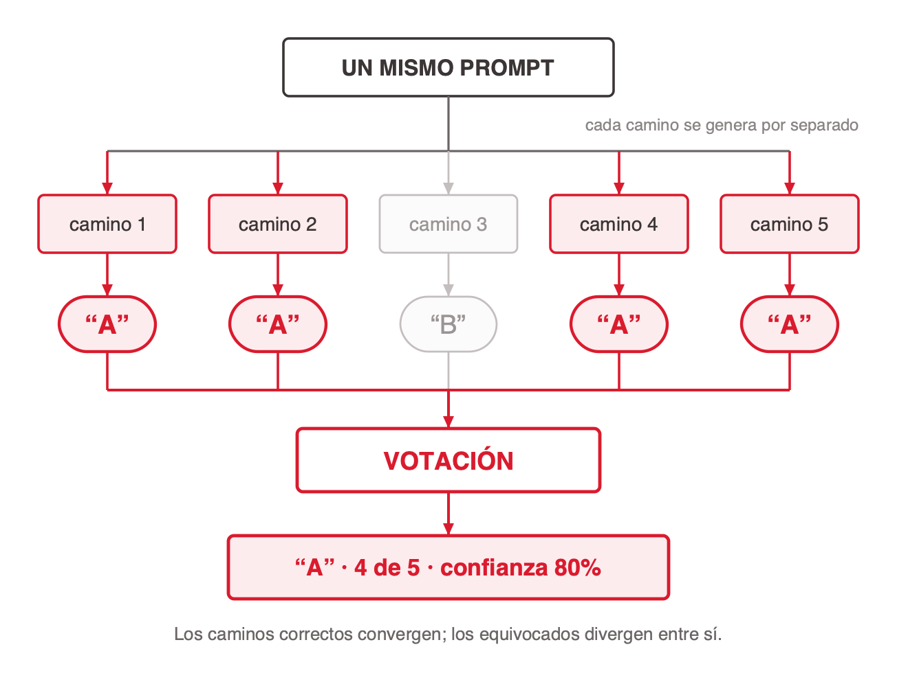
<!-- ascii-source:
                        UN MISMO PROMPT
                               |
          +----------+---------+---------+----------+
          |          |         |         |          |
          v          v         v         v          v
       camino 1   camino 2  camino 3  camino 4   camino 5
       (muestreo independiente, con temperatura > 0)
          |          |         |         |          |
          v          v         v         v          v
         "A"        "A"       "B"       "A"        "A"
          |          |         |         |          |
          +----------+----+----+---------+----------+
                          |
                          v
                  +-----------------+
                  |    VOTACION     |
                  +-----------------+
                          |
                          v
                  "A"  --  4 de 5  --  confianza 80%

  Los caminos correctos convergen; los equivocados divergen entre si.
-->
<!-- ascii-note:
intent: mostrar self-consistency como un fan-out y un fan-in sobre el MISMO prompt: se muestrean varios caminos de razonamiento independientes y se agrega el resultado por frecuencia, no por calidad individual
emphasize: la simetria abanico-que-abre / abanico-que-cierra; el camino 3 disidente ("B"), que es lo que el metodo detecta y una sola llamada esconde; la caja de VOTACION como punto de convergencia
labels: "UN MISMO PROMPT", "camino 1..5", "muestreo independiente, con temperatura > 0", las salidas "A"/"B", "VOTACION", "4 de 5 -- confianza 80%", y la linea de cierre sobre convergencia
-->

**Cuándo usarlo**

- **Alto riesgo** Decisiones donde el error sale caro: un deploy, una migración de datos, un cambio en el motor de facturación.
- **Razonamiento complejo** Problemas donde varias cadenas de pensamiento pueden divergir.
- **Clasificación con confianza** Tareas donde importa saber cuán seguro está el modelo, no solo qué respondió.
- **Validación previa** Medirlo siempre en el eval set propio. Las ganancias no son universales.

### Sources

- `AIG4B-Clase-3-Prompting.md.md` (slide 29)
- `self-consistency-wang.web.md` — Wang et al. (2022). El paper la presenta como **estrategia de decodificación**, no como técnica de prompting: reemplaza la decodificación greedy por muestreo diverso más marginalización sobre los caminos. "Votación por mayoría" es una glosa didáctica, no el término del abstract.

### Speaker notes

Antes del diagrama, el número que sostiene la decisión y que ya no está en la lámina: cinco llamadas cuestan cinco veces, la precisión mejora de forma medible, y CoT más self-consistency combinados dan ganancias adicionales (Wang et al., 2022). Precisión terminológica que vale la pena hacer, porque ordena la cabeza: self-consistency no es un prompt distinto, es una forma distinta de muestrear y agregar las salidas del mismo prompt. El paper habla de marginalizar sobre los caminos de razonamiento; "votación por mayoría" es cómo lo explicamos, y funciona como explicación. La intuición que lo sostiene es elegante: un problema difícil admite varios caminos correctos que convergen a la misma respuesta, y los caminos equivocados divergen entre sí. Si tres de cinco muestras coinciden, esa coincidencia es señal. La cuarta viñeta es la más importante para producción y suele saltearse: hay tareas donde cinco muestras dan cinco respuestas distintas, y ahí la votación no agrega nada más que costo.

---

## 5. Self-consistency: ejemplo

### Content

**Tres corridas independientes del mismo prompt sobre el mismo diff, y una votación.**

<!-- ascii-render: documentation-only -->
```
# CASO
Diff en billing/invoice.py:
-   total = subtotal + tax
+   total = subtotal + tax * quantity

Pregunta: ¿este diff introduce un bug?

# RUN 1
SI. tax ya viene calculado sobre el subtotal completo.
Multiplicarlo por quantity lo cobra de mas.

# RUN 2
SI. Mismo razonamiento: doble conteo de la cantidad.

# RUN 3
NO. Si tax fuera un monto unitario, el cambio seria correcto.

# RESULTADO (votacion)
-> SI, introduce un bug   (2 de 3 votos)
-> Confianza: 67%
```

- **Cuándo usarlo** Cambios donde el error sale caro y el razonamiento admite más de un camino.
- **Costo** Tres a cinco llamadas al modelo, es decir tres a cinco veces el precio y la latencia.

### Sources

- `AIG4B-Clase-3-Prompting.md.md` (slide 30)
- `self-consistency-wang.web.md` — Wang et al. (2022).

### Speaker notes

Lo interesante del ejemplo es la corrida 3, y conviene señalarla. No es una alucinación: es una lectura distinta y coherente del mismo diff, bajo un supuesto distinto sobre qué representa `tax`. Eso es lo que self-consistency detecta y lo que una sola llamada esconde. La confianza del 67% no es una probabilidad calibrada, es la proporción de votos, y conviene decirlo para que nadie la reporte como si fuera otra cosa. El uso práctico en un equipo: cuando la votación no es unánime, el sistema no decide, escala a una persona. Ese es el valor real, más que el voto en sí.

---

## 6. Razonamiento: cuánto piensa el modelo

### Content

**Cuánto razona el modelo antes de contestar es hoy una perilla expuesta de frente al usuario, con nombre propio en cada herramienta.**

- **Respuesta directa** El modelo contesta sin razonar antes. Rápido y barato; es lo que conviene para tareas simples: una búsqueda, un formateo, una pregunta trivial.
- **Thinking** El modelo razona un poco antes de responder. Buen equilibrio para la mayoría de las tareas no triviales del día a día.
- **Deep thinking** El modelo razona bastante más. Es lo mejor para tareas difíciles, de varios pasos o analíticas, y es bastante más lento.

- ⚠️ **Dos cosas distintas con el mismo nombre.** *Extended thinking* nombra el **mecanismo**: el modelo produce un bloque de razonamiento antes de la respuesta. *Thinking* y *deep thinking* nombran los **modos de la interfaz** que gradúan ese mecanismo, igual que los niveles de effort de la API. La slide siguiente trata el mecanismo; esta trata la perilla.

- 🎯 **Emparejar el modo con la dificultad.** Tarea simple, respuesta directa. Tarea no trivial del día a día, thinking. Análisis o planificación multi-paso, deep thinking. Pensar de más en una tarea fácil, además de caro, a veces empeora la respuesta.

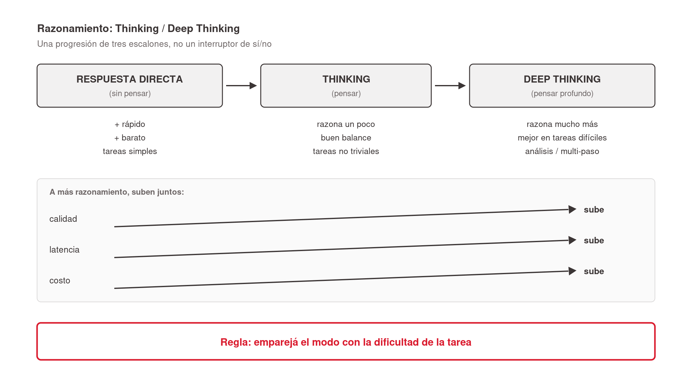
<!-- ascii-source:
  RESPUESTA DIRECTA  -->   THINKING          -->   DEEP THINKING
  (sin pensar)             (pensar)                (pensar profundo)

  + rápido                 razona un poco          razona mucho más
  + barato                 buen balance            mejor en tareas difíciles
  tareas simples           tareas no triviales     análisis / multi-paso

  calidad  ------------------------------------------->  sube
  latencia ------------------------------------------->  sube
  costo    ------------------------------------------->  sube

  Regla: emparejá el modo con la dificultad de la tarea
-->
<!-- ascii-note:
intent: mostrar la progresión de tres niveles de razonamiento como los exponen las herramientas — respuesta directa (rápido/barato, tareas simples) → Thinking (razonamiento moderado, balance) → Deep Thinking (razonamiento profundo, mejor en tareas difíciles pero más lento/caro)
emphasize: la progresión de izquierda a derecha (directa → Thinking → Deep Thinking) y cómo calidad, latencia y costo suben juntos; la regla de ajustar el modo a la dificultad
labels: "RESPUESTA DIRECTA (sin pensar)", "THINKING (pensar)", "DEEP THINKING (pensar profundo)", ejes calidad ↑ / latencia ↑ / costo ↑, la regla de cierre
-->

### Sources

- Importada de `talksmith-mim/talks/hiperparametros-ai/final.md` (sección "4. Cuánto piensa", slide 1). La fuente original de allá, `parametros-llm.md.md`, **no está en el corpus de esta Talk**.
- Re-anclada a `AIG4B-Clase-3-Prompting.md.md` (slide 11) y a la captura `slide-11-1.jpg`, que documenta los niveles de effort del selector de Claude.
- El impacto del effort sobre el costo se trata en la slide 2.1 y no se repite acá (L6).

### Speaker notes

Slide importada de otra clase y ubicada acá a propósito: abre el bloque de razonamiento y le da el marco a las cinco técnicas que siguen. El trabajo principal es desambiguar, porque la clase usa la palabra "thinking" para dos cosas. Decilo explícito: extended thinking es el mecanismo, el modelo escribe un bloque de razonamiento antes de la respuesta; thinking y deep thinking son los nombres comerciales de la perilla que gradúa cuánto escribe. Los niveles de effort de la API que vieron en la slide de tarifas son la misma perilla con otro rótulo. La parte de costo ya la vieron ahí, así que no la repitas: acá el foco es la regla de emparejar modo con dificultad. Un dato para no quedar mal: no atribuyas un modo o un default a un modelo puntual, porque los nombres y los valores por defecto cambian seguido entre proveedores.

---

## 7. Effort: cómo se configura

<!-- ascii-render: documentation-only -->

### Content

**La perilla de razonamiento no vive solo en la interfaz: es un parámetro de la API, con cinco niveles y un default que ya gasta de más.**

```python
response = client.messages.create(
    model="claude-opus-5",
    max_tokens=16000,
    thinking={"type": "adaptive"},      # el modelo decide cuanto razonar
    output_config={"effort": "low"},    # low | medium | high | xhigh | max
    messages=[{"role": "user", "content": "Clasifica este issue..."}],
)
```

- **`effort` va dentro de `output_config`** No es un parámetro de primer nivel, y es el error más común al configurarlo. El default es `high`: una llamada que nunca lo tocó viene pagando razonamiento de sobra en cada tarea trivial.
- **Los tokens de razonamiento se facturan como salida** Aunque no vuelvan en la respuesta y el usuario nunca los vea. Es la parte de la factura que nadie mira.
- **`budget_tokens` quedó obsoleto** Era el techo fijo de tokens de pensamiento. En los modelos actuales devuelve error 400; lo reemplazó el razonamiento adaptativo, donde el modelo decide cuánto pensar y `effort` fija la profundidad.

- 🎯 **Cómo elegir el nivel.** `low` para subagentes y tareas simples; `high` para trabajo sensible a la calidad; `xhigh` es el mejor punto para código y tareas agénticas; `max` solo cuando la corrección importa más que el costo. Medí sobre pedidos reales antes de subir un default, y ajustá por ruta, no globalmente.

### Sources

- Catálogo vigente de la API de Claude (corte 2026-06-24): niveles `low`/`medium`/`high`/`xhigh`/`max`, default `high`, `effort` anidado en `output_config`, y `budget_tokens` removido en los modelos actuales.

### Speaker notes

Esta es la lámina que cierra el bloque de razonamiento del lado de la implementación, y la que más plata les puede ahorrar. Tres cosas. La primera es dónde va el parámetro: adentro de `output_config`, no arriba de todo — es el error que todos cometen la primera vez y falla en silencio si lo ponen mal. La segunda es el default: `high`. O sea que un equipo que nunca configuró effort está pagando razonamiento profundo para clasificar tickets. La tercera es la que conecta con la sección de costos: esos tokens de pensamiento se facturan a tarifa de salida aunque nadie los vea. Si preguntan por `budget_tokens`, que es lo que van a encontrar en tutoriales viejos, explicá que era un techo fijo de tokens y que hoy devuelve error: el modelo decide adaptativamente cuánto pensar y uno gradúa la profundidad con effort. Cerrá con la regla práctica: medir antes de subir el default, y ajustar por ruta en vez de globalmente.

---

## 8. Del prompt al entrenamiento

### Content

**Lo que Chain of Thought conseguía pidiéndoselo al modelo, los modelos de razonamiento lo traen de fábrica. Es el mismo mecanismo, movido del prompt al entrenamiento.**

- **El mecanismo no cambió** Wei et al. mostraron que generar una cadena de pasos intermedios mejora mucho el desempeño en tareas complejas. CoT lo conseguía escribiendo "pensemos paso a paso" en el prompt. Un modelo de razonamiento produce esa cadena por su cuenta, antes de contestar.
- **Por eso algunas técnicas se vuelven redundantes** Pedirle explícitamente que razone paso a paso agrega poco cuando ya lo hace nativamente. Y varios proveedores deshabilitan temperatura y top-p en esos modelos: la generación del bloque de razonamiento la controlan ellos, no vos.
- **El costo es invisible** Esos tokens de pensamiento se facturan a tarifa de salida y no vuelven en la respuesta. La factura sube sin que aparezca una sola línea de texto en pantalla.

- 🎯 **Es la tesis de la clase otra vez.** Los pasos escritos son el cómputo. Lo que cambió es quién los pide: antes lo hacía tu prompt, ahora lo hace el entrenamiento. Por eso el trabajo se corre de "escribir mejores instrucciones" a "elegir cuánto conviene que piense".

### Sources

- `chain-of-thought-wei.web.md` — Wei et al. (2022). Generar una cadena de pasos intermedios mejora significativamente el desempeño en razonamiento aritmético, de sentido común y simbólico; la capacidad emerge en modelos suficientemente grandes.
- Catálogo vigente de la API de Claude (corte 2026-06-24) — los tokens de razonamiento se facturan como salida aunque no se muestren; en los modelos de razonamiento actuales los parámetros de sampling fueron removidos.

### Speaker notes

Esta es la lámina conceptual que le da sentido a todo el bloque, y conviene decirla despacio. Volvé a la tesis: el modelo no tiene un motor de razonamiento aparte, completa tokens de izquierda a derecha, y lo que llamamos razonar es que escriba los pasos intermedios antes de la respuesta. Chain of Thought descubrió eso y lo explotó desde el prompt. Lo que pasó después es que ese mismo comportamiento se movió adentro del modelo. La consecuencia práctica es incómoda y vale decirla: parte de lo que enseñamos en la sección anterior pierde filo contra un modelo de razonamiento, porque ya lo hace solo. La evidencia lateral más linda de esto es que varios proveedores deshabilitan temperatura y top-p en esos modelos: si te sacan las perillas de generación, es porque esa parte la manejan ellos. Y el cierre es el costo: pagás tokens que no ves. Un alumno que mide su factura por lo que aparece en pantalla se lleva una sorpresa. Conectá con la lámina anterior: por eso effort es la perilla que importa, y por eso el default `high` es caro.

---

## 9. Extended thinking (Anthropic)

### Content

**El modelo produce un bloque de razonamiento antes de la respuesta. En el prompt eso se pide con etiquetas `<thinking>`; en la API moderna el proveedor lo corre de forma nativa y lo devuelve como bloque separado.**

| Debugging | Calidad | Trazabilidad |
|---|---|---|
| Muestra dónde falló el razonamiento. El bloque expone el proceso paso a paso, así que los errores sistemáticos se identifican y se corrigen. | Obliga al modelo a pensar antes de responder. En análisis de un incidente: leer los logs, identificar la secuencia, evaluar las causas posibles, recién después concluir. | Habilita un rastro de auditoría completo para decisiones críticas. El contenido del razonamiento se guarda por separado del output. |

- 🔗 La perilla que gradúa cuánto razona (thinking, deep thinking, los niveles de effort) es la de la slide anterior. Esto es el mecanismo que esa perilla regula.

### Sources

- `AIG4B-Clase-3-Prompting.md.md` (slide 31)
- `aitutorial-structured-prompt-engineering.web.md` — los bloques `<thinking>` como buena práctica específica de la familia Claude.

### Speaker notes

Acá hay que cerrar la desambiguación que abriste en la slide anterior, porque el deck original usaba el mismo nombre para dos cosas y confundía. Poner `<thinking>` en el prompt es una técnica de prompting: se le pide al modelo que escriba su razonamiento dentro de etiquetas, y es chain of thought con delimitadores. El extended thinking nativo de la API es otra cosa: el proveedor corre el razonamiento antes de generar la respuesta, lo factura como tokens de salida y lo devuelve en un bloque aparte. La técnica de prompt funciona en cualquier modelo; el mecanismo nativo depende del proveedor. El ejemplo de la columna del medio pasó de análisis de contratos a análisis de incidentes, que es el caso que ellos van a tener.

---

## 10. Extended thinking: ejemplo

### Content

**Prompt con `<thinking>` sobre un stack trace**

<!-- ascii-render: documentation-only -->
```
<traza>
java.lang.NullPointerException: Cannot invoke "Order.getTotal()" because "order" is null
  at billing.InvoiceService.render(InvoiceService.java:118)
  at billing.InvoiceController.get(InvoiceController.java:47)
  ... 34 frames omitidos
Contexto: aparece solo en produccion, ~3% de las requests a /v2/invoices/{id}
</traza>

<thinking>
Necesito analizar esto en orden:
1. Que objeto es null y en que frame se origina
2. Que caminos pueden dejar ese objeto en null
3. Por que solo el 3% de las requests y solo en produccion
4. Que arreglo ataca la causa y no el sintoma
Voy paso por paso...
</thinking>

Responde en JSON con: causa_probable, evidencia, fix, riesgo_del_fix
```

**Por qué importa**

- **Debugging** Se ve en qué paso se equivocó el modelo, y no solo que se equivocó.
- **Calidad** El modelo piensa antes de responder, y no salta a la primera hipótesis.
- **Trazabilidad** El bloque de razonamiento se puede guardar junto al incidente, para auditar la decisión después.

### Sources

- `AIG4B-Clase-3-Prompting.md.md` (slide 32)

### Speaker notes

El ejemplo pasó de un caso clínico a un stack trace, y el cambio de dominio hace visible algo que en el original se perdía: los cuatro pasos del bloque `<thinking>` no son decoración, son la estructura del análisis. El paso 3 es el que un modelo sin CoT se saltea siempre, y es el que importa: por qué el 3% y por qué solo en producción. Sin ese paso, la respuesta va a ser "agregá un chequeo de null", que es tapar el síntoma. Es un buen momento para preguntarle al grupo qué hipótesis se les ocurre para ese 3%. Suelen salir dos buenas: una condición de carrera y datos viejos que solo existen en la base de producción. Cualquiera de las dos deja claro por qué el chequeo de null no es el arreglo.

---

## 11. Tree of Thought (ToT)

### Content

**ToT extiende CoT explorando varios caminos de razonamiento en paralelo, como las ramas de un árbol de decisión. El modelo evalúa cada rama y elige la más prometedora.**

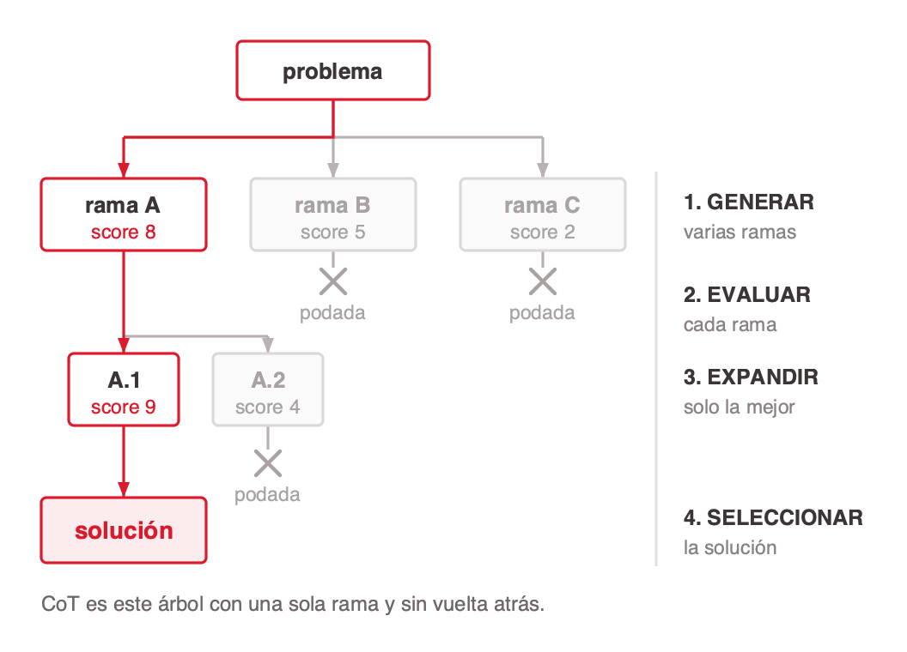

**Limitaciones**

- Cuesta bastante más que CoT lineal.
- Es más complejo de implementar.
- Sirve cuando el problema admite varias soluciones posibles.
- No justifica el overhead en tareas simples.

### Sources

- `AIG4B-Clase-3-Prompting.md.md` (slide 33)
- `tree-of-thoughts-yao.web.md` — Yao et al. (2023), NeurIPS 2023. ToT generaliza CoT: la unidad de decisión deja de ser el token y pasa a ser el *thought*, una unidad coherente de texto. Habilita autoevaluación, lookahead y backtracking. Game of 24 con GPT-4: CoT 4% → ToT 74%.

### Speaker notes

El árbol de la lámina es el punto entero de la técnica, así que caminalo: se generan varias ramas, cada una recibe un score, las malas se podan y solo la mejor se expande. Marcá que CoT es este mismo árbol con una sola rama y sin vuelta atrás. El aporte teórico del paper vale la pena decirlo porque reordena todo lo anterior: la generación autoregresiva decide token por token y de izquierda a derecha, sin manera de volver atrás, y si el primer paso fue malo el resto está condenado. ToT cambia la unidad de decisión: en vez de tokens, pensamientos completos, y con eso aparecen dos operaciones que CoT no tiene, mirar hacia adelante y retroceder. Recordá el número de la slide de CoT: 4% a 74% en Game of 24, mismo modelo. La analogía médica del deck original se reemplazó por el ejemplo de refactor de la slide siguiente.

---

## 12. Tree of Thought: ejemplo

### Content

**Tres estrategias de refactor, evaluadas antes de elegir.**

<!-- ascii-render: documentation-only -->
```
# CASO
El modulo billing/invoice.py tiene 1.400 lineas, 38 metodos y ningun test.
Hay que agregarle IVA por jurisdiccion sin romper la facturacion actual.

# INSTRUCCION (Tree of Thought)
1. Genera 3 estrategias de refactor posibles
2. Evalua evidencia a favor y en contra de cada una
3. Elegi la mas prometedora y justifica
```

**Razonamiento del modelo**

- **Rama A: extraer la logica de impuestos a un modulo nuevo** Aisla el cambio, permite testear la parte nueva sin tocar lo viejo. Riesgo acotado. **Rama seleccionada.**
- **Rama B: reescribir el modulo entero con tests** La solucion mas limpia a largo plazo, y la que mas superficie rompe de una sola vez. Sin tests previos, no hay red.
- **Rama C: agregar el IVA in situ con condicionales** Es lo mas rapido. Suma complejidad ciclomatica a un modulo que ya no la tolera. Descartada.

### Sources

- `AIG4B-Clase-3-Prompting.md.md` (slide 34)
- `tree-of-thoughts-yao.web.md` — Yao et al. (2023).

### Speaker notes

Este ejemplo funciona porque las tres ramas son defendibles, y eso es justo el tipo de problema donde ToT rinde. Un problema con una sola respuesta correcta no necesita ramas. La rama B es la trampa útil: es la respuesta que da un modelo sin evaluación de ramas, porque es la más limpia en abstracto, y es la peor decisión concreta porque no hay tests que sostengan la reescritura. El criterio que hace ganar a la rama A no es la elegancia, es el riesgo acotado. Si querés hacerlo participativo, mostrá las tres ramas sin la selección y pediles que elijan. La discusión que se arma es el trabajo que hace ToT.

---

## 13. ReAct: razonar y actuar

<!-- slide nueva: ReAct esta procesado en el corpus y no aparecia en ninguna slide -->

### Content

**El modelo intercala pasos de razonamiento con acciones sobre fuentes externas. Razona, actúa, observa el resultado, y vuelve a razonar con esa observación en el contexto.**

<!-- ascii-render: documentation-only -->
```
Thought 1: Necesito saber si esta funcion se usa en otro lado antes de cambiarle la firma.
Act 1:     grep("def calcular_iva", repo)
Obs 1:     3 llamadas: billing/invoice.py:118, api/orders.py:44, tests/test_billing.py:12

Thought 2: api/orders.py la llama con dos argumentos posicionales. Cambiar la firma la rompe.
Act 2:     read("api/orders.py", 40, 50)
Obs 2:     calcular_iva(subtotal, "AR")

Thought 3: Ya tengo lo que necesita el fix. Agrego el parametro con default.
Act 3:     finish("Agregar jurisdiccion como parametro opcional con default 'AR'")
```

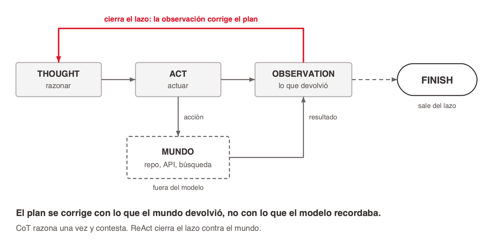
<!-- ascii-source:
        +--------------------------------------------------+
        |                                                  |
        v                                                  |
   +----------+      +----------+      +---------------+   |
   | THOUGHT  | ---&gt; |   ACT    | ---&gt; | OBSERVATION   | --+
   | razonar  |      | actuar   |      | lo que volvio |
   +----------+      +----------+      +---------------+
                          |                    ^
                          v                    |
                   +--------------+            |
                   |    MUNDO     |------------+
                   | repo, API,   |
                   | busqueda     |
                   +--------------+

   El plan se corrige con lo que el mundo devolvio,
   no con lo que el modelo recordaba.

                  ... el lazo se repite hasta FINISH

  CoT razona una vez y contesta. ReAct cierra el lazo contra el mundo.
-->
<!-- ascii-note:
intent: mostrar ReAct como un LAZO CERRADO contra una fuente externa, no como una secuencia lineal: cada observacion del mundo real vuelve al razonamiento y corrige el plan antes del paso siguiente
emphasize: la flecha de retorno que cierra el ciclo de Observation a Thought; la caja MUNDO como lo que esta fuera del modelo; la salida FINISH que rompe el lazo
labels: "THOUGHT / razonar", "ACT / actuar", "OBSERVATION / lo que volvio", "MUNDO: repo, API, busqueda", "el lazo se repite hasta FINISH", y la linea de cierre que contrasta con CoT
-->

- 🔗 Es el patrón base de los agentes de código actuales, y el puente natural entre prompt chaining y agentes.

### Sources

- `react-yao.web.md` — Yao et al. (2022), ICLR 2023. El paper reporta +34% de tasa de éxito absoluta en ALFWorld y +10% en WebShop sobre métodos de imitación y aprendizaje por refuerzo, "prompted with only one or two in-context examples". En HotpotQA y Fever declara que **supera los problemas de alucinación y propagación de errores del razonamiento chain-of-thought** interactuando con una API simple de Wikipedia, **sin dar cifras**.
- La traza de ejemplo es propia: la Figura 1 del paper y las trazas completas no están en la captura del corpus.

### Speaker notes

Las dos afirmaciones del paper que sostenían la lámina van habladas: las **trazas de razonamiento** ayudan al modelo a armar, seguir y corregir un plan, y a manejar excepciones; las **acciones** lo conectan con fuentes externas (bases de conocimiento, herramientas, el repositorio), así que deja de depender solo de su memoria. Slide nueva, y la agregué porque ReAct estaba procesado en el corpus y no aparecía en ninguna parte, siendo la técnica más pertinente para esta audiencia de todas las de la sección. Es la que explica qué hace un asistente de código por dentro. El punto teórico es el entrelazado: no razonar primero y actuar después, sino alternar, de modo que cada observación del mundo real condiciona el razonamiento siguiente. Y hay una afirmación del paper que conviene decir en voz alta porque es una crítica a CoT desde adentro de la literatura: ReAct supera la alucinación y la propagación de errores que CoT tiene, porque va a buscar el dato en lugar de recordarlo. Ahí engancha con toda la sección de alucinaciones del principio. Aclará que la traza del ejemplo es propia: la del paper no está en la captura.

---

## 14. Prompt chaining

### Content

**Dividir una tarea compleja en una secuencia de prompts simples, donde el output de cada paso alimenta al siguiente. Cada paso es más preciso porque se enfoca en una sola sub-tarea.**

**Ejemplo: pipeline de triage de tickets**

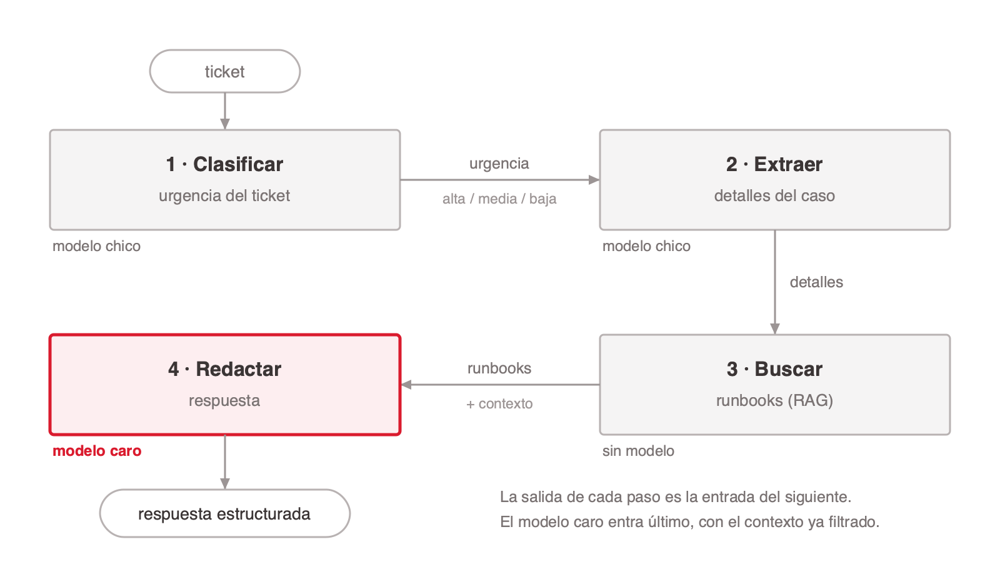
<!-- ascii-source:
  [ ticket ]
      |
      v
  +---------------+  urgencia     +---------------+  detalles
  | 1 CLASIFICAR  | ------------&gt; | 2 EXTRAER     | -----------+
  |   urgencia    | alta/med/baja |   detalles    |            |
  +---------------+               +---------------+            |
    modelo chico                    modelo chico               |
                                                               v
  +---------------+  runbooks     +---------------+            |
  | 4 REDACTAR    | <------------ | 3 BUSCAR      | <----------+
  |   respuesta   |  + contexto   |   (RAG)       |
  +---------------+               +---------------+
    modelo caro                     sin modelo
      |
      v
  [ respuesta estructurada ]

  La salida de cada paso ES la entrada del siguiente.
  El modelo caro entra solo en el paso 4, con el contexto ya filtrado.
-->
<!-- ascii-note:
intent: mostrar el encadenamiento como una tuberia de etapas donde la salida de cada una es la entrada de la siguiente, y hacer visible por que sale mas barato: los pasos baratos filtran antes de que intervenga el modelo caro
emphasize: las flechas etiquetadas entre etapas (urgencia, detalles, runbooks, contexto), que son el dato concreto que viaja; la anotacion de que modelo usa cada paso, con el caro solo al final
labels: "ticket", "1 CLASIFICAR urgencia", "2 EXTRAER detalles", "3 BUSCAR (RAG)", "4 REDACTAR respuesta", "modelo chico / sin modelo / modelo caro", "respuesta estructurada"
-->

- 🎯 **Prompt chaining convierte tareas imposibles en secuencias manejables. Es la base de los agentes de IA modernos.**

### Sources

- `AIG4B-Clase-3-Prompting.md.md` (slide 35) — el párrafo de definición está truncado a mitad de palabra en el original: "…se ejecutan varias llamadas en vez de una lo cual **incre**" (corpus §Raw excerpts [35], inconsistencia 22). La frase no se pudo reponer verbatim porque el corpus la preserva igual de truncada; el cierre se reformuló con el trade-off que la propia slide 5.13 declara (más latencia y más llamadas, a cambio de pasos simples y evaluables).

### Speaker notes

El texto de esta slide venía cortado a mitad de palabra en el deck original y no se pudo reponer verbatim, porque el material fuente está igual de cortado. Lo que decía la frase se deduce de la propia slide de ejemplo: varias llamadas en vez de una incrementan latencia y costo total de orquestación, a cambio de que cada paso sea simple y evaluable por separado. Decilo así. El otro punto es el de la línea de cierre y es el más importante de la slide: un pipeline de cinco pasos con lógica de control escrita por el programador ya es, en lo esencial, un agente con el bucle fijo. La diferencia con un agente de verdad es quién decide el próximo paso, y eso es lo que agrega ReAct, que acaban de ver.

---

## 15. Prompt chaining: ejemplo

### Content

<!-- ascii-render: documentation-only -->
```
# PASO 1 -- Clasificar urgencia
Input:  ticket del usuario
-> Output: ALTA / MEDIA / BAJA

# PASO 2 -- Extraer detalles
Input:  ticket + clasificacion
-> Output: componente afectado, version, pasos para reproducir

# PASO 3 -- Buscar en la base de conocimiento (RAG)
Input:  detalles extraidos
-> Output: incidentes previos parecidos, runbooks aplicables

# PASO 4 -- Generar respuesta
Input:  todo lo anterior
-> Output: respuesta estructurada para el equipo de guardia
```

| Ventajas | Trade-offs |
|---|---|
| **Debugging:** se identifica en qué paso falló, no solo que falló. | Más latencia: las llamadas son secuenciales. |
| **Resiliencia:** los pasos que fallan se reintentan por separado. | El código de orquestación es más complejo. |
| **Optimización:** cada prompt se ajusta a su tarea, y los pasos caros se llaman solo cuando hacen falta. | Varias llamadas al modelo, aunque el total suele salir más barato. |
| **Escalabilidad:** cada paso se evalúa y se mejora por separado. | |

### Sources

- `AIG4B-Clase-3-Prompting.md.md` (slide 36)

### Speaker notes

La tercera ventaja es la que suele sorprender, y merece medio minuto: encadenar es más barato aunque haya más llamadas. La razón es que el paso 1 corre con un modelo chico sobre doscientos tokens, y el modelo caro solo se invoca en el paso 4 y con el contexto ya filtrado. Un prompt monolítico manda todo al modelo caro siempre. Es el mismo argumento del cascading, aplicado a las etapas en vez de a los modelos. La contra real es la de la primera fila de la derecha: cuatro llamadas secuenciales son cuatro latencias sumadas, y en un flujo interactivo eso se nota. Si el sistema es asincrónico, no importa.

---
## 16. Técnicas avanzadas: pros y contras

### Content

| Técnica | Pros | Contras |
|---|---|---|
| **Chain of Thought (CoT)** | Razonamiento auditable, mejora la precisión, los errores se detectan. | Más latencia y más costo; poco útil en tareas simples; no garantiza corrección. |
| **Self-consistency** | Reduce el error por no-determinismo; da una señal de confianza. | Multiplica el costo por 3 a 5 llamadas; más latencia. |
| **Extended thinking** | Razonamiento visible y auditable; ideal para tareas críticas. | El mecanismo nativo depende del proveedor; se paga cada token de thinking. |
| **Tree of Thought (ToT)** | Explora varios caminos; mejor que CoT en planificación. | Muy costoso; complejo de implementar; difícil de controlar. |
| **ReAct** | Va a buscar el dato en vez de recordarlo, así que reduce alucinación. | Depende de las herramientas externas y de que respondan bien. |
| **Prompt chaining** | Pasos simples y reintentables; fácil de evaluar y mejorar. | Más latencia total; código de orquestación más complejo. |

### Sources

- `AIG4B-Clase-3-Prompting.md.md` (slide 37)
- `react-yao.web.md` — Yao et al. (2022), para la fila de ReAct.

### Speaker notes

Tabla de referencia, para consultar más que para leer. Si hay que decir una sola cosa, que sea el patrón de la columna de la derecha: todas las contras son la misma contra escrita de seis maneras, que es más tokens o más llamadas. Ninguna técnica de esta sección compra calidad gratis. Y una lectura transversal útil: las tres primeras filas mejoran cómo piensa el modelo, las tres últimas cambian la arquitectura del sistema alrededor. Las primeras son un cambio de prompt, las segundas son un cambio de diseño, con todo lo que eso implica para el equipo que lo mantiene.

---

## 17. ¿Por qué funcionan?

### Content

**El LLM no piensa: predice tokens.** Genera el texto token a token, de izquierda a derecha, de forma autoregresiva, y cada token nuevo depende solo de los anteriores en el contexto. No hay un motor de razonamiento oculto: lo que se ve en la respuesta **es** el razonamiento.

**Por qué CoT y ToT mejoran los resultados**

- **Los tokens intermedios son cálculo real** Al escribir los pasos, el modelo genera representaciones intermedias que condicionan mejor los tokens siguientes. El razonamiento escrito funciona como memoria de trabajo explícita.
- **Más contexto, mejor predicción final** Cada paso escrito enriquece el contexto disponible para el token siguiente. Un razonamiento de 200 tokens guía mejor la respuesta que un prompt de 10.
- **Se achica el espacio de error** Sin CoT el modelo tiene que saltar directo a la respuesta. Con CoT, cada paso intermedio reduce la incertidumbre acumulada antes de la conclusión.

- 💡 Es la diferencia entre resolver un problema de cabeza y resolverlo escribiéndolo en papel. El papel no vuelve más inteligente a nadie, y hace la cuenta más precisa.

### Sources

- `AIG4B-Clase-3-Prompting.md.md` (slide 38) — argumento completo en §Raw excerpts [38].
- `chain-of-thought-wei.web.md` — Wei et al. (2022).
- `tree-of-thoughts-yao.web.md` — Yao et al. (2023): el diagnóstico de partida del paper es la decisión "a nivel de token y de izquierda a derecha" durante la inferencia.

### Speaker notes

Esta es la slide de la tesis y merece el tiempo que haga falta. Todo lo que vieron en la sección se explica desde acá: si el modelo genera token por token y cada token se condiciona solo con lo anterior, entonces escribir los pasos no es documentar el razonamiento, es hacerlo. Los tokens intermedios son cómputo en sentido estricto: son estados que el modelo puede leer para producir el siguiente. Por eso pedirle que piense paso a paso funciona, y por eso pedirle que "sea más cuidadoso" no funciona. La analogía del papel es la que engancha, y tiene un matiz que conviene decir: el papel no agrega inteligencia, agrega memoria de trabajo. Si te queda tiempo, cerrá volviendo a la slide del motor de completado del principio, porque es la misma idea vista dos horas antes.

---

## 18. ¿Por qué tardan más?

### Content

**Más calidad cuesta tiempo de cómputo: más tokens generados, más segundos. No es magia, es aritmética.**

| Técnica | Efecto en latencia |
|---|---|
| **Chain of Thought (CoT)** | Genera 100 a 500 tokens de razonamiento antes de la respuesta. Latencia 2 a 5 veces mayor. |
| **Self-consistency** | Corre el mismo prompt N veces (5 a 10). Latencia y costo: N veces una sola llamada. |
| **Extended thinking** | Bloque de razonamiento de miles de tokens antes de responder. Puede llegar a 10 o 30 segundos en casos complejos. |
| **Tree of Thought (ToT)** | Proporcional a la cantidad de ramas evaluadas: 3 a 5 veces CoT en los casos habituales. |
| **Prompt chaining** | Cada paso es una llamada independiente. Un pipeline de 5 pasos suma 5 latencias más el procesamiento intermedio. |
| **Testing sistemático** | No afecta al usuario: afecta la latencia de desarrollo, proporcional al tamaño del eval set. |

- 🎯 **Usar estas técnicas solo cuando la precisión justifica el costo. Para tareas simples, un prompt directo es más eficiente.**

### Sources

- `AIG4B-Clase-3-Prompting.md.md` (slide 39)

### Speaker notes

Esta slide es el contrapeso de las anteriores y por eso va acá, justo después de la que explica por qué funcionan. La regla del cierre es la que se llevan escrita. Un detalle que conviene marcar porque cambia decisiones de producto: la latencia de self-consistency es N veces solo si las llamadas van en serie, y no tienen por qué. Cinco muestras en paralelo cuestan cinco veces en plata y una vez en tiempo. Es de las pocas veces en que se puede comprar calidad sin pagar latencia. La última fila es distinta de las otras cinco y hay que decirlo: el testing no le agrega latencia al usuario, se la agrega al equipo, y ese es un costo que se paga una vez por iteración y no una vez por request.

---

## 19. Prompts sin verificación

### Content

**Qué sale mal sin proceso**

- **Evaluación subjetiva** "Parece que anda bien" no alcanza. Un prompt que funciona en 10 ejemplos falla en producción con miles.
- **Regresiones invisibles** Mejorar el prompt para un caso rompe otros. Sin tests, cada cambio es a ciegas.
- **Sin baseline** Sin métricas de referencia, no hay forma de saber si un cambio mejoró o empeoró el sistema.

**Qué hace falta**

- **Dataset de evaluación** Casos representativos con respuesta esperada (ground truth).
- **Métricas definidas** Exactitud, F1, BLEU, o una métrica propia del dominio.
- **Versionado de prompts** Rastrear qué cambió, cuándo y con qué impacto en las métricas.
- **Testing automatizado** Correr el eval set en cada cambio, igual que CI/CD para código.

- 🎯 **Un prompt sin datos de evaluación es una hipótesis sin experimento.**

### Sources

- `AIG4B-Clase-3-Prompting.md.md` (slide 40)

### Speaker notes

Acá empieza el bloque de disciplina de producción y es donde esta audiencia tiene ventaja sobre casi cualquier otra: las cuatro cosas de la derecha ya las hacen con código. La columna izquierda describe cómo se trabaja hoy con prompts en la mayoría de los equipos, y suena a cómo se trabajaba con software antes de los tests automatizados. La segunda viñeta es la que más duele en la práctica y conviene contarla como caso: alguien mejora el prompt para un ticket que se clasificó mal, lo sube, y tres semanas después nadie entiende por qué bajó la precisión en una categoría que nadie tocó. Sin eval set, ese diagnóstico no existe.

---

## 20. DSPy: optimización automática

### Content

**DSPy es un framework de Python que trata los prompts como parámetros optimizables. En vez de escribirlos a mano, se define el comportamiento deseado y DSPy los ajusta contra un dataset de evaluación.**

- **Definir el programa** Se declaran módulos (`Predict`, `ChainOfThought`, `ReAct`) y cómo se conectan, sin escribir el prompt.
- **Proveer ejemplos** Un dataset chico de inputs y outputs esperados. Diez o veinte alcanzan para empezar.
- **Elegir un optimizador** `BootstrapFewShot`, `MIPRO`, `BayesianSignatureOptimizer`. DSPy prueba variantes solo.
- **Compilar** Genera y evalúa prompts candidatos, y se queda con el que maximiza la métrica.

| | Prompt manual | DSPy |
|---|---|---|
| Tiempo de iteración | Horas o días | Minutos |
| Reproducibilidad | Baja | Alta |
| Escala a nuevos modelos | Manual | Automática |
| Requiere expertise en prompting | Sí | Menos |

### Sources

- `AIG4B-Clase-3-Prompting.md.md` (slide 41)
- `dspy-framework.web.md` — "Program, don't prompt, your LLMs". Signatures (tarea como inputs y outputs tipados), modules ("same interface, different strategy") y optimizers ("compile your program against a metric"). Creado en Stanford NLP.

### Speaker notes

El eslogan del framework dice todo: programá, no promptees. Y el punto que más le sirve a esta audiencia es el de los módulos: en DSPy, pasar de completado directo a chain of thought y de ahí a ReAct es cambiar una línea, sobre la misma signature. Es decir, todas las técnicas que vieron en esta sección quedan reificadas como un parámetro intercambiable. La analogía con backpropagation ayuda, pero aclará el alcance para que nadie se la lleve mal: no ajusta pesos, ajusta el texto de las instrucciones y la selección de ejemplos, evaluando candidatos contra una métrica. Sigue siendo prompting, con búsqueda automática en vez de intuición. La tabla del final es la venta, y la fila que a ellos les va a importar es la tercera: cuando cambia el modelo, el prompt optimizado se recompila en vez de reescribirse.

---

## 21. Datos y testing sistemático

### Content

**Construir el eval set**

- **Recolectar casos reales** Mínimo 50 a 100 ejemplos representativos. Incluir a propósito los casos borde y los difíciles.
- **Definir ground truth** Respuestas esperadas, anotadas por quien conoce el dominio.
- **Estratificar por dificultad** Separar en fácil, medio y difícil. Un buen prompt rinde en los tres estratos.
- **Separar train / eval / test** Nunca optimizar el prompt sobre el test set. Eval para iterar, test solo para la medición final.

**El pipeline**

- 🔁 **Eval automatizado** Un script que corre el prompt sobre todo el eval set y calcula métricas. Tiene que terminar en menos de 5 minutos para no frenar la iteración.
- 📏 **Métricas por tarea** Clasificación: accuracy, F1, AUC. Generación: BLEU, ROUGE, BERTScore. Cada dominio agrega las suyas.
- 🚨 **Regression tests** Un conjunto de casos críticos que nunca pueden fallar. Si el prompt los rompe, el cambio se rechaza.

- 🎯 **Una mejora que no se puede medir no se puede afirmar. El eval set vale tanto como el prompt.**

### Sources

- `AIG4B-Clase-3-Prompting.md.md` (slide 43)

### Speaker notes

La cuarta viñeta de la izquierda es la que más se viola y la que más caro sale. Iterar el prompt mirando el test set es sobreajustar a mano: el número sube, la calidad real no, y nadie se entera hasta producción. Es el mismo error que en machine learning clásico, y acá es más fácil de cometer porque el eval set es chico y se mira todo el tiempo. Del pipeline, el requisito de los cinco minutos parece un detalle y no lo es: un eval que tarda media hora se corre una vez por semana, y un eval que tarda dos minutos se corre en cada cambio. La frecuencia de la iteración depende de ese número. Cerrá con la regla de oro, que rima con la de la sección de alucinaciones.

---

# 6. LLMs en ingeniería

**Goal of this section:** Situar todo lo anterior en el ciclo de vida real de un producto de software, con los riesgos que trae y las mitigaciones que un equipo ya sabe practicar.

---

## 1. Ciclo de vida: dónde entra el LLM

### Content

**El mismo recorrido que hace un cambio desde que alguien lo pide hasta que llega a producción, con lo que un LLM aporta en cada estadio.**

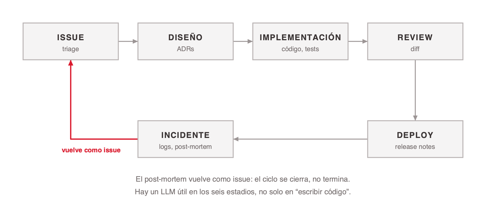
<!-- ascii-source:
     +----------+     +----------+     +----------------+     +----------+
     |  ISSUE   | --&gt; |  DISENO  | --&gt; | IMPLEMENTACION | --&gt; |  REVIEW  |
     |  triage  |     |  ADRs    |     | codigo, tests  |     |   diff   |
     +----------+     +----------+     +----------------+     +----------+
          ^                                                        |
          |                                                        v
          |           +-------------+                        +----------+
          +---------- | INCIDENTE   | <--------------------- |  DEPLOY  |
                      | logs        |                        | release  |
                      | post-mortem |                        |  notes   |
                      +-------------+                        +----------+

  El post-mortem vuelve como issue: el ciclo se cierra, no termina.
  Hay un LLM util en los seis estadios, no solo en "escribir codigo".
-->
<!-- ascii-note:
intent: mostrar el ciclo de vida de un cambio como un lazo cerrado de seis estadios, y que el aporte del LLM esta repartido en los seis y no concentrado en la implementacion, que es donde la intuicion lo pone
emphasize: la flecha de retorno de INCIDENTE a ISSUE, que es lo que convierte la secuencia en ciclo; la caja IMPLEMENTACION como uno mas entre seis y no como el centro
labels: "ISSUE / triage", "DISENO / ADRs", "IMPLEMENTACION / codigo, tests", "REVIEW / diff", "DEPLOY / release notes", "INCIDENTE / logs, post-mortem", y las dos lineas de cierre
-->

| Etapa | Qué hace hoy |
|---|---|
| **Issue y triage** | Clasifica, deduplica y enruta al equipo correcto. |
| **Diseño** | Redacta ADRs, contrasta alternativas, encuentra precedentes en el propio repo. |
| **Implementación** | Completa código, genera tests, traduce entre lenguajes y frameworks. |
| **Review** | Detecta bugs, marca desvíos de la guía de estilo, resume el diff para el revisor. |
| **Deploy** | Redacta release notes y verifica checklists de salida. |
| **Incidente** | Correlaciona logs, propone hipótesis, redacta el post-mortem. |

### Sources

- `AIG4B-Clase-3-Prompting.md.md` (slide 51) — la slide original recorría el trayecto de un paciente. Se conserva la forma argumental (etapa, qué se hace hoy, hacia dónde va) y se cambió el dominio.
- Fuentes del original, desanidadas del bloque de hipervínculos superpuestos y conservadas acá como procedencia de la versión médica: Frontiers in Digital Health (2025) · MedGemma, Google DeepMind (2025) · Nature Medicine (2025) · WHO — *Ethics & Governance of AI for Health: LMMs* (2024). Ninguna respalda el contenido de software de esta versión.

### Speaker notes

Esta slide reordena toda la clase en el eje que a ellos les resulta natural: el flujo de trabajo. La columna "hacia dónde va" salió de la lámina y va hablada, estadio por estadio: en **issue**, priorización con el contexto del roadmap y de la deuda técnica; en **diseño**, exploración de alternativas con costo y riesgo estimados; en **implementación**, agentes que abren un pull request completo a partir del issue; en **review**, revisión con el contexto histórico del módulo y de sus incidentes; en **deploy**, estimación de riesgo del despliegue a partir del diff; y en **incidente**, diagnóstico asistido mientras el incidente sigue abierto. Marcalas como especulación, que es lo que son. Vale la pena decir de entrada que las seis etapas no son igual de maduras, y que la columna del medio es lo que ya se usa hoy en equipos reales, no una promesa. La fila de review es la que más pega, porque es donde el LLM aporta y donde más rápido se ve el límite: encuentra el bug obvio y no entiende por qué ese módulo está escrito así. La fila de incidente es la que más entusiasma y la más peligrosa, porque un post-mortem con una causa raíz inventada es peor que no tener post-mortem. Aviso de honestidad: la versión original de esta slide traía cifras del dominio médico, y no las traduje a números de software porque no tengo fuente. Lo que queda es cualitativo a propósito.

---

## 2. Explorar y entender código

### Content

**El otro uso grande no es escribir código: es entender el que ya existe.**

| Búsqueda semántica en repos grandes | Comprensión de sistemas legados |
|---|---|
| Preguntar "dónde se decide si un pedido se factura en dos cuotas" y recibir los tres archivos que importan, en vez de 400 coincidencias de `grep`. | Reconstruir el modelo mental de un módulo sin autor vivo: qué hace, qué invariantes asume y qué rompe si se toca. |

| Síntesis de documentación | Arqueología de decisiones |
|---|---|
| Generar el README que nunca se escribió, a partir del código, los tests y los nombres de las cosas. | Recorrer historial de Git, ADRs y tickets viejos para responder por qué se eligió esto y no aquello. |

- ⚠️ Las cuatro tareas comparten el mismo riesgo: el modelo produce una explicación coherente aunque el código haga otra cosa. La respuesta se verifica contra el código, siempre.

### Sources

- `AIG4B-Clase-3-Prompting.md.md` (slide 52) — la slide original recorría el pipeline de research biomédica. Se conserva la forma (cuatro cuadrantes de oportunidad) y se cambió el dominio.
- Fuentes del original, desanidadas del bloque de ocho hipervínculos superpuestos y conservadas acá como procedencia de la versión biomédica: BioGPT, Microsoft Research (2022) · AlphaFold 2/3, DeepMind (2022/2024) · ESMFold, Meta AI (2022) · Insilico Medicine, ISM001-055 Fase II · TxGNN, Harvard (Nature Medicine, 2024) · Recursion Pharmaceuticals · Consensus · Elicit. Ninguna respalda el contenido de software de esta versión. Los registros `biogpt-luo.web.md`, `alphafold-db.web.md`, `esm-atlas.web.md` y `txgnn-nature-medicine.web.md` del corpus corresponden a esa versión.

### Speaker notes

Esta es la slide donde más gente se sorprende, porque el uso famoso de los LLM es generar código y el uso que más tiempo ahorra en un equipo real es leerlo. La primera fila tiene el mejor argumento: la diferencia entre buscar por texto y buscar por intención. `grep` encuentra el nombre; el modelo encuentra el lugar donde se toma la decisión, aunque la variable se llame distinto. La cuarta es la que menos se piensa y la que más valor tiene en un equipo con rotación: la respuesta a "por qué está hecho así" vive repartida entre commits, tickets y una conversación de Slack de 2023. La advertencia del cierre no es retórica: una explicación fluida de un código que hace otra cosa es la alucinación más difícil de detectar, porque suena a documentación.

---

## 3. Casos de uso hoy

### Content

**Lo que ya está desplegado en equipos de software, no lo que se promete.**

| Asistentes de código | Generación de tests | Triage automático | Revisión y documentación |
|---|---|---|---|
| Completado en el editor y agentes que resuelven un issue completo. Es el uso más adoptado y el más medido. | Tests unitarios a partir del código existente, y casos borde que el autor no había pensado. | Clasificación, deduplicación y ruteo de issues y tickets entrantes. | Comentarios de review sobre el diff, resúmenes de pull request y documentación generada del código. |

- ⚠️ Ninguno reemplaza al revisor humano. Los cuatro producen borradores que alguien del equipo aprueba antes de que el cambio entre.

### Sources

- `AIG4B-Clase-3-Prompting.md.md` (slide 53) — la slide original listaba cuatro categorías de casos clínicos con métricas. Se conserva la forma (cuatro categorías) y se cambió el dominio.

### Speaker notes

Slide corta y a propósito. Lo que hay que sostener es la advertencia del final, porque es la bisagra con las dos slides de riesgos que siguen. La columna de generación de tests merece una aclaración que suele hacer ruido: un test generado por el modelo a partir del código verifica que el código hace lo que hace, no que hace lo correcto. Es útil como red contra regresiones y no sirve como especificación. Si alguien pregunta por números de adopción o de productividad, decí la verdad: la versión original de esta slide tenía cifras de estudios clínicos y no las reemplacé por cifras de software inventadas. Quedó marcado como pendiente buscar evidencia citable.

---

## 4. Seguridad: el caso Glasswing

### Content

**En abril de 2026 un modelo de frontera sin publicar encontró miles de vulnerabilidades críticas —de forma autónoma, sin dirección humana— en todos los sistemas operativos y navegadores importantes. Doce empresas formaron Project Glasswing para poner esa capacidad del lado de la defensa.**

- **OpenBSD: veintisiete años escondida** En uno de los sistemas más endurecidos que existen, el que se usa para correr firewalls e infraestructura crítica. La falla permitía tirar abajo cualquier máquina de forma remota con solo conectarse a ella.
- **FFmpeg: el test que no alcanzó** Vulnerabilidad de dieciséis años, en una línea de código que las herramientas de testing automático habían recorrido **cinco millones de veces** sin detectar nunca el problema.
- **Linux: encadenar para escalar** El modelo encontró varias vulnerabilidades del kernel y las combinó solo, hasta pasar de usuario común a control total de la máquina.

- 🎯 **Por qué el pipeline se vuelve urgente.** Si un modelo encuentra en semanas lo que sobrevivió décadas de revisión humana y millones de tests, entonces la revisión y los tests que tenés hoy dejaron de ser suficientes. Y la capacidad no es exclusiva de los defensores: el mismo modelo que encuentra la falla para parcharla sabe escribir el exploit.

### Sources

- `research/web/anthropic-glasswing/` — Anthropic, Project Glasswing, 7 de abril de 2026, capturado el 2026-09-01. Socios fundadores: AWS, Anthropic, Apple, Broadcom, Cisco, CrowdStrike, Google, JPMorganChase, Linux Foundation, Microsoft, NVIDIA y Palo Alto Networks. Aportan verbatim los tres casos (OpenBSD 27 años, FFmpeg 16 años con cinco millones de ejecuciones de test, cadena de escalada en el kernel de Linux), que las tres fallas ya fueron parcheadas, y que el modelo las encontró "enteramente de forma autónoma, sin dirección humana". En el benchmark CyberGym el modelo marca 83,1% contra 66,6% del siguiente mejor.
- Nota: la captura todavía no tiene registro en `research/corpus/` — falta la pasada del librarian.

### Speaker notes

Esta lámina es la cara incómoda de todo lo que vimos hoy, y va acá a propósito: recién les mostré los casos de uso lindos, y esto es el reverso. El dato que más impacta no es el número de vulnerabilidades, es la antigüedad: veintisiete años en OpenBSD, que es el sistema que la industria pone de ejemplo cuando habla de código endurecido. Y el de FFmpeg es el que les va a doler como ingenieros: la línea estaba cubierta, los tests la recorrieron cinco millones de veces, y el problema no se veía. No es que faltaba cobertura; es que el tipo de error no era detectable con esas herramientas. De ahí sale la conclusión práctica, y conviene decirla sin dramatismo: el pipeline de revisión y testing que hoy consideran suficiente fue construido contra un atacante humano. La simetría es lo último y lo más importante: la misma capacidad que encuentra la falla para parcharla sirve para escribir el exploit. Por eso el proyecto existe y por eso hay doce empresas grandes adentro. Si alguien pregunta si esto es marketing, señalá el detalle verificable: las tres fallas están parcheadas y reportadas a los mantenedores.

---

## 5. Oportunidades vs. riesgos

### Content

**Oportunidades**

- **Bajar el piso de entrada** Tareas que antes exigían un especialista quedan al alcance de más gente del equipo.
- **Liberar tiempo** Menos horas en documentación, boilerplate y tickets repetidos, más horas en diseño.
- **Acelerar la exploración** Evaluar tres alternativas de diseño en el tiempo que antes llevaba evaluar una.
- **Mejorar el onboarding** Alguien que entra puede preguntarle al repositorio en vez de interrumpir a un colega.

**Riesgos**

- **Alucinación de APIs y dependencias** Funciones, parámetros y paquetes que no existen, escritos con sintaxis convincente. Una dependencia inventada que alguien registra con ese nombre es un vector de ataque.
- **Código inseguro** El modelo reproduce patrones que vio, y vio mucho código vulnerable: concatenación en SQL, secretos en el repositorio, validación ausente.
- **Dependencia excesiva** Sesgo de automatización: el equipo deja de revisar lo que el modelo produce, y la habilidad de revisar se atrofia.
- **Licencias y procedencia** El código generado puede reproducir fragmentos de código con licencia, y hoy no hay forma simple de rastrear de dónde salió.

### Sources

- `AIG4B-Clase-3-Prompting.md.md` (slide 54) — la slide original presentaba cuatro oportunidades y cuatro riesgos del marco de la OMS para grandes modelos multimodales (2024). Se conserva la forma (4 + 4) y se cambió el dominio.

### Speaker notes

Ocho ítems, y conviene ordenar el énfasis en lugar de leerlos todos. De las oportunidades, la cuarta es la que más rápido se nota en un equipo real y la que menos se nombra en las presentaciones. De los riesgos, los dos primeros son técnicos y se atacan con herramientas, y los dos últimos son organizacionales y no. La dependencia excesiva es el que hay que dejar instalado porque es lento y silencioso: no rompe nada el primer mes, y a los seis meses hay un equipo que aprueba pull requests sin leerlos. El de licencias suele generar debate y no tiene respuesta cerrada todavía; si sale, decí que está sin resolver en vez de improvisar una.

---

## 6. Mitigaciones que funcionan

### Content

**Ninguna es nueva. Son las prácticas de ingeniería de siempre, aplicadas a un artefacto que casi nadie trata como código.**

- **Revisión humana obligatoria** Sin excepción. El output del modelo entra como borrador y una persona lo aprueba. Es la única mitigación que aparece en todas las implementaciones documentadas que funcionan.
- **Tests como red** La suite de tests es lo que hace seguro aceptar código que nadie escribió a mano. Sin tests, el código generado es deuda que todavía no se declaró.
- **Linters y SAST en el pipeline** El análisis estático agarra la concatenación en SQL y el secreto hardcodeado antes del merge, sin depender de que el revisor esté atento ese día.
- **RAG sobre el propio repositorio** Darle al modelo la guía de estilo, los ADRs y el código real del equipo, en vez de confiar en lo que recuerde del entrenamiento.
- **Monitoreo continuo** Medir antes y después: tasa de aceptación de sugerencias, defectos que llegan a producción, tiempo de review. Sin medición no hay decisión.

### Sources

- `AIG4B-Clase-3-Prompting.md.md` (slide 55) — la slide original listaba mitigaciones para despliegues clínicos. Se conserva la forma (lista de mitigaciones) y se cambió el dominio.

### Speaker notes

La primera es la única no negociable y conviene decirlo con esas palabras. Todo lo demás es gradiente; la revisión humana es un piso. La segunda tiene un matiz que a ellos les va a sonar: aceptar código generado sin tests no es más rápido, es tomar deuda a una tasa que no está declarada, porque el costo aparece cuando alguien tiene que modificar código que nadie entiende y nadie escribió. La tercera es la de mejor relación entre esfuerzo y resultado, y suele estar ya instalada en el pipeline: no hay que comprar nada, hay que dejar de saltearla. La cuarta cierra el círculo con toda la clase, porque es prompt caching más grounding aplicado al caso de ellos.

---

## 7. Para pensar

### Content

- **La evidencia todavía es floja** La mayor parte de lo que se publica sobre productividad con LLMs es observacional o en entornos controlados. Los estudios rigurosos sobre implementaciones reales se cuentan con los dedos.
- **La brecha de uso es real** Un modelo capaz usado sin criterio rinde mucho menos que el mismo modelo usado con criterio. El contexto de uso pesa tanto como la tecnología, y esa parte no la resuelve la próxima versión.
- **¿Quién responde cuando falla?** Si el código generado introduce una vulnerabilidad que llega a producción, la responsabilidad no es del modelo. Falta acordar de quién es dentro del equipo, y esa conversación conviene tenerla antes.
- **Marco ético de referencia** El deck original apoyaba esta sección en los seis principios de la OMS para grandes modelos multimodales: autonomía, bienestar, transparencia, responsabilidad, equidad y sostenibilidad. Fuera de salud siguen sirviendo como checklist de gobernanza.

### Sources

- `AIG4B-Clase-3-Prompting.md.md` (slide 55)
- WHO — *Ethics & Governance of AI for Health: LMMs* (2024), procedencia del marco de seis principios. El enlace del deck original (`iris.who.int/handle/10665/375579`) devuelve 403 (corpus, inconsistencia 2).

### Speaker notes

Slide de discusión, no de contenido. Si hay tiempo, la tercera viñeta es la mejor pregunta para abrir al grupo, y suele generar debate real: quién firma. La respuesta correcta es la misma de siempre en software, quien mergea, y hacerles llegar solos a esa conclusión vale más que decirla. La primera viñeta es un ejercicio de honestidad intelectual que esta clase se debe: la mayoría de las cifras de productividad que circulan no resistirían una revisión metodológica, incluidas varias que estaban en la versión original de estas slides. La segunda es la que más les va a servir en la práctica, porque explica por qué dos personas con la misma herramienta obtienen resultados tan distintos, y por qué esta clase existe.

---

## 8. Benchmarks: qué miden

<!-- ventana de contexto y tokens. Movida aca y reconvertida del dominio medico al de software. -->

### Content

**Un benchmark mide una tarea acotada en condiciones de laboratorio. Sirve para comparar modelos entre sí y dice poco sobre cómo va a rendir en el repositorio de cada equipo.**

- **Qué mide bien** Capacidad relativa entre modelos sobre una misma tarea cerrada: resolver un problema de programación con tests, responder una pregunta con respuesta única, completar una función.
- **Qué no mide** Trabajar sobre una base de código de años, con convenciones propias, deuda técnica y contexto que no está escrito en ninguna parte.
- **Contaminación** Un benchmark público lleva años circulando en la web cuando el modelo se entrena. Parte del puntaje puede ser memoria y no capacidad.
- **La medición que importa** El eval set propio, con casos reales del dominio. Es la misma conclusión de la sección de testing sistemático.

### Sources

- `AIG4B-Clase-3-Prompting.md.md` (slide 50) — la slide original presentaba benchmarks clínicos (Med-PaLM 2 con 86,5% en MedQA, GPT-4 con 81,4% en USMLE, Claude 3 Opus con 62% en diagnóstico radiológico, "Gemini Mosaic" con 65%).
- `medpalm2-singhal.web.md` — registro de la versión médica de esta slide.
- `few-shot-learners-brown.web.md` — los autores de GPT-3 ya identifican la contaminación de datos como problema metodológico de los benchmarks sobre corpus web grandes.

### Speaker notes

Esta slide estaba al final de la sección de fundamentos, cortando el hilo entre ventana de contexto y economía de tokens con una tanda de benchmarks médicos. Acá funciona mejor, porque cierra la sección de aplicación con la pregunta correcta: qué significa de verdad que un modelo saque un puntaje. Las cifras médicas del original se retiraron y no las reemplacé por equivalentes de software inventadas. La tercera viñeta es la que más le sirve a esta audiencia y la que menos se dice: los benchmarks públicos llevan años indexados en la web, así que parte del puntaje puede ser recuerdo. La cuarta cierra el círculo con la sección cinco y es el mensaje que se llevan: el único benchmark que decide algo es el eval set propio.

---

# 7. Resumen y práctica

**Goal of this section:** Cerrar con lo que hay que retener y dejar los cuatro módulos de práctica como trabajo domiciliario.

---

## 1. ¡A practicar!

### Content

**📌 Trabajo domiciliario.** Los cuatro módulos son para hacer fuera de clase: 45 a 60 minutos en total. No entran en las dos horas y media de cursada.

| Foundational Models Fundamentals | Técnicas Avanzadas de Prompting |
|---|---|
| [aitutorial.dev/prompting/llm-foundamentals](https://aitutorial.dev/prompting/llm-foundamentals)<br>Ventana de contexto, tokens, limitaciones y modelo mental del completado. | [aitutorial.dev/prompting/advanced-techniques](https://aitutorial.dev/prompting/advanced-techniques)<br>CoT, self-consistency, extended thinking y prompt chaining aplicados. |

| Structured Prompt Engineering | Prompt Optimization & Testing |
|---|---|
| [aitutorial.dev/prompting/structured-prompt-engineering](https://aitutorial.dev/prompting/structured-prompt-engineering)<br>Los 6 componentes, etiquetas XML y salidas JSON en la práctica. | [aitutorial.dev/prompting/prompt-optimization-and-testing](https://aitutorial.dev/prompting/prompt-optimization-and-testing)<br>Evaluar, iterar y llevar prompts a producción con rigor. |

### Sources

- `AIG4B-Clase-3-Prompting.md.md` (slide 57)
- `aitutorial-advanced-techniques.web.md` y `aitutorial-structured-prompt-engineering.web.md` — los dos módulos que están procesados en el corpus.

### Speaker notes

Dejá claro el encuadre antes que nada: esto es tarea, no actividad de clase. Sumados al deck no entran en las dos horas y media. Recomendá el orden: primero fundamentos, último el de optimización y testing, que es el que más se apoya en los otros tres. Si vas a evaluar algo de esto, decilo acá. Y un aviso de honestidad: la agenda del deck original prometía además un "sistema de triage con LLM" como práctica, que nunca existió. La promesa se sacó de las siete agendas. Si querés reponerlo como trabajo práctico, el ejemplo de triage de issues de la sección cuatro y el pipeline de tickets de la sección cinco ya dejan la consigna casi armada.

---

# Conclusions

## 1. Key takeaways

### Content

- **El modelo completa, no razona.** Genera token a token, de izquierda a derecha, sin un motor de razonamiento aparte. Escribir los pasos intermedios es el cómputo, y por eso CoT, self-consistency, ToT, ReAct y prompt chaining tienen todas la misma forma: hacen que el modelo escriba más antes de responder.
- **Cada punto de calidad se paga.** En tokens, en latencia y en dinero. La habilidad central no es conocer las técnicas, es emparejar la técnica y el modelo con la dificultad real de la tarea. Pensar de más en una tarea fácil cuesta plata y a veces empeora la respuesta.
- **Un prompt es código.** Se versiona, se testea contra un eval set y se mide antes y después de cada cambio. Sin medición, cualquier mejora es una opinión, y eso vale igual para un chatbot que para un asistente de revisión de código.

### Sources

- `AIG4B-Clase-3-Prompting.md.md` — el deck original no tiene slide de cierre.
- `chain-of-thought-wei.web.md`, `self-consistency-wang.web.md`, `tree-of-thoughts-yao.web.md`, `react-yao.web.md` — las cuatro fuentes primarias detrás del primer takeaway.

### Speaker notes

Tres frases y ninguna es un resumen de la agenda. Son la tesis desplegada. La primera es el mecanismo y explica todo lo demás: si el modelo completa, entonces el trabajo del ingeniero es darle un patrón fácil de completar y hacerlo escribir antes de concluir. La segunda es la economía: no hay técnica gratis, y elegir de más es tan error como elegir de menos. La tercera es la disciplina, y es la que más rápido pueden aplicar el lunes. Cerrá con una pregunta abierta si te queda tiempo: cuál de las seis técnicas de la sección cinco usarían para el trabajo práctico que están cursando, y por qué. La respuesta correcta casi siempre es la más barata que alcanza.

---

<!-- deck-omit-text: Última modificación: agosto 2026 -->

# Open questions

- **Ventanas de contexto de proveedores no-Anthropic (1.3)** — GPT-5.4 (1M), Gemini 3 Pro (2M) y Llama 4 (10M) vienen del deck original, sin fuente en el corpus.
- **Tokens de un repositorio real (1.4)** — La segunda columna quedó cualitativa; falta medir un repo concreto para dar el número.
- **Caso citable de alucinación de APIs o paquetes (1.9)** — El fenómeno es conocido y no hay fuente con nombre y fecha en el corpus, a diferencia de Air Canada y el caso de los abogados.
- **Precios de OpenAI, Google y Meta (2.2)** — Cuatro filas de generación 2024 declaradas a marzo de 2026, sin verificar.
- **Donas de 3.4 (`slide-19-1.png`, `slide-19-2.png`)** — Dibujadas sobre el 40% y el 60% que se retiraron por falta de fuente. Falta decidir si se retiran o se reemplazan.
- **Donas de 5.2 (`slide-27-1.png` al 70%, `slide-27-2.png` al 35%)** — Ya no representan las cifras nuevas (74% y +17,9%). Falta re-render o reemplazo por un gráfico de barras del par 4% → 74%.
- **Ubicación de la slide de ReAct (5.11)** — Agregada después de ToT; podría ir pegada a prompt chaining.
- **Bloque duplicado 5.22 a 5.27** — Seis slides que repiten 5.19, 5.5, 5.7, 5.8, 5.9 y 5.10, residuo de edición del pptx. Se conservan por decisión del presentador; falta decidir si se entregan, se saltean en vivo o se retiran.
- **Cifras de la sección 6** — Las de la versión médica se retiraron al reconvertir al dominio de software (6.1, 6.3, 6.7) y no se reemplazaron por equivalentes inventados. Falta incorporar al corpus evidencia citable de adopción, productividad o benchmarks de software.
- **Trabajo práctico de triage con LLM (7.1)** — La agenda original lo prometía y nunca existió. Falta decidir si se arma.
- **Orden de las secciones** — El deck se entrega con "Modelos y costos" en segundo lugar (tokens → precio de los tokens). Las agendas del pptx original lo ponían quinto, después de las técnicas. Se alinearon las siete agendas al orden de entrega actual, sin reordenar secciones.
- Ver `research/corpus/AIG4B-Clase-3-Prompting.md.md` → *Inconsistencies / open questions* para el resto de los problemas detectados en el material original.
- Slide "3. Ventana de contexto" — "Las ventanas de GPT-5.4 (1M), Gemini 3 Pro (2M) y Llama 4 (10M) vienen del deck original y no hay fuente en el corpus que las respalde. ¿Se verifican contra la documentación de cada proveedor antes de la clase, o se presentan como orden de magnitud?"
- Slide "4. ¿Cuánto es 1 millón de tokens?" — "La segunda columna reemplazó '~800K tokens = años de historial clínico' por un repositorio de software, pero sin cifra: el corpus no tiene una medición. ¿Medimos el repo del trabajo práctico con un tokenizador y ponemos el número real?"
- Slide "9. Alucinaciones: casos reales" — "El cuarto caso (APIs y paquetes inexistentes) reemplaza al de Med-PaLM en diagnóstico, que era del dominio médico. Es un fenómeno conocido, pero no hay en el corpus una fuente citable con nombre y fecha como sí la tienen Air Canada y el caso de los abogados. ¿Agregamos una referencia concreta al corpus, o se cuenta como observación de oficio?"
- Slide "4. XML: estructura semántica" — "Las dos donas (`slide-19-1.png` y `slide-19-2.png`) estaban dibujadas sobre el 40% y el 60% que se retiraron, así que ya no representan ningún dato. ¿Se retiran de la slide o se reemplazan por otro visual en el Polish?"
- Slide "2. Chain of Thought (CoT)" — "Las dos donas (`slide-27-1.png` al 70% y `slide-27-2.png` al 35%) estaban dibujadas sobre las cifras retiradas y no representan los nuevos valores (74% y +17,9%). ¿Se re-renderizan con los porcentajes correctos en el Polish, o se reemplazan por un gráfico de barras que muestre el par 4% → 74%?"
- Slide "11. ReAct: razonar y actuar" — "Slide agregada. ReAct entra al deck como el puente entre prompt chaining y agentes. ¿Se mantiene acá, después de ToT, o conviene moverla al final de la sección, pegada a prompt chaining, que es la que insinúa el tema de agentes?"
- Slide "23. Self-consistency: ejemplo" — "Duplicado de la slide 5.5, residuo de edición del pptx. El ejemplo clínico se reemplazó por el mismo caso de software que la primaria, para que las dos versiones no se contradigan. ¿Se entrega o se retira?"
- Slide "24. Extended thinking (Anthropic)" — "Duplicado de la slide 5.7, residuo de edición del pptx. ¿Se entrega o se retira?"
- Slide "25. Extended thinking: ejemplo" — "Duplicado de la slide 5.8, residuo de edición del pptx. El caso clínico se reemplazó por el mismo stack trace que la primaria. ¿Se entrega o se retira?"
- Slide "26. Tree of Thought (ToT)" — "Duplicado de la slide 5.9, residuo de edición del pptx. ¿Se entrega o se retira?"
- Slide "27. Tree of Thought: ejemplo" — "Duplicado de la slide 5.10, residuo de edición del pptx. El caso clínico se reemplazó por el mismo ejemplo de refactor que la primaria. ¿Se entrega o se retira?"
- Slide "1. Ciclo de vida: dónde entra el LLM" — "Las cifras de la versión médica (81% de informes de rayos X con MedGemma, 98,7% de extracción de medicación, 80,7% de reducción con ChatGLM2-6B, 2.164 pacientes, 244 participantes) se retiraron porque no hay equivalentes de software en el corpus y no correspondía inventarlos. ¿Se busca evidencia citable de adopción de LLMs en ingeniería (DORA, encuestas de Stack Overflow, estudios de productividad) para reponer números?"
- Slide "3. Casos de uso hoy" — "La versión original tenía cifras por categoría (50% menos tiempo en notas, 80,7% de reducción, 197 clínicos, 2.164 pacientes). Se retiraron al cambiar de dominio y no se reemplazaron por cifras de software, porque el corpus no tiene ninguna. ¿Se incorpora una fuente de adopción o productividad al corpus?"
- Slide "7. Benchmarks: qué miden" — "Las cuatro cifras de la versión médica (86,5% Med-PaLM 2 en MedQA, 81,4% GPT-4 en USMLE, 62% Claude 3 Opus en diagnóstico radiológico, 65% 'Gemini Mosaic') se retiraron: son de otro dominio y dos de ellas ya venían sin respaldo verificable en el corpus. ¿Se agrega al corpus un benchmark de software (SWE-bench, HumanEval) para poder mostrar cifras propias del dominio?"
- Slide "1. ¡A practicar!" — "La agenda del deck original prometía un 'sistema de triage con LLM' como práctica que la slide 57 nunca entregó. La promesa se retiró de las siete agendas. ¿Se arma ese trabajo práctico a partir del ejemplo de triage de issues (4.4) y del pipeline de tickets (5.13), o queda fuera del alcance de la clase?"

- **Del prompt al entrenamiento** — La afirmación de que el comportamiento se movió al entrenamiento está apoyada de forma indirecta: Wei et al. sostiene el mecanismo y el catálogo de la API el costo y las perillas removidas, pero no hay registro en el corpus sobre el post-entrenamiento por refuerzo de los modelos de razonamiento. ¿Se ingesta una fuente, o la lámina se queda donde la evidencia llega?

# Cut material

*(Ninguno. Por decisión del presentador, esta ronda no retira slides ni contenido: lo que la revisión pedía cortar se recontextualizó, se partió en dos slides o se marcó con un `[open]`.)*
