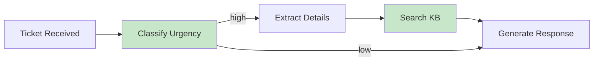

# Advanced Prompting Techniques — AI Tutorial (aitutorial.dev)

## Provenance
- Original location: `research/web/aitutorial-advanced-techniques/`
- Format: web capture (HTML + `page.md` extraído), página de documentación
- URL: https://aitutorial.dev/prompting/advanced-techniques
- `fetched_at`: 2026-08-14T16:56:18Z
- `http_status`: 200
- `byte_size`: 471287
- Título capturado: `Advanced Prompting Techniques - AI Tutorial`
- Autor / fuente: AITutorial.dev. Documentación construida sobre Mintlify; los logos se sirven desde un CDN de Digibee (`mintcdn.com/digibee-1a4db0d2/...`), igual que en la página hermana. **Autoría individual no declarada.**
- Fecha del original: **sin fecha**. La página no trae fecha de publicación ni de última actualización.
- Sección del sitio: "Context Engineering & Prompt Design"
- Subtítulo de la página: "Apply advanced techniques to improve the performance of your prompts"

Encuadre: material didáctico / documentación práctica, **no una fuente académica**. Es la página hermana de `aitutorial-structured-prompt-engineering.web.md` (mismo sitio, misma sección, mismos logos byte a byte).

**Por qué está en el corpus:** el deck manda esta URL como tarea. Slide 57 ("¡A Practicar!") lista cuatro módulos de `aitutorial.dev` con 45-60 minutos estimados, y el segundo es exactamente `aitutorial.dev/prompting/advanced-techniques`, descrito como "CoT, Self-Consistency, Extended Thinking y Prompt Chaining aplicados". Esta captura es la fuente literal de ese ejercicio.

## Key claims

- Tesis de apertura: **"When a single prompt isn't enough, you need techniques that improve reasoning and reliability."** El eje de la página son cuatro técnicas: Chain-of-Thought, self-consistency, extended thinking y prompt chaining.
- **CoT está en retroceso relativo frente a los modelos de razonamiento.** Afirmación explícita y contracorriente respecto de cómo suele presentarse la técnica: *"Chain-of-Thought (CoT) is less common with reasoning models, since they already perform an explicit reasoning step."* Con SLMs y modelos no-razonadores, en cambio, sigue rindiendo.
- Aun así vale aprender CoT, por una razón pedagógica y no de rendimiento: *"they help you understand how these models think and how to effectively influence their behavior."*
- El argumento central a favor de CoT en la página **no es la exactitud sino la depurabilidad**: sin razonamiento visible no se puede diagnosticar una respuesta equivocada. *"But what if you need to debug a wrong answer? You can't see the reasoning."*
- CoT tiene contraindicaciones concretas: no usarlo para extracción o clasificación determinística a `temperature=0`; cuidado con registrar razonamiento intermedio sensible (privacidad/compliance); costo y latencia suben con salidas más largas.
- Self-consistency se presenta como mecanismo de confiabilidad frente a la no-determinación: generar varias respuestas y votar.
- El costo de self-consistency es multiplicativo y la página lo dice sin adornos: **"5x Agent tasks = 5x cost"**.
- Extended thinking (bloques `<thinking>` de Claude) se justifica por tres motivos: depuración, calidad (obliga a pensar antes de responder) y **transparencia auditable** — *"Clients can audit AI decisions"*.
- Prompt chaining: partir una tarea compleja en tareas simples secuenciales. Contra la intuición del costo, la página sostiene que encadenar suele salir **más barato en total**, porque solo se invocan los pasos caros cuando hacen falta.
- Advertencia metodológica repetida y explícita, que es lo más valioso de la página para una clase: **"Always validate on your evaluation set; do not assume universal gains."**

## Definitions and terminology

- **Chain-of-Thought (CoT)** — "Making Reasoning Visible". Técnica que fuerza al modelo a exponer pasos intermedios. La página lo explica mecánicamente como creación de *"intermediate tokens"* que guían al modelo. Es el mismo concepto que formaliza Wei et al. 2022 (ver `chain-of-thought-wei.web.md`), aquí en registro práctico.
- **Intermediate tokens** — la formulación de la página para el mecanismo de CoT: los pasos escritos no son solo explicación para el humano, son contexto que condiciona la generación siguiente.
- **Self-Consistency** — "Voting for Reliability". Definida operativamente en dos movimientos: *"The Problem: One response might be wrong due to non-determinism, ambiguous tasks, and/or valid solution paths. The Solution: Generate multiple responses and vote."* La **votación por mayoría** es el núcleo: se muestrean varias cadenas de razonamiento y se elige la respuesta más frecuente. Coincide con Wang et al. 2022 (ver `self-consistency-wang.web.md`).
- **Extended Thinking** — presentada como *"Anthropic's Secret Weapon"* y marcada como **Claude-Specific Feature**: el modelo expone su razonamiento en etiquetas `<thinking>` antes de responder. Las etiquetas sirven en dos direcciones: el modelo las emite, y el prompt también puede usarlas para **guiar los pasos** de Claude.
- **Prompt Chaining** — partir una tarea compleja en tareas simples secuenciales, cada una con su propia llamada. Contrapuesto a las "Single Prompt Limitations".
- **Zero-shot implícito** — el ejemplo base de la página (`"What's 15% tip on a $47.83 bill?"` → `$7.17`) es un prompt sin ejemplos ni instrucción de razonar; funciona como el "antes" contra el que se contrastan CoT y el patrón de producción.

## Evidence and examples

**Números duros que la página afirma (sección "Real-World Impact", sobre CoT):**

- Generación de código: **35% menos bugs** con CoT.
- Problemas matemáticos: **50-70% de mejora en exactitud**.
- Diagnóstico médico: *"More reliable clinical reasoning"* (cualitativo, sin cifra).

Ninguno de los tres lleva referencia. Ver `Inconsistencies`.

**Afirmaciones cuantitativas hedgeadas (sección "Performance Data", sobre self-consistency):**

- *"CoT often improves performance on reasoning benchmarks; magnitude varies by task/model (see Wei et al., 2022)"*.
- *"Combining CoT + Self-Consistency can yield additional gains; magnitude varies by task/model (see Wang et al., 2022)"*.

Estas dos sí citan, y citan exactamente los dos papers que ya están en el corpus.

**Cuándo usar self-consistency:** decisiones de alto riesgo (médicas, financieras, legales); razonamiento complejo donde el error sale caro; clasificación donde importa la confianza. El primer ítem es el que conecta directo con el encuadre biomédico de la clase.

**Ejemplo corrido a lo largo de la página** — el mismo problema trivial en tres niveles crecientes, que es el mejor recurso didáctico de la captura:

1. **Chat pelado**: `"What's 15% tip on a $47.83 bill?"` → respuesta `$7.17`, sin razonamiento visible.
2. **CoT simple**: system `"Show your reasoning steps briefly before the final answer."` + user `"What's a 15% tip on a $47.83 bill? Think step by step."`
3. **Patrón de producción**: el mismo problema envuelto en XML con instrucciones numeradas y bloques `<thinking>` / `<final_answer>` separados.

**Ejemplo aplicado (extended thinking):** análisis de contrato legal — obligaciones clave, cláusulas de terminación, límites de responsabilidad, red flags — donde el bloque `<thinking>` se extrae por separado y **se guarda como pista de auditoría** (`reasoning: thinking // Store for compliance/review`). Es un ejemplo directamente trasladable a un contexto regulado como el biomédico.

**Ejemplo aplicado (prompt chaining):** pipeline de tickets de soporte, con bifurcación por urgencia — el diagrama Mermaid preservado abajo.

**Trade-offs de chaining, tal como los lista la página:**

| Beneficios | Contras |
|---|---|
| Cada paso es simple → menos errores | Más latencia (llamadas secuenciales) |
| Los pasos fallidos reintentan de forma independiente | Código más complejo |
| Más barato: solo se llama a los pasos caros cuando hace falta | Múltiples llamadas al LLM (aunque a menudo más barato en total) |
| Más fácil de evaluar y mejorar | |

## Inconsistencies / open questions

1. **La página se contradice a sí misma sobre el rigor de las cifras.** En "Performance Data" es escrupulosa — hedgea dos veces ("magnitude varies by task/model"), cita a Wei y a Wang, y cierra con *"do not assume universal gains"*. Tres párrafos antes, en "Real-World Impact", tira **35% menos bugs** y **50-70% de mejora** sin ninguna referencia, sin benchmark, sin modelo y sin tarea. Son dos estándares de evidencia incompatibles en la misma página. **Si el deck cita esos dos números, los cita sin respaldo.**

2. **La captura pierde el contenido interactivo, que es la mitad de la página.** `page.md` conserva la prosa y dos bloques de código, pero la página real está construida sobre componentes React (`LLMPlayground`, `CodeEditor`, `Mermaid`) que no se renderizan en HTML estático — el HTML incluso deja la marca `BAILOUT_TO_CLIENT_SIDE_RENDERING`. Los recuperé del payload RSC embebido y están abajo en `Raw / preserved excerpts`, pero con dos límites:
   - Los **tres playgrounds** quedaron reconstruidos con sus prompts exactos. Lo que no existe es la interacción: el alumno que hace la tarea ejecuta y ve salidas reales; la captura solo tiene la entrada.
   - Los **dos `CodeEditor`** son punteros a archivos que **no están en la captura**: `src/prompting/advance_self_consistency.ts` (líneas 24-36, "Advanced Self-Consistency") y `src/prompting/prompt_chaining.ts` (líneas 127-139, "Prompt Chaining"). Es decir: **la implementación de self-consistency y la de chaining — las dos técnicas más operativas de la página — no están en el material capturado.** Si la clase quiere mostrar cómo se implementa la votación por mayoría, esta captura no alcanza.

3. **Falta la definición de "self-consistency" en su propio nivel de detalle.** La página dice "generate multiple responses and vote" y pasa al costo. Nunca especifica cuántas muestras, con qué temperatura, ni cómo se resuelven los empates. El "5x" del costo sugiere n=5, pero nunca lo dice. Ese detalle está en Wang et al. (ver `self-consistency-wang.web.md`), no acá.

4. **"Extended Thinking" mezcla dos cosas distintas bajo un nombre.** Por un lado, la capacidad nativa del modelo de exponer razonamiento; por otro, el truco de prompting de escribir uno mismo un bloque `<thinking>` en el prompt para guiar los pasos. La página desliza de una a otra sin marcar la transición ("Thinking tags can also be used to guide Claude steps"). Son mecanismos diferentes: uno es una feature del modelo, el otro es scaffolding textual. Vale aclararlo en clase si se usa este material.

5. **Sesgo de proveedor no declarado.** "Anthropic's Secret Weapon" es un subtítulo de marketing, y la sección entera está atada a Claude. La página no menciona los equivalentes de otros proveedores.

6. **Sin fecha.** No hay fecha de publicación ni de actualización. La afirmación de apertura — que CoT importa menos con modelos de razonamiento — es fuertemente dependiente del momento, y no se puede fechar.

7. **La tarea de la slide 57 es más grande de lo que parece.** El deck estima 45-60 minutos para los cuatro módulos. Solo este módulo tiene tres playgrounds interactivos y dos ejercicios de código. Si el presentador quiere sostener esa estimación, conviene que la haya cronometrado.

## Images / diagrams

La página no trae ninguna figura de contenido. Los únicos assets son las dos variantes del logotipo del sitio, **byte a byte idénticas** a las de `aitutorial-structured-prompt-engineering.web/images/` (mismos md5: `e7ea3dc8...` para la clara, `126454d7...` para la oscura). El único diagrama real de la página es el flowchart de Mermaid, que **no es una imagen** — es texto que el navegador renderiza en cliente; está preservado como texto en `Raw / preserved excerpts`.

### `aitutorial-advanced-techniques.web/images/logo-light-full.svg`
- **Provenance**: `research/web/aitutorial-advanced-techniques/assets/logo-light-full.svg`, `alt="light logo"`, servido desde `mintcdn.com/digibee-1a4db0d2/qVB-_urhSn1RCBv0/logo/logo-light-full.svg`.
- **Depiction**: logotipo de cabecera del sitio, variante para fondo claro. SVG apaisado, `width="1462" height="220"`, `viewBox="0 0 1462 220"`. Combina un isotipo — dos `<circle>` y seis `<path>`, más un `<image>` raster PNG embebido en base64 (662 × 222 px) — con un bloque de texto tipográfico a la derecha. El texto va en **azul institucional `#234c7c`**, mismo color que el trazo del isotipo; los seis `fill:#234c7c` del archivo son todos de esa familia cromática.
- **Why it matters**: nada de contenido. Sirve solo para identificar visualmente la fuente si el deck reproduce una captura de pantalla de la página — cosa plausible acá, porque la slide 57 manda al alumno a este sitio y una miniatura ayuda a que lo reconozca.
- **Transcribed text**: **"AITutorial.dev"** — es un `<text>`/`<tspan>` real dentro del SVG, no un trazado. Estilo declarado: `font-size:192px`, familia `Noto Sans Linear A` en el `<text>` pero **`Futura` Medium (`font-weight:500`) en el `<tspan>` que efectivamente pinta las letras**, posicionado en `x="249.70343" y="177.65302"`, `fill:#234c7c`.

### `aitutorial-advanced-techniques.web/images/logo-dark-full.svg`
- **Provenance**: `research/web/aitutorial-advanced-techniques/assets/logo-dark-full.svg`, `alt="dark logo"`.
- **Depiction**: la misma marca en variante para fondo oscuro. Estructura idéntica (mismo `viewBox`, dos círculos, seis paths, la misma imagen raster embebida). La única diferencia real es el color del texto, que pasa a **blanco `#ffffff`**; el archivo tiene siete `fill:#ffffff` donde el claro tiene seis `fill:#234c7c`.
- **Why it matters**: ninguna.
- **Transcribed text**: **"AITutorial.dev"**, `fill:#ffffff`, misma tipografía Futura Medium a 192 px.

## Raw / preserved excerpts

**Apertura de la página, verbatim:**

> When a single prompt isn't enough, you need techniques that improve reasoning and reliability. This page covers Chain-of-Thought, self-consistency, extended thinking, and prompt chaining.

**Chain-of-Thought (CoT): Making Reasoning Visible — verbatim:**

> Chain-of-Thought (CoT) is less common with reasoning models, since they already perform an explicit reasoning step. With SLMs and other non-reasoning models, however, CoT can still make a meaningful difference. That said, it's still valuable to learn CoT techniques—they help you understand how these models think and how to effectively influence their behavior.
>
> **The Problem:** But what if you need to debug a wrong answer? You can't see the reasoning. The expected response would be something like (note: the response shown below is a placeholder example, not a real API response):
>
> **In Production:**
> - Use CoT for complex reasoning; avoid for deterministic extraction/classification at temperature=0.
> - Consider privacy/compliance: avoid logging sensitive intermediate reasoning.
> - Cost/latency rise with longer outputs—use selectively.
>
> **Why It Works:**
> - Often improves performance on reasoning tasks (magnitude varies by task/model)
> - Creates "intermediate tokens" that guide the model
> - Makes errors debuggable
>
> **Production Pattern:**
>
> **Real-World Impact:**
> - Code generation: 35% fewer bugs with CoT
> - Math problems: 50-70% accuracy improvement
> - Medical diagnosis: More reliable clinical reasoning

*(Los dos "**:**" seguidos de nada — "The Problem:" y "Production Pattern:" — son exactamente donde iban los playgrounds interactivos que la extracción perdió. Reconstruidos más abajo.)*

**Self-Consistency: Voting for Reliability — verbatim:**

> **The Problem:** One response might be wrong due to non-determinism, ambiguous tasks, and/or valid solution paths.
>
> **The Solution:** Generate multiple responses and vote.
>
> **When to Use:**
> - High-stakes decisions (medical, financial, legal)
> - Complex reasoning where errors are costly
> - Classification tasks where confidence matters
>
> **Cost Consideration:**
> - 5x Agent tasks = 5x cost
> - Use only when accuracy justifies expense
>
> **Performance Data:**
> - CoT often improves performance on reasoning benchmarks; magnitude varies by task/model (see Wei et al., 2022)
> - Combining CoT + Self-Consistency can yield additional gains; magnitude varies by task/model (see Wang et al., 2022)
> - Always validate on your evaluation set; do not assume universal gains

**Extended Thinking: Anthropic's Secret Weapon — verbatim:**

> **Claude-Specific Feature:** Claude can expose its "thinking" before answering using special tags.
>
> **Why This Matters:**
> 1. **Debugging:** See where reasoning went wrong
> 2. **Quality:** Forces model to think before answering
> 3. **Transparency:** Clients can audit AI decisions
>
> **Thinking tags can also be used to guide Claude steps:**

**Prompt Chaining: Breaking Complex Tasks — verbatim:**

> **Single Prompt Limitations:**
> - Context window fills up
> - Errors compound
> - Hard to debug
> - Expensive to retry
>
> **Chaining Solution:** Break one complex task into sequential simple tasks.
>
> **Benefits:**
> - Each step is simple → fewer errors
> - Failed steps can retry independently
> - Cheaper: Only call expensive steps when needed
> - Easier to evaluate and improve
>
> **Trade-off:**
> - More latency (sequential calls)
> - More complex code
> - Multiple LLM calls (but often cheaper overall)

---

### Bloques de código presentes en `page.md`

**Prompt de extended thinking (bloque `<thinking>`):**

```
<thinking>
Let me analyze this complex legal document...
- First, I'll identify the key clauses
- Then, I'll look for any conflicting terms
- Finally, I'll assess risk level
</thinking>

[Your actual task here]
```

**Uso de thinking tags para guiar los pasos de Claude (TypeScript):**

```typescript
async function analyzeContract(contractText: string): Promise<{
    analysis: any;
    reasoning: string;
}> {
    const prompt = `
<document>
${contractText}
</document>

<thinking>
I need to analyze this contract for:
1. Key obligations
2. Termination clauses
3. Liability limits
4. Red flags

Let me work through each section...
</thinking>

Provide a JSON response with:
- obligations: list of key obligations
- risks: list of potential risks
- recommendations: list of recommended actions
`;

    const response = await claude.generate(prompt);

    // Parse thinking section for audit trail
    const thinking = extractBetweenTags(response, "thinking");
    const result = extractJson(response);

    return {
        analysis: result,
        reasoning: thinking  // Store for compliance/review
    };
}
```

---

### Contenido interactivo recuperado del payload RSC

*No aparece en `page.md` — extraído de `original.html`. Estos son los prompts exactos de los tres playgrounds de la página, en orden.*

**Playground 1 — "Let's do some math"** (`defaultMode: chat`, altura 400px, `keepInput: true`). El caso base, sin razonamiento:

```
Input:    What's 15% tip on a $47.83 bill?
Response: $7.17
```

**Playground 2 — "Chain-of-Thought"** (`defaultMode: advanced`, altura 400px). El mismo problema con CoT mínimo:

```
system: Show your reasoning steps briefly before the final answer.
user:   What's a 15% tip on a $47.83 bill? Think step by step.
```

**Playground 3 — "CoT Production Pattern"** (`defaultMode: advanced`, altura 600px). El mismo problema con el andamiaje completo — este es el que la página llama "Production Pattern":

```
system: You are a helpful assistant that solves problems step by step.

user:
<question>What's 15% tip on a $47.83 bill?</question>

<instructions>
Solve this step by step:
1. Identify what information you need
2. Break down the problem into sub-steps
3. Solve each sub-step
4. Combine into final answer
5. Verify your answer makes sense
</instructions>

<thinking>
[Your step-by-step reasoning here]
</thinking>

<final_answer>
[Your final answer here]
</final_answer>
```

**Diagrama Mermaid de prompt chaining** (pipeline de tickets de soporte). Es el único diagrama de la página; se renderiza en cliente, por eso no hay archivo de imagen:



Leído: un ticket entra, se clasifica la urgencia; si es alta pasa por extracción de detalles y búsqueda en la base de conocimiento antes de generar la respuesta; si es baja **saltea esos dos pasos** y va directo a generar. Los dos nodos resaltados en verde (`#c8e6c9`) son justamente los que se saltean — la ilustración visual del argumento "solo se llama a los pasos caros cuando hace falta".

**Referencias a código no incluido en la captura** (componentes `CodeEditor`, punteros a un repositorio que no se capturó):

```
src/prompting/advance_self_consistency.ts · función main · líneas 24-36 · "Advanced Self-Consistency"
src/prompting/prompt_chaining.ts          · función main · líneas 127-139 · "Prompt Chaining"
```

---

**Navegación y cromo del sitio, tal como quedó en la extracción:**

> [Skip to main content] AI Tutorial home page · Search... ⌘K · Navigation: Context Engineering & Prompt Design → Advanced Prompting Techniques
>
> Documentation Index — Fetch the complete documentation index at: /llms.txt. Use this file to discover all available pages before exploring further.
>
> Was this page helpful? Yes / No ⌘I
