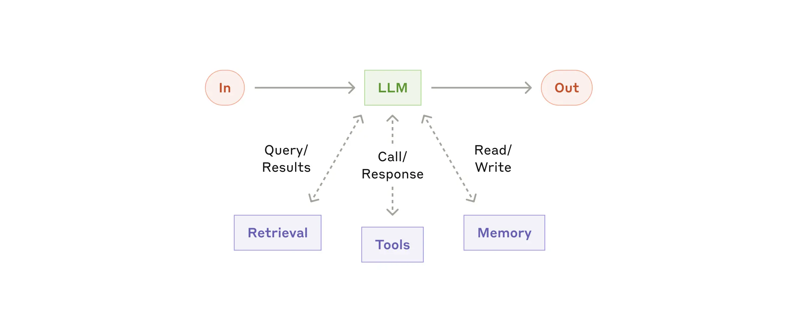
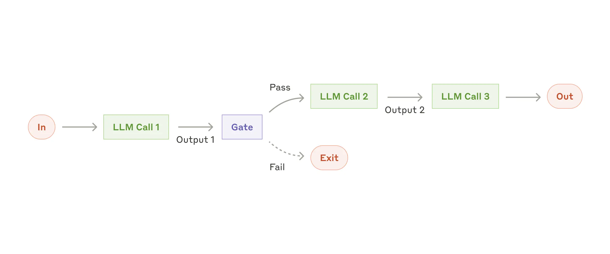
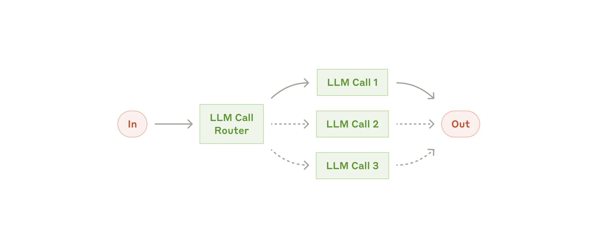
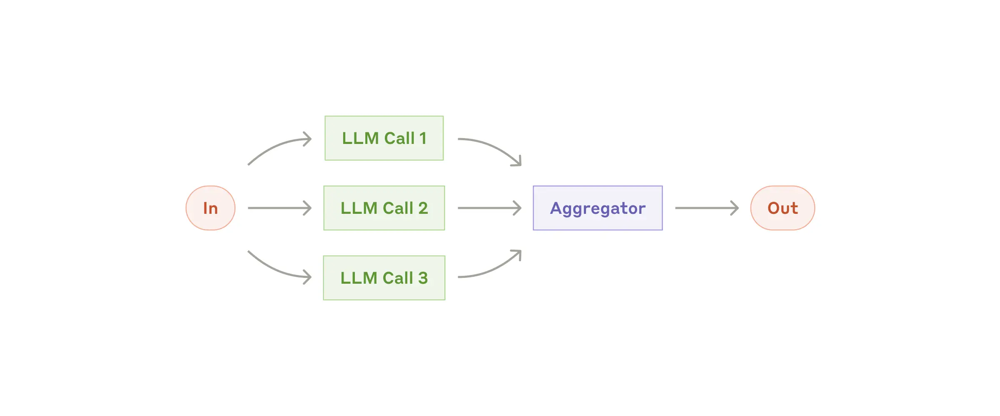
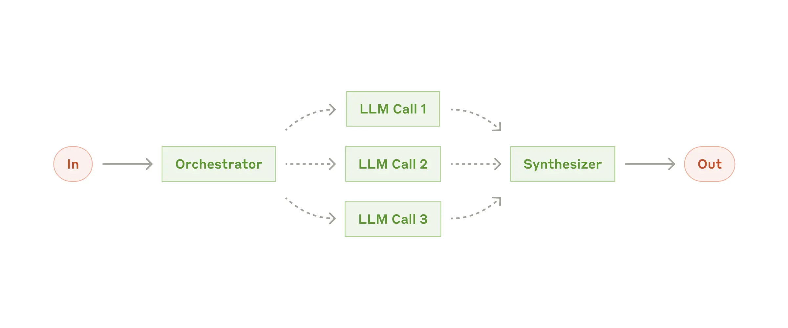
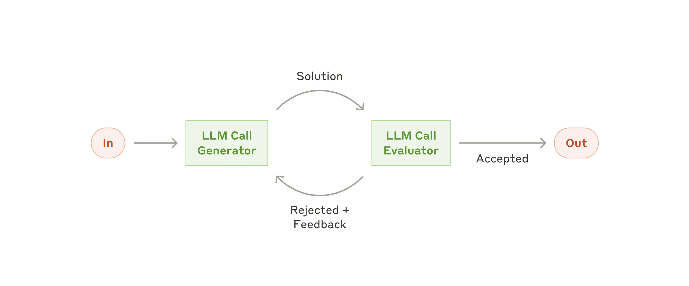
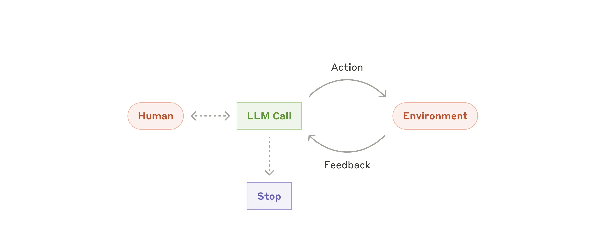
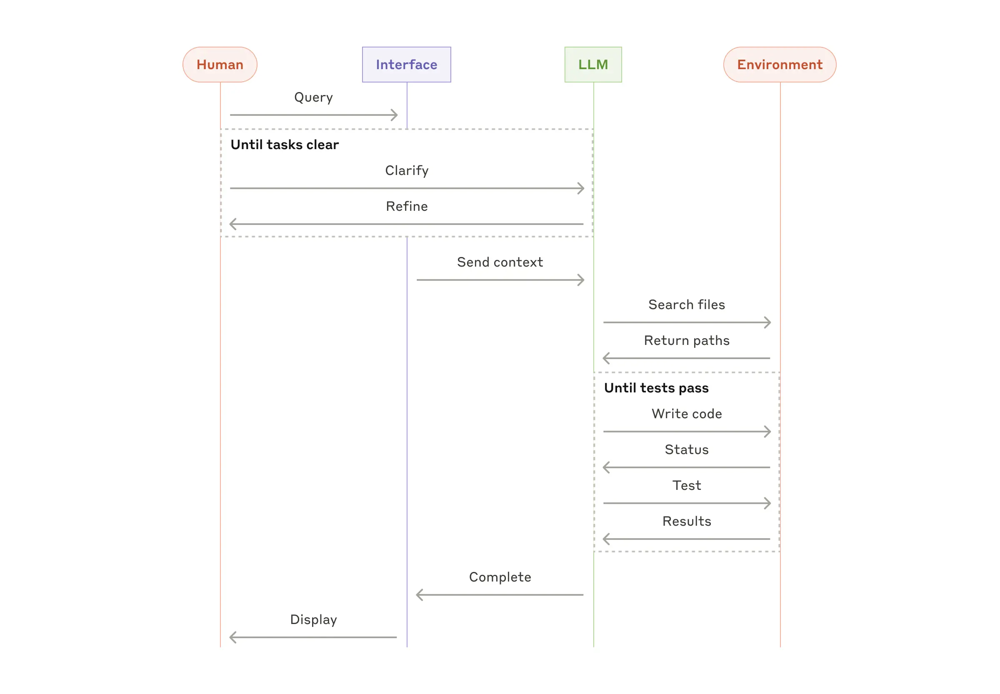

# Building effective agents (Anthropic Engineering)

## Provenance
- Original location: research/web/anthropic-building-effective-agents/ (page.md used; 21,423 chars, 21 headings — no fallback needed)
- Format: html (web capture via talksmith:ingest)
- Author / source (if known): Anthropic — written by Erik S. and Barry Zhang. URL: https://www.anthropic.com/engineering/building-effective-agents
- Date of original (if known): Published Dec 19, 2024 (the live page carries a later editorial note and updated model names). Fetched 2026-08-14T16:56:51Z (earlier capture than the other web sources of this Talk).

## Key claims
- "the most successful implementations use simple, composable patterns rather than complex frameworks."
- Editorial note on the captured page: "Much of the tooling landscape described in this post has changed since December 2024. For our current approach, see how we built Claude Managed Agents and the Managed Agents documentation."
- **Agentic systems** split into: "**Workflows** are systems where LLMs and tools are orchestrated through predefined code paths." / "**Agents**, on the other hand, are systems where LLMs dynamically direct their own processes and tool usage, maintaining control over how they accomplish tasks."
- "find the simplest solution possible, and only increasing complexity when needed. This might mean not building agentic systems at all." Agentic systems trade latency and cost for task performance. "For many applications, however, optimizing single LLM calls with retrieval and in-context examples is usually enough."
- Frameworks (Claude Agent SDK, Strands Agents SDK by AWS, Rivet, Vellum) help start but add abstraction that obscures prompts and responses; "start by using LLM APIs directly"; "Incorrect assumptions about what's under the hood are a common source of customer error."
- Building block: **augmented LLM** (retrieval, tools, memory), e.g. via MCP.
- Five workflows:
  - **Prompt chaining**: sequence of LLM calls with programmatic "gates"; trade latency for accuracy.
  - **Routing**: classify input and direct to specialized follow-up; separation of concerns (e.g. easy questions to Claude Haiku 4.5, hard ones to Claude Sonnet 4.5).
  - **Parallelization**: *sectioning* (independent subtasks in parallel) and *voting* (same task multiple times).
  - **Orchestrator-workers**: "a central LLM dynamically breaks down tasks, delegates them to worker LLMs, and synthesizes their results." Key difference from parallelization: "subtasks aren't pre-defined, but determined by the orchestrator based on the specific input." Use: coding changes across many files; search across multiple sources.
  - **Evaluator-optimizer**: one LLM generates, another evaluates and gives feedback in a loop; fit when clear evaluation criteria exist.
- **Agents**: "typically just LLMs using tools based on environmental feedback in a loop." They need "ground truth" from the environment at each step, may pause for human feedback, and use stopping conditions (max iterations). Use for open-ended problems where steps can't be predicted; cost and compounding errors require sandboxed testing and guardrails.
- "These building blocks aren't prescriptive"; "consider adding complexity *only* when it demonstrably improves outcomes."
- Three principles: simplicity; transparency (show planning steps); carefully craft the **agent-computer interface (ACI)** through tool documentation and testing.
- Appendix 1: agents shine in customer support and coding agents (verifiable through tests, clear success criteria, feedback loops, human oversight).
- Appendix 2: prompt-engineer your tools — formats close to natural internet text, no formatting overhead, give the model room to think; "poka-yoke" tools. On SWE-bench, "we actually spent more time optimizing our tools than the overall prompt" (switching to absolute filepaths fixed relative-path mistakes).

## Definitions and terminology
- **Agentic systems** (umbrella), **workflows**, **agents** (as quoted above).
- **Augmented LLM**.
- **Prompt chaining**, **gate**, **routing**, **parallelization** (sectioning / voting), **orchestrator-workers**, **evaluator-optimizer**.
- **Agent-computer interface (ACI)**, by analogy with HCI.
- **Poka-yoke** (mistake-proofing) applied to tool arguments.

## Evidence and examples
- Routing examples: customer service query types; small vs. large model routing.
- Parallelization examples: guardrails screened by a separate instance; automated evals per aspect; code vulnerability review voting; content appropriateness voting with thresholds.
- Orchestrator-workers examples: multi-file coding changes; multi-source search.
- Evaluator-optimizer examples: literary translation; complex search with an evaluator deciding whether to keep searching.
- Agent examples: SWE-bench coding agent; computer-use reference implementation.
- Customer-support vendors charging only for successful resolutions as evidence of confidence in agents.

## Inconsistencies / open questions
- [verified] The capture shows a December 2024 publication date but mentions Claude Haiku 4.5 / Claude Sonnet 4.5, the Claude Agent SDK and Managed Agents, which post-date December 2024 — checked in page.md: the page carries an explicit note that the tooling landscape changed and the live text has been edited since; quotes should be attributed to the current page, not to the December 2024 original.
- [open question] For the talk's taxonomy: this post places "orchestrator-workers" among **workflows** (LLM-directed decomposition but within a predefined structure), while the multi-agent research post calls the same pattern a **multi-agent architecture** — the two records use the term at different levels; the presenter should decide which framing the deck uses.

## Images / diagrams

- `anthropic-building-effective-agents.web/images/039b6648c28eb33070a63a58d49013600b229238-2554x2554.svg`
  - Provenance: page header illustration (decorative hero SVG).
  - Depiction: Decorative site chrome — not transcribed (presenter decision 2026-10-04)
  - Why it matters: n/a
  - Transcribed text: n/a
- `anthropic-building-effective-agents.web/images/image.webp`
  - Provenance: original `d3083d3f…-2401x1000.png`; caption "The augmented LLM".
  - Depiction: Building-block diagram: In → LLM → Out on a horizontal line. Below the LLM, three dashed bidirectional arrows connect it to Retrieval ("Query/Results"), Tools ("Call/Response") and Memory ("Read/Write").
  - Why it matters: Defines the unit every workflow and agent pattern is built from: an LLM augmented with retrieval, tools and memory. In a multi-agent talk, each agent box is one of these.
  - Transcribed text:

    ```text
    In
    LLM
    Out
    Query/ Results
    Call/ Response
    Read/ Write
    Retrieval
    Tools
    Memory
    ```

- `anthropic-building-effective-agents.web/images/image-2.webp`
  - Provenance: original `7418719e…-2401x1000.png`; caption "The prompt chaining workflow".
  - Depiction: Prompt-chaining workflow: In → LLM Call 1 → (Output 1) → Gate. From the Gate, a solid arrow "Pass" continues to LLM Call 2 → (Output 2) → LLM Call 3 → Out; a dashed arrow "Fail" goes to Exit.
  - Why it matters: The simplest multi-step composition: sequential LLM calls with a programmatic check (gate) between them. Baseline against which multi-agent designs should be justified.
  - Transcribed text:

    ```text
    In
    LLM Call 1
    Output 1
    Gate
    Pass
    Fail
    Exit
    LLM Call 2
    Output 2
    LLM Call 3
    Out
    ```

- `anthropic-building-effective-agents.web/images/image-3.webp`
  - Provenance: original `5c0c0e9f…-2401x1000.png`; caption "The routing workflow".
  - Depiction: Routing workflow: In → LLM Call Router, which branches to three alternatives LLM Call 1 (solid arrow), LLM Call 2 and LLM Call 3 (dashed arrows), all converging on Out. Solid vs dashed marks that only one route is taken for a given input.
  - Why it matters: Routing = classify the input and send it to one specialised handler. It is the seed of 'specialist agents' and of handoff-style multi-agent systems.
  - Transcribed text:

    ```text
    In
    LLM Call Router
    LLM Call 1
    LLM Call 2
    LLM Call 3
    Out
    ```

- `anthropic-building-effective-agents.web/images/image-4.webp`
  - Provenance: original `406bb032…-2401x1000.png`; caption "The parallelization workflow".
  - Depiction: Parallelization workflow: In fans out with solid arrows to LLM Call 1, LLM Call 2 and LLM Call 3 simultaneously; all three feed an Aggregator (programmatic, purple box) → Out.
  - Why it matters: Fixed fan-out/fan-in (sectioning or voting). Contrast with orchestrator-workers: here the split is predefined in code and all branches always run.
  - Transcribed text:

    ```text
    In
    LLM Call 1
    LLM Call 2
    LLM Call 3
    Aggregator
    Out
    ```

- `anthropic-building-effective-agents.web/images/image-5.webp`
  - Provenance: original `8985fc68…-2401x1000.png`; caption "The orchestrator-workers workflow".
  - Depiction: Orchestrator-workers workflow: In → Orchestrator (an LLM, green box) → dashed arrows to LLM Call 1, LLM Call 2, LLM Call 3 → dashed arrows into a Synthesizer (LLM) → Out. Dashed arrows indicate the subtasks are decided dynamically by the orchestrator.
  - Why it matters: The workflow form of the lead-agent/subagents architecture: an LLM decides at run time how to split the work and an LLM merges the results. Key bridge between 'workflows' and multi-agent systems.
  - Transcribed text:

    ```text
    In
    Orchestrator
    LLM Call 1
    LLM Call 2
    LLM Call 3
    Synthesizer
    Out
    ```

- `anthropic-building-effective-agents.web/images/image-6.webp`
  - Provenance: original `14f51e64…-2401x1000.png`; caption "The evaluator-optimizer workflow".
  - Depiction: Evaluator-optimizer workflow: In → LLM Call Generator; an arc labelled "Solution" goes to LLM Call Evaluator; an arc back labelled "Rejected + Feedback" returns to the Generator; from the Evaluator an arrow "Accepted" goes to Out.
  - Why it matters: Two LLM roles in a feedback loop (generator and critic) — the minimal two-agent pattern, also the basis of debate/reviewer setups.
  - Transcribed text:

    ```text
    In
    LLM Call Generator
    Solution
    LLM Call Evaluator
    Rejected + Feedback
    Accepted
    Out
    ```

- `anthropic-building-effective-agents.web/images/image-7.webp`
  - Provenance: original `58d9f10c…-2401x1000.png`; caption "Autonomous agent".
  - Depiction: Autonomous agent: a Human connected by a dashed bidirectional arrow to an LLM Call box; the LLM Call sends "Action" to the Environment and receives "Feedback" back in a loop; a dashed arrow down from the LLM Call leads to Stop.
  - Why it matters: The definition of an agent used throughout the talk: an LLM in a loop with the environment, deciding when to stop, with optional human check-ins. A multi-agent system composes several of these.
  - Transcribed text:

    ```text
    Human
    LLM Call
    Action
    Feedback
    Environment
    Stop
    ```

- `anthropic-building-effective-agents.web/images/image-8.webp`
  - Provenance: original `4b9a1f4e…-2400x1666.png`; caption "High-level flow of a coding agent".
  - Depiction: Sequence diagram of a coding agent with four lifelines: Human, Interface, LLM, Environment. Human sends Query to Interface. Dashed frame "Until tasks clear": Clarify (Human → LLM) and Refine (LLM → Human). Then Interface → LLM: Send context; LLM → Environment: Search files; Environment → LLM: Return paths. Dashed frame "Until tests pass": Write code (LLM → Env), Status (Env → LLM), Test (LLM → Env), Results (Env → LLM). Then LLM → Interface: Complete; Interface → Human: Display.
  - Why it matters: Shows two nested loops (clarification with the human, then write/test against the environment) with tests as the objective stop condition — the reason coding is a good fit for agents.
  - Transcribed text:

    ```text
    Human | Interface | LLM | Environment
    Query
    Until tasks clear
    Clarify
    Refine
    Send context
    Search files
    Return paths
    Until tests pass
    Write code
    Status
    Test
    Results
    Complete
    Display
    ```


## Raw / preserved excerpts

### Full capture (page.md, verbatim; image paths rewritten to the companion folder)

`````markdown
# Building Effective AI Agents \ Anthropic

_Source: <https://www.anthropic.com/engineering/building-effective-agents>_

[Skip to main content](#main-content)[Skip to footer](#footer)</>[Try Claude](https://claude.ai/)[Engineering at Anthropic](/engineering)

# Building effective agents

Published Dec 19, 2024

We've worked with dozens of teams building LLM agents across industries. Consistently, the most successful implementations use simple, composable patterns rather than complex frameworks. 

*Note: Much of the tooling landscape described in this post has changed since December 2024. For our current approach, see ****[how we built Claude Managed Agents](https://www.anthropic.com/engineering/managed-agents)* *and the ****[Managed Agents documentation.](https://platform.claude.com/docs/en/managed-agents/overview)*  
  
Over the past year, we've worked with dozens of teams building large language model (LLM) agents across industries. Consistently, the most successful implementations weren't using complex frameworks or specialized libraries. Instead, they were building with simple, composable patterns.

In this post, we share what we’ve learned from working with our customers and building agents ourselves, and give practical advice for developers on building effective agents.

## What are agents?

"Agent" can be defined in several ways. Some customers define agents as fully autonomous systems that operate independently over extended periods, using various tools to accomplish complex tasks. Others use the term to describe more prescriptive implementations that follow predefined workflows. At Anthropic, we categorize all these variations as **agentic systems**, but draw an important architectural distinction between **workflows **and** agents**:

- **Workflows** are systems where LLMs and tools are orchestrated through predefined code paths.
- **Agents**, on the other hand, are systems where LLMs dynamically direct their own processes and tool usage, maintaining control over how they accomplish tasks.

Below, we will explore both types of agentic systems in detail. In Appendix 1 (“Agents in Practice”), we describe two domains where customers have found particular value in using these kinds of systems.

## When (and when not) to use agents

When building applications with LLMs, we recommend finding the simplest solution possible, and only increasing complexity when needed. This might mean not building agentic systems at all. Agentic systems often trade latency and cost for better task performance, and you should consider when this tradeoff makes sense.

When more complexity is warranted, workflows offer predictability and consistency for well-defined tasks, whereas agents are the better option when flexibility and model-driven decision-making are needed at scale. For many applications, however, optimizing single LLM calls with retrieval and in-context examples is usually enough.

## When and how to use frameworks

There are many frameworks that make agentic systems easier to implement, including:

- The [Claude Agent SDK](https://platform.claude.com/docs/en/agent-sdk/overview); 
- [Strands Agents SDK by AWS](https://strandsagents.com/latest/);
- [Rivet](https://rivet.ironcladapp.com/), a drag and drop GUI LLM workflow builder; and 
- [Vellum](https://www.vellum.ai/), another GUI tool for building and testing complex workflows.

These frameworks make it easy to get started by simplifying standard low-level tasks like calling LLMs, defining and parsing tools, and chaining calls together. However, they often create extra layers of abstraction that can obscure the underlying prompts ​​and responses, making them harder to debug. They can also make it tempting to add complexity when a simpler setup would suffice.

We suggest that developers start by using LLM APIs directly: many patterns can be implemented in a few lines of code. If you do use a framework, ensure you understand the underlying code. Incorrect assumptions about what's under the hood are a common source of customer error.

See our [cookbook](https://platform.claude.com/cookbook/patterns-agents-basic-workflows) for some sample implementations.

## Building blocks, workflows, and agents

In this section, we’ll explore the common patterns for agentic systems we’ve seen in production. We'll start with our foundational building block—the augmented LLM—and progressively increase complexity, from simple compositional workflows to autonomous agents.

### Building block: The augmented LLM

The basic building block of agentic systems is an LLM enhanced with augmentations such as retrieval, tools, and memory. Our current models can actively use these capabilities—generating their own search queries, selecting appropriate tools, and determining what information to retain.

The augmented LLM

We recommend focusing on two key aspects of the implementation: tailoring these capabilities to your specific use case and ensuring they provide an easy, well-documented interface for your LLM. While there are many ways to implement these augmentations, one approach is through our recently released [Model Context Protocol](https://www.anthropic.com/news/model-context-protocol), which allows developers to integrate with a growing ecosystem of third-party tools with a simple [client implementation](https://modelcontextprotocol.io/tutorials/building-a-client#building-mcp-clients).

For the remainder of this post, we'll assume each LLM call has access to these augmented capabilities.

### Workflow: Prompt chaining

Prompt chaining decomposes a task into a sequence of steps, where each LLM call processes the output of the previous one. You can add programmatic checks (see "gate” in the diagram below) on any intermediate steps to ensure that the process is still on track.

The prompt chaining workflow

**When to use this workflow:** This workflow is ideal for situations where the task can be easily and cleanly decomposed into fixed subtasks. The main goal is to trade off latency for higher accuracy, by making each LLM call an easier task.

**Examples where prompt chaining is useful:**

- Generating Marketing copy, then translating it into a different language.
- Writing an outline of a document, checking that the outline meets certain criteria, then writing the document based on the outline.

### Workflow: Routing

Routing classifies an input and directs it to a specialized followup task. This workflow allows for separation of concerns, and building more specialized prompts. Without this workflow, optimizing for one kind of input can hurt performance on other inputs.

The routing workflow

**When to use this workflow:** Routing works well for complex tasks where there are distinct categories that are better handled separately, and where classification can be handled accurately, either by an LLM or a more traditional classification model/algorithm.

**Examples where routing is useful:**

- Directing different types of customer service queries (general questions, refund requests, technical support) into different downstream processes, prompts, and tools.
- Routing easy/common questions to smaller, cost-efficient models like Claude Haiku 4.5 and hard/unusual questions to more capable models like Claude Sonnet 4.5 to optimize for best performance.

### Workflow: Parallelization

LLMs can sometimes work simultaneously on a task and have their outputs aggregated programmatically. This workflow, parallelization, manifests in two key variations:

- **Sectioning**: Breaking a task into independent subtasks run in parallel.
- **Voting:** Running the same task multiple times to get diverse outputs.
The parallelization workflow

**When to use this workflow:** Parallelization is effective when the divided subtasks can be parallelized for speed, or when multiple perspectives or attempts are needed for higher confidence results. For complex tasks with multiple considerations, LLMs generally perform better when each consideration is handled by a separate LLM call, allowing focused attention on each specific aspect.

**Examples where parallelization is useful:**

- **Sectioning**:

- Implementing guardrails where one model instance processes user queries while another screens them for inappropriate content or requests. This tends to perform better than having the same LLM call handle both guardrails and the core response.
- Automating evals for evaluating LLM performance, where each LLM call evaluates a different aspect of the model’s performance on a given prompt.

- **Voting**:

- Reviewing a piece of code for vulnerabilities, where several different prompts review and flag the code if they find a problem.
- Evaluating whether a given piece of content is inappropriate, with multiple prompts evaluating different aspects or requiring different vote thresholds to balance false positives and negatives.

### Workflow: Orchestrator-workers

In the orchestrator-workers workflow, a central LLM dynamically breaks down tasks, delegates them to worker LLMs, and synthesizes their results.

The orchestrator-workers workflow

**When to use this workflow:** This workflow is well-suited for complex tasks where you can’t predict the subtasks needed (in coding, for example, the number of files that need to be changed and the nature of the change in each file likely depend on the task). Whereas it’s topographically similar, the key difference from parallelization is its flexibility—subtasks aren't pre-defined, but determined by the orchestrator based on the specific input.

**Example where orchestrator-workers is useful:**

- Coding products that make complex changes to multiple files each time.
- Search tasks that involve gathering and analyzing information from multiple sources for possible relevant information.

### Workflow: Evaluator-optimizer

In the evaluator-optimizer workflow, one LLM call generates a response while another provides evaluation and feedback in a loop.

The evaluator-optimizer workflow

**When to use this workflow:** This workflow is particularly effective when we have clear evaluation criteria, and when iterative refinement provides measurable value. The two signs of good fit are, first, that LLM responses can be demonstrably improved when a human articulates their feedback; and second, that the LLM can provide such feedback. This is analogous to the iterative writing process a human writer might go through when producing a polished document.

**Examples where evaluator-optimizer is useful:**

- Literary translation where there are nuances that the translator LLM might not capture initially, but where an evaluator LLM can provide useful critiques.
- Complex search tasks that require multiple rounds of searching and analysis to gather comprehensive information, where the evaluator decides whether further searches are warranted.

### Agents

Agents are emerging in production as LLMs mature in key capabilities—understanding complex inputs, engaging in reasoning and planning, using tools reliably, and recovering from errors. Agents begin their work with either a command from, or interactive discussion with, the human user. Once the task is clear, agents plan and operate independently, potentially returning to the human for further information or judgement. During execution, it's crucial for the agents to gain “ground truth” from the environment at each step (such as tool call results or code execution) to assess its progress. Agents can then pause for human feedback at checkpoints or when encountering blockers. The task often terminates upon completion, but it’s also common to include stopping conditions (such as a maximum number of iterations) to maintain control.

Agents can handle sophisticated tasks, but their implementation is often straightforward. They are typically just LLMs using tools based on environmental feedback in a loop. It is therefore crucial to design toolsets and their documentation clearly and thoughtfully. We expand on best practices for tool development in Appendix 2 ("Prompt Engineering your Tools").

Autonomous agent

**When to use agents:** Agents can be used for open-ended problems where it’s difficult or impossible to predict the required number of steps, and where you can’t hardcode a fixed path. The LLM will potentially operate for many turns, and you must have some level of trust in its decision-making. Agents' autonomy makes them ideal for scaling tasks in trusted environments.

The autonomous nature of agents means higher costs, and the potential for compounding errors. We recommend extensive testing in sandboxed environments, along with the appropriate guardrails.

**Examples where agents are useful:**

The following examples are from our own implementations:

- A coding Agent to resolve [SWE-bench tasks](https://www.anthropic.com/research/swe-bench-sonnet), which involve edits to many files based on a task description;
- Our [“computer use” reference implementation](https://github.com/anthropics/anthropic-quickstarts/tree/main/computer-use-demo), where Claude uses a computer to accomplish tasks.
High-level flow of a coding agent

## Combining and customizing these patterns

These building blocks aren't prescriptive. They're common patterns that developers can shape and combine to fit different use cases. The key to success, as with any LLM features, is measuring performance and iterating on implementations. To repeat: you should consider adding complexity *only* when it demonstrably improves outcomes.

## Summary

Success in the LLM space isn't about building the most sophisticated system. It's about building the *right* system for your needs. Start with simple prompts, optimize them with comprehensive evaluation, and add multi-step agentic systems only when simpler solutions fall short.

When implementing agents, we try to follow three core principles:

1. Maintain **simplicity** in your agent's design.
2. Prioritize **transparency** by explicitly showing the agent’s planning steps.
3. Carefully craft your agent-computer interface (ACI) through thorough tool **documentation and testing**.

Frameworks can help you get started quickly, but don't hesitate to reduce abstraction layers and build with basic components as you move to production. By following these principles, you can create agents that are not only powerful but also reliable, maintainable, and trusted by their users.

### Acknowledgements

Written by Erik S. and Barry Zhang. This work draws upon our experiences building agents at Anthropic and the valuable insights shared by our customers, for which we're deeply grateful.

## Appendix 1: Agents in practice

Our work with customers has revealed two particularly promising applications for AI agents that demonstrate the practical value of the patterns discussed above. Both applications illustrate how agents add the most value for tasks that require both conversation and action, have clear success criteria, enable feedback loops, and integrate meaningful human oversight.

### A. Customer support

Customer support combines familiar chatbot interfaces with enhanced capabilities through tool integration. This is a natural fit for more open-ended agents because:

- Support interactions naturally follow a conversation flow while requiring access to external information and actions;
- Tools can be integrated to pull customer data, order history, and knowledge base articles;
- Actions such as issuing refunds or updating tickets can be handled programmatically; and
- Success can be clearly measured through user-defined resolutions.

Several companies have demonstrated the viability of this approach through usage-based pricing models that charge only for successful resolutions, showing confidence in their agents' effectiveness.

### B. Coding agents

The software development space has shown remarkable potential for LLM features, with capabilities evolving from code completion to autonomous problem-solving. Agents are particularly effective because:

- Code solutions are verifiable through automated tests;
- Agents can iterate on solutions using test results as feedback;
- The problem space is well-defined and structured; and
- Output quality can be measured objectively.

In our own implementation, agents can now solve real GitHub issues in the [SWE-bench Verified](https://www.anthropic.com/research/swe-bench-sonnet) benchmark based on the pull request description alone. However, whereas automated testing helps verify functionality, human review remains crucial for ensuring solutions align with broader system requirements.

## Appendix 2: Prompt engineering your tools

No matter which agentic system you're building, tools will likely be an important part of your agent. [Tools](https://www.anthropic.com/news/tool-use-ga) enable Claude to interact with external services and APIs by specifying their exact structure and definition in our API. When Claude responds, it will include a [tool use block](https://docs.anthropic.com/en/docs/build-with-claude/tool-use#example-api-response-with-a-tool-use-content-block) in the API response if it plans to invoke a tool. Tool definitions and specifications should be given just as much prompt engineering attention as your overall prompts. In this brief appendix, we describe how to prompt engineer your tools.

There are often several ways to specify the same action. For instance, you can specify a file edit by writing a diff, or by rewriting the entire file. For structured output, you can return code inside markdown or inside JSON. In software engineering, differences like these are cosmetic and can be converted losslessly from one to the other. However, some formats are much more difficult for an LLM to write than others. Writing a diff requires knowing how many lines are changing in the chunk header before the new code is written. Writing code inside JSON (compared to markdown) requires extra escaping of newlines and quotes.

Our suggestions for deciding on tool formats are the following:

- Give the model enough tokens to "think" before it writes itself into a corner.
- Keep the format close to what the model has seen naturally occurring in text on the internet.
- Make sure there's no formatting "overhead" such as having to keep an accurate count of thousands of lines of code, or string-escaping any code it writes.

One rule of thumb is to think about how much effort goes into human-computer interfaces (HCI), and plan to invest just as much effort in creating good *agent*-computer interfaces (ACI). Here are some thoughts on how to do so:

- Put yourself in the model's shoes. Is it obvious how to use this tool, based on the description and parameters, or would you need to think carefully about it? If so, then it’s probably also true for the model. A good tool definition often includes example usage, edge cases, input format requirements, and clear boundaries from other tools.
- How can you change parameter names or descriptions to make things more obvious? Think of this as writing a great docstring for a junior developer on your team. This is especially important when using many similar tools.
- Test how the model uses your tools: Run many example inputs in our [workbench](https://console.anthropic.com/workbench) to see what mistakes the model makes, and iterate.
- [Poka-yoke](https://en.wikipedia.org/wiki/Poka-yoke) your tools. Change the arguments so that it is harder to make mistakes.

While building our agent for [SWE-bench](https://www.anthropic.com/research/swe-bench-sonnet), we actually spent more time optimizing our tools than the overall prompt. For example, we found that the model would make mistakes with tools using relative filepaths after the agent had moved out of the root directory. To fix this, we changed the tool to always require absolute filepaths—and we found that the model used this method flawlessly.

## Get the developer newsletter

Product updates, how-tos, community spotlights, and more. Delivered monthly to your inbox.
`````
