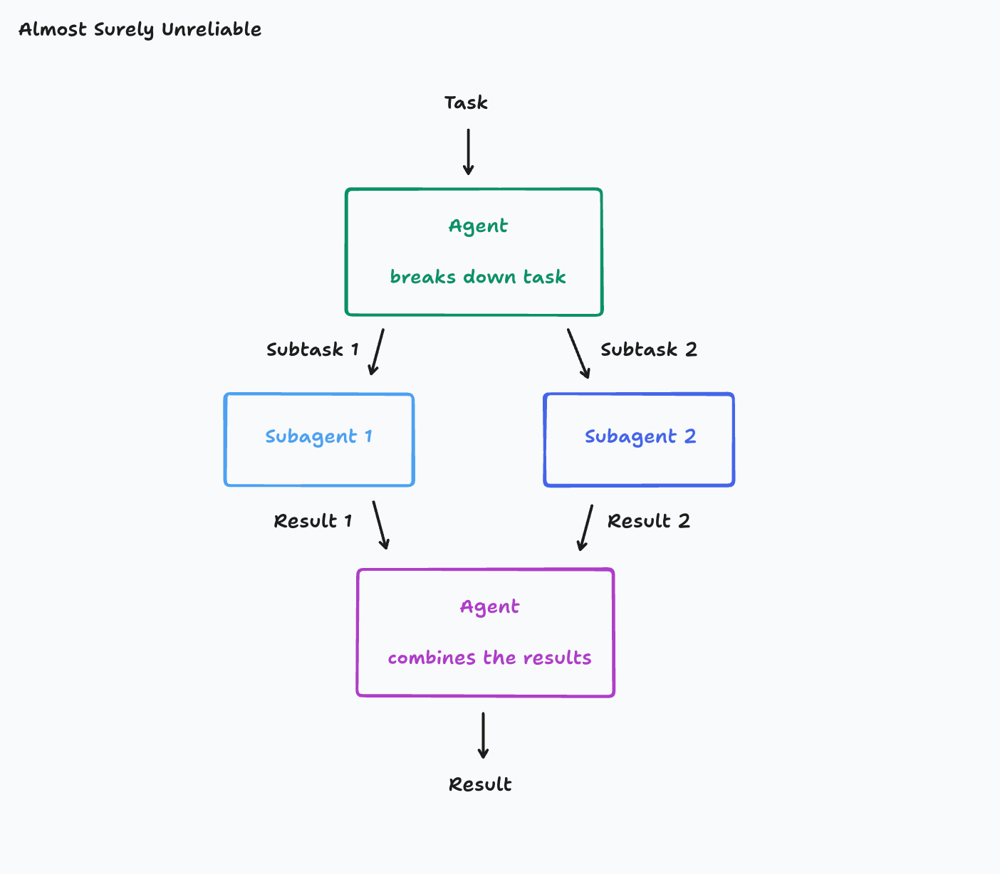
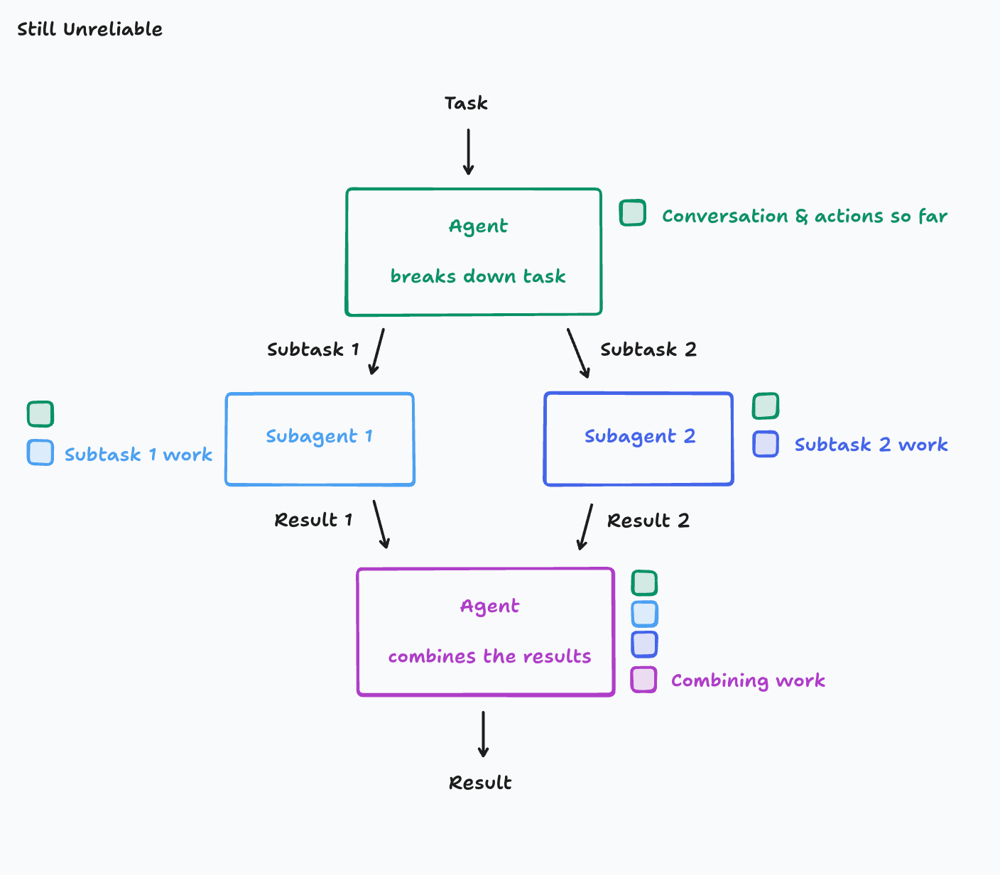
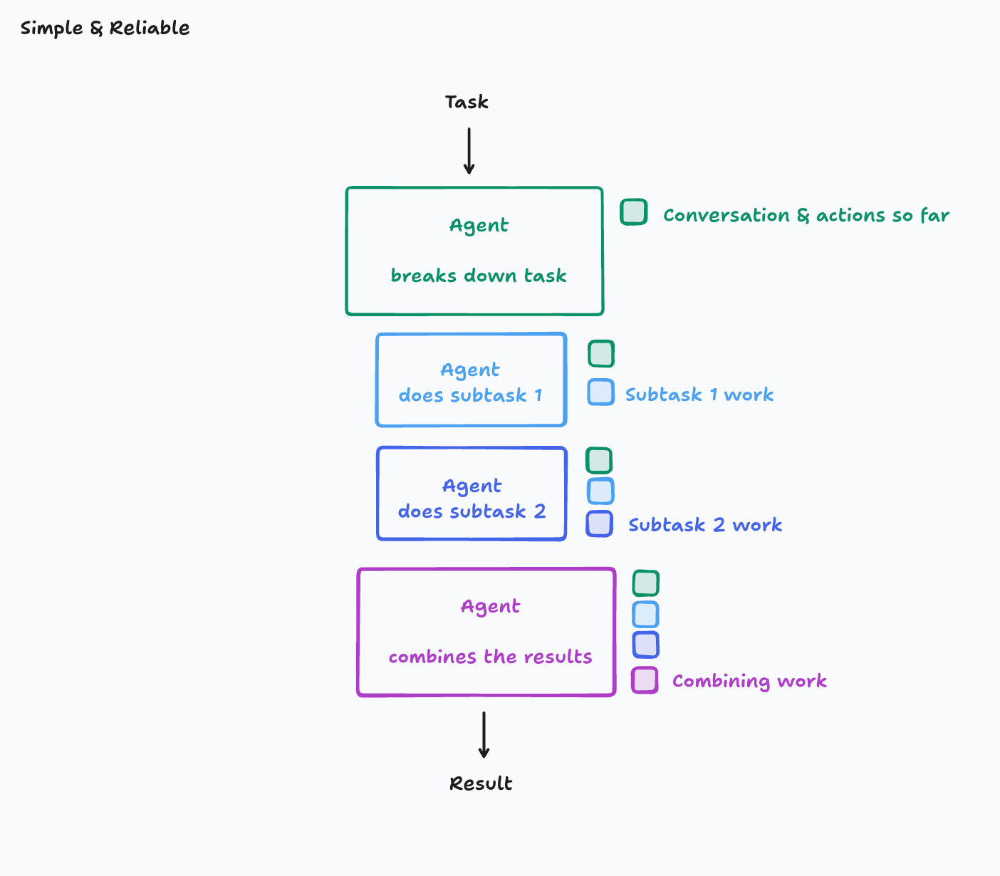
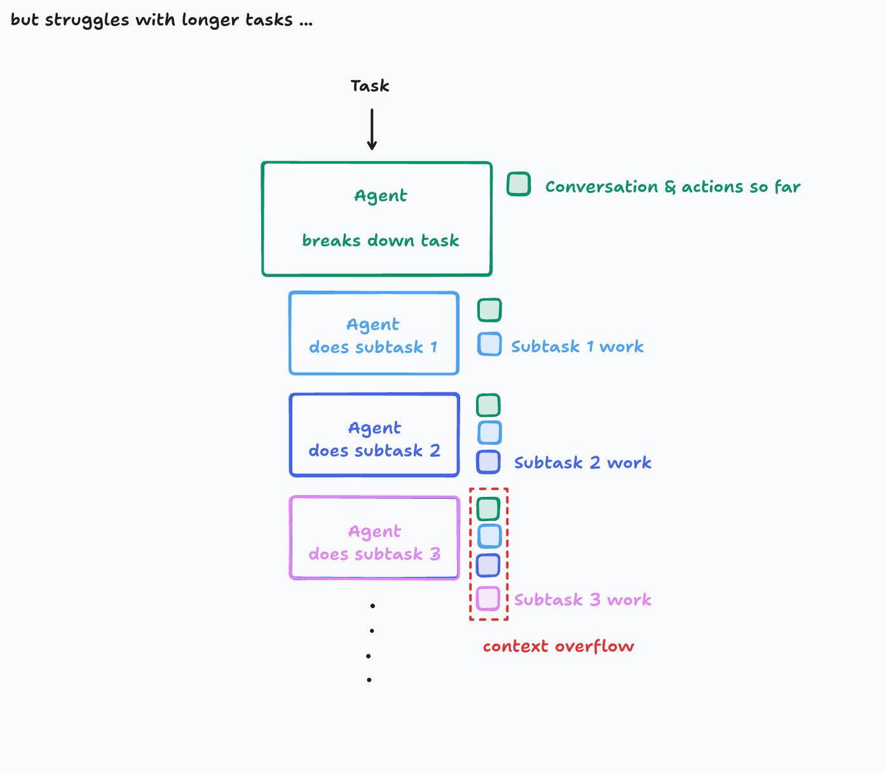
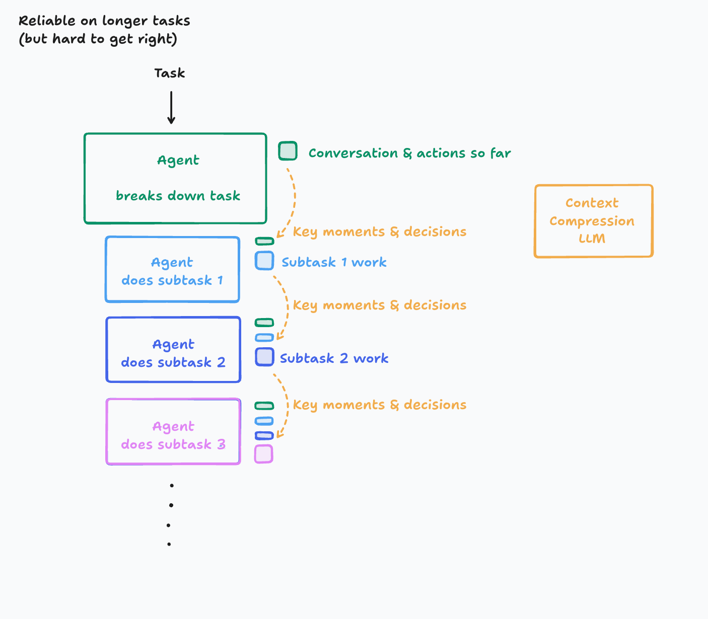
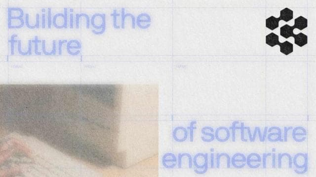
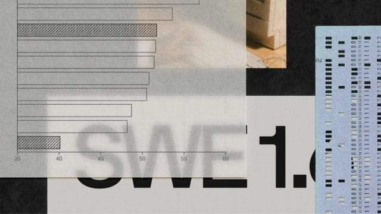
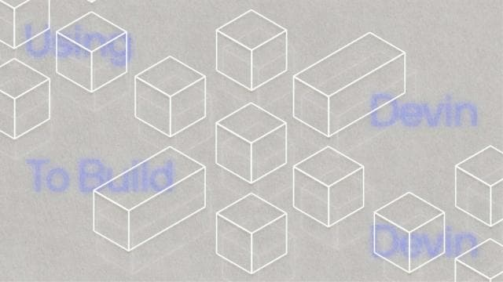
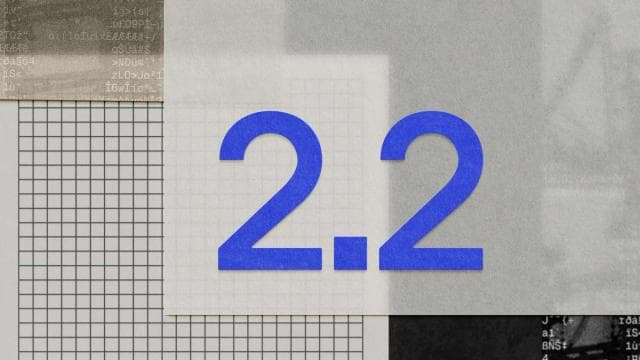

# Don't Build Multi-Agents (Cognition)

## Provenance
- Original location: research/web/cognition-dont-build-multi-agents/ (page.md used; 14,765 chars, 5 headings — short page but complete article body; no fallback needed)
- Format: html (web capture via talksmith:ingest)
- Author / source (if known): Walden Yan, Cognition (makers of Devin). URL: https://cognition.com/blog/dont-build-multi-agents
- Date of original (if known): "06.12.25" (June 12, 2025, US date format). Fetched 2026-10-04T19:22:26Z.

## Key claims
- Two principles of context engineering: **"Share context, and share full agent traces, not just individual messages"** (Principle 1) and **"Actions carry implicit decisions, and conflicting decisions carry bad results"** (Principle 2). "Principles 1 & 2 are so critical, and so rarely worth violating, that you should by default rule out any agent architectures that don't abide by them."
- Libraries such as OpenAI Swarm and Microsoft AutoGen "actively push concepts which I believe to be the wrong way of building agents. Namely, using multi-agent architectures".
- "Context engineering" is the next level of prompt engineering, done "automatically in a dynamic system"; "effectively the #1 job of engineers building AI agents."
- The tempting architecture (break work into parts → start subagents → combine results) "is very fragile". Flappy Bird example: subagent 1 builds a Super Mario-style background, subagent 2 a bird that doesn't fit; the combiner inherits two miscommunications. Even when each subagent gets the original task, subagents "cannot … see what the other was doing", so their implicit choices (visual style) conflict.
- Recommended default: a **single-threaded linear agent** with continuous context. For very long tasks, add an LLM whose purpose "is to compress a history of actions & conversation into key details, events, and decisions" ("hard to get right"; Cognition has fine-tuned a smaller model for it).
- Real-world examples: **Claude Code subagents** (as of June 2025) "never [do] work in parallel with the subtask agent, and the subtask agent is usually only tasked with answering a question, not writing any code" — the benefit is keeping investigative work out of the main agent's history; **edit-apply models** (large model writes markdown edit instructions, small model rewrites the file) were faulty because of misinterpreted instructions; today decision and application are usually done by a single model.
- Agent-to-agent negotiation: "agents today are not quite able to engage in this style of long-context proactive discourse with much more reliability than you would get with a single agent." "it is evident that in 2025, running multiple agents in collaboration only results in fragile systems. The decision-making ends up being too dispersed and context isn't able to be shared thoroughly enough between the agents." The author expects cross-agent context passing to "come for free" as single-threaded agents get better at communicating with humans.

## Definitions and terminology
- **Context engineering**: dynamically and automatically giving the model the context it needs (vs. prompt engineering for a chatbot).
- **Single-threaded linear agent**: one agent with continuous context.
- **Context compression model**: an LLM dedicated to compressing action/conversation history.
- **Edit apply model**: small model that applies a large model's described edits.

## Evidence and examples
- Flappy Bird clone decomposition (illustrative, not measured).
- Claude Code subagent behavior as of June 2025.
- Edit-apply models in 2024 coding tools (including Devin).
- References: Anthropic "Building effective agents"; OpenAI "A practical guide to building agents"; Generative Agents (arXiv 2304.03442); MetaGPT.

## Inconsistencies / open questions
- [verified] The post's description of Claude Code subagents ("never does work in parallel", subagent "usually only tasked with answering a question, not writing any code") is dated "As of June 2025" and is contradicted by the current Claude Code docs in this corpus (`claude-code-subagents.web.md`: parallel research subagents, background subagents, nesting up to three layers, general-purpose subagents that modify code) — checked both texts; use it as a historical snapshot, not a current description.
- [open question] The essay is argument-by-example (no quantitative evaluation); its claim that multi-agent collaboration "only results in fragile systems" in 2025 stands against Anthropic's +90.2% research result in `anthropic-multi-agent-research-system.web.md` — the two are reconcilable (research = parallelizable read-only work; coding = shared, dependent decisions), which the presenter may want to make explicit.
- [verified] The page.md tail includes an unrelated "Articles" carousel (nine later Cognition posts dated 2026) that is site chrome, not part of the essay — checked: the essay ends with the app.devin.ai / email invitation.

## Images / diagrams

- `cognition-dont-build-multi-agents.web/images/721e44474051c62156e15b5ffb1a249c996f0607-1404x1228.png`
  - Provenance: first in-article diagram (alt "Don't Build Multi-Agents"), right after the list "breaks its work down into multiple parts / starts subagents / combines those results" — the naive parallel-subagent architecture.
  - Depiction: Hand-drawn (Excalidraw-style) flow labelled top-left "Almost Surely Unreliable". Task → green box "Agent — breaks down task" → arrows "Subtask 1" and "Subtask 2" to two parallel boxes Subagent 1 and Subagent 2 → arrows "Result 1" and "Result 2" into a purple box "Agent — combines the results" → Result.
  - Why it matters: The naive parallel multi-agent architecture Cognition argues against: subagents work in parallel without seeing each other's work or the full conversation, so their outputs can be inconsistent and the combiner cannot reconcile them.
  - Transcribed text:

    ```text
    Almost Surely Unreliable
    Task
    Agent
    breaks down task
    Subtask 1
    Subtask 2
    Subagent 1
    Subagent 2
    Result 1
    Result 2
    Agent
    combines the results
    Result
    ```

- `cognition-dont-build-multi-agents.web/images/e3bdf57c10a9b6c4531b93a10fb79a712464c712-1408x1232.png`
  - Provenance: second in-article diagram, after Principle 1 — revised architecture where each subagent has the context of previous agents.
  - Depiction: Same parallel layout as the first diagram, now labelled "Still Unreliable", with small coloured squares representing context. The top Agent carries a green square "Conversation & actions so far". Subagent 1 carries green + light-blue "Subtask 1 work"; Subagent 2 carries green + dark-blue "Subtask 2 work"; the combining Agent carries green, light-blue, dark-blue and purple "Combining work". Each subagent sees the original context but not the other subagent's work.
  - Why it matters: Illustrates Principle 1 (share full context/traces): even when subagents get the original conversation, parallel subagents still cannot see each other's actions, so implicit decisions conflict (Principle 2: actions carry implicit decisions).
  - Transcribed text:

    ```text
    Still Unreliable
    Task
    Agent
    breaks down task
    Conversation & actions so far
    Subtask 1
    Subtask 2
    Subagent 1
    Subtask 1 work
    Subagent 2
    Subtask 2 work
    Result 1
    Result 2
    Agent
    combines the results
    Combining work
    Result
    ```

- `cognition-dont-build-multi-agents.web/images/06f64ae3557594588f702b2608d43564edc98c3d-1404x1230.png`
  - Provenance: third in-article diagram — "single-threaded linear agent".
  - Depiction: Vertical, single-threaded version labelled "Simple & Reliable". Task → "Agent — breaks down task" (green square: "Conversation & actions so far") → "Agent does subtask 1" (green + light-blue "Subtask 1 work") → "Agent does subtask 2" (green + light-blue + dark-blue "Subtask 2 work") → "Agent combines the results" (all previous squares + purple "Combining work") → Result. Context accumulates down the chain: every step sees everything before it.
  - Why it matters: Cognition's recommended default: a single-threaded linear agent where context is continuous, so no decision is made without seeing the previous ones. Counterpoint to the orchestrator-subagent designs elsewhere in the corpus.
  - Transcribed text:

    ```text
    Simple & Reliable
    Task
    Agent
    breaks down task
    Conversation & actions so far
    Agent
    does subtask 1
    Subtask 1 work
    Agent
    does subtask 2
    Subtask 2 work
    Agent
    combines the results
    Combining work
    Result
    ```

- `cognition-dont-build-multi-agents.web/images/4a36b048810fb2cba4ee4055ed2d3c80f188befc-1394x1218.png`
  - Provenance: fourth in-article diagram — linear agent whose context window starts to overflow on very large tasks.
  - Depiction: Same linear chain, labelled "but struggles with longer tasks ...", extended to "Agent does subtask 3" followed by vertical dots. The stack of context squares beside subtask 3 (green, light-blue, dark-blue, pink "Subtask 3 work") is enclosed in a red dashed box labelled "context overflow".
  - Why it matters: States the cost of the linear design: accumulated context eventually exceeds the window on long tasks — the problem that motivates either compression or (in other sources) delegation to subagents with isolated contexts.
  - Transcribed text:

    ```text
    but struggles with longer tasks ...
    Task
    Agent
    breaks down task
    Conversation & actions so far
    Agent
    does subtask 1
    Subtask 1 work
    Agent
    does subtask 2
    Subtask 2 work
    Agent
    does subtask 3
    Subtask 3 work
    context overflow
    ```

- `cognition-dont-build-multi-agents.web/images/836a7407ddf3dfacc0715c0502b4f3ffc7388829-1406x1230.png`
  - Provenance: fifth in-article diagram — linear agent with a context-compression LLM.
  - Depiction: Linear chain labelled "Reliable on longer tasks (but hard to get right)". Between consecutive agent steps, dashed orange arrows labelled "Key moments & decisions" carry compressed (thin, flattened) versions of earlier context squares into the next step, while only the current subtask's work stays full-size. An orange box at the right: "Context Compression LLM". Chain: breaks down task → does subtask 1 → does subtask 2 → does subtask 3 → dots.
  - Why it matters: Cognition's answer to context overflow without going multi-agent: a dedicated LLM that compresses history into key moments and decisions. Useful to contrast 'compress in one thread' vs. 'split into subagents' as two strategies for long tasks.
  - Transcribed text:

    ```text
    Reliable on longer tasks
    (but hard to get right)
    Task
    Agent
    breaks down task
    Conversation & actions so far
    Key moments & decisions
    Agent
    does subtask 1
    Subtask 1 work
    Key moments & decisions
    Agent
    does subtask 2
    Subtask 2 work
    Key moments & decisions
    Agent
    does subtask 3
    Context Compression LLM
    ```

- `cognition-dont-build-multi-agents.web/images/image.jpg`
  - Provenance: site chrome (related-articles carousel) — thumbnail "Estimating the Productivity of an Autonomous AI Software Engineer" (06.04.26). Not part of the essay.
  - Depiction: Decorative site chrome — not transcribed (presenter decision 2026-10-04)
  - Why it matters: n/a
  - Transcribed text: n/a
- `cognition-dont-build-multi-agents.web/images/image-2.jpg`
  - Provenance: site chrome thumbnail — "AI should earn its keep: Introducing the AI Productivity Guarantee" (06.04.26).
  - Depiction: Decorative site chrome — not transcribed (presenter decision 2026-10-04)
  - Why it matters: n/a
  - Transcribed text: n/a
- `cognition-dont-build-multi-agents.web/images/image-3.jpg`
  - Provenance: site chrome thumbnail — "Introducing Devin Desktop" (06.02.26).
  - Depiction: Decorative site chrome — not transcribed (presenter decision 2026-10-04)
  - Why it matters: n/a
  - Transcribed text: n/a
- `cognition-dont-build-multi-agents.web/images/image-4.jpg`
  - Provenance: site chrome thumbnail — "More Devins in More Places" (05.27.26).
  - Depiction: Decorative site chrome — not transcribed (presenter decision 2026-10-04)
  - Why it matters: n/a
  - Transcribed text: n/a
- `cognition-dont-build-multi-agents.web/images/image-5.jpg`
  - Provenance: site chrome thumbnail — "Devin in Windsurf" (04.15.26).
  - Depiction: Decorative site chrome — not transcribed (presenter decision 2026-10-04)
  - Why it matters: n/a
  - Transcribed text: n/a
- `cognition-dont-build-multi-agents.web/images/image-6.jpg`
  - Provenance: site chrome thumbnail — "An Early Preview of SWE-1.6 and Research Update" (03.01.26).
  - Depiction: Decorative site chrome — not transcribed (presenter decision 2026-10-04)
  - Why it matters: n/a
  - Transcribed text: n/a
- `cognition-dont-build-multi-agents.web/images/image-7.jpg`
  - Provenance: site chrome thumbnail — "How Cognition Uses Devin to Build Devin" (02.27.26).
  - Depiction: Decorative site chrome — not transcribed (presenter decision 2026-10-04)
  - Why it matters: n/a
  - Transcribed text: n/a
- `cognition-dont-build-multi-agents.web/images/image-8.jpg`
  - Provenance: site chrome thumbnail — "Introducing Cognition for Government" (02.25.26).
  - Depiction: Decorative site chrome — not transcribed (presenter decision 2026-10-04)
  - Why it matters: n/a
  - Transcribed text: n/a
- `cognition-dont-build-multi-agents.web/images/image-9.jpg`
  - Provenance: site chrome thumbnail — "Introducing Devin 2.2" (02.24.26).
  - Depiction: Decorative site chrome — not transcribed (presenter decision 2026-10-04)
  - Why it matters: n/a
  - Transcribed text: n/a

## Raw / preserved excerpts

### Full capture (page.md, verbatim; image paths rewritten to the companion folder)

`````markdown
# Don’t Build Multi-Agents | Cognition

_Source: <https://cognition.com/blog/dont-build-multi-agents>_

</>Menu</>Close

# Don’t Build Multi-Agents

By Walden Yan06.12.25

## **Principles of Context Engineering**

We’ll work our way up to the following principles:

1. Share context
2. Actions carry implicit decisions

**Why think about principles?**

HTML was introduced in 1993. In 2013, Facebook released React to the world. It is now 2025 and React (and its descendants) dominates the way developers build sites and apps. Why? Because React is not just a scaffold for writing code. It is a philosophy. By using React, you embrace building applications with a pattern of reactivity and modularity, which people now accept to be a standard requirement, but this was not always obvious to early web developers.

In the age of LLMs and building AI Agents, it feels like we’re still playing with raw HTML & CSS and figuring out how to fit these together to make a good experience. No single approach to building agents has become the standard yet, besides some of the absolute basics.

> In some cases, libraries such as [https://github.com/openai/swarm](https://github.com/openai/swarm) by OpenAI and [https://github.com/microsoft/autogen](https://github.com/microsoft/autogen) by Microsoft actively push concepts which I believe to be the wrong way of building agents. Namely, using multi-agent architectures, and I’ll explain why.

That said, if you’re new to agent-building, there are lots of resources on how to set up the basic scaffolding [[1](https://www.anthropic.com/engineering/building-effective-agents)] [[2](https://cdn.openai.com/business-guides-and-resources/a-practical-guide-to-building-agents.pdf)]. But when it comes to building serious production applications, it's a different story.

## **A Theory of Building Long-running Agents**

Let’s start with reliability. When agents have to actually be reliable while running for long periods of time and maintain coherent conversations, there are certain things you must do to contain the potential for compounding errors. Otherwise, if you’re not careful, things fall apart quickly. At the core of reliability is Context Engineering.

*Context Engineering*

In 2025, the models out there are extremely intelligent. But even the smartest human won’t be able to do their job effectively without the context of what they’re being asked to do. “Prompt engineering” was coined as a term for the effort needing to write your task in the ideal format for a LLM chatbot. “Context engineering” is the next level of this. It is about doing this automatically in a dynamic system. It takes more nuance and is effectively the #1 job of engineers building AI agents.

Take an example of a common type of agent. This agent

1. breaks its work down into multiple parts
2. starts subagents to work on those parts
3. combines those results in the end


This is a tempting architecture, especially if you work in a domain of tasks with several parallel components to it. However, it is very fragile. The key failure point is this:

> Suppose your **Task** is “build a Flappy Bird clone”. This gets divided into **Subtask 1** “build a moving game background with green pipes and hit boxes” and **Subtask 2** “build a bird that you can move up and down”.  
  
It turns out subagent 1 actually mistook your subtask and started building a background that looks like Super Mario Bros. Subagent 2 built you a bird, but it doesn’t look like a game asset and it moves nothing like the one in Flappy Bird. Now the final agent is left with the undesirable task of combining these two miscommunications.

This may seem contrived, but most real-world tasks have many layers of nuance that all have the potential to be miscommunicated. You might think that a simple solution would be to just copy over the original task as context to the subagents as well. That way, they don’t misunderstand their subtask. But remember that in a real production system, the conversation is most likely multi-turn, the agent probably had to make some tool calls to decide how to break down the task, and any number of details could have consequences on the interpretation of the task.

> *Principle 1*  
Share context, and share full agent traces, not just individual messages

Let’s take another revision at our agent, this time making sure each agent has the context of the previous agents.



Unfortunately, we aren’t quite out of the woods. When you give your agent the same Flappy Bird cloning task, this time, you might end up with a bird and background with completely different visual styles. Subagent 1 and subagent 2 cannot not see what the other was doing and so their work ends up being inconsistent with each other.

The actions subagent 1 took and the actions subagent 2 took were based on conflicting assumptions not prescribed upfront.

> *Principle 2*  
Actions carry implicit decisions, and conflicting decisions carry bad results

I would argue that Principles 1 & 2 are so critical, and so rarely worth violating, that you should by default rule out any agent architectures that don’t abide by them. You might think this is constraining, but there is actually a wide space of different architectures you could still explore for your agent.

The simplest way to follow the principles is to just use a single-threaded linear agent:



Here, the context is continuous. However, you might run into issues for very large tasks with so many subparts that context windows start to overflow.



To be honest, the simple architecture will get you very far, but for those who have truly long-duration tasks, and are willing to put in the effort, you can do even better. There are several ways you could solve this, but today I will present just one:



In this world, we introduce a new LLM model whose key purpose is to compress a history of actions & conversation into key details, events, and decisions. This is *hard to get right.* It takes investment into figuring out what ends up being the key information and creating a system that is good at this. Depending on the domain, you might even consider fine-tuning a smaller model (this is in fact something we’ve done at Cognition).

The benefit you get is an agent that is effective at longer contexts. You will still eventually hit a limit though. For the avid reader, I encourage you to think of better ways to manage arbitrarily long contexts. It ends up being quite a deep rabbit hole!

## **Applying the Principles**

If you’re an agent-builder, ensure your agent’s every action is informed by the context of all relevant decisions made by other parts of the system. Ideally, every action would just see everything else. Unfortunately, this is not always possible due to limited context windows and practical tradeoffs, and you may need to decide what level of complexity you are willing to take on for the level of reliability you aim for.

As you think about architecting your agents to avoid conflicting decision-making, here are some real-world examples to ponder:  
  
*Claude Code Subagents  
*As of June 2025, Claude Code is an example of an agent that spawns subtasks. However, it never does work in parallel with the subtask agent, and the subtask agent is usually only tasked with answering a question, not writing any code. Why? The subtask agent lacks context from the main agent that would otherwise be needed to do anything beyond answering a well-defined question. And if they were to run multiple parallel subagents, they might give conflicting responses, resulting in the reliability issues we saw with our earlier examples of agents. The benefit of having a subagent in this case is that all the subagent’s investigative work does not need to remain in the history of the main agent, allowing for longer traces before running out of context. The designers of Claude Code took a purposefully simple approach.  
  
*Edit Apply Models*  
In 2024, many models were really bad at editing code. A common practice among coding agents, IDEs, app builders, etc. (including Devin) was to use an “edit apply model.” The key idea was that it was actually more reliable to get a small model to rewrite your entire file, given a markdown explanation of the changes you wanted, than to get a large model to output a properly formatted diff. So, builders had the large models output markdown explanations of code edits and then fed these markdown explanations to small models to actually rewrite the files. However, these systems would still be very faulty. Often times, for example, the small model would misinterpret the instructions of the large model and make an incorrect edit due to the most slight ambiguities in the instructions. Today, the edit decision-making and applying are more often done by a single model in one action.

**Multi-Agents**

If we really want to get parallelism out of our system, you might think to let the decision makers “talk” to each other and work things out.

This is what us humans do when we disagree (in an ideal world). If Engineer A’s code causes a merge conflict with Engineer B, the correct protocol is to talk out the differences and reach a consensus. However, agents today are not quite able to engage in this style of long-context proactive discourse with much more reliability than you would get with a single agent. Humans are quite efficient at communicating our most important knowledge to one another, but this efficiency takes nontrivial intelligence.

Since not long after the launch of ChatGPT, people have been exploring the idea of multiple agents interacting with one another to achieve goals [[3](https://arxiv.org/abs/2304.03442)][[4](https://github.com/FoundationAgents/MetaGPT)]. While I’m optimistic about the long-term possibilities of agents collaborating with one another, it is evident that in 2025, running multiple agents in collaboration only results in fragile systems. The decision-making ends up being too dispersed and context isn’t able to be shared thoroughly enough between the agents. At the moment, I don’t see anyone putting a dedicated effort to solving this difficult cross-agent context-passing problem. I personally think it will come for free as we make our single-threaded agents even better at communicating with humans. When this day comes, it will unlock much greater amounts of parallelism and efficiency.

**Toward a More General Theory**

These observations on context engineering are just the start to what we might someday consider the standard principles of building agents. And there are many more challenges and techniques not discussed here. At Cognition, agent building is a key frontier we think about. We build our internal tools and frameworks around these principles we repeatedly find ourselves relearning as a way to enforce these ideas. But our theories are likely not perfect, and we expect things to change as the field advances, so some flexibility and humility is required as well.

We welcome you to try our work at [app.devin.ai](http://app.devin.ai). And if you would enjoy discovering some of these agent-building principles with us, reach out to [walden@cognition.ai](mailto:walden@cognition.ai)

04. ArticlesArticles

[Estimating the Productivity of an Autonomous AI Software Engineer06.04.26](/blog/ai-productivity)

[AI should earn its keep: Introducing the AI Productivity Guarantee06.04.26](/blog/ai-guarantee)

[Introducing Devin Desktop06.02.26](/blog/introducing-devin-desktop)

[More Devins in More Places05.27.26](/blog/series-d)

[Devin in Windsurf04.15.26](/blog/devin-in-windsurf)

[An Early Preview of SWE-1.6 and Research Update03.01.26](/blog/swe-1-6-preview)

[How Cognition Uses Devin to Build Devin02.27.26](/blog/how-cognition-uses-devin-to-build-devin)

[Introducing Cognition for Government02.25.26](/blog/cognition-for-government)

[Introducing Devin 2.202.24.26](/blog/introducing-devin-2-2)
`````
