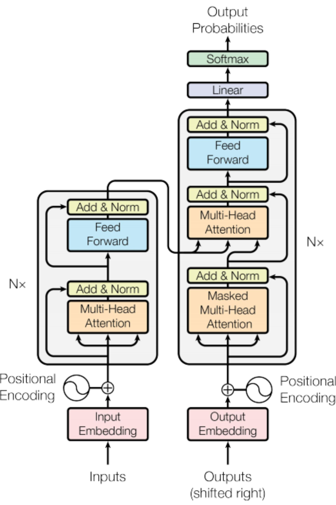

# Thesis

**Claim:** Un transformer es una pila de bloques idénticos, y cada bloque hace dos cosas: la atención mezcla información entre posiciones y la red feed-forward la procesa posición por posición. La matemática de un bloque son ocho multiplicaciones de matrices, un softmax, una ReLU y dos normalizaciones. Con una frase de cuatro tokens y vectores de dimensión cuatro se calcula a mano.

**Why it matters:** Los modelos que los alumnos van a usar y a evaluar en la práctica (BERT como encoder para RAG, un LLM decoder-only como agente) son este mismo bloque repetido con otros números. Quien sabe de dónde sale cada operación puede leer un paper de arquitectura nueva, razonar sobre costo por token y KV cache, y elegir un encoder con criterio.

**Presenter feedback:**

---

# Agenda

**Narrative arc:** La clase anterior terminó en la intuición de que cada token mira a todos los demás y arma su lectura de la frase. Esta clase muestra la matemática detrás de esa intuición. Primero se retoma el ciclo token a token, se fija la notación y se explica por qué la posición se suma al embedding antes de todo (1). Después la atención con números: tres proyecciones del mismo vector, el producto punto como medida de afinidad, la escala, el softmax y la mezcla de valores, calculado a mano sobre "the cat sat on", y la máscara causal que convierte un encoder en un generador (2). Sigue el bloque completo: varias cabezas en paralelo, la red feed-forward por posición, el problema del gradiente y las conexiones residuales, la normalización y la fórmula de la posición, con la cuenta de parámetros por bloque (3). Con el bloque armado se ve cómo se apila: el encoder y el decoder del paper de 2017, por qué los LLM se quedaron solo con el decoder, por qué BERT se quedó solo con el encoder, y la familia de modelos derivados que la práctica va a usar (4). Después se nombran las variantes modernas y el problema que ataca cada una, sin explicarlas; la clase siguiente las desarrolla (5). El cierre es qué se minimiza al entrenar (6).

**Sections (in delivery order):**

- 1. Dónde quedamos
- 2. La atención con números
- 3. El bloque completo
- 4. Encoder, decoder y la familia
- 5. Lo que cambió desde 2017
- 6. Cómo se entrena
- Conclusiones

**Presenter feedback:**

---

# 1. Dónde quedamos

**Goal of this section:** Retomar el punto exacto donde terminó la clase anterior, fijar la notación de matrices y explicar por qué la posición se suma al embedding antes de cualquier cálculo. Tres láminas.

**Presenter feedback:**

---

## 1. El ciclo de generación con el transformer abierto

### Content

**Cada token generado es una vuelta del ciclo: tokenizar, embeber, transformer, distribución sobre el vocabulario, elegir. El transformer es un bloque repetido N veces.**

```ascii
  "the cat sat"
        |
        v
  [ TOKENIZAR ]  the | cat | sat               3 tokens
        |
        v
  [ EMBEDDER ]   una fila por token            X : 3 x d
                 + posicion de cada token
        |
        v
  +---------------------------------------------+
  |  TRANSFORMER  =  bloque x N                 |   <-- hoy
  |                                             |
  |   bloque:  atencion  ->  feed-forward       |
  +---------------------------------------------+
        |
        v
  [ DISTRIBUCION ] un valor por token de V      |V| = 50.257 en GPT-2
        |
        v
  [ ELEGIR ]  "on"  -> se agrega y vuelve a empezar
```

- **Entrada y salida del bloque tienen la misma forma:** una matriz de n filas (una por token) por d columnas. Por eso se pueden apilar.
- **N bloques con la misma forma y pesos propios.** GPT-2 chico: 12 bloques. El paper de 2017: 6.
- **Cada bloque hace dos cosas.** La atención mueve información entre tokens y enriquece el embedding de cada uno con información del contexto. La feed-forward procesa cada token por separado.

### Sources

- `gpt2-radford-2019.pdf.md` (§2.3, Table 2): vocabulario de 50.257 tokens, 12 capas y d_model 768 para el modelo chico.
- `attention-is-all-you-need.html.md` (§3.1): N = 6 capas idénticas en encoder y decoder.
- `talks/palabra-al-transformer/final.md` (6.3): el ciclo de seis pasos de la clase anterior; este diagrama agrega el contenido del bloque transformer.

### Speaker notes

Es la lámina 6.3 de la clase pasada con una sola diferencia: el recuadro "TRANSFORMER" muestra que es un bloque repetido N veces. Todo lo que está fuera de ese recuadro ya se vio; esta clase trata lo que está adentro. La frase de ejemplo va a ser "the cat sat" toda la clase, con vectores de dimensión 4, porque con eso las cuentas se hacen a mano y en la práctica van a tener que hacerlas. Tiempo objetivo: ~2 min.

**Presenter feedback:**
---

## 2. La frase como matriz

### Content

**La frase "the cat sat" es una matriz X de 3 tokens por 4 dimensiones. La atención opera sobre esa matriz.**

| | dim 1 | dim 2 | dim 3 | dim 4 |
|---|---|---|---|---|
| **the** | 1 | 0 | 1 | 0 |
| **cat** | 0 | 2 | 0 | 1 |
| **sat** | 1 | 1 | 1 | 1 |

- **Una fila por token, una columna por dimensión.** La cantidad de tokens y la dimensión del embedding son independientes: en un modelo real las filas son cientos o miles y d es 768 (GPT-2 chico) o 512 (paper de 2017). X casi nunca es cuadrada.
- **X ya incluye la posición.** Cada fila es el embedding del token más un vector que codifica su posición en la frase (lámina siguiente). En el ejemplo se toman los números ya sumados.
- **Los números son de juguete.** Son enteros chicos para poder multiplicar a mano. En un modelo real son decimales aprendidos sin significado individual.
- **Convención:** n es la cantidad de tokens (acá 3) y d la dimensión del embedding (acá 4). Las matrices de pesos W son de d por d salvo indicación.

### Sources

- Ejemplo propio, calculado con NumPy (`ejemplo_atencion.py`, guardado con el material de la práctica). Se usan 3 tokens y d = 4 para que n y d no coincidan y ninguna matriz de datos sea cuadrada.
- `attention-is-all-you-need.html.md` (§3.2.2): d_model = 512 en el modelo base. `gpt2-radford-2019.pdf.md` (Table 2): 768 en GPT-2 chico.

### Speaker notes

Lámina de referencia, no de explicación: se muestra, se dice que van a volver a verla, y se sigue. El único punto que vale decir es que en un modelo real un embedding es un vector de 768 decimales que nadie interpreta columna por columna; acá son cuatro enteros solo para poder multiplicar en el pizarrón. Si alguien pregunta de dónde salen estos números en un modelo real: de la tabla de embeddings, que es una matriz |V| por d aprendida, y la lámina 3.2 de la clase pasada. Tiempo objetivo: ~1 min.

**Presenter feedback:**
---

## 3. La posición entra con el embedding

### Content

**La atención compara vectores y no sabe en qué lugar de la frase está cada uno. Por eso, antes de cualquier cálculo, a cada embedding se le suma un vector que codifica su posición.**

```ascii
   token:      the         cat         sat
                |           |           |
   embedding   e_the       e_cat       e_sat        (d valores cada uno,
                +           +           +            de la tabla |V| x d)
   posicion    p_0         p_1         p_2          (d valores cada uno,
                |           |           |            uno por lugar)
                v           v           v
   fila de X   x_the       x_cat       x_sat        X : n x d

   sin p:  "the cat sat" y "sat cat the" darian las mismas filas
           en otro orden, y la atencion no distinguiria una de otra
```

- **Por qué hace falta.** Todo lo que viene (proyecciones, productos punto, softmax, mezcla) trata a las filas de X como un conjunto: si se permutan las filas, se permuta la salida y nada más. Sin la posición, el modelo no distingue "the cat sat" de "sat cat the".
- **Cómo se agrega.** Se suma, no se concatena: el vector de posición tiene la misma dimensión d que el embedding, y el modelo aprende a leer las dos cosas mezcladas en el mismo vector.
- **De dónde sale p.** Del paper de 2017, una fórmula fija de senos y cosenos; en BERT y GPT-2, una tabla aprendida con una fila por posición (512 y 1024 filas). La lámina 3.6 muestra la fórmula.

### Sources

- `attention-is-all-you-need.html.md` (§3.5): "Since our model contains no recurrence and no convolution, in order for the model to make use of the order of the sequence, we must inject some information about the relative or absolute position of the tokens in the sequence"; los positional encodings "are added to the input embeddings at the bottoms of the encoder and decoder stacks" y tienen la misma dimensión d_model.
- `bert-devlin-2018.html.md` (§3): entrada = token + segmento + posición, con position embeddings aprendidos hasta 512. `gpt2-radford-2019.pdf.md` y `gpt2-to-kimi3-waterloo-intern.md.md`: `wpe`, tabla de 1024 posiciones, `x = tok_emb + pos_emb`.

### Speaker notes

Va acá, antes de la atención, porque la pregunta "¿y el orden?" aparece en cuanto se ve que todo son productos entre filas, y es mejor contestarla antes de que se formule. El argumento de la permutación se puede demostrar después de la sección 2 (pedir que sigan la cuenta con dos filas de X intercambiadas), pero la solución conviene tenerla vista desde ahora: X ya lleva la posición sumada. Que se sume y no se concatene suele sorprender; la razón es que así todas las matrices siguen siendo de d columnas y el modelo aprende a separar lo que necesita. Tiempo objetivo: ~3 min.

**Presenter feedback:**

---

# 2. La atención con números

**Goal of this section:** Calcular una capa de self-attention completa sobre la frase de juguete, operación por operación, y justificar cada una: por qué tres proyecciones, por qué producto punto, por qué la escala, por qué softmax, por qué la mezcla de valores. Cierra con la máscara causal. Seis láminas.

**Presenter feedback:**

---

## 1. Tres proyecciones del mismo vector

### Content

**Cada token se proyecta tres veces con tres matrices que son parámetros entrenables del modelo. Q codifica lo que el token necesita del contexto, K lo que cada token le ofrece a los demás, y V la información que se mezcla para producir el embedding enriquecido.**

```ascii
                 X (n x d)
       fila de "cat": [0 2 0 1]
                 |
     +-----------+-----------+
     |           |           |
     v           v           v
   X Wq        X Wk        X Wv
     |           |           |
     v           v           v
     Q           K           V
  "que busco"  "que ofrezco" "que entrego"
   (n x d)      (n x d)      (n x dv)
```

- **La intuición de cada una.** Q sobre el embedding de una palabra da lo que esa palabra busca en el contexto. K sobre todas las palabras da lo que cada una aporta a la que consulta; comparar Q con las K produce la matriz de atención. V es la información que se combina con esos pesos, y el resultado es un embedding nuevo de la misma palabra con más información del contexto.
- **Las tres salen del mismo X.** De ahí el nombre *self*-attention: consultas, claves y valores vienen de la misma secuencia.
- **Son tres matrices porque son tres trabajos.** Buscar y ser encontrado no es simétrico: "it" busca un sustantivo y "animal" ofrece ser uno. Si consulta y clave fueran la misma proyección, un token de norma grande se parecería sobre todo a sí mismo; las tres matrices rompen esa simetría.
- **En el ejemplo:** Wq es la identidad (Q = X), Wk permuta pares de columnas y Wv suma la columna 1 con la 3 y la 2 con la 4, y baja a dimensión 2. Se eligieron para que las cuentas salgan a mano; en un modelo real las tres son aprendidas y densas.

### Sources

- `attention-is-all-you-need.html.md` (§3.2): "An attention function can be described as mapping a query and a set of key-value pairs to an output"; §3.2.3: en la self-attention del encoder "all of the keys, values and queries come from the same place".
- `illustrated-transformer-alammar.html.md` (sección "Self-Attention in Detail"): las tres matrices de pesos W^Q, W^K, W^V y la analogía de consulta, clave y valor.

### Speaker notes

La pregunta que hay que contestar acá es por qué tres y no una. La respuesta corta es la asimetría: lo que un token pregunta no es lo que ofrece. Si usaran el mismo vector para buscar y para ser encontrado, el score de un token contra sí mismo sería su norma al cuadrado, y por Cauchy-Schwarz ningún otro token de norma igual o menor podría superarlo: la atención tendería a que cada token se mire a sí mismo. Ojo con afirmarlo como regla absoluta: con Q = K = X en el ejemplo, la fila de "the" da [2 0 2 1], empate entre "the" y "sat", porque "sat" tiene norma mayor. Las matrices del ejemplo son deliberadamente simples y hay que decirlo: nadie entrena una identidad. Tiempo objetivo: ~3 min.

**Presenter feedback:**
---

## 2. Q y K en el ejemplo

### Content

**Con las matrices del ejemplo, las consultas quedan iguales a X y las claves son X con los pares de columnas intercambiados.**

| Q = X Wq | | | | |
|---|---|---|---|---|
| **the** | 1 | 0 | 1 | 0 |
| **cat** | 0 | 2 | 0 | 1 |
| **sat** | 1 | 1 | 1 | 1 |

| K = X Wk | | | | |
|---|---|---|---|---|
| **the** | 0 | 1 | 0 | 1 |
| **cat** | 2 | 0 | 1 | 0 |
| **sat** | 1 | 1 | 1 | 1 |

- **Wk intercambia la columna 1 con la 2 y la 3 con la 4.** Por eso "the", que en X es [1 0 1 0], como clave es [0 1 0 1].
- **V baja a dimensión 2** sumando la columna 1 con la 3 y la 2 con la 4: the [2 0], cat [0 3], sat [2 2]. La salida de la atención va a tener esa dimensión.
- **Wq, Wk y Wv son parámetros entrenables.** El entrenamiento las ajusta por gradiente como a cualquier peso de la red; las del ejemplo están fijadas a mano solo para poder calcular.
- **La forma importa más que los valores.** Q y K tienen que tener la misma dimensión para poder multiplicarse. V puede tener otra.

### Sources

- Ejemplo propio (`ejemplo_atencion.py`): Wq = I, Wk = permutación (1 2)(3 4), Wv = [[1,0],[0,1],[1,0],[0,1]].
- `attention-is-all-you-need.html.md` (§3.2.1): "queries and keys of dimension d_k, and values of dimension d_v".

### Speaker notes

Lámina de cálculo puro; no expliques, verificá una celda con ellos. Elegí la fila de "cat" en K: [0 2 0 1] con las columnas intercambiadas es [2 0 1 0]. Con una alcanza. El punto conceptual es la última viñeta: d_k tiene que coincidir entre Q y K porque se van a multiplicar, y d_v es libre. En el paper las tres son 64 por cabeza. Tiempo objetivo: ~2 min.

**Presenter feedback:**
---

## 3. El producto punto mide afinidad

### Content

**Cada consulta se multiplica contra todas las claves. El resultado, Q Kᵀ, es una matriz de n por n: cuánto le importa a cada token cada otro token.**

| Q Kᵀ | the | cat | sat |
|---|---|---|---|
| **the** | 0 | 3 | 2 |
| **cat** | 3 | 0 | 3 |
| **sat** | 2 | 3 | 4 |

- **Una celda es un producto punto.** Fila "cat" (consulta [0 2 0 1]) contra columna "the" (clave [0 1 0 1]): 0·0 + 2·1 + 0·0 + 1·1 = 3.
- **Por qué producto punto.** Es grande cuando los dos vectores apuntan para el mismo lado y se calcula para toda la frase con una sola multiplicación de matrices, que es la operación para la que las GPU están optimizadas. El paper lo compara con la atención aditiva (una red chica por par) y la descarta por lenta.
- **Es casi la matriz de atención.** Le faltan dos pasos, la escala y el softmax, para que cada fila sea una distribución. Es la única matriz cuadrada del proceso: n por n, sea cual sea d.
- **Esta matriz es el costo cuadrático.** Son n² celdas: 9 con 3 tokens, 16 millones con 4.096, por cabeza y por capa.

### Sources

- `attention-is-all-you-need.html.md` (§3.2.1): dot-product vs additive attention, "dot-product attention is much faster and more space-efficient in practice, since it can be implemented using highly optimized matrix multiplication code"; Table 1: complejidad O(n²·d) por capa.
- Ejemplo propio: la fila de "cat" en QKᵀ es [3 0 3].

### Speaker notes

Hacé la cuenta de una celda en el pizarrón, la de "cat" contra "the", y dejá que ellos hagan otra. Señalá que es la primera matriz cuadrada que aparece, y que lo es porque compara tokens contra tokens, no por la dimensión del embedding. La observación más importante es la de la tercera viñeta: esta matriz es el costo que atacan casi todas las variantes modernas que se nombran en la sección 5. Cuando alguien diga "el transformer es cuadrático", es esta tabla. Una cosa que conviene señalar: la diagonal no es la más alta en todas las filas ("the" contra sí mismo da 0), y eso es efecto de que Wk no es la identidad. Con Q = K la diagonal tendería a ganar, sobre todo en los tokens de norma grande. Tiempo objetivo: ~4 min.

**Presenter feedback:**
---

## 4. Escalar y repartir: el softmax

### Content

**Los scores se dividen por √d_k y cada fila pasa por un softmax. El resultado es la matriz de atención A: una distribución por token, con pesos positivos que suman uno.**

| A = softmax(Q Kᵀ / √4) | the | cat | sat |
|---|---|---|---|
| **the** | 0,12 | 0,55 | 0,33 |
| **cat** | 0,45 | 0,10 | 0,45 |
| **sat** | 0,19 | 0,31 | 0,51 |

- **Dividir por √d_k = 2.** La fila "cat" pasa de [3 0 3] a [1,5 0 1,5]. Sin la escala, los productos crecen con d_k y con d_k = 64 el softmax se satura: un peso cerca de 1, el resto cerca de 0 y gradiente casi nulo.
- **Softmax por fila:** e^{x_i} / Σ e^{x_j}. Para "cat": e^{1,5} = 4,48, e^0 = 1, e^{1,5} = 4,48; suma 9,96; pesos 0,45 · 0,10 · 0,45.
- **Por qué softmax.** Es derivable, así que se entrena por gradiente, y reparte: "cat" mira a "the" y a "sat" por igual y casi nada a sí misma. Quedarse con el máximo daría un peso de 1 a un solo token y no tendría gradiente.

### Sources

- `attention-is-all-you-need.html.md` (§3.2.1, eq. 1 y nota al pie): Attention(Q,K,V) = softmax(QKᵀ/√d_k)V; "for large values of d_k, the dot products grow large in magnitude, pushing the softmax function into regions where it has extremely small gradients"; con componentes de varianza 1, el producto punto tiene varianza d_k.
- Ejemplo propio: fila "cat" del softmax [0,45 0,10 0,45].

### Speaker notes

Dos justificaciones, y las dos van al ejercicio a mano de la práctica. La de la escala es estadística: si las componentes de q y k son independientes con varianza 1, la suma de d_k productos tiene varianza d_k, así que dividir por √d_k devuelve la varianza a 1 sea cual sea la dimensión. Con d = 4 el efecto es chico, pero decí que con 64 sin la escala los scores andan por ±8 y el softmax ya está saturado. La del softmax es la derivabilidad: el entrenamiento necesita que un cambio chico en los pesos mueva la salida un poco, y un máximo duro no lo hace. Verificá la fila de "cat" con ellos, con calculadora, es un minuto. Tiempo objetivo: ~4 min.

**Presenter feedback:**
---

## 5. Mezclar los valores

### Content

**La salida de cada token es la suma de todos los V, pesada por su fila de atención. "cat" se reescribe como 0,45·the + 0,10·cat + 0,45·sat.**

```ascii
  fila de atencion de "cat"     V (que entrega cada token)
     the  cat  sat                 the [2 0]
    [0,45 0,10 0,45]         x     cat [0 3]     =   [1,80  1,20]
                                   sat [2 2]
                                                  nueva "cat"
  0,45*2 + 0,10*0 + 0,45*2 = 1,80
  0,45*0 + 0,10*3 + 0,45*2 = 1,20
```

| salida A·V | dim 1 | dim 2 |
|---|---|---|
| **the** | 0,91 | 2,30 |
| **cat** | 1,80 | 1,20 |
| **sat** | 1,39 | 1,93 |

- **Es un promedio ponderado.** Cada token sale como una mezcla de lo que entregan todos, con más peso de los que le importan. Es la versión numérica de "it reescrito con el peso puesto sobre animal".
- **Toda la frase se procesa con cinco multiplicaciones de matrices y un softmax:** X Wq, X Wk, X Wv, Q Kᵀ, softmax por fila y A·V. No hay bucle sobre los tokens, y por eso paraleliza.

### Sources

- `attention-is-all-you-need.html.md` (§3.2): "The output is computed as a weighted sum of the values, where the weight assigned to each value is computed by a compatibility function of the query with the corresponding key."
- `talks/palabra-al-transformer/final.md` (5.8): "it reescrito con el peso puesto sobre animal", el diagrama cualitativo que acá se vuelve numérico.
- Ejemplo propio: salida completa A·V.

### Speaker notes

Acá se cierra la atención. La cuenta del diagrama es la que hay que hacer en el pizarrón: una fila de pesos por una matriz de valores da la nueva fila del token. Insistí en la palabra "mezcla": la salida de "cat" ya no es solo "cat", es "cat" leído en su contexto, y eso es lo que la clase pasada llamaba representación contextual. La segunda viñeta es el argumento de la paralelización, ahora con las operaciones a la vista: ningún paso depende del token anterior. Tiempo objetivo: ~4 min.

**Presenter feedback:**

---

## 6. La máscara causal

### Content

**Para generar texto, un token no puede mirar a los que vienen después. Se ponen en menos infinito antes del softmax y quedan con peso cero.**

| con máscara | the | cat | sat |
|---|---|---|---|
| **the** | 1,00 | 0 | 0 |
| **cat** | 0,82 | 0,18 | 0 |
| **sat** | 0,19 | 0,31 | 0,51 |

- **Por qué menos infinito.** e^{-∞} = 0, así que el softmax reparte solo entre los tokens permitidos y la fila sigue sumando uno. Un score de cero le daría al token prohibido un peso e^0 = 1, que no es cero.
- **La última fila no cambia.** "sat" ya veía a todos. La fila de "the" ahora solo se ve a sí misma.
- **Es la diferencia entre un encoder-only y un decoder-only.** BERT no enmascara y cada token ve la frase entera. GPT enmascara y cada token ve solo lo anterior. El resto del bloque es igual.
- **La salida cambia con la máscara:** "cat" pasa de [1,80 1,20] a [1,64 0,55], porque ya no recibe nada de "sat". Salida completa: the [2,00 0], cat [1,64 0,55], sat [1,39 1,93].

### Sources

- `attention-is-all-you-need.html.md` (§3.2.3): "We implement this inside of scaled dot-product attention by masking out (setting to −∞) all values in the input of the softmax which correspond to illegal connections", para preservar la propiedad autorregresiva.
- `bert-devlin-2018.html.md` (nota 4): "the bidirectional Transformer is often referred to as a 'Transformer encoder' while the left-context-only version is referred to as a 'Transformer decoder'".
- `gpt2-to-kimi3-waterloo-intern.md.md`: el código de GPT-2, `att.masked_fill(mask == 0, float('-inf'))` antes del softmax.
- Ejemplo propio: softmax con máscara triangular y su salida A·V.

### Speaker notes

La justificación es de entrenamiento: si "cat" pudiera ver "sat" mientras aprende a predecir "sat", la tarea sería trivial y no aprendería nada. Con la máscara, una frase de n tokens da n ejemplos de entrenamiento válidos de una vez: es la ventana deslizante de la clase pasada calculada en paralelo. La tercera viñeta organiza la sección 4: encoder y decoder difieren en esta matriz triangular y en poco más. Tiempo objetivo: ~4 min.

**Presenter feedback:**

---

# 3. El bloque completo

**Goal of this section:** Armar el bloque del transformer alrededor de la atención ya calculada: varias cabezas, la feed-forward por posición, el problema del gradiente y las residuales, la normalización, la fórmula de la posición y la cuenta de parámetros. Siete láminas.

**Presenter feedback:**

---

## 1. Varias cabezas en paralelo

### Content

**Multi-head attention corre h atenciones en paralelo, cada una con sus propias Wq, Wk, Wv y dimensión d/h, concatena las salidas y las proyecta con una matriz más.**

```ascii
                     X (n x d)
                        |
        +---------------+---------------+
        |               |               |
     cabeza 1        cabeza 2   ...   cabeza h
   Wq1 Wk1 Wv1     Wq2 Wk2 Wv2      Wqh Wkh Wvh
   (d x d/h c/u)
        |               |               |
   atencion(1)     atencion(2)      atencion(h)
   (n x d/h)       (n x d/h)        (n x d/h)
        |               |               |
        +-------- concatenar -----------+
                        |
                   (n x d)  x  Wo (d x d)
                        |
                        v
                  salida (n x d)
```

- **Por qué varias.** Una sola cabeza promedia: si "it" necesita mirar al sujeto para una cosa y al verbo para otra, con una distribución tiene que repartir. Con ocho cabezas, cada una aprende una relación distinta. El paper lo muestra: cabezas que siguen dependencias largas, otras que resuelven anáforas, otras que siguen la estructura sintáctica.
- **El costo no sube.** d_k = d/h: en el paper, 512/8 = 64 por cabeza. Las ocho cabezas juntas cuestan lo mismo que una de dimensión completa.
- **En el ejemplo de juguete,** con h = 2, habría dos cabezas de dimensión 2, cada una con su propia matriz de atención de 3 por 3. La de la sección 2 corresponde a una sola cabeza.

### Sources

- `attention-is-all-you-need.html.md` (§3.2.2): "Multi-head attention allows the model to jointly attend to information from different representation subspaces at different positions. With a single attention head, averaging inhibits this"; h = 8, d_k = d_v = d_model/h = 64; "the total computational cost is similar to that of single-head attention with full dimensionality"; Table 3 (A): una sola cabeza es 0,9 BLEU peor que la mejor configuración, y demasiadas cabezas también empeoran. Figuras 3 a 5: cabezas que "clearly learned to perform different tasks".
- `illustrated-transformer-alammar.html.md` ("The Beast With Many Heads"): concatenación de las z_i y multiplicación por W^O.

### Speaker notes

La justificación es el "averaging inhibits this" del paper: una sola distribución de pesos no puede apuntar fuerte a dos lugares por dos motivos distintos. La segunda viñeta suele sorprender y conviene detenerse: no son ocho atenciones de 512, son ocho de 64, y la concatenación devuelve 512. Wo es la matriz que mezcla lo que dijeron las cabezas; sin ella cada cabeza escribiría en su propio rincón del vector. Tiempo objetivo: ~3 min.

**Presenter feedback:**

---

## 2. La feed-forward: la misma red para cada posición

### Content

**Después de la atención, cada token pasa solo por una red de dos capas: subir a 4d, ReLU, bajar a d. Es la misma red para todas las posiciones y concentra dos tercios de los parámetros del bloque.**

- **FFN(x) = max(0, x W1 + b1) W2 + b2.** En el paper: d = 512, d_ff = 2048. BERT usa el mismo 4d, con GELU en vez de ReLU, siguiendo al GPT original.
- **Por qué hace falta.** La atención solo mezcla: su salida es una combinación lineal de los V. La ReLU de esta red es la no linealidad que permite computar algo nuevo con lo mezclado. Sin FFN, una pila de bloques de atención seguiría siendo casi lineal.
- **Por qué por posición.** Se aplica fila por fila, con los mismos pesos, sin mirar a los vecinos. El intercambio entre tokens ya ocurrió en la atención; acá cada token procesa lo que recibió. El paper lo describe como dos convoluciones de tamaño 1.
- **Cuenta:** dos matrices de d por 4d son 8d² parámetros. La atención (Wq, Wk, Wv, Wo) son 4d². Feed-forward es el doble que la atención.

### Sources

- `attention-is-all-you-need.html.md` (§3.3, eq. 2): FFN(x) = max(0, xW1 + b1)W2 + b2, d_model = 512, d_ff = 2048, "Another way of describing this is as two convolutions with kernel size 1".
- `scaling-laws-kaplan-2020.html.md` (§2.1, Table 1): feed-forward 2·n_layer·d_model·d_ff parámetros; QKV 3·n_layer·d_model·d_attn y proyección de salida n_layer·d_attn·d_model.
- `bert-devlin-2018.html.md` (§3, nota): feed-forward de tamaño 4H, GELU.

### Speaker notes

La justificación de la FFN es la que más cuesta y la que más importa: la atención es lineal en V (pesos por valores), así que si solo hubiera atención, el modelo entero sería casi una composición de mapas lineales. La ReLU es el único lugar del bloque donde se computa algo que no es una combinación de la entrada. La cuenta de la última viñeta prepara la lámina 3.7. Tiempo objetivo: ~4 min.

**Presenter feedback:**

---

## 3. El problema de apilar: el gradiente se pierde

### Content

**Para entrenar, el error medido en la salida tiene que volver hasta la primera capa. En una pila de N bloques ese camino es un producto de N derivadas, y un producto largo de números menores que uno tiende a cero.**

```ascii
   salida  <-- bloque N <-- ... <-- bloque 2 <-- bloque 1 <-- embedding

   gradiente en la capa 1  =  dL/dx_N . J_N . J_(N-1) . ... . J_2 . J_1

   si cada J "encoge" la senal (norma < 1):   0,9^12 = 0,28   0,9^48 = 0,006
   si cada J la "agranda"  (norma > 1):       1,1^48 = 97
```

- **La intuición.** Cada bloque transforma su entrada, y la derivada de la composición es el producto de las derivadas de cada uno (regla de la cadena, la misma de backpropagation). Con 12, 48 o 96 factores, el producto se desvanece o explota salvo que cada factor esté muy cerca de uno.
- **La consecuencia práctica.** Las primeras capas casi no reciben señal de error y aprenden poco o nada; las redes profundas de los años 2000 se entrenaban peor que las chicas por este motivo.
- **Lo que hace falta:** un camino desde la salida hasta la entrada cuya derivada sea exactamente uno, sin importar cuántos bloques haya. Eso es la conexión residual de la lámina siguiente.

### Sources

- `attention-is-all-you-need.html.md` (§3.1): las residuales se citan de He et al. (2016), ResNet, cuyo argumento es este. La derivación de la regla de la cadena es material de la clase de backpropagation (`knowledge-library/backpropagation/`).
- `gpt2-radford-2019.pdf.md` (§2.3): el escalado de los pesos residuales por 1/√N al inicializar existe para controlar exactamente esta acumulación con la profundidad.

### Speaker notes

Lámina de problema, sin solución todavía, para que la residual de la siguiente se lea como respuesta y no como convención. La cuenta de 0,9^48 se hace en el pizarrón en diez segundos y es la que se acuerdan. Conectá con la clase de backpropagation: es la misma regla de la cadena que ya derivaron, aplicada a una composición larga. Si preguntan por qué las derivadas serían menores que uno, la respuesta corta es que activaciones como la sigmoide tienen derivada máxima 0,25 y que las matrices de pesos con inicialización chica también encogen; ReLU y una buena inicialización ayudan pero no alcanzan a 96 capas. Tiempo objetivo: ~2 min.

**Presenter feedback:**

---

## 4. Residuales: la salida es la entrada más una corrección

### Content

**Cada subcapa suma su resultado al vector de entrada: x → x + Atención(x) → x + FFN(x). El camino directo deja pasar la entrada intacta y las capas aprenden solo la diferencia.**

```ascii
        x  ---------------------------+
        |                             |
        v                             |
   [ atencion ]                       |  camino residual
        |                             |
        v                             v
       (+) <--------------------------+
        |
   x' = x + atencion(x)
        |  -----------------------------+
        v                               |
   [ feed-forward ]                     |
        |                               v
       (+) <----------------------------+
        |
   x'' = x' + FFN(x')
```

- **El vector de cada token atraviesa toda la pila** y cada bloque le agrega algo. Se lo llama *residual stream*. Una cabeza puede escribir en él en la capa 3 y otra leerlo en la capa 10.
- **Por qué resuelve el problema anterior.** La derivada de x + f(x) respecto de x es 1 + f'(x): el producto largo de la lámina anterior ahora tiene un término que es la identidad en cada bloque, y la señal de error llega a la primera capa aunque los f'(x) sean chicos.
- **Por qué d se conserva** en toda la pila: para que la suma sea posible.

### Sources

- `attention-is-all-you-need.html.md` (§3.1): "We employ a residual connection around each of the two sub-layers, followed by layer normalization. That is, the output of each sub-layer is LayerNorm(x + Sublayer(x))"; todas las subcapas y los embeddings producen salidas de dimensión d_model = 512 "to facilitate these residual connections".
- `gpt2-to-kimi3-waterloo-intern.md.md` (código de GPT-2): `x = x + self.attn(self.ln_1(x)); x = x + self.mlp(self.ln_2(x))`.
- `gpt2-radford-2019.pdf.md` (§2.3): los pesos de las capas residuales se escalan al inicializar por 1/√N, con N la cantidad de capas residuales.

### Speaker notes

La justificación es de optimización y les va a sonar de la clase de backpropagation: sin el atajo, el gradiente en la capa 1 es el producto de 48 jacobianos y se desvanece o explota. Con el atajo, hay un término que es la identidad. La consecuencia de la segunda viñeta es la más útil para leer papers modernos: la imagen del residual stream como una cinta que atraviesa el modelo y a la que las capas leen y escriben. AttnRes de Kimi K3, que van a ver en la clase que viene, es una atención sobre esa cinta. Tiempo objetivo: ~3 min.

**Presenter feedback:**
---

## 5. Layer norm: mantener los números en rango

### Content

**Antes de cada subcapa, cada vector se normaliza por separado: se le resta su media y se lo divide por su desvío. Dos parámetros aprendidos por dimensión lo reescalan.**

- **La cuenta, para un vector [2 0 1 1]:** media 1, varianza 0,5, desvío 0,71. Normalizado: [1,41 -1,41 0 0]. Después se multiplica por γ y se suma β, aprendidos.
- **Por qué.** Cada bloque suma algo al residual stream, así que sin normalizar la escala del vector crece capa a capa y el softmax de la atención y la ReLU dejan de trabajar en su rango. La normalización pone cada token en escala conocida antes de entrar a una subcapa.
- **Por qué por vector.** Normalizar sobre las d dimensiones de un token no depende de qué otras frases hay en el batch ni de la longitud de la secuencia. Batch norm depende de las dos cosas, y por eso no se usa en transformers.
- **Pre-LN y post-LN.** El paper de 2017 normaliza después de sumar: LN(x + Sub(x)). GPT-2 lo movió antes: x + Sub(LN(x)). Con pre-LN el camino residual queda limpio y el entrenamiento es más estable. GPT-2, ViT y casi todo lo posterior usan pre-LN.

### Sources

- `attention-is-all-you-need.html.md` (§3.1): LayerNorm(x + Sublayer(x)), post-LN.
- `gpt2-radford-2019.pdf.md` (§2.3): "Layer normalization was moved to the input of each sub-block, similar to a pre-activation residual network and an additional layer normalization was added after the final self-attention block".
- `vit-dosovitskiy-2020.html.md` (§3.1, eq. 2-3): "Layernorm (LN) is applied before every block, and residual connections after every block".
- Ejemplo propio: LN([2 0 1 1]) = [1,41 -1,41 0 0] con ε = 10⁻⁵.

### Speaker notes

Hacé la cuenta de la primera viñeta, es de treinta segundos y es exactamente lo que van a tener que justificar en el ejercicio a mano: qué hace y por qué. La justificación de "por vector" es la que distingue layer norm de batch norm, que vieron en redes: acá cada token se normaliza solo, y por eso funciona con secuencias de distinto largo y con batch de tamaño uno en inferencia. Lo de pre-LN contra post-LN es una viñeta y sigue; lo que importa es que el diagrama de la lámina anterior, con la suma limpia, es pre-LN. Tiempo objetivo: ~3 min.

**Presenter feedback:**

---

## 6. La fórmula de la posición: senos y cosenos

### Content

**El vector de posición que se suma al embedding (lámina 1.3) puede ser fijo. El paper de 2017 usa senos y cosenos de distinta frecuencia, uno por dimensión.**

| pos | dim 1 (sen) | dim 2 (cos) | dim 3 (sen) | dim 4 (cos) |
|---|---|---|---|---|
| 0 | 0 | 1 | 0 | 1 |
| 1 | 0,84 | 0,54 | 0,01 | 1,00 |
| 2 | 0,91 | -0,42 | 0,02 | 1,00 |
| 3 | 0,14 | -0,99 | 0,03 | 1,00 |

- **El paper suma un vector fijo de senos y cosenos:** PE(pos, 2i) = sen(pos / 10000^{2i/d}), PE(pos, 2i+1) = cos(·). Cada par de dimensiones es una sinusoide de distinta frecuencia; las de la izquierda cambian rápido, las de la derecha casi no cambian (con d = 4, la tercera y cuarta columna apenas se mueven).
- **Por qué sinusoides.** Para cualquier desplazamiento k, PE(pos + k) es una función lineal de PE(pos), así que el modelo puede aprender a atender por posición relativa. El paper conjetura que extrapolan a secuencias más largas que las del entrenamiento; en la práctica lo hacen mal, y eso motiva RoPE (sección 5).
- **Alternativas:** embeddings de posición aprendidos (BERT, GPT-2: una tabla de 512 o 1024 filas, iguales en calidad según el paper) y RoPE, que rota Q y K en vez de sumar un vector; la usan los LLM actuales (sección 5).

### Sources

- `attention-is-all-you-need.html.md` (§3.5, eq. de PE): "Since our model contains no recurrence and no convolution, in order for the model to make use of the order of the sequence, we must inject some information about the relative or absolute position"; longitudes de onda de 2π a 10000·2π; "for any fixed offset k, PE_{pos+k} can be represented as a linear function of PE_{pos}"; Table 3 (E): embeddings aprendidos dan "nearly identical results".
- `bert-devlin-2018.html.md` (§3): position embeddings aprendidos, máximo 512. `gpt2-radford-2019.pdf.md`: contexto de 1024 tokens (`wpe` en el código).
- Ejemplo propio: PE con d = 4 para posiciones 0 a 3.

### Speaker notes

El porqué ya está dicho en 1.3; acá se demuestra la permutación si no se hizo entonces: X con las filas de "cat" y "sat" intercambiadas da Q Kᵀ con filas y columnas intercambiadas, el mismo softmax permutado y A·V con las mismas filas en otro orden. La tabla muestra la fórmula del paper con d = 4, que es demasiado chico para verlo bien (las dos columnas de la derecha casi no se mueven); con d = 512 hay 256 frecuencias entre las dos. No entres en RoPE acá. Tiempo objetivo: ~2 min.

**Presenter feedback:**
---

## 7. Cuenta de parámetros de un bloque

### Content

**Un bloque tiene unos 12 d² parámetros: 4 d² en la atención y 8 d² en la feed-forward. Con eso se reconstruyen los tamaños de los modelos conocidos.**

| | Fórmula | Paper 2017 (d = 512, N = 6) | GPT-2 chico (d = 768, N = 12) |
|---|---|---|---|
| **Atención por bloque** | 4 d² (Wq, Wk, Wv, Wo) | 1,05 M | 2,36 M |
| **Feed-forward por bloque** | 8 d² (d × 4d, 4d × d) | 2,10 M | 4,72 M |
| **N bloques de encoder** | 12 N d² | 18,9 M | 84,9 M (decoder-only) |
| **N bloques de decoder** | 16 N d² (suma la cross-attention) | 25,2 M | no tiene |
| **Embeddings** | \|V\| · d (+ posiciones) | 37k · 512 = 19 M | 50.257 · 768 = 38,6 M |
| **Total aprox.** | | ~63 M (paper: 65 M) | ~124 M |

- **Los bloques suman 12 N d².** Es la fórmula de Kaplan y otros para los parámetros sin contar embeddings; con ella se estima cualquier modelo del que se conozcan d y N.
- **La tabla de embeddings es grande en modelos chicos y despreciable en los grandes.** En GPT-2 chico es un tercio del total; en un modelo con d = 12.288 y 96 bloques, los bloques son 174.000 M y los embeddings 600 M.
- **Los cientos de miles de millones de parámetros de un LLM** son 12 N d² con d y N grandes.

### Sources

- `scaling-laws-kaplan-2020.html.md` (§2.1, Table 1): N ≈ 2·d_model·n_layer·(2·d_attn + d_ff) = 12·n_layer·d_model² para d_attn = d_ff/4 = d_model; embeddings (n_vocab + n_ctx)·d_model.
- `attention-is-all-you-need.html.md` (Table 3): modelo base 65 M parámetros; vocabulario BPE compartido de ~37.000 tokens (§5.1).
- `gpt2-radford-2019.pdf.md` (Table 2): 117 M declarados para el modelo chico; `gpt2-to-kimi3-waterloo-intern.md.md`: "about 124M parameters" con 12 bloques, 12 cabezas y 768 dimensiones (la cifra corregida, ver Inconsistencies del corpus).
- Cálculo propio: 12·12·768² = 84,9 M; 50.257·768 = 38,6 M; 1024·768 = 0,8 M.

### Speaker notes

La lámina cierra la sección con una cuenta que cualquiera puede repetir y que resuelve una pregunta que quedó abierta la clase pasada ("del orden de cientos de miles de millones", sin fuente). El ejemplo de d = 12.288 y 96 capas es la configuración publicada de GPT-3 175B; da 174 mil millones con la fórmula, y el resto son embeddings. Los 63 M contra los 65 M del paper: la diferencia son sesgos, layer norms y el redondeo del vocabulario; el decoder suma 4 d² más por bloque por la cross-attention, y por eso su fila es 16 N d². Alcanza con que el orden dé. Tiempo objetivo: ~3 min.

**Presenter feedback:**

---

# 4. Encoder, decoder y la familia

**Goal of this section:** Mostrar cómo se apilan los bloques en el encoder y el decoder del paper, por qué los LLM se quedaron con el decoder y BERT con el encoder, y el mapa de arquitecturas y modelos derivados que la práctica va a usar. Seis láminas.

**Presenter feedback:**

---

## 1. Encoder y decoder en el paper de 2017

### Content

<!-- design: split-left -->



**El paper apila 6 bloques de encoder y 6 de decoder. El decoder tiene una tercera subcapa, la cross-attention, donde las consultas vienen del decoder y las claves y valores del encoder.**

```ascii
     ENCODER (x6)                    DECODER (x6)
  +-------------------+          +-----------------------+
  |  self-attention   |          |  self-attention       |
  |  (sin mascara)    |          |  CON mascara causal   |
  |        +          |          |          +            |
  |  feed-forward     |   K,V    |  cross-attention      |
  |                   | -------> |  Q del decoder,       |
  +-------------------+          |  K y V del encoder    |
          ^                      |          +            |
          |                      |  feed-forward         |
   frase de entrada              +-----------------------+
   "the cat sat on"                        ^      |
                                           |      v
                                 salida generada hasta ahora   -> softmax |V|
```

- **Encoder:** lee la frase de entrada completa, cada token ve a todos. Produce una representación contextual por token.
- **Decoder:** genera la salida token a token con máscara causal, y en cada paso consulta al encoder con la cross-attention: la misma cuenta de la sección 2, con Q de un lado y K, V del otro.
- **Fue diseñado para traducir.** La entrada está en un idioma y la salida en otro, y por eso hay un encoder y un decoder. Casi ningún modelo actual usa los dos.

### Sources

- `attention-is-all-you-need.html.md` (§3.1, §3.2.3): encoder de N = 6 capas con dos subcapas, decoder de N = 6 con tres; "In 'encoder-decoder attention' layers, the queries come from the previous decoder layer, and the memory keys and values come from the output of the encoder".
- `talks/palabra-al-transformer/final.md` (6.1): la figura 1 del paper que ya vieron; este diagrama es su versión en cajas con las tres subcapas nombradas.

### Speaker notes

Es la figura que vieron la clase pasada, ahora con nombres en cada caja porque ya saben qué hay adentro. Lo nuevo es la cross-attention, y la justificación es simple: es la misma fórmula con Q de una secuencia y K, V de otra; es el mecanismo por el que el decoder "lee" la frase de origen. La tercera viñeta prepara las dos láminas siguientes. Tiempo objetivo: ~2 min.

**Presenter feedback:**

---

## 2. Solo el decoder: GPT

### Content

**GPT-2 usa solo el decoder del transformer, sin cross-attention. Cada bloque tiene self-attention con máscara causal y feed-forward, y la pila termina en un softmax sobre el vocabulario. Casi todos los LLM actuales tienen esta arquitectura.**

- **Por qué alcanza con el decoder.** Si la tarea es "predecir el token siguiente", entrada y salida son la misma secuencia: no hay una frase de origen aparte que codificar. El prompt y la respuesta van en el mismo flujo, y la máscara causal garantiza que cada token solo vea lo anterior.
- **Cuatro tamaños en 2019:** 117 M (12 capas, d = 768), 345 M (24, 1024), 762 M (36, 1280), 1.542 M (48, 1600). El más chico tiene el tamaño del GPT original; el segundo, el de BERT-large. Todos con contexto de 1024 tokens.
- **La tesis del paper:** entrenado solo con next-token sobre 40 GB de texto de la web, el modelo hace tareas para las que nadie lo entrenó (traducción, resumen, preguntas) si se le describe la tarea en el prompt. Es el origen del prompting (clase 5).

### Sources

- `gpt2-radford-2019.pdf.md` (§2.3, Table 2): arquitectura "largely follows the details of the OpenAI GPT model" (decoder-only), pre-LN, vocabulario 50.257, contexto 1024; los cuatro tamaños; "language models begin to learn these tasks without any explicit supervision"; WebText 40 GB.
- `gpt2-to-kimi3-waterloo-intern.md.md`: "GPT-2 is a decoder-only architecture", código de `forward` con `wte`, `wpe`, `h` (bloques) y `lm_head`.
- `talks/palabra-al-transformer/final.md` (6.1, notas): la afirmación "los LLM modernos usan solo decoder" quedó allí como aporte propio sin fuente; acá tiene fuente (GPT-2 y el artículo de Kimi K3).

### Speaker notes

La justificación de "solo decoder" es la primera viñeta y es conceptual, no de ingeniería: cuando entrada y salida son la misma cadena de texto, el encoder no tiene qué codificar. La tabla de tamaños sirve para que vean que 1,5 mil millones era "enorme" en 2019 y hoy es un modelo de celular. La tercera viñeta conecta con la clase de prompting. Tiempo objetivo: ~3 min.

**Presenter feedback:**

---

## 3. Solo el encoder: BERT

### Content

**BERT usa solo el encoder del transformer. Sus bloques no tienen máscara y cada token ve la frase entera. No genera texto: produce una representación contextual por token, y la práctica usa esa representación para RAG.**

- **Sin máscara, el next-token no sirve** (cada token vería la respuesta). BERT se entrena tapando el 15 % de los tokens y prediciéndolos desde ambos lados (*masked language model*), con una tarea auxiliar: decidir si una frase sigue a otra.
- **Dos tamaños:** BERT-base, 12 capas, d = 768, 12 cabezas, 110 M (elegido para igualar al GPT original); BERT-large, 24 capas, d = 1024, 16 cabezas, 340 M. Entrada: tokens WordPiece (30k) + embedding de segmento + embedding de posición aprendido, máximo 512.
- **Cómo se usa:** se agrega una capa de salida y se ajusta entero para la tarea (clasificación, respuesta a preguntas), o se toman las representaciones de las últimas capas como vectores fijos. Con solo la última opción, BERT pierde apenas 0,3 F1 en reconocimiento de entidades contra ajustarlo entero.

### Sources

- `bert-devlin-2018.html.md` (§3, §3.1, §5.3): "a multi-layer bidirectional Transformer encoder"; MLM con 15 % de tokens (80 % [MASK], 10 % aleatorio, 10 % sin cambio) y NSP; tamaños BASE y LARGE; entrada = token + segmento + posición; feature-based 96,1 F1 en CoNLL-NER, "only 0.3 F1 behind fine-tuning the entire model".

### Speaker notes

La justificación de la máscara al revés: si nadie enmascara la atención, hay que enmascarar la entrada, porque de lo contrario predecir el token siguiente es copiarlo. Eso es el MLM. Para la práctica lo que importa es la tercera viñeta: BERT como generador de vectores contextuales. Pero ojo con la lámina que sigue: los vectores crudos de BERT son malos embeddings de oración, y hay que decirlo antes de que alguien los use así. Tiempo objetivo: ~3 min.

**Presenter feedback:**

---

## 4. Del encoder al embedding de oración

### Content

**Para RAG hace falta un vector por fragmento, comparable por coseno. BERT crudo no lo da: promediar sus tokens es peor que promediar GloVe. Sentence-BERT lo arregla con pooling y un ajuste siamés.**

```ascii
   fragmento A  ->  [ BERT ]  -> tokens (n x d) -> POOLING (media) -> u (d)
                                                                       \
                                                                        coseno(u, v)
                                                                       /
   fragmento B  ->  [ BERT ]  -> tokens (n x d) -> POOLING (media) -> v (d)
                    (mismos pesos)
   entrenamiento: pares de frases etiquetadas (NLI, STS) para que
   coseno alto = significado parecido
```

- **El problema medido:** en STS, promediar los tokens de BERT da 54,8 y usar el vector [CLS] da 29,2; promediar GloVe da 61,3. BERT sin ajustar no sabe que dos frases se parecen.
- **La alternativa lenta:** meter las dos frases juntas en BERT (*cross-encoder*) funciona, pero comparar 10.000 frases entre sí son 50 millones de pasadas, unas 65 horas. Con embeddings, 5 segundos.
- **La solución:** una capa de pooling (la media de los tokens funciona mejor que [CLS] o el máximo) y ajuste con pares de frases para que el coseno refleje similitud. STS sube a 74,9 (base) y 76,6 (large). Es la idea de base de los modelos de embeddings actuales, que le suman objetivos contrastivos y más datos.

### Sources

- `sentence-bert-reimers-2019.html.md` (§1, §3, Table 1, Table 7, §7): "finding the most similar pair in a collection of 10,000 sentences requires about 50 million inference computations (~65 hours)"; media de tokens 54,81, CLS 29,19, GloVe 61,32; SBERT-NLI-base 74,89 y large 76,55; MEAN pooling mejor en la ablación; búsqueda "from 65 hours ... to about 5 seconds".

### Speaker notes

Esta lámina conecta la clase con la práctica de RAG y es la que justifica que "elegir el encoder" sea un hiperparámetro. La justificación del pooling: el encoder produce n vectores y la búsqueda necesita uno, así que hay que colapsar la secuencia, y la media resultó mejor que el token especial. La del ajuste siamés: el coseno solo sirve como similitud si el modelo fue entrenado para que lo sea; BERT fue entrenado para tapar palabras, no para eso. Los modelos de embeddings actuales (los que van a probar) son esta misma idea con más datos y objetivos contrastivos. Tiempo objetivo: ~3 min.

**Presenter feedback:**

---

## 5. Fuera del texto: ViT

### Content

**El bloque no sabe que procesa texto. Si una imagen se corta en parches y cada parche se proyecta a un vector, el mismo encoder clasifica imágenes: Vision Transformer.**

- **Cómo:** una imagen de 224 × 224 se corta en parches de 16 × 16 (196 parches), cada uno se aplana (16·16·3 = 768 valores) y se proyecta linealmente a d. Se agrega un token [class] al frente, como el [CLS] de BERT, y embeddings de posición aprendidos. Después, un encoder estándar con pre-LN.
- **Menos sesgo inductivo.** Sin convoluciones no hay sesgo de localidad ni de traslación. Con pocos datos rinde peor que una ResNet; con 14 M o 300 M de imágenes de preentrenamiento la supera (88,55 % en ImageNet) con menos cómputo.
- **Tamaños calcados de BERT:** ViT-Base 12 capas, d = 768, 86 M; ViT-Large 24, 1024, 307 M; ViT-Huge 32, 1280, 632 M. "ViT-L/16" quiere decir Large con parches de 16.

### Sources

- `vit-dosovitskiy-2020.html.md` (§3.1, §4.2, §4.3, Table 1-2): "the standard Transformer receives as input a 1D sequence of token embeddings"; parches de P² · C, proyección E, token [class], position embeddings 1D aprendidos; pre-LN (eq. 1-4); menos sesgo inductivo, peor con ImageNet solo, mejor con ImageNet-21k y JFT-300M; ViT-H/14 88,55 % ImageNet con 2,5k TPUv3-core-days contra 9,9k de BiT-L.

### Speaker notes

Lámina de una idea: el transformer es agnóstico a la modalidad porque lo único que ve son filas de una matriz. La justificación de por qué necesita más datos es la que vale: las CNN incorporan por diseño que los píxeles vecinos se relacionan y que un gato a la izquierda es el mismo gato que a la derecha; el transformer tiene que aprender eso de los datos. Es una lámina de contexto; no se profundiza. Tiempo objetivo: ~2 min.

**Presenter feedback:**

---

## 6. El mapa de la familia

### Content

**Tres formas de apilar el mismo bloque, y qué modelo va con cada tarea.**

| | Encoder-only | Decoder-only | Encoder-decoder |
|---|---|---|---|
| **Máscara** | ninguna: cada token ve todo | causal: solo lo anterior | encoder sin máscara, decoder con máscara y cross-attention |
| **Objetivo de entrenamiento** | tapar tokens y predecirlos (MLM) | predecir el token siguiente | secuencia de entrada a secuencia de salida |
| **Produce** | una representación por token | texto, token a token | texto, condicionado a una entrada aparte |
| **Modelos** | BERT, RoBERTa, Sentence-BERT, los modelos de embeddings, ViT | GPT-2 y sucesores, Llama, DeepSeek, Kimi | el transformer de 2017, T5, BART, Whisper |
| **En la práctica** | el encoder del RAG vectorial | el agente que responde y llama herramientas | no se usa |

- **La regla práctica:** cuando la salida es un vector se usa un encoder; cuando es texto, un decoder. Encoder-decoder sobrevive en traducción, resumen y audio, donde la entrada es de otra naturaleza que la salida.
- **Todos comparten el bloque de la sección 3.** Cambian la máscara, el objetivo de entrenamiento y la salida que se lee.

### Sources

- `bert-devlin-2018.html.md` (nota 4): encoder vs decoder según el contexto que se permite ver.
- `gpt2-radford-2019.pdf.md`, `sentence-bert-reimers-2019.html.md`, `vit-dosovitskiy-2020.html.md`, `deepseek-v2-mla-2024.html.md`, `gpt2-to-kimi3-waterloo-intern.md.md`: cada fila de modelos según su propio paper. T5, BART, Whisper, RoBERTa y Llama se nombran como conocimiento general del área, no están en el corpus (ver Open questions).

### Speaker notes

Lámina de repaso de la sección, y la que hay que dejar en pantalla mientras se presenta la práctica: el encoder del ejercicio 1 está en la primera columna y el agente del ejercicio 2 en la segunda. La regla práctica de la primera viñeta es la que importa. Si alguien pregunta por qué no usar un LLM decoder-only como encoder de embeddings: se puede, y hay modelos de embeddings hechos así, pero un token de decoder solo vio lo anterior, así que hay que tomar el último o ajustar el modelo para que mire todo. Tiempo objetivo: ~3 min.

**Presenter feedback:**

---

# 5. Lo que cambió desde 2017

**Goal of this section:** Nombrar las variantes modernas del bloque y el problema que ataca cada una, sin explicar cómo funcionan. Se desarrollan en la clase 9, Transformers Avanzados. Una lámina.

**Presenter feedback:**

---

## 1. Qué cambió desde 2017

### Content

**Desde 2017, la mayoría de los cambios apuntan a dos costos: la matriz de atención crece con el cuadrado de la longitud, y generar texto exige guardar K y V de todos los tokens anteriores. Todo esto se ve en detalle en la clase 9.**

| Técnica | Qué problema ataca |
|---|---|
| **KV cache** | Recalcular K y V de todo el texto previo en cada token generado |
| **GQA y MLA** | La memoria que ocupa esa cache con contextos largos |
| **FlashAttention** | El tiempo que se pierde leyendo y escribiendo la matriz de atención en la memoria de la GPU |
| **RoPE** | Cómo codificar la posición para que el modelo funcione con textos más largos que los del entrenamiento |
| **Mixture of Experts** | Tener muchos más parámetros sin pagarlos todos en cada token |
| **Atención lineal e híbridos** | El costo cuadrático en sí, que las anteriores no eliminan |

- **Las cinco primeras conservan la fórmula de la sección 2.** Cambian cómo se calcula, qué se guarda o dónde está la posición. La última la reemplaza por otra.

### Sources

- `attention-is-all-you-need.html.md` (Table 1): complejidad por capa O(n²·d).
- `gpt2-to-kimi3-waterloo-intern.md.md`: KV cache, atención lineal, DeltaNet e híbridos hasta Kimi K3 (MLA, MoE).
- `gqa-ainslie-2023.html.md`, `deepseek-v2-mla-2024.html.md`, `flashattention-dao-2022.html.md`, `rope-su-2021.html.md`: el problema que ataca cada técnica, según su propio paper.

### Speaker notes

Es una lámina de anticipo, no de explicación: se lee la tabla y se sigue. Si alguien pregunta cómo funciona alguna, la respuesta es que es tema de la clase 9, que arranca justamente en la última fila, con el artículo que va de GPT-2 a Kimi K3 como guía. Lo único que conviene conectar con lo de hoy: la KV cache existe por la máscara causal de la lámina 2.6 (las filas de los tokens anteriores no cambian cuando aparece uno nuevo), y el costo cuadrático es la matriz Q Kᵀ de la lámina 2.3. Tiempo objetivo: ~3 min.

**Presenter feedback:**

---

# 6. Cómo se entrena

**Goal of this section:** Cerrar con qué se minimiza al entrenar. Una lámina.

**Presenter feedback:**

---

## 1. Qué se minimiza

### Content

**La pérdida es la cross-entropy entre la distribución que el modelo produce sobre el vocabulario y el token que seguía en el texto. Con la máscara causal, cada posición de cada frase es un ejemplo.**

- **Para una posición:** el modelo da p(token) para los |V| tokens; la pérdida es −log p(token correcto). Si le dio 0,5 al correcto, 0,69; si le dio 0,01, 4,6. Se promedia sobre todas las posiciones del batch.
- **Por qué cross-entropy.** Es derivable respecto de los logits y castiga más cuanto menos probabilidad le dio al token correcto. Su mínimo es la entropía del texto, que es mayor que cero porque después de una frase hay varios tokens posibles.
- **Escala de los entrenamientos:** el modelo base de 2017, 100k pasos y 12 horas en 8 GPU P100; el grande, 300k pasos y 3,5 días. GPT-2: 40 GB de texto. BERT: 3.300 millones de palabras, 4 días en 4 Cloud TPU (16 chips).

### Sources

- `attention-is-all-you-need.html.md` (§5.3, §5.4, §6.1): Adam con β1 = 0,9, β2 = 0,98, ε = 10⁻⁹; lr = d_model^{-0,5} · min(step^{-0,5}, step · warmup^{-1,5}) con 4.000 pasos de warmup; dropout 0,1; label smoothing 0,1; base 100k pasos ≈ 12 h, big 300k ≈ 3,5 días en 8 P100.
- `gpt2-radford-2019.pdf.md` (§2.1): WebText, 40 GB. `bert-devlin-2018.html.md` (§3.1, A.2): BooksCorpus + Wikipedia, 3.300 M de palabras, 1 M pasos, 4 días en 4 Cloud TPU (BASE).
- `scaling-laws-kaplan-2020.html.md` (§1): pérdida en nats por token.

### Speaker notes

Retoma "aprender es ajustar parámetros" de la clase pasada con la función concreta. La justificación de la cross-entropy: es la que vieron para clasificación en la clase de redes, con |V| clases. El punto de la segunda viñeta merece la frase: el mínimo no es cero porque después de "the cat sat on the" hay varios tokens razonables, y ningún modelo puede saber cuál iba. Los números de la tercera viñeta son para dar escala. Tiempo objetivo: ~2 min.

**Presenter feedback:**

---

# Conclusiones

**Goal of this section:** Una lámina de resumen con el enganche con la práctica y con la clase siguiente.

**Presenter feedback:**

---

## 1. Un bloque repetido

### Content

**Un transformer es un bloque repetido. En el bloque, la atención mezcla entre tokens y la feed-forward procesa cada token. Con eso se lee cualquier modelo actual.**

- **La atención, en una línea:** softmax(Q Kᵀ / √d_k) V. Tres proyecciones, una afinidad, una escala, una distribución y una mezcla. Con máscara causal genera texto; sin máscara produce representaciones.
- **El bloque:** varias cabezas, feed-forward de 4d con la única no linealidad por posición, residuales para que el gradiente llegue a las primeras capas, layer norm para mantener la escala, posición porque la atención no sabe el orden. Unos 12 d² parámetros por bloque.
- **La familia:** encoder para vectores (BERT, el encoder de la práctica), decoder para texto (GPT y casi todos los LLM), encoder-decoder para traducción, resumen y audio. ViT es el mismo encoder con parches.
- **Desde 2017** las variantes apuntan a la matriz n × n y a la memoria de K y V; se ven en la clase 9.
- **La práctica:** un RAG con encoder elegido y evaluado, un agente con ese RAG y tool-use, las herramientas como servidor MCP, una capa de atención en NumPy, y una hoja con las cuentas de la atención y del bloque hechas a mano, con la justificación de cada operación.

### Sources

- Síntesis de la charla; sin fuentes nuevas.

### Speaker notes

Lámina de cierre; se lee de arriba abajo en dos minutos y se pasa a presentar la práctica. La última viñeta es la consigna: el ejercicio a mano es la sección 2 y las láminas 3.4 y 3.5, con la frase de juguete u otra, y en cada paso una línea que diga para qué sirve esa operación. Tiempo objetivo: ~2 min.

**Presenter feedback:**

---

# Open questions

- T5, BART, Whisper, RoBERTa y Llama aparecen en el mapa de la familia (4.6) y GPT-3 175B en las notas de 3.7 como conocimiento general, sin registro en el corpus. Si se quiere fuente, capturar sus papers.
- El ejemplo de juguete usa Wq = identidad; conviene decidir si el ejercicio a mano de la práctica usa estas mismas matrices o pide a cada grupo elegir las suyas con la restricción de enteros chicos.
- GPT-2 con d_ff = 4d: el paper no lo declara; la lámina 3.2 lo sostiene solo para BERT. Verificar en el código de referencia si se quiere afirmar para GPT-2.
- "En la práctica extrapolan mal" sobre las sinusoides (3.6) es conocimiento del área; el paper de 2017 solo conjetura la extrapolación.
